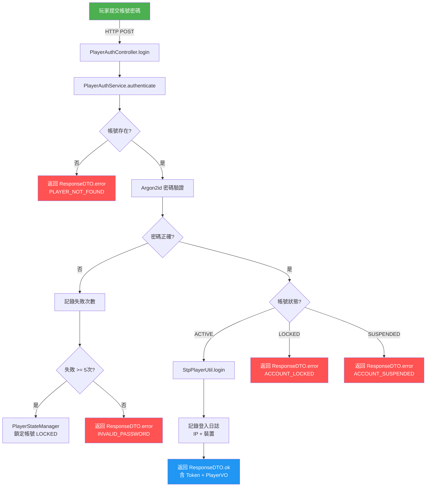
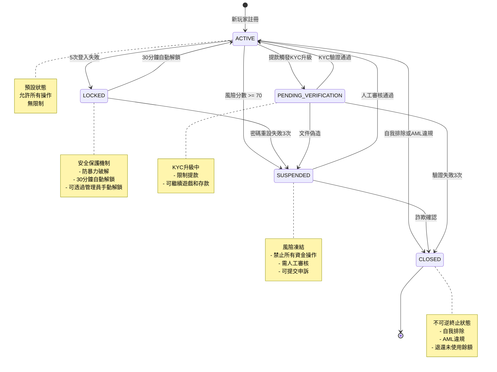
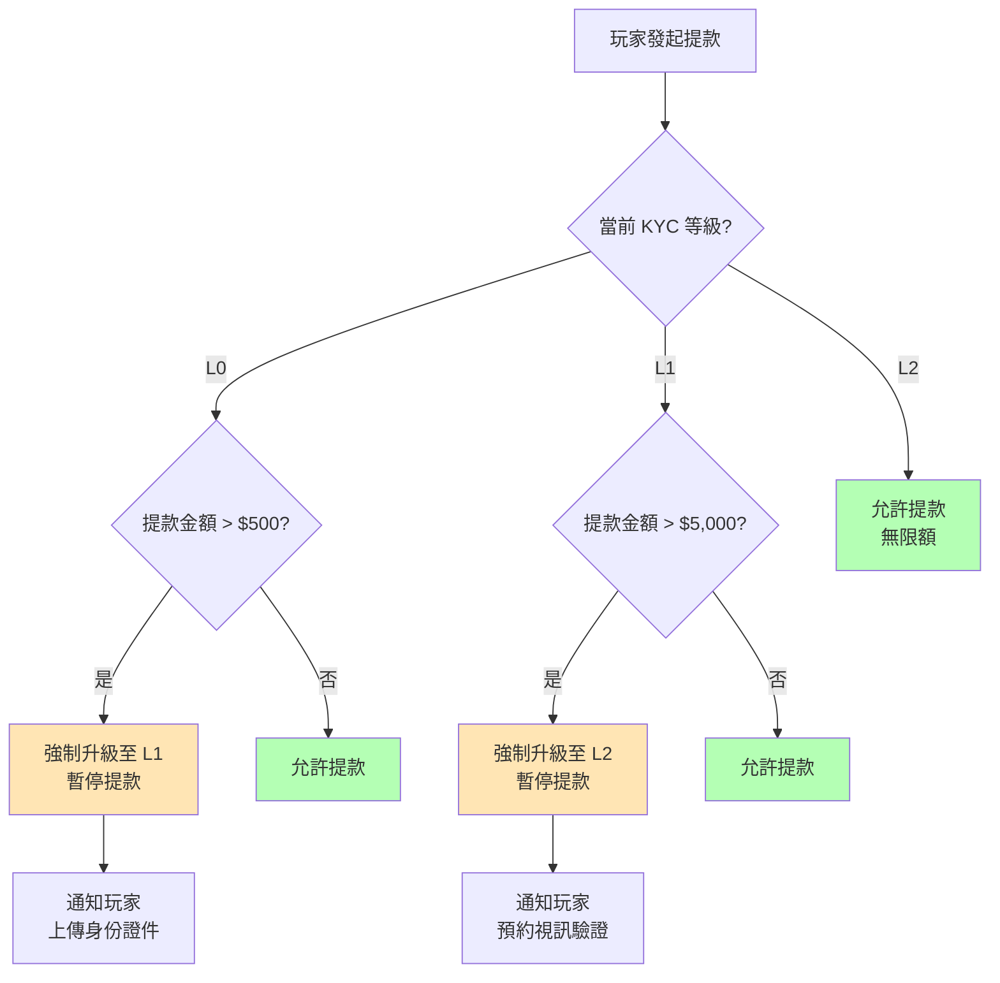

# 玩家管理設計（Player Management Design）

> **模組名稱**: `smartadmin-igaming-player`
> **目標讀者（Audience）**: 架構師、後端開發人員
> **業務需求（Business Requirements）**: [Player_Lifecycle.md](../requirements/01_Player_Experience/04_Player_Lifecycle.md)
> **架構參考**: [01_Player_Lifecycle_Implementation.md](../architecture/01_Player_Service/01_Player_Lifecycle_Implementation.md)
> **Phase**: Phase 2 - Implementation Design
> **最後更新（Last Updated）**: 2026-02-14

---

## 1. 模組概述（Module Overview）

`smartadmin-igaming-player` 模組負責管理玩家完整生命週期，涵蓋以下核心功能：

| 功能領域 | 說明 | 依賴模組 |
|---------|------|---------|
| **玩家認證** | 登入、註冊、Token 管理 | `smartadmin-common-token` |
| **PII 加密** | AES-256-GCM + Blind Index | `smartadmin-common-security` |
| **身份驗證 (KYC)** | 三級驗證體系 | 外部 KYC 供應商 |
| **VIP 等級** | 五級升降級規則 | LiteFlow 規則引擎 |
| **IP 定位** | 玩家地理位置偵測 | `smartadmin-common-ip-geolocation` |

**模組位置**：

```
smartadmin-modules/
└── smartadmin-igaming-player/
    └── src/main/java/net/lab1024/sa/business/player/
        ├── controller/     # PlayerController
        ├── service/        # PlayerService (Vavr Option)
        ├── manager/        # PlayerManager (@Transactional)
        ├── dao/            # PlayerDao (MyBatis)
        ├── domain/
        │   ├── entity/     # PlayerEntity
        │   ├── form/       # PlayerAddForm, PlayerUpdateForm, PlayerQueryForm
        │   └── vo/         # PlayerVO
        └── enums/          # PlayerStatusEnum, KycLevelEnum, VipLevelEnum
```

---

## 2. 玩家認證設計（Player Authentication Design）

### 2.1 Sa-Token 多帳號體系（Multi-Account System）

iGaming 平台需同時支援**玩家端**與**管理後台端**認證，採用 Sa-Token 多帳號體系實現隔離。

```java
/**
 * Player StpLogic - independent token space from admin
 *
 * Sa-Token multi-account: each account type has its own StpLogic
 * - Admin: StpUtil (default)
 * - Player: StpPlayerUtil (custom)
 */
public class StpPlayerUtil {

    public static final String TYPE = "player";

    public static final StpLogic stpLogic = new StpLogic(TYPE) {
        @Override
        public SaTokenConfig getConfigOrGlobal() {
            SaTokenConfig config = new SaTokenConfig();
            config.setTokenName("player-token");
            config.setTimeout(7 * 24 * 60 * 60);     // 7 days
            config.setActiveTimeout(30 * 60);          // 30 minutes idle
            config.setTokenStyle("uuid");
            config.setIsShare(false);
            return config;
        }
    };

    // Proxy methods
    public static String getTokenValue() {
        return stpLogic.getTokenValue();
    }

    public static void login(Object id) {
        stpLogic.login(id);
    }

    public static void logout() {
        stpLogic.logout();
    }

    public static boolean isLogin() {
        return stpLogic.isLogin();
    }

    public static Long getLoginIdAsLong() {
        return stpLogic.getLoginIdAsLong();
    }
}
```

**隔離機制**：

| 維度 | 管理後台（Admin） | 玩家端（Player） |
|------|-----------------|-----------------|
| StpLogic | `StpUtil`（預設） | `StpPlayerUtil`（自定義） |
| Token Name | `satoken` | `player-token` |
| Token 有效期 | 8 小時 | 7 天 |
| 閒置超時 | 30 分鐘 | 30 分鐘 |
| Token Style | `uuid` | `uuid` |

### 2.2 玩家登入流程（Player Login Flow）



### 2.3 註冊流程與 PII 加密（Registration with PII Encryption）

註冊時，玩家的敏感資料（PII）使用 AES-256-GCM 加密存儲，同時生成 HMAC-SHA256 盲索引 (Blind Index) 以支援加密後的查詢。

```java
/**
 * Player registration - encrypt PII fields before persistence
 *
 * Leverages: smartadmin-common-security (EncryptionService, BlindIndexService)
 */
@Component
@RequiredArgsConstructor
public class PlayerRegistrationManager {

    private final PlayerDao playerDao;
    private final WalletDao walletDao;
    private final EncryptionService encryptionService;
    private final BlindIndexService blindIndexService;

    @Transactional(rollbackFor = Throwable.class)
    public Option<PlayerVO> registerPlayer(PlayerAddForm form) {
        // 1. Check uniqueness via blind index
        String emailIndex = blindIndexService.computeIndex(form.getEmail());
        if (playerDao.existsByEmailIndex(emailIndex)) {
            return Option.none();
        }

        // 2. Build entity with encrypted PII
        PlayerEntity entity = new PlayerEntity();
        entity.setUsername(form.getUsername());
        entity.setPasswordHash(Argon2idUtil.hash(form.getPassword()));
        entity.setEncryptedEmail(encryptionService.encrypt(form.getEmail()));
        entity.setEmailIndex(emailIndex);
        entity.setEncryptedPhone(encryptionService.encrypt(form.getPhone()));
        entity.setPhoneIndex(blindIndexService.computeIndex(form.getPhone()));
        entity.setStatus(PlayerStatusEnum.ACTIVE);
        entity.setKycLevel(KycLevelEnum.L0);
        entity.setVipLevel(VipLevelEnum.BRONZE);

        // 3. Insert player
        playerDao.insert(entity);

        // 4. Initialize wallet with zero balance
        WalletEntity wallet = WalletEntity.builder()
            .playerId(entity.getPlayerId())
            .balance(BigDecimal.ZERO)
            .frozenBalance(BigDecimal.ZERO)
            .currency(form.getCurrency())
            .build();
        walletDao.insert(wallet);

        // 5. Return VO
        return Option.of(SmartBeanUtil.copy(entity, PlayerVO.class));
    }
}
```

---

## 3. 玩家狀態機（Player State Machine）

### 3.1 五大狀態定義（Five States）

| 狀態 | 說明 | 允許操作 | 限制 |
|------|------|---------|------|
| `ACTIVE` | 正常活動 (Active) | 全部操作 | 無 |
| `LOCKED` | 安全鎖定 (Locked) | 查看餘額 | 禁止登入、交易 |
| `SUSPENDED` | 風險凍結 (Suspended) | 無 | 禁止所有操作，需人工審核 |
| `PENDING_VERIFICATION` | 待驗證 (Pending Verification) | 存款、遊戲 | 禁止提款 |
| `CLOSED` | 已關閉 (Closed) | 無 | 帳號終止，不可逆 |

### 3.2 狀態轉換圖（State Transition Diagram）



### 3.3 PlayerStateManager 實作

```java
/**
 * Player state machine - manages state transitions
 *
 * @Transactional in Manager layer only (SmartAdmin convention)
 */
@Slf4j
@Component
@RequiredArgsConstructor
public class PlayerStateManager {

    private final PlayerDao playerDao;
    private final PlayerAuditLogDao auditLogDao;

    /**
     * Valid state transitions
     */
    private static final Map<PlayerStatusEnum, Set<PlayerStatusEnum>> TRANSITIONS = Map.of(
        PlayerStatusEnum.ACTIVE, Set.of(
            PlayerStatusEnum.LOCKED,
            PlayerStatusEnum.SUSPENDED,
            PlayerStatusEnum.PENDING_VERIFICATION,
            PlayerStatusEnum.CLOSED
        ),
        PlayerStatusEnum.LOCKED, Set.of(
            PlayerStatusEnum.ACTIVE,
            PlayerStatusEnum.SUSPENDED
        ),
        PlayerStatusEnum.SUSPENDED, Set.of(
            PlayerStatusEnum.ACTIVE,
            PlayerStatusEnum.CLOSED
        ),
        PlayerStatusEnum.PENDING_VERIFICATION, Set.of(
            PlayerStatusEnum.ACTIVE,
            PlayerStatusEnum.SUSPENDED,
            PlayerStatusEnum.CLOSED
        ),
        PlayerStatusEnum.CLOSED, Set.of()
    );

    @Transactional(rollbackFor = Throwable.class)
    public Try<PlayerStatusEnum> transitionState(Long playerId,
                                                  PlayerStatusEnum targetState,
                                                  String reason,
                                                  Long operatorId) {
        return Try.of(() -> {
            PlayerEntity player = playerDao.selectById(playerId);
            if (player == null) {
                throw new BusinessException(UserErrorCode.PLAYER_NOT_FOUND);
            }

            PlayerStatusEnum currentState = player.getStatus();

            // Validate transition
            Set<PlayerStatusEnum> allowed = TRANSITIONS.getOrDefault(
                currentState, Set.of());
            if (!allowed.contains(targetState)) {
                throw new BusinessException(UserErrorCode.INVALID_STATE_TRANSITION);
            }

            // Execute transition
            player.setStatus(targetState);
            playerDao.updateById(player);

            // Audit log
            PlayerAuditLogEntity auditLog = PlayerAuditLogEntity.builder()
                .playerId(playerId)
                .fromStatus(currentState)
                .toStatus(targetState)
                .reason(reason)
                .operatorId(operatorId)
                .build();
            auditLogDao.insert(auditLog);

            log.info("Player {} state transition: {} -> {} (reason: {})",
                playerId, currentState, targetState, reason);

            return targetState;
        });
    }
}
```

---

## 4. KYC 三級驗證（Three-Level KYC Verification）

### 4.1 驗證等級定義

iGaming 平台採用漸進式身份驗證 (KYC, Know Your Customer) 體系。POC 階段簡化實作，保留完整擴展點。

| KYC 等級 | 名稱 | 驗證內容 | 提款限額 | 觸發條件 |
|---------|------|---------|---------|---------|
| `L0` (Basic) | 基本驗證 | 僅 Email 驗證 | $500/月 | 註冊時 |
| `L1` (Standard) | 標準驗證 | 身份證件上傳 + OCR | $5,000/月 | 提款 > $500 |
| `L2` (Enhanced) | 增強驗證 | 視訊通話驗證 | 無限額 | 提款 > $5,000 或 VIP Gold+ |

### 4.2 KYC 升級觸發規則



### 4.3 KycVerificationService

```java
/**
 * KYC verification service - orchestrates three-level verification
 *
 * POC scope: L0 email-only, L1 document upload (mocked OCR), L2 placeholder
 */
@Slf4j
@Service
@RequiredArgsConstructor
public class KycVerificationService {

    private final PlayerDao playerDao;
    private final KycDocumentDao kycDocumentDao;
    private final PlayerStateManager playerStateManager;

    /**
     * Check if KYC upgrade is required before withdrawal
     */
    public Option<KycUpgradeRequirement> checkWithdrawalEligibility(
            Long playerId, BigDecimal amount) {
        return Option.of(playerDao.selectById(playerId))
            .flatMap(player -> {
                KycLevelEnum currentLevel = player.getKycLevel();
                if (currentLevel == KycLevelEnum.L0
                        && amount.compareTo(new BigDecimal("500")) > 0) {
                    return Option.of(new KycUpgradeRequirement(
                        KycLevelEnum.L1, "Withdrawal exceeds L0 limit"));
                }
                if (currentLevel == KycLevelEnum.L1
                        && amount.compareTo(new BigDecimal("5000")) > 0) {
                    return Option.of(new KycUpgradeRequirement(
                        KycLevelEnum.L2, "Withdrawal exceeds L1 limit"));
                }
                return Option.none();
            });
    }

    /**
     * Submit L1 KYC: document upload (single-table - direct Dao call)
     */
    public Try<Boolean> submitL1Document(Long playerId,
                                          KycDocumentForm form) {
        return Try.of(() -> {
            KycDocumentEntity doc = SmartBeanUtil.copy(form, KycDocumentEntity.class);
            doc.setPlayerId(playerId);
            doc.setStatus(KycDocumentStatusEnum.PENDING);
            kycDocumentDao.insert(doc);
            return true;
        });
    }
}
```

---

## 5. VIP 五級系統（Five-Level VIP System）

### 5.1 VIP 等級定義

| VIP 等級 | 名稱 | 月有效投注額 (Monthly Turnover) 門檻 | 返水比例 (Rebate) | 專屬權益 |
|---------|------|-----------------------------------|--------------------|---------|
| `BRONZE` | 銅牌 | $0 | 0.1% | 基本服務 |
| `SILVER` | 銀牌 | $10,000 | 0.3% | 優先客服 |
| `GOLD` | 金牌 | $50,000 | 0.5% | 專屬活動、快速提款 |
| `PLATINUM` | 白金 | $200,000 | 0.8% | 個人客戶經理 |
| `DIAMOND` | 鑽石 | $1,000,000 | 1.2% | VIP 旅遊、定制優惠 |

### 5.2 升降級規則

- **升級（Promotion）**：月有效投注額達到門檻即自動升級
- **降級（Demotion）**：連續 3 個月未達當前等級門檻的 50% 則降一級
- **保級保護（Grace Period）**：升級後首月免降級

### 5.3 VipLevelService 搭配 LiteFlow

```java
/**
 * VIP level evaluation service
 *
 * Uses LiteFlow rules for promotion/demotion logic
 * - Promotion: monthly turnover >= threshold
 * - Demotion: 3 consecutive months below 50% threshold
 */
@Slf4j
@Service
@RequiredArgsConstructor
public class VipLevelService {

    private final PlayerDao playerDao;
    private final VipLevelManager vipLevelManager;
    private final FlowExecutor flowExecutor;

    /**
     * Evaluate VIP level for a player (read-only check - direct Dao)
     */
    public Option<VipEvaluationResult> evaluateVipLevel(Long playerId) {
        return Option.of(playerDao.selectById(playerId))
            .map(player -> {
                // Execute LiteFlow chain for VIP evaluation
                LiteflowResponse response = flowExecutor.execute2Resp(
                    "vipEvaluationChain", player, VipEvaluationResult.class);
                return response.getFirstContextBean(VipEvaluationResult.class);
            });
    }

    /**
     * Apply VIP level change (needs @Transactional - delegate to Manager)
     */
    public Try<Boolean> applyVipLevelChange(Long playerId,
                                             VipLevelEnum newLevel) {
        return vipLevelManager.updateVipLevel(playerId, newLevel);
    }
}
```

### 5.4 VipLevelManager

```java
/**
 * VIP level manager - handles transactional VIP operations
 */
@Slf4j
@Component
@RequiredArgsConstructor
public class VipLevelManager {

    private final PlayerDao playerDao;
    private final VipChangeLogDao vipChangeLogDao;

    @Transactional(rollbackFor = Throwable.class)
    public Try<Boolean> updateVipLevel(Long playerId, VipLevelEnum newLevel) {
        return Try.of(() -> {
            PlayerEntity player = playerDao.selectById(playerId);
            VipLevelEnum oldLevel = player.getVipLevel();

            // Update player VIP level
            player.setVipLevel(newLevel);
            playerDao.updateById(player);

            // Record change log
            VipChangeLogEntity changeLog = VipChangeLogEntity.builder()
                .playerId(playerId)
                .fromLevel(oldLevel)
                .toLevel(newLevel)
                .changeType(newLevel.ordinal() > oldLevel.ordinal()
                    ? VipChangeTypeEnum.PROMOTION
                    : VipChangeTypeEnum.DEMOTION)
                .build();
            vipChangeLogDao.insert(changeLog);

            log.info("Player {} VIP level changed: {} -> {}",
                playerId, oldLevel, newLevel);
            return true;
        });
    }
}
```

### 5.5 LiteFlow VIP 評估規則（VIP Evaluation Rule）

```xml
<!-- vip-evaluation-chain.el.xml -->
<flow>
    <chain name="vipEvaluationChain">
        THEN(
            calculateMonthlyTurnover,
            checkPromotionEligibility,
            checkDemotionRisk,
            determineNewLevel
        );
    </chain>
</flow>
```

---

## 6. 分層設計代碼（Layered Architecture Code）

### 6.1 PlayerController

```java
package net.lab1024.sa.business.player.controller;

import cn.dev33.satoken.annotation.SaCheckPermission;
import lombok.RequiredArgsConstructor;
import net.lab1024.sa.business.player.domain.form.PlayerAddForm;
import net.lab1024.sa.business.player.domain.form.PlayerQueryForm;
import net.lab1024.sa.business.player.domain.form.PlayerUpdateForm;
import net.lab1024.sa.business.player.domain.vo.PlayerVO;
import net.lab1024.sa.business.player.service.PlayerService;
import net.lab1024.sa.common.core.domain.response.PageResult;
import net.lab1024.sa.common.core.domain.response.ResponseDTO;
import org.springframework.web.bind.annotation.*;

import javax.validation.Valid;

/**
 * Player Management Controller
 */
@RestController
@RequestMapping("/api/player")
@RequiredArgsConstructor
public class PlayerController {

    private final PlayerService playerService;

    @PostMapping("/register")
    public ResponseDTO<PlayerVO> register(@RequestBody @Valid PlayerAddForm form) {
        return playerService.registerPlayer(form);
    }

    @GetMapping("/{playerId}")
    @SaCheckPermission("player:view")
    public ResponseDTO<PlayerVO> getPlayer(@PathVariable Long playerId) {
        return playerService.getPlayer(playerId)
            .map(ResponseDTO::ok)
            .getOrElse(() -> ResponseDTO.error(UserErrorCode.PLAYER_NOT_FOUND));
    }

    @PostMapping("/query")
    @SaCheckPermission("player:query")
    public ResponseDTO<PageResult<PlayerVO>> queryPlayers(
            @RequestBody @Valid PlayerQueryForm form) {
        return ResponseDTO.ok(playerService.queryPlayers(form));
    }

    @PutMapping("/{playerId}")
    @SaCheckPermission("player:update")
    public ResponseDTO<Void> updatePlayer(@PathVariable Long playerId,
                                           @RequestBody @Valid PlayerUpdateForm form) {
        return playerService.updatePlayer(playerId, form)
            .fold(
                error -> ResponseDTO.error(UserErrorCode.PLAYER_UPDATE_FAILED),
                success -> ResponseDTO.ok()
            );
    }
}
```

### 6.2 PlayerService

```java
package net.lab1024.sa.business.player.service;

import io.vavr.control.Option;
import io.vavr.control.Try;
import lombok.RequiredArgsConstructor;
import lombok.extern.slf4j.Slf4j;
import net.lab1024.sa.business.player.dao.PlayerDao;
import net.lab1024.sa.business.player.domain.entity.PlayerEntity;
import net.lab1024.sa.business.player.domain.form.PlayerAddForm;
import net.lab1024.sa.business.player.domain.form.PlayerQueryForm;
import net.lab1024.sa.business.player.domain.form.PlayerUpdateForm;
import net.lab1024.sa.business.player.domain.vo.PlayerVO;
import net.lab1024.sa.business.player.manager.PlayerRegistrationManager;
import net.lab1024.sa.common.core.domain.response.PageResult;
import net.lab1024.sa.common.core.domain.response.ResponseDTO;
import net.lab1024.sa.common.core.util.SmartBeanUtil;
import net.lab1024.sa.common.mybatis.util.SmartPageUtil;
import org.springframework.stereotype.Service;

/**
 * Player business logic Service
 *
 * - Single-table reads: direct Dao access
 * - Multi-table writes: delegate to Manager
 * - Uses Vavr Option (NOT java.util.Optional)
 */
@Slf4j
@Service
@RequiredArgsConstructor
public class PlayerService {

    private final PlayerDao playerDao;
    private final PlayerRegistrationManager playerRegistrationManager;

    /**
     * Register player (multi-table - delegate to Manager)
     */
    public ResponseDTO<PlayerVO> registerPlayer(PlayerAddForm form) {
        return playerRegistrationManager.registerPlayer(form)
            .map(ResponseDTO::ok)
            .getOrElse(() -> ResponseDTO.error(UserErrorCode.EMAIL_ALREADY_EXISTS));
    }

    /**
     * Get player by ID (single-table read - direct Dao)
     */
    public Option<PlayerVO> getPlayer(Long playerId) {
        return Option.of(playerDao.selectById(playerId))
            .map(entity -> SmartBeanUtil.copy(entity, PlayerVO.class));
    }

    /**
     * Query players with pagination (single-table read - direct Dao)
     */
    public PageResult<PlayerVO> queryPlayers(PlayerQueryForm form) {
        return SmartPageUtil.convert2PageQuery(form, pageParam ->
            playerDao.queryPlayers(pageParam, form), PlayerVO.class);
    }

    /**
     * Update player info (single-table update - direct Dao)
     */
    public Try<Boolean> updatePlayer(Long playerId, PlayerUpdateForm form) {
        return Try.of(() -> {
            PlayerEntity entity = SmartBeanUtil.copy(form, PlayerEntity.class);
            entity.setPlayerId(playerId);
            return playerDao.updateById(entity) > 0;
        });
    }
}
```

### 6.3 PlayerDao

```java
package net.lab1024.sa.business.player.dao;

import com.baomidou.mybatisplus.core.mapper.BaseMapper;
import com.baomidou.mybatisplus.extension.plugins.pagination.Page;
import net.lab1024.sa.business.player.domain.entity.PlayerEntity;
import net.lab1024.sa.business.player.domain.form.PlayerQueryForm;
import net.lab1024.sa.business.player.domain.vo.PlayerVO;
import org.apache.ibatis.annotations.Mapper;
import org.apache.ibatis.annotations.Param;

/**
 * Player Dao - MyBatis Mapper with blind index queries
 */
@Mapper
public interface PlayerDao extends BaseMapper<PlayerEntity> {

    /**
     * Check if email blind index already exists
     */
    boolean existsByEmailIndex(@Param("emailIndex") String emailIndex);

    /**
     * Query player by email blind index
     */
    PlayerEntity selectByEmailIndex(@Param("emailIndex") String emailIndex);

    /**
     * Query player by phone blind index
     */
    PlayerEntity selectByPhoneIndex(@Param("phoneIndex") String phoneIndex);

    /**
     * Paginated player query
     */
    Page<PlayerVO> queryPlayers(Page<?> page, @Param("form") PlayerQueryForm form);
}
```

---

## 7. IP 地理定位（IP Geolocation）

### 7.1 設計概述

利用 `smartadmin-common-ip-geolocation` 模組（基於 ip2region 離線資料庫），在玩家登入、存款、提款時偵測 IP 地理位置，用於：

- **司法管轄區檢查（Jurisdiction Check）**：判斷玩家所在地區是否允許遊戲
- **風險偵測**：偵測短時間內的異常 IP 切換
- **登入日誌**：記錄每次登入的地理位置

### 7.2 整合代碼

```java
/**
 * Player IP geolocation integration
 *
 * Uses smartadmin-common-ip-geolocation (ip2region)
 */
@Slf4j
@Service
@RequiredArgsConstructor
public class PlayerGeoService {

    private final IpGeoLocationService ipGeoLocationService;
    private final PlayerDao playerDao;

    /**
     * Resolve player location from IP (read-only - direct service call)
     */
    public Option<GeoLocation> resolvePlayerLocation(String ipAddress) {
        return Option.of(ipGeoLocationService.getLocation(ipAddress));
    }

    /**
     * Check if player IP is within allowed jurisdictions
     */
    public boolean isJurisdictionAllowed(Long tenantId, String ipAddress) {
        GeoLocation location = ipGeoLocationService.getLocation(ipAddress);
        if (location == null) {
            log.warn("Cannot resolve IP geolocation: {}", ipAddress);
            return false;
        }
        // Check against tenant's allowed jurisdiction list
        return jurisdictionConfigService.isAllowed(tenantId, location.getCountryCode());
    }
}
```

---

## 8. 資料庫架構（Database Schema）

```sql
CREATE TABLE t_player (
    player_id       BIGSERIAL PRIMARY KEY,
    tenant_id       INT NOT NULL,
    username        VARCHAR(64) NOT NULL,
    password_hash   VARCHAR(255) NOT NULL,
    encrypted_email VARCHAR(512),
    email_index     CHAR(64),
    encrypted_phone VARCHAR(512),
    phone_index     CHAR(64),
    status          VARCHAR(32) NOT NULL DEFAULT 'ACTIVE',
    kyc_level       VARCHAR(16) NOT NULL DEFAULT 'L0',
    vip_level       VARCHAR(16) NOT NULL DEFAULT 'BRONZE',
    registration_ip VARCHAR(45),
    last_login_ip   VARCHAR(45),
    last_login_time TIMESTAMP,
    deleted         BOOLEAN NOT NULL DEFAULT FALSE,
    create_time     TIMESTAMP NOT NULL DEFAULT CURRENT_TIMESTAMP,
    update_time     TIMESTAMP NOT NULL DEFAULT CURRENT_TIMESTAMP
);

COMMENT ON TABLE t_player IS '玩家主表';
COMMENT ON COLUMN t_player.player_id IS '玩家唯一標識';
COMMENT ON COLUMN t_player.tenant_id IS '租戶 ID（Multi-Tenant 隔離）';
COMMENT ON COLUMN t_player.encrypted_email IS 'AES-256-GCM 加密郵箱';
COMMENT ON COLUMN t_player.email_index IS 'HMAC-SHA256 郵箱盲索引';
COMMENT ON COLUMN t_player.status IS '帳號狀態：ACTIVE/LOCKED/SUSPENDED/PENDING_VERIFICATION/CLOSED';
COMMENT ON COLUMN t_player.kyc_level IS 'KYC 等級：L0/L1/L2';
COMMENT ON COLUMN t_player.vip_level IS 'VIP 等級：BRONZE/SILVER/GOLD/PLATINUM/DIAMOND';
COMMENT ON COLUMN t_player.deleted IS '邏輯刪除標記（SmartAdmin 規範：deleted 非 isDeleted）';

-- Indexes
CREATE INDEX idx_player_tenant_id ON t_player(tenant_id);
CREATE UNIQUE INDEX idx_player_email_index ON t_player(email_index) WHERE deleted = FALSE;
CREATE UNIQUE INDEX idx_player_phone_index ON t_player(phone_index) WHERE deleted = FALSE;
CREATE INDEX idx_player_status ON t_player(tenant_id, status);
CREATE INDEX idx_player_vip ON t_player(tenant_id, vip_level);

-- Row-Level Security
ALTER TABLE t_player ENABLE ROW LEVEL SECURITY;
CREATE POLICY tenant_isolation ON t_player
    USING (tenant_id = current_setting('app.current_tenant_id')::INT);
```

---

## 參考文件（References）

| 文件 | 說明 |
|------|------|
| [01_Player_Lifecycle_Implementation.md](../architecture/01_Player_Service/01_Player_Lifecycle_Implementation.md) | 玩家生命週期技術實作 |
| [01_Data_Security_Standard.md](../architecture/12_Security/01_Data_Security_Standard.md) | 資料安全標準 |
| [03_Blind_Index_Architecture.md](../architecture/12_Security/03_Blind_Index_Architecture.md) | 盲索引架構 |
| [05_Authentication_Architecture.md](../architecture/09_Infrastructure/05_Authentication_Architecture.md) | 認證架構 |
| [TRANSLATION_GLOSSARY.md](../TRANSLATION_GLOSSARY.md) | 翻譯詞彙表 |

---

**文件版本**: 1.0.0
**創建日期**: 2026-02-14
**Phase**: Phase 2 - Implementation Design
