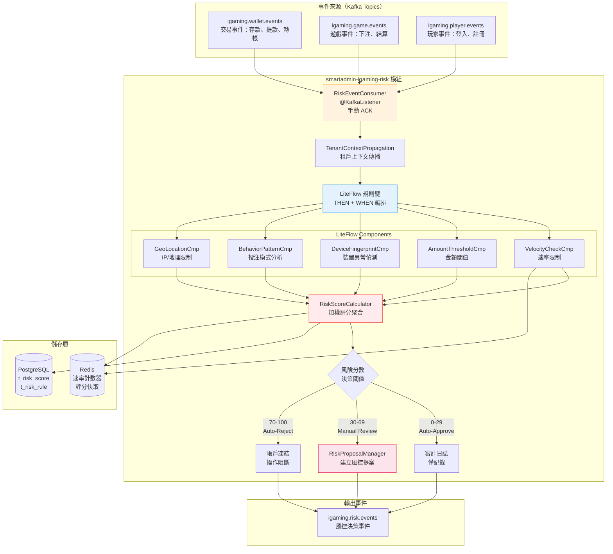
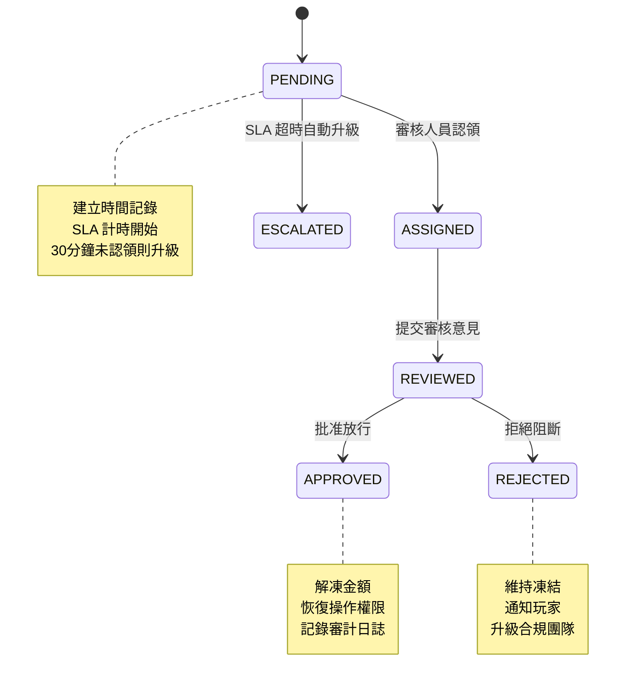
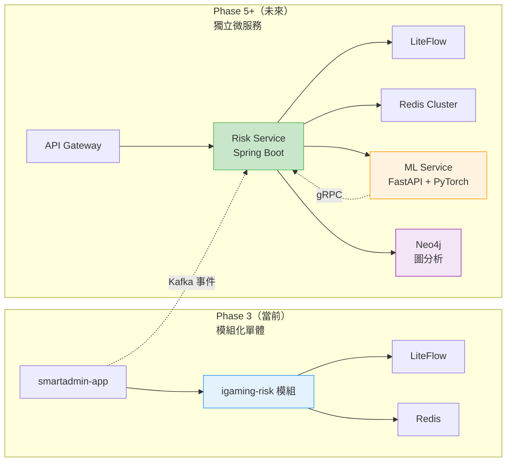

# 風控引擎設計（Risk Engine Design）

> **模組**: `smartadmin-igaming-risk`
> **Phase**: 3 — LiteFlow-based 風控引擎
> **目標讀者**: 架構師、後端工程師、風控團隊
> **前置依賴**: Phase 2 完成（需要真實事件源：Wallet, Player, Game）
> **相關架構文檔**:
>   - [01_Risk_System_Architecture.md](../architecture/05_Risk_Engine/01_Risk_System_Architecture.md)
>   - [02_Risk_Implementation.md](../architecture/05_Risk_Engine/02_Risk_Implementation.md)
>   - [07_Risk_Proposal_Implementation.md](../architecture/05_Risk_Engine/07_Risk_Proposal_Implementation.md)
> **ADR 參考**: [ADR-012: 異步風控提案系統](../architecture/adr/ADR-012_Async_Risk_Proposal_System.md)
> **最後更新**: 2026-02-14
> **文檔版本**: 1.0.0

---

## 1. 架構概述（Architecture Overview）

### 1.1 設計目標

`smartadmin-igaming-risk` 模組在 Phase 3 範疇內採用**事件驅動架構（Event-Driven Architecture）**，以 LiteFlow 規則引擎為核心，實現即時風控評估。本階段**不包含** Flink 串流處理、ML 模型推理、Neo4j 圖資料庫等進階元件。

**核心流程**: Kafka 事件消費 → LiteFlow 規則鏈評估 → 風險評分計算 → 決策分發

**風險評分量表 (Risk Score)**:
- **0-29**: 自動放行（Auto-Approve），僅記錄審計日誌
- **30-69**: 人工審核（Manual Review），建立風控提案 (Risk Proposal)
- **70-100**: 自動拒絕（Auto-Reject），立即凍結或阻斷操作

### 1.2 元件架構圖



### 1.3 SmartAdmin 分層架構映射

| 層級 | 類別 | 職責 |
|------|------|------|
| **Controller** | `RiskRuleController`, `RiskScoreController` | 規則管理 API、評分查詢 API (`@SaCheckPermission`) |
| **Service** | `RiskEvaluationService`, `RiskRuleService` | 規則匹配邏輯、評分聚合 (Vavr `Option`) |
| **Manager** | `RiskProposalManager`, `RiskScoreManager` | `@Transactional` 提案建立、`@Cacheable` 規則快取 |
| **Dao** | `RiskRuleDao`, `RiskScoreDao`, `RiskProposalDao` | MyBatis Plus 資料存取 |

### 1.4 基礎設施依賴

| SmartAdmin 模組 | 用途 |
|----------------|------|
| `smartadmin-support-liteflow` | LiteFlow 2.15.3 規則引擎，SQL-based 規則儲存 |
| `smartadmin-common-mq` | Kafka Consumer 即時事件處理 |
| `smartadmin-common-redis` | Redis 速率限制計數器、評分快取 |
| `smartadmin-support-operatelog` | 操作日誌記錄 |
| `smartadmin-support-datatracer` | 資料追蹤審計 |

---

## 2. LiteFlow 風控規則設計

### 2.1 規則儲存模式（SQL Mode）

所有規則定義儲存於 PostgreSQL，LiteFlow 透過 SQL Mode 載入規則，支援執行時期熱更新。

```sql
-- LiteFlow 規則定義表（由 smartadmin-support-liteflow 管理）
CREATE TABLE t_liteflow_chain (
    id              BIGSERIAL PRIMARY KEY,
    application_name VARCHAR(64) NOT NULL DEFAULT 'igaming-risk',
    chain_name      VARCHAR(64) NOT NULL,
    chain_desc      VARCHAR(256),
    el_data         TEXT NOT NULL,              -- LiteFlow EL 表達式
    enable          BOOLEAN NOT NULL DEFAULT TRUE,
    tenant_id       BIGINT NOT NULL,
    created_at      TIMESTAMP NOT NULL DEFAULT NOW(),
    updated_at      TIMESTAMP NOT NULL DEFAULT NOW()
);

-- 風控規則參數配置表
CREATE TABLE t_risk_rule_param (
    id              BIGSERIAL PRIMARY KEY,
    rule_code       VARCHAR(64) NOT NULL,       -- 對應 LiteFlow Component ID
    rule_name       VARCHAR(128) NOT NULL,
    rule_type       VARCHAR(32) NOT NULL,       -- VELOCITY, AMOUNT, DEVICE, BEHAVIOR, GEO
    weight          NUMERIC(5,2) NOT NULL DEFAULT 1.00,
    max_score       INT NOT NULL DEFAULT 100,
    params          JSONB NOT NULL DEFAULT '{}', -- 規則參數（閾值、窗口等）
    enabled         BOOLEAN NOT NULL DEFAULT TRUE,
    version         INT NOT NULL DEFAULT 1,
    tenant_id       BIGINT NOT NULL,
    created_at      TIMESTAMP NOT NULL DEFAULT NOW(),
    updated_at      TIMESTAMP NOT NULL DEFAULT NOW(),
    deleted         BOOLEAN NOT NULL DEFAULT FALSE
);

CREATE INDEX idx_risk_rule_param_type ON t_risk_rule_param(rule_type, enabled);
CREATE INDEX idx_risk_rule_param_tenant ON t_risk_rule_param(tenant_id, enabled);
```

### 2.2 LiteFlow EL 表達式（風控規則鏈）

```
THEN(
    VelocityCheckCmp,
    AmountThresholdCmp,
    WHEN(
        DeviceFingerprintCmp,
        BehaviorPatternCmp,
        GeoLocationCmp
    )
);
```

**執行語義**:
- `THEN`: 串行執行 — `VelocityCheckCmp` 和 `AmountThresholdCmp` 依序執行（速率和金額為前置檢查）
- `WHEN`: 並行執行 — `DeviceFingerprintCmp`、`BehaviorPatternCmp`、`GeoLocationCmp` 同時評估以降低延遲

### 2.3 LiteFlow 風控元件實作

#### 2.3.1 VelocityCheckCmp — 速率限制

```java
package net.lab1024.sa.igaming.risk.component;

import com.yomahub.liteflow.annotation.LiteflowComponent;
import com.yomahub.liteflow.core.NodeComponent;
import lombok.RequiredArgsConstructor;
import lombok.extern.slf4j.Slf4j;
import org.springframework.data.redis.core.StringRedisTemplate;

import java.time.Duration;

/**
 * Velocity check component - Rate limiting via Redis sliding window
 * Detects abnormal operation frequency (e.g., max 100 bets/minute)
 */
@Slf4j
@LiteflowComponent("VelocityCheckCmp")
@RequiredArgsConstructor
public class VelocityCheckCmp extends NodeComponent {

    private final StringRedisTemplate redisTemplate;

    private static final int DEFAULT_MAX_OPS_PER_MINUTE = 100;
    private static final int DEFAULT_MAX_WITHDRAWALS_PER_HOUR = 5;
    private static final Duration WINDOW_ONE_MINUTE = Duration.ofMinutes(1);
    private static final Duration WINDOW_ONE_HOUR = Duration.ofHours(1);

    @Override
    public void process() throws Exception {
        RiskContext context = this.getContextBean(RiskContext.class);
        Long playerId = context.getPlayerId();
        String eventType = context.getEventType();

        int score = 0;

        // Check bet frequency (sliding window counter in Redis)
        String betKey = String.format("risk:velocity:bet:%d", playerId);
        Long betCount = redisTemplate.opsForValue().increment(betKey);
        if (betCount != null && betCount == 1) {
            redisTemplate.expire(betKey, WINDOW_ONE_MINUTE);
        }

        if (betCount != null && betCount > DEFAULT_MAX_OPS_PER_MINUTE) {
            score = 40;
            log.warn("[VelocityCheck] High bet frequency: playerId={}, count={}/min",
                playerId, betCount);
        } else if (betCount != null && betCount > DEFAULT_MAX_OPS_PER_MINUTE / 2) {
            score = 15;
        }

        // Check withdrawal frequency
        if ("WITHDRAWAL_REQUESTED".equals(eventType)) {
            String wdKey = String.format("risk:velocity:wd:%d", playerId);
            Long wdCount = redisTemplate.opsForValue().increment(wdKey);
            if (wdCount != null && wdCount == 1) {
                redisTemplate.expire(wdKey, WINDOW_ONE_HOUR);
            }

            if (wdCount != null && wdCount > DEFAULT_MAX_WITHDRAWALS_PER_HOUR) {
                score = Math.max(score, 50);
                log.warn("[VelocityCheck] High withdrawal frequency: playerId={}, count={}/hour",
                    playerId, wdCount);
            }
        }

        context.addRuleScore("VelocityCheckCmp", score);
        log.debug("[VelocityCheck] playerId={}, score={}", playerId, score);
    }
}
```

#### 2.3.2 AmountThresholdCmp — 金額閾值

```java
package net.lab1024.sa.igaming.risk.component;

import com.yomahub.liteflow.annotation.LiteflowComponent;
import com.yomahub.liteflow.core.NodeComponent;
import lombok.RequiredArgsConstructor;
import lombok.extern.slf4j.Slf4j;

import java.math.BigDecimal;

/**
 * Amount threshold component - Flags transactions exceeding configured limits
 * e.g., single bet > $10,000 or withdrawal > $50,000
 */
@Slf4j
@LiteflowComponent("AmountThresholdCmp")
@RequiredArgsConstructor
public class AmountThresholdCmp extends NodeComponent {

    private static final BigDecimal SINGLE_BET_HIGH = new BigDecimal("10000");
    private static final BigDecimal SINGLE_BET_MEDIUM = new BigDecimal("5000");
    private static final BigDecimal WITHDRAWAL_HIGH = new BigDecimal("50000");
    private static final BigDecimal WITHDRAWAL_MEDIUM = new BigDecimal("10000");

    @Override
    public void process() throws Exception {
        RiskContext context = this.getContextBean(RiskContext.class);
        BigDecimal amount = context.getAmount();
        String eventType = context.getEventType();

        int score = 0;

        if ("WALLET_DEBITED".equals(eventType) || "BET_PLACED".equals(eventType)) {
            if (amount.compareTo(SINGLE_BET_HIGH) > 0) {
                score = 50;
                log.warn("[AmountThreshold] High bet amount: playerId={}, amount={}",
                    context.getPlayerId(), amount);
            } else if (amount.compareTo(SINGLE_BET_MEDIUM) > 0) {
                score = 20;
            }
        }

        if ("WITHDRAWAL_REQUESTED".equals(eventType)) {
            if (amount.compareTo(WITHDRAWAL_HIGH) > 0) {
                score = 60;
                log.warn("[AmountThreshold] High withdrawal amount: playerId={}, amount={}",
                    context.getPlayerId(), amount);
            } else if (amount.compareTo(WITHDRAWAL_MEDIUM) > 0) {
                score = 25;
            }
        }

        context.addRuleScore("AmountThresholdCmp", score);
        log.debug("[AmountThreshold] playerId={}, amount={}, score={}",
            context.getPlayerId(), amount, score);
    }
}
```

#### 2.3.3 DeviceFingerprintCmp — 裝置異常偵測

```java
package net.lab1024.sa.igaming.risk.component;

import com.yomahub.liteflow.annotation.LiteflowComponent;
import com.yomahub.liteflow.core.NodeComponent;
import lombok.RequiredArgsConstructor;
import lombok.extern.slf4j.Slf4j;
import org.springframework.data.redis.core.StringRedisTemplate;

/**
 * Device fingerprint component - Detects device anomalies
 * Checks: new device, multiple accounts on same device, emulator detection
 */
@Slf4j
@LiteflowComponent("DeviceFingerprintCmp")
@RequiredArgsConstructor
public class DeviceFingerprintCmp extends NodeComponent {

    private final StringRedisTemplate redisTemplate;
    private final DeviceFingerprintDao deviceFingerprintDao;

    private static final int MAX_ACCOUNTS_PER_DEVICE = 3;

    @Override
    public void process() throws Exception {
        RiskContext context = this.getContextBean(RiskContext.class);
        String deviceId = context.getDeviceId();
        Long playerId = context.getPlayerId();

        int score = 0;

        if (deviceId == null || deviceId.isBlank()) {
            // No device fingerprint — suspicious
            score = 30;
            log.warn("[DeviceFingerprint] Missing device fingerprint: playerId={}", playerId);
            context.addRuleScore("DeviceFingerprintCmp", score);
            return;
        }

        // Check if device is new for this player
        String knownDeviceKey = String.format("risk:device:%d:%s", playerId, deviceId);
        Boolean isKnown = redisTemplate.hasKey(knownDeviceKey);
        if (Boolean.FALSE.equals(isKnown)) {
            score = 15;
            log.info("[DeviceFingerprint] New device detected: playerId={}, deviceId={}",
                playerId, deviceId);
        }

        // Check multiple accounts on same device
        String deviceAccountsKey = String.format("risk:device:accounts:%s", deviceId);
        Long accountCount = redisTemplate.opsForSet().size(deviceAccountsKey);
        redisTemplate.opsForSet().add(deviceAccountsKey, String.valueOf(playerId));

        if (accountCount != null && accountCount > MAX_ACCOUNTS_PER_DEVICE) {
            score = Math.max(score, 60);
            log.warn("[DeviceFingerprint] Multi-account device: deviceId={}, accountCount={}",
                deviceId, accountCount);
        }

        // Check emulator flag from device metadata
        if (context.getDeviceMetadata() != null
                && Boolean.TRUE.equals(context.getDeviceMetadata().get("emulator"))) {
            score = Math.max(score, 70);
            log.warn("[DeviceFingerprint] Emulator detected: playerId={}", playerId);
        }

        context.addRuleScore("DeviceFingerprintCmp", score);
        log.debug("[DeviceFingerprint] playerId={}, deviceId={}, score={}",
            playerId, deviceId, score);
    }
}
```

#### 2.3.4 BehaviorPatternCmp — 投注模式分析

```java
package net.lab1024.sa.igaming.risk.component;

import com.yomahub.liteflow.annotation.LiteflowComponent;
import com.yomahub.liteflow.core.NodeComponent;
import lombok.RequiredArgsConstructor;
import lombok.extern.slf4j.Slf4j;

import java.math.BigDecimal;
import java.math.RoundingMode;

/**
 * Behavior pattern component - Analyzes betting patterns
 * Detects: all-in pattern, martingale strategy, suspicious win rate
 */
@Slf4j
@LiteflowComponent("BehaviorPatternCmp")
@RequiredArgsConstructor
public class BehaviorPatternCmp extends NodeComponent {

    private final RiskScoreDao riskScoreDao;

    private static final BigDecimal ALL_IN_RATIO_THRESHOLD = new BigDecimal("0.90");
    private static final BigDecimal SUSPICIOUS_WIN_RATE = new BigDecimal("0.75");
    private static final int MIN_BETS_FOR_ANALYSIS = 20;

    @Override
    public void process() throws Exception {
        RiskContext context = this.getContextBean(RiskContext.class);
        Long playerId = context.getPlayerId();

        int score = 0;

        // Fetch recent betting summary (last 24 hours)
        PlayerBettingSummary summary = riskScoreDao.getRecentBettingSummary(
            playerId, context.getTenantId()
        );

        if (summary == null || summary.getTotalBets() < MIN_BETS_FOR_ANALYSIS) {
            context.addRuleScore("BehaviorPatternCmp", 0);
            return;
        }

        // All-in pattern detection: single bet > 90% of balance
        if (context.getAmount() != null && context.getPlayerBalance() != null
                && context.getPlayerBalance().compareTo(BigDecimal.ZERO) > 0) {
            BigDecimal ratio = context.getAmount().divide(
                context.getPlayerBalance(), 4, RoundingMode.HALF_UP
            );
            if (ratio.compareTo(ALL_IN_RATIO_THRESHOLD) > 0) {
                score = 35;
                log.warn("[BehaviorPattern] All-in pattern: playerId={}, ratio={}",
                    playerId, ratio);
            }
        }

        // Suspicious win rate (> 75% over 20+ bets)
        if (summary.getTotalBets() >= MIN_BETS_FOR_ANALYSIS) {
            BigDecimal winRate = BigDecimal.valueOf(summary.getWinCount())
                .divide(BigDecimal.valueOf(summary.getTotalBets()), 4, RoundingMode.HALF_UP);
            if (winRate.compareTo(SUSPICIOUS_WIN_RATE) > 0) {
                score = Math.max(score, 45);
                log.warn("[BehaviorPattern] Suspicious win rate: playerId={}, winRate={}",
                    playerId, winRate);
            }
        }

        // Martingale strategy detection: doubling bets after losses
        if (summary.getConsecutiveLossDoubleCount() >= 3) {
            score = Math.max(score, 30);
            log.info("[BehaviorPattern] Martingale pattern: playerId={}, doubleCount={}",
                playerId, summary.getConsecutiveLossDoubleCount());
        }

        context.addRuleScore("BehaviorPatternCmp", score);
        log.debug("[BehaviorPattern] playerId={}, score={}", playerId, score);
    }
}
```

#### 2.3.5 GeoLocationCmp — IP/地理限制

```java
package net.lab1024.sa.igaming.risk.component;

import com.yomahub.liteflow.annotation.LiteflowComponent;
import com.yomahub.liteflow.core.NodeComponent;
import lombok.RequiredArgsConstructor;
import lombok.extern.slf4j.Slf4j;
import org.springframework.data.redis.core.StringRedisTemplate;

/**
 * Geo-location component - IP/location-based risk assessment
 * Checks: restricted jurisdictions, VPN/proxy detection, location mismatch
 */
@Slf4j
@LiteflowComponent("GeoLocationCmp")
@RequiredArgsConstructor
public class GeoLocationCmp extends NodeComponent {

    private final StringRedisTemplate redisTemplate;
    private final GeoRestrictionDao geoRestrictionDao;

    @Override
    public void process() throws Exception {
        RiskContext context = this.getContextBean(RiskContext.class);
        Long playerId = context.getPlayerId();
        String ipAddress = context.getIpAddress();
        String countryCode = context.getCountryCode();

        int score = 0;

        if (ipAddress == null || ipAddress.isBlank()) {
            score = 20;
            log.warn("[GeoLocation] Missing IP address: playerId={}", playerId);
            context.addRuleScore("GeoLocationCmp", score);
            return;
        }

        // Check restricted jurisdictions
        boolean isRestricted = geoRestrictionDao.isRestrictedCountry(
            countryCode, context.getTenantId()
        );
        if (isRestricted) {
            score = 80;
            log.warn("[GeoLocation] Restricted jurisdiction: playerId={}, country={}",
                playerId, countryCode);
            context.addRuleScore("GeoLocationCmp", score);
            return;
        }

        // VPN/proxy detection
        if (Boolean.TRUE.equals(context.getDeviceMetadata().get("vpn"))) {
            score = 30;
            log.info("[GeoLocation] VPN detected: playerId={}, ip={}", playerId, ipAddress);
        }

        // Location mismatch: IP country differs from registered country
        String lastKnownCountry = redisTemplate.opsForValue().get(
            String.format("risk:geo:last:%d", playerId)
        );
        if (lastKnownCountry != null && !lastKnownCountry.equals(countryCode)) {
            score = Math.max(score, 25);
            log.info("[GeoLocation] Location mismatch: playerId={}, registered={}, current={}",
                playerId, lastKnownCountry, countryCode);
        }

        // Update last known location
        redisTemplate.opsForValue().set(
            String.format("risk:geo:last:%d", playerId), countryCode
        );

        context.addRuleScore("GeoLocationCmp", score);
        log.debug("[GeoLocation] playerId={}, country={}, score={}",
            playerId, countryCode, score);
    }
}
```

### 2.4 QLExpress 動態規則腳本

LiteFlow 支援 QLExpress 腳本用於動態規則邏輯，無需重啟即可修改:

```groovy
// QLExpress script example: Dynamic amount threshold by game type
// Stored in t_liteflow_chain.el_data as script node
def gameType = context.getGameType();
def amount = context.getAmount();

def threshold = 10000;
if (gameType == "SLOTS") {
    threshold = 5000;
} else if (gameType == "LIVE_CASINO") {
    threshold = 20000;
} else if (gameType == "SPORTS") {
    threshold = 50000;
}

if (amount > threshold) {
    context.addRuleScore("DynamicAmountScript", 40);
} else if (amount > threshold * 0.5) {
    context.addRuleScore("DynamicAmountScript", 15);
} else {
    context.addRuleScore("DynamicAmountScript", 0);
}
```

### 2.5 RiskContext 共享上下文

```java
package net.lab1024.sa.igaming.risk.domain;

import lombok.Data;

import java.math.BigDecimal;
import java.util.LinkedHashMap;
import java.util.Map;

/**
 * Shared risk evaluation context passed through LiteFlow chain.
 * Each component reads event data and writes its rule score.
 */
@Data
public class RiskContext {
    // Event data
    private Long playerId;
    private Long tenantId;
    private String eventType;
    private String eventId;
    private BigDecimal amount;
    private BigDecimal playerBalance;

    // Device data
    private String deviceId;
    private String ipAddress;
    private String countryCode;
    private Map<String, Object> deviceMetadata;

    // Game data
    private String gameType;
    private String gameCode;

    // Rule scores (component ID -> score)
    private final Map<String, Integer> ruleScores = new LinkedHashMap<>();

    public void addRuleScore(String componentId, int score) {
        ruleScores.put(componentId, Math.min(score, 100));
    }

    /**
     * Calculate weighted total score from all rule outputs
     */
    public int calculateTotalScore(Map<String, BigDecimal> weights) {
        double total = 0.0;
        double totalWeight = 0.0;

        for (Map.Entry<String, Integer> entry : ruleScores.entrySet()) {
            BigDecimal weight = weights.getOrDefault(entry.getKey(), BigDecimal.ONE);
            total += entry.getValue() * weight.doubleValue();
            totalWeight += weight.doubleValue();
        }

        if (totalWeight == 0) {
            return 0;
        }
        return (int) Math.round(total / totalWeight);
    }
}
```

---

## 3. Kafka 事件消費者

### 3.1 RiskEventConsumer

```java
package net.lab1024.sa.igaming.risk.consumer;

import com.yomahub.liteflow.core.FlowExecutor;
import com.yomahub.liteflow.flow.LiteflowResponse;
import io.vavr.control.Try;
import lombok.RequiredArgsConstructor;
import lombok.extern.slf4j.Slf4j;
import net.lab1024.sa.igaming.risk.domain.RiskContext;
import net.lab1024.sa.igaming.risk.service.RiskEvaluationService;
import org.apache.kafka.clients.consumer.ConsumerRecord;
import org.springframework.kafka.annotation.KafkaListener;
import org.springframework.kafka.support.Acknowledgment;
import org.springframework.stereotype.Component;

/**
 * Kafka consumer for risk evaluation events.
 * Listens to wallet, game, and player event topics.
 * Uses manual acknowledgment for at-least-once delivery guarantee.
 */
@Slf4j
@Component
@RequiredArgsConstructor
public class RiskEventConsumer {

    private final RiskEvaluationService riskEvaluationService;
    private final FlowExecutor flowExecutor;

    @KafkaListener(
        topics = {
            "igaming.wallet.events",
            "igaming.game.events",
            "igaming.player.events"
        },
        groupId = "igaming-risk-group",
        containerFactory = "riskKafkaListenerContainerFactory"
    )
    public void onEvent(ConsumerRecord<String, String> record, Acknowledgment ack) {
        String topic = record.topic();
        String eventJson = record.value();

        Try.run(() -> {
            // 1. Parse event and extract tenant context
            RiskEvent event = parseEvent(eventJson);
            propagateTenantContext(event.getTenantId());

            log.info("[RiskConsumer] Processing event: topic={}, eventType={}, playerId={}",
                topic, event.getEventType(), event.getPlayerId());

            // 2. Route to appropriate handler based on event type
            switch (event.getEventType()) {
                case "WALLET_DEBITED" -> handleWalletDebited(event);
                case "WITHDRAWAL_REQUESTED" -> handleWithdrawalRequested(event);
                case "BET_PLACED" -> handleBetPlaced(event);
                case "PLAYER_LOGIN" -> handlePlayerLogin(event);
                default -> log.debug("[RiskConsumer] Skipping unhandled event type: {}",
                    event.getEventType());
            }

            // 3. Acknowledge after successful processing
            ack.acknowledge();

        }).onFailure(e -> {
            log.error("[RiskConsumer] Failed to process event: topic={}, offset={}, error={}",
                topic, record.offset(), e.getMessage(), e);
            // Do NOT acknowledge — message will be redelivered
        });
    }

    private void handleWalletDebited(RiskEvent event) {
        RiskContext context = buildContext(event);
        riskEvaluationService.evaluateAndDispatch(context);
    }

    private void handleWithdrawalRequested(RiskEvent event) {
        RiskContext context = buildContext(event);
        // Withdrawal uses the same risk chain but with higher scrutiny
        riskEvaluationService.evaluateAndDispatch(context);
    }

    private void handleBetPlaced(RiskEvent event) {
        RiskContext context = buildContext(event);
        riskEvaluationService.evaluateAndDispatch(context);
    }

    private void handlePlayerLogin(RiskEvent event) {
        // Login events only trigger geo-location and device checks
        RiskContext context = buildContext(event);
        context.setAmount(null); // No amount for login events
        riskEvaluationService.evaluateLoginRisk(context);
    }

    private RiskContext buildContext(RiskEvent event) {
        RiskContext context = new RiskContext();
        context.setPlayerId(event.getPlayerId());
        context.setTenantId(event.getTenantId());
        context.setEventType(event.getEventType());
        context.setEventId(event.getEventId());
        context.setAmount(event.getAmount());
        context.setPlayerBalance(event.getPlayerBalance());
        context.setDeviceId(event.getDeviceId());
        context.setIpAddress(event.getIpAddress());
        context.setCountryCode(event.getCountryCode());
        context.setDeviceMetadata(event.getDeviceMetadata());
        context.setGameType(event.getGameType());
        context.setGameCode(event.getGameCode());
        return context;
    }

    private RiskEvent parseEvent(String json) {
        return JsonUtil.toObject(json, RiskEvent.class);
    }

    private void propagateTenantContext(Long tenantId) {
        TenantContextHolder.setTenantId(tenantId);
    }
}
```

### 3.2 Kafka Consumer 配置

```java
package net.lab1024.sa.igaming.risk.config;

import org.apache.kafka.clients.consumer.ConsumerConfig;
import org.apache.kafka.common.serialization.StringDeserializer;
import org.springframework.context.annotation.Bean;
import org.springframework.context.annotation.Configuration;
import org.springframework.kafka.config.ConcurrentKafkaListenerContainerFactory;
import org.springframework.kafka.core.ConsumerFactory;
import org.springframework.kafka.core.DefaultKafkaConsumerFactory;
import org.springframework.kafka.listener.ContainerProperties;

import java.util.HashMap;
import java.util.Map;

/**
 * Kafka consumer configuration for risk event processing.
 * Manual ACK mode ensures at-least-once delivery.
 */
@Configuration
public class RiskKafkaConfig {

    @Bean
    public ConcurrentKafkaListenerContainerFactory<String, String>
            riskKafkaListenerContainerFactory() {

        ConcurrentKafkaListenerContainerFactory<String, String> factory =
            new ConcurrentKafkaListenerContainerFactory<>();
        factory.setConsumerFactory(riskConsumerFactory());
        factory.setConcurrency(3); // 3 consumer threads
        factory.getContainerProperties().setAckMode(ContainerProperties.AckMode.MANUAL);

        return factory;
    }

    @Bean
    public ConsumerFactory<String, String> riskConsumerFactory() {
        Map<String, Object> props = new HashMap<>();
        props.put(ConsumerConfig.BOOTSTRAP_SERVERS_CONFIG, "${spring.kafka.bootstrap-servers}");
        props.put(ConsumerConfig.GROUP_ID_CONFIG, "igaming-risk-group");
        props.put(ConsumerConfig.KEY_DESERIALIZER_CLASS_CONFIG, StringDeserializer.class);
        props.put(ConsumerConfig.VALUE_DESERIALIZER_CLASS_CONFIG, StringDeserializer.class);
        props.put(ConsumerConfig.ENABLE_AUTO_COMMIT_CONFIG, false);
        props.put(ConsumerConfig.MAX_POLL_RECORDS_CONFIG, 100);
        props.put(ConsumerConfig.AUTO_OFFSET_RESET_CONFIG, "latest");
        return new DefaultKafkaConsumerFactory<>(props);
    }
}
```

---

## 4. 風險評分模型（Rule-Based Scoring）

### 4.1 雙軌評分體系

風控引擎維護兩種評分維度:

| 評分類型 | 範圍 | 生命週期 | 觸發動作 | 儲存位置 |
|---------|------|---------|---------|---------|
| **即時交易風險分數 (Per-Transaction Risk Score)** | 0-100 | 單次事件 | 訂單狀態 REVIEWING / REJECTED | `t_risk_assessment` |
| **累計檔案風險分數 (Cumulative Profile Risk Score)** | 0-100 | 長期累積 | 帳戶狀態 SUSPENDED / BLOCKED | `t_risk_score` |

### 4.2 即時交易風險分數計算

```java
package net.lab1024.sa.igaming.risk.service;

import com.yomahub.liteflow.core.FlowExecutor;
import com.yomahub.liteflow.flow.LiteflowResponse;
import io.vavr.control.Option;
import lombok.RequiredArgsConstructor;
import lombok.extern.slf4j.Slf4j;
import org.springframework.kafka.core.KafkaTemplate;
import org.springframework.stereotype.Service;

import java.math.BigDecimal;
import java.util.Map;

/**
 * Risk evaluation service - Orchestrates LiteFlow chain execution
 * and dispatches results based on score thresholds.
 *
 * Uses Vavr Option for null-safe rule parameter lookups.
 */
@Slf4j
@Service
@RequiredArgsConstructor
public class RiskEvaluationService {

    private final FlowExecutor flowExecutor;
    private final RiskScoreManager riskScoreManager;
    private final RiskProposalManager riskProposalManager;
    private final RiskRuleDao riskRuleDao;
    private final KafkaTemplate<String, String> kafkaTemplate;

    // Weight configuration for each rule component
    private static final Map<String, BigDecimal> DEFAULT_WEIGHTS = Map.of(
        "VelocityCheckCmp",      new BigDecimal("0.20"),
        "AmountThresholdCmp",    new BigDecimal("0.25"),
        "DeviceFingerprintCmp",  new BigDecimal("0.20"),
        "BehaviorPatternCmp",    new BigDecimal("0.20"),
        "GeoLocationCmp",        new BigDecimal("0.15")
    );

    // Decision thresholds
    private static final int THRESHOLD_AUTO_APPROVE = 30;
    private static final int THRESHOLD_AUTO_REJECT = 70;

    /**
     * Execute risk evaluation and dispatch result
     */
    public void evaluateAndDispatch(RiskContext context) {
        // 1. Execute LiteFlow risk chain
        LiteflowResponse response = flowExecutor.execute2Resp(
            "riskEvaluationChain", null, context
        );

        if (!response.isSuccess()) {
            log.error("[RiskEval] LiteFlow chain failed: eventId={}, message={}",
                context.getEventId(), response.getMessage());
            return;
        }

        // 2. Calculate weighted total score
        Map<String, BigDecimal> weights = loadWeights(context.getTenantId());
        int totalScore = context.calculateTotalScore(weights);

        // 3. Persist per-transaction score
        riskScoreManager.saveTransactionScore(context, totalScore);

        // 4. Update cumulative profile score
        riskScoreManager.updateProfileScore(context.getPlayerId(), totalScore);

        // 5. Dispatch action based on thresholds
        dispatchAction(context, totalScore);

        log.info("[RiskEval] Completed: eventId={}, playerId={}, score={}, rules={}",
            context.getEventId(), context.getPlayerId(),
            totalScore, context.getRuleScores());
    }

    /**
     * Evaluate login-specific risk (subset of rules)
     */
    public void evaluateLoginRisk(RiskContext context) {
        LiteflowResponse response = flowExecutor.execute2Resp(
            "loginRiskChain", null, context
        );

        if (response.isSuccess()) {
            int score = context.calculateTotalScore(DEFAULT_WEIGHTS);
            riskScoreManager.saveTransactionScore(context, score);
            log.info("[RiskEval] Login risk: playerId={}, score={}", context.getPlayerId(), score);
        }
    }

    private void dispatchAction(RiskContext context, int totalScore) {
        if (totalScore < THRESHOLD_AUTO_APPROVE) {
            // 0-29: Auto-approve, log only
            publishRiskEvent(context, totalScore, "AUTO_APPROVED");
            log.debug("[RiskEval] Auto-approved: playerId={}, score={}",
                context.getPlayerId(), totalScore);

        } else if (totalScore >= THRESHOLD_AUTO_REJECT) {
            // 70-100: Auto-reject, block operation
            riskProposalManager.createUrgentProposal(context, totalScore);
            publishRiskEvent(context, totalScore, "AUTO_REJECTED");
            log.warn("[RiskEval] Auto-rejected: playerId={}, score={}",
                context.getPlayerId(), totalScore);

        } else {
            // 30-69: Manual review, create proposal
            riskProposalManager.createReviewProposal(context, totalScore);
            publishRiskEvent(context, totalScore, "PENDING_REVIEW");
            log.info("[RiskEval] Manual review required: playerId={}, score={}",
                context.getPlayerId(), totalScore);
        }
    }

    private Map<String, BigDecimal> loadWeights(Long tenantId) {
        return Option.of(riskRuleDao.findWeightsByTenant(tenantId))
            .filter(w -> !w.isEmpty())
            .getOrElse(DEFAULT_WEIGHTS);
    }

    private void publishRiskEvent(RiskContext context, int score, String decision) {
        String eventPayload = JsonUtil.toJsonString(Map.of(
            "eventId", context.getEventId(),
            "playerId", context.getPlayerId(),
            "tenantId", context.getTenantId(),
            "score", score,
            "decision", decision,
            "ruleScores", context.getRuleScores(),
            "timestamp", System.currentTimeMillis()
        ));
        kafkaTemplate.send("igaming.risk.events", String.valueOf(context.getPlayerId()), eventPayload);
    }
}
```

### 4.3 評分儲存結構

```sql
-- Per-transaction risk assessment log
CREATE TABLE t_risk_assessment (
    id              BIGSERIAL PRIMARY KEY,
    event_id        VARCHAR(64) NOT NULL UNIQUE,
    player_id       BIGINT NOT NULL,
    tenant_id       BIGINT NOT NULL,
    event_type      VARCHAR(32) NOT NULL,
    risk_score      INT NOT NULL CHECK (risk_score BETWEEN 0 AND 100),
    decision        VARCHAR(32) NOT NULL,       -- AUTO_APPROVED, PENDING_REVIEW, AUTO_REJECTED
    rule_scores     JSONB NOT NULL,             -- {"VelocityCheckCmp": 15, "AmountThresholdCmp": 40, ...}
    event_data      JSONB,
    created_at      TIMESTAMP NOT NULL DEFAULT NOW()
);

CREATE INDEX idx_risk_assessment_player ON t_risk_assessment(player_id, created_at DESC);
CREATE INDEX idx_risk_assessment_score ON t_risk_assessment(risk_score) WHERE risk_score >= 30;
CREATE INDEX idx_risk_assessment_tenant ON t_risk_assessment(tenant_id, created_at DESC);

COMMENT ON TABLE t_risk_assessment IS '即時交易風險評估記錄';
COMMENT ON COLUMN t_risk_assessment.risk_score IS '加權風險分數（0-100）';
COMMENT ON COLUMN t_risk_assessment.rule_scores IS '各規則元件評分明細（JSON）';

-- Cumulative player risk profile
CREATE TABLE t_risk_score (
    id              BIGSERIAL PRIMARY KEY,
    player_id       BIGINT NOT NULL,
    tenant_id       BIGINT NOT NULL,
    profile_score   INT NOT NULL DEFAULT 0 CHECK (profile_score BETWEEN 0 AND 100),
    total_events    INT NOT NULL DEFAULT 0,
    high_risk_count INT NOT NULL DEFAULT 0,     -- Events with score >= 70
    last_event_at   TIMESTAMP,
    risk_level      VARCHAR(16) NOT NULL DEFAULT 'LOW', -- LOW, MEDIUM, HIGH, CRITICAL
    status          VARCHAR(16) NOT NULL DEFAULT 'ACTIVE', -- ACTIVE, SUSPENDED, BLOCKED
    created_at      TIMESTAMP NOT NULL DEFAULT NOW(),
    updated_at      TIMESTAMP NOT NULL DEFAULT NOW(),

    CONSTRAINT uk_risk_score_player_tenant UNIQUE (player_id, tenant_id)
);

CREATE INDEX idx_risk_score_level ON t_risk_score(risk_level, tenant_id);
CREATE INDEX idx_risk_score_status ON t_risk_score(status) WHERE status != 'ACTIVE';

COMMENT ON TABLE t_risk_score IS '玩家累計風險檔案分數';
COMMENT ON COLUMN t_risk_score.profile_score IS '累計檔案風險分數（加權移動平均）';
COMMENT ON COLUMN t_risk_score.risk_level IS '風險等級：LOW(0-29), MEDIUM(30-49), HIGH(50-69), CRITICAL(70+)';
```

### 4.4 RiskScoreManager（@Transactional）

```java
package net.lab1024.sa.igaming.risk.manager;

import lombok.RequiredArgsConstructor;
import lombok.extern.slf4j.Slf4j;
import org.springframework.stereotype.Component;
import org.springframework.transaction.annotation.Transactional;

/**
 * Risk score persistence manager.
 * All database writes go through this Manager layer with @Transactional.
 */
@Slf4j
@Component
@RequiredArgsConstructor
public class RiskScoreManager {

    private final RiskAssessmentDao riskAssessmentDao;
    private final RiskScoreDao riskScoreDao;

    /**
     * Save per-transaction risk assessment
     */
    @Transactional(rollbackFor = Throwable.class)
    public void saveTransactionScore(RiskContext context, int totalScore) {
        RiskAssessmentEntity entity = RiskAssessmentEntity.builder()
            .eventId(context.getEventId())
            .playerId(context.getPlayerId())
            .tenantId(context.getTenantId())
            .eventType(context.getEventType())
            .riskScore(totalScore)
            .decision(determineDecision(totalScore))
            .ruleScores(JsonUtil.toJsonString(context.getRuleScores()))
            .build();

        riskAssessmentDao.insert(entity);
    }

    /**
     * Update cumulative player risk profile using weighted moving average
     */
    @Transactional(rollbackFor = Throwable.class)
    public void updateProfileScore(Long playerId, int transactionScore) {
        RiskScoreEntity profile = riskScoreDao.findByPlayerId(playerId);

        if (profile == null) {
            // Create new profile
            profile = RiskScoreEntity.builder()
                .playerId(playerId)
                .profileScore(transactionScore)
                .totalEvents(1)
                .highRiskCount(transactionScore >= 70 ? 1 : 0)
                .riskLevel(determineRiskLevel(transactionScore))
                .status("ACTIVE")
                .build();
            riskScoreDao.insert(profile);
        } else {
            // Weighted moving average: 70% existing + 30% new
            int newProfileScore = (int) Math.round(
                profile.getProfileScore() * 0.7 + transactionScore * 0.3
            );
            profile.setProfileScore(Math.min(newProfileScore, 100));
            profile.setTotalEvents(profile.getTotalEvents() + 1);
            if (transactionScore >= 70) {
                profile.setHighRiskCount(profile.getHighRiskCount() + 1);
            }
            profile.setRiskLevel(determineRiskLevel(newProfileScore));
            profile.setLastEventAt(LocalDateTime.now());

            // Auto-suspend if cumulative score exceeds threshold
            if (newProfileScore >= 80 && "ACTIVE".equals(profile.getStatus())) {
                profile.setStatus("SUSPENDED");
                log.warn("[RiskScore] Player suspended: playerId={}, profileScore={}",
                    playerId, newProfileScore);
            }

            riskScoreDao.updateById(profile);
        }
    }

    private String determineDecision(int score) {
        if (score < 30) return "AUTO_APPROVED";
        if (score >= 70) return "AUTO_REJECTED";
        return "PENDING_REVIEW";
    }

    private String determineRiskLevel(int score) {
        if (score >= 70) return "CRITICAL";
        if (score >= 50) return "HIGH";
        if (score >= 30) return "MEDIUM";
        return "LOW";
    }
}
```

---

## 5. 風險提案系統（ADR-012）

### 5.1 非同步工作流設計

對於分數介於 30-69 的事件，系統建立風控提案 (Risk Proposal) 供人工審核。此設計遵循 [ADR-012: 異步風控提案系統](../architecture/adr/ADR-012_Async_Risk_Proposal_System.md) 的 Flag 模式。

### 5.2 提案狀態機



### 5.3 RiskProposalManager

```java
package net.lab1024.sa.igaming.risk.manager;

import lombok.RequiredArgsConstructor;
import lombok.extern.slf4j.Slf4j;
import org.springframework.kafka.core.KafkaTemplate;
import org.springframework.stereotype.Component;
import org.springframework.transaction.annotation.Transactional;

/**
 * Risk proposal manager - Creates and manages risk proposals.
 * All @Transactional operations for proposal lifecycle.
 */
@Slf4j
@Component
@RequiredArgsConstructor
public class RiskProposalManager {

    private final RiskProposalDao riskProposalDao;
    private final KafkaTemplate<String, String> kafkaTemplate;

    /**
     * Create proposal for manual review (score 30-69)
     */
    @Transactional(rollbackFor = Throwable.class)
    public void createReviewProposal(RiskContext context, int totalScore) {
        RiskProposalEntity proposal = RiskProposalEntity.builder()
            .proposalNo(generateProposalNo())
            .playerId(context.getPlayerId())
            .tenantId(context.getTenantId())
            .eventId(context.getEventId())
            .eventType(context.getEventType())
            .riskScore(totalScore)
            .suspiciousAmount(context.getAmount())
            .matchedRules(JsonUtil.toJsonString(context.getRuleScores()))
            .priority(totalScore >= 50 ? "HIGH" : "MEDIUM")
            .status("PENDING")
            .slaMinutes(totalScore >= 50 ? 120 : 1440) // 2h or 24h
            .build();

        riskProposalDao.insert(proposal);

        kafkaTemplate.send("igaming.risk.proposals",
            String.valueOf(context.getPlayerId()),
            JsonUtil.toJsonString(proposal));

        log.info("[RiskProposal] Review proposal created: proposalNo={}, playerId={}, score={}",
            proposal.getProposalNo(), context.getPlayerId(), totalScore);
    }

    /**
     * Create urgent proposal for auto-rejected events (score >= 70)
     */
    @Transactional(rollbackFor = Throwable.class)
    public void createUrgentProposal(RiskContext context, int totalScore) {
        RiskProposalEntity proposal = RiskProposalEntity.builder()
            .proposalNo(generateProposalNo())
            .playerId(context.getPlayerId())
            .tenantId(context.getTenantId())
            .eventId(context.getEventId())
            .eventType(context.getEventType())
            .riskScore(totalScore)
            .suspiciousAmount(context.getAmount())
            .matchedRules(JsonUtil.toJsonString(context.getRuleScores()))
            .priority("URGENT")
            .status("PENDING")
            .slaMinutes(30) // 30 minutes for urgent
            .build();

        riskProposalDao.insert(proposal);

        kafkaTemplate.send("igaming.risk.proposals",
            String.valueOf(context.getPlayerId()),
            JsonUtil.toJsonString(proposal));

        log.warn("[RiskProposal] Urgent proposal created: proposalNo={}, playerId={}, score={}",
            proposal.getProposalNo(), context.getPlayerId(), totalScore);
    }

    /**
     * Auto-escalate proposals exceeding SLA
     */
    @Transactional(rollbackFor = Throwable.class)
    public void escalateOverdueProposals() {
        List<RiskProposalEntity> overdue = riskProposalDao.findOverduePending();
        for (RiskProposalEntity proposal : overdue) {
            proposal.setStatus("ESCALATED");
            proposal.setPriority("URGENT");
            riskProposalDao.updateById(proposal);

            log.warn("[RiskProposal] Auto-escalated: proposalNo={}, playerId={}, slaMinutes={}",
                proposal.getProposalNo(), proposal.getPlayerId(), proposal.getSlaMinutes());
        }
    }

    private String generateProposalNo() {
        return String.format("RP-%s-%06d",
            LocalDateTime.now().format(DateTimeFormatter.ofPattern("yyyyMMdd")),
            System.nanoTime() % 1000000);
    }
}
```

### 5.4 SLA 監控排程

```java
package net.lab1024.sa.igaming.risk.job;

import lombok.RequiredArgsConstructor;
import lombok.extern.slf4j.Slf4j;
import org.springframework.scheduling.annotation.Scheduled;
import org.springframework.stereotype.Component;

/**
 * Scheduled job for SLA monitoring.
 * Auto-escalates proposals not reviewed within their SLA window.
 */
@Slf4j
@Component
@RequiredArgsConstructor
public class RiskProposalSLAJob {

    private final RiskProposalManager riskProposalManager;

    /**
     * Check SLA compliance every 5 minutes.
     * Proposals exceeding SLA are auto-escalated to URGENT priority.
     */
    @Scheduled(fixedDelay = 300_000) // 5 minutes
    public void checkSLACompliance() {
        log.debug("[SLA] Running SLA compliance check...");
        riskProposalManager.escalateOverdueProposals();
    }
}
```

---

## 6. 基礎合規功能（POC Simplified）

Phase 3 範疇內的合規功能為簡化版 POC，聚焦核心檢查項目：

### 6.1 反洗錢檢查 (AML, Anti-Money Laundering)

```java
/**
 * AML check: Flag transactions exceeding configurable threshold.
 * Phase 3 POC: Simple threshold check, no complex pattern analysis.
 */
public int checkAmlThreshold(RiskContext context) {
    BigDecimal amlThreshold = new BigDecimal("15000"); // Configurable per tenant

    if (context.getAmount() != null && context.getAmount().compareTo(amlThreshold) > 0) {
        log.warn("[AML] Transaction exceeds threshold: playerId={}, amount={}, threshold={}",
            context.getPlayerId(), context.getAmount(), amlThreshold);
        return 60; // Triggers manual review
    }
    return 0;
}
```

### 6.2 身份驗證觸發 (KYC, Know Your Customer)

```java
/**
 * Auto-upgrade KYC level when cumulative deposit exceeds tier threshold.
 * MGA requirement: >= EUR 2,000 cumulative deposit triggers enhanced KYC.
 */
public void checkKycUpgrade(Long playerId, BigDecimal cumulativeDeposit) {
    if (cumulativeDeposit.compareTo(new BigDecimal("2000")) >= 0) {
        kycService.forceUpgrade(playerId, KycTier.TIER_3_FULL, "AML_CUMULATIVE_DEPOSIT");
        log.info("[KYC] Auto-upgrade triggered: playerId={}, cumulativeDeposit={}",
            playerId, cumulativeDeposit);
    }
}
```

### 6.3 自我排除 (Self-Exclusion) 檢查

```java
/**
 * Check player self-exclusion status before any operation.
 * Must be checked BEFORE risk evaluation to short-circuit processing.
 */
public boolean isPlayerSelfExcluded(Long playerId) {
    return Option.of(playerDao.findById(playerId))
        .filter(p -> "SELF_EXCLUDED".equals(p.getStatus()))
        .isDefined();
}
```

### 6.4 負責任博彩 (Responsible Gambling)

```java
/**
 * Session time and loss limit checks.
 * Phase 3 POC: Basic limit enforcement via Redis counters.
 */
public boolean checkSessionLimits(Long playerId) {
    // Session time limit (default: 8 hours)
    String sessionKey = String.format("player:session:%d", playerId);
    Long sessionMinutes = redisTemplate.opsForValue().increment(sessionKey);
    if (sessionMinutes != null && sessionMinutes > 480) {
        log.warn("[ResponsibleGambling] Session time limit exceeded: playerId={}", playerId);
        return false;
    }

    // Daily loss limit check
    String lossKey = String.format("player:daily_loss:%d", playerId);
    String lossStr = redisTemplate.opsForValue().get(lossKey);
    BigDecimal dailyLoss = lossStr != null ? new BigDecimal(lossStr) : BigDecimal.ZERO;
    BigDecimal lossLimit = playerDao.getDailyLossLimit(playerId);

    if (lossLimit != null && dailyLoss.compareTo(lossLimit) > 0) {
        log.warn("[ResponsibleGambling] Daily loss limit exceeded: playerId={}, loss={}, limit={}",
            playerId, dailyLoss, lossLimit);
        return false;
    }

    return true;
}
```

---

## 7. 規則管理

### 7.1 規則 CRUD API

規則管理透過管理後台 API 進行，遵循 SmartAdmin Controller → Service → Dao 模式：

```java
package net.lab1024.sa.igaming.risk.controller;

import lombok.RequiredArgsConstructor;
import net.lab1024.sa.common.core.domain.response.PageResult;
import net.lab1024.sa.common.core.domain.response.ResponseDTO;
import org.springframework.web.bind.annotation.*;

/**
 * Risk rule management controller (Admin API).
 */
@RestController
@RequestMapping("/admin/risk/rule")
@RequiredArgsConstructor
public class RiskRuleController {

    private final RiskRuleService riskRuleService;

    @PostMapping("/query")
    @SaCheckPermission("risk:rule:query")
    public ResponseDTO<PageResult<RiskRuleVO>> query(@RequestBody @Valid RiskRuleQueryForm form) {
        return ResponseDTO.ok(riskRuleService.queryRules(form));
    }

    @PostMapping("/add")
    @SaCheckPermission("risk:rule:add")
    public ResponseDTO<Void> add(@RequestBody @Valid RiskRuleAddForm form) {
        return riskRuleService.addRule(form);
    }

    @PostMapping("/update")
    @SaCheckPermission("risk:rule:update")
    public ResponseDTO<Void> update(@RequestBody @Valid RiskRuleUpdateForm form) {
        return riskRuleService.updateRule(form);
    }
}
```

### 7.2 規則版本控制

| 狀態 | 說明 | 行為 |
|------|------|------|
| `DRAFT` | 草稿 — 新增或修改中 | 不參與風控評估 |
| `ACTIVE` | 啟用 — 正式生效 | 參與風控評估 |
| `ARCHIVED` | 歸檔 — 已停用 | 不參與風控評估，保留歷史記錄 |

### 7.3 熱更新機制

LiteFlow 原生支援從資料庫即時載入規則，無需重啟應用:

```yaml
# application-risk.yml
liteflow:
  rule-source-ext-data-map:
    url: jdbc:postgresql://${DB_HOST}:5432/smartadmin
    driverClassName: org.postgresql.Driver
    username: ${DB_USER}
    password: ${DB_PASS}
    applicationName: igaming-risk
    chainTableName: t_liteflow_chain
    chainApplicationNameField: application_name
    chainNameField: chain_name
    elDataField: el_data
    enableField: enable
  # Poll interval for rule changes (seconds)
  rule-source-ext-data-poll-time: 30
```

### 7.4 Shadow Mode（A/B 測試）

Shadow Mode 讓新規則在生產環境中評估但不影響決策，用於驗證規則效果:

```java
/**
 * Shadow mode: evaluate rule but do not affect decision.
 * Score is logged for analysis but excluded from total calculation.
 */
public void evaluateInShadowMode(RiskContext context, String ruleCode) {
    int shadowScore = executeRule(ruleCode, context);
    // Log for analysis only — does NOT contribute to totalScore
    log.info("[ShadowMode] Rule={}, playerId={}, shadowScore={}",
        ruleCode, context.getPlayerId(), shadowScore);

    // Persist shadow result for comparison analysis
    riskScoreManager.saveShadowResult(context.getEventId(), ruleCode, shadowScore);
}
```

---

## 8. 監控與告警

### 8.1 關鍵指標

| 指標名稱 | 類型 | 目標值 | 告警閾值 |
|---------|------|-------|---------|
| `risk_evaluation_latency_p99` | Histogram | < 50ms | > 100ms |
| `risk_evaluation_throughput` | Counter | > 5,000 QPS | < 1,000 QPS |
| `risk_alert_count_per_hour` | Counter | - | > 500/hour |
| `risk_false_positive_rate` | Gauge | < 5% | > 10% |
| `risk_kafka_consumer_lag` | Gauge | < 100 | > 1,000 |
| `risk_proposal_pending_count` | Gauge | < 50 | > 200 |
| `risk_liteflow_chain_error_rate` | Gauge | < 0.1% | > 1% |

### 8.2 Prometheus 指標定義

```yaml
# Risk engine metrics
risk_evaluation_duration_seconds:
  type: histogram
  labels: [tenant_id, event_type, decision]
  buckets: [0.005, 0.01, 0.025, 0.05, 0.1, 0.25, 0.5]
  description: "Risk evaluation latency (seconds)"

risk_evaluation_score:
  type: histogram
  labels: [tenant_id, event_type]
  buckets: [10, 20, 30, 40, 50, 60, 70, 80, 90, 100]
  description: "Risk score distribution"

risk_rule_trigger_total:
  type: counter
  labels: [tenant_id, rule_code, decision]
  description: "Number of times each rule was triggered"

risk_proposal_created_total:
  type: counter
  labels: [tenant_id, priority]
  description: "Total risk proposals created"

risk_kafka_consumer_lag:
  type: gauge
  labels: [topic, partition]
  description: "Kafka consumer lag for risk event topics"
```

### 8.3 告警規則

```yaml
groups:
  - name: igaming_risk_alerts
    interval: 30s
    rules:
      - alert: RiskEvaluationLatencyHigh
        expr: histogram_quantile(0.99, rate(risk_evaluation_duration_seconds_bucket[5m])) > 0.1
        for: 5m
        labels:
          severity: warning
          team: risk
        annotations:
          summary: "風控評估 P99 延遲超過 100ms"

      - alert: RiskKafkaConsumerLagHigh
        expr: risk_kafka_consumer_lag > 1000
        for: 10m
        labels:
          severity: critical
          team: backend
        annotations:
          summary: "風控 Kafka Consumer lag 超過 1000"

      - alert: RiskFalsePositiveRateHigh
        expr: risk_false_positive_rate > 0.10
        for: 1h
        labels:
          severity: warning
          team: risk
        annotations:
          summary: "風控誤報率超過 10%"

      - alert: RiskProposalBacklog
        expr: risk_proposal_pending_count > 200
        for: 30m
        labels:
          severity: warning
          team: risk
        annotations:
          summary: "待審核風控提案積壓超過 200 件"
```

---

## 9. Phase 3 結尾：服務抽取評估指標

Phase 3 將風控引擎作為 `smartadmin-igaming-risk` 模組部署於模組化單體架構 (Modular Monolith) 中。以下為評估是否需要抽取為獨立微服務 (Microservice) 的量化指標:

### 9.1 抽取觸發條件

| 指標 | 閾值 | 當前值（POC） | 抽取策略 |
|------|------|-------------|---------|
| **風控 QPS** | > 5,000 QPS | ~500 QPS | 獨立 Spring Boot 服務 + 獨立 Kafka Consumer Group |
| **規則數量** | > 200 條 | ~30 條 | 獨立規則引擎服務 + Redis 規則快取 |
| **ML 模型需求** | 需要 Python ML | 無 | FastAPI + Kafka 橋接，gRPC 推理 |
| **圖資料庫需求** | 關聯分析 > 3 層 | 無 | Neo4j 獨立服務 + Kafka 事件同步 |
| **團隊規模** | 風控團隊 > 5 人 | 2 人 | 獨立部署 + 獨立 CI/CD |

### 9.2 抽取架構預覽



### 9.3 評估儀表板設計

評估指標應透過 Grafana 儀表板持續追蹤:

| 面板 | 資料來源 | 用途 |
|------|---------|------|
| QPS 趨勢圖 | `rate(risk_evaluation_duration_seconds_count[5m])` | 判斷是否接近 5,000 QPS 閾值 |
| 規則數量計數器 | `SELECT COUNT(*) FROM t_risk_rule_param WHERE enabled = true` | 判斷是否超過 200 條規則 |
| P99 延遲趨勢 | `histogram_quantile(0.99, ...)` | 觀察延遲是否因規則增長而上升 |
| Consumer Lag 趨勢 | `risk_kafka_consumer_lag` | 判斷事件處理能力是否不足 |

當上述任一指標持續（> 7 天）超過閾值時，應啟動服務抽取評估流程。

---

## 相關文件（Related Documents）

| 文件 | 路徑 | 說明 |
|------|------|------|
| 風控系統架構 | [01_Risk_System_Architecture.md](../architecture/05_Risk_Engine/01_Risk_System_Architecture.md) | 完整風控架構（含 Flink, ML, Neo4j 遠期規劃） |
| 風控實作指南 | [02_Risk_Implementation.md](../architecture/05_Risk_Engine/02_Risk_Implementation.md) | SmartAdmin 分層實作範例 |
| 風控提案工作流 | [07_Risk_Proposal_Implementation.md](../architecture/05_Risk_Engine/07_Risk_Proposal_Implementation.md) | 非同步審核工作流詳細設計 |
| ADR-012 | [ADR-012_Async_Risk_Proposal_System.md](../architecture/adr/ADR-012_Async_Risk_Proposal_System.md) | 異步風控提案系統架構決策 |
| 模組結構 | [00-module-structure.md](./00-module-structure.md) | iGaming 模組依賴關係與建置配置 |

---

**文檔版本**: 1.0.0
**創建日期**: 2026-02-14
**維護團隊**: iGaming 風控架構組
**Phase 範疇**: Phase 3 — LiteFlow-based 風控引擎（不含 Flink, ML, Neo4j）
