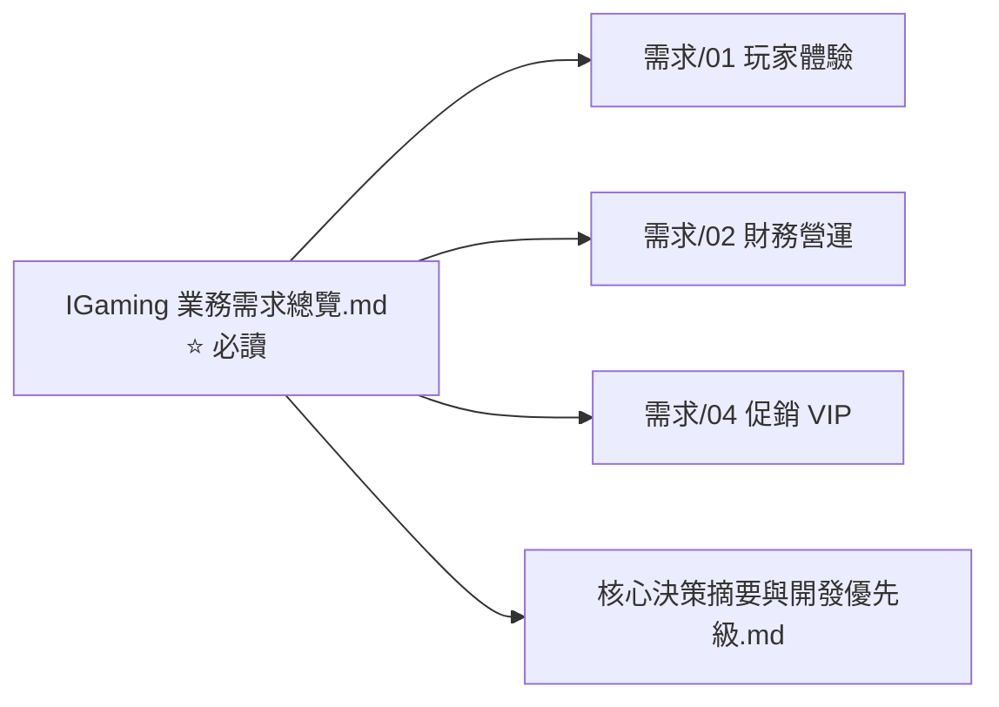
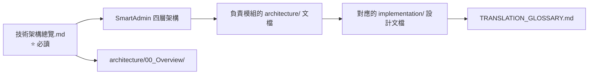

# 按角色導航索引

> **⚠️ v5.0 更新 (2026-03-24)**：文檔已重整為 [requirements-v2/](../../requirements-v2/) 和 [technical-v2/](../../technical-v2/)，請優先使用新版文檔。以下為舊版導航，保留供參考。

> 根據讀者角色推薦的閱讀路徑，從入門到深入。

---

## CEO / 老闆

**目標**: 了解平台商業價值、市場定位、投資回報

| 順序 | 文檔 | 預估閱讀時間 |
|------|------|------------|
| 1 | `IGaming 業務需求總覽.md` | 15 分鐘 |
| 2 | `IGaming 核心決策摘要與開發優先級.md` | 10 分鐘 |
| 3 | `requirements/01_Player_Experience/` (選讀) | 20 分鐘 |
| 4 | `requirements/02_Financial_Operations/` (選讀) | 20 分鐘 |

---

## 產品經理 / PM

**目標**: 掌握功能範圍、用戶旅程、優先級

| 順序 | 文檔 | 預估閱讀時間 |
|------|------|------------|
| 1 | `IGaming 業務需求總覽.md` | 15 分鐘 |
| 2 | `requirements/` 全部 15 個模組 README | 30 分鐘 |
| 3 | `IGaming 文檔缺口與矛盾分析.md` | 10 分鐘 |
| 4 | `IGaming 核心決策摘要與開發優先級.md` | 10 分鐘 |
| 5 | 各模組詳細需求 (按優先級) | 依需要 |

---

## 後端工程師

**目標**: 理解技術架構、開發規範、模組設計

| 順序 | 文檔 | 預估閱讀時間 |
|------|------|------------|
| 1 | `IGaming 技術架構總覽.md` | 20 分鐘 |
| 2 | `architecture/00_Overview/` (5 份) | 60 分鐘 |
| 3 | `TRANSLATION_GLOSSARY.md` | 15 分鐘 |
| 4 | 負責模組的 `architecture/` 詳細文檔 | 依模組 |
| 5 | 負責模組的 `implementation/` 設計文檔 | 依模組 |
| 6 | `architecture/adr/` (3 份 ADR) | 15 分鐘 |

**Day 1 必讀** (2 小時):
- 技術架構總覽 → Overview 5 份 → 詞彙表

**Week 1 完成** (8 小時):
- 負責模組完整文檔 + 相關業務需求

---

## 架構師

**目標**: 評估架構決策、識別技術債、規劃演進

| 順序 | 文檔 | 預估閱讀時間 |
|------|------|------------|
| 1 | `IGaming 技術架構總覽.md` | 20 分鐘 |
| 2 | `IGaming 核心決策摘要與開發優先級.md` | 10 分鐘 |
| 3 | `IGaming 文檔缺口與矛盾分析.md` | 10 分鐘 |
| 4 | `architecture/adr/` (ADR 記錄) | 20 分鐘 |
| 5 | `architecture/00_Overview/` | 60 分鐘 |
| 6 | `implementation/` 全部設計文檔 | 120 分鐘 |
| 7 | `TEMPLATE_ADR.md` + `TEMPLATE_ARCHITECTURE.md` | 15 分鐘 |

---

## DevOps / SRE

**目標**: 了解部署架構、監控、災難恢復

| 順序 | 文檔 | 預估閱讀時間 |
|------|------|------------|
| 1 | `architecture/09_Infrastructure/` (23 份) | 120 分鐘 |
| 2 | `IGaming 技術架構總覽.md` § 十二 (基礎設施) | 10 分鐘 |
| 3 | `requirements/09_Infrastructure_Requirements/` | 20 分鐘 |
| 4 | `implementation/00-infrastructure-gap-analysis.md` | 30 分鐘 |

---

## QA / 測試工程師

**目標**: 理解測試策略、品質標準、測試環境

| 順序 | 文檔 | 預估閱讀時間 |
|------|------|------------|
| 1 | `requirements/09_Infrastructure_Requirements/01_QA_Standards_Requirements.md` | 10 分鐘 |
| 2 | `Sprint-3-Test-Environment-TODO.md` | 15 分鐘 |
| 3 | `testing/turnover-engine-test-coverage-report.md` | 10 分鐘 |
| 4 | `reports/PHASE_1.5_COMPLETION_REPORT.md` | 15 分鐘 |
| 5 | `quality-reports/2026-Q1-quality-gate-report.md` | 10 分鐘 |

---

## 合規人員

**目標**: 確認各牌照合規要求的覆蓋狀態

| 順序 | 文檔 | 預估閱讀時間 |
|------|------|------------|
| 1 | `requirements/05_Risk_Compliance/` (11 份) | 60 分鐘 |
| 2 | `requirements/15_Responsible_Gambling/` (4 份) | 30 分鐘 |
| 3 | `requirements/12_Security_Compliance/` (3 份) | 20 分鐘 |
| 4 | `requirements/06_Governance_Licensing/` (6 份) | 30 分鐘 |
| 5 | `IGaming 業務需求總覽.md` § 六、十三、十四 | 10 分鐘 |
