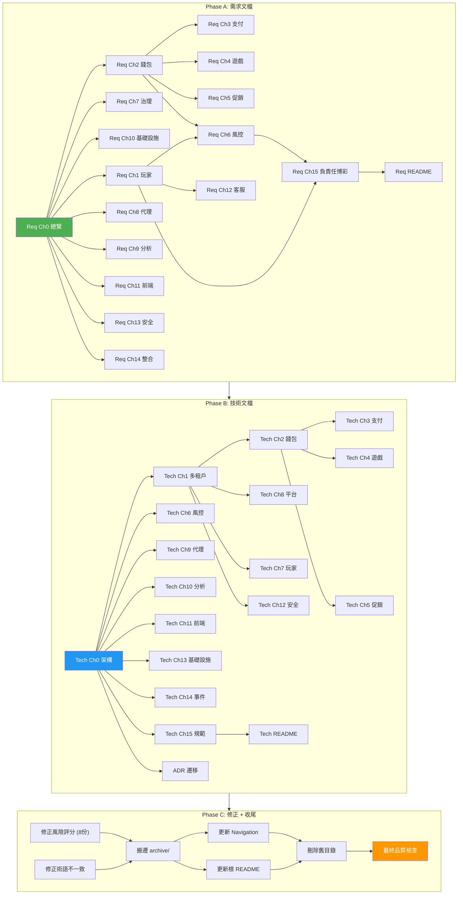

# Sprint Plan: IGaming 文檔重整

**日期**: 2026-03-24 起
**Sprint 目標**: 將 414 份混雜文檔拆分為 requirements-v2/ (純需求) 和 technical-v2/ (純技術) 兩套模組化文件，消除重複與矛盾

---

## 確認決策摘要

| 決策項 | 決定 |
|--------|------|
| 文件粒度 | 每模組獨立文件 (非單一大檔) |
| 目錄結構 | 新建 `requirements-v2/` + `technical-v2/` |
| 檔案命名 | 英文+中文副標：`01_Player_Management_玩家管理.md` |
| 舊總覽文檔 | 移入 `archive/` 保留為歷史 |
| source-archive | 重整完成後刪除 |
| requirements / architecture / implementation | 重整完成後刪除 |
| 風險評分邊界 | 本次一併修正 8 份源文檔 |

---

## 目標結構預覽

```
IGaming/
├── requirements-v2/                    ← 新建 (純需求, 0% 技術)
│   ├── 00_Overview_總覽.md
│   ├── 01_Player_Management_玩家管理.md
│   ├── 02_Wallet_System_錢包系統.md
│   ├── 03_Payment_System_支付系統.md
│   ├── 04_Game_Integration_遊戲整合.md
│   ├── 05_Promotions_VIP_促銷與VIP.md
│   ├── 06_Risk_Compliance_風控與合規.md
│   ├── 07_Governance_Licensing_治理與牌照.md
│   ├── 08_Agent_Operations_代理營運.md
│   ├── 09_Analytics_Reporting_分析與報表.md
│   ├── 10_Infrastructure_基礎設施需求.md
│   ├── 11_Frontend_Experience_前端體驗.md
│   ├── 12_Customer_Service_客戶服務.md
│   ├── 13_Security_Compliance_安全合規.md
│   ├── 14_Third_Party_Integration_第三方整合.md
│   ├── 15_Responsible_Gambling_負責任博彩.md
│   └── README.md
├── technical-v2/                       ← 新建 (架構+實作+ADR)
│   ├── 00_Architecture_Overview_架構總覽.md
│   ├── 01_Multi_Tenant_多租戶架構.md
│   ├── 02_Wallet_Implementation_錢包實作.md
│   ├── 03_Payment_Implementation_支付實作.md
│   ├── 04_Game_Integration_Tech_遊戲整合實作.md
│   ├── 05_Promotion_Engine_促銷引擎實作.md
│   ├── 06_Risk_Engine_風控引擎實作.md
│   ├── 07_Player_Service_玩家服務實作.md
│   ├── 08_Platform_Core_平台核心實作.md
│   ├── 09_Agent_Service_代理服務實作.md
│   ├── 10_Analytics_Service_分析服務實作.md
│   ├── 11_Frontend_Tech_前端實作.md
│   ├── 12_Security_Tech_安全實作.md
│   ├── 13_Infrastructure_基礎設施實作.md
│   ├── 14_Event_Driven_事件驅動設計.md
│   ├── 15_Dev_Standards_開發規範.md
│   ├── ADR/                            ← ADR 完整記錄
│   └── README.md
├── archive/                            ← 歷史文檔
│   ├── IGaming 業務需求總覽.md
│   ├── IGaming 技術架構總覽.md
│   ├── IGaming 文檔缺口與矛盾分析.md
│   ├── IGaming 核心決策摘要與開發優先級.md
│   └── IGaming 文檔品質指標審查報告.md
├── 00_Navigation/                      ← 更新索引
├── TRANSLATION_GLOSSARY.md             ← 更新術語
├── README.md                           ← 更新根索引
└── (templates, testing, reports, research, quality-reports 保留不動)
```

---

## Sprint Backlog

### Phase A: 需求文檔 (requirements-v2/)

| 優先級 | 工作項 | 來源文檔數 | 複雜度 | 依賴 |
|--------|--------|----------|--------|------|
| **P0** | `00_Overview_總覽.md` — 平台定位、商業模式、核心概念、開發階段、詞彙表 | req/01 (6) + sa/00 (12) | 中 | 無 |
| **P0** | `01_Player_Management_玩家管理.md` — 註冊、KYC 四級、VIP、生命週期、RFM | req/01 (2) + sa/01 (5) + arch/01 (1 提取業務) | 高 | Ch0 |
| **P0** | `02_Wallet_System_錢包系統.md` — CASH/BONUS/CREDIT、可下注餘額、回合生命週期、特殊場景 | req/02 (3) + sa/02 (17) + arch/02 (2 提取業務) | 高 | Ch0 |
| **P0** | `03_Payment_System_支付系統.md` — 存提款流程、PSP 路由、七維提款審批、三層對帳 | req/02 (2) + sa/02 (7) | 高 | Ch2 |
| **P0** | `04_Game_Integration_遊戲整合.md` — GP 接入、Token 驗證、大廳、RTP、Jackpot | req/03 (4) + sa/03 (11) | 高 | Ch2 |
| **P0** | `05_Promotions_VIP_促銷與VIP.md` — 紅利類型、流水、衝突策略、區域策略、風控 | req/04 (3) + sa/04 (4) | 中 | Ch2, Ch4 |
| **P0** | `06_Risk_Compliance_風控與合規.md` — 風控規則、風險評分 [0,30)/[30,70)/[70,100]、KYC/AML、詐欺偵測 | req/05 (11) + sa/05 (14) | **最高** | Ch1, Ch2 |
| **P0** | `07_Governance_Licensing_治理與牌照.md` — 多租戶管理、四層層級、MFA、多司法管轄區 | req/06 (6) + sa/06 (13) | 高 | Ch0 |
| **P1** | `08_Agent_Operations_代理營運.md` — 信用網路、佣金模型、結算 | req/07 (2) + sa/07 (2) | 低 | Ch2 |
| **P1** | `09_Analytics_Reporting_分析與報表.md` — 儀表板、數據時效、報表分類 | req/08 (2) + sa/08 (2) | 低 | 無 |
| **P1** | `10_Infrastructure_基礎設施需求.md` — SLA 三級、DR 三級、效能目標、容量規劃 | req/09 (3) + arch/09 (2 提取 SLA/DR) | 中 | 無 |
| **P1** | `11_Frontend_Experience_前端體驗.md` — 多語言、行動 App、SEO、頁面編輯器 | req/11 (4) + sa/11 (10) | 中 | 無 |
| **P1** | `12_Customer_Service_客戶服務.md` — 360° 視圖、AI Chatbot、VIP SLA | req/13 (2) + sa/13 (2) | 低 | Ch1 |
| **P1** | `13_Security_Compliance_安全合規.md` — GDPR、PCI-DSS、ISO 27001、資料保護 | req/12 (3) + sa/12 (8) | 中 | 無 |
| **P1** | `14_Third_Party_Integration_第三方整合.md` — 整合標準、供應商 SLA | req/14 (1) + sa/14 (1) | 低 | 無 |
| **P1** | `15_Responsible_Gambling_負責任博彩.md` — 自我排除、限額、可負擔性 | req/15 (4) + sa/15 (9) | 中 | Ch1, Ch6 |
| **P1** | `requirements-v2/README.md` — 索引 + 閱讀指引 | — | 低 | 全部完成後 |

### Phase B: 技術文檔 (technical-v2/)

| 優先級 | 工作項 | 來源文檔數 | 複雜度 | 依賴 |
|--------|--------|----------|--------|------|
| **P0** | `00_Architecture_Overview_架構總覽.md` — 架構模式、技術棧、SmartAdmin 四層、效能目標 | arch/00 (5) + impl (4 基礎) | 中 | 無 |
| **P0** | `01_Multi_Tenant_多租戶架構.md` — 四層隔離、TenantContext、@TenantIgnore、Impersonation | arch/06/01 + impl/00-multi-tenant + sa/06/06-01 | 中 | Tech-Ch0 |
| **P0** | `02_Wallet_Implementation_錢包實作.md` — 六步原子操作、三層併發、三層冪等、API Spec | arch/02 (11) + impl/01-wallet + arch/seamless-wallet-api-spec | **最高** | Tech-Ch0, Ch1 |
| **P0** | `03_Payment_Implementation_支付實作.md` — PSP Adapter、提款 SAGA、對帳引擎 | arch/02/05~07 + impl/01-payment + impl/V23 | 高 | Tech-Ch2 |
| **P0** | `06_Risk_Engine_風控引擎實作.md` — 五層管線、LiteFlow、Flink CEP、ML、降級 | arch/05 (10) + impl/03-risk-engine + sa/05 (14) | **最高** | Tech-Ch0 |
| **P0** | `08_Platform_Core_平台核心實作.md` — RBAC、MFA 技術(含修復17違規)、審計日誌、司法管轄區路由 | arch/06 (11) + sa/06 (13) | 高 | Tech-Ch1 |
| **P1** | `04_Game_Integration_Tech_遊戲整合實作.md` — GP Adapter Pattern、四層安全、Token | arch/03 (5) + impl/02-game + sa/03 (11) | 高 | Tech-Ch2 |
| **P1** | `05_Promotion_Engine_促銷引擎實作.md` — 紅利計算引擎、流水引擎、活動風控 | arch/04 (3) + sa/04 (4) | 中 | Tech-Ch2, Ch6 |
| **P1** | `07_Player_Service_玩家服務實作.md` — KYC 分級實作、VIP 引擎、狀態機 | arch/01 (1) + impl/02-player + sa/01 (5) | 中 | Tech-Ch1 |
| **P1** | `09_Agent_Service_代理服務實作.md` — 信用傳播算法、佣金計算 | arch/07 (2) + sa/07 (2) | 低 | Tech-Ch2 |
| **P1** | `10_Analytics_Service_分析服務實作.md` — 數據倉庫四層、報表架構、BI | arch/08 (2) + sa/08 (2) | 低 | Tech-Ch13 |
| **P1** | `11_Frontend_Tech_前端實作.md` — 頁面引擎、i18n、行動 App | arch/11 (10) + sa/11 (10) | 中 | 無 |
| **P1** | `12_Security_Tech_安全實作.md` — 三層加密、PII 分級、Token 四主體 | arch/12 (10) + sa/12 (8) | 中 | Tech-Ch1 |
| **P1** | `13_Infrastructure_基礎設施實作.md` — K8s、Gateway、監控、資料層(PG+Citus/Redis/Kafka) | arch/09 (23) + sa/09 (14) | **最高** | 無 |
| **P1** | `14_Event_Driven_事件驅動設計.md` — DomainEvent、Kafka Topics、Flink Jobs | impl/00-event-driven + arch/09/15 | 中 | Tech-Ch0 |
| **P1** | `15_Dev_Standards_開發規範.md` — Gradle 模組、編碼標準、ArchUnit | impl/00-module-structure + arch/09/11 | 中 | Tech-Ch0 |
| **P1** | `ADR/` — 5 個 ADR 完整記錄遷移 | arch/adr (5) | 低 | 無 |
| **P1** | `technical-v2/README.md` — 索引 + 閱讀指引 | — | 低 | 全部完成後 |

### Phase C: 修正 + 收尾

| 優先級 | 工作項 | 說明 | 依賴 |
|--------|--------|------|------|
| **P0** | 修正 8 份源文檔風險評分邊界 | 統一為 [0,30)/[30,70)/[70,100] | Phase A Ch6 完成後 |
| **P0** | 修正術語不一致 | 三層/五層風控、GP Adapter 命名、GLOSSARY 補漏 | Phase A+B |
| **P1** | 舊文檔搬遷至 archive/ | 5 份根目錄總覽 → archive/ | Phase A+B |
| **P1** | 更新 00_Navigation/ | by-module / by-role / by-task 全部指向新結構 | Phase A+B |
| **P1** | 更新根目錄 README.md | 指向 requirements-v2/ 和 technical-v2/ | Phase A+B |
| **P2** | 刪除舊目錄 | source-archive/ + requirements/ + architecture/ + implementation/ | 全部驗證通過後 |
| **P2** | 最終品質檢查 | 交叉引用完整性 + 零技術污染驗證 | 全部完成 |

---

## 執行順序



---

## 風險與應對

| 風險 | 影響 | 應對措施 |
|------|------|---------|
| source-archive 含獨有業務規則未被發現 | 需求文檔遺漏關鍵規則 | 每模組完成後 grep 驗證 source-archive 對應目錄 |
| 單一文件超過 4,000 行 (錢包/風控) | 可讀性下降 | 超過限制時拆為子章節文件 (如 02a_Wallet_Core.md + 02b_Wallet_Scenarios.md) |
| 風險評分修正可能連鎖影響其他數值 | 文檔內交叉引用斷裂 | 修正前先 grep 全量掃描影響範圍 |
| Context window 限制 | 大型源文檔無法一次讀完 | 分批處理，每次聚焦單一模組 |

---

## Definition of Done

- [ ] requirements-v2/ 共 16 份文件 (15 模組 + README)
- [ ] technical-v2/ 共 17 份文件 (15 模組 + ADR/ + README)
- [ ] requirements-v2/ 中 grep 不到技術關鍵字 (@Transactional, Redis, Kafka, SELECT 等)
- [ ] 每份需求文件末尾有 → 技術文檔交叉引用
- [ ] 每份技術文件開頭有 → 需求文檔交叉引用
- [ ] 8 份源文檔風險評分已統一為 [0,30)/[30,70)/[70,100]
- [ ] TRANSLATION_GLOSSARY.md 已更新 4 項缺漏
- [ ] 00_Navigation/ 指向新結構
- [ ] 舊文檔已移入 archive/
- [ ] 最終品質檢查通過

---

> **下一步**: 確認後，從 Phase A → `00_Overview_總覽.md` 開始執行。
