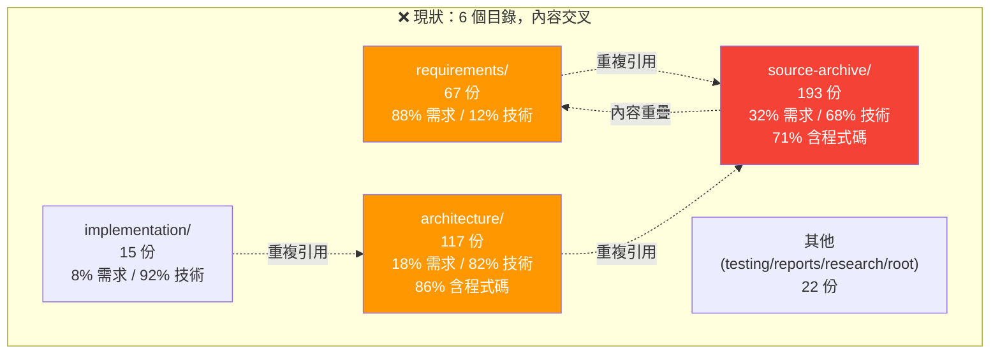
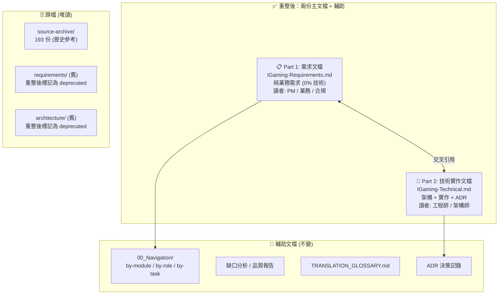
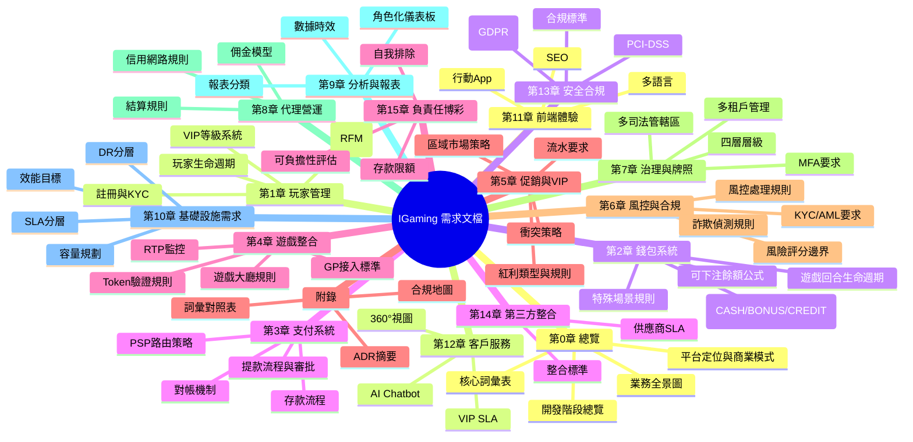
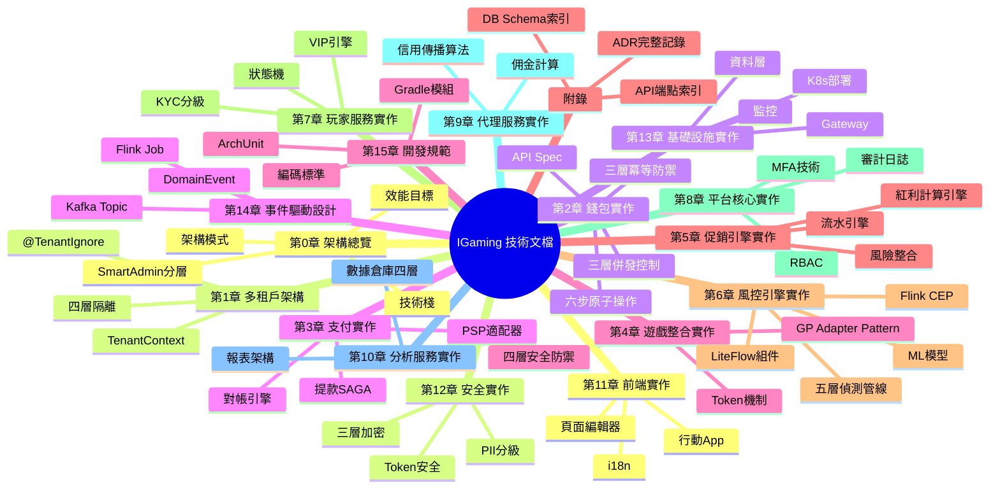
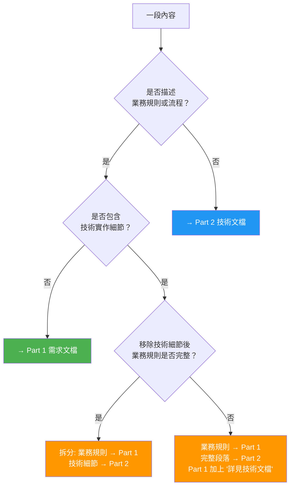
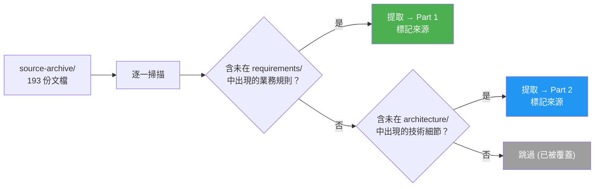
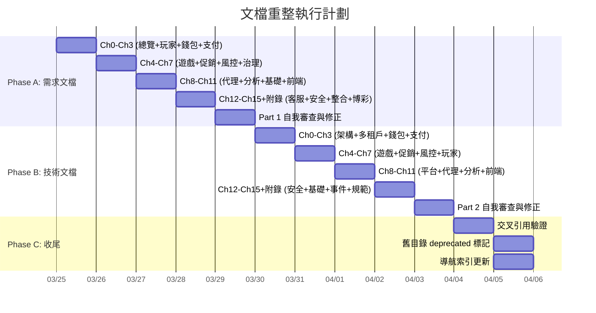

# IGaming 文檔重整規格書

> **狀態**: 📋 待確認 — 確認後才執行實作
> **範圍**: 全量 414 份 Markdown 文檔
> **交付格式**: Markdown + Mermaid 圖
> **章節策略**: 模組導向 (15 個業務模組)

---

## 一、問題陳述

### 1.1 現狀

目前 414 份文檔分散在 6 個頂層目錄中，存在嚴重的**需求與技術混雜**問題：



### 1.2 核心痛點

| 痛點 | 影響 | 嚴重度 |
|------|------|--------|
| **需求與技術混雜** | requirements/ 中 12% 內容涉及技術實作細節 (Redis、Redisson、SQL) | 🔴 |
| **source-archive 角色不清** | 193 份文檔同時包含需求和技術，71% 含程式碼，無法判定歸屬 | 🔴 |
| **同一主題多處出現** | 錢包出現在 4 個目錄、風控出現在 4 個目錄、MFA 出現在 3 個目錄 | 🔴 |
| **讀者找不到需要的內容** | PM 打開 requirements/ 看到技術細節；工程師在 architecture/ 找不到完整業務規則 | 🟡 |
| **版本不一致** | 風險評分邊界在 8 份文檔中有 4 套不同版本 | 🟡 |

### 1.3 不解決的後果

- 新成員入職需要 2-3 週才能釐清文檔結構
- PM 和工程師經常在對話中引用不同版本的需求，導致實作偏差
- 任何單一需求的修改需要同步更新 3-4 份文檔

---

## 二、目標

| # | 目標 | 成功指標 |
|---|------|---------|
| 1 | **需求與技術完全分離** | 需求文檔 0% 含程式碼、0% 含類名/註解/SQL |
| 2 | **每個模組一站式** | 任一模組的所有需求可在單一章節內找到 |
| 3 | **消除重複** | 每條業務規則只出現在一個地方 (SSOT) |
| 4 | **降低入職時間** | 新成員可在 2 天內理解任一模組的完整需求 |
| 5 | **明確交叉引用** | 需求文檔每個章節末尾有對應技術文檔的連結 |

---

## 三、非目標

| # | 非目標 | 原因 |
|---|--------|------|
| 1 | 重寫源文檔內容 | 只做結構重組和提取，不改寫業務規則本身 |
| 2 | 刪除 source-archive/ | 保留為歷史參考，但不再作為主要引用源 |
| 3 | 統一風險評分邊界等數據矛盾 | 已在缺口分析 v2.0 識別，屬於另一工作項 |
| 4 | 產出 API 文檔或 OpenAPI spec | 屬於技術文檔範疇的進一步細化 |
| 5 | 建立自動化文檔生成管線 | 先完成手動重組，後續可考慮 |

---

## 四、重整後的目標結構

### 4.1 頂層架構



### 4.2 兩份文檔的邊界定義

| 維度 | Part 1: 需求文檔 | Part 2: 技術實作文檔 |
|------|-----------------|-------------------|
| **回答什麼問題** | 系統「做什麼」、「為什麼」 | 系統「怎麼做」 |
| **讀者** | PM、業務負責人、合規官、QA | 後端工程師、架構師、DevOps |
| **允許的內容** | 業務規則、驗收標準、流程圖、數據表格、合規要求 | 程式碼、類圖、DB schema、API spec、部署配置 |
| **禁止的內容** | ❌ 類名、註解、SQL、Redis 操作、Spring 配置 | ❌ 不重複需求內容，以引用代替 |
| **圖表類型** | Mermaid flowchart / journey / stateDiagram / pie | Mermaid sequenceDiagram / classDiagram / graph + 程式碼 |
| **預估長度** | ~3,000-4,000 行 | ~5,000-7,000 行 |

---

## 五、Part 1: 需求文檔章節架構

### 5.1 章節總覽



### 5.2 每章標準結構

每個模組章節統一使用以下結構：

```markdown
## 第 N 章：[模組名稱]

### N.1 業務概述
- 本模組的定位與價值
- 在玩家旅程中的位置 (Mermaid journey 或 flowchart)
- 關鍵業務指標 (KPI)

### N.2 業務流程
- 核心流程圖 (Mermaid flowchart)
- 主要角色與職責
- 流程中的決策點與分支

### N.3 業務規則
- 規則表格 (條件 → 動作 → 例外)
- 數據驗證規則
- 計算公式 (純業務層面，不涉及實作方式)

### N.4 狀態與生命週期
- 狀態機 (Mermaid stateDiagram)
- 狀態轉換條件
- 異常狀態處理

### N.5 合規與監管
- 適用的法規要求
- 司法管轄區差異
- 合規驗收標準

### N.6 驗收標準
- Given/When/Then 格式
- 按 P0 (Must) / P1 (Should) / P2 (Could) 分級
- 每條標準可獨立測試

### N.7 跨模組依賴
- 與其他模組的交互 (表格: 模組 → 事件/數據 → 方向)
- 數據流向圖 (Mermaid)

### N.8 對應技術文檔
- 連結至 Part 2 對應章節
```

### 5.3 每章的來源映射

| 章節 | 主要來源 (requirements/) | 補充來源 (source-archive/) | 需提取的 architecture/ 內容 |
|------|------------------------|--------------------------|--------------------------|
| **Ch0 總覽** | 01_Player_Experience/01~03, 06 | 00_Foundation/00-01~02, guides/00-05~08 | 00_Overview/01 (業務部分) |
| **Ch1 玩家** | 01_Player_Experience/04~05 | 01_Player_Center/01-01, 01-03~06 | 01_Player_Service/01 (業務規則) |
| **Ch2 錢包** | 02_Financial_Operations/01~02, 05 | 02_Finance_Center/02-06~09, seamless-wallet/* | 02_Finance_Service/01~02 (業務規則) |
| **Ch3 支付** | 02_Financial_Operations/03~04 | 02_Finance_Center/02-02~03, 02-10~17 | 02_Finance_Service/05~07 (業務規則) |
| **Ch4 遊戲** | 03_Gaming_Operations/01~04 | 03_Game_Center/03-01~11 | 03_Game_Integration/01, 04~05 (業務規則) |
| **Ch5 促銷** | 04_Promotions_VIP/01~03 | 04_Activity_Center/04-02~05 | 04_Activity_Engine/01~03 (業務規則) |
| **Ch6 風控** | 05_Risk_Compliance/01~11 | 05_Risk_Control/05-01~07 | 05_Risk_Engine/01 (業務規則) |
| **Ch7 治理** | 06_Governance_Licensing/01~06 | 06_Platform_Governance/06-01~13 | 06_Platform_Core/01~02 (業務規則) |
| **Ch8 代理** | 07_Agent_Operations/01~02 | 07_Agent_Center/07-02~03 | — |
| **Ch9 分析** | 08_Analytics_Operations/01~02 | 08_Analytics_BI/08-01, 08-04 | — |
| **Ch10 基礎設施** | 09_Infrastructure_Requirements/01~03 | — | 09_Infrastructure/08, 23 (SLA/容量) |
| **Ch11 前端** | 11_Frontend_Experience/01~04 | 11_Frontend_CMS/11-01~10 | — |
| **Ch12 客服** | 13_Customer_Service/01~02 | 13_Customer_Service/13-01~02 | — |
| **Ch13 安全** | 12_Security_Compliance/01~03 | 12_System_Security/12-03~08 | 12_Security/01~10 (合規部分) |
| **Ch14 整合** | 14_Integration_Standards/01 | 14_Third_Party_Integration/14-01 | — |
| **Ch15 負責任博彩** | 15_Responsible_Gambling/01~04 | 15_Responsible_Gambling/15-01~09 | — |

---

## 六、Part 2: 技術實作文檔章節架構

### 6.1 章節總覽



### 6.2 每章標準結構

```markdown
## 第 N 章：[模組名稱] 技術實作

### N.1 對應需求
- → Part 1 第 N 章 (連結)
- 本章實現的業務規則摘要 (1-2 句)

### N.2 架構設計
- 系統架構圖 (Mermaid graph)
- 組件列表與職責
- 設計決策 (ADR 引用)

### N.3 核心流程
- 時序圖 (Mermaid sequenceDiagram)
- 關鍵路徑效能要求
- 錯誤處理與降級策略

### N.4 資料模型
- 表結構 / Entity 設計
- 索引策略
- 分片 / 分區策略

### N.5 API 設計
- 端點列表
- 請求/回應格式
- 錯誤碼

### N.6 程式碼關鍵片段
- SmartAdmin 分層實作 (Controller → Service → Manager → Dao)
- 核心算法
- 關鍵配置

### N.7 測試策略
- 單元測試覆蓋範圍
- 整合測試場景
- 效能測試指標
```

---

## 七、內容提取規則

### 7.1 分類決策樹



### 7.2 具體分類規則

| 內容類型 | 歸屬 | 範例 |
|---------|------|------|
| 業務流程描述 | Part 1 | 「玩家發起提款 → 風控審核 → 審批 → 到帳」 |
| 計算公式 (無程式碼) | Part 1 | `ValidTurnover = BetAmount × RiskFactor × StatusFactor × GameWeight` |
| 狀態轉換規則 | Part 1 | 「90 天無活動 → Dormant」 |
| 合規要求 | Part 1 | 「UKGC: 信用卡禁令」 |
| 驗收標準 | Part 1 | 「Given 玩家 KYC L0, When 存款 >$500, Then 觸發 KYC L1」 |
| 數據閾值 | Part 1 | 「風險評分 [0,30) 自動核准」 |
| --- | --- | --- |
| 時序圖含技術組件 | Part 2 | GP → API Gateway → Wallet Service → Redis → DB |
| DB Schema | Part 2 | `CREATE TABLE t_wallet (...)` |
| 程式碼片段 | Part 2 | Java/Go/SQL 程式碼 |
| API 端點規格 | Part 2 | `POST /igaming/seamless/debit` |
| 部署配置 | Part 2 | K8s YAML, HPA 設定 |
| 架構決策理由 | Part 2 | 「選 Citus 而非 CockroachDB 因為...」 |
| 效能調優 | Part 2 | Redis 快取策略、連接池設定 |

### 7.3 灰色地帶處理

| 灰色地帶 | 處理方式 |
|---------|---------|
| SLA 數值 (99.9%) | Part 1 (是業務承諾)，Part 2 引用 |
| 效能目標 (P99 < 100ms) | Part 1 列為非功能需求，Part 2 列實現方式 |
| ADR 決策 | Part 1 列結論 (一句話)，Part 2 列完整推理 |
| Mermaid 圖包含技術組件名 | Part 1 用業務名稱 (如「風控引擎」)，Part 2 用技術名稱 (如「LiteFlow RiskChain」) |

---

## 八、source-archive 處理策略

### 8.1 處理方式



### 8.2 預估分佈

根據抽樣分析：
- **約 30% (58 份)** 含獨有的業務規則需提取至 Part 1
- **約 40% (77 份)** 含獨有的技術細節需提取至 Part 2
- **約 30% (58 份)** 與 requirements/ + architecture/ 完全重疊，跳過

---

## 九、交叉引用規範

### 9.1 引用格式

```markdown
<!-- Part 1 引用 Part 2 -->
> 🔧 **技術實作**: 詳見 [Part 2 § 2.3 六步原子操作](./IGaming-Technical.md#23-六步原子操作)

<!-- Part 2 引用 Part 1 -->
> 📋 **業務需求**: 本節實現 [Part 1 § 2.3 業務規則](./IGaming-Requirements.md#23-業務規則) 定義的可下注餘額公式
```

### 9.2 引用密度

- Part 1 每節末尾 **必須** 有一條指向 Part 2 的連結
- Part 2 每章開頭 **必須** 有一條指向 Part 1 對應章節的連結
- 不允許出現「孤立章節」(無任何交叉引用)

---

## 十、工作量估算

### 10.1 分階段計劃



### 10.2 文件產出清單

| 產出 | 檔名 | 預估行數 |
|------|------|---------|
| **Part 1: 需求文檔** | `IGaming-Requirements.md` | ~3,500 行 |
| **Part 2: 技術文檔** | `IGaming-Technical.md` | ~6,000 行 |
| 導航索引 (更新) | `00_Navigation/` | 更新現有 3 份 |
| 舊目錄 README (deprecated) | 各目錄 README.md | 更新標記 |

---

## 十一、驗收標準

### 11.1 Part 1 (需求文檔)

- [ ] **零技術污染**: grep 不到 `@Transactional`, `@Cacheable`, `SELECT`, `CREATE TABLE`, `Redis`, `Kafka`, `Flink`, `LiteFlow`, `Redisson`, `HikariCP` 等技術關鍵字
- [ ] **15 模組全覆蓋**: 每個模組至少包含 業務概述 + 業務流程 + 業務規則 + 驗收標準
- [ ] **公式完整**: ValidTurnover、BettableBalance 等核心公式無遺漏
- [ ] **合規完整**: UKGC / MGA / PAGCOR / Curacao / Brazil 要求全部涵蓋
- [ ] **Mermaid 圖 ≥ 15 張**: 涵蓋核心流程、狀態機、組織架構
- [ ] **每章有交叉引用**: 末尾有指向 Part 2 的連結

### 11.2 Part 2 (技術文檔)

- [ ] **不重複需求**: 業務規則以引用方式指回 Part 1
- [ ] **ADR 完整**: 所有 5 個 ADR 決策的完整推理記錄
- [ ] **程式碼片段**: 關鍵路徑有 Java/Go 程式碼 (從 implementation/ 提取)
- [ ] **API 端點**: 所有 Seamless Wallet API 的完整規格
- [ ] **DB Schema**: 核心表結構索引
- [ ] **每章有需求引用**: 開頭有指向 Part 1 的連結

### 11.3 整體

- [ ] **source-archive 獨有內容**: 全部被提取至 Part 1 或 Part 2
- [ ] **品質報告中的 P0 問題**: 端點計數、子分級邊界等已在新文檔中修正
- [ ] **術語統一**: 遵循 TRANSLATION_GLOSSARY.md 所有條目

---

## 十二、開放問題

| # | 問題 | 需回答者 | 阻塞性 |
|---|------|---------|--------|
| 1 | Part 1 和 Part 2 是各一份大文件，還是每模組一份獨立文件？ | Ron | 🔴 阻塞 |
| 2 | source-archive/ 重整後是否標記 deprecated，還是物理刪除？ | Ron | 🟡 非阻塞 |
| 3 | 需要同步修正 8 份源文檔的風險評分邊界嗎？還是等之後處理？ | Ron | 🟡 非阻塞 |
| 4 | 技術文檔中是否需要包含 Gradle 模組結構和 build 配置？ | Ron | 🟢 非阻塞 |

---

> **下一步**: 確認本規格書後，開始 Phase A 執行需求文檔的內容提取與重組。
