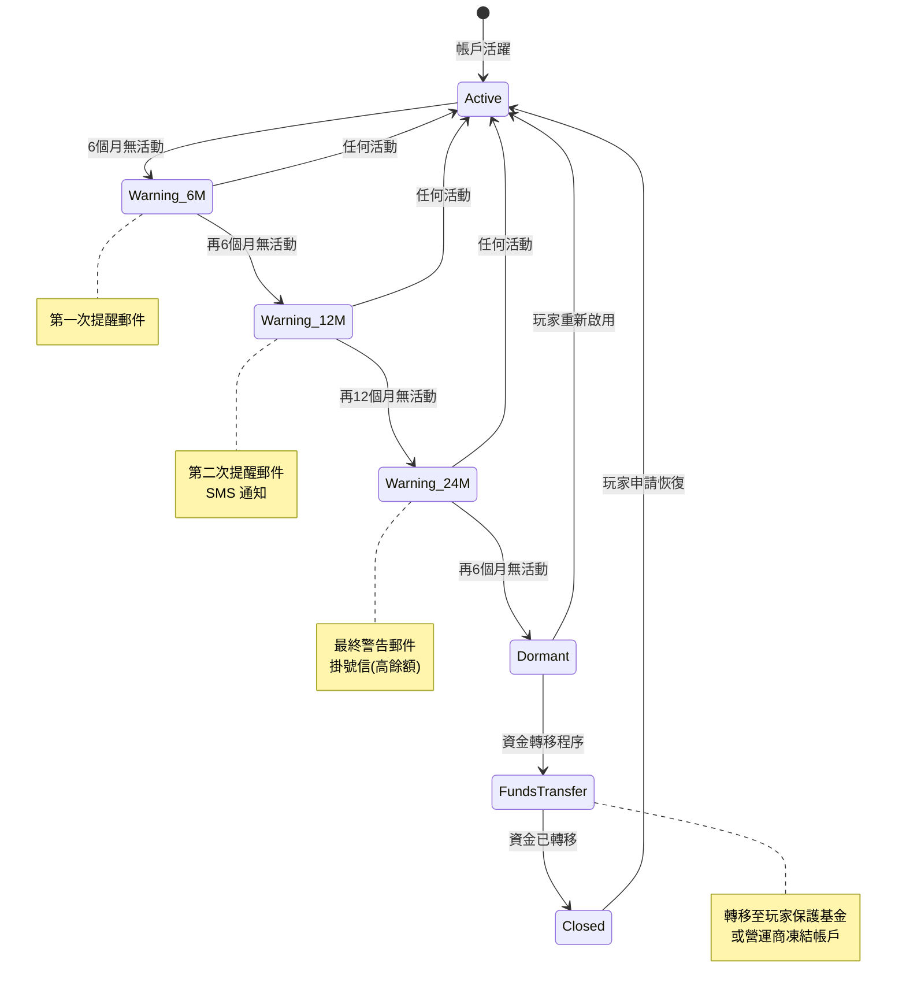
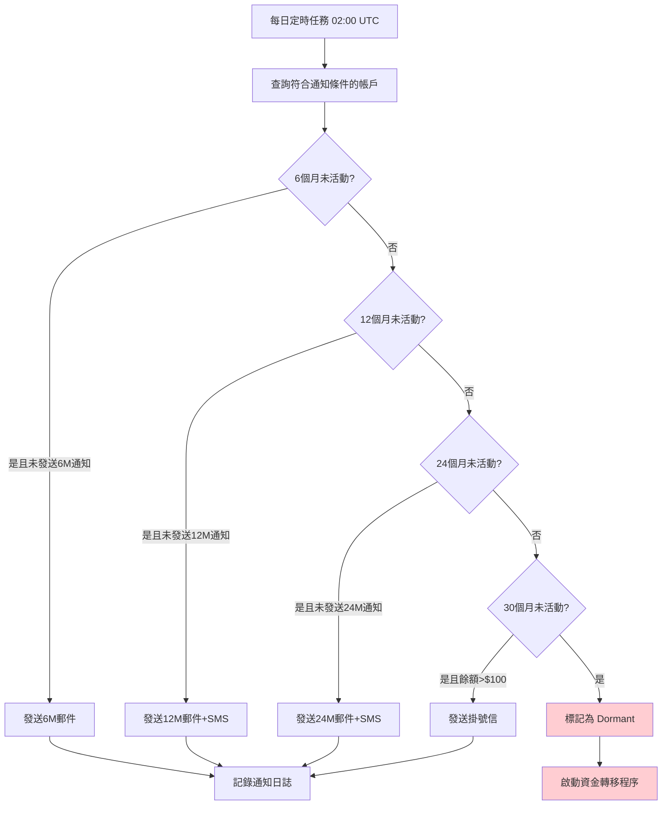
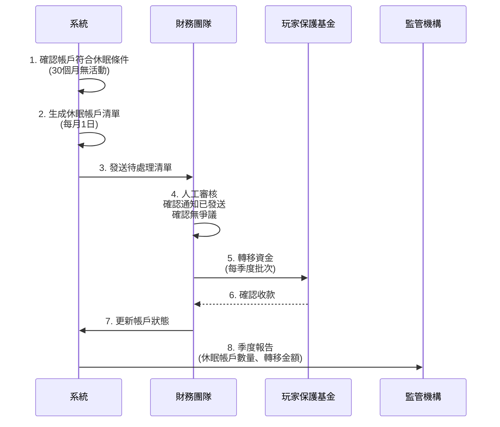
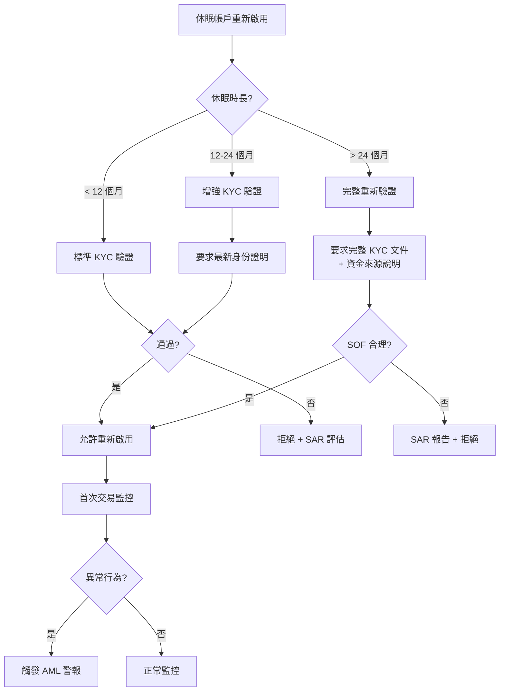

# 01-04 休眠帳戶管理 (Dormant Account Management)

> **版本**: 1.0.0
> **創建日期**: 2026-02-07
> **監管依據**: MGA Rule 12, UKGC LCCP 3.4.3

---

## 1. 概述

本文檔定義休眠帳戶的識別、通知、資金處理與重新啟用流程，確保符合 MGA、UKGC 等監管機構的要求。

### 1.1 休眠定義

| 監管機構 | 休眠認定時間 | 資金處理 |
|---------|------------|---------|
| **MGA** | 30 個月無活動 | 轉移至玩家保護基金 |
| **UKGC** | 無強制規定 | 建議 12 個月通知 |
| **Curacao** | 12 個月無活動 | 營運商保留 |
| **PAGCOR** | 6 個月無活動 | 需通知玩家 |

### 1.2 「活動」定義

以下任一行為視為帳戶活動，重置休眠計時器：

```yaml
視為活動的行為:
  - 登入帳戶
  - 存款
  - 下注
  - 提款申請
  - 帳戶設定變更
  - 客服互動（驗證身份後）

不視為活動的行為:
  - 接收行銷郵件
  - 被動餘額變化（利息、返水）
  - 系統自動操作
```

---

## 2. 休眠階段定義

### 2.1 階段劃分



### 2.2 階段詳情

| 階段 | 無活動時間 | 狀態 | 通知方式 | 資金狀態 |
|------|-----------|------|---------|---------|
| **Warning_6M** | 6 個月 | 預警 | 郵件 | 正常可用 |
| **Warning_12M** | 12 個月 | 預警 | 郵件 + SMS | 正常可用 |
| **Warning_24M** | 24 個月 | 最終警告 | 郵件 + SMS + 掛號信 | 正常可用 |
| **Dormant** | 30 個月 (MGA) | 休眠 | 無 | 凍結 |
| **Closed** | 30+ 個月 | 已關閉 | 無 | 已轉移 |

---

## 3. 通知流程

### 3.1 通知模板

**6 個月警告郵件**:
```html
Subject: [平台名稱] 您的帳戶已經 6 個月未使用

Dear [玩家姓名],

We noticed that you haven't logged into your [平台名稱] account for 6 months.

Your current balance: [餘額]

If you wish to continue using your account, simply log in and your account
will remain active.

If you no longer wish to use your account, you can:
- Withdraw your remaining balance
- Close your account

Important: If there is no activity for 30 months, your funds may be
transferred to a Player Protection Fund in accordance with MGA regulations.

Need help? Contact our support team at [support email].

Best regards,
[平台名稱] Team
```

**24 個月最終警告郵件**:
```html
Subject: ⚠️ FINAL NOTICE - Your [平台名稱] account will become dormant

Dear [玩家姓名],

This is your final notice regarding your [平台名稱] account.

Your account has been inactive for 24 months.

CURRENT BALANCE: [餘額]

ACTION REQUIRED WITHIN 6 MONTHS:
To keep your account active, please log in before [日期].

WHAT HAPPENS IF YOU DON'T ACT:
After 30 months of inactivity, your account will be classified as dormant
and your funds ([餘額]) will be transferred to the Player Protection Fund
as required by Malta Gaming Authority regulations.

TO RECOVER YOUR FUNDS AFTER TRANSFER:
You may still claim your funds by contacting us with valid identification.

Questions? Contact [support email] or call [phone number].

Best regards,
[平台名稱] Compliance Team
```

### 3.2 通知發送邏輯



### 3.3 通知記錄表

```sql
CREATE TABLE t_dormant_notification_log (
    id BIGINT PRIMARY KEY AUTO_INCREMENT,
    player_id BIGINT NOT NULL,

    -- 通知類型
    notification_type ENUM('6M_EMAIL', '12M_EMAIL', '12M_SMS', '24M_EMAIL', '24M_SMS', '24M_LETTER', 'DORMANT_NOTICE') NOT NULL,

    -- 發送狀態
    status ENUM('PENDING', 'SENT', 'DELIVERED', 'BOUNCED', 'FAILED') DEFAULT 'PENDING',
    sent_at DATETIME,
    delivered_at DATETIME,

    -- 通知內容快照
    balance_at_notification DECIMAL(18,4) COMMENT '通知時餘額',
    last_activity_date DATETIME COMMENT '最後活動日期',
    dormant_deadline DATE COMMENT '休眠截止日期',

    -- 追蹤
    tracking_id VARCHAR(100) COMMENT '郵件/SMS 追蹤 ID',
    error_message TEXT,

    created_at DATETIME DEFAULT CURRENT_TIMESTAMP,
    updated_at DATETIME DEFAULT CURRENT_TIMESTAMP ON UPDATE CURRENT_TIMESTAMP,

    INDEX idx_player_id (player_id),
    INDEX idx_notification_type (notification_type),
    INDEX idx_status (status)
) COMMENT '休眠通知日誌';
```

---

## 4. 資金轉移程序

### 4.1 轉移流程



### 4.2 轉移規則

```yaml
資金轉移規則:
  轉移條件:
    - 30 個月無活動 (MGA 標準)
    - 已發送所有必要通知
    - 無待處理爭議
    - 無待處理提款

  轉移目標:
    MGA 牌照:
      target: Malta Player Protection Fund
      account: MGA 指定帳戶
      frequency: 每季度
      report: MGA 季度報告

    UKGC 牌照:
      target: 營運商保留 (需記錄)
      note: 玩家可隨時申請退回
      report: 年度報告

    Curacao 牌照:
      target: 營運商保留
      note: 12 個月後可處置

  豁免情況:
    - 餘額 < $1: 自動沖銷
    - 帳戶有爭議: 暫停轉移
    - 法律訴訟中: 暫停轉移
    - VIP 帳戶: 延長 6 個月
```

### 4.3 資金轉移記錄表

```sql
CREATE TABLE t_dormant_fund_transfer (
    id BIGINT PRIMARY KEY AUTO_INCREMENT,
    player_id BIGINT NOT NULL,

    -- 轉移資訊
    transfer_batch_id VARCHAR(64) NOT NULL COMMENT '批次 ID',
    transfer_amount DECIMAL(18,4) NOT NULL,
    currency VARCHAR(3) NOT NULL,

    -- 目標
    transfer_target ENUM('PLAYER_PROTECTION_FUND', 'OPERATOR_RESERVE', 'WRITTEN_OFF') NOT NULL,
    target_account VARCHAR(100),

    -- 狀態
    status ENUM('PENDING', 'COMPLETED', 'FAILED', 'REFUNDED') DEFAULT 'PENDING',

    -- 監管
    jurisdiction VARCHAR(20) NOT NULL COMMENT '適用牌照',
    regulatory_reference VARCHAR(100) COMMENT '監管報告編號',

    -- 時間
    dormant_date DATE NOT NULL COMMENT '認定休眠日期',
    transfer_date DATE COMMENT '實際轉移日期',
    report_date DATE COMMENT '報告監管日期',

    -- 玩家恢復
    refunded_at DATETIME COMMENT '退回日期 (如玩家申請)',
    refund_reference VARCHAR(64),

    created_at DATETIME DEFAULT CURRENT_TIMESTAMP,
    updated_at DATETIME DEFAULT CURRENT_TIMESTAMP ON UPDATE CURRENT_TIMESTAMP,

    INDEX idx_player_id (player_id),
    INDEX idx_batch_id (transfer_batch_id),
    INDEX idx_status (status)
) COMMENT '休眠資金轉移記錄';
```

---

## 5. 帳戶重新啟用

### 5.1 重新啟用條件

| 帳戶狀態 | 重新啟用方式 | 資金處理 |
|---------|------------|---------|
| **Warning (6M-24M)** | 登入即可 | 即時可用 |
| **Dormant (未轉移)** | 登入 + 身份驗證 | 即時可用 |
| **Closed (已轉移)** | 申請 + 身份驗證 + 審核 | 從保護基金退回 (7-30 天) |

### 5.2 重新啟用流程

```mermaid
graph TD
    A[玩家請求重新啟用] --> B{當前狀態}

    B -->|Warning| C[直接登入]
    B -->|Dormant| D[身份驗證]
    B -->|Closed| E[提交申請]

    C --> F[重置休眠計時器]
    F --> G[帳戶恢復正常]

    D --> H{驗證通過?}
    H -->|是| I[解凍帳戶]
    H -->|否| J[聯繫客服]

    I --> F

    E --> K[上傳身份證明]
    K --> L{資金已轉移?}

    L -->|是| M[向保護基金申請退回]
    L -->|否| I

    M --> N[等待退回 (7-30天)]
    N --> O[資金到帳]
    O --> I

    style G fill:#C8E6C9
    style J fill:#FFCDD2
```

### 5.3 重新啟用申請表

```sql
CREATE TABLE t_dormant_reactivation_request (
    id BIGINT PRIMARY KEY AUTO_INCREMENT,
    player_id BIGINT NOT NULL,
    request_number VARCHAR(64) NOT NULL UNIQUE,

    -- 申請資訊
    previous_status ENUM('DORMANT', 'CLOSED') NOT NULL,
    previous_balance DECIMAL(18,4),
    fund_transfer_id BIGINT COMMENT '關聯資金轉移記錄',

    -- 身份驗證
    id_document_type VARCHAR(50),
    id_document_url VARCHAR(500),
    verification_status ENUM('PENDING', 'VERIFIED', 'REJECTED') DEFAULT 'PENDING',
    verified_by BIGINT,
    verified_at DATETIME,

    -- 處理狀態
    status ENUM('PENDING', 'APPROVED', 'REJECTED', 'FUND_PENDING', 'COMPLETED') DEFAULT 'PENDING',
    rejection_reason TEXT,

    -- 資金退回
    fund_refund_requested BOOLEAN DEFAULT FALSE,
    fund_refund_date DATE,
    fund_refund_amount DECIMAL(18,4),

    created_at DATETIME DEFAULT CURRENT_TIMESTAMP,
    updated_at DATETIME DEFAULT CURRENT_TIMESTAMP ON UPDATE CURRENT_TIMESTAMP,

    INDEX idx_player_id (player_id),
    INDEX idx_status (status)
) COMMENT '休眠帳戶重新啟用申請';
```

---

## 6. 監控與報告

### 6.1 關鍵指標

| 指標 | 計算方式 | 告警閾值 |
|------|---------|---------|
| **休眠轉化率** | 新增休眠 / 活躍帳戶 | > 2% 月 |
| **通知送達率** | 成功送達 / 發送總數 | < 90% |
| **重新啟用率** | 重新啟用 / 休眠帳戶 | 監控趨勢 |
| **平均休眠餘額** | 總休眠餘額 / 休眠帳戶數 | 監控趨勢 |

### 6.2 監管報告

```sql
-- MGA 季度休眠報告
SELECT
    QUARTER(dormant_date) AS quarter,
    YEAR(dormant_date) AS year,
    COUNT(*) AS dormant_accounts,
    SUM(transfer_amount) AS total_transferred_amount,
    AVG(transfer_amount) AS avg_balance,
    COUNT(CASE WHEN status = 'REFUNDED' THEN 1 END) AS refunded_accounts,
    SUM(CASE WHEN status = 'REFUNDED' THEN refund_amount ELSE 0 END) AS refunded_amount
FROM t_dormant_fund_transfer
WHERE jurisdiction = 'MGA'
  AND transfer_date >= DATE_SUB(CURDATE(), INTERVAL 1 YEAR)
GROUP BY YEAR(dormant_date), QUARTER(dormant_date)
ORDER BY year DESC, quarter DESC;
```

### 6.3 告警規則

| 告警條件 | 優先級 | 通知對象 |
|---------|--------|---------|
| 月新增休眠帳戶 > 1000 | 🟡 P2 | Finance Manager |
| 休眠帳戶餘額總額 > $100,000 | 🟠 P1 | CFO |
| 通知發送失敗率 > 10% | 🟠 P1 | Tech Team |
| 資金轉移延遲 > 7 天 | 🔴 P0 | Compliance + CFO |

---

## 7. AML 合規考量

### 7.1 休眠帳戶的 AML 風險

休眠帳戶可能被用於洗錢活動，需要特別關注以下風險模式：

| 風險模式 | 描述 | 風險等級 |
|---------|------|---------|
| **休眠期存款** | 長期休眠後突然大額存款 | 🔴 Critical |
| **帳戶出售** | 休眠帳戶被出售給第三方使用 | 🔴 Critical |
| **分層交易** | 利用休眠帳戶進行資金分層 | 🟠 High |
| **身份冒用** | 休眠帳戶被他人冒用 | 🟠 High |

### 7.2 重新啟用時的 AML 檢查



### 7.3 重新啟用後監控規則

| 規則 | 監控期 | 觸發條件 | 動作 |
|------|--------|---------|------|
| **首次存款監控** | 30 天 | 首次存款 > €1,000 | EDD 觸發 |
| **快速交易** | 7 天 | 存款後 24h 內提款 | FLAG 審核 |
| **設備變更** | 永久 | 與休眠前設備不同 | Step-Up 認證 |
| **交易模式變更** | 90 天 | 投注模式與歷史差異 > 50% | 監控 |

### 7.4 SAR 觸發條件

休眠帳戶相關的 SAR 報告觸發條件：

```java
/**
 * 休眠帳戶 AML 檢查
 */
@Service
@RequiredArgsConstructor
public class DormantAccountAmlService {

    /**
     * 評估重新啟用帳戶的 AML 風險
     */
    public AmlRiskResult evaluateReactivation(Long playerId) {
        DormantAccount account = dormantAccountDao.findByPlayerId(playerId);
        int riskScore = 0;
        List<String> signals = new ArrayList<>();

        // 1. 休眠時長因素
        long dormantMonths = ChronoUnit.MONTHS.between(
            account.getLastActivityAt(), LocalDateTime.now());
        if (dormantMonths > 24) {
            riskScore += 20;
            signals.add("LONG_DORMANCY:" + dormantMonths);
        }

        // 2. 設備變更
        if (!deviceService.isSameDevice(
                playerId, account.getLastDeviceFingerprint())) {
            riskScore += 25;
            signals.add("DEVICE_CHANGED");
        }

        // 3. 地理位置變更
        String currentCountry = geoService.getPlayerCountry(playerId);
        if (!currentCountry.equals(account.getLastCountry())) {
            riskScore += 15;
            signals.add("COUNTRY_CHANGED");
        }

        // 4. 行為模式變更
        if (behaviorService.isPatternChanged(playerId, account)) {
            riskScore += 20;
            signals.add("BEHAVIOR_CHANGED");
        }

        // 觸發 SAR 評估
        if (riskScore >= 50) {
            return AmlRiskResult.sarRequired(riskScore, signals);
        }

        return AmlRiskResult.normal(riskScore, signals);
    }
}
```

---

## 8. 費用政策 (可選)

### 7.1 休眠帳戶費用

> **注意**: 部分監管機構 (如 UKGC) 不允許或限制休眠費用。

```yaml
費用政策 (需法務確認):
  適用條件:
    - 帳戶休眠 > 12 個月
    - 餘額 > $10
    - 已發送費用通知

  費用標準:
    - 每月 $5 或餘額的 5% (取較小值)
    - 最高扣除至餘額 $0

  豁免情況:
    - UKGC 牌照: 不收取
    - VIP 帳戶: 不收取
    - 餘額 < $10: 不收取

  通知要求:
    - 首次收費前 30 天通知
    - 每次收費後 7 天內通知
```

---

## 📚 相關文檔

- [01-01 Player Lifecycle](./01-01_Player_Lifecycle.md) - 玩家生命週期
- [02-08 Player Funds Segregation](../02_Finance_Center/02-08_Player_Funds_Segregation.md) - 玩家資金隔離
- [06-09 MGA Compliance](../06_Platform_Governance/06-09_MGA_Compliance.md) - MGA 合規要求

---

**文檔版本**: 1.0.0
**最後更新**: 2026-02-07
**維護團隊**: Finance + Compliance Team
