# 02-03 對帳中心系統 (Reconciliation System)

## 1. 系統概述
對帳是確保平台資金安全與數據準確性的最後一道防線。
本系統負責比對「平台內部帳 (Internal Ledger)」與「外部渠道帳 (External Statement)」，並生成財務報表。

## 2. 核心功能需求

### 2.1 三方對帳 (Three-Way Matching)
需比對以下三方數據：
1. **平台訂單 (Platform Orders)**：玩家存款/提款記錄。
2. **支付商報表 (PSP Reports)**：實際資金進出記錄。
3. **銀行/錢包實際流水 (Bank Statement)**：最終資金落地記錄 (若有)。

#### 2.1.1 三層對帳流程架構圖 (Three-Tier Reconciliation Architecture)

**概述**：對帳系統採用三層防禦架構，從實時驗證到日終批次處理，確保資金安全與數據一致性。

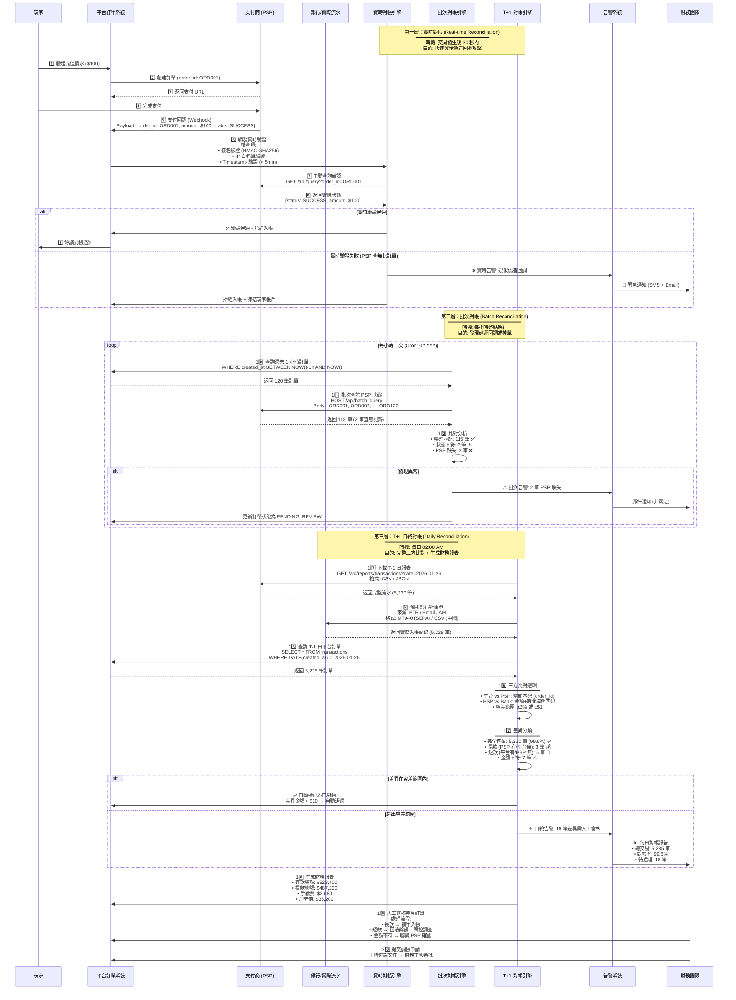

**三層對帳特性對比表**：

| 對帳層級 | 執行頻率 | 數據來源 | 比對方式 | 延遲時間 | 主要目的 | 自動化程度 |
|---------|---------|---------|---------|---------|---------|-----------|
| **第一層<br/>實時對帳** | 交易發生後 30 秒 | 平台 ↔ PSP API | 主動查詢驗證 | < 1 分鐘 | 防偽造回調攻擊 | 100% 自動 |
| **第二層<br/>批次對帳** | 每小時一次 | 平台 ↔ PSP API | 批次查詢比對 | 1 小時 | 發現延遲/掉單 | 95% 自動 (異常人工) |
| **第三層<br/>T+1 對帳** | 每日 02:00 AM | 平台 ↔ PSP ↔ Bank | 完整三方比對 | 1 天 | 財務報表 + 審計 | 80% 自動 (差異人工) |

**關鍵設計決策**：

1. **為何需要三層？**
   - **第一層（實時）**：防禦性驗證，阻斷攻擊於第一時間
   - **第二層（批次）**：彌補實時驗證的遺漏（如 PSP 回調延遲）
   - **第三層（日終）**：完整性保證，滿足財務合規要求

2. **容差範圍設計**：
   - **金額容差**：2% 或 $1（取較小值）
   - **時間容差**：10 分鐘（模糊匹配）
   - **自動通過閾值**：差異 < $10 且在容差內

3. **告警優先級**：
   - **P0 (緊急)**: 實時驗證失敗（疑似攻擊）→ SMS + Email
   - **P1 (高)**: 短款（平台有/PSP 無）→ Email + 凍結帳戶
   - **P2 (中)**: 批次異常 / 長款 → Email
   - **P3 (低)**: 金額小差異（< $10）→ 日報彙總

4. **性能優化**：
   - **實時對帳**: 異步執行，不阻塞主流程（30 秒超時）
   - **批次對帳**: 多執行緒並行查詢 PSP（線程池: 10 threads）
   - **T+1 對帳**: 分片處理大批量數據（每批 1000 筆）

---

### 2.2 差異處理 (Discrepancy Handling)
- **長款 (Over)**：外部有錢，平台無訂單 (可能是掉單或玩家誤轉)。-> 需人工補錄。
- **短款 (Short)**：平台有成功訂單，外部無錢 (極高風險，可能是虛假回調攻擊)。-> 需立即報警並凍結玩家帳號。
- **金額不符**：平台訂單 $100，實際入帳 $90 (可能是手續費扣除差異)。-> 需配置容差範圍。

### 2.3 日結流程 (Daily Closing)
- **自動化排程**：每日 02:00 自動下載前一日 PSP 報表 (CSV/API)。
- **自動比對**：系統自動進行 Key-Value 比對 (Order ID)。
- **生成日報**：包含 總存款、總提款、手續費、差異筆數、差異金額。

### 2.4 報表中心 (Report Center)
- **商戶報表**：各商戶每日盈虧 (PNL)、充提差。
- **渠道報表**：各支付渠道的成功率、手續費成本分析。

### 2.5 代理信用對帳 (Agent Settlement Reconciliation)
*   **針對信用網模式的核心對帳流程**。
*   **公式更新**:
    `Net Payable = (Total Win/Loss - Commission) + Adjustment (Late Settlement)`
*   **輸入數據**：
    1.  **System Report**: 系統生成的週結單 (Weekly Statement)。
    2.  **Manual Input / Bank Statement**: 財務收到的實際匯款憑證 (USDT TxID 或 銀行流水)。
*   **核銷邏輯 (Write-off Logic)**：
    *   財務人員在後台輸入 "實收金額"。
    *   系統自動比對 `Net Payable` vs `Actual Received`。
    *   若 **Match** (差異 < $10)：系統自動執行 `Credit Reset`，恢復代理額度。
    *   若 **Mismatch**：生成 `Outstanding Debt` 工單，代理額度維持凍結，直到補齊差額。


## 3. 對賬算法詳解

### 3.1 數據匹配邏輯

**匹配層級（按優先順序）**：
1. **精確匹配（Exact Match）**：
   - 條件：`Platform.order_id = PSP.merchant_order_id`
   - 狀態：✅ 自動標記為已對帳

2. **金額+時間匹配（Fuzzy Match）**：
   - 條件：`ABS(Platform.amount - PSP.amount) < $1 AND ABS(Platform.time - PSP.time) < 10 minutes`
   - 狀態：⚠️ 需人工審核確認

3. **未匹配（Unmatched）**：
   - 條件：在 PSP 報表中找不到對應記錄
   - 狀態：❌ 標記為差異，觸發警報

**SQL 實現範例**：

### 3.2 自動化對賬腳本

**每日對帳定時任務（Cron: 0 2 * * *）**：

```python
#!/usr/bin/env python3
"""
Daily T+1 Reconciliation Script
Execution: 02:00 UTC daily
Author: SmartAdmin Finance Team
"""

import asyncio
from datetime import date, timedelta
from decimal import Decimal
from typing import List, Tuple
import logging

from reconciliation import (
    PSPReportFetcher,
    PlatformOrderFetcher,
    BankStatementParser,
    ThreeWayMatcher,
    DiscrepancyHandler,
    ReconciliationReporter
)

logging.basicConfig(level=logging.INFO)
logger = logging.getLogger(__name__)

# Configuration
TOLERANCE_AMOUNT = Decimal("1.00")       # $1 tolerance
TOLERANCE_PERCENT = Decimal("0.02")      # 2% tolerance
AUTO_APPROVE_THRESHOLD = Decimal("10.00") # Auto-approve if diff < $10


async def run_daily_reconciliation() -> None:
    """Execute daily T+1 three-way reconciliation."""
    target_date = date.today() - timedelta(days=1)
    logger.info(f"Starting T+1 reconciliation for {target_date}")

    try:
        # Step 1: Fetch data from all sources concurrently
        platform_data, psp_data, bank_data = await asyncio.gather(
            PlatformOrderFetcher.fetch(target_date),
            PSPReportFetcher.fetch_all(target_date),
            BankStatementParser.parse(target_date)
        )

        logger.info(f"Fetched: Platform={len(platform_data)}, "
                   f"PSP={len(psp_data)}, Bank={len(bank_data)}")

        # Step 2: Three-way matching
        results = ThreeWayMatcher.match(
            platform=platform_data,
            psp=psp_data,
            bank=bank_data,
            tolerance={
                'amount': TOLERANCE_AMOUNT,
                'percent': TOLERANCE_PERCENT,
                'time_minutes': 10
            }
        )

        logger.info(f"Matching complete: {results.summary()}")

        # Step 3: Handle discrepancies
        for discrepancy in results.discrepancies:
            if discrepancy.amount < AUTO_APPROVE_THRESHOLD:
                await DiscrepancyHandler.auto_approve(discrepancy)
            else:
                await DiscrepancyHandler.queue_for_review(discrepancy)

        # Step 4: Generate report
        report = await ReconciliationReporter.generate_daily(
            target_date, results
        )
        logger.info(f"Report generated: {report.report_id}")

    except Exception as e:
        logger.error(f"Reconciliation failed: {e}")
        raise


if __name__ == "__main__":
    asyncio.run(run_daily_reconciliation())
```

**Java 實現範例**:

```java
@Service
@RequiredArgsConstructor
@Slf4j
public class DailyReconciliationJob {

    private final PspReportService pspReportService;
    private final PlatformOrderService platformOrderService;
    private final ThreeWayMatchingService matchingService;
    private final DiscrepancyService discrepancyService;

    /**
     * 每日 T+1 對帳任務
     * Cron: 0 0 2 * * ? (每日 02:00 執行)
     */
    @Scheduled(cron = "0 0 2 * * ?")
    public void executeDailyReconciliation() {
        LocalDate targetDate = LocalDate.now().minusDays(1);
        log.info("Starting T+1 reconciliation for {}", targetDate);

        // 1. 獲取數據
        List<PlatformOrder> platformOrders = platformOrderService.findByDate(targetDate);
        List<PspTransaction> pspTransactions = pspReportService.fetchAllPsp(targetDate);

        // 2. 執行三方匹配
        ReconciliationResult result = matchingService.threeWayMatch(
            platformOrders,
            pspTransactions,
            MatchingConfig.builder()
                .toleranceAmount(new BigDecimal("1.00"))
                .tolerancePercent(new BigDecimal("0.02"))
                .build()
        );

        // 3. 處理差異
        for (Discrepancy disc : result.getDiscrepancies()) {
            discrepancyService.process(disc);
        }

        log.info("Reconciliation complete: matched={}, discrepancies={}",
            result.getMatchedCount(), result.getDiscrepancies().size());
    }
}
```

---

## 4. 差異處理 SOP

### 4.1 長款處理流程（外部有錢，平台無訂單）

**Step 1: 驗證數據來源**
```
檢查 PSP 交易 ID → 查詢是否為測試交易
若是測試環境數據誤入生產 → 忽略
```

**Step 2: 查詢玩家帳戶**
```
根據 PSP 報表中的 player_email/phone 查找玩家
若找到玩家 → 檢查是否有相同金額的 Pending 訂單
```

**Step 3: 補單操作**

### 4.2 短款處理流程（平台有訂單，外部無錢）

**🚨 高風險警報**：可能是偽造回調攻擊！

**Step 1: 立即凍結**

**Step 2: 調查**
```
1. 檢查 PSP Callback 日誌（IP、時間戳、簽名）
2. 聯繫 PSP 客服確認是否收到款項
3. 若 PSP 確認未收款 → 回滾玩家餘額
```

**Step 3: 回滾操作**

### 4.3 金額不符處理（手續費差異）

**容差範圍配置**：

**處理邏輯**：

---

### 4.4 異常處理決策矩陣 (Discrepancy Handling Decision Matrix)

**概述**：本圖表整合所有對帳差異類型的檢測、分級與處理邏輯，提供統一的異常處理決策視圖。

```mermaid
flowchart TD
    START[對帳比對完成] --> ANALYZE{"差異分析<br/>━━━━━━━━"}

    ANALYZE -->|無差異| PERFECT_MATCH["✅ 完全匹配<br/>order_id 一致<br/>amount 一致<br/>status 一致"]
    PERFECT_MATCH --> AUTO_MARK["自動標記: RECONCILED<br/>更新 reconciliation_status"]
    AUTO_MARK --> REPORT_OK[計入對帳成功統計]

    ANALYZE -->|有差異| CLASSIFY{差異類型分類}

    %% 差異類型 A: 長款 (Over)
    CLASSIFY -->|類型 A: 長款| OVER_PAYMENT["✓ 長款檢測<br/>━━━━━━━━━━━━<br/>PSP 有交易記錄<br/>平台無對應訂單"]

    OVER_PAYMENT --> OVER_AMOUNT{金額檢查}
    OVER_AMOUNT -->|金額 < $10| OVER_SMALL["小額長款<br/>可能是測試交易"]
    OVER_SMALL --> VERIFY_TEST{驗證測試環境?}
    VERIFY_TEST -->|是測試交易| IGNORE["忽略 + 標記 TEST<br/>不計入財務報表"]
    VERIFY_TEST -->|非測試交易| OVER_SMALL_REAL[真實小額長款]

    OVER_AMOUNT -->|$10 ≤ 金額 < $1000| OVER_MEDIUM["中額長款<br/>需調查但非緊急"]
    OVER_AMOUNT -->|金額 ≥ $1000| OVER_LARGE["大額長款<br/>高優先級調查"]

    OVER_SMALL_REAL --> FIND_PLAYER{查詢玩家資訊}
    OVER_MEDIUM --> FIND_PLAYER
    OVER_LARGE --> FIND_PLAYER

    FIND_PLAYER -->|找到玩家| CHECK_PENDING{檢查 Pending 訂單?}
    CHECK_PENDING -->|有相同金額 Pending| LIKELY_DROPPED["✓ 疑似掉單<br/>時間窗口: ±30 分鐘<br/>金額匹配"]
    CHECK_PENDING -->|無匹配訂單| MANUAL_CREDIT_NEEDED[需財務判斷是否補單]

    FIND_PLAYER -->|找不到玩家| UNKNOWN_SOURCE["來源不明<br/>可能是誤轉帳"]

    LIKELY_DROPPED --> AUTO_CREDIT{自動補單條件檢查}
    AUTO_CREDIT -->|金額 < $100 且玩家可信| AUTO_SUPPLEMENT["✅ 自動補單<br/>創建 manual_order<br/>增加玩家餘額<br/>標記: AUTO_CREDITED"]
    AUTO_CREDIT -->|金額 ≥ $100 或玩家風險| MANUAL_REVIEW_OVER["提交人工審核<br/>需佐證文件"]

    MANUAL_CREDIT_NEEDED --> MANUAL_REVIEW_OVER
    UNKNOWN_SOURCE --> MANUAL_REVIEW_OVER

    MANUAL_REVIEW_OVER --> FINANCE_REVIEW_OVER["財務專員審核<br/>━━━━━━━━━━━━<br/>1️⃣ 聯繫 PSP 查詢來源<br/>2️⃣ 檢查玩家歷史記錄<br/>3️⃣ 上傳佐證文件"]

    FINANCE_REVIEW_OVER --> APPROVAL_OVER{審批流程}
    APPROVAL_OVER -->|金額 < $1000| MANAGER_APPROVE_OVER[財務主管審批]
    APPROVAL_OVER -->|金額 ≥ $1000| CFO_APPROVE_OVER[CFO 審批]

    MANAGER_APPROVE_OVER -->|通過| EXECUTE_CREDIT["執行補單<br/>wallet_service.credit"]
    CFO_APPROVE_OVER -->|通過| EXECUTE_CREDIT
    EXECUTE_CREDIT --> AUDIT_LOG_OVER["記錄審計日誌<br/>包含操作者、原因、佐證"]

    MANAGER_APPROVE_OVER -->|拒絕| REJECT_OVER["拒絕補單<br/>標記: REJECTED<br/>原因: 無法確認來源"]
    CFO_APPROVE_OVER -->|拒絕| REJECT_OVER

    %% 差異類型 B: 短款 (Short)
    CLASSIFY -->|類型 B: 短款| SHORT_PAYMENT["✓ 短款檢測<br/>━━━━━━━━━━━━<br/>平台有成功訂單<br/>PSP 無交易記錄"]

    SHORT_PAYMENT --> CRITICAL_ALERT["🚨 嚴重告警<br/>━━━━━━━━━━━━<br/>可能是偽造回調攻擊<br/>立即觸發 P0 告警"]

    CRITICAL_ALERT --> FREEZE_ACCOUNT["1️⃣ 凍結玩家帳戶<br/>UPDATE players SET status='frozen'"]
    FREEZE_ACCOUNT --> CHECK_CALLBACK{2️⃣ 檢查回調日誌}

    CHECK_CALLBACK --> CALLBACK_ANALYSIS["分析回調數據<br/>━━━━━━━━━━━━<br/>• IP 來源<br/>• 簽名驗證結果<br/>• Timestamp<br/>• Request Body"]

    CALLBACK_ANALYSIS --> CONTACT_PSP["3️⃣ 緊急聯繫 PSP<br/>Email + 電話<br/>查詢訂單真實狀態"]

    CONTACT_PSP --> PSP_RESPONSE{PSP 回覆?}
    PSP_RESPONSE -->|確認未收款| CONFIRMED_FRAUD["✓ 確認欺詐<br/>偽造回調攻擊"]
    PSP_RESPONSE -->|確認已收款| PSP_DATA_ISSUE["PSP 數據延遲<br/>需同步報表"]
    PSP_RESPONSE -->|48h 無回應| TIMEOUT_ESCALATE["升級至高級管理層<br/>CTO + CFO 介入"]

    CONFIRMED_FRAUD --> ROLLBACK_FRAUD["4️⃣ 執行回滾<br/>wallet_service.debit<br/>扣除已入帳金額"]
    ROLLBACK_FRAUD --> RISK_ALERT_FRAUD["5️⃣ 觸發風控調查<br/>risk_alert.create<br/>severity: CRITICAL"]
    RISK_ALERT_FRAUD --> POLICE_REPORT{金額 > $10,000?}
    POLICE_REPORT -->|是| REPORT_TO_POLICE["6️⃣ 報案處理<br/>準備法律文件"]
    POLICE_REPORT -->|否| BAN_PLAYER["6️⃣ 永久封禁玩家<br/>加入黑名單"]

    PSP_DATA_ISSUE --> WAIT_SYNC["等待 PSP 數據同步<br/>24-48 小時"]
    WAIT_SYNC --> RECHECK["重新比對<br/>若仍短款 → 升級處理"]

    %% 差異類型 C: 金額不符 (Amount Mismatch)
    CLASSIFY -->|類型 C: 金額不符| AMOUNT_DIFF["✓ 金額不符檢測<br/>━━━━━━━━━━━━<br/>platform_amount ≠ psp_amount"]

    AMOUNT_DIFF --> CALC_DIFF["計算差異<br/>━━━━━━━━━━━━<br/>diff = |platform - psp|<br/>diff_pct = diff / platform × 100%"]

    CALC_DIFF --> TOLERANCE_CHECK{容差範圍檢查}

    TOLERANCE_CHECK -->|diff < $1 OR diff_pct < 2%| WITHIN_TOLERANCE["✓ 差異在容差內<br/>可能是匯率波動/手續費"]
    WITHIN_TOLERANCE --> AUTO_APPROVE_AMOUNT["自動通過<br/>標記: AUTO_APPROVED<br/>記錄差異金額"]
    AUTO_APPROVE_AMOUNT --> REPORT_APPROVED["計入財務報表<br/>註記: 手續費差異"]

    TOLERANCE_CHECK -->|$1 ≤ diff < $10| SMALL_DIFF["小額差異<br/>需記錄但可自動調整"]
    TOLERANCE_CHECK -->|$10 ≤ diff < $100| MEDIUM_DIFF["中額差異<br/>需人工審核"]
    TOLERANCE_CHECK -->|diff ≥ $100| LARGE_DIFF["大額差異<br/>需詳細調查"]

    SMALL_DIFF --> AUTO_ADJUST{自動調整規則}
    AUTO_ADJUST -->|平台多 (platform > psp)| ADJUST_DOWN["自動調減<br/>UPDATE amount = psp_amount<br/>記錄調整原因"]
    AUTO_ADJUST -->|平台少 (platform < psp)| ADJUST_UP["自動調增<br/>補發差額給玩家"]

    MEDIUM_DIFF --> MANUAL_REVIEW_AMOUNT["財務專員審核<br/>━━━━━━━━━━━━<br/>1️⃣ 對照 PSP 原始憑證<br/>2️⃣ 檢查匯率/手續費設定<br/>3️⃣ 聯繫 PSP 確認"]
    LARGE_DIFF --> MANUAL_REVIEW_AMOUNT

    MANUAL_REVIEW_AMOUNT --> DETERMINE_CAUSE{確定原因}
    DETERMINE_CAUSE -->|手續費扣除| FEE_ADJUST["標記: 手續費差異<br/>調整財務科目<br/>不影響玩家餘額"]
    DETERMINE_CAUSE -->|匯率換算| FOREX_ADJUST["標記: 匯率差異<br/>重新計算實際金額"]
    DETERMINE_CAUSE -->|PSP 錯誤| PSP_ERROR["聯繫 PSP 修正<br/>等待對方調帳"]
    DETERMINE_CAUSE -->|平台錯誤| PLATFORM_ERROR["內部系統錯誤<br/>需技術團隊修復"]

    FEE_ADJUST --> APPROVAL_AMOUNT{審批流程}
    FOREX_ADJUST --> APPROVAL_AMOUNT
    PSP_ERROR --> APPROVAL_AMOUNT
    PLATFORM_ERROR --> APPROVAL_AMOUNT

    APPROVAL_AMOUNT -->|diff < $100| MANAGER_APPROVE_AMOUNT[財務主管審批]
    APPROVAL_AMOUNT -->|diff ≥ $100| CFO_APPROVE_AMOUNT[CFO 審批]

    MANAGER_APPROVE_AMOUNT -->|通過| EXECUTE_ADJUSTMENT["執行調帳<br/>manual_adjustment.create<br/>上傳佐證文件"]
    CFO_APPROVE_AMOUNT -->|通過| EXECUTE_ADJUSTMENT
    EXECUTE_ADJUSTMENT --> AUDIT_LOG_AMOUNT["記錄審計日誌<br/>包含調整金額、原因、審批人"]

    %% 最終匯總
    REPORT_OK --> DAILY_SUMMARY[每日對帳彙總報告]
    REPORT_APPROVED --> DAILY_SUMMARY
    AUDIT_LOG_OVER --> DAILY_SUMMARY
    REJECT_OVER --> DAILY_SUMMARY
    BAN_PLAYER --> DAILY_SUMMARY
    REPORT_TO_POLICE --> DAILY_SUMMARY
    AUDIT_LOG_AMOUNT --> DAILY_SUMMARY
    IGNORE --> DAILY_SUMMARY

    DAILY_SUMMARY --> EMAIL_FINANCE["發送財務團隊<br/>━━━━━━━━━━━━<br/>• 總交易數: 5,235<br/>• 對帳成功: 5,220 (99.7%)<br/>• 長款待處理: 3 筆<br/>• 短款調查中: 2 筆<br/>• 金額差異: 10 筆"]

    %% 樣式定義
    style PERFECT_MATCH fill:#C8E6C9
    style OVER_PAYMENT fill:#FFF9C4
    style SHORT_PAYMENT fill:#FFCDD2
    style AMOUNT_DIFF fill:#E1BEE7
    style CRITICAL_ALERT fill:#FF5252
    style CONFIRMED_FRAUD fill:#D32F2F
    style AUTO_APPROVE_AMOUNT fill:#C8E6C9
    style AUTO_SUPPLEMENT fill:#C8E6C9
    style FREEZE_ACCOUNT fill:#FF6B6B
    style ROLLBACK_FRAUD fill:#FF6B6B
    style REPORT_TO_POLICE fill:#B71C1C
```

**異常處理分級矩陣表**：

| 差異類型 | 金額範圍 | 風險等級 | 處理時效 | 審批權限 | 自動化程度 | 典型原因 |
|---------|---------|---------|---------|---------|-----------|---------|
| **長款 (Over)** | < $10 | 🟢 LOW | 24 小時 | 財務專員 | 80% 自動 | 測試交易、掉單 |
| | $10-$1000 | 🟡 MEDIUM | 4 小時 | 財務主管 | 50% 自動 | 玩家誤轉、掉單 |
| | ≥ $1000 | 🟠 HIGH | 1 小時 | CFO | 0% (全人工) | 大額掉單、異常匯款 |
| **短款 (Short)** | 任意金額 | 🔴 CRITICAL | 立即 | CTO + CFO | 0% (全人工) | 偽造回調、欺詐攻擊 |
| **金額不符 (Mismatch)** | < $1 (容差內) | 🟢 LOW | 自動通過 | 系統自動 | 100% 自動 | 匯率波動、精度誤差 |
| | $1-$10 | 🟢 LOW | 24 小時 | 系統自動 | 100% 自動 | 手續費扣除、小額差異 |
| | $10-$100 | 🟡 MEDIUM | 4 小時 | 財務主管 | 0% (全人工) | 匯率錯誤、手續費設定錯 |
| | ≥ $100 | 🟠 HIGH | 1 小時 | CFO | 0% (全人工) | 系統錯誤、PSP 計算錯誤 |

**升級路徑矩陣**：

| 場景 | 初始處理人 | 升級條件 | 升級至 | 最終決策人 | SLA 時效 |
|------|-----------|---------|--------|-----------|---------|
| 小額長款 | 系統自動 | 金額 ≥ $100 | 財務專員 | 財務主管 | 24h |
| 中額長款 | 財務專員 | 金額 ≥ $1000 | 財務主管 | CFO | 4h |
| 大額長款 | 財務主管 | 金額 ≥ $10000 | CFO | Board | 1h |
| 短款 | 系統自動告警 | 立即升級 | CTO + CFO | Board | 立即 |
| 小額金額不符 | 系統自動 | 差異 ≥ $10 | 財務專員 | 財務主管 | 24h |
| 大額金額不符 | 財務專員 | 差異 ≥ $100 | 財務主管 | CFO | 4h |
| PSP 48h 無回應 | 財務專員 | 超時 | CTO | Legal Team | 72h |

**告警通知規則表**：

| 差異類型 | 告警等級 | 通知渠道 | 通知對象 | 通知頻率 | 持續告警條件 |
|---------|---------|---------|---------|---------|-------------|
| 短款 | 🔴 P0 | SMS + Email + Slack | CTO, CFO, Risk Team | 立即 + 每 30 分鐘 | 未處理 |
| 大額長款 (≥$10k) | 🟠 P1 | Email + Slack | CFO, Finance Manager | 立即 + 每 2 小時 | 未審批 |
| 中額長款 ($1k-$10k) | 🟡 P2 | Email | Finance Manager | 立即 + 每日彙總 | 24h 未處理 |
| 小額長款 (<$1k) | 🟢 P3 | Email | Finance Specialist | 每日彙總 | 不持續 |
| 大額金額不符 (≥$100) | 🟡 P2 | Email + Slack | Finance Manager | 立即 + 每 4 小時 | 未審批 |
| 小額金額不符 (<$100) | 🟢 P3 | Email | Finance Specialist | 每日彙總 | 不持續 |
| PSP API 故障 | 🟠 P1 | SMS + Slack | DevOps, Backend Team | 立即 + 每 15 分鐘 | 服務未恢復 |

**審計追溯要求**：


**合規要求清單**：

- ✅ 所有人工調帳必須經過雙重審批（提交者 ≠ 審批者）
- ✅ 調帳金額 ≥ $1000 必須上傳佐證文件（銀行截圖、PSP 郵件等）
- ✅ 短款事件必須在 24 小時內完成調查並出具報告
- ✅ 審計日誌必須保留 7 年（滿足稅務法規要求）
- ✅ 每月必須生成對帳報告提交給外部審計（若有）
- ✅ 差異處理 SOP 必須每年審查並更新（合規部門負責）

---

## 5. 銀行對賬文件解析

### 5.1 常見銀行報表格式

**中國銀行 CSV 範例**：
```csv
交易日期,交易時間,對方帳號,對方戶名,交易金額,幣種,交易類型,備註
2026-01-26,10:30:15,62170000012345,張三,1000.00,CNY,轉入,存款
2026-01-26,14:22:33,62170000067890,李四,5000.00,CNY,轉出,提款
```

**解析器實現**：

### 5.2 SEPA 銀行報表解析（歐洲）

**MT940 格式範例**：
```
:20:REFERENCE123
:25:NL12ABNA0123456789
:28C:00001/001
:60F:C260125EUR1000,00
:61:2601260126C500,00NTRF//TRANSACTION_REF
:86:/TRTP/SEPA CREDIT TRANSFER/NAME/John Doe/REMI/Deposit for player_12345
:62F:C260126EUR1500,00
```

**解析器（使用 mt940 庫）**：

---

## 6. 對賬報表模板

### 6.1 每日對賬報表

**Excel 輸出範例**：

### 6.2 月度財務報表

**報表維度**：
1. **按商戶分組**：各商戶的總存款、總提款、淨充值
2. **按支付渠道分組**：各PSP的交易量、成功率、手續費成本
3. **按幣種分組**：USD、EUR、CNY等各幣種的資金流動

**SQL 查詢範例**：

---

## 7. 審批與權限

### 7.1 人工調帳（Manual Adjustment）

**操作流程**：
1. 財務人員發現差異，提交調帳申請
2. 填寫調帳原因（必填，至少 20 字）
3. 上傳佐證文件（如銀行截圖、PSP 郵件回覆）
4. **強制審批**：調帳金額 > $0，必須經由財務主管審核通過（引用 09-04 審批工作流系統）

**資料表設計**：

### 7.2 權限控制（RBAC）

**角色權限矩陣**（引用 09-01 RBAC）：
| 操作 | 財務專員 | 財務主管 | CTO | 超級管理員 |
|------|---------|---------|-----|-----------|
| 查看對帳報表 | ✅ | ✅ | ✅ | ✅ |
| 提交調帳申請 | ✅ | ✅ | ❌ | ✅ |
| 審批調帳（< $1000）| ❌ | ✅ | ✅ | ✅ |
| 審批調帳（≥ $1000）| ❌ | ❌ | ✅ | ✅ |
| 修改對帳規則 | ❌ | ❌ | ✅ | ✅ |

---

## 8. 數據保留與合規要求

### 8.1 多監管機構數據保留要求

對帳數據的保留期限需滿足最嚴格的監管機構要求：

| 監管機構 | 對帳數據保留期限 | 遊戲審計日誌 | 關鍵要求 |
|---------|----------------|-------------|---------|
| **UKGC** | 5 年 | 5 年 | 完整交易歷史，可重播驗證 |
| **MGA** | 10 年 | 10 年 | 時間戳不可篡改，審計可追溯 |
| **PAGCOR** | 5 年 | 5 年 | 玩家可自助查詢 |
| **Curacao** | 3 年 | 3 年 | 最低要求 |
| **稅務合規** | 7 年 | - | 財務報表與交易憑證 |

**SmartAdmin 標準**: 採用 **10 年** 統一保留期限，滿足所有監管機構要求。

> **關聯文檔**: 遊戲審計日誌保留定義詳見 [03-06 Game Audit Trail](../03_Game_Center/03-06_Game_Audit_Trail.md)

### 8.2 對帳數據歸檔策略

```yaml
歸檔策略:
  熱數據 (Hot):
    範圍: 最近 90 天
    存儲: 主資料庫 (PostgreSQL/MySQL)
    查詢性能: < 100ms

  溫數據 (Warm):
    範圍: 90 天 - 2 年
    存儲: 歸檔資料庫 (分區表)
    查詢性能: < 1s

  冷數據 (Cold):
    範圍: 2 年 - 10 年
    存儲: 雲端冷存儲 (S3 Glacier / Azure Archive)
    格式: Parquet (壓縮 + 高效查詢)
    查詢性能: 分鐘級 (需恢復)
```

### 8.3 合規審計對帳報告

**每月合規報告內容**:

| 報告項目 | 說明 | 監管要求 |
|---------|------|---------|
| 對帳完成率 | 當月交易 vs 已對帳交易 | UKGC/MGA 要求 99%+ |
| 差異處理時效 | 平均處理時間 | P0 < 1h, P1 < 4h |
| 人工調帳記錄 | 所有調帳的審計日誌 | 雙審批 + 佐證文件 |
| PSP 對帳率 | 各 PSP 對帳成功率 | 識別問題渠道 |

**年度外部審計支援**:
- 提供只讀對帳數據 API
- 歷史對帳報告可導出 (CSV/Excel)
- 支援審計師抽樣驗證

### 8.4 對帳數據與玩家資金隔離整合

對帳系統需與玩家資金隔離機制協同工作：

| 對帳層級 | 資金隔離關聯 | 驗證內容 |
|---------|-------------|---------|
| **T+1 日終對帳** | 信託帳戶餘額驗證 | 信託帳戶 >= Σ(玩家餘額) |
| **差異處理** | 資金來源追蹤 | 差異金額歸屬 (信託 vs 營運) |
| **調帳操作** | 資金流向記錄 | 調帳影響的帳戶類型 |

> **關聯文檔**: 玩家資金隔離詳見 [02-08 Player Funds Segregation](./02-08_Player_Funds_Segregation.md)

---

## 9. 多幣種匯率對帳

### 9.1 匯率快照機制

**核心原則**: 交易時記錄匯率快照，結算時比對 PSP 實際匯率。

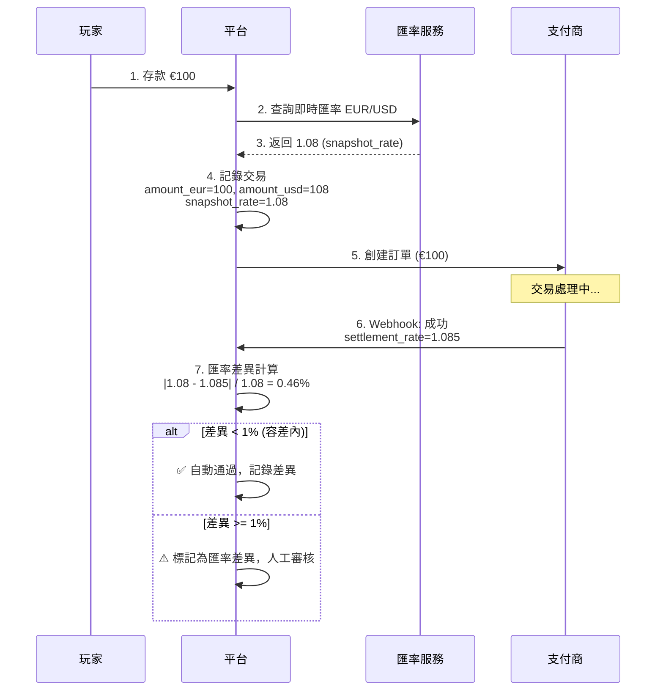

### 9.2 匯率對帳規則

| 差異範圍 | 處理方式 | 說明 |
|---------|---------|------|
| < 0.5% | ✅ 自動通過 | 正常匯率波動 |
| 0.5% - 1% | ⚠️ 記錄告警 | 較大波動，記錄但不阻斷 |
| 1% - 3% | 🟠 人工審核 | 異常波動，需確認 PSP 報表 |
| > 3% | 🔴 暫停交易 | 極端波動，可能是錯誤 |

### 9.3 匯率差異報告

```sql
-- 每日匯率差異報告
SELECT
    DATE(created_at) AS trade_date,
    currency_pair,
    COUNT(*) AS total_transactions,
    AVG(ABS(snapshot_rate - settlement_rate) / snapshot_rate * 100) AS avg_deviation_pct,
    MAX(ABS(snapshot_rate - settlement_rate) / snapshot_rate * 100) AS max_deviation_pct,
    SUM(CASE WHEN ABS(snapshot_rate - settlement_rate) / snapshot_rate > 0.01 THEN 1 ELSE 0 END) AS flagged_count
FROM t_payment_transaction
WHERE created_at >= CURDATE() - INTERVAL 1 DAY
GROUP BY DATE(created_at), currency_pair;
```

---

## 10. PSP 多結算週期處理

### 10.1 PSP 結算週期配置

| PSP 類型 | 結算週期 | 對帳策略 |
|---------|---------|---------|
| **即時結算** (PayPal, Crypto) | T+0 | Layer 1 實時對帳 |
| **次日結算** (Alipay, 部分銀行卡) | T+1 | Layer 3 日終對帳 |
| **多日結算** (信用卡, Stripe) | T+2 ~ T+7 | 延遲對帳任務 |
| **週結算** (部分銀行轉帳) | T+7 | 週度對帳任務 |

### 10.2 延遲對帳流程

```mermaid
graph TD
    A[T+1 日終對帳] --> B{檢查 PSP 結算週期}
    B -->|T+0/T+1| C[正常對帳流程]
    B -->|T+2~T+7| D[標記為待對帳]

    D --> E[寫入 t_pending_reconciliation]
    E --> F[記錄預期對帳日期]

    G[延遲對帳定時任務<br/>每日 03:00] --> H{查詢到期待對帳記錄}
    H -->|有記錄| I[執行對帳]
    I --> J{對帳結果}
    J -->|匹配| K[✅ 標記已對帳]
    J -->|不匹配| L[⚠️ 進入差異處理]
    J -->|PSP 無記錄| M[延長等待期 +1 天]

    M --> N{超過最大等待期?}
    N -->|是 (T+10)| O[🔴 標記為異常，人工處理]
    N -->|否| P[等待下次對帳]
```

### 10.3 PSP 配置表

```sql
CREATE TABLE t_psp_config (
    id BIGINT PRIMARY KEY AUTO_INCREMENT,
    psp_code VARCHAR(50) NOT NULL UNIQUE COMMENT 'PSP 代碼',
    psp_name VARCHAR(100) NOT NULL COMMENT 'PSP 名稱',
    settlement_cycle INT NOT NULL DEFAULT 1 COMMENT '結算週期 (天)',
    max_wait_days INT NOT NULL DEFAULT 10 COMMENT '最大等待天數',
    timezone VARCHAR(50) DEFAULT 'UTC' COMMENT 'PSP 報表時區',
    report_available_time TIME DEFAULT '02:00:00' COMMENT '報表可用時間',
    api_type ENUM('REST', 'SFTP', 'EMAIL') DEFAULT 'REST' COMMENT '報表獲取方式',
    is_active BOOLEAN DEFAULT TRUE,
    created_at DATETIME DEFAULT CURRENT_TIMESTAMP,
    updated_at DATETIME DEFAULT CURRENT_TIMESTAMP ON UPDATE CURRENT_TIMESTAMP,

    INDEX idx_settlement_cycle (settlement_cycle)
) COMMENT 'PSP 配置表';

-- 範例數據
INSERT INTO t_psp_config (psp_code, psp_name, settlement_cycle, timezone) VALUES
('STRIPE', 'Stripe', 2, 'UTC'),
('PAYPAL', 'PayPal', 0, 'America/Los_Angeles'),
('ADYEN', 'Adyen', 3, 'Europe/Amsterdam'),
('ALIPAY', 'Alipay', 1, 'Asia/Shanghai');
```

---

## 11. 退款與 Chargeback 對帳

### 11.1 退款類型定義

| 類型 | 觸發方 | 時間範圍 | 處理流程 |
|------|--------|---------|---------|
| **主動退款 (Refund)** | 營運商 | 交易後 1-30 天 | 營運商發起 → PSP 確認 → 玩家到帳 |
| **Chargeback** | 玩家銀行 | 交易後 1-120 天 | 銀行通知 → PSP 扣款 → 營運商申訴 |
| **預授權取消** | 營運商 | 授權後 7 天內 | 營運商發起 → PSP 取消 |

### 11.2 Chargeback 對帳流程

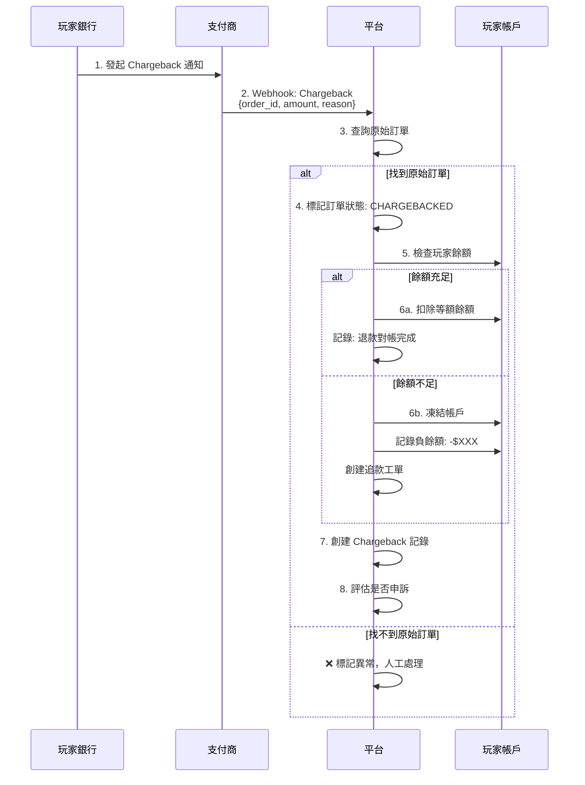

### 11.3 Chargeback 對帳表

```sql
CREATE TABLE t_chargeback_record (
    id BIGINT PRIMARY KEY AUTO_INCREMENT,
    original_order_id VARCHAR(64) NOT NULL COMMENT '原始訂單 ID',
    chargeback_id VARCHAR(64) NOT NULL UNIQUE COMMENT 'Chargeback ID',
    psp_code VARCHAR(50) NOT NULL,
    player_id BIGINT NOT NULL,

    -- 金額
    original_amount DECIMAL(18,4) NOT NULL COMMENT '原始交易金額',
    chargeback_amount DECIMAL(18,4) NOT NULL COMMENT 'Chargeback 金額',
    currency VARCHAR(3) NOT NULL,

    -- 狀態
    status ENUM('PENDING', 'DEDUCTED', 'DISPUTED', 'WON', 'LOST') DEFAULT 'PENDING',
    reason_code VARCHAR(50) COMMENT 'Chargeback 原因代碼',
    reason_description VARCHAR(500) COMMENT '原因描述',

    -- 時間
    original_transaction_date DATETIME COMMENT '原始交易時間',
    chargeback_date DATETIME NOT NULL COMMENT 'Chargeback 發生時間',
    dispute_deadline DATETIME COMMENT '申訴截止時間',
    resolved_at DATETIME COMMENT '解決時間',

    -- 處理
    player_balance_deducted BOOLEAN DEFAULT FALSE COMMENT '是否已扣除玩家餘額',
    dispute_submitted BOOLEAN DEFAULT FALSE COMMENT '是否已提交申訴',
    dispute_evidence TEXT COMMENT '申訴證據',

    created_at DATETIME DEFAULT CURRENT_TIMESTAMP,
    updated_at DATETIME DEFAULT CURRENT_TIMESTAMP ON UPDATE CURRENT_TIMESTAMP,

    INDEX idx_player_id (player_id),
    INDEX idx_status (status),
    INDEX idx_chargeback_date (chargeback_date)
) COMMENT 'Chargeback 記錄表';
```

### 11.4 Chargeback 告警規則

| 告警條件 | 優先級 | 處理時效 |
|---------|--------|---------|
| 單筆 Chargeback > $1,000 | 🔴 P0 | 立即 |
| 玩家 30 天內 Chargeback >= 3 次 | 🟠 P1 | 4h |
| 日 Chargeback 率 > 0.5% | 🟠 P1 | 4h |
| 月 Chargeback 率 > 1% | 🔴 P0 | 立即 |

---

## 12. Jackpot 對帳

### 12.1 Jackpot 類型與對帳責任

| Jackpot 類型 | 支付責任 | 對帳對象 | 說明 |
|-------------|---------|---------|------|
| **Network Jackpot** | GP 支付 | 平台 ↔ GP | 跨營運商累積獎池 |
| **Local Jackpot** | 營運商支付 | 平台內部 | 單一營運商獎池 |
| **Progressive Jackpot** | GP 支付 | 平台 ↔ GP | 累進式獎池 |

### 12.2 Network Jackpot 對帳流程

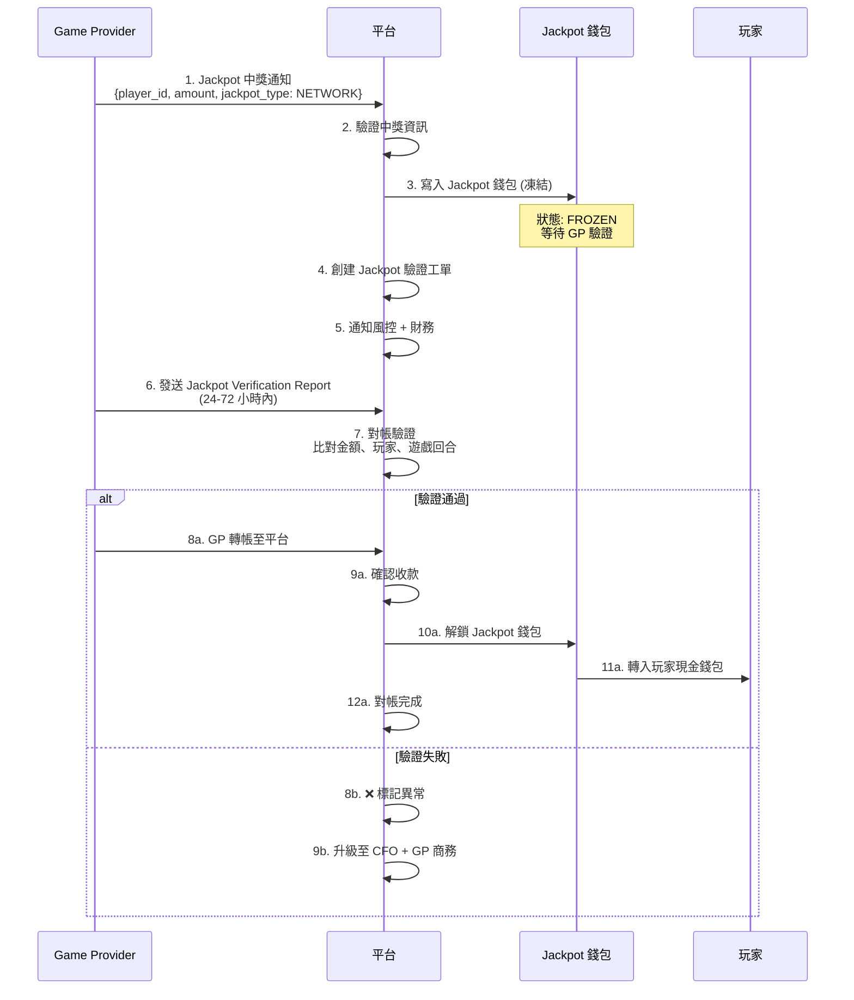

### 12.3 Jackpot 對帳表

```sql
CREATE TABLE t_jackpot_reconciliation (
    id BIGINT PRIMARY KEY AUTO_INCREMENT,
    jackpot_id VARCHAR(64) NOT NULL UNIQUE COMMENT 'Jackpot ID',
    player_id BIGINT NOT NULL,
    game_id VARCHAR(50) NOT NULL,
    round_id VARCHAR(64) NOT NULL,
    gp_code VARCHAR(50) NOT NULL COMMENT 'Game Provider 代碼',

    -- Jackpot 資訊
    jackpot_type ENUM('NETWORK', 'LOCAL', 'PROGRESSIVE') NOT NULL,
    amount DECIMAL(18,4) NOT NULL,
    currency VARCHAR(3) NOT NULL,

    -- 對帳狀態
    status ENUM('PENDING_VERIFICATION', 'VERIFIED', 'FUNDED', 'RELEASED', 'DISPUTED') DEFAULT 'PENDING_VERIFICATION',
    gp_report_received BOOLEAN DEFAULT FALSE,
    gp_report_date DATETIME,
    gp_payment_received BOOLEAN DEFAULT FALSE,
    gp_payment_date DATETIME,

    -- 驗證結果
    verification_result ENUM('MATCH', 'AMOUNT_MISMATCH', 'NOT_FOUND') DEFAULT NULL,
    amount_difference DECIMAL(18,4) COMMENT '差異金額 (如有)',

    -- 時間
    win_time DATETIME NOT NULL COMMENT '中獎時間',
    released_time DATETIME COMMENT '發放時間',

    created_at DATETIME DEFAULT CURRENT_TIMESTAMP,
    updated_at DATETIME DEFAULT CURRENT_TIMESTAMP ON UPDATE CURRENT_TIMESTAMP,

    INDEX idx_player_id (player_id),
    INDEX idx_status (status),
    INDEX idx_gp_code (gp_code)
) COMMENT 'Jackpot 對帳記錄';
```

### 12.4 Jackpot 對帳 SLA

| 階段 | SLA | 超時處理 |
|------|-----|---------|
| GP 驗證報告 | 72 小時 | 升級至 GP 商務 |
| GP 轉帳 | 驗證後 7 天 | 暫停該 GP 新交易 |
| 玩家發放 | 收款後 24 小時 | P0 告警 |

---

## 13. 負餘額對帳處理

### 13.1 負餘額產生場景

| 場景 | 原因 | 典型金額 | 風險等級 |
|------|------|---------|---------|
| **Chargeback** | 銀行退款後餘額不足扣除 | $10 - $10,000 | 🔴 HIGH |
| **遊戲 Rollback** | Void/Cancel 後餘額不足 | $1 - $500 | 🟡 MEDIUM |
| **系統錯誤** | 重複入帳後回滾 | 可變 | 🟠 HIGH |
| **獎金追回** | 違規獲取獎金被扣除 | $10 - $5,000 | 🟡 MEDIUM |
| **匯率調整** | 結算匯率與交易匯率差異 | $1 - $100 | 🟢 LOW |

### 13.2 負餘額追蹤機制

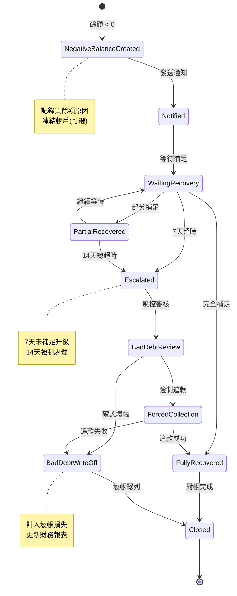

### 13.3 負餘額對帳規則

**自動處理規則**:

| 條件 | 處理方式 | 說明 |
|------|---------|------|
| 負餘額 < $10 | 自動補足 | 從下次存款扣除 |
| 負餘額 $10 - $100 | 通知 + 等待 | 7 天內自動恢復 |
| 負餘額 > $100 | 凍結帳戶 | 需補足後解凍 |
| 負餘額 > $1,000 | 凍結 + 風控審核 | 可能涉及欺詐 |

**壞帳認列條件**:

```yaml
壞帳認列規則:
  時間條件:
    - 負餘額持續 > 30 天
    - 玩家 90 天無登入

  金額條件:
    - 單筆 < $50: 30 天後自動認列
    - 單筆 $50-$500: 60 天後人工審核認列
    - 單筆 > $500: 需法務評估追款可能性

  例外情況:
    - VIP 玩家: 延長至 90 天
    - 爭議中: 暫不認列
    - 法律追索中: 暫不認列
```

### 13.4 負餘額對帳表

```sql
CREATE TABLE t_negative_balance_record (
    id BIGINT PRIMARY KEY AUTO_INCREMENT,
    player_id BIGINT NOT NULL,

    -- 負餘額資訊
    initial_amount DECIMAL(18,4) NOT NULL COMMENT '初始負餘額金額',
    current_amount DECIMAL(18,4) NOT NULL COMMENT '當前負餘額金額',
    currency VARCHAR(3) NOT NULL DEFAULT 'USD',

    -- 原因追蹤
    source_type ENUM('CHARGEBACK', 'ROLLBACK', 'BONUS_CLAWBACK', 'SYSTEM_ERROR', 'FOREX_ADJUSTMENT') NOT NULL,
    source_id VARCHAR(64) COMMENT '來源記錄 ID',
    description VARCHAR(500) COMMENT '說明',

    -- 狀態
    status ENUM('ACTIVE', 'PARTIAL_RECOVERED', 'FULLY_RECOVERED', 'ESCALATED', 'BAD_DEBT', 'CLOSED') DEFAULT 'ACTIVE',
    account_frozen BOOLEAN DEFAULT FALSE COMMENT '帳戶是否凍結',

    -- 恢復追蹤
    total_recovered DECIMAL(18,4) DEFAULT 0 COMMENT '已恢復金額',
    last_recovery_date DATETIME COMMENT '最後恢復日期',

    -- 時間
    created_at DATETIME DEFAULT CURRENT_TIMESTAMP,
    escalated_at DATETIME COMMENT '升級時間',
    closed_at DATETIME COMMENT '關閉時間',

    -- 壞帳處理
    bad_debt_amount DECIMAL(18,4) COMMENT '壞帳金額',
    bad_debt_approved_by BIGINT COMMENT '壞帳審批人',
    bad_debt_date DATETIME COMMENT '壞帳認列日期',

    updated_at DATETIME DEFAULT CURRENT_TIMESTAMP ON UPDATE CURRENT_TIMESTAMP,

    INDEX idx_player_id (player_id),
    INDEX idx_status (status),
    INDEX idx_created_at (created_at)
) COMMENT '負餘額對帳記錄';

-- 恢復記錄明細表
CREATE TABLE t_negative_balance_recovery (
    id BIGINT PRIMARY KEY AUTO_INCREMENT,
    negative_balance_id BIGINT NOT NULL,
    player_id BIGINT NOT NULL,

    recovery_amount DECIMAL(18,4) NOT NULL COMMENT '恢復金額',
    recovery_type ENUM('DEPOSIT', 'BONUS', 'MANUAL_ADJUSTMENT', 'FORCED_DEDUCTION') NOT NULL,
    source_transaction_id VARCHAR(64) COMMENT '來源交易 ID',

    created_at DATETIME DEFAULT CURRENT_TIMESTAMP,

    FOREIGN KEY (negative_balance_id) REFERENCES t_negative_balance_record(id),
    INDEX idx_negative_balance_id (negative_balance_id)
) COMMENT '負餘額恢復明細';
```

### 13.5 負餘額對帳報告

```sql
-- 每日負餘額報告
SELECT
    DATE(created_at) AS report_date,
    source_type,
    COUNT(*) AS total_cases,
    SUM(initial_amount) AS total_negative_amount,
    SUM(total_recovered) AS total_recovered_amount,
    SUM(CASE WHEN status = 'BAD_DEBT' THEN bad_debt_amount ELSE 0 END) AS total_bad_debt,
    AVG(DATEDIFF(COALESCE(closed_at, NOW()), created_at)) AS avg_resolution_days
FROM t_negative_balance_record
WHERE created_at >= CURDATE() - INTERVAL 30 DAY
GROUP BY DATE(created_at), source_type
ORDER BY report_date DESC, source_type;
```

### 13.6 告警規則

| 告警條件 | 優先級 | 通知對象 |
|---------|--------|---------|
| 單筆負餘額 > $5,000 | 🔴 P0 | CFO + Risk Team |
| 日累計負餘額 > $10,000 | 🟠 P1 | Finance Manager |
| 負餘額帳戶 > 7 天未恢復 | 🟡 P2 | Finance Specialist |
| 月壞帳率 > 0.1% | 🟠 P1 | CFO |

---

## 14. AML/KYC 對帳整合

### 14.1 對帳與 AML 整合點

對帳數據需支援反洗錢 (AML) 與客戶盡職調查 (KYC) 要求：

| 整合點 | 對帳責任 | AML/KYC 責任 | 數據流向 |
|--------|---------|-------------|---------|
| **大額交易標記** | 標記 > $10,000 交易 | 生成 CTR 報告 | 對帳 → AML |
| **可疑交易報告** | 識別異常模式 | 生成 STR 報告 | 對帳 → AML |
| **KYC 狀態關聯** | 驗證 KYC 狀態 | 提供 KYC 等級 | KYC → 對帳 |
| **制裁名單篩查** | 交易方資訊 | 名單比對 | 對帳 → AML |

### 14.2 交易監控規則

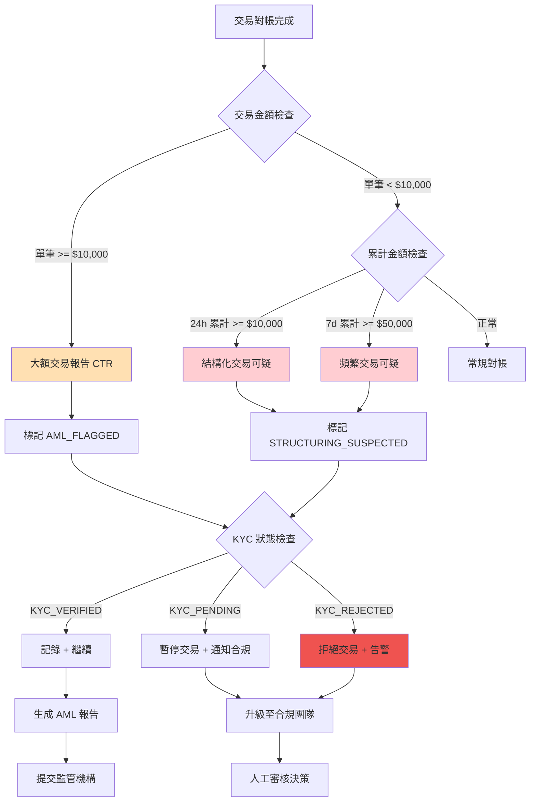

### 14.3 對帳報告 AML 欄位擴展

```sql
-- 對帳報告增加 AML 相關欄位
ALTER TABLE t_reconciliation_record ADD COLUMN IF NOT EXISTS (
    kyc_level ENUM('NONE', 'BASIC', 'ENHANCED', 'FULL') COMMENT 'KYC 等級',
    kyc_verified_at DATETIME COMMENT 'KYC 驗證時間',
    aml_flag ENUM('NORMAL', 'CTR', 'STR', 'STRUCTURING', 'SANCTIONED') DEFAULT 'NORMAL',
    aml_reviewed BOOLEAN DEFAULT FALSE,
    aml_reviewed_by BIGINT COMMENT 'AML 審核人',
    aml_reviewed_at DATETIME COMMENT 'AML 審核時間'
);

-- STR (可疑交易報告) 生成查詢
SELECT
    r.player_id,
    p.full_name,
    p.kyc_level,
    p.country,
    COUNT(*) AS transaction_count,
    SUM(r.amount) AS total_amount,
    GROUP_CONCAT(r.order_id) AS order_ids,
    MAX(r.created_at) AS last_transaction
FROM t_reconciliation_record r
JOIN t_player p ON r.player_id = p.id
WHERE r.created_at >= CURDATE() - INTERVAL 7 DAY
  AND r.aml_flag IN ('STR', 'STRUCTURING')
  AND r.aml_reviewed = FALSE
GROUP BY r.player_id, p.full_name, p.kyc_level, p.country
HAVING total_amount >= 10000 OR transaction_count >= 10
ORDER BY total_amount DESC;
```

### 14.4 KYC 等級與交易限額

| KYC 等級 | 單筆限額 | 日限額 | 月限額 | 對帳處理 |
|---------|---------|--------|--------|---------|
| **NONE** | $100 | $500 | $2,000 | 超限自動拒絕 |
| **BASIC** | $1,000 | $5,000 | $20,000 | 超限需人工審核 |
| **ENHANCED** | $10,000 | $50,000 | $200,000 | 大額自動標記 |
| **FULL** | $50,000 | $200,000 | 無限制 | 僅記錄 CTR |

### 14.5 AML 對帳報告

```sql
-- 每日 AML 對帳彙總報告
SELECT
    DATE(created_at) AS report_date,
    aml_flag,
    COUNT(*) AS transaction_count,
    SUM(amount) AS total_amount,
    COUNT(DISTINCT player_id) AS unique_players,
    SUM(CASE WHEN aml_reviewed THEN 1 ELSE 0 END) AS reviewed_count,
    SUM(CASE WHEN aml_reviewed = FALSE THEN 1 ELSE 0 END) AS pending_review
FROM t_reconciliation_record
WHERE created_at >= CURDATE() - INTERVAL 1 DAY
  AND aml_flag != 'NORMAL'
GROUP BY DATE(created_at), aml_flag
ORDER BY report_date DESC, total_amount DESC;
```

### 14.6 告警與升級

| 場景 | 優先級 | 通知對象 | SLA |
|------|--------|---------|-----|
| 制裁名單匹配 | 🔴 P0 | MLRO + Legal | 立即 |
| 大額現金交易 > $50,000 | 🟠 P1 | Compliance Team | 4h |
| 結構化交易可疑 | 🟠 P1 | AML Analyst | 24h |
| 未驗證 KYC 大額 | 🟡 P2 | KYC Team | 48h |

> **關聯文檔**: KYC/AML 完整流程詳見 [05-03 KYC AML](../05_Risk_Control/05-03_KYC_AML.md)

---

## 15. 跨時區對帳規則

### 15.1 時區統一策略

**核心原則**: 所有對帳以 UTC 為基準，各數據源時區轉換後比對。

| 數據源 | 原始時區 | 轉換方式 | 時區偏移 |
|--------|---------|---------|---------|
| **平台訂單** | UTC | 無需轉換 | +0 |
| **PSP 報表** | 各 PSP 配置 | 按 t_psp_config.timezone | 可變 |
| **銀行報表** | 當地時區 | 按銀行配置 | 可變 |
| **GP 報表** | 各 GP 配置 | 按 t_gp_config.timezone | 可變 |

### 15.2 跨日交易處理

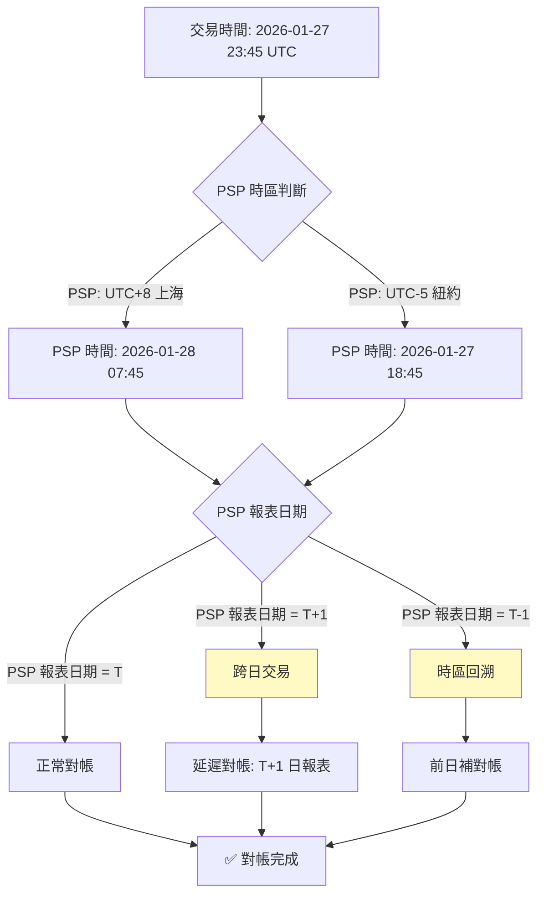

### 15.3 時間容差配置

```yaml
跨時區對帳規則:
  時間戳統一:
    儲存格式: UTC (TIMESTAMP WITH TIME ZONE)
    顯示格式: 依用戶偏好時區

  對帳時間窗口:
    標準窗口: 00:00:00 - 23:59:59 UTC
    容差範圍: ±30 分鐘 (處理跨日邊界)

  PSP 報表時區轉換:
    Stripe: UTC
    PayPal: America/Los_Angeles (UTC-8/-7)
    Alipay: Asia/Shanghai (UTC+8)
    Adyen: Europe/Amsterdam (UTC+1/+2)

  GP 報表時區轉換:
    Pragmatic Play: UTC
    Evolution: Europe/Riga (UTC+2/+3)
    PG Soft: Asia/Manila (UTC+8)

  跨日處理:
    識別條件: 平台日期 ≠ PSP 報表日期
    處理方式: 標記為跨日交易，延後對帳
    最大延遲: 48 小時 (覆蓋週末)
```

### 15.4 跨時區對帳表

```sql
CREATE TABLE t_timezone_reconciliation (
    id BIGINT PRIMARY KEY AUTO_INCREMENT,
    order_id VARCHAR(64) NOT NULL,

    -- 平台時間
    platform_time_utc DATETIME NOT NULL COMMENT '平台 UTC 時間',
    platform_date DATE NOT NULL COMMENT '平台日期 (UTC)',

    -- PSP 時間
    psp_code VARCHAR(50) NOT NULL,
    psp_timezone VARCHAR(50) NOT NULL COMMENT 'PSP 時區',
    psp_time_local DATETIME COMMENT 'PSP 當地時間',
    psp_time_utc DATETIME COMMENT 'PSP 轉換 UTC',
    psp_date DATE COMMENT 'PSP 報表日期',

    -- 時差分析
    time_diff_minutes INT COMMENT '時間差 (分鐘)',
    is_cross_day BOOLEAN DEFAULT FALSE COMMENT '是否跨日',
    reconciliation_date DATE COMMENT '實際對帳日期',

    status ENUM('PENDING', 'MATCHED', 'CROSS_DAY_PENDING', 'MATCHED_DELAYED') DEFAULT 'PENDING',

    created_at DATETIME DEFAULT CURRENT_TIMESTAMP,
    reconciled_at DATETIME,

    INDEX idx_platform_date (platform_date),
    INDEX idx_psp_code (psp_code),
    INDEX idx_is_cross_day (is_cross_day)
) COMMENT '跨時區對帳記錄';
```

### 15.5 時區對帳報告

```sql
-- 跨時區對帳統計
SELECT
    psp_code,
    psp_timezone,
    COUNT(*) AS total_transactions,
    SUM(CASE WHEN is_cross_day THEN 1 ELSE 0 END) AS cross_day_count,
    ROUND(SUM(CASE WHEN is_cross_day THEN 1 ELSE 0 END) * 100.0 / COUNT(*), 2) AS cross_day_pct,
    AVG(ABS(time_diff_minutes)) AS avg_time_diff_minutes
FROM t_timezone_reconciliation
WHERE created_at >= CURDATE() - INTERVAL 7 DAY
GROUP BY psp_code, psp_timezone
ORDER BY cross_day_count DESC;
```

### 15.6 時區相關告警

| 告警條件 | 優先級 | 說明 |
|---------|--------|------|
| 跨日交易率 > 5% | 🟡 P2 | 需檢查 PSP 時區配置 |
| 時間差 > 60 分鐘 | 🟠 P1 | 可能系統時鐘不同步 |
| PSP 報表時區變更 | 🟠 P1 | 需更新配置並重對帳 |

---

## 16. 資金隔離驗證整合

> **業界依據**: UKGC LCCP 4.2.1, MGA Rule 44
> **罰款案例**: William Hill £6.2M (2018) - 資金隔離不當

### 16.1 驗證流程

**執行時機**: 每日 03:00 UTC（T+1 對帳完成後）

**驗證公式**:
```
信託帳戶餘額 >= Σ(玩家錢包餘額) + 在途存款 - 在途取款 + 安全緩衝
```

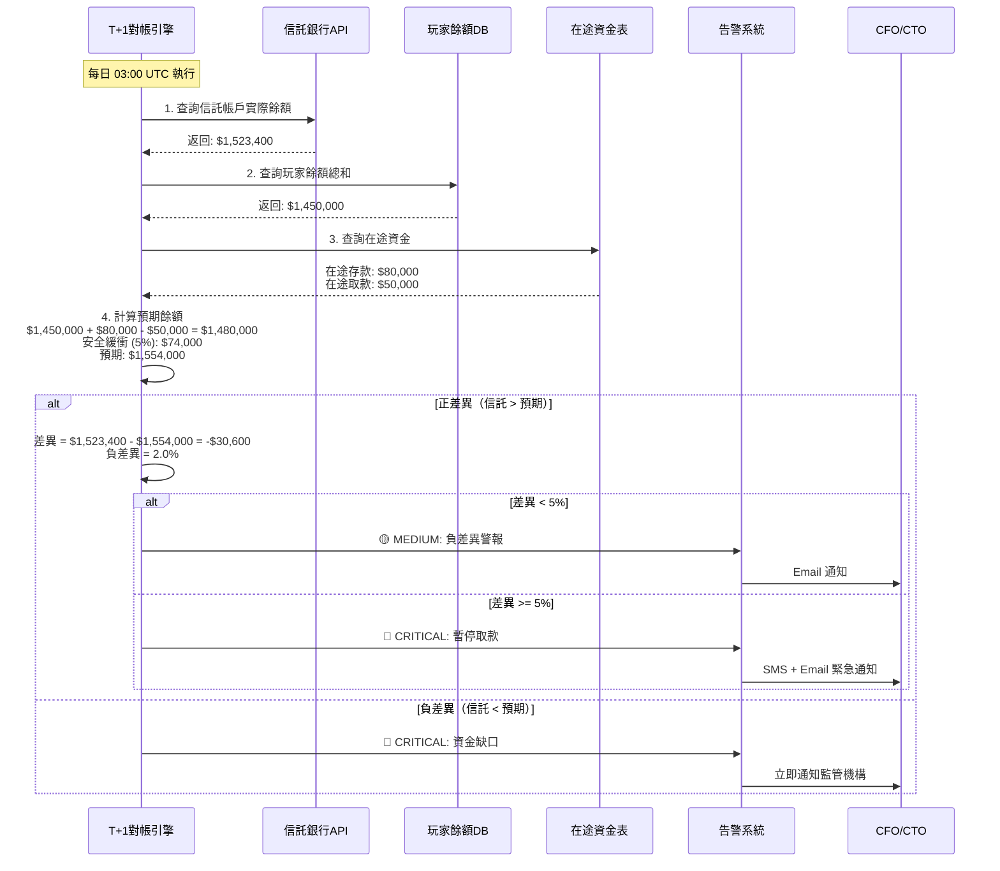

### 16.2 差異處理矩陣

| 差異類型 | 差異範圍 | 風險等級 | 處理方式 | SLA |
|---------|---------|---------|---------|-----|
| **正差異** (銀行 > 預期) | < 5% | 🟢 LOW | 記錄為安全緩衝 | 24h |
| | 5-10% | 🟡 MEDIUM | 調查 GGR 結算延遲 | 4h |
| | > 10% | 🟠 HIGH | 可能錯誤入帳，立即調查 | 1h |
| **負差異** (銀行 < 預期) | < 1% | 🟡 MEDIUM | 檢查在途資金延遲 | 4h |
| | 1-5% | 🔴 HIGH | 暫停大額取款 (> $10,000) | 1h |
| | > 5% | 🔴 **CRITICAL** | 凍結所有取款，通知監管機構 | 立即 |

### 16.3 與對帳系統整合點

| 整合點 | 數據來源 | 觸發條件 | 驗證內容 |
|--------|---------|---------|---------|
| T+1 日終對帳後 | 對帳結果表 | 對帳完成事件 | 信託餘額 >= 玩家餘額 |
| GGR 結算後 | GGR 結算表 | 結算完成事件 | 結算金額已轉入營運帳戶 |
| 大額取款時 | 取款請求 | 單筆 > $10,000 | 即時驗證隔離狀態 |
| 月度合規報告 | 月結報表 | 每月 1 日 | 生成監管報告 |

### 16.4 資金隔離驗證 API

```http
GET /api/admin/fund-segregation/verify?date={yyyy-MM-dd}

Response:
{
  "code": 0,
  "data": {
    "verificationDate": "2026-02-07",
    "trustAccountBalance": 1523400.00,
    "playerTotalBalance": 1450000.00,
    "transitDeposits": 80000.00,
    "transitWithdrawals": 50000.00,
    "expectedMinimum": 1554000.00,
    "difference": -30600.00,
    "differencePercentage": -1.97,
    "status": "MEDIUM_ALERT",
    "lastVerifiedAt": "2026-02-07T03:00:00Z"
  }
}
```

### 16.5 合規報告生成

**UKGC 月度報告欄位**:

| 報告項目 | 數據來源 | 計算方式 |
|---------|---------|---------|
| 月均信託餘額 | 每日驗證記錄 | AVG(daily_trust_balance) |
| 月均玩家餘額 | 每日快照 | AVG(daily_player_balance) |
| 最低覆蓋率 | 每日計算 | MIN(trust / player) × 100% |
| 缺口天數 | 每日驗證 | COUNT(trust < player) |
| 最大缺口金額 | 異常記錄 | MAX(player - trust) |

> **關聯文檔**: 玩家資金隔離完整規範詳見 [02-08 Player Funds Segregation](./02-08_Player_Funds_Segregation.md)

---

## 17. 風控與對帳協調機制

> **業界依據**: UKGC AML Guidance 2023, ISO 27001 5.3 (職責分離)
> **罰款案例**: Entain £17M (2023) - VIP 豁免 AML 檢查

### 17.1 優先級定義

**核心原則**: 風控檢查優先於財務對帳，SAR 調查優先於所有操作。

| 情境 | 風控決策 | 對帳決策 | 最終處理 | 優先級規則 |
|------|---------|---------|---------|-----------|
| SAR 調查中 + 任何對帳操作 | SAR 優先 | 暫停 | 等待 SAR 結果 | **SAR > 所有** |
| 玩家凍結 + 對帳差異 | 凍結資金 | 需對帳 | 先完成風控調查 | **風控 > 對帳** |
| 對帳短款 + 玩家正常 | 無風險 | 回滾餘額 | 執行對帳回滾 | **對帳優先** |
| 大額提款 + 對帳未完成 | 需審核 | 未確認 | 暫緩提款 | **風控 = 對帳** |
| AML 警報 + 長款補單 | AML 審核 | 待補單 | 先完成 AML 審核 | **風控 > 對帳** |

### 17.2 衝突解決流程

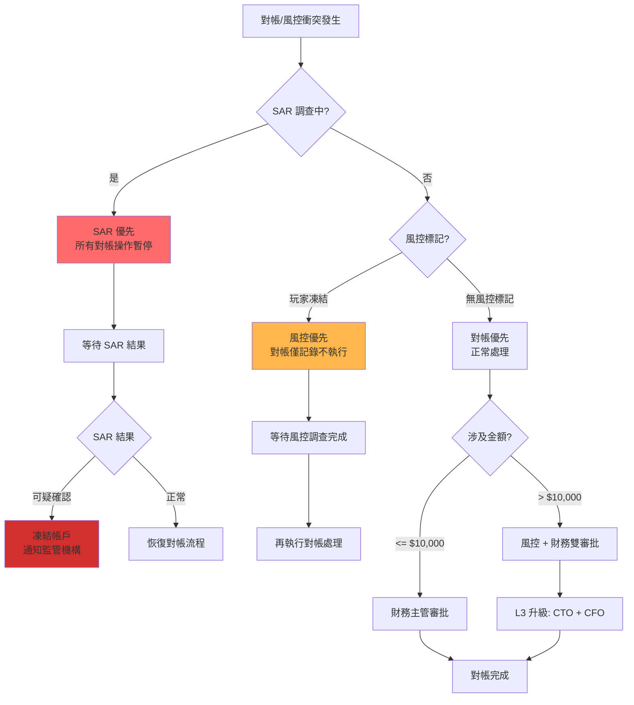

### 17.3 升級路徑

| 層級 | 處理人 | 決策權限 | 時效 | 升級條件 |
|------|--------|---------|------|---------|
| **L1** | 系統自動 | 風控 Flag + 對帳異常 → 自動暫停 | 即時 | 自動觸發 |
| **L2** | 財務主管 | 金額 < $10,000 的衝突 | 4h | L1 未解決 |
| **L3** | CTO + CFO | 金額 >= $10,000 或涉及 SAR | 1h | L2 未解決 |
| **L4** | Board | 涉及監管報告或重大資金 | 24h | L3 需董事會知會 |

### 17.4 VIP 無豁免原則

> ⚠️ **CRITICAL**: VIP 玩家必須經過與普通玩家**完全相同**的風控/對帳規則。

**VIP 狀態影響範圍**:
- ✅ **可影響**: 審核隊列優先級（VIP 優先處理）
- ✅ **可影響**: 客服響應 SLA（VIP 更快響應）
- ❌ **不可影響**: 風控規則觸發門檻
- ❌ **不可影響**: AML 檢查流程
- ❌ **不可影響**: 對帳差異處理邏輯

### 17.5 對帳與風控 API 整合

```java
/**
 * 對帳處理前必須檢查風控狀態
 */
public ResponseDTO<ReconciliationResult> processReconciliation(ReconciliationRequest request) {
    Long playerId = request.getPlayerId();

    // 1. 檢查 SAR 調查狀態
    SarStatus sarStatus = riskService.getSarStatus(playerId);
    if (sarStatus == SarStatus.UNDER_INVESTIGATION) {
        return ResponseDTO.error("SAR 調查中，對帳暫停");
    }

    // 2. 檢查玩家風控狀態
    RiskStatus riskStatus = riskService.getPlayerRiskStatus(playerId);
    if (riskStatus == RiskStatus.FROZEN) {
        // 僅記錄，不執行
        reconciliationLogService.logPendingReconciliation(request, "玩家凍結");
        return ResponseDTO.error("玩家凍結中，對帳待處理");
    }

    // 3. 正常對帳處理
    return reconciliationService.execute(request);
}
```

> **關聯文檔**:
> - KYC/AML 完整流程詳見 [05-03 KYC AML](../05_Risk_Control/05-03_KYC_AML.md)
> - 詐欺檢測詳見 [05-02 Fraud Detection](../05_Risk_Control/05-02_Fraud_Detection.md)

---

## 18. 多帳戶對帳處理

> **業界依據**: UKGC AML Guidance, MGA Rule 5.3.3 (關聯帳戶追溯)
> **技術方案**: Neo4j 圖譜分析 + 對帳系統整合

### 18.1 關聯帳戶識別來源

| 數據來源 | 識別信號 | 關聯強度 | 對帳影響 |
|---------|---------|---------|---------|
| **Neo4j 圖譜** | 設備指紋相同 | 🔴 HIGH | 合併統計 |
| **Neo4j 圖譜** | IP 地址相同 + 同時段活動 | 🟠 MEDIUM | 標記審核 |
| **Neo4j 圖譜** | 支付卡關聯 | 🔴 HIGH | 合併統計 |
| **風控系統** | 資金流聚集檢測 | 🔴 HIGH | 反向追溯 |
| **AML 警報** | 多帳號同向投注 | 🔴 HIGH | 兩邊標記 |

### 18.2 資金追溯規則

| 場景 | 追溯範圍 | 處理方式 | 對帳標記 |
|------|---------|---------|---------|
| **確認多帳號** | 所有關聯帳號的全部交易 | 合併統計 GGR | `MULTI_ACCOUNT_LINKED` |
| **資金聚集** | 輸家帳號 → 贏家帳號 | 反向追溯資金流 | `FUND_AGGREGATION` |
| **套利投注** | 對沖投注的雙邊帳號 | 兩邊都標記 | `ARBITRAGE_PAIR` |
| **洗錢可疑** | 整個關聯網絡 | 全部凍結 + SAR | `AML_SUSPECTED` |

### 18.3 帳戶群組對帳流程

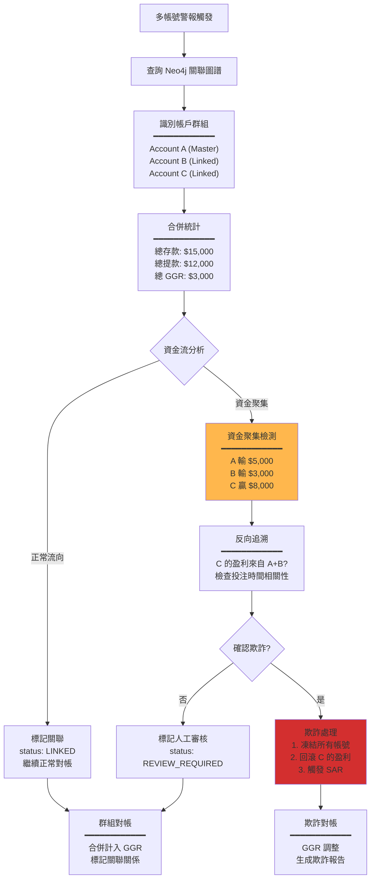

### 18.4 對帳報表擴展欄位

```sql
-- 對帳記錄表擴展欄位
ALTER TABLE t_reconciliation_record ADD COLUMN IF NOT EXISTS (
    linked_account_ids JSON COMMENT '關聯帳號列表 ["A001", "A002", "A003"]',
    account_group_id VARCHAR(64) COMMENT '帳戶群組 ID',
    aggregation_role ENUM('MASTER', 'LINKED', 'NEUTRAL') COMMENT '群組角色',
    aggregation_source_type ENUM('LOSER', 'WINNER', 'NEUTRAL') COMMENT '資金聚集角色',
    total_linked_amount DECIMAL(18,4) COMMENT '關聯帳號總金額',
    fraud_flag ENUM('NONE', 'SUSPECTED', 'CONFIRMED') DEFAULT 'NONE' COMMENT '欺詐標記'
);

-- 群組對帳彙總查詢
SELECT
    account_group_id,
    COUNT(DISTINCT player_id) AS linked_accounts,
    SUM(deposit_amount) AS total_deposits,
    SUM(withdrawal_amount) AS total_withdrawals,
    SUM(ggr_amount) AS total_ggr,
    MAX(fraud_flag) AS highest_fraud_flag
FROM t_reconciliation_record
WHERE account_group_id IS NOT NULL
  AND DATE(created_at) = '2026-02-07'
GROUP BY account_group_id;
```

### 18.5 告警規則

| 告警條件 | 優先級 | 通知對象 | SLA |
|---------|--------|---------|-----|
| 新識別多帳號群組 (>= 3 個帳號) | 🟠 P1 | Risk Team | 4h |
| 資金聚集金額 >= $10,000 | 🔴 P0 | Risk + CFO | 1h |
| 套利投注群組 | 🟠 P1 | Risk + Trading | 4h |
| 確認欺詐 | 🔴 P0 | CTO + CFO + Legal | 立即 |

---

## 19. 監管報告與對帳整合

> **業界依據**: UKGC Reporting Requirements, MGA Reporting Requirements, Gambling Levy Act 2025
> **報告頻率**: 月度 / 年度 / 即時 (大獎)

### 19.1 報告類型與數據來源

| 報告類型 | 監管機構 | 頻率 | 對帳數據來源 | 格式 | SLA |
|---------|---------|------|-------------|------|-----|
| **Monthly GGR** | UKGC/MGA | 每月 | T+1 對帳結果 | JSON/CSV | 月後 15 日 |
| **Gambling Levy** | UKGC | 每月 | GGR 計算表 | UKGC Portal | 月後 28 日 |
| **Player Protection** | UKGC | 每月 | 自我排除 + 對帳凍結 | PDF | 月後 15 日 |
| **SAR Summary** | NCA/FIAU | 每月 | AML 警報 + 對帳異常 | XML | 月後 10 日 |
| **Jackpot Report** | All | 即時 | Jackpot 對帳表 | Webhook | 24h 內 |
| **Annual Report** | UKGC/MGA | 年度 | 全年對帳彙總 | PDF | 年後 90 日 |

### 19.2 數據一致性驗證

**驗證公式**:
```
|監管報告 GGR - 對帳報告 GGR| / 對帳報告 GGR < 0.01%
```

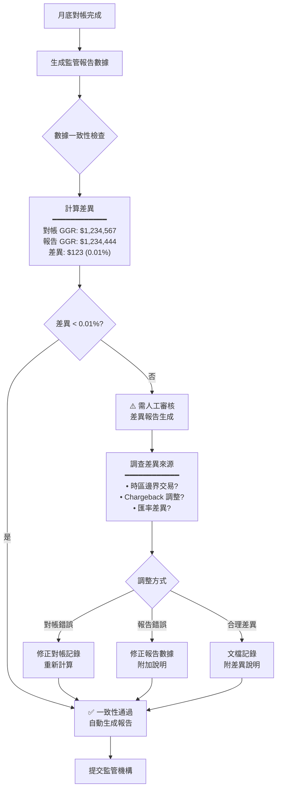

### 19.3 Gambling Levy 計算整合 (UKGC 2025)

**Levy 費率分級**:

| 年 GGR 範圍 | Levy 費率 | 計算基礎 |
|------------|----------|---------|
| £0 - £1M | 0.1% | 對帳 GGR |
| £1M - £50M | 0.25% | 對帳 GGR |
| £50M - £250M | 0.5% | 對帳 GGR |
| > £250M | 1.1% | 對帳 GGR |

**對帳整合點**:

```sql
-- 月度 Levy 計算 (基於對帳 GGR)
SELECT
    DATE_FORMAT(created_at, '%Y-%m') AS month,
    SUM(ggr_amount) AS monthly_ggr,
    CASE
        WHEN SUM(ggr_amount) <= 83333.33 THEN SUM(ggr_amount) * 0.001  -- £1M/12
        WHEN SUM(ggr_amount) <= 4166666.67 THEN SUM(ggr_amount) * 0.0025  -- £50M/12
        WHEN SUM(ggr_amount) <= 20833333.33 THEN SUM(ggr_amount) * 0.005  -- £250M/12
        ELSE SUM(ggr_amount) * 0.011
    END AS estimated_levy
FROM t_reconciliation_record
WHERE reconciliation_status = 'COMPLETED'
  AND DATE_FORMAT(created_at, '%Y-%m') = '2026-02'
GROUP BY DATE_FORMAT(created_at, '%Y-%m');
```

### 19.4 報告生成 API

```http
POST /api/admin/regulatory-report/generate
Request:
{
  "reportType": "MONTHLY_GGR",
  "jurisdiction": "UKGC",
  "period": "2026-02",
  "includeReconciliationData": true
}

Response:
{
  "code": 0,
  "data": {
    "reportId": "RPT-2026-02-UKGC-001",
    "status": "GENERATED",
    "reconciliationSummary": {
      "totalTransactions": 152340,
      "reconciledTransactions": 152289,
      "reconciliationRate": "99.97%",
      "ggrAmount": 1234567.89,
      "pendingDiscrepancies": 51
    },
    "dataConsistency": {
      "status": "PASSED",
      "difference": 0.008,
      "differencePercentage": "0.0006%"
    },
    "downloadUrl": "/reports/RPT-2026-02-UKGC-001.pdf",
    "submissionDeadline": "2026-03-15"
  }
}
```

### 19.5 報告審計追蹤

| 審計項目 | 記錄內容 | 保留期限 |
|---------|---------|---------|
| 報告生成時間 | Timestamp + 操作者 | 10 年 |
| 數據快照 | 對帳數據 Hash | 10 年 |
| 一致性檢查結果 | 差異金額 + 處理方式 | 10 年 |
| 提交確認 | 監管機構回執 | 10 年 |
| 修訂歷史 | 版本號 + 修訂原因 | 10 年 |

> **關聯文檔**:
> - UKGC 合規詳見 [06-08 UKGC Compliance](../06_Platform_Governance/06-08_UKGC_Compliance.md)
> - MGA 合規詳見 [06-09 MGA Compliance](../06_Platform_Governance/06-09_MGA_Compliance.md)

---

## 20. 性能 SLA (Performance SLAs)

> **業界依據**: ISO 22301 (業務連續性), PCI DSS 10.5 (處理時效)
> **目的**: 確保對帳系統滿足業務與合規需求的處理時效

### 20.1 對帳層級 SLA

| 層級 | 操作 | 目標延遲 | 警告閾值 | 嚴重閾值 | 告警優先級 |
|------|------|---------|---------|---------|-----------|
| **L1 實時** | 單筆交易驗證 | < 500ms | > 800ms | > 1s | P0 |
| **L1 實時** | PSP 回調處理 | < 30s | > 45s | > 60s | P0 |
| **L2 批次** | 每小時對帳批次 | < 5min | > 10min | > 15min | P1 |
| **L2 批次** | PSP 批次查詢 (1000 筆) | < 30s | > 45s | > 60s | P1 |
| **L3 日終** | T+1 全量對帳 | < 30min | > 45min | > 1h | P2 |
| **L3 日終** | 財務報表生成 | < 5min | > 10min | > 15min | P2 |

### 20.2 匹配率 SLA

| 指標 | 目標 | 警告 | 嚴重 |
|------|------|------|------|
| **每日匹配率** | >= 99.5% | < 99% | < 95% |
| **首次匹配率** | >= 95% | < 90% | < 80% |
| **差異解決時間** | < 4h | > 8h | > 24h |
| **P0 差異響應** | < 15min | > 30min | > 1h |

### 20.3 吞吐量 SLA

| 場景 | 設計容量 | 警告閾值 | 嚴重閾值 |
|------|---------|---------|---------|
| **每秒處理交易** | 1,000 TPS | > 800 TPS | > 950 TPS |
| **每小時批次量** | 50,000 筆 | > 40,000 筆 | > 48,000 筆 |
| **每日總量** | 500,000 筆 | > 400,000 筆 | > 480,000 筆 |

### 20.4 監控儀表板

**Grafana 面板配置**:

```yaml
dashboards:
  reconciliation-sla:
    panels:
      - title: "實時匹配率 (5min rolling)"
        query: |
          sum(reconciliation_matched_total) /
          sum(reconciliation_processed_total) * 100
        thresholds:
          - value: 95
            color: red
          - value: 99
            color: yellow
          - value: 99.5
            color: green

      - title: "差異類型分佈"
        query: |
          sum by (discrepancy_type) (reconciliation_discrepancy_total)
        type: pie

      - title: "解決時間 P50/P95/P99"
        query: |
          histogram_quantile(0.50, reconciliation_resolution_seconds_bucket)
          histogram_quantile(0.95, reconciliation_resolution_seconds_bucket)
          histogram_quantile(0.99, reconciliation_resolution_seconds_bucket)

      - title: "PSP 成功率 (by provider)"
        query: |
          sum by (psp_code) (reconciliation_psp_success_total) /
          sum by (psp_code) (reconciliation_psp_total) * 100
```

### 20.5 告警規則

```yaml
alerts:
  - name: reconciliation_latency_high
    condition: reconciliation_processing_latency_p99 > 500
    severity: WARNING
    notify: slack:#finance-ops

  - name: reconciliation_latency_critical
    condition: reconciliation_processing_latency_p99 > 1000
    severity: CRITICAL
    notify: pagerduty:finance-oncall

  - name: reconciliation_match_rate_low
    condition: reconciliation_match_rate < 0.99
    severity: WARNING
    notify: slack:#finance-ops

  - name: reconciliation_throughput_high
    condition: reconciliation_queue_depth > 10000
    severity: WARNING
    notify: slack:#finance-ops
```

---

## 21. 測試策略 (Testing Strategy)

> **業界依據**: ISO 25010 (軟體品質), ISTQB 測試標準
> **目的**: 確保對帳系統正確性與穩定性

### 21.1 單元測試

**覆蓋率要求**:

| 組件 | 最低覆蓋率 | 測試位置 |
|------|-----------|---------|
| 匹配算法 | 95% | `smartadmin-app/src/test/java/.../reconciliation/` |
| 差異處理器 | 90% | 同上 |
| 報表生成器 | 85% | 同上 |
| 數據解析器 | 90% | 同上 |

### 21.2 測試 Fixtures

```java
@Component
public class ReconciliationTestFixtures {

    /**
     * 創建測試用平台訂單
     */
    public static PlatformOrder createOrder(BigDecimal amount) {
        return PlatformOrder.builder()
            .orderId("TEST_" + UUID.randomUUID().toString().substring(0, 8))
            .amount(amount)
            .currency("USD")
            .status(OrderStatus.SUCCESS)
            .pspCode("STRIPE")
            .createdAt(LocalDateTime.now())
            .build();
    }

    /**
     * 創建對應的 PSP 交易
     */
    public static PspTransaction createMatchingPspTx(PlatformOrder order) {
        return PspTransaction.builder()
            .merchantOrderId(order.getOrderId())
            .amount(order.getAmount())
            .currency(order.getCurrency())
            .status("COMPLETED")
            .settlementRate(BigDecimal.ONE)
            .transactionTime(order.getCreatedAt())
            .build();
    }

    /**
     * 創建短款場景 (平台有，PSP 無)
     */
    public static ReconciliationScenario shortPaymentScenario() {
        var order = createOrder(new BigDecimal("100.00"));
        return ReconciliationScenario.builder()
            .platformOrder(order)
            .pspTransaction(null)  // PSP 缺失
            .expectedResult(DiscrepancyType.SHORT)
            .build();
    }

    /**
     * 創建長款場景 (PSP 有，平台無)
     */
    public static ReconciliationScenario overPaymentScenario() {
        var pspTx = PspTransaction.builder()
            .merchantOrderId("ORPHAN_" + UUID.randomUUID())
            .amount(new BigDecimal("50.00"))
            .build();
        return ReconciliationScenario.builder()
            .platformOrder(null)
            .pspTransaction(pspTx)
            .expectedResult(DiscrepancyType.OVER)
            .build();
    }

    /**
     * 創建金額不符場景
     */
    public static ReconciliationScenario amountMismatchScenario() {
        var order = createOrder(new BigDecimal("100.00"));
        var pspTx = createMatchingPspTx(order);
        pspTx.setAmount(new BigDecimal("97.10")); // 扣除手續費
        return ReconciliationScenario.builder()
            .platformOrder(order)
            .pspTransaction(pspTx)
            .expectedResult(DiscrepancyType.AMOUNT_MISMATCH)
            .expectedVariance(new BigDecimal("2.90"))
            .build();
    }
}
```

### 21.3 整合測試

```java
@SpringBootTest
@Testcontainers
class ReconciliationIntegrationTest {

    @Container
    static PostgreSQLContainer<?> postgres = new PostgreSQLContainer<>("postgres:15");

    @Container
    static GenericContainer<?> redis = new GenericContainer<>("redis:7")
        .withExposedPorts(6379);

    @Autowired
    private ReconciliationService reconciliationService;

    @Test
    void shouldMatchPerfectTransactions() {
        // Given
        var order = ReconciliationTestFixtures.createOrder(new BigDecimal("100.00"));
        var pspTx = ReconciliationTestFixtures.createMatchingPspTx(order);

        // When
        var result = reconciliationService.reconcile(List.of(order), List.of(pspTx));

        // Then
        assertThat(result.getMatchedCount()).isEqualTo(1);
        assertThat(result.getDiscrepancies()).isEmpty();
    }

    @Test
    void shouldDetectShortPayment() {
        // Given
        var scenario = ReconciliationTestFixtures.shortPaymentScenario();

        // When
        var result = reconciliationService.reconcile(
            List.of(scenario.getPlatformOrder()),
            List.of()
        );

        // Then
        assertThat(result.getDiscrepancies()).hasSize(1);
        assertThat(result.getDiscrepancies().get(0).getType())
            .isEqualTo(DiscrepancyType.SHORT);
    }
}
```

### 21.4 混沌測試

| 場景 | 預期行為 | 恢復 SLA |
|------|---------|---------|
| PSP API 超時 | 重試 3 次，然後告警 | < 5min |
| 數據庫故障切換 | 自動切換到副本 | < 30s |
| Kafka 消費延遲 > 10k | 自動擴展消費者 | < 2min |
| Redis 連接中斷 | 降級到數據庫查詢 | < 10s |

### 21.5 回歸測試清單

| 測試場景 | 預期結果 | 優先級 |
|---------|---------|--------|
| 正常匹配 (金額、狀態一致) | 匹配成功 | P0 |
| 短款檢測 (平台有/PSP 無) | 觸發 P0 告警 | P0 |
| 長款檢測 (PSP 有/平台無) | 生成補單建議 | P0 |
| 金額容差內 (差異 < $1) | 自動通過 | P1 |
| 金額容差外 (差異 > 2%) | 人工審核 | P1 |
| 多幣種匯率對帳 | 使用快照匯率 | P1 |
| Chargeback 對帳 | 正確追溯 | P1 |
| 負餘額追蹤 | 記錄並告警 | P2 |

---

## 22. 支付方式特定對帳 (Payment Method Specific Reconciliation)

不同支付方式有不同的對帳邏輯、結算週期和數據格式，需針對性處理。

### 22.1 支付方式分類矩陣

| 類別 | 支付方式 | 結算週期 | 對帳粒度 | 特殊處理 |
|------|---------|---------|---------|---------|
| **卡支付** | Visa/MC | T+1~T+3 | 交易級 | Chargeback、3DS 驗證 |
| **電子錢包** | PayPal/Skrill | T+0~T+1 | 交易級 | 即時通知、貨幣轉換 |
| **銀行轉帳** | SEPA/Faster Payments | T+1~T+2 | 批次級 | 銀行參考號匹配 |
| **加密貨幣** | BTC/ETH/USDT | 確認後即時 | 區塊級 | 確認數、鏈上驗證 |
| **預付卡** | Paysafecard | T+1 | 交易級 | PIN 碼驗證 |
| **運營商代扣** | Boku/Payforit | T+7~T+30 | 月結 | 高退款率處理 |

### 22.2 卡支付對帳 (Card Payment)

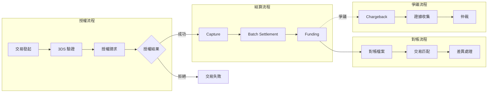

#### 22.2.1 卡支付對帳規則

```sql
-- 卡支付對帳查詢
SELECT
    pt.id AS platform_tx_id,
    pt.psp_reference,
    pt.amount AS platform_amount,
    pt.currency,
    pt.auth_code,
    pt.card_scheme,
    cs.amount AS settlement_amount,
    cs.interchange_fee,
    cs.scheme_fee,
    cs.acquirer_fee,
    cs.net_amount,
    CASE
        WHEN cs.id IS NULL THEN 'NOT_SETTLED'
        WHEN ABS(pt.amount - cs.amount) < 0.01 THEN 'MATCHED'
        ELSE 'VARIANCE'
    END AS reconciliation_status,
    -- Chargeback 檢查
    cb.chargeback_amount,
    cb.reason_code,
    cb.dispute_status
FROM t_payment_transaction pt
LEFT JOIN t_card_settlement cs ON pt.psp_reference = cs.transaction_reference
    AND cs.settlement_date BETWEEN pt.created_at AND DATE_ADD(pt.created_at, INTERVAL 5 DAY)
LEFT JOIN t_chargeback cb ON pt.psp_reference = cb.original_reference
WHERE pt.payment_method = 'CARD'
  AND pt.created_at >= DATE_SUB(NOW(), INTERVAL 7 DAY);
```

#### 22.2.2 Chargeback 對帳處理

| 階段 | 時限 | 處理 |
|------|------|------|
| **首次通知** | T+0 | 標記交易、凍結餘額 |
| **證據收集** | 7-14 天 | 收集交易證明、玩家同意記錄 |
| **Representment** | 視發卡行 | 提交抗辯證據 |
| **最終裁決** | 45-120 天 | 更新對帳狀態 |

### 22.3 電子錢包對帳 (E-Wallet)

```sql
-- 電子錢包對帳 (即時通知模式)
SELECT
    pt.id,
    pt.psp_reference,
    pt.amount AS platform_amount,
    pt.currency AS platform_currency,
    ew.amount AS ewallet_amount,
    ew.currency AS ewallet_currency,
    ew.fx_rate,
    -- 考慮匯率轉換
    CASE
        WHEN pt.currency = ew.currency THEN
            CASE WHEN ABS(pt.amount - ew.amount) < 0.01 THEN 'MATCHED' ELSE 'VARIANCE' END
        ELSE
            CASE WHEN ABS(pt.amount - ew.amount * ew.fx_rate) < 0.05 THEN 'FX_MATCHED' ELSE 'FX_VARIANCE' END
    END AS match_status,
    ew.notification_type,  -- IPN, Webhook
    ew.received_at
FROM t_payment_transaction pt
LEFT JOIN t_ewallet_notification ew ON pt.psp_reference = ew.transaction_id
WHERE pt.payment_method IN ('PAYPAL', 'SKRILL', 'NETELLER')
  AND pt.status = 'COMPLETED';
```

### 22.4 加密貨幣對帳 (Cryptocurrency)

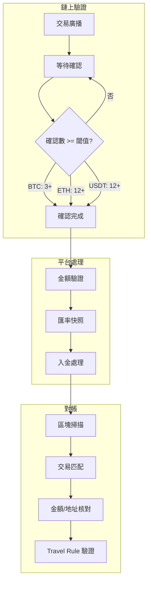

#### 22.4.1 加密貨幣對帳規則

```sql
-- 加密貨幣對帳
SELECT
    cd.id,
    cd.tx_hash,
    cd.blockchain,
    cd.from_address,
    cd.to_address,
    cd.crypto_amount,
    cd.fiat_equivalent,
    cd.exchange_rate_at_confirmation,
    cd.confirmations,
    -- 鏈上驗證
    bc.block_number,
    bc.block_timestamp,
    bc.gas_fee,
    -- Travel Rule 狀態
    tr.vasp_verified,
    tr.originator_name,
    tr.beneficiary_name,
    CASE
        WHEN cd.crypto_amount = bc.amount AND cd.to_address = bc.to_address THEN 'CHAIN_VERIFIED'
        WHEN cd.crypto_amount != bc.amount THEN 'AMOUNT_MISMATCH'
        ELSE 'ADDRESS_MISMATCH'
    END AS chain_reconciliation
FROM t_crypto_deposit cd
LEFT JOIN t_blockchain_confirmed bc ON cd.tx_hash = bc.tx_hash
LEFT JOIN t_travel_rule_record tr ON cd.tx_hash = tr.tx_hash
WHERE cd.created_at >= DATE_SUB(NOW(), INTERVAL 24 HOUR);
```

### 22.5 銀行轉帳對帳 (Bank Transfer)

| 區域 | 標準 | 對帳粒度 | 參考號格式 |
|------|------|---------|-----------|
| **SEPA** (歐盟) | ISO 20022 | 批次 + 交易 | End-to-End ID |
| **Faster Payments** (UK) | ISO 20022 | 交易級 | UETR |
| **ACH** (美國) | NACHA | 批次級 | Trace Number |
| **電匯** | SWIFT MT | 交易級 | UETR |

```sql
-- 銀行轉帳對帳 (SEPA 範例)
SELECT
    bt.id,
    bt.iban_from,
    bt.iban_to,
    bt.amount,
    bt.end_to_end_id,
    bt.instruction_id,
    -- 銀行報表匹配
    bs.statement_date,
    bs.credit_amount,
    bs.debit_amount,
    bs.bank_reference,
    CASE
        WHEN bs.id IS NULL THEN 'PENDING_STATEMENT'
        WHEN bt.amount = bs.credit_amount THEN 'MATCHED'
        ELSE 'VARIANCE'
    END AS reconciliation_status
FROM t_bank_transfer bt
LEFT JOIN t_bank_statement bs ON bt.end_to_end_id = bs.reference
    AND bs.statement_date BETWEEN bt.created_at AND DATE_ADD(bt.created_at, INTERVAL 3 DAY)
WHERE bt.payment_method = 'SEPA'
  AND bt.created_at >= DATE_SUB(NOW(), INTERVAL 7 DAY);
```

### 22.6 運營商代扣對帳 (Carrier Billing)

運營商代扣結算週期長、退款率高，需特殊處理：

```yaml
carrier_billing_reconciliation:
  settlement_cycle: "T+30"  # 月結
  expected_refund_rate: "15-25%"  # 行業平均

  reconciliation_rules:
    - name: "延遲結算處理"
      description: "運營商發票到達前標記為 PENDING_CARRIER"

    - name: "高退款預提"
      description: "按歷史退款率預提損失準備"
      formula: "provision = revenue × historical_refund_rate × 1.2"

    - name: "MNO 報表匹配"
      description: "與各運營商月結報表核對"

  monitoring:
    - metric: carrier_billing_provision_utilization
      alert: "> 80% or < 50%"  # 預提金使用異常
    - metric: carrier_billing_reconciliation_age
      alert: "> 45 days"  # 結算超時
```

### 22.7 支付方式對帳監控

```yaml
payment_method_metrics:
  - name: payment_method_reconciliation_match_rate
    type: gauge
    labels: [payment_method, currency]
    target: ">= 99.5%"
    alert:
      - condition: value < 99
        severity: warning

  - name: payment_method_settlement_delay_hours
    type: histogram
    labels: [payment_method]
    buckets: [1, 4, 24, 48, 72, 168]

  - name: payment_method_chargeback_rate
    type: gauge
    labels: [payment_method, card_scheme]
    target: "< 0.5%"
    alert:
      - condition: value > 0.75
        severity: warning
      - condition: value > 1.0
        severity: critical  # 可能導致處理器終止
```

---

## 📚 相關文檔

### 業務邏輯參考
- [02-02 支付網關集成](./02-02_Payment_Gateway_Integration.md) - PSP 交易數據來源
- [02-04 流水計算與對賬](./02-04_Turnover_and_Game_Reconciliation_Analysis.md) - 遊戲對帳流程
- [02-06 統一錢包模型](./02-06_Wallet_Architecture.md) - 餘額調整邏輯

### 技術架構參考
- [09-02 審計日誌系統](../06_Platform_Governance/06-03_Audit_Log.md) - 調帳操作審計
- [09-04 審批工作流系統](../06_Platform_Governance/06-04_Approval_Workflow.md) - 調帳審批工作流
- [09-01 管理後台RBAC](../06_Platform_Governance/06-02_RBAC_Permissions.md) - 對帳系統權限控制
- [12-05 API 設計標準](../09_Technical_Infrastructure/09-03-01_Design_Principles.md) - PSP API 規範

---

**文檔版本**: 6.0.0
**最後更新**: 2026-02-07
**維護團隊**: Finance Team & Backend Team

**變更記錄**:
- v6.0.0 (2026-02-07): 新增業界規範對帳補強
  - §16: 資金隔離驗證整合 (UKGC LCCP 4.2.1, MGA Rule 44)
  - §17: 風控與對帳協調機制 (UKGC AML Guidance, ISO 27001 5.3)
  - §18: 多帳戶對帳處理 (Neo4j 圖譜整合)
  - §19: 監管報告與對帳整合 (Gambling Levy 2025)
- v5.0.0 (2026-02-07): 新增對帳系統完整性補強
  - §8: 數據保留與合規要求 (多監管機構保留期限)
  - §9: 多幣種匯率對帳 (快照機制、容差規則)
  - §10: PSP 多結算週期處理 (T+0 ~ T+7)
  - §11: 退款與 Chargeback 對帳
  - §12: Jackpot 對帳 (Network vs Local)
  - §13: 負餘額對帳處理 (追蹤、壞帳認列)
  - §14: AML/KYC 對帳整合 (CTR/STR 報告)
  - §15: 跨時區對帳規則 (UTC 統一策略)
- v4.0.0 (2026-01-27): 初始完整版本
