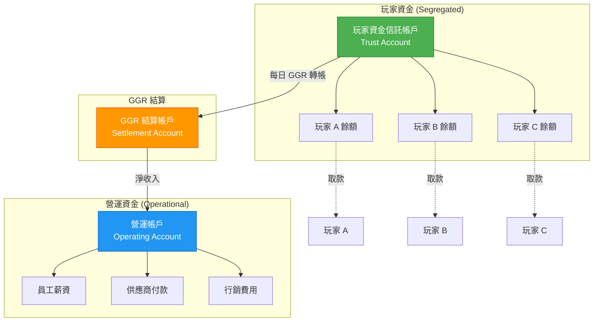
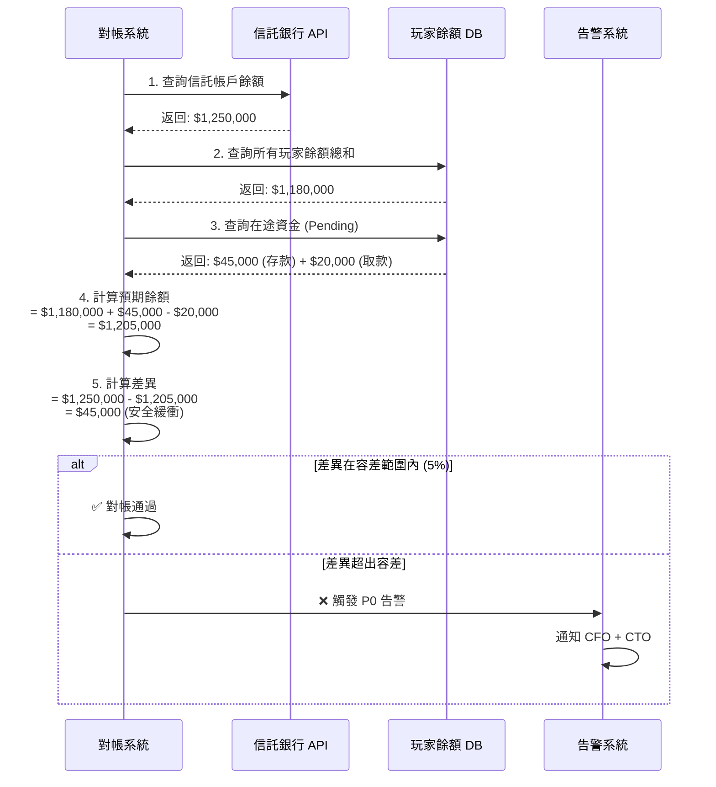

# 02-08 玩家資金隔離 (Player Funds Segregation)

> **監管合規**: 本文檔定義玩家資金隔離機制，滿足 UKGC、MGA 等監管機構的強制要求。
>
> **創建日期**: 2026-02-07
> **最後更新**: 2026-02-07
> **版本**: 1.0.0

---

## 1. 概述

### 1.1 監管背景

玩家資金隔離是博彩監管機構的核心要求，目的是在營運商破產時保護玩家資金。

**主要監管機構要求**:

| 監管機構 | 強制要求 | 生效日期 | 說明 |
|---------|---------|---------|------|
| **UKGC** | ✅ 強制 | 2019 起 | 必須選擇保護等級並披露 |
| **MGA** | ✅ 強制 | 2018 起 | 要求資金與營運帳戶分離 |
| **PAGCOR** | ⚠️ 建議 | - | 建議但非強制 |
| **Curacao** | ❌ 非強制 | - | 無明確要求 |

### 1.2 資金保護等級定義

根據 [UKGC Guidance](https://www.gamblingcommission.gov.uk/print/customer-funds-segregation-disclosure-to-customers-and-reporting)，資金保護分為以下等級：

| 保護等級 | 英文 | 玩家風險 | 破產時處理 |
|---------|------|---------|-----------|
| **未受保護** | Not Protected | 🔴 高風險 | 玩家成為一般債權人，可能無法取回資金 |
| **基本隔離** | Basic Segregation | 🟠 中風險 | 資金隔離但無額外保護，破產時仍可能損失 |
| **中等保護** | Medium Protection | 🟡 較低風險 | 資金由獨立方持有或有保險 |
| **高度保護** | High Protection | 🟢 最低風險 | 信託帳戶或獨立銀行保函 |

---

## 2. 資金隔離架構

### 2.1 帳戶結構



### 2.2 資金流向規則

**規則 1: 玩家存款路徑**
```yaml
玩家存款流程:
  1. 玩家發起存款
  2. PSP 收款成功
  3. 資金入帳至「玩家資金信託帳戶」
  4. 更新玩家錢包餘額

  ❌ 禁止: 玩家存款直接進入營運帳戶
```

**規則 2: 玩家取款路徑**
```yaml
玩家取款流程:
  1. 玩家發起取款申請
  2. 通過 KYC/AML 驗證
  3. 從「玩家資金信託帳戶」扣款
  4. PSP 發起轉帳至玩家銀行/電子錢包

  ❌ 禁止: 從營運帳戶支付玩家取款
```

**規則 3: GGR 結算路徑**
```yaml
GGR 結算流程 (每日 02:00 UTC):
  1. 計算前一日 GGR = 總投注 - 總派彩
  2. 若 GGR > 0: 從信託帳戶轉帳至 GGR 結算帳戶
  3. 若 GGR < 0: 從 GGR 結算帳戶補充至信託帳戶
  4. GGR 結算帳戶定期轉帳至營運帳戶

  ⚠️ 注意: GGR 結算需保留安全緩衝 (建議 7 天 GGR)
```

---

## 3. 對帳機制

### 3.1 每日資金對帳

**對帳時機**: 每日 03:00 UTC (GGR 結算後)

**對帳公式**:
```
信託帳戶餘額 = Σ(所有玩家錢包餘額) + 在途資金 + 安全緩衝
```

**對帳流程**:



### 3.2 差異處理矩陣

| 差異類型 | 金額範圍 | 風險等級 | 處理時效 | 處理方式 |
|---------|---------|---------|---------|---------|
| **正差異** (銀行 > 預期) | < 5% | 🟢 LOW | 24h | 記錄為安全緩衝 |
| | 5-10% | 🟡 MEDIUM | 4h | 調查來源 (可能是 GGR 未結算) |
| | > 10% | 🟠 HIGH | 1h | 立即調查，可能是錯誤入帳 |
| **負差異** (銀行 < 預期) | < 1% | 🟡 MEDIUM | 4h | 檢查在途資金 |
| | 1-5% | 🟠 HIGH | 1h | 暫停大額取款，調查原因 |
| | > 5% | 🔴 CRITICAL | 立即 | 凍結所有取款，通知監管機構 |

---

## 4. 玩家披露機制

### 4.1 披露時機

根據 UKGC 2025 年新規，營運商必須在以下時機披露資金保護等級：

| 時機 | 頻率 | 披露方式 | 強制性 |
|------|------|---------|--------|
| **首次存款** | 一次 | 彈窗確認 | ✅ 強制 |
| **定期提醒** | 每 6 個月 | Email + 站內信 | ✅ 強制 (2025.10.31 起) |
| **條款變更** | 即時 | Email | ✅ 強制 |
| **取款頁面** | 每次 | 頁面提示 | ⚠️ 建議 |

### 4.2 披露內容模板

#### 4.2.1 首次存款彈窗

```markdown
## 資金保護聲明

您的資金保護等級: **[中等保護 / Medium Protection]**

這意味著:
- ✅ 您的資金與公司營運資金分開存放
- ✅ 資金由獨立信託帳戶持有
- ⚠️ 如公司破產，您可能需要通過法律程序取回資金

詳細條款請查看: [資金保護政策](link)

[ ] 我已閱讀並理解上述資金保護聲明

[確認並繼續存款]
```

#### 4.2.2 定期提醒 Email

```markdown
主題: 重要提醒 - 您在 [平台名稱] 的資金保護狀態

親愛的 [玩家名稱]，

根據英國博彩委員會 (UKGC) 規定，我們需要定期提醒您關於資金保護的重要信息：

📌 您的資金保護等級: **[中等保護]**

這意味著:
- 您的資金存放在獨立的信託帳戶中，與公司營運資金分離
- 在公司正常營運期間，您可以隨時申請取款
- 如公司進入破產程序，信託帳戶的資金將優先用於償還玩家

💰 您當前的帳戶餘額: $[餘額]

如果您對資金保護有任何疑問，請聯繫客服: support@example.com

[查看完整資金保護政策]

---
此郵件依據 UKGC LCCP 4.2.2 規定發送
```

### 4.3 披露記錄表

**資料表設計**:

```sql
CREATE TABLE t_player_fund_disclosure (
    id BIGINT PRIMARY KEY AUTO_INCREMENT,
    player_id BIGINT NOT NULL COMMENT '玩家 ID',
    disclosure_type VARCHAR(50) NOT NULL COMMENT '披露類型: FIRST_DEPOSIT, PERIODIC, TERMS_CHANGE',
    protection_level VARCHAR(50) NOT NULL COMMENT '保護等級: NOT_PROTECTED, BASIC, MEDIUM, HIGH',
    channel VARCHAR(50) NOT NULL COMMENT '披露渠道: POPUP, EMAIL, SMS, IN_APP',
    acknowledged BOOLEAN DEFAULT FALSE COMMENT '玩家是否確認',
    acknowledged_at DATETIME COMMENT '確認時間',
    content_hash VARCHAR(64) COMMENT '披露內容 hash (用於追蹤版本)',
    created_at DATETIME DEFAULT CURRENT_TIMESTAMP,

    INDEX idx_player_disclosure (player_id, disclosure_type),
    INDEX idx_periodic_reminder (disclosure_type, created_at)
) COMMENT '玩家資金保護披露記錄';
```

---

## 5. 監控與告警

### 5.1 關鍵監控指標

```yaml
metrics:
  # 資金隔離監控
  - name: trust_account_balance
    type: gauge
    description: 信託帳戶實時餘額
    unit: USD
    alert:
      - condition: balance < sum(player_balances) * 0.95
        severity: CRITICAL
        message: "信託帳戶餘額不足，可能存在資金風險"

  - name: fund_segregation_ratio
    type: gauge
    description: 資金隔離比率 = 信託帳戶 / 玩家餘額總和
    target: ">= 1.0"
    alert:
      - condition: ratio < 1.0
        severity: CRITICAL
        message: "資金隔離比率低於 100%，立即調查"

  # 披露合規監控
  - name: disclosure_compliance_rate
    type: gauge
    description: 披露合規率 = 已披露玩家數 / 應披露玩家數
    target: "100%"
    alert:
      - condition: rate < 100%
        severity: WARNING
        message: "存在未完成資金保護披露的玩家"

  - name: periodic_reminder_overdue_count
    type: counter
    description: 逾期未發送定期提醒的玩家數
    target: "0"
    alert:
      - condition: count > 0
        severity: WARNING
        message: "有玩家超過 6 個月未收到資金保護提醒"
```

### 5.2 告警通知規則

| 告警類型 | 優先級 | 通知渠道 | 通知對象 | 處理時效 |
|---------|--------|---------|---------|---------|
| 信託帳戶餘額不足 | 🔴 P0 | SMS + Email + Slack | CFO, CTO, CEO | 立即 |
| 資金對帳差異 > 5% | 🔴 P0 | SMS + Email | CFO, Finance Manager | 1h |
| 資金對帳差異 1-5% | 🟠 P1 | Email + Slack | Finance Manager | 4h |
| 披露逾期 | 🟡 P2 | Email | Compliance Team | 24h |
| 玩家未確認披露 | 🟢 P3 | Slack | CS Team | 48h |

---

## 6. 合規審計

### 6.1 審計檢查清單

**每日自動審計**:
- [ ] 信託帳戶餘額 >= 玩家餘額總和
- [ ] 無異常大額轉帳 (單筆 > $100,000 需人工審批)
- [ ] GGR 結算金額正確

**每月合規審計**:
- [ ] 披露記錄完整性 (所有玩家首次存款已披露)
- [ ] 定期提醒發送率 = 100%
- [ ] 資金隔離政策無變更 (或變更已通知玩家)

**年度外部審計**:
- [ ] 信託帳戶獨立性驗證
- [ ] 資金保護機制有效性
- [ ] 監管報告提交紀錄

### 6.2 監管報告

**UKGC 要求的報告**:

| 報告類型 | 頻率 | 內容 | 提交期限 |
|---------|------|------|---------|
| 資金保護等級變更 | 即時 | 變更原因、新等級、玩家通知計劃 | 變更後 7 天內 |
| 年度資金保護報告 | 年度 | 信託帳戶對帳、披露統計、違規事件 | 財年結束後 28 天 |
| 重大事件報告 | 即時 | 資金缺口、系統故障影響資金 | 發現後 24h 內 |

---

## 7. 實施路線圖

### 7.1 Phase 1: 基礎設施 (1-2 週)

| 任務 | 預估工時 | 負責團隊 |
|------|---------|---------|
| 開設信託銀行帳戶 | 5 天 | Finance + Legal |
| 設計資金流轉 API | 3 天 | Backend |
| 建立對帳表結構 | 1 天 | DBA |

### 7.2 Phase 2: 對帳系統 (1 週)

| 任務 | 預估工時 | 負責團隊 |
|------|---------|---------|
| 實現每日自動對帳 | 2 天 | Backend |
| 建立告警機制 | 1 天 | DevOps |
| 對帳報表開發 | 2 天 | Backend + Frontend |

### 7.3 Phase 3: 披露機制 (1 週)

| 任務 | 預估工時 | 負責團隊 |
|------|---------|---------|
| 首次存款披露彈窗 | 1 天 | Frontend |
| 定期提醒排程任務 | 1 天 | Backend |
| 披露記錄與審計 | 1 天 | Backend |

---

## 📚 相關文檔

### 上層導航
- [02 Finance Center README](./README.md) - 財務中心總覽

### 相關文檔
- [02-06 統一錢包模型](./02-06_Wallet_Architecture.md) - 錢包架構
- [02-03 對帳系統](./02-03_Reconciliation_System.md) - 財務對帳
- [06-02 RBAC 權限](../06_Platform_Governance/06-02_RBAC_Permissions.md) - 資金操作權限

### 外部參考
- [UKGC Customer Funds Guidance](https://www.gamblingcommission.gov.uk/print/customer-funds-segregation-disclosure-to-customers-and-reporting)
- [MGA Player Protection Directive](https://www.mga.org.mt/)

---

**文檔版本**: 1.0.0
**最後更新**: 2026-02-07
**維護團隊**: Finance Team & Compliance Team
**狀態**: ✅ 已完成初版
