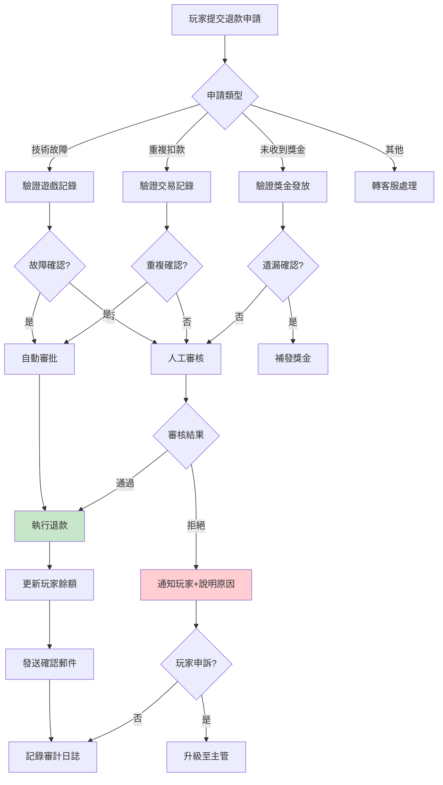
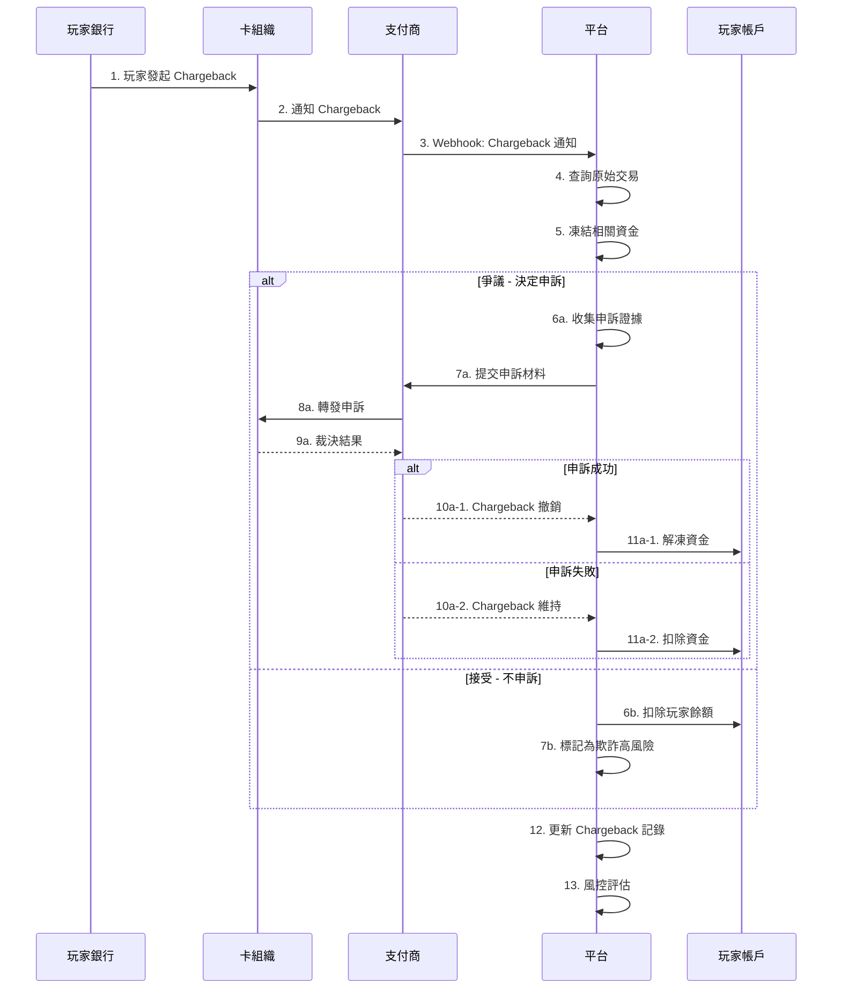
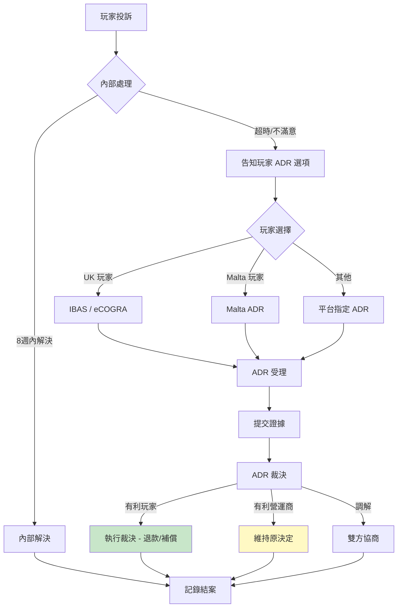

# 02-09 退款與爭議管理 (Refund & Dispute Management)

> **版本**: 1.0.0
> **創建日期**: 2026-02-07
> **監管依據**: UKGC LCCP 6.1.1, MGA Player Rights Directive, VISA/Mastercard Chargeback Rules

---

## 1. 概述

本文檔定義退款申請、Chargeback 處理、爭議解決的完整流程，確保符合監管要求並保護玩家權益。

### 1.1 退款類型定義

| 類型 | 觸發方 | 場景 | 處理時效 |
|------|--------|------|---------|
| **玩家申請退款** | 玩家 | 技術故障、重複扣款 | 24-72h |
| **營運商主動退款** | 營運商 | 促銷錯誤、系統故障 | 即時-24h |
| **Chargeback** | 玩家銀行 | 未授權交易、服務爭議 | 7-45 天 |
| **仲裁退款** | 監管/仲裁機構 | 正式投訴裁決 | 依裁決書 |

### 1.2 監管時效要求

| 監管機構 | 投訴響應 | 爭議解決 | 退款執行 |
|---------|---------|---------|---------|
| **UKGC** | 8 週內 | 8 週內（或轉 ADR）| 退款批准後 5 天 |
| **MGA** | 10 天內初步回覆 | 30 天內解決 | 退款批准後 3 天 |
| **VISA** | - | Chargeback 30 天內回覆 | - |
| **Mastercard** | - | Chargeback 45 天內回覆 | - |

---

## 2. 玩家退款申請

### 2.1 退款申請流程



### 2.2 退款條件矩陣

| 退款原因 | 自動審批條件 | 需人工審核 | 拒絕條件 |
|---------|-------------|-----------|---------|
| **遊戲故障** | GP 確認 + 金額 < $100 | 金額 >= $100 | 無故障記錄 |
| **重複扣款** | 系統檢測到重複 | 跨 PSP 重複 | 不同訂單 |
| **未授權存款** | 帳戶被盜確認 | 需調查 | 正常登入記錄 |
| **獎金未發放** | 系統記錄遺漏 | 條款爭議 | 不符合條款 |
| **服務不滿意** | - | 全部需審核 | 無正當理由 |

### 2.3 退款申請表

```sql
CREATE TABLE t_refund_request (
    id BIGINT PRIMARY KEY AUTO_INCREMENT,
    request_number VARCHAR(64) NOT NULL UNIQUE,
    player_id BIGINT NOT NULL,

    -- 申請資訊
    refund_type ENUM('GAME_ERROR', 'DUPLICATE_CHARGE', 'UNAUTHORIZED', 'BONUS_ISSUE', 'SERVICE_ISSUE', 'OTHER') NOT NULL,
    original_transaction_id VARCHAR(64) COMMENT '原始交易 ID',
    refund_amount DECIMAL(18,4) NOT NULL,
    currency VARCHAR(3) NOT NULL,
    reason TEXT NOT NULL,

    -- 附件
    evidence_urls JSON COMMENT '證據截圖/文件',

    -- 處理
    status ENUM('PENDING', 'AUTO_APPROVED', 'UNDER_REVIEW', 'APPROVED', 'REJECTED', 'ESCALATED', 'COMPLETED') DEFAULT 'PENDING',
    auto_approved BOOLEAN DEFAULT FALSE,
    reviewer_id BIGINT COMMENT '審核人',
    review_notes TEXT,
    rejection_reason TEXT,

    -- 時間追蹤
    submitted_at DATETIME DEFAULT CURRENT_TIMESTAMP,
    first_response_at DATETIME COMMENT '首次回覆時間',
    resolved_at DATETIME,

    -- SLA
    sla_deadline DATETIME COMMENT 'SLA 截止時間',
    sla_breached BOOLEAN DEFAULT FALSE,

    created_at DATETIME DEFAULT CURRENT_TIMESTAMP,
    updated_at DATETIME DEFAULT CURRENT_TIMESTAMP ON UPDATE CURRENT_TIMESTAMP,

    INDEX idx_player_id (player_id),
    INDEX idx_status (status),
    INDEX idx_sla_deadline (sla_deadline)
) COMMENT '退款申請';
```

---

## 3. Chargeback 處理

### 3.1 Chargeback 流程



### 3.2 Chargeback 原因代碼

| 代碼類別 | VISA 代碼 | Mastercard 代碼 | 處理策略 |
|---------|-----------|----------------|---------|
| **欺詐** | 10.4, 10.5 | 4837, 4863 | 調查 + 可能申訴 |
| **未授權** | 10.1, 10.3 | 4837 | 驗證 3DS + 申訴 |
| **服務問題** | 13.1, 13.3 | 4853 | 提供服務證明 |
| **處理錯誤** | 12.1, 12.5 | 4834 | 驗證交易 + 申訴 |
| **取消/退貨** | 13.6 | 4855 | 提供條款證明 |

### 3.3 申訴材料準備

```yaml
申訴必備材料:
  交易證明:
    - 原始交易記錄
    - 3DS 驗證記錄
    - IP 地址與設備指紋
    - 登入時間戳

  服務證明:
    - 遊戲回合記錄
    - 投注歷史
    - 獎金發放記錄
    - 客服對話記錄

  身份證明:
    - KYC 驗證記錄
    - 帳戶註冊資訊
    - 歷史交易模式

  條款證明:
    - 接受的條款版本
    - 促銷條款截圖
    - 責任賭博確認
```

### 3.4 Chargeback 記錄表

> **關聯**: 與 [02-03 §11](./02-03_Reconciliation_System.md) 中的 `t_chargeback_record` 表配合使用

```sql
-- 擴展 Chargeback 申訴記錄
CREATE TABLE t_chargeback_dispute (
    id BIGINT PRIMARY KEY AUTO_INCREMENT,
    chargeback_id BIGINT NOT NULL COMMENT '關聯 t_chargeback_record',
    dispute_reference VARCHAR(64) NOT NULL UNIQUE,

    -- 申訴決策
    dispute_decision ENUM('ACCEPT', 'DISPUTE') NOT NULL,
    dispute_reason TEXT,

    -- 申訴材料
    evidence_package JSON COMMENT '證據清單',
    evidence_submitted_at DATETIME,

    -- 結果
    dispute_outcome ENUM('PENDING', 'WON', 'LOST', 'PARTIAL') DEFAULT 'PENDING',
    outcome_received_at DATETIME,
    recovered_amount DECIMAL(18,4) COMMENT '成功追回金額',

    -- 時間追蹤
    psp_deadline DATE COMMENT 'PSP 回覆截止',
    card_network_deadline DATE COMMENT '卡組織截止',

    created_at DATETIME DEFAULT CURRENT_TIMESTAMP,
    updated_at DATETIME DEFAULT CURRENT_TIMESTAMP ON UPDATE CURRENT_TIMESTAMP,

    INDEX idx_chargeback_id (chargeback_id),
    INDEX idx_outcome (dispute_outcome)
) COMMENT 'Chargeback 申訴記錄';
```

---

## 4. 爭議解決 (ADR)

### 4.1 爭議升級路徑



### 4.2 ADR 機構清單

| 市場 | ADR 機構 | 網站 | 費用 |
|------|---------|------|------|
| **UK** | IBAS | ibas-uk.com | 免費 (玩家) |
| **UK** | eCOGRA | ecogra.org | 免費 (玩家) |
| **Malta** | Malta ADR | odraml.mt | 免費 (玩家) |
| **歐盟** | EU ODR Platform | ec.europa.eu/odr | 免費 |

### 4.3 爭議記錄表

```sql
CREATE TABLE t_dispute_case (
    id BIGINT PRIMARY KEY AUTO_INCREMENT,
    case_number VARCHAR(64) NOT NULL UNIQUE,
    player_id BIGINT NOT NULL,

    -- 來源
    source ENUM('INTERNAL_COMPLAINT', 'ADR_REFERRAL', 'REGULATOR_REFERRAL') NOT NULL,
    original_complaint_id BIGINT COMMENT '原始投訴 ID',
    adr_reference VARCHAR(100) COMMENT 'ADR 案件編號',

    -- 爭議內容
    dispute_category ENUM('BONUS', 'WITHDRAWAL', 'TECHNICAL', 'ACCOUNT', 'OTHER') NOT NULL,
    dispute_amount DECIMAL(18,4),
    currency VARCHAR(3),
    dispute_description TEXT NOT NULL,

    -- 處理
    status ENUM('OPEN', 'UNDER_INVESTIGATION', 'AWAITING_PLAYER', 'AWAITING_ADR', 'RESOLVED', 'CLOSED') DEFAULT 'OPEN',
    assigned_to BIGINT COMMENT '負責人',

    -- 結果
    resolution_type ENUM('FAVOR_PLAYER', 'FAVOR_OPERATOR', 'COMPROMISE', 'WITHDRAWN') DEFAULT NULL,
    resolution_amount DECIMAL(18,4) COMMENT '賠償金額',
    resolution_notes TEXT,

    -- 時間
    opened_at DATETIME DEFAULT CURRENT_TIMESTAMP,
    sla_deadline DATETIME,
    resolved_at DATETIME,

    -- 監管報告
    reported_to_regulator BOOLEAN DEFAULT FALSE,
    regulator_reference VARCHAR(100),

    created_at DATETIME DEFAULT CURRENT_TIMESTAMP,
    updated_at DATETIME DEFAULT CURRENT_TIMESTAMP ON UPDATE CURRENT_TIMESTAMP,

    INDEX idx_player_id (player_id),
    INDEX idx_status (status),
    INDEX idx_sla_deadline (sla_deadline)
) COMMENT '爭議案件';
```

---

## 5. 欺詐防護

### 5.1 欺詐指標

| 指標 | 計算方式 | 高風險閾值 |
|------|---------|-----------|
| **Chargeback 率** | Chargeback 數 / 存款數 | > 0.5% |
| **退款率** | 退款金額 / 存款金額 | > 2% |
| **首存 Chargeback** | 首存後 Chargeback | 任何 |
| **快速 Chargeback** | 存款後 7 天內 Chargeback | 任何 |

### 5.2 欺詐響應

```yaml
欺詐響應規則:
  高風險玩家:
    觸發條件:
      - 2 次 Chargeback (12 個月內)
      - 或 首存 Chargeback
      - 或 存款後 24h 內 Chargeback

    響應動作:
      - 凍結帳戶
      - 禁止存款
      - 所有提款需人工審核
      - 加入內部黑名單

  中風險玩家:
    觸發條件:
      - 1 次 Chargeback (12 個月內)
      - 或 3 次退款申請

    響應動作:
      - 提款限額降低 50%
      - 信用卡存款禁用
      - 標記監控

  低風險玩家:
    觸發條件:
      - 退款申請頻率高於平均

    響應動作:
      - 標記觀察
      - 定期審查
```

---

## 6. 監控與報告

### 6.1 關鍵指標

| 指標 | 目標 | 告警閾值 |
|------|------|---------|
| **首次響應時間** | < 24h | > 48h |
| **解決時間** | < 7 天 | > 14 天 |
| **SLA 達成率** | > 95% | < 90% |
| **Chargeback 勝訴率** | > 40% | < 30% |
| **玩家滿意度** | > 80% | < 70% |

### 6.2 月度報告

```sql
-- 月度退款/爭議報告
SELECT
    DATE_FORMAT(submitted_at, '%Y-%m') AS report_month,
    refund_type,
    COUNT(*) AS total_requests,
    SUM(CASE WHEN status IN ('APPROVED', 'COMPLETED') THEN 1 ELSE 0 END) AS approved,
    SUM(CASE WHEN status = 'REJECTED' THEN 1 ELSE 0 END) AS rejected,
    SUM(refund_amount) AS total_refund_amount,
    AVG(TIMESTAMPDIFF(HOUR, submitted_at, first_response_at)) AS avg_first_response_hours,
    AVG(TIMESTAMPDIFF(DAY, submitted_at, resolved_at)) AS avg_resolution_days,
    SUM(CASE WHEN sla_breached THEN 1 ELSE 0 END) AS sla_breaches
FROM t_refund_request
WHERE submitted_at >= DATE_SUB(CURDATE(), INTERVAL 12 MONTH)
GROUP BY DATE_FORMAT(submitted_at, '%Y-%m'), refund_type
ORDER BY report_month DESC;
```

---

## 📚 相關文檔

- [02-03 Reconciliation System §11](./02-03_Reconciliation_System.md) - Chargeback 對帳
- [05-02 Fraud Detection](../05_Risk_Control/05-02_Fraud_Detection.md) - 欺詐檢測
- [06-08 UKGC Compliance](../06_Platform_Governance/06-08_UKGC_Compliance.md) - UK 投訴處理要求

---

**文檔版本**: 1.0.0
**最後更新**: 2026-02-07
**維護團隊**: Finance + Support Team
