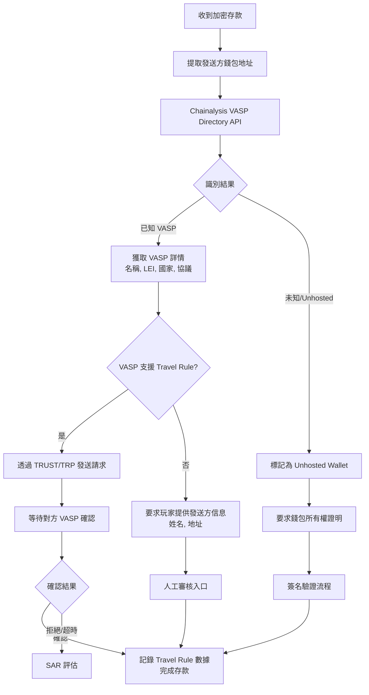
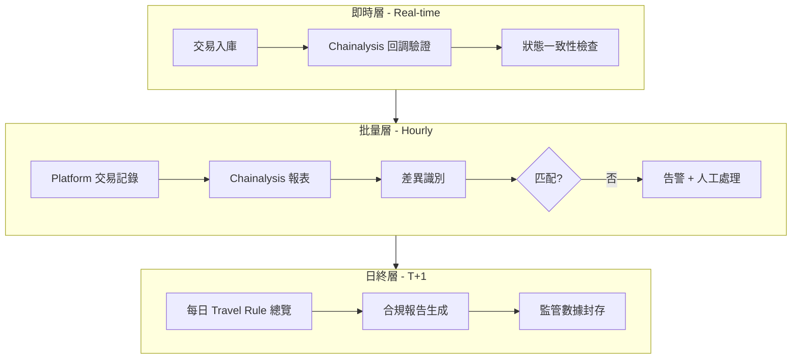

# 02-10 Crypto Travel Rule Compliance (加密貨幣 Travel Rule 合規)

**版本**: 2.0.0
**創建日期**: 2026-02-07
**更新日期**: 2026-02-07
**狀態**: 🟡 實施中 (P0 Critical)
**服務商**: Chainalysis (已確認)

---

## 概述

Travel Rule 是 FATF Recommendation 16 的核心要求，規定虛擬資產服務提供商 (VASP) 必須在加密貨幣交易中傳輸發送方和接收方的識別信息。

### 監管背景

| 規範 | 司法區 | 閾值 | 生效日期 |
|------|--------|------|---------|
| **FATF R.16** | 全球 | USD 1,000 / EUR 1,000 | 2019 |
| **EU TFR 2023/1113** | EU | EUR 1,000 | 2024-12-30 |
| **UK Travel Rule** | UK | GBP 1,000 | 2023-09-01 |
| **MiCA** | EU | 全部交易 (2025+) | 2025-12-30 |

---

## 當前狀態

> 🟡 **實施中**: 根據 2026-02-07 風控審計結果，已啟動 Travel Rule 合規實施計畫。選定 **Chainalysis** 作為整合服務商。

### 實施進度追蹤

| 階段 | 任務 | 狀態 | 負責人 | 預計完成 |
|------|------|------|--------|---------|
| Phase 1 | 服務商選擇 | ✅ 完成 | Compliance | 2026-02-07 |
| Phase 1 | 協議確認 (TRUST + TRP) | ✅ 完成 | Tech Lead | 2026-02-07 |
| Phase 1 | 數據結構設計 | ✅ 完成 | DBA | 2026-02-07 |
| Phase 2 | Chainalysis API 整合 | 🔄 進行中 | Backend | Week 3-4 |
| Phase 2 | VASP-to-VASP 流程 | ⏳ 待開始 | Backend | Week 4-5 |
| Phase 2 | Unhosted Wallet 驗證 | ⏳ 待開始 | Backend | Week 5-6 |
| Phase 3 | 前端錢包簽名 UI | ⏳ 待開始 | Frontend | Week 7-8 |
| Phase 4 | 交易所測試 | ⏳ 待開始 | QA | Week 9 |
| Phase 4 | 灰度發布 | ⏳ 待開始 | DevOps | Week 10 |

### 風險評估

| 風險類型 | 影響 | 風險等級 |
|---------|------|---------|
| UKGC 牌照風險 | 違反 AML 要求 | 🔴 Critical |
| EU 監管處罰 | MiCA 違規罰款 | 🔴 Critical |
| 金融機構關係 | 銀行可能終止合作 | 🟠 High |
| 聲譽風險 | 被列為高風險平台 | 🟠 High |

---

## Travel Rule 要求

### 必須傳輸的信息

#### 發送方 (Originator) 信息

| 欄位 | 必填 | 說明 |
|------|------|------|
| Full Name | ✅ | 完整姓名 |
| Account Number | ✅ | 錢包地址 / 帳戶 ID |
| Geographic Address | ✅/⚠️ | 地址或出生地 + 日期 |
| National ID | ⚠️ | 視司法區要求 |
| Date of Birth | ⚠️ | 替代地址驗證 |

#### 接收方 (Beneficiary) 信息

| 欄位 | 必填 | 說明 |
|------|------|------|
| Full Name | ✅ | 完整姓名 |
| Account Number | ✅ | 錢包地址 / 帳戶 ID |

### 交易類型適用性

| 交易類型 | Travel Rule 適用 | 說明 |
|---------|-----------------|------|
| **VASP → VASP** | ✅ 必須 | 平台間轉帳 |
| **VASP → Unhosted Wallet** | ⚠️ 部分 | 需證明錢包所有權 |
| **Unhosted → VASP** | ⚠️ 部分 | 需驗證發送方 |
| **Unhosted → Unhosted** | ❌ 不適用 | 非 VASP 交易 |

---

## 技術實現

### 支援的加密貨幣

```yaml
Supported Cryptocurrencies:
  Layer 1:
    - BTC (Bitcoin)
    - ETH (Ethereum)
    - LTC (Litecoin)

  Stablecoins:
    - USDT (Tether)
    - USDC (USD Coin)

  Travel Rule Compliance Required: ALL
```

### 解決方案選型

| 服務商 | 協議支援 | 覆蓋範圍 | 整合複雜度 |
|--------|---------|---------|-----------|
| **Chainalysis** | TRUST, TRP | 全球 800+ VASPs | 中 |
| **Elliptic** | OpenVASP, TRP | 全球 | 中 |
| **Notabene** | IVMS 101 | 全球 500+ VASPs | 低 |
| **Sumsub** | TRP | 全球 | 低 |

**確認方案**: ✅ **Chainalysis** (2026-02-07 決策確認)

選擇理由:
- 全球 800+ VASPs 覆蓋，包含主流交易所 (Binance, Coinbase, Kraken, OKX)
- 支援 TRUST 和 TRP 協議，滿足 EU TFR 和 UK Travel Rule 要求
- 提供 VASP 識別 API，可自動判斷對手方錢包歸屬
- 與現有 KYC 系統 (Sumsub) 無衝突

### Chainalysis 整合規格

```yaml
Chainalysis Integration:
  API Endpoints:
    Base URL: https://api.chainalysis.com/v1
    VASP Directory: /vasp-directory
    Travel Rule: /travel-rule/transfers
    Wallet Screening: /wallet-screening

  Authentication:
    Type: API Key + HMAC-SHA256
    Header: X-API-Key, X-Signature, X-Timestamp

  Protocols:
    - TRUST (Travel Rule Universal Solution Technology)
    - TRP (Travel Rule Protocol)

  Rate Limits:
    Standard: 100 requests/minute
    Burst: 500 requests/minute

  SLA:
    Uptime: 99.9%
    Response Time: < 500ms (P95)
    VASP Confirmation: < 24 hours
```

### VASP 識別流程



### 數據流程

```mermaid
flowchart TD
    A[玩家發起加密存款] --> B{金額 >= EUR 1,000?}

    B -->|否| C[標準 KYC 驗證<br/>無需 Travel Rule]
    B -->|是| D[Travel Rule 觸發]

    D --> E[收集發送方信息<br/>姓名, 地址, 錢包]

    E --> F{來自已知 VASP?}

    F -->|是| G[透過 Travel Rule 協議<br/>請求對方 VASP 確認]
    F -->|否 (Unhosted)| H[要求錢包所有權證明<br/>簽名驗證]

    G --> I{對方確認?}
    H --> J{證明有效?}

    I -->|是| K[記錄 Travel Rule 數據]
    I -->|否/超時| L[拒絕交易<br/>或人工審核]

    J -->|是| K
    J -->|否| L

    K --> M[完成存款]
    L --> N[SAR 評估]
```

### 數據庫設計

```sql
-- Travel Rule 交易記錄
CREATE TABLE t_travel_rule_transaction (
    id                      BIGINT PRIMARY KEY AUTO_INCREMENT,
    player_id               BIGINT NOT NULL,
    transaction_id          BIGINT NOT NULL,  -- 關聯 t_crypto_transaction

    -- 交易詳情
    transaction_type        VARCHAR(20) NOT NULL,  -- DEPOSIT, WITHDRAWAL
    crypto_currency         VARCHAR(10) NOT NULL,
    amount                  DECIMAL(24,8) NOT NULL,
    fiat_equivalent         DECIMAL(18,2) NOT NULL,  -- EUR/GBP 等值
    threshold_triggered     BOOLEAN NOT NULL DEFAULT TRUE,

    -- 發送方信息 (Originator)
    originator_name         VARCHAR(200),
    originator_wallet       VARCHAR(100) NOT NULL,
    originator_address      VARCHAR(500),
    originator_dob          DATE,
    originator_country      VARCHAR(2),
    originator_vasp         VARCHAR(100),  -- 對方 VASP 名稱
    originator_vasp_id      VARCHAR(100),  -- VASP LEI / 識別碼

    -- 接收方信息 (Beneficiary)
    beneficiary_name        VARCHAR(200),
    beneficiary_wallet      VARCHAR(100) NOT NULL,
    beneficiary_vasp        VARCHAR(100),  -- 我方 VASP 信息

    -- Travel Rule 處理
    travel_rule_protocol    VARCHAR(50),   -- TRUST, TRP, OpenVASP
    travel_rule_status      VARCHAR(30),   -- PENDING, CONFIRMED, REJECTED, TIMEOUT
    counterparty_response   JSON,
    processed_at            DATETIME,

    -- 錢包所有權證明 (Unhosted Wallet)
    wallet_ownership_proof  VARCHAR(50),   -- SIGNATURE, MICRO_TX, ATTESTATION
    proof_signature         TEXT,
    proof_verified          BOOLEAN DEFAULT FALSE,
    proof_verified_at       DATETIME,

    -- 審計
    created_at              DATETIME DEFAULT CURRENT_TIMESTAMP,
    updated_at              DATETIME DEFAULT CURRENT_TIMESTAMP ON UPDATE CURRENT_TIMESTAMP,

    INDEX idx_player (player_id, created_at DESC),
    INDEX idx_transaction (transaction_id),
    INDEX idx_status (travel_rule_status, threshold_triggered),
    INDEX idx_wallet (originator_wallet, beneficiary_wallet)
) ENGINE=InnoDB COMMENT='Travel Rule 交易記錄';

-- VASP 對手方註冊表
CREATE TABLE t_vasp_registry (
    id                  BIGINT PRIMARY KEY AUTO_INCREMENT,
    vasp_name           VARCHAR(200) NOT NULL,
    vasp_lei            VARCHAR(20),           -- Legal Entity Identifier
    vasp_country        VARCHAR(2) NOT NULL,
    vasp_type           VARCHAR(30),           -- EXCHANGE, WALLET, CUSTODIAN

    -- Travel Rule 能力
    travel_rule_enabled BOOLEAN DEFAULT FALSE,
    supported_protocols JSON,                  -- ["TRUST", "TRP", "OpenVASP"]
    api_endpoint        VARCHAR(500),

    -- 合規狀態
    licensed            BOOLEAN DEFAULT FALSE,
    license_jurisdiction VARCHAR(50),
    verified            BOOLEAN DEFAULT FALSE,
    verified_at         DATETIME,

    -- 元數據
    created_at          DATETIME DEFAULT CURRENT_TIMESTAMP,
    updated_at          DATETIME DEFAULT CURRENT_TIMESTAMP ON UPDATE CURRENT_TIMESTAMP,

    UNIQUE KEY uk_lei (vasp_lei),
    INDEX idx_country (vasp_country)
) ENGINE=InnoDB COMMENT='VASP 對手方註冊表';
```

### 核心服務

```java
/**
 * Travel Rule 服務
 */
@Service
@RequiredArgsConstructor
@Slf4j
public class TravelRuleService {

    private final TravelRuleClient travelRuleClient;  // Chainalysis/Notabene
    private final TravelRuleTransactionDao transactionDao;
    private final VaspRegistryDao vaspRegistryDao;

    private static final BigDecimal EUR_THRESHOLD = new BigDecimal("1000");

    /**
     * 加密存款 Travel Rule 檢查
     */
    @Transactional(rollbackFor = Throwable.class)
    public TravelRuleResult processDeposit(CryptoDepositRequest request) {

        // 1. 檢查是否達到閾值
        BigDecimal eurEquivalent = cryptoRateService.toEur(
            request.getCurrency(), request.getAmount());

        if (eurEquivalent.compareTo(EUR_THRESHOLD) < 0) {
            return TravelRuleResult.notRequired();
        }

        // 2. 識別發送方錢包
        WalletInfo walletInfo = analyzeWallet(request.getSenderWallet());

        // 3. 根據錢包類型處理
        if (walletInfo.isKnownVasp()) {
            // VASP → VASP: 通過協議請求對方確認
            return requestVaspConfirmation(request, walletInfo);
        } else {
            // Unhosted Wallet: 要求所有權證明
            return requestOwnershipProof(request);
        }
    }

    /**
     * 請求 VASP 確認
     */
    private TravelRuleResult requestVaspConfirmation(
            CryptoDepositRequest request, WalletInfo walletInfo) {

        // 查詢對方 VASP
        Option<VaspRegistry> vaspOpt = vaspRegistryDao.findByAddress(
            walletInfo.getVaspIdentifier());

        if (vaspOpt.isEmpty()) {
            // 未知 VASP，要求人工審核
            return TravelRuleResult.manualReview("Unknown VASP");
        }

        VaspRegistry vasp = vaspOpt.get();

        // 發送 Travel Rule 請求
        TravelRuleRequest trRequest = TravelRuleRequest.builder()
            .transactionHash(request.getTxHash())
            .originatorWallet(request.getSenderWallet())
            .beneficiaryName(request.getPlayerName())
            .beneficiaryWallet(request.getDepositAddress())
            .amount(request.getAmount())
            .currency(request.getCurrency())
            .build();

        TravelRuleResponse response = travelRuleClient.requestConfirmation(
            vasp.getApiEndpoint(), trRequest);

        // 記錄結果
        TravelRuleTransaction transaction = buildTransaction(request, response);
        transactionDao.insert(transaction);

        if (response.isConfirmed()) {
            return TravelRuleResult.confirmed(transaction.getId());
        } else if (response.isTimeout()) {
            return TravelRuleResult.timeout("VASP confirmation timeout");
        } else {
            return TravelRuleResult.rejected(response.getReason());
        }
    }

    /**
     * 要求錢包所有權證明 (Unhosted Wallet)
     */
    private TravelRuleResult requestOwnershipProof(CryptoDepositRequest request) {
        // 生成簽名挑戰
        String challenge = generateChallenge(request.getPlayerId());

        // 返回待簽名，前端需引導用戶簽名
        return TravelRuleResult.proofRequired(
            request.getSenderWallet(),
            challenge,
            "Please sign this message with your wallet to prove ownership"
        );
    }

    /**
     * 驗證錢包所有權簽名
     */
    public TravelRuleResult verifyOwnershipProof(
            Long playerId, String walletAddress, String signature) {

        // 獲取挑戰
        String challenge = getChallenge(playerId);

        // 驗證簽名
        boolean valid = cryptoSignatureVerifier.verify(
            walletAddress, challenge, signature);

        if (valid) {
            // 記錄驗證成功
            markOwnershipVerified(playerId, walletAddress, signature);
            return TravelRuleResult.confirmed(null);
        } else {
            return TravelRuleResult.rejected("Invalid signature");
        }
    }
}
```

---

## Travel Rule 對帳邏輯

### 對帳架構

Travel Rule 對帳採用三層架構，確保數據完整性和監管合規：



### 對帳場景

#### 場景 1: VASP-to-VASP 確認對帳

| 對帳項目 | Platform 數據源 | Chainalysis 數據源 | 匹配邏輯 |
|---------|----------------|-------------------|---------|
| 交易 Hash | t_travel_rule_transaction.transaction_hash | Transfer API Response | 完全匹配 |
| 金額 | amount | transfer.amount | 允許 0.0001% 誤差 (鏈上手續費) |
| 發送方 VASP | originator_vasp | transfer.originator.vasp_name | 模糊匹配 (名稱標準化) |
| 確認狀態 | travel_rule_status | transfer.status | 狀態碼映射 |

```sql
-- VASP 確認對帳查詢
SELECT
    p.id AS platform_id,
    p.transaction_hash,
    p.amount AS platform_amount,
    c.amount AS chainalysis_amount,
    ABS(p.amount - c.amount) / p.amount AS variance_pct,
    p.travel_rule_status AS platform_status,
    c.status AS chainalysis_status,
    CASE
        WHEN p.travel_rule_status = c.status THEN 'MATCHED'
        WHEN p.travel_rule_status = 'PENDING' AND c.status = 'CONFIRMED' THEN 'PLATFORM_BEHIND'
        WHEN p.travel_rule_status = 'CONFIRMED' AND c.status = 'PENDING' THEN 'CHAINALYSIS_BEHIND'
        ELSE 'MISMATCH'
    END AS reconciliation_status
FROM t_travel_rule_transaction p
LEFT JOIN chainalysis_transfer_report c ON p.transaction_hash = c.tx_hash
WHERE p.created_at >= DATE_SUB(NOW(), INTERVAL 1 HOUR)
  AND p.travel_rule_protocol IN ('TRUST', 'TRP');
```

#### 場景 2: Unhosted Wallet 證明對帳

| 對帳項目 | 驗證邏輯 | 告警條件 |
|---------|---------|---------|
| 簽名有效性 | 鏈上驗證 | 驗證失敗但交易已完成 |
| 所有權重複聲明 | 同一錢包多玩家聲明 | 超過 1 個玩家聲明同一錢包 |
| 證明時效 | 簽名 24 小時內有效 | 過期簽名被接受 |

```sql
-- 檢測異常所有權聲明
SELECT
    originator_wallet,
    COUNT(DISTINCT player_id) AS claimant_count,
    GROUP_CONCAT(player_id) AS player_ids
FROM t_travel_rule_transaction
WHERE wallet_ownership_proof IS NOT NULL
  AND proof_verified = TRUE
GROUP BY originator_wallet
HAVING COUNT(DISTINCT player_id) > 1;
```

#### 場景 3: 閾值觸發對帳

確保所有達到閾值的交易都經過 Travel Rule 處理：

```sql
-- 閾值觸發覆蓋率檢查
WITH threshold_transactions AS (
    SELECT
        ct.id AS crypto_tx_id,
        ct.amount_eur,
        tr.id AS travel_rule_id
    FROM t_crypto_transaction ct
    LEFT JOIN t_travel_rule_transaction tr ON ct.id = tr.transaction_id
    WHERE ct.amount_eur >= 1000
      AND ct.created_at >= DATE_SUB(NOW(), INTERVAL 24 HOUR)
      AND ct.status = 'COMPLETED'
)
SELECT
    COUNT(*) AS total_threshold_tx,
    SUM(CASE WHEN travel_rule_id IS NOT NULL THEN 1 ELSE 0 END) AS with_travel_rule,
    SUM(CASE WHEN travel_rule_id IS NULL THEN 1 ELSE 0 END) AS missing_travel_rule,
    ROUND(SUM(CASE WHEN travel_rule_id IS NOT NULL THEN 1 ELSE 0 END) * 100.0 / COUNT(*), 2) AS coverage_pct
FROM threshold_transactions;
```

### 對帳差異處理

| 差異類型 | 優先級 | 處理流程 | SLA |
|---------|--------|---------|-----|
| **狀態不一致** | P0 | 自動重新同步 → 失敗則人工介入 | 1 小時 |
| **金額差異 > 0.01%** | P1 | 調查鏈上手續費 → 調整記錄 | 4 小時 |
| **缺失 Travel Rule 記錄** | P0 | 立即凍結交易 → SAR 評估 | 30 分鐘 |
| **VASP 名稱不匹配** | P2 | 更新 VASP 別名映射表 | 24 小時 |

### 監控指標

```yaml
metrics:
  # Travel Rule 覆蓋率
  - name: travel_rule_coverage_rate
    type: gauge
    description: 達到閾值交易的 Travel Rule 處理覆蓋率
    target: ">= 100%"
    alert:
      - condition: value < 100
        severity: critical
        message: "Travel Rule 覆蓋缺口，存在合規風險"

  # VASP 確認成功率
  - name: vasp_confirmation_success_rate
    type: gauge
    description: VASP-to-VASP 確認成功率
    target: ">= 95%"
    labels: [vasp_name, protocol]

  # 確認延遲
  - name: travel_rule_confirmation_latency_p95
    type: histogram
    description: Travel Rule 確認延遲 (P95)
    unit: hours
    target: "< 4 hours"
    buckets: [0.5, 1, 2, 4, 8, 24]

  # 對帳差異數
  - name: travel_rule_reconciliation_discrepancies
    type: counter
    description: 對帳差異總數
    labels: [discrepancy_type, severity]
    alert:
      - condition: rate(5m) > 10
        severity: warning
        message: "Travel Rule 對帳差異激增"

  # Unhosted Wallet 驗證
  - name: unhosted_wallet_verification_rate
    type: gauge
    description: Unhosted Wallet 所有權證明成功率
    target: ">= 90%"
```

### 對帳報表

```sql
-- 每日 Travel Rule 對帳報表
CREATE VIEW v_travel_rule_daily_reconciliation AS
SELECT
    DATE(created_at) AS report_date,

    -- 交易統計
    COUNT(*) AS total_transactions,
    SUM(fiat_equivalent) AS total_amount_eur,

    -- 類型分佈
    SUM(CASE WHEN originator_vasp IS NOT NULL THEN 1 ELSE 0 END) AS vasp_to_vasp_count,
    SUM(CASE WHEN wallet_ownership_proof IS NOT NULL THEN 1 ELSE 0 END) AS unhosted_count,

    -- 狀態分佈
    SUM(CASE WHEN travel_rule_status = 'CONFIRMED' THEN 1 ELSE 0 END) AS confirmed_count,
    SUM(CASE WHEN travel_rule_status = 'PENDING' THEN 1 ELSE 0 END) AS pending_count,
    SUM(CASE WHEN travel_rule_status = 'REJECTED' THEN 1 ELSE 0 END) AS rejected_count,
    SUM(CASE WHEN travel_rule_status = 'TIMEOUT' THEN 1 ELSE 0 END) AS timeout_count,

    -- 確認率
    ROUND(SUM(CASE WHEN travel_rule_status = 'CONFIRMED' THEN 1 ELSE 0 END) * 100.0 / COUNT(*), 2) AS confirmation_rate,

    -- 平均確認時間 (小時)
    ROUND(AVG(TIMESTAMPDIFF(MINUTE, created_at, processed_at)) / 60.0, 2) AS avg_confirmation_hours

FROM t_travel_rule_transaction
WHERE threshold_triggered = TRUE
GROUP BY DATE(created_at);
```

---

## 合規要求

### EU TFR 2023/1113 (2024-12-30 生效)

- EUR 1,000 閾值
- 必須使用 IVMS 101 數據格式
- 必須與對手方 VASP 交換完整信息
- 7 年數據保留

### UK Travel Rule (2023-09-01 已生效)

- GBP 1,000 閾值
- FCA 註冊 VASP 必須遵守
- 違規可能影響 UKGC 牌照

### MiCA (2025-12-30 全面生效)

- **所有金額** 都需要 Travel Rule (無閾值)
- 更嚴格的 VASP 許可要求
- Unhosted Wallet 需額外文檔

---

## 實施計畫

### Phase 1: 評估與設計 (Week 1-2) ✅ 已完成

- [x] 確定 Travel Rule 協議: **TRUST + TRP** (雙協議支援)
- [x] 選擇服務商: **Chainalysis** (2026-02-07 決策確認)
- [x] 設計數據結構和 API: 見上方數據庫設計

### Phase 2: 核心實現 (Week 3-6) 🔄 進行中

- [ ] 整合 Chainalysis Travel Rule API
- [ ] 實現 VASP 對 VASP 流程 (TRUST 協議)
- [ ] 實現 Unhosted Wallet 驗證流程 (簽名挑戰)
- [ ] 實現對帳邏輯 (三層架構)
- [ ] 實現數據存儲和審計追蹤

### Phase 3: 前端整合 (Week 7-8)

- [ ] 錢包簽名 UI (MetaMask, WalletConnect 整合)
- [ ] 額外信息收集表單 (發送方姓名、地址)
- [ ] 狀態追蹤和通知 (等待確認、已完成、需人工)

### Phase 4: 測試與上線 (Week 9-10)

- [ ] Chainalysis Sandbox 測試
- [ ] 與主流交易所模擬測試 (Binance, Coinbase, Kraken)
- [ ] 合規團隊 UAT
- [ ] 灰度發布 (5% → 25% → 100%)

---

## 相關文檔

- [02-01_Payment_Integration.md](02-01_Payment_Integration.md) - 支付整合主文檔
- [05-03_KYC_AML.md](../05_Risk_Control/05-03_KYC_AML.md) - KYC/AML
- [05-02-08_Sanctions_Screening.md](../05_Risk_Control/05-02-08_Sanctions_Screening.md) - 制裁篩查
- [06-08_UKGC_Compliance.md](../06_Platform_Governance/06-08_UKGC_Compliance.md) - UK 合規

---

## 版本歷史

| 版本 | 日期 | 變更內容 |
|------|------|---------|
| 2.0.0 | 2026-02-07 | 確認 Chainalysis 為服務商；新增對帳邏輯章節；新增 VASP 識別流程；新增監控指標；更新實施計畫進度 |
| 1.0.0 | 2026-02-07 | 初始版本：識別 Travel Rule 合規缺口，設計技術方案 |

---

**返回**: [財務中心](README.md) | [iGaming 首頁](../README.md)
