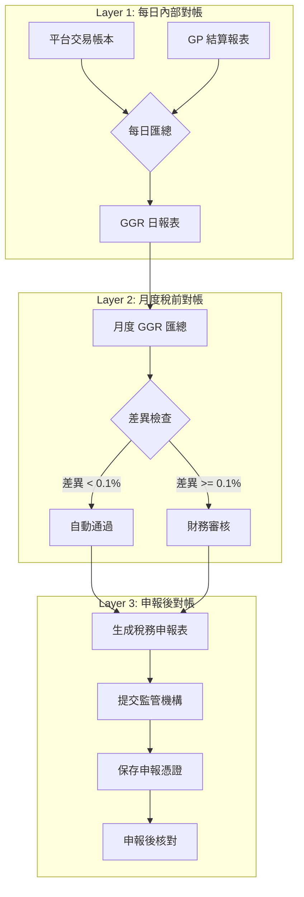
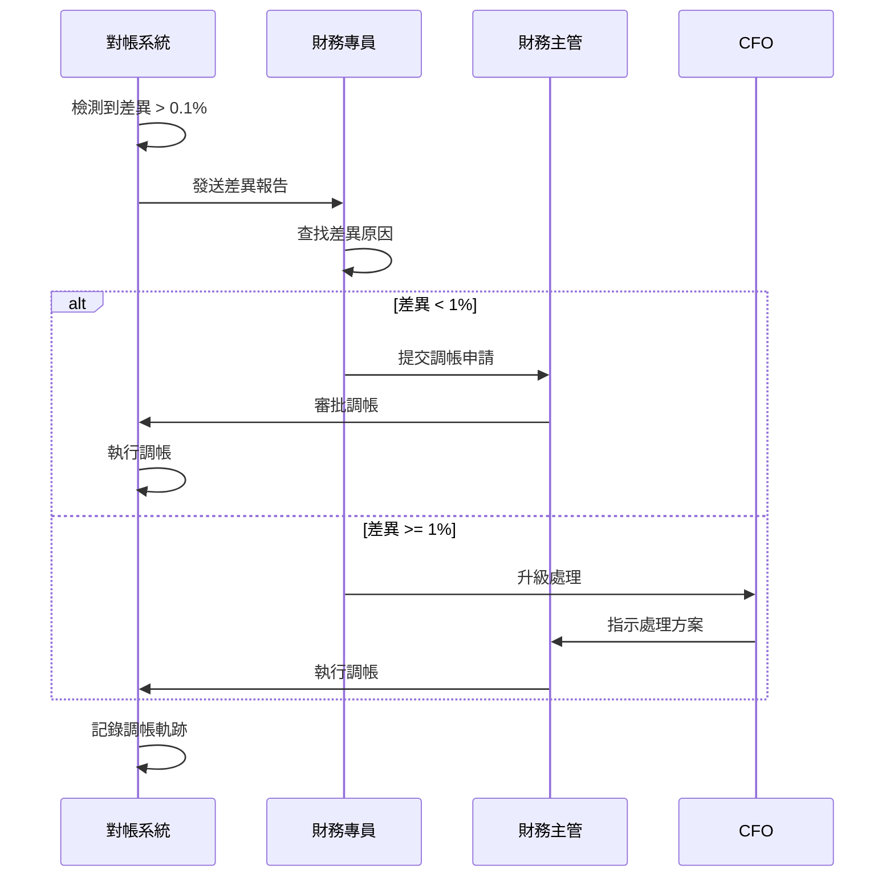

# 02-11 GGR 稅務對帳 (GGR Tax Reconciliation)

**版本**: 1.0.0
**創建日期**: 2026-02-07
**狀態**: P0 - 監管合規必要

---

## 1. 概述

GGR (Gross Gaming Revenue) 稅務對帳確保平台向監管機構申報的 GGR 數據與內部計算結果一致，符合各牌照稅務合規要求。

### 1.1 對帳目的

- **稅務合規**: 確保申報金額準確，避免稅務糾紛
- **審計追蹤**: 提供完整的計算與申報軌跡
- **差異預警**: 及時發現計算偏差，避免牌照風險

### 1.2 適用範圍

| 牌照 | 稅種 | 稅率 | 計稅基礎 |
|------|------|------|---------|
| UKGC | Remote Gaming Duty (RGD) | 21% | GGR |
| MGA | Gaming Tax | 5% | GGR |
| Gibraltar | Gambling Duty | 0.15% | Turnover |
| Brazil SPA | Imposto sobre Apostas | 12% | GGR (2026) |

---

## 2. GGR 計算公式

### 2.1 標準 GGR 公式

```
GGR = Total Wagers - Total Payouts - Bonus Cost
    = (Cash Wagers + Bonus Wagers) - (Cash Payouts + Jackpot Payouts) - (Bonus Issued)
```

### 2.2 各牌照計算差異

| 牌照 | GGR 定義 | 特殊扣減項 |
|------|---------|-----------|
| **UKGC** | Wagers - Payouts - Free Bets | 可扣減 Free Bet 成本 |
| **MGA** | Wagers - Payouts | 不可扣減 Bonus |
| **Gibraltar** | Total Turnover | N/A (按流水計稅) |
| **Brazil SPA** | Wagers - Payouts - Taxes | 可扣減聯邦稅 |

### 2.3 計算實現

```sql
-- 每日 GGR 計算 (以 UKGC 為例)
SELECT
    DATE(settled_at) AS report_date,
    jurisdiction,
    SUM(bet_amount) AS total_wagers,
    SUM(payout_amount) AS total_payouts,
    SUM(CASE WHEN is_free_bet THEN bet_amount ELSE 0 END) AS free_bet_cost,
    SUM(bet_amount) - SUM(payout_amount) - SUM(CASE WHEN is_free_bet THEN bet_amount ELSE 0 END) AS ggr,
    (SUM(bet_amount) - SUM(payout_amount) - SUM(CASE WHEN is_free_bet THEN bet_amount ELSE 0 END)) * 0.21 AS tax_due
FROM t_game_transaction
WHERE jurisdiction = 'UKGC'
  AND status = 'SETTLED'
  AND DATE(settled_at) = '2026-02-06'
GROUP BY DATE(settled_at), jurisdiction;
```

---

## 3. 對帳流程

### 3.1 三層對帳架構



### 3.2 執行時程

| 對帳層級 | 執行時間 | 責任人 | 輸出物 |
|---------|---------|--------|--------|
| Layer 1 | 每日 03:00 UTC | 系統自動 | GGR 日報 |
| Layer 2 | 每月 25 日 | 財務專員 | 月度稅務預算表 |
| Layer 3 | 申報後 3 日內 | 財務主管 | 申報核對報告 |

---

## 4. 監管申報要求

### 4.1 UKGC RGD 申報

| 項目 | 要求 |
|------|------|
| **申報週期** | 每月 |
| **截止日期** | 次月 28 日 |
| **申報格式** | HMRC XML 格式 |
| **保留期限** | 7 年 |

**申報欄位**:
- Gross Gaming Revenue
- Free Bets Deduction
- Net Gaming Revenue
- Tax Due (21% of NGR)
- Payment Reference

### 4.2 MGA Gaming Tax 申報

| 項目 | 要求 |
|------|------|
| **申報週期** | 每月 |
| **截止日期** | 次月 20 日 |
| **申報格式** | MGA 指定 CSV |
| **保留期限** | 10 年 |

### 4.3 申報數據結構

```json
{
  "reportPeriod": {
    "startDate": "2026-02-01",
    "endDate": "2026-02-29"
  },
  "jurisdiction": "UKGC",
  "currency": "GBP",
  "ggrBreakdown": {
    "totalWagers": 1523400.00,
    "totalPayouts": 1421200.00,
    "freeBetCost": 12300.00,
    "ggr": 89900.00
  },
  "taxCalculation": {
    "taxableGgr": 89900.00,
    "taxRate": 0.21,
    "taxDue": 18879.00
  },
  "submissionDetails": {
    "submittedAt": "2026-03-15T10:00:00Z",
    "submittedBy": "finance@operator.com",
    "reference": "UKGC-RGD-202602-001"
  }
}
```

---

## 5. 差異處理

### 5.1 差異分類

| 差異類型 | 容差範圍 | 處理方式 |
|---------|---------|---------|
| **計算誤差** | < 0.01% | 自動忽略 (浮點精度) |
| **配置偏差** | 0.01% - 0.1% | 系統警告，日誌記錄 |
| **異常偏差** | 0.1% - 1% | 財務審核，手動調帳 |
| **嚴重偏差** | > 1% | 緊急警報，CFO 介入 |

### 5.2 常見差異原因

| 原因 | 說明 | 解決方案 |
|------|------|---------|
| **時區差異** | UTC vs 本地時區計算 | 統一使用 UTC |
| **結算延遲** | 跨日結算訂單歸屬 | 以結算時間為準 |
| **匯率差異** | 多幣種轉換差異 | 使用統一匯率快照 |
| **Bonus 歸類** | Free Bet 分類錯誤 | 明確 Bonus Type 定義 |
| **Jackpot 處理** | Progressive Jackpot 歸屬 | 依 GP 結算報表 |

### 5.3 調帳流程



---

## 6. 審計軌跡

### 6.1 數據保留

| 數據類型 | 保留期限 | 存儲位置 |
|---------|---------|---------|
| 交易明細 | 10 年 | 數據倉庫 (Parquet) |
| GGR 日報 | 10 年 | PostgreSQL + S3 |
| 申報憑證 | 永久 | 加密存儲 |
| 調帳記錄 | 10 年 | 審計日誌表 |

### 6.2 審計表結構

```sql
CREATE TABLE t_ggr_tax_reconciliation (
    id                  BIGINT PRIMARY KEY AUTO_INCREMENT,
    report_date         DATE NOT NULL,
    jurisdiction        VARCHAR(20) NOT NULL,

    -- 內部計算值
    internal_total_wagers       DECIMAL(18,2),
    internal_total_payouts      DECIMAL(18,2),
    internal_free_bet_cost      DECIMAL(18,2),
    internal_ggr                DECIMAL(18,2),

    -- GP 報表值
    gp_total_wagers             DECIMAL(18,2),
    gp_total_payouts            DECIMAL(18,2),
    gp_ggr                      DECIMAL(18,2),

    -- 差異分析
    ggr_variance                DECIMAL(18,2),
    variance_percentage         DECIMAL(8,4),
    variance_reason             VARCHAR(500),

    -- 狀態追蹤
    status                      VARCHAR(20) DEFAULT 'PENDING',  -- PENDING, MATCHED, ADJUSTED, ESCALATED
    reviewed_by                 VARCHAR(100),
    reviewed_at                 DATETIME,
    adjustment_amount           DECIMAL(18,2),

    created_at                  DATETIME DEFAULT CURRENT_TIMESTAMP,
    updated_at                  DATETIME DEFAULT CURRENT_TIMESTAMP ON UPDATE CURRENT_TIMESTAMP,

    UNIQUE KEY uk_date_jurisdiction (report_date, jurisdiction),
    INDEX idx_status (status),
    INDEX idx_variance (variance_percentage)
);

CREATE TABLE t_ggr_tax_submission (
    id                  BIGINT PRIMARY KEY AUTO_INCREMENT,
    jurisdiction        VARCHAR(20) NOT NULL,
    report_period_start DATE NOT NULL,
    report_period_end   DATE NOT NULL,

    -- 申報數據
    taxable_ggr         DECIMAL(18,2) NOT NULL,
    tax_rate            DECIMAL(8,4) NOT NULL,
    tax_due             DECIMAL(18,2) NOT NULL,
    currency            VARCHAR(3) NOT NULL,

    -- 申報狀態
    submission_status   VARCHAR(20) NOT NULL,  -- DRAFT, SUBMITTED, ACCEPTED, REJECTED
    submitted_at        DATETIME,
    submitted_by        VARCHAR(100),
    external_reference  VARCHAR(100),

    -- 支付追蹤
    payment_status      VARCHAR(20),  -- PENDING, PAID, OVERDUE
    payment_date        DATE,
    payment_reference   VARCHAR(100),

    created_at          DATETIME DEFAULT CURRENT_TIMESTAMP,
    updated_at          DATETIME DEFAULT CURRENT_TIMESTAMP ON UPDATE CURRENT_TIMESTAMP,

    UNIQUE KEY uk_jurisdiction_period (jurisdiction, report_period_start, report_period_end),
    INDEX idx_submission_status (submission_status)
);
```

---

## 7. 監控與告警

### 7.1 關鍵指標

| 指標 | Prometheus 名稱 | 告警閾值 |
|------|----------------|---------|
| GGR 差異率 | `ggr_reconciliation_variance_rate` | > 0.1% |
| 申報截止倒數 | `ggr_submission_deadline_days` | < 3 天 |
| 未對帳天數 | `ggr_unreconciled_days` | > 2 天 |
| 調帳金額 | `ggr_adjustment_amount_total` | > $10,000/月 |

### 7.2 告警規則

```yaml
alerts:
  - name: ggr_variance_high
    condition: ggr_reconciliation_variance_rate > 0.001
    severity: WARNING
    notify: slack:#finance-ops

  - name: ggr_variance_critical
    condition: ggr_reconciliation_variance_rate > 0.01
    severity: CRITICAL
    notify: pagerduty:finance-oncall, email:cfo@company.com

  - name: tax_submission_deadline
    condition: ggr_submission_deadline_days < 3
    severity: WARNING
    notify: slack:#finance-ops, email:finance-team@company.com
```

---

## 8. 相關文檔

- [02-03 對帳系統](02-03_Reconciliation_System.md) - 核心對帳架構
- [02-04 流水計算](02-04_Turnover_and_Game_Reconciliation_Analysis.md) - 流水計算規則
- [06-08 UKGC 合規](../06_Platform_Governance/06-08_UKGC_Compliance.md) - UK 牌照要求
- [06-09 MGA 合規](../06_Platform_Governance/06-09_MGA_Compliance.md) - Malta 牌照要求

---

**返回**: [財務中心](README.md) | [iGaming 首頁](../README.md)
