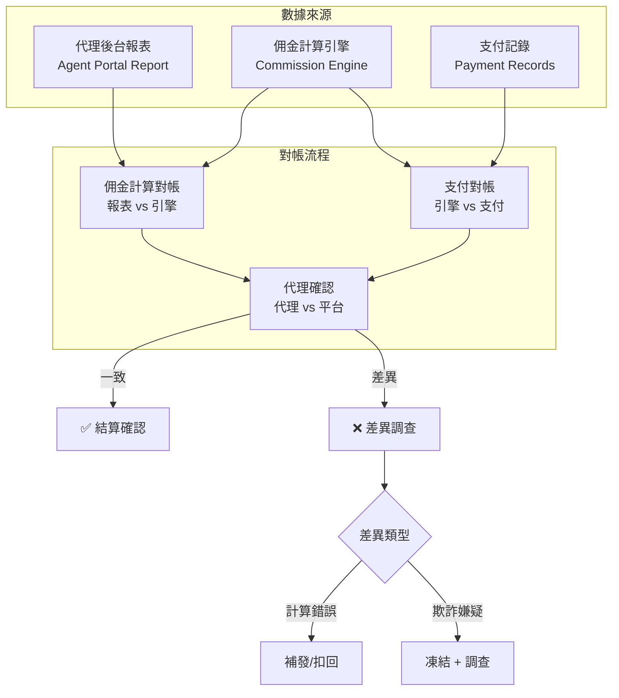
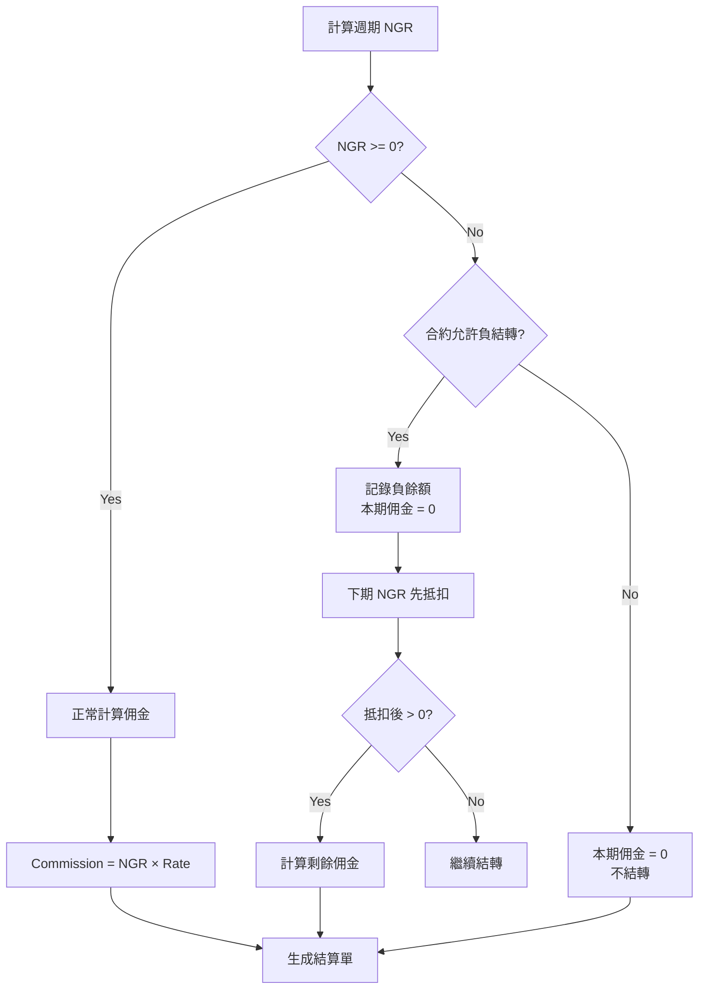

# 02-12 代理佣金對帳 (Affiliate Commission Reconciliation)

**版本**: 1.0.0
**創建日期**: 2026-02-07
**狀態**: P1 - 財務安全

---

## 1. 概述

代理佣金對帳確保平台計算的佣金與實際支付金額一致，防止佣金計算錯誤或代理欺詐導致的財務損失。

### 1.1 對帳目的

- **財務準確性**: 確保佣金計算與支付無誤
- **欺詐預防**: 配合 [05-02-07 代理欺詐檢測](../05_Risk_Control/05-02-07_Affiliate_Fraud_Detection.md)
- **結算合規**: 確保結算週期與合約一致

### 1.2 佣金類型

| 佣金類型 | 計算基礎 | 結算週期 | 負結轉規則 |
|---------|---------|---------|-----------|
| **Revenue Share** | Net Win (NGR) | 週結/月結 | 可結轉 / 不結轉 |
| **Turnover Rebate** | Valid Bet | 日結/週結 | 不適用 |
| **CPA** | First Deposit | 達標後 7 天 | 不適用 |
| **Hybrid** | CPA + RevShare | 混合 | 按 RevShare 部分 |

---

## 2. 對帳流程

### 2.1 三方對帳架構



### 2.2 Revenue Share 對帳

#### 計算公式

```
Commission = (Player GGR - Bonus Cost - Processing Fees) × Commission Rate
           = NGR × Commission Rate
```

#### 對帳 SQL

```sql
-- Revenue Share 佣金對帳
WITH player_ggr AS (
    SELECT
        a.affiliate_id,
        p.id AS player_id,
        DATE_TRUNC('week', gt.settled_at) AS week_start,
        SUM(gt.bet_amount) AS total_wagers,
        SUM(gt.payout_amount) AS total_payouts,
        SUM(gt.bet_amount) - SUM(gt.payout_amount) AS ggr
    FROM t_game_transaction gt
    JOIN t_player p ON gt.player_id = p.id
    JOIN t_affiliate_player ap ON p.id = ap.player_id
    JOIN t_affiliate a ON ap.affiliate_id = a.id
    WHERE gt.status = 'SETTLED'
      AND gt.settled_at BETWEEN '2026-02-03' AND '2026-02-09'
    GROUP BY a.affiliate_id, p.id, DATE_TRUNC('week', gt.settled_at)
),
affiliate_summary AS (
    SELECT
        affiliate_id,
        week_start,
        SUM(ggr) AS total_ngr,
        COUNT(DISTINCT player_id) AS active_players
    FROM player_ggr
    GROUP BY affiliate_id, week_start
),
calculated_commission AS (
    SELECT
        a.affiliate_id,
        a.week_start,
        a.total_ngr,
        c.commission_rate,
        CASE
            WHEN a.total_ngr < 0 AND c.negative_carryover = TRUE THEN 0  -- 負結轉
            ELSE a.total_ngr * c.commission_rate
        END AS calculated_commission,
        CASE
            WHEN a.total_ngr < 0 THEN ABS(a.total_ngr)
            ELSE 0
        END AS carryover_amount
    FROM affiliate_summary a
    JOIN t_affiliate_contract c ON a.affiliate_id = c.affiliate_id
)

SELECT
    cc.affiliate_id,
    cc.week_start,
    cc.total_ngr,
    cc.commission_rate,
    cc.calculated_commission AS engine_commission,
    ar.reported_commission AS portal_commission,
    ABS(cc.calculated_commission - ar.reported_commission) AS variance,
    CASE
        WHEN ABS(cc.calculated_commission - ar.reported_commission) < 0.01 THEN 'MATCHED'
        WHEN ABS(cc.calculated_commission - ar.reported_commission) < cc.calculated_commission * 0.001 THEN 'WITHIN_TOLERANCE'
        ELSE 'MISMATCH'
    END AS status
FROM calculated_commission cc
LEFT JOIN t_affiliate_report ar ON cc.affiliate_id = ar.affiliate_id
    AND cc.week_start = ar.report_period_start;
```

### 2.3 負結轉驗證



---

## 3. 異常處理

### 3.1 差異分類

| 差異類型 | 容差 | 處理方式 | 時效 |
|---------|------|---------|------|
| **計算誤差** | < 0.01% | 自動忽略 | 即時 |
| **配置差異** | 0.01% - 0.1% | 日誌記錄 + 警告 | 24h |
| **計算錯誤** | 0.1% - 1% | 財務審核 + 調帳 | 48h |
| **嚴重差異** | > 1% | 凍結 + 調查 | 立即 |

### 3.2 常見差異原因

| 原因 | 說明 | 解決方案 |
|------|------|---------|
| **費率配置錯誤** | 合約費率與系統不一致 | 核對合約，更新系統 |
| **玩家歸屬錯誤** | 玩家劃歸錯誤代理 | 核對註冊追蹤碼 |
| **結算週期錯位** | 時區或週期定義不同 | 統一使用 UTC |
| **負結轉邏輯錯誤** | 結轉計算不正確 | 驗證結轉餘額 |
| **自推廣玩家** | 代理推廣自己帳戶 | 參見欺詐檢測 |

### 3.3 調帳流程

```java
@Service
@RequiredArgsConstructor
@Slf4j
public class CommissionAdjustmentService {

    private final CommissionReconciliationDao reconciliationDao;
    private final AffiliatePaymentService paymentService;

    /**
     * 處理佣金差異調帳
     */
    @Transactional(rollbackFor = Throwable.class)
    public ResponseDTO<Void> processAdjustment(CommissionAdjustmentForm form) {
        // 1. 驗證差異記錄
        CommissionReconciliation recon = reconciliationDao.findById(form.getReconciliationId())
            .orElseThrow(() -> new BusinessException("對帳記錄不存在"));

        if (!"MISMATCH".equals(recon.getStatus())) {
            return ResponseDTO.error("僅可處理 MISMATCH 狀態的記錄");
        }

        // 2. 根據差異類型處理
        BigDecimal adjustmentAmount = form.getAdjustmentAmount();

        if (adjustmentAmount.compareTo(BigDecimal.ZERO) > 0) {
            // 補發佣金
            paymentService.scheduleSupplementPayment(
                recon.getAffiliateId(),
                adjustmentAmount,
                "佣金補發: " + form.getReason()
            );
        } else if (adjustmentAmount.compareTo(BigDecimal.ZERO) < 0) {
            // 扣回佣金 (下期抵扣)
            reconciliationDao.addDeductionBalance(
                recon.getAffiliateId(),
                adjustmentAmount.abs()
            );
        }

        // 3. 更新對帳狀態
        recon.setStatus("ADJUSTED");
        recon.setAdjustmentAmount(adjustmentAmount);
        recon.setAdjustedBy(SecurityContextHolder.getCurrentUser());
        recon.setAdjustedAt(LocalDateTime.now());
        reconciliationDao.updateById(recon);

        log.info("Commission adjustment processed: affiliateId={}, amount={}",
            recon.getAffiliateId(), adjustmentAmount);

        return ResponseDTO.ok();
    }
}
```

---

## 4. 數據結構

### 4.1 對帳表

```sql
CREATE TABLE t_affiliate_commission_reconciliation (
    id                      BIGINT PRIMARY KEY AUTO_INCREMENT,
    affiliate_id            BIGINT NOT NULL,
    settlement_period_start DATE NOT NULL,
    settlement_period_end   DATE NOT NULL,
    commission_type         VARCHAR(20) NOT NULL,  -- REVSHARE, TURNOVER, CPA, HYBRID

    -- 計算引擎數據
    engine_ngr              DECIMAL(18,2),
    engine_valid_bet        DECIMAL(18,2),
    engine_commission_rate  DECIMAL(8,4),
    engine_commission       DECIMAL(18,2),
    engine_carryover        DECIMAL(18,2),

    -- 代理報表數據
    portal_ngr              DECIMAL(18,2),
    portal_commission       DECIMAL(18,2),

    -- 支付記錄數據
    payment_amount          DECIMAL(18,2),
    payment_reference       VARCHAR(100),

    -- 差異分析
    engine_vs_portal_variance   DECIMAL(18,2),
    engine_vs_payment_variance  DECIMAL(18,2),
    variance_percentage         DECIMAL(8,4),

    -- 狀態
    status                  VARCHAR(20) DEFAULT 'PENDING',  -- PENDING, MATCHED, MISMATCH, ADJUSTED
    adjustment_amount       DECIMAL(18,2),
    adjustment_reason       VARCHAR(500),
    adjusted_by             VARCHAR(100),
    adjusted_at             DATETIME,

    created_at              DATETIME DEFAULT CURRENT_TIMESTAMP,
    updated_at              DATETIME DEFAULT CURRENT_TIMESTAMP ON UPDATE CURRENT_TIMESTAMP,

    UNIQUE KEY uk_affiliate_period (affiliate_id, settlement_period_start, settlement_period_end),
    INDEX idx_status (status),
    INDEX idx_period (settlement_period_start)
);
```

---

## 5. 監控與告警

### 5.1 關鍵指標

| 指標 | Prometheus 名稱 | 告警閾值 |
|------|----------------|---------|
| 佣金差異率 | `affiliate_commission_variance_rate` | > 0.1% |
| 未對帳代理數 | `affiliate_unreconciled_count` | > 10 |
| 調帳金額 | `affiliate_adjustment_amount_total` | > $10,000/週 |

### 5.2 告警規則

```yaml
alerts:
  - name: commission_variance_high
    condition: affiliate_commission_variance_rate > 0.001
    severity: WARNING
    notify: slack:#affiliate-ops

  - name: commission_variance_critical
    condition: affiliate_commission_variance_rate > 0.01
    severity: CRITICAL
    notify: pagerduty:finance-oncall
```

---

## 6. 相關文檔

- [05-02-07 代理欺詐檢測](../05_Risk_Control/05-02-07_Affiliate_Fraud_Detection.md) - 欺詐檢測
- [02-03 對帳系統](02-03_Reconciliation_System.md) - 核心對帳架構
- [07-03 代理系統](../07_Agent_Center/07-03_Agent_System.md) - 代理管理

---

**返回**: [財務中心](README.md) | [iGaming 首頁](../README.md)
