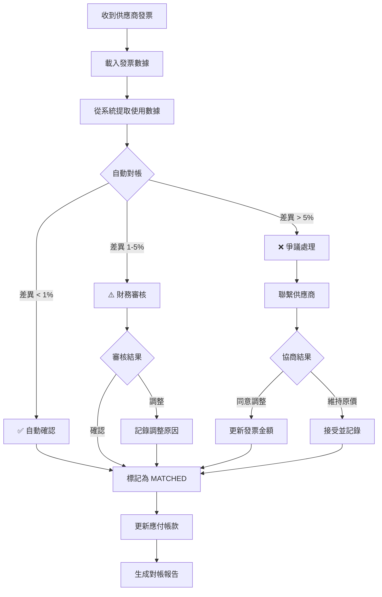
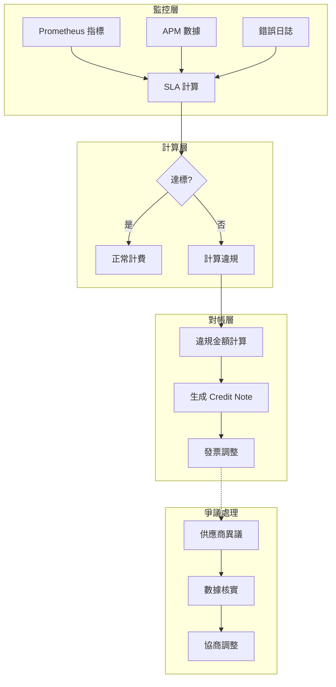

# 02-13 第三方服務費對帳 (Service Fee Reconciliation)

**版本**: 1.0.0
**創建日期**: 2026-02-07
**狀態**: P1 - 財務安全

---

## 1. 概述

第三方服務費對帳確保平台與各供應商（PSP、GP、CDN、SMS 等）之間的費用計算與發票金額一致，控制營運成本。

### 1.1 對帳目的

- **成本控制**: 確保不被多收費用
- **發票核對**: 驗證供應商發票準確性
- **預算管理**: 提供準確的成本數據

### 1.2 費用類型

| 供應商類型 | 費用結構 | 結算週期 | 對帳頻率 |
|-----------|---------|---------|---------|
| **PSP** (Stripe, PayPal) | % + 固定費 | T+1 ~ T+7 | 每日 |
| **Game Provider** | % of GGR | 月結 | 每月 |
| **CDN** (Cloudflare) | 流量計費 | 月結 | 每月 |
| **SMS Provider** | 按條計費 | 週結/月結 | 每週 |
| **KYC Provider** | 按次計費 | 月結 | 每月 |

---

## 2. PSP 費用對帳

### 2.1 費用計算規則

| PSP | 固定費 | 百分比費 | 其他費用 |
|-----|-------|---------|---------|
| **Stripe** | $0.30/筆 | 2.9% | 3D Secure +$0.10 |
| **PayPal** | $0.30/筆 | 3.49% | 跨境 +1.5% |
| **Adyen** | €0.10/筆 | 2.5% | Scheme Fee 另計 |
| **PIX (Brazil)** | R$0.00 | 0.99% | - |

### 2.2 對帳 SQL

```sql
-- PSP 費用對帳 (以 Stripe 為例)
WITH our_calculation AS (
    SELECT
        DATE(created_at) AS txn_date,
        psp_code,
        COUNT(*) AS txn_count,
        SUM(amount) AS gross_amount,
        -- 固定費用
        COUNT(*) * 0.30 AS fixed_fee,
        -- 百分比費用
        SUM(amount) * 0.029 AS percentage_fee,
        -- 3D Secure 費用
        SUM(CASE WHEN three_ds_used THEN 0.10 ELSE 0 END) AS three_ds_fee,
        -- 總計算費用
        COUNT(*) * 0.30 + SUM(amount) * 0.029 +
        SUM(CASE WHEN three_ds_used THEN 0.10 ELSE 0 END) AS total_calculated_fee
    FROM t_payment_transaction
    WHERE psp_code = 'STRIPE'
      AND status = 'SUCCESS'
      AND DATE(created_at) = '2026-02-06'
    GROUP BY DATE(created_at), psp_code
),
psp_invoice AS (
    SELECT
        invoice_date,
        psp_code,
        transaction_count,
        gross_volume,
        total_fee AS psp_reported_fee
    FROM t_psp_invoice_detail
    WHERE psp_code = 'STRIPE'
      AND invoice_date = '2026-02-06'
)

SELECT
    oc.txn_date,
    oc.psp_code,
    oc.txn_count AS our_txn_count,
    pi.transaction_count AS psp_txn_count,
    oc.gross_amount AS our_volume,
    pi.gross_volume AS psp_volume,
    oc.total_calculated_fee AS our_fee,
    pi.psp_reported_fee,
    ABS(oc.total_calculated_fee - pi.psp_reported_fee) AS variance,
    CASE
        WHEN ABS(oc.total_calculated_fee - pi.psp_reported_fee) < 1 THEN 'MATCHED'
        WHEN ABS(oc.total_calculated_fee - pi.psp_reported_fee) / oc.total_calculated_fee < 0.01 THEN 'WITHIN_TOLERANCE'
        ELSE 'MISMATCH'
    END AS status
FROM our_calculation oc
LEFT JOIN psp_invoice pi ON oc.txn_date = pi.invoice_date AND oc.psp_code = pi.psp_code;
```

### 2.3 Scheme Fee 處理

```yaml
# Visa/Mastercard Scheme Fee (由 PSP 轉嫁)
scheme_fees:
  visa:
    assessment: 0.14%    # 所有交易
    acquirer_processing: 0.0195%  # 每筆
  mastercard:
    assessment: 0.13%
    acquirer_processing: 0.0185%

# 這些費用通常包含在 PSP 報價中，但需要驗證
```

---

## 3. Game Provider 費用對帳

### 3.1 費用計算規則

| GP 類型 | 費用基礎 | 費率 | 結算方式 |
|---------|---------|------|---------|
| **一線 GP** (Evolution) | GGR | 15-20% | 月結 |
| **二線 GP** (Pragmatic) | GGR | 10-15% | 月結 |
| **Aggregator** (Hub88) | GGR | 8-12% | 月結 |
| **Lottery Provider** | Turnover | 2-5% | 週結 |

### 3.2 GGR 計算對帳

```sql
-- GP 費用對帳
WITH our_ggr AS (
    SELECT
        gp_code,
        DATE_TRUNC('month', settled_at) AS period_month,
        SUM(bet_amount) AS total_wagers,
        SUM(payout_amount) AS total_payouts,
        SUM(bet_amount) - SUM(payout_amount) AS ggr
    FROM t_game_transaction
    WHERE settled_at BETWEEN '2026-02-01' AND '2026-02-29'
      AND status = 'SETTLED'
    GROUP BY gp_code, DATE_TRUNC('month', settled_at)
),
gp_invoice AS (
    SELECT
        gp_code,
        invoice_period_start,
        invoice_ggr,
        fee_rate,
        invoice_fee
    FROM t_gp_invoice
    WHERE invoice_period_start = '2026-02-01'
)

SELECT
    og.gp_code,
    og.period_month,
    og.ggr AS our_ggr,
    gi.invoice_ggr AS gp_ggr,
    ABS(og.ggr - gi.invoice_ggr) AS ggr_variance,
    gi.fee_rate,
    og.ggr * gi.fee_rate AS our_calculated_fee,
    gi.invoice_fee AS gp_invoice_fee,
    ABS(og.ggr * gi.fee_rate - gi.invoice_fee) AS fee_variance,
    CASE
        WHEN ABS(og.ggr - gi.invoice_ggr) / NULLIF(og.ggr, 0) < 0.001 THEN 'MATCHED'
        ELSE 'MISMATCH'
    END AS status
FROM our_ggr og
LEFT JOIN gp_invoice gi ON og.gp_code = gi.gp_code;
```

---

## 4. 其他服務費對帳

### 4.1 CDN 費用

```sql
-- CDN 費用對帳 (Cloudflare 為例)
SELECT
    DATE_TRUNC('month', log_date) AS period_month,
    SUM(bytes_transferred) / (1024 * 1024 * 1024) AS total_gb,
    -- 階梯計費
    CASE
        WHEN SUM(bytes_transferred) / (1024 * 1024 * 1024) <= 10000 THEN
            SUM(bytes_transferred) / (1024 * 1024 * 1024) * 0.05
        ELSE
            10000 * 0.05 + (SUM(bytes_transferred) / (1024 * 1024 * 1024) - 10000) * 0.04
    END AS calculated_cost
FROM t_cdn_usage_log
WHERE log_date BETWEEN '2026-02-01' AND '2026-02-29'
GROUP BY DATE_TRUNC('month', log_date);
```

### 4.2 SMS 費用

```sql
-- SMS 費用對帳
SELECT
    DATE_TRUNC('week', sent_at) AS period_week,
    sms_provider,
    country_code,
    COUNT(*) AS sms_count,
    SUM(unit_price) AS calculated_cost
FROM t_sms_log
WHERE sent_at BETWEEN '2026-02-03' AND '2026-02-09'
  AND status = 'DELIVERED'
GROUP BY DATE_TRUNC('week', sent_at), sms_provider, country_code;
```

### 4.3 KYC 費用

```sql
-- KYC 服務費對帳
SELECT
    DATE_TRUNC('month', verified_at) AS period_month,
    kyc_provider,
    verification_type,  -- DOCUMENT, LIVENESS, ADDRESS
    COUNT(*) AS verification_count,
    SUM(unit_price) AS calculated_cost
FROM t_kyc_verification
WHERE verified_at BETWEEN '2026-02-01' AND '2026-02-29'
  AND status = 'COMPLETED'
GROUP BY DATE_TRUNC('month', verified_at), kyc_provider, verification_type;
```

---

## 5. 對帳流程

### 5.1 流程圖



### 5.2 發票處理時程

| 供應商類型 | 發票接收 | 對帳截止 | 付款截止 |
|-----------|---------|---------|---------|
| PSP | 次日 | T+3 | T+7 |
| Game Provider | 月初 5 日 | 月初 10 日 | 月初 15 日 |
| CDN | 月初 1 日 | 月初 5 日 | 月初 10 日 |
| Others | 按合約 | 收到後 5 日 | 對帳後 10 日 |

---

## 6. 數據結構

### 6.1 對帳表

```sql
CREATE TABLE t_service_fee_reconciliation (
    id                      BIGINT PRIMARY KEY AUTO_INCREMENT,
    provider_type           VARCHAR(20) NOT NULL,  -- PSP, GP, CDN, SMS, KYC
    provider_code           VARCHAR(50) NOT NULL,
    period_start            DATE NOT NULL,
    period_end              DATE NOT NULL,

    -- 內部計算
    internal_volume         DECIMAL(18,2),
    internal_count          INT,
    internal_fee            DECIMAL(18,2),

    -- 發票數據
    invoice_number          VARCHAR(100),
    invoice_date            DATE,
    invoice_volume          DECIMAL(18,2),
    invoice_fee             DECIMAL(18,2),

    -- 差異分析
    volume_variance         DECIMAL(18,2),
    fee_variance            DECIMAL(18,2),
    variance_percentage     DECIMAL(8,4),

    -- 狀態
    status                  VARCHAR(20) DEFAULT 'PENDING',
    reviewed_by             VARCHAR(100),
    reviewed_at             DATETIME,
    dispute_reason          VARCHAR(500),
    resolution              VARCHAR(500),

    created_at              DATETIME DEFAULT CURRENT_TIMESTAMP,
    updated_at              DATETIME DEFAULT CURRENT_TIMESTAMP ON UPDATE CURRENT_TIMESTAMP,

    UNIQUE KEY uk_provider_period (provider_type, provider_code, period_start),
    INDEX idx_status (status),
    INDEX idx_invoice_date (invoice_date)
);
```

---

## 7. 監控與告警

### 7.1 關鍵指標

| 指標 | Prometheus 名稱 | 告警閾值 |
|------|----------------|---------|
| 費用差異率 | `service_fee_variance_rate` | > 1% |
| 未對帳發票數 | `service_fee_pending_invoices` | > 5 |
| 逾期未付款 | `service_fee_overdue_payments` | > 0 |

---

## 8. 供應商 SLA 對帳

追蹤供應商服務品質，將 SLA 違規與費用調整掛鉤。

### 8.1 SLA 指標分類

| 類別 | 指標 | 目標 | 違規處理 |
|------|------|------|---------|
| **可用性** | Uptime | 99.9% | 低於則費用減免 |
| **回應時間** | API Latency P95 | < 500ms | 超時則罰款 |
| **結算時效** | Settlement Delay | ≤ SLA | 延遲則利息補償 |
| **錯誤率** | Error Rate | < 0.1% | 超標則費用調整 |

### 8.2 SLA 對帳流程



### 8.3 SLA 違規計算模型

```sql
-- SLA 違規對帳
CREATE TABLE t_sla_violation_reconciliation (
    id                      BIGINT PRIMARY KEY AUTO_INCREMENT,
    provider_type           VARCHAR(30) NOT NULL,  -- PSP, GAME_PROVIDER, CDN
    provider_code           VARCHAR(50) NOT NULL,

    -- 對帳週期
    period_start            DATE NOT NULL,
    period_end              DATE NOT NULL,

    -- SLA 指標
    sla_metric              VARCHAR(50) NOT NULL,  -- UPTIME, LATENCY, ERROR_RATE
    sla_target              DECIMAL(10,4) NOT NULL,
    actual_value            DECIMAL(10,4) NOT NULL,

    -- 違規計算
    violation_severity      VARCHAR(20),           -- MINOR, MAJOR, CRITICAL
    base_fee                DECIMAL(18,2) NOT NULL,
    credit_percentage       DECIMAL(5,2),          -- 扣減比例
    credit_amount           DECIMAL(18,2),

    -- 狀態
    status                  VARCHAR(20) DEFAULT 'PENDING',
    acknowledged_by_vendor  BOOLEAN DEFAULT FALSE,
    dispute_reason          VARCHAR(500),
    final_credit            DECIMAL(18,2),

    created_at              DATETIME DEFAULT CURRENT_TIMESTAMP,

    INDEX idx_provider (provider_type, provider_code),
    INDEX idx_period (period_start, period_end)
);

-- SLA 違規查詢
SELECT
    svr.provider_code,
    svr.sla_metric,
    svr.sla_target,
    svr.actual_value,
    CASE
        WHEN svr.sla_metric = 'UPTIME' THEN
            ROUND((svr.sla_target - svr.actual_value) / svr.sla_target * 100, 2)
        WHEN svr.sla_metric = 'LATENCY' THEN
            ROUND((svr.actual_value - svr.sla_target) / svr.sla_target * 100, 2)
        ELSE 0
    END AS deviation_percentage,
    svr.base_fee,
    svr.credit_amount,
    svr.status
FROM t_sla_violation_reconciliation svr
WHERE svr.period_start >= DATE_FORMAT(CURDATE() - INTERVAL 1 MONTH, '%Y-%m-01');
```

### 8.4 供應商 SLA 費率表

| 違規等級 | Uptime 偏差 | Latency 超標 | 費用減免 |
|---------|------------|-------------|---------|
| **Minor** | 0.01-0.05% | 10-25% | 5% |
| **Major** | 0.05-0.1% | 25-50% | 15% |
| **Critical** | > 0.1% | > 50% | 25%+ |
| **Outage** | 服務中斷 | N/A | 100% (當日) |

### 8.5 監控指標

```yaml
sla_reconciliation_metrics:
  - name: sla_violation_count
    type: counter
    labels: [provider_type, provider_code, violation_severity]

  - name: sla_credit_amount_total
    type: gauge
    labels: [provider_type]
    unit: EUR

  - name: sla_acknowledgement_rate
    type: gauge
    description: 供應商確認率
    target: ">= 95%"

  - name: sla_dispute_rate
    type: gauge
    description: 供應商爭議率
    alert:
      - condition: value > 20
        severity: warning
        message: "供應商 SLA 爭議率過高"
```

---

## 9. 相關文檔

- [02-02 支付閘道整合](02-02_Payment_Gateway_Integration.md) - PSP 整合
- [02-03 對帳系統](02-03_Reconciliation_System.md) - 核心對帳架構
- [02-05 帳單與發票](02-05_Billing_&_Invoicing.md) - 發票管理

---

**返回**: [財務中心](README.md) | [iGaming 首頁](../README.md)
