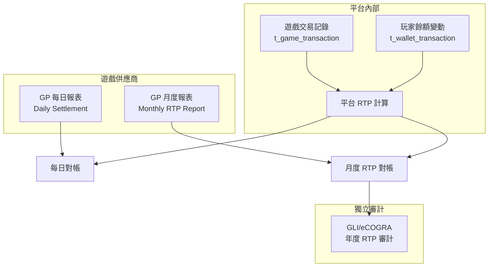
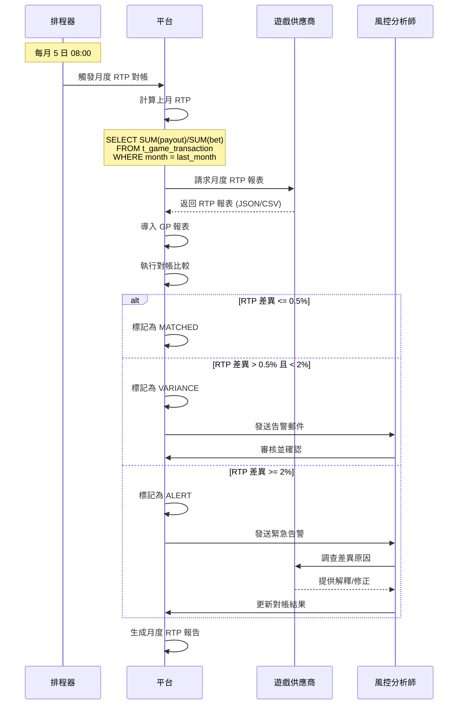

# 02-15 RTP Reconciliation (派彩率對帳)

**版本**: 1.0.0
**創建日期**: 2026-02-07
**狀態**: ✅ 規範完成
**優先級**: P0 Critical

---

## 概述

RTP (Return to Player) 對帳確保平台實際派彩率與遊戲供應商 (GP) 報表一致，滿足遊戲公平性監管要求。本文檔定義 RTP 對帳的架構、流程和監控機制。

### 監管背景

| 規範 | 司法區 | 關鍵要求 |
|------|--------|---------|
| **GLI-19** | 全球 | RTP 偏差 ≤ 0.5%，需獨立驗證 |
| **GLI-20** | 全球 | 桌上遊戲 RTP 驗證 |
| **UKGC RTS 7** | UK | RTP 公開披露，玩家可查詢 |
| **MGA Rule 10** | Malta | 遊戲公平性年度審計 |

---

## RTP 計算基礎

### 理論 RTP vs 實際 RTP

```yaml
RTP Definitions:
  Theoretical RTP:
    Definition: 遊戲數學模型計算的預期回報率
    Source: GP 遊戲規格文檔
    Example: 96.50% (Slots), 98.76% (Blackjack)

  Actual RTP:
    Definition: 實際玩家投注與派彩的比率
    Formula: (Total Payouts / Total Wagers) × 100%
    Period: 通常計算月度/季度
```

### RTP 計算公式

```
Actual RTP = (Σ Payouts + Σ Jackpot Wins) / Σ Valid Bets × 100%

Where:
- Payouts: 遊戲派彩 (不含原始投注退還)
- Jackpot Wins: 累積獎金派彩
- Valid Bets: 有效投注 (扣除已取消/已退還)
```

---

## 對帳架構

### 三方對帳模型



### 對帳層次

| 層次 | 頻率 | 數據源 | 目的 |
|------|------|--------|------|
| **L1: 交易對帳** | 即時/每小時 | Platform vs GP API | 確保交易記錄完整 |
| **L2: 結算對帳** | 每日 T+1 | Platform vs GP Daily Report | 驗證結算金額 |
| **L3: RTP 對帳** | 每月 | Platform vs GP Monthly Report | 驗證派彩率 |
| **L4: 審計對帳** | 每年 | Platform vs 獨立審計報告 | 監管合規 |

---

## 數據庫設計

```sql
-- RTP 對帳記錄表
CREATE TABLE t_rtp_reconciliation (
    id                      BIGINT PRIMARY KEY AUTO_INCREMENT,

    -- 對帳週期
    reconciliation_period   VARCHAR(20) NOT NULL,  -- DAILY, MONTHLY, QUARTERLY
    period_start            DATE NOT NULL,
    period_end              DATE NOT NULL,

    -- 遊戲維度
    game_provider_id        BIGINT NOT NULL,
    game_provider_code      VARCHAR(50) NOT NULL,
    game_id                 BIGINT,                 -- NULL = 供應商級別
    game_code               VARCHAR(100),
    game_type               VARCHAR(30),            -- SLOTS, TABLE, LIVE, SPORTS

    -- 平台計算
    platform_total_bets     DECIMAL(18,2) NOT NULL,
    platform_total_payouts  DECIMAL(18,2) NOT NULL,
    platform_jackpot_wins   DECIMAL(18,2) DEFAULT 0,
    platform_rtp_pct        DECIMAL(6,4) NOT NULL,  -- e.g., 96.5432

    -- GP 報表
    gp_total_bets           DECIMAL(18,2),
    gp_total_payouts        DECIMAL(18,2),
    gp_jackpot_wins         DECIMAL(18,2),
    gp_rtp_pct              DECIMAL(6,4),
    gp_report_id            VARCHAR(100),           -- GP 報表編號
    gp_report_received_at   DATETIME,

    -- 理論 RTP
    theoretical_rtp_pct     DECIMAL(6,4),           -- 遊戲規格 RTP

    -- 對帳結果
    bet_variance_pct        DECIMAL(6,4),           -- 投注差異 %
    payout_variance_pct     DECIMAL(6,4),           -- 派彩差異 %
    rtp_variance_pct        DECIMAL(6,4),           -- RTP 差異 %
    reconciliation_status   VARCHAR(30) NOT NULL,   -- MATCHED, VARIANCE, ALERT

    -- 統計顯著性
    sample_size             BIGINT,                 -- 投注筆數
    confidence_interval     DECIMAL(6,4),           -- 置信區間
    statistically_significant BOOLEAN,              -- 差異是否統計顯著

    -- 處理
    reviewed_by             BIGINT,
    reviewed_at             DATETIME,
    notes                   TEXT,

    -- 審計
    created_at              DATETIME DEFAULT CURRENT_TIMESTAMP,
    updated_at              DATETIME DEFAULT CURRENT_TIMESTAMP ON UPDATE CURRENT_TIMESTAMP,

    INDEX idx_period (period_start, period_end),
    INDEX idx_provider (game_provider_id, period_start),
    INDEX idx_status (reconciliation_status, period_start)
) ENGINE=InnoDB COMMENT='RTP 對帳記錄';

-- GP RTP 報表導入表
CREATE TABLE t_gp_rtp_report (
    id                  BIGINT PRIMARY KEY AUTO_INCREMENT,
    game_provider_id    BIGINT NOT NULL,
    report_type         VARCHAR(30) NOT NULL,       -- DAILY, MONTHLY
    report_period       DATE NOT NULL,
    report_id           VARCHAR(100) NOT NULL,

    -- 報表內容 (JSON)
    report_data         JSON NOT NULL,

    -- 處理狀態
    import_status       VARCHAR(30) NOT NULL,       -- PENDING, PROCESSED, ERROR
    processed_at        DATETIME,
    error_message       TEXT,

    -- 審計
    created_at          DATETIME DEFAULT CURRENT_TIMESTAMP,

    UNIQUE KEY uk_report (game_provider_id, report_type, report_period),
    INDEX idx_status (import_status, created_at)
) ENGINE=InnoDB COMMENT='GP RTP 報表導入';
```

---

## 對帳流程

### 月度 RTP 對帳流程



### 差異閾值定義

| 差異類型 | 閾值 | 狀態 | 處理方式 |
|---------|------|------|---------|
| **投注金額差異** | ≤ 0.01% | MATCHED | 自動通過 |
| | 0.01% - 0.1% | VARIANCE | 記錄，下月追蹤 |
| | > 0.1% | ALERT | 立即調查 |
| **RTP 差異** | ≤ 0.5% | MATCHED | 自動通過 |
| | 0.5% - 2% | VARIANCE | 統計顯著性檢驗 |
| | > 2% | ALERT | 遊戲公平性調查 |

---

## 統計顯著性檢驗

### 樣本量要求

RTP 差異的統計顯著性取決於樣本量：

```yaml
Sample Size Requirements (95% Confidence):
  Slots (High Variance):
    Minimum: 10,000 spins
    Recommended: 100,000+ spins

  Table Games (Low Variance):
    Minimum: 5,000 hands
    Recommended: 50,000+ hands

  Live Dealer:
    Minimum: 1,000 rounds
    Recommended: 10,000+ rounds
```

### 置信區間計算

```sql
-- RTP 置信區間計算 (近似)
SELECT
    game_id,
    game_code,
    COUNT(*) AS sample_size,
    SUM(payout_amount) / SUM(bet_amount) * 100 AS actual_rtp,

    -- 標準誤差 (簡化計算)
    SQRT(
        (SUM(payout_amount) / SUM(bet_amount)) *
        (1 - SUM(payout_amount) / SUM(bet_amount)) /
        COUNT(*)
    ) * 100 AS std_error,

    -- 95% 置信區間
    (SUM(payout_amount) / SUM(bet_amount) * 100) -
        1.96 * SQRT((SUM(payout_amount) / SUM(bet_amount)) *
                    (1 - SUM(payout_amount) / SUM(bet_amount)) / COUNT(*)) * 100 AS ci_lower,
    (SUM(payout_amount) / SUM(bet_amount) * 100) +
        1.96 * SQRT((SUM(payout_amount) / SUM(bet_amount)) *
                    (1 - SUM(payout_amount) / SUM(bet_amount)) / COUNT(*)) * 100 AS ci_upper

FROM t_game_transaction
WHERE created_at >= DATE_SUB(CURDATE(), INTERVAL 1 MONTH)
  AND transaction_type = 'BET'
  AND status = 'SETTLED'
GROUP BY game_id, game_code
HAVING COUNT(*) >= 1000;  -- 最小樣本量
```

---

## Java 實現

```java
/**
 * RTP 對帳服務
 */
@Service
@RequiredArgsConstructor
@Slf4j
public class RtpReconciliationService {

    private final GameTransactionDao gameTransactionDao;
    private final RtpReconciliationDao reconciliationDao;
    private final GpReportClient gpReportClient;
    private final AlertService alertService;

    private static final BigDecimal RTP_VARIANCE_THRESHOLD = new BigDecimal("0.5");
    private static final BigDecimal RTP_ALERT_THRESHOLD = new BigDecimal("2.0");
    private static final long MIN_SAMPLE_SIZE = 1000L;

    /**
     * 執行月度 RTP 對帳
     */
    @Transactional(rollbackFor = Throwable.class)
    public RtpReconciliationResult executeMonthlyReconciliation(
            Long gameProviderId, YearMonth period) {

        log.info("Starting RTP reconciliation for provider {} period {}",
            gameProviderId, period);

        // 1. 計算平台 RTP
        PlatformRtpStats platformStats = calculatePlatformRtp(gameProviderId, period);

        // 2. 獲取 GP 報表
        GpRtpReport gpReport = gpReportClient.getMonthlyRtpReport(gameProviderId, period);

        // 3. 執行對帳
        List<RtpReconciliation> results = new ArrayList<>();

        for (GameRtpData platformData : platformStats.getGameStats()) {
            GpGameRtpData gpData = gpReport.findByGameCode(platformData.getGameCode());

            RtpReconciliation recon = reconcile(platformData, gpData, period);
            results.add(recon);

            // 4. 告警檢查
            if (recon.getRtpVariancePct().abs().compareTo(RTP_ALERT_THRESHOLD) >= 0) {
                alertService.sendRtpAlert(recon);
            }
        }

        // 5. 批量保存
        reconciliationDao.batchInsert(results);

        return RtpReconciliationResult.builder()
            .totalGames(results.size())
            .matchedCount(countByStatus(results, "MATCHED"))
            .varianceCount(countByStatus(results, "VARIANCE"))
            .alertCount(countByStatus(results, "ALERT"))
            .build();
    }

    /**
     * 計算平台 RTP
     */
    private PlatformRtpStats calculatePlatformRtp(Long providerId, YearMonth period) {
        LocalDate startDate = period.atDay(1);
        LocalDate endDate = period.atEndOfMonth();

        return gameTransactionDao.calculateRtpByProvider(providerId, startDate, endDate);
    }

    /**
     * 執行單遊戲對帳
     */
    private RtpReconciliation reconcile(
            GameRtpData platform, GpGameRtpData gp, YearMonth period) {

        RtpReconciliation recon = new RtpReconciliation();
        recon.setReconciliationPeriod("MONTHLY");
        recon.setPeriodStart(period.atDay(1));
        recon.setPeriodEnd(period.atEndOfMonth());
        recon.setGameId(platform.getGameId());
        recon.setGameCode(platform.getGameCode());

        // 平台數據
        recon.setPlatformTotalBets(platform.getTotalBets());
        recon.setPlatformTotalPayouts(platform.getTotalPayouts());
        recon.setPlatformRtpPct(platform.calculateRtp());
        recon.setSampleSize(platform.getBetCount());

        // GP 數據
        if (gp != null) {
            recon.setGpTotalBets(gp.getTotalBets());
            recon.setGpTotalPayouts(gp.getTotalPayouts());
            recon.setGpRtpPct(gp.getRtp());
            recon.setGpReportId(gp.getReportId());

            // 計算差異
            BigDecimal rtpVariance = platform.calculateRtp()
                .subtract(gp.getRtp()).abs();
            recon.setRtpVariancePct(rtpVariance);

            // 統計顯著性檢驗
            boolean significant = isStatisticallySignificant(
                platform.calculateRtp(), gp.getRtp(), platform.getBetCount());
            recon.setStatisticallySignificant(significant);

            // 判定狀態
            if (rtpVariance.compareTo(RTP_VARIANCE_THRESHOLD) <= 0) {
                recon.setReconciliationStatus("MATCHED");
            } else if (rtpVariance.compareTo(RTP_ALERT_THRESHOLD) < 0) {
                recon.setReconciliationStatus("VARIANCE");
            } else {
                recon.setReconciliationStatus("ALERT");
            }
        } else {
            recon.setReconciliationStatus("GP_MISSING");
        }

        return recon;
    }

    /**
     * 統計顯著性檢驗 (Z-test)
     */
    private boolean isStatisticallySignificant(
            BigDecimal platformRtp, BigDecimal gpRtp, long sampleSize) {

        if (sampleSize < MIN_SAMPLE_SIZE) {
            return false; // 樣本量不足
        }

        // 簡化 Z-test
        double p1 = platformRtp.doubleValue() / 100;
        double p2 = gpRtp.doubleValue() / 100;
        double pooledP = (p1 + p2) / 2;
        double se = Math.sqrt(2 * pooledP * (1 - pooledP) / sampleSize);
        double z = Math.abs(p1 - p2) / se;

        return z > 1.96; // 95% 置信水準
    }
}
```

---

## 監控指標

```yaml
metrics:
  # RTP 對帳覆蓋率
  - name: rtp_reconciliation_coverage
    type: gauge
    description: RTP 對帳覆蓋的遊戲供應商比例
    target: "100%"
    labels: [period_type]

  # RTP 差異分佈
  - name: rtp_variance_distribution
    type: histogram
    description: RTP 差異分佈
    unit: percent
    buckets: [0.1, 0.5, 1.0, 2.0, 5.0]
    labels: [game_provider, game_type]

  # 對帳狀態計數
  - name: rtp_reconciliation_status_count
    type: counter
    description: 各狀態的對帳記錄數
    labels: [status, game_provider]

  # 告警數量
  - name: rtp_reconciliation_alerts
    type: counter
    description: RTP 對帳告警數量
    labels: [game_provider, severity]
    alert:
      - condition: increase(1h) > 5
        severity: warning
        message: "RTP 對帳告警數量異常增加"

  # 理論 vs 實際 RTP 偏差
  - name: rtp_theoretical_deviation
    type: gauge
    description: 實際 RTP 與理論 RTP 的偏差
    unit: percent
    labels: [game_id, game_code]
    alert:
      - condition: abs(value) > 2
        severity: critical
        message: "遊戲 {game_code} RTP 偏離理論值過大"
```

---

## 報表輸出

### 月度 RTP 對帳報告

```sql
-- 月度 RTP 對帳摘要
SELECT
    gp.game_provider_name,
    r.reconciliation_period,
    COUNT(*) AS total_games,

    -- 對帳狀態分佈
    SUM(CASE WHEN r.reconciliation_status = 'MATCHED' THEN 1 ELSE 0 END) AS matched_count,
    SUM(CASE WHEN r.reconciliation_status = 'VARIANCE' THEN 1 ELSE 0 END) AS variance_count,
    SUM(CASE WHEN r.reconciliation_status = 'ALERT' THEN 1 ELSE 0 END) AS alert_count,

    -- 金額統計
    SUM(r.platform_total_bets) AS total_bets,
    SUM(r.platform_total_payouts) AS total_payouts,

    -- 加權平均 RTP
    SUM(r.platform_total_payouts) / SUM(r.platform_total_bets) * 100 AS weighted_avg_rtp,

    -- 最大差異
    MAX(r.rtp_variance_pct) AS max_rtp_variance

FROM t_rtp_reconciliation r
JOIN t_game_provider gp ON r.game_provider_id = gp.id
WHERE r.period_start = DATE_FORMAT(DATE_SUB(CURDATE(), INTERVAL 1 MONTH), '%Y-%m-01')
GROUP BY gp.game_provider_name, r.reconciliation_period;
```

---

## 相關文檔

- [03-07_RTP_Monitoring.md](../03_Game_Center/03-07_RTP_Monitoring.md) - RTP 監控基礎
- [03-04-03_Reconciliation_Model.md](../03_Game_Center/03-04-03_Reconciliation_Model.md) - 遊戲對帳模型
- [02-03_Reconciliation_System.md](02-03_Reconciliation_System.md) - 核心對帳系統
- [06-08_UKGC_Compliance.md](../06_Platform_Governance/06-08_UKGC_Compliance.md) - UKGC 合規

---

## 版本歷史

| 版本 | 日期 | 變更內容 |
|------|------|---------|
| 1.0.0 | 2026-02-07 | 初始版本：RTP 對帳架構、流程、統計檢驗、監控指標 |

---

**返回**: [財務中心](README.md) | [iGaming 首頁](../README.md)
