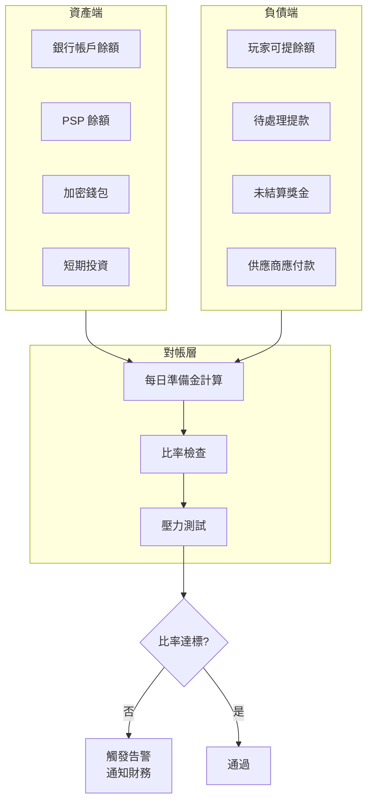
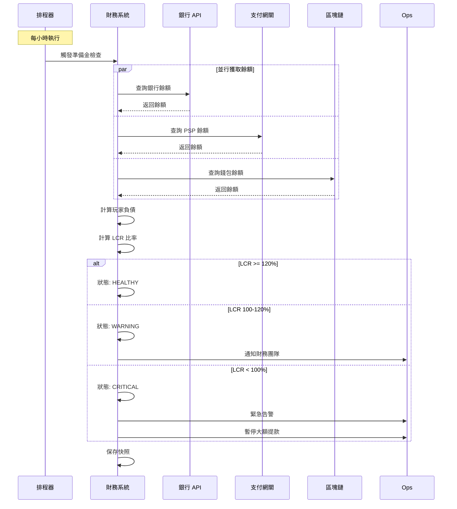

# 02-16 Liquidity Reserve Reconciliation (流動性準備金對帳)

**版本**: 1.0.0
**創建日期**: 2026-02-07
**狀態**: ✅ 規範完成
**優先級**: P0 Critical

---

## 概述

流動性準備金對帳確保平台維持足夠的資金以支付玩家提款和獎金派發，滿足 UKGC 和 MGA 的償付能力要求。

### 監管背景

| 規範 | 司法區 | 關鍵要求 |
|------|--------|---------|
| **UKGC LCCP 4.3.1** | UK | 客戶資金分離，準備金披露 |
| **MGA Rule 44** | Malta | 玩家資金保護，最低準備金 |
| **Gibraltar LRO** | Gibraltar | 流動性比率要求 |
| **Isle of Man GSC** | IOM | 償付能力證明 |

---

## 準備金架構

### 資金分類

```yaml
Fund Categories:
  Tier 1 - Immediate Liquidity:
    Description: 即時可用現金
    Components:
      - Bank current accounts
      - Payment processor balances
      - Crypto hot wallets
    Target: >= 100% of daily average withdrawals

  Tier 2 - Short-term Reserve:
    Description: 短期流動資產
    Components:
      - Money market funds
      - Short-term deposits (< 30 days)
    Target: >= 50% of monthly average withdrawals

  Tier 3 - Contingency Fund:
    Description: 應急準備金
    Components:
      - Fixed deposits (30-90 days)
      - Bank credit lines (committed)
    Target: >= 25% of player funds
```

### 準備金比率計算

```
Liquidity Coverage Ratio (LCR) = High-Quality Liquid Assets / Net Cash Outflows × 100%

Where:
- HQLA = Tier 1 + Tier 2 assets
- Net Cash Outflows = Expected withdrawals - Expected deposits (30-day horizon)

Target: LCR >= 120%
```

---

## 對帳架構



### 對帳頻率

| 對帳類型 | 頻率 | 觸發條件 |
|---------|------|---------|
| **即時檢查** | 每筆大額提款 | 提款 > EUR 10,000 |
| **定時檢查** | 每小時 | 系統排程 |
| **日終對帳** | 每日 23:59 | 生成日報 |
| **監管報告** | 每月/每季 | 監管申報 |

---

## 數據庫設計

```sql
-- 流動性準備金記錄
CREATE TABLE t_liquidity_reserve (
    id                      BIGINT PRIMARY KEY AUTO_INCREMENT,
    snapshot_time           DATETIME NOT NULL,
    snapshot_type           VARCHAR(20) NOT NULL,  -- HOURLY, DAILY, MONTHLY

    -- Tier 1: 即時流動性
    tier1_bank_balance      DECIMAL(18,2) NOT NULL,
    tier1_psp_balance       DECIMAL(18,2) NOT NULL,
    tier1_crypto_balance    DECIMAL(18,2) NOT NULL,
    tier1_total             DECIMAL(18,2) AS (tier1_bank_balance + tier1_psp_balance + tier1_crypto_balance) STORED,

    -- Tier 2: 短期準備
    tier2_money_market      DECIMAL(18,2) DEFAULT 0,
    tier2_short_deposits    DECIMAL(18,2) DEFAULT 0,
    tier2_total             DECIMAL(18,2) AS (tier2_money_market + tier2_short_deposits) STORED,

    -- Tier 3: 應急資金
    tier3_fixed_deposits    DECIMAL(18,2) DEFAULT 0,
    tier3_credit_lines      DECIMAL(18,2) DEFAULT 0,
    tier3_total             DECIMAL(18,2) AS (tier3_fixed_deposits + tier3_credit_lines) STORED,

    -- 總資產
    total_hqla              DECIMAL(18,2) AS (tier1_total + tier2_total) STORED,
    total_reserves          DECIMAL(18,2) AS (tier1_total + tier2_total + tier3_total) STORED,

    -- 負債端
    player_withdrawable     DECIMAL(18,2) NOT NULL,  -- 玩家可提餘額
    pending_withdrawals     DECIMAL(18,2) NOT NULL,  -- 待處理提款
    unsettled_bonuses       DECIMAL(18,2) NOT NULL,  -- 未結算獎金
    supplier_payables       DECIMAL(18,2) NOT NULL,  -- 供應商應付

    total_liabilities       DECIMAL(18,2) AS (player_withdrawable + pending_withdrawals + unsettled_bonuses) STORED,

    -- 比率計算
    lcr_ratio               DECIMAL(8,4) AS (total_hqla / NULLIF(total_liabilities * 0.3, 0) * 100) STORED,
    reserve_ratio           DECIMAL(8,4) AS (total_reserves / NULLIF(player_withdrawable, 0) * 100) STORED,

    -- 狀態
    status                  VARCHAR(20) NOT NULL,  -- HEALTHY, WARNING, CRITICAL
    checked_by              VARCHAR(50),
    notes                   TEXT,

    -- 審計
    created_at              DATETIME DEFAULT CURRENT_TIMESTAMP,

    INDEX idx_snapshot (snapshot_time, snapshot_type),
    INDEX idx_status (status, snapshot_time)
) ENGINE=InnoDB COMMENT='流動性準備金快照';

-- 準備金來源明細
CREATE TABLE t_reserve_source_detail (
    id                  BIGINT PRIMARY KEY AUTO_INCREMENT,
    reserve_id          BIGINT NOT NULL,

    source_type         VARCHAR(30) NOT NULL,   -- BANK, PSP, CRYPTO, INVESTMENT
    source_name         VARCHAR(100) NOT NULL,  -- 帳戶/錢包名稱
    currency            VARCHAR(10) NOT NULL,
    original_amount     DECIMAL(18,4) NOT NULL,
    eur_amount          DECIMAL(18,2) NOT NULL,
    exchange_rate       DECIMAL(12,6),

    last_verified_at    DATETIME,
    verification_source VARCHAR(50),            -- API, STATEMENT, MANUAL

    created_at          DATETIME DEFAULT CURRENT_TIMESTAMP,

    INDEX idx_reserve (reserve_id),
    FOREIGN KEY (reserve_id) REFERENCES t_liquidity_reserve(id)
) ENGINE=InnoDB COMMENT='準備金來源明細';
```

---

## 對帳流程

### 每日準備金對帳



### 壓力測試場景

| 場景 | 假設 | LCR 目標 |
|------|------|---------|
| **正常營運** | 歷史平均提款量 | >= 120% |
| **高提款期** | 提款量 +50% (節假日) | >= 100% |
| **銀行延遲** | 主要銀行 T+2 延遲 | >= 100% |
| **PSP 故障** | 主 PSP 離線 48 小時 | >= 80% |
| **極端壓力** | 30% 玩家同時提款 | >= 50% |

---

## Java 實現

```java
/**
 * 流動性準備金服務
 */
@Service
@RequiredArgsConstructor
@Slf4j
public class LiquidityReserveService {

    private final BankApiClient bankClient;
    private final PspApiClient pspClient;
    private final CryptoWalletClient cryptoClient;
    private final PlayerWalletDao playerWalletDao;
    private final LiquidityReserveDao reserveDao;
    private final AlertService alertService;

    private static final BigDecimal LCR_HEALTHY = new BigDecimal("120");
    private static final BigDecimal LCR_WARNING = new BigDecimal("100");

    /**
     * 執行準備金對帳
     */
    @Transactional(rollbackFor = Throwable.class)
    public LiquidityReserveResult reconcile(String snapshotType) {
        log.info("Starting liquidity reserve reconciliation: {}", snapshotType);

        // 1. 並行獲取資產餘額
        CompletableFuture<BigDecimal> bankFuture = CompletableFuture.supplyAsync(
            () -> bankClient.getTotalBalance());
        CompletableFuture<BigDecimal> pspFuture = CompletableFuture.supplyAsync(
            () -> pspClient.getTotalBalance());
        CompletableFuture<BigDecimal> cryptoFuture = CompletableFuture.supplyAsync(
            () -> cryptoClient.getHotWalletBalance());

        CompletableFuture.allOf(bankFuture, pspFuture, cryptoFuture).join();

        // 2. 計算負債
        BigDecimal playerWithdrawable = playerWalletDao.getTotalWithdrawableBalance();
        BigDecimal pendingWithdrawals = playerWalletDao.getPendingWithdrawalsTotal();
        BigDecimal unsettledBonuses = playerWalletDao.getUnsettledBonusesTotal();

        // 3. 構建快照
        LiquidityReserve reserve = LiquidityReserve.builder()
            .snapshotTime(LocalDateTime.now())
            .snapshotType(snapshotType)
            .tier1BankBalance(bankFuture.join())
            .tier1PspBalance(pspFuture.join())
            .tier1CryptoBalance(cryptoFuture.join())
            .playerWithdrawable(playerWithdrawable)
            .pendingWithdrawals(pendingWithdrawals)
            .unsettledBonuses(unsettledBonuses)
            .build();

        // 4. 計算 LCR
        BigDecimal lcr = calculateLcr(reserve);
        reserve.setLcrRatio(lcr);

        // 5. 判定狀態
        String status = determineStatus(lcr);
        reserve.setStatus(status);

        // 6. 保存
        reserveDao.insert(reserve);

        // 7. 告警處理
        if ("CRITICAL".equals(status)) {
            alertService.sendCriticalLiquidityAlert(reserve);
            triggerEmergencyProcedures();
        } else if ("WARNING".equals(status)) {
            alertService.sendLiquidityWarning(reserve);
        }

        return LiquidityReserveResult.of(reserve);
    }

    /**
     * 計算流動性覆蓋率
     */
    private BigDecimal calculateLcr(LiquidityReserve reserve) {
        BigDecimal hqla = reserve.getTier1Total().add(reserve.getTier2Total());
        BigDecimal netOutflows = reserve.getTotalLiabilities()
            .multiply(new BigDecimal("0.30")); // 30 天壓力假設

        if (netOutflows.compareTo(BigDecimal.ZERO) == 0) {
            return new BigDecimal("999.99"); // 無負債
        }

        return hqla.divide(netOutflows, 4, RoundingMode.HALF_UP)
            .multiply(new BigDecimal("100"));
    }

    /**
     * 判定狀態
     */
    private String determineStatus(BigDecimal lcr) {
        if (lcr.compareTo(LCR_HEALTHY) >= 0) {
            return "HEALTHY";
        } else if (lcr.compareTo(LCR_WARNING) >= 0) {
            return "WARNING";
        } else {
            return "CRITICAL";
        }
    }

    /**
     * 觸發緊急程序
     */
    private void triggerEmergencyProcedures() {
        log.warn("Triggering emergency liquidity procedures");
        // 1. 暫停大額提款 (> EUR 5,000)
        // 2. 通知管理層
        // 3. 啟動備用資金來源
    }
}
```

---

## 監控指標

```yaml
metrics:
  # LCR 比率
  - name: liquidity_coverage_ratio
    type: gauge
    description: 流動性覆蓋率
    unit: percent
    target: ">= 120%"
    alert:
      - condition: value < 100
        severity: critical
        message: "流動性覆蓋率不足，存在償付風險"
      - condition: value < 120
        severity: warning
        message: "流動性覆蓋率低於健康水平"

  # 準備金比率
  - name: reserve_to_player_funds_ratio
    type: gauge
    description: 準備金佔玩家資金比率
    unit: percent
    target: ">= 110%"

  # Tier 1 資產
  - name: tier1_liquid_assets
    type: gauge
    description: Tier 1 即時流動資產
    unit: EUR
    labels: [source_type]

  # 待處理提款
  - name: pending_withdrawals_total
    type: gauge
    description: 待處理提款總額
    unit: EUR
    alert:
      - condition: value > tier1_liquid_assets * 0.5
        severity: warning
        message: "待處理提款佔比過高"

  # 對帳頻率
  - name: liquidity_reconciliation_runs
    type: counter
    description: 準備金對帳執行次數
    labels: [snapshot_type, status]
```

---

## 監管報告格式

### UKGC 季度報告

```sql
-- UKGC 準備金披露報告
SELECT
    DATE_FORMAT(snapshot_time, '%Y-%m') AS reporting_month,

    -- 資產分類
    AVG(tier1_total) AS avg_immediate_liquidity,
    AVG(tier2_total) AS avg_short_term_reserves,
    AVG(tier3_total) AS avg_contingency_fund,
    AVG(total_reserves) AS avg_total_reserves,

    -- 負債
    AVG(player_withdrawable) AS avg_player_funds,
    AVG(pending_withdrawals) AS avg_pending_withdrawals,

    -- 比率
    AVG(lcr_ratio) AS avg_lcr_ratio,
    MIN(lcr_ratio) AS min_lcr_ratio,

    -- 狀態分佈
    SUM(CASE WHEN status = 'CRITICAL' THEN 1 ELSE 0 END) AS critical_count,
    SUM(CASE WHEN status = 'WARNING' THEN 1 ELSE 0 END) AS warning_count

FROM t_liquidity_reserve
WHERE snapshot_type = 'DAILY'
  AND snapshot_time >= DATE_SUB(CURDATE(), INTERVAL 3 MONTH)
GROUP BY DATE_FORMAT(snapshot_time, '%Y-%m')
ORDER BY reporting_month;
```

---

## 相關文檔

- [02-08_Player_Funds_Segregation.md](02-08_Player_Funds_Segregation.md) - 玩家資金分離
- [02-03_Reconciliation_System.md](02-03_Reconciliation_System.md) - 核心對帳系統
- [06-08_UKGC_Compliance.md](../06_Platform_Governance/06-08_UKGC_Compliance.md) - UKGC 合規
- [06-09_MGA_Compliance.md](../06_Platform_Governance/06-09_MGA_Compliance.md) - MGA 合規

---

## 版本歷史

| 版本 | 日期 | 變更內容 |
|------|------|---------|
| 1.0.0 | 2026-02-07 | 初始版本：準備金架構、對帳流程、監控指標、監管報告 |

---

**返回**: [財務中心](README.md) | [iGaming 首頁](../README.md)
