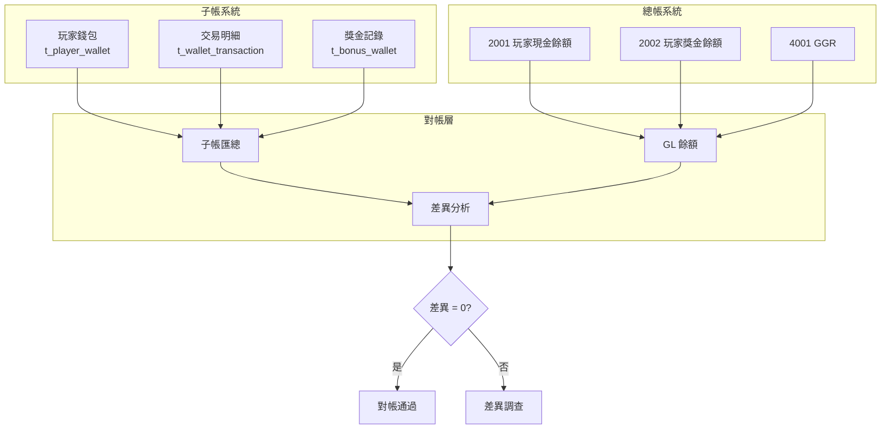
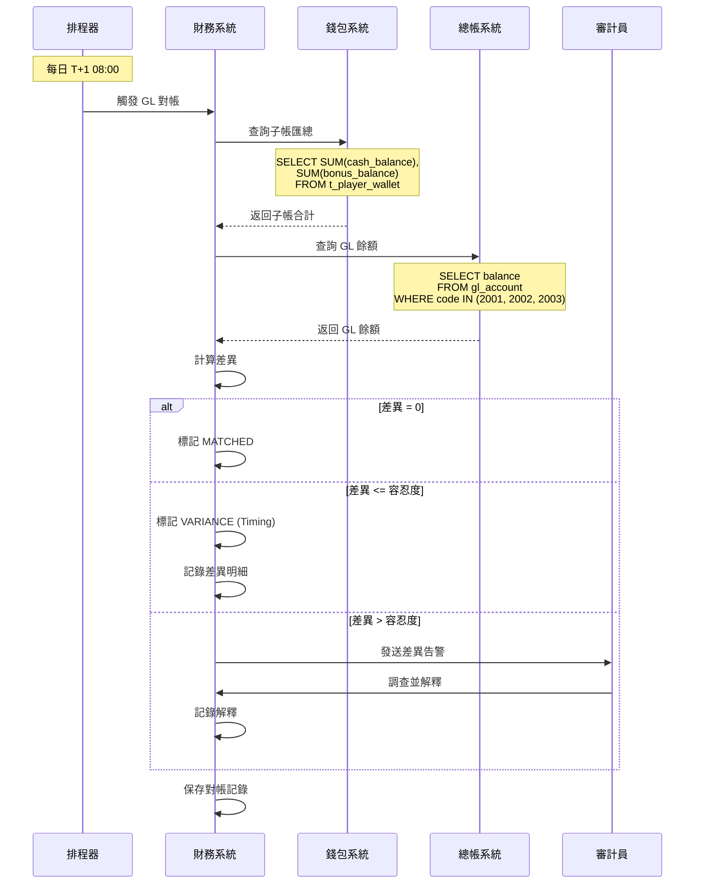

# 02-17 Player Balance GL Reconciliation (玩家餘額總帳對帳)

**版本**: 1.0.0
**創建日期**: 2026-02-07
**狀態**: ✅ 規範完成
**優先級**: P0 Critical

---

## 概述

玩家餘額總帳對帳確保平台的玩家錢包子帳與財務總帳 (General Ledger) 保持一致，滿足 IFRS 15 營收認列和外部審計要求。

### 監管背景

| 規範 | 適用範圍 | 關鍵要求 |
|------|---------|---------|
| **IFRS 15** | 上市公司 | 營收認列時點，合約負債 |
| **SOX 404** | 美國上市 | 內部控制審計 |
| **UKGC 財務** | UK 牌照 | 年度審計報告 |
| **MGA 財務** | Malta 牌照 | 季度財務報告 |

---

## 對帳架構

### 帳務結構

```yaml
Account Structure:
  Assets:
    - 1000 Cash and Bank
      - 1001 Operating Bank Account
      - 1002 Trust Account (Player Funds)
      - 1003 PSP Settlement Account
      - 1004 Crypto Custody

  Liabilities:
    - 2000 Player Funds Liability
      - 2001 Player Cash Balance
      - 2002 Player Bonus Balance (Unreleased)
      - 2003 Pending Withdrawals
      - 2004 Unclaimed Winnings

  Revenue:
    - 4000 Gaming Revenue
      - 4001 GGR (Gross Gaming Revenue)
      - 4002 Bonus Costs (Contra)
      - 4003 Jackpot Contributions
```

### 對帳關係



---

## 數據庫設計

```sql
-- 總帳對帳記錄
CREATE TABLE t_gl_reconciliation (
    id                      BIGINT PRIMARY KEY AUTO_INCREMENT,

    -- 對帳週期
    reconciliation_date     DATE NOT NULL,
    reconciliation_type     VARCHAR(20) NOT NULL,  -- DAILY, MONTHLY, QUARTERLY

    -- 子帳匯總
    subledger_cash_balance      DECIMAL(18,2) NOT NULL,
    subledger_bonus_balance     DECIMAL(18,2) NOT NULL,
    subledger_pending_wd        DECIMAL(18,2) NOT NULL,
    subledger_total             DECIMAL(18,2) AS (subledger_cash_balance + subledger_bonus_balance + subledger_pending_wd) STORED,

    -- GL 餘額
    gl_2001_player_cash         DECIMAL(18,2) NOT NULL,
    gl_2002_player_bonus        DECIMAL(18,2) NOT NULL,
    gl_2003_pending_wd          DECIMAL(18,2) NOT NULL,
    gl_total                    DECIMAL(18,2) AS (gl_2001_player_cash + gl_2002_player_bonus + gl_2003_pending_wd) STORED,

    -- 差異
    cash_variance               DECIMAL(18,2) AS (subledger_cash_balance - gl_2001_player_cash) STORED,
    bonus_variance              DECIMAL(18,2) AS (subledger_bonus_balance - gl_2002_player_bonus) STORED,
    total_variance              DECIMAL(18,2) AS (subledger_total - gl_total) STORED,

    -- GGR 對帳
    subledger_ggr               DECIMAL(18,2),
    gl_4001_ggr                 DECIMAL(18,2),
    ggr_variance                DECIMAL(18,2) AS (subledger_ggr - gl_4001_ggr) STORED,

    -- 狀態
    reconciliation_status       VARCHAR(20) NOT NULL,  -- MATCHED, VARIANCE, PENDING
    variance_explained          BOOLEAN DEFAULT FALSE,
    explanation                 TEXT,

    -- 審核
    prepared_by                 BIGINT,
    reviewed_by                 BIGINT,
    reviewed_at                 DATETIME,

    -- 審計
    created_at                  DATETIME DEFAULT CURRENT_TIMESTAMP,
    updated_at                  DATETIME DEFAULT CURRENT_TIMESTAMP ON UPDATE CURRENT_TIMESTAMP,

    UNIQUE KEY uk_date_type (reconciliation_date, reconciliation_type),
    INDEX idx_status (reconciliation_status, reconciliation_date)
) ENGINE=InnoDB COMMENT='總帳對帳記錄';

-- GL 差異明細
CREATE TABLE t_gl_variance_detail (
    id                  BIGINT PRIMARY KEY AUTO_INCREMENT,
    reconciliation_id   BIGINT NOT NULL,

    variance_type       VARCHAR(30) NOT NULL,   -- TIMING, DATA_ERROR, ADJUSTMENT, OTHER
    account_code        VARCHAR(20) NOT NULL,
    description         TEXT NOT NULL,
    amount              DECIMAL(18,2) NOT NULL,

    -- 來源追溯
    source_transaction_id   BIGINT,
    source_table            VARCHAR(50),

    -- 解決方案
    resolution_status   VARCHAR(20) NOT NULL,   -- OPEN, RESOLVED, WAIVED
    resolution_action   TEXT,
    resolved_by         BIGINT,
    resolved_at         DATETIME,

    created_at          DATETIME DEFAULT CURRENT_TIMESTAMP,

    INDEX idx_reconciliation (reconciliation_id),
    FOREIGN KEY (reconciliation_id) REFERENCES t_gl_reconciliation(id)
) ENGINE=InnoDB COMMENT='GL 差異明細';
```

---

## 對帳流程

### 每日 GL 對帳



### 差異類型

| 差異類型 | 說明 | 處理方式 | 容忍度 |
|---------|------|---------|--------|
| **時間差異** | 跨日交易入帳時點不同 | 下一週期自動沖銷 | EUR 10,000 |
| **數據錯誤** | 子帳或 GL 數據錄入錯誤 | 更正並記錄 | EUR 0 |
| **調整差異** | 系統調整尚未過帳 | 追蹤調整進度 | EUR 1,000 |
| **四捨五入** | 匯率換算捨入差異 | 自動容忍 | EUR 100 |

---

## Java 實現

```java
/**
 * GL 對帳服務
 */
@Service
@RequiredArgsConstructor
@Slf4j
public class GlReconciliationService {

    private final PlayerWalletDao playerWalletDao;
    private final GeneralLedgerDao glDao;
    private final GlReconciliationDao reconciliationDao;
    private final GlVarianceDetailDao varianceDetailDao;
    private final AlertService alertService;

    private static final BigDecimal TOLERANCE = new BigDecimal("100"); // EUR 100

    /**
     * 執行每日 GL 對帳
     */
    @Transactional(rollbackFor = Throwable.class)
    public GlReconciliationResult executeDailyReconciliation(LocalDate date) {
        log.info("Starting GL reconciliation for date: {}", date);

        // 1. 查詢子帳匯總
        SubledgerSummary subledger = getSubledgerSummary(date);

        // 2. 查詢 GL 餘額
        GlBalances gl = getGlBalances(date);

        // 3. 計算差異
        GlReconciliation recon = GlReconciliation.builder()
            .reconciliationDate(date)
            .reconciliationType("DAILY")
            .subledgerCashBalance(subledger.getCashBalance())
            .subledgerBonusBalance(subledger.getBonusBalance())
            .subledgerPendingWd(subledger.getPendingWithdrawals())
            .gl2001PlayerCash(gl.getAccount2001())
            .gl2002PlayerBonus(gl.getAccount2002())
            .gl2003PendingWd(gl.getAccount2003())
            .build();

        // 4. 判定狀態
        BigDecimal totalVariance = recon.getTotalVariance().abs();
        if (totalVariance.compareTo(BigDecimal.ZERO) == 0) {
            recon.setReconciliationStatus("MATCHED");
        } else if (totalVariance.compareTo(TOLERANCE) <= 0) {
            recon.setReconciliationStatus("VARIANCE");
            recon.setExplanation("Within tolerance - likely timing difference");
            recon.setVarianceExplained(true);
        } else {
            recon.setReconciliationStatus("PENDING");
            alertService.sendGlVarianceAlert(recon);
        }

        // 5. 保存
        reconciliationDao.insert(recon);

        // 6. 如果有差異，分析明細
        if (!"MATCHED".equals(recon.getReconciliationStatus())) {
            analyzeVariance(recon);
        }

        return GlReconciliationResult.of(recon);
    }

    /**
     * 查詢子帳匯總
     */
    private SubledgerSummary getSubledgerSummary(LocalDate date) {
        // 截止到 date 23:59:59 的餘額
        LocalDateTime cutoff = date.atTime(23, 59, 59);

        BigDecimal cashBalance = playerWalletDao.getTotalCashBalance(cutoff);
        BigDecimal bonusBalance = playerWalletDao.getTotalBonusBalance(cutoff);
        BigDecimal pendingWd = playerWalletDao.getPendingWithdrawals(cutoff);

        return SubledgerSummary.builder()
            .cashBalance(cashBalance)
            .bonusBalance(bonusBalance)
            .pendingWithdrawals(pendingWd)
            .build();
    }

    /**
     * 查詢 GL 餘額
     */
    private GlBalances getGlBalances(LocalDate date) {
        return glDao.getAccountBalances(
            Arrays.asList("2001", "2002", "2003"),
            date
        );
    }

    /**
     * 分析差異來源
     */
    private void analyzeVariance(GlReconciliation recon) {
        List<GlVarianceDetail> details = new ArrayList<>();

        // 檢查跨日交易
        List<WalletTransaction> crossDayTxns = playerWalletDao
            .findCrossDayTransactions(recon.getReconciliationDate());

        for (WalletTransaction txn : crossDayTxns) {
            GlVarianceDetail detail = GlVarianceDetail.builder()
                .reconciliationId(recon.getId())
                .varianceType("TIMING")
                .accountCode(mapToGlAccount(txn.getTransactionType()))
                .description("Cross-day transaction: " + txn.getId())
                .amount(txn.getAmount())
                .sourceTransactionId(txn.getId())
                .sourceTable("t_wallet_transaction")
                .resolutionStatus("OPEN")
                .build();
            details.add(detail);
        }

        if (!details.isEmpty()) {
            varianceDetailDao.batchInsert(details);
        }
    }

    /**
     * 映射到 GL 帳戶
     */
    private String mapToGlAccount(String transactionType) {
        return switch (transactionType) {
            case "DEPOSIT", "WITHDRAWAL", "BET", "WIN" -> "2001";
            case "BONUS_CREDIT", "BONUS_DEBIT" -> "2002";
            case "WITHDRAWAL_REQUEST" -> "2003";
            default -> "2001";
        };
    }
}
```

---

## 監控指標

```yaml
metrics:
  # 對帳完成率
  - name: gl_reconciliation_completion_rate
    type: gauge
    description: GL 對帳完成率 (按計畫執行)
    target: "100%"

  # 差異金額
  - name: gl_variance_amount
    type: gauge
    description: GL 對帳差異金額
    unit: EUR
    labels: [variance_type, account_code]
    alert:
      - condition: abs(value) > 10000
        severity: critical
        message: "GL 差異金額超過 EUR 10,000"

  # 未解決差異數量
  - name: gl_unresolved_variances
    type: gauge
    description: 未解決的 GL 差異數量
    alert:
      - condition: value > 5
        severity: warning
        message: "存在多個未解決的 GL 差異"

  # 對帳狀態分佈
  - name: gl_reconciliation_status
    type: counter
    description: GL 對帳狀態分佈
    labels: [status, reconciliation_type]

  # 差異解決時間
  - name: gl_variance_resolution_time_hours
    type: histogram
    description: GL 差異解決時間
    unit: hours
    buckets: [4, 8, 24, 48, 72, 168]
    target: "P95 < 48 hours"
```

---

## 審計報告

### 月度 GL 對帳摘要

```sql
-- 月度 GL 對帳摘要報告
SELECT
    DATE_FORMAT(reconciliation_date, '%Y-%m') AS month,

    -- 對帳次數
    COUNT(*) AS total_reconciliations,
    SUM(CASE WHEN reconciliation_status = 'MATCHED' THEN 1 ELSE 0 END) AS matched_count,
    SUM(CASE WHEN reconciliation_status = 'VARIANCE' THEN 1 ELSE 0 END) AS variance_count,
    SUM(CASE WHEN reconciliation_status = 'PENDING' THEN 1 ELSE 0 END) AS pending_count,

    -- 匹配率
    ROUND(SUM(CASE WHEN reconciliation_status = 'MATCHED' THEN 1 ELSE 0 END) * 100.0 / COUNT(*), 2) AS match_rate_pct,

    -- 差異統計
    SUM(ABS(total_variance)) AS total_variance_amount,
    MAX(ABS(total_variance)) AS max_variance,
    AVG(ABS(total_variance)) AS avg_variance,

    -- 期末餘額
    (SELECT subledger_total
     FROM t_gl_reconciliation
     WHERE DATE_FORMAT(reconciliation_date, '%Y-%m') = DATE_FORMAT(r.reconciliation_date, '%Y-%m')
     ORDER BY reconciliation_date DESC LIMIT 1) AS ending_subledger_balance,

    (SELECT gl_total
     FROM t_gl_reconciliation
     WHERE DATE_FORMAT(reconciliation_date, '%Y-%m') = DATE_FORMAT(r.reconciliation_date, '%Y-%m')
     ORDER BY reconciliation_date DESC LIMIT 1) AS ending_gl_balance

FROM t_gl_reconciliation r
WHERE reconciliation_type = 'DAILY'
  AND reconciliation_date >= DATE_SUB(CURDATE(), INTERVAL 12 MONTH)
GROUP BY DATE_FORMAT(reconciliation_date, '%Y-%m')
ORDER BY month DESC;
```

### IFRS 15 營收認列對帳

```sql
-- IFRS 15 合約負債對帳
SELECT
    DATE(created_at) AS report_date,

    -- 合約負債 (玩家餘額)
    SUM(cash_balance + bonus_balance) AS contract_liability,

    -- 當日履約 (GGR)
    (SELECT SUM(bet_amount - payout_amount)
     FROM t_game_transaction
     WHERE DATE(created_at) = DATE(pw.created_at)
       AND status = 'SETTLED') AS performance_obligation_satisfied,

    -- 新增合約負債 (存款)
    (SELECT SUM(amount)
     FROM t_wallet_transaction
     WHERE transaction_type = 'DEPOSIT'
       AND DATE(created_at) = DATE(pw.created_at)) AS new_deposits,

    -- 減少合約負債 (提款)
    (SELECT SUM(amount)
     FROM t_wallet_transaction
     WHERE transaction_type = 'WITHDRAWAL'
       AND DATE(created_at) = DATE(pw.created_at)) AS withdrawals

FROM t_player_wallet pw
WHERE created_at >= DATE_SUB(CURDATE(), INTERVAL 30 DAY)
GROUP BY DATE(created_at)
ORDER BY report_date DESC;
```

---

## 相關文檔

- [02-03_Reconciliation_System.md](02-03_Reconciliation_System.md) - 核心對帳系統
- [02-08_Player_Funds_Segregation.md](02-08_Player_Funds_Segregation.md) - 玩家資金分離
- [02-16_Liquidity_Reserve_Reconciliation.md](02-16_Liquidity_Reserve_Reconciliation.md) - 流動性準備金
- [06-08_UKGC_Compliance.md](../06_Platform_Governance/06-08_UKGC_Compliance.md) - UKGC 合規

---

## 版本歷史

| 版本 | 日期 | 變更內容 |
|------|------|---------|
| 1.0.0 | 2026-02-07 | 初始版本：GL 對帳架構、差異分析、IFRS 15 營收對帳 |

---

**返回**: [財務中心](README.md) | [iGaming 首頁](../README.md)
