# 無縫錢包財務對帳與流水管理

本文檔整合了對帳模型、投注要求追蹤和促銷錢包轉帳，提供完整的財務管理方案。

---

## Part 1: 對帳模型


## 問題來源
文檔第 5.2 節第 315-323 行將「遊戲交易對帳」和「存提款對帳」混為一談。

**原文**:
> 三方對帳模型：
> - 方 1：營運商帳本
> - 方 2：供應商報表
> - 方 3：支付網關/銀行（針對存提款的實際資金流動）

## 核心問題

### 概念混淆
將兩個**完全不同**的業務場景混在一起：

| 對比項 | 遊戲交易對帳 | 存提款對帳 |
|-------|------------|----------|
| **涉及方數量** | 2 方 | 3 方 |
| **對帳對象** | 營運商 ←→ GP | 營運商 ←→ 支付網關 ←→ 銀行 |
| **資金性質** | 虛擬貨幣 | 真實貨幣（法幣） |
| **對帳頻率** | 實時/每小時 | 每日/每週 |
| **匹配欄位** | transaction_id | 金額 + 時間 |
| **差異原因** | API 超時、掉單 | 銀行延遲、手續費 |

## 正確的對帳模型

### 模型 1: 遊戲交易對帳（雙方對帳）

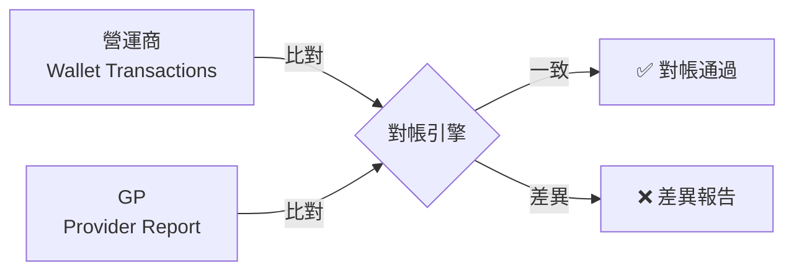


### 模型 2: 存提款對帳（三方對帳）

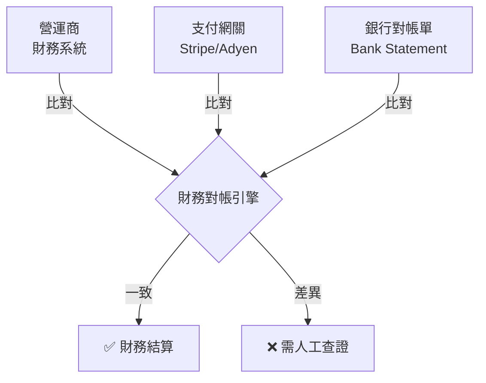


## 正確的文檔結構

文檔應該分成兩節：

### 5.2.1 遊戲交易對帳（雙方對帳）
- 涉及: 營運商 + GP
- 資金: 虛擬貨幣（遊戲積分）
- 頻率: 實時/每小時
- 方法: transaction_id 匹配

### 5.2.2 存提款對帳（三方對帳）
- 涉及: 營運商 + 支付網關 + 銀行
- 資金: 真實貨幣（法幣）
- 頻率: 每日/每週
- 方法: 金額 + 時間匹配

## 決策總結

✅ **正確理解**:
- 遊戲交易 = 雙方對帳（不涉及銀行）
- 存提款 = 三方對帳（涉及銀行）
- 兩者是獨立的對帳流程

❌ **錯誤理解**:
- 將支付網關/銀行納入遊戲交易對帳
- 混淆虛擬貨幣和真實貨幣的對帳邏輯

---

## 📚 相關文檔

### 上層導航
- [Seamless Wallet 索引](../README.md) - 專題導航（P0/P1 分類）

### 架構文檔
- [02-06 統一錢包模型](../../02-06_Wallet_Architecture.md) - 錢包整體架構
- [03-03 無縫錢包分析](../../../03_Game_Center/03-03_Seamless_Wallet_Analysis.md) - GP API 規範

---

## 5. GP 報表對接規範

> **業界依據**: GLI-19/GLI-20 (遊戲交易驗證), PCI DSS 10.5 (審計日誌防篡改)
> **適用範圍**: 所有與 GP (Game Provider) 的報表對接

### 5.1 報表類型

| 報表類型 | 頻率 | 獲取方式 | 內容 | 用途 |
|---------|------|---------|------|------|
| **Transaction Report** | 每小時 | API Pull | 所有交易明細 | 實時對帳 |
| **Settlement Report** | 每日 T+1 02:00 | SFTP/API | 結算金額匯總 | 財務結算 |
| **Jackpot Report** | 即時 | Webhook | 大獎通知 | 即時驗證 |
| **Void Report** | 每日 | API | 取消/作廢記錄 | 差異調查 |
| **Game Statistics** | 每日 | API | RTP、遊戲統計 | 風控分析 |

### 5.2 Transaction Report API 規範

**Request**:
```http
GET /api/v1/transactions?from={ISO8601}&to={ISO8601}&cursor={string}&limit=1000
Authorization: Bearer {token}
X-Operator-ID: {operatorId}
X-Request-ID: {uuid}
```

**Response**:
```json
{
  "transactions": [
    {
      "transaction_id": "TXN_GP_123456",
      "operator_transaction_id": "TXN_OP_789",
      "player_id": "PLY_GP_001",
      "operator_player_id": "PLY_OP_001",
      "game_id": "SLOT_001",
      "game_name": "Fortune Tiger",
      "round_id": "RND_001",
      "type": "BET",
      "amount": 100.00,
      "currency": "USD",
      "balance_before": 500.00,
      "balance_after": 400.00,
      "timestamp": "2026-02-07T10:30:00Z",
      "signature": "HMAC-SHA256-SIGNATURE..."
    }
  ],
  "pagination": {
    "total_count": 15000,
    "returned_count": 1000,
    "next_cursor": "cursor_abc123",
    "has_more": true
  },
  "report_metadata": {
    "generated_at": "2026-02-07T11:00:00Z",
    "report_version": "1.2.0"
  }
}
```

### 5.3 簽名驗證機制

**HMAC-SHA256 驗證邏輯**:

```java
/**
 * GP 報表簽名驗證服務
 * 位置: smartadmin-modules/smartadmin-business/reconciliation/
 */
@Service
@RequiredArgsConstructor
public class GpReportVerificationService {

    private final GpConfigDao gpConfigDao;

    /**
     * 驗證 GP 交易報表簽名
     * @param gpCode GP 代碼
     * @param transaction 交易記錄
     * @return 驗證結果
     */
    public boolean verifyTransactionSignature(String gpCode, GpTransactionDto transaction) {
        GpConfig config = gpConfigDao.getByCode(gpCode);
        if (config == null) {
            throw new BusinessException("未知的 GP: " + gpCode);
        }

        // 1. 構建簽名 payload (依 GP 規範)
        String payload = buildSignaturePayload(transaction);

        // 2. 計算預期簽名
        String expectedSig = HmacUtil.sha256(payload, config.getSecretKey());

        // 3. 安全比對 (防時序攻擊)
        return MessageDigest.isEqual(
            expectedSig.getBytes(StandardCharsets.UTF_8),
            transaction.getSignature().getBytes(StandardCharsets.UTF_8)
        );
    }

    private String buildSignaturePayload(GpTransactionDto tx) {
        // 標準 payload 格式: txId|playerId|amount|timestamp
        return String.join("|",
            tx.getTransactionId(),
            tx.getPlayerId(),
            tx.getAmount().toPlainString(),
            tx.getTimestamp().toString()
        );
    }

    /**
     * 驗證報表時間戳 (防重放攻擊)
     */
    public boolean verifyTimestamp(GpTransactionDto transaction) {
        LocalDateTime txTime = transaction.getTimestamp();
        LocalDateTime now = LocalDateTime.now(ZoneOffset.UTC);

        // 報表時間戳不能超過 24 小時
        return Duration.between(txTime, now).toHours() <= 24;
    }
}
```

### 5.4 簽名驗證失敗處理

| 失敗類型 | 處理方式 | 告警等級 | 通知對象 |
|---------|---------|---------|---------|
| 簽名不符 | 拒絕該筆數據 | 🔴 P0 | Tech + GP 商務 |
| 時間戳過期 | 拒絕 + 記錄 | 🟠 P1 | Tech Team |
| 格式錯誤 | 解析失敗告警 | 🟡 P2 | Tech Team |
| API 超時 | 重試 3 次 | 🟠 P1 | DevOps |

### 5.5 GP 報表對帳流程

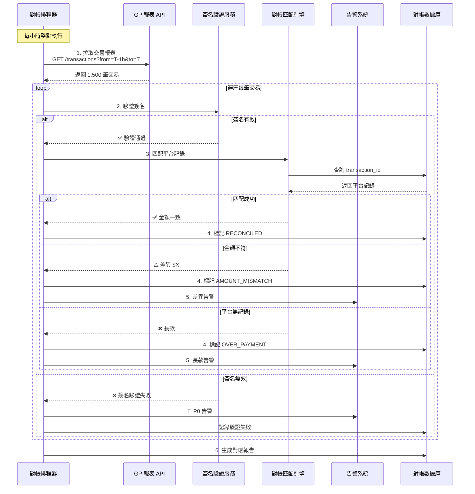

### 5.6 主流 GP 對接規範

| GP | API 版本 | 簽名算法 | 時區 | 報表延遲 |
|----|---------|---------|------|---------|
| **Pragmatic Play** | v2.3 | HMAC-SHA256 | UTC | < 15 min |
| **Evolution Gaming** | v3.0 | RSA-SHA512 | Europe/Riga | < 30 min |
| **PG Soft** | v1.8 | HMAC-SHA256 | Asia/Manila | < 20 min |
| **NetEnt** | v2.1 | HMAC-SHA256 | UTC | < 15 min |
| **Microgaming** | v4.0 | HMAC-SHA256 | Europe/London | < 30 min |

---

## 6. 分布式對帳一致性

> **技術背景**: CAP 定理下的權衡設計
> **適用場景**: 多終端同時投注、跨服務餘額同步

### 6.1 一致性模型選擇

| 場景 | 一致性要求 | 實現方式 | 延遲容忍 | 說明 |
|------|-----------|---------|---------|------|
| **單筆交易** | 強一致性 | TCC / Saga | < 1s | 不可失敗 |
| **餘額查詢** | 讀後寫一致 | Redis + DB 雙寫 | < 100ms | 玩家體驗 |
| **批次對帳** | 最終一致性 | 異步補償 | < 5min | 可延遲 |
| **統計報表** | 最終一致性 | 異步聚合 | < 1h | 財務報表 |

### 6.2 多終端同時投注衝突解決

**問題場景**:
```
時間軸:
T0: 玩家現金餘額 = 100 元
T1: 終端 A 發起投注 80 元 → 扣款成功 → 餘額 = 20
T2: 終端 B 同時發起投注 50 元 → 查詢餘額 = 100 (過時快取)
T3: 終端 B 嘗試扣款 → 應該失敗 (餘額不足)
```

**解決方案: 樂觀鎖 + 版本號**

```java
/**
 * 分布式餘額扣款 (樂觀鎖)
 */
@Transactional(rollbackFor = Throwable.class)
public ResponseDTO<DebitResult> debitWithOptimisticLock(DebitRequest request) {
    Long playerId = request.getPlayerId();
    BigDecimal amount = request.getAmount();

    // 1. 獲取當前餘額和版本號
    WalletBalance balance = walletDao.selectByPlayerIdForUpdate(playerId);

    // 2. 檢查餘額是否足夠
    if (balance.getCashBalance().compareTo(amount) < 0) {
        return ResponseDTO.error(ErrorCode.INSUFFICIENT_BALANCE);
    }

    // 3. 使用版本號更新 (樂觀鎖)
    int updated = walletDao.debitWithVersion(
        playerId,
        amount,
        balance.getVersion()
    );

    // 4. 如果更新失敗，說明並發衝突
    if (updated == 0) {
        throw new ConcurrentModificationException("餘額已被其他交易修改");
    }

    return ResponseDTO.ok(new DebitResult(balance.getCashBalance().subtract(amount)));
}
```

**SQL**:
```sql
-- 樂觀鎖扣款
UPDATE t_wallet
SET cash_balance = cash_balance - #{amount},
    version = version + 1,
    updated_at = NOW()
WHERE player_id = #{playerId}
  AND version = #{expectedVersion}
  AND cash_balance >= #{amount};
```

### 6.3 跨服務餘額同步

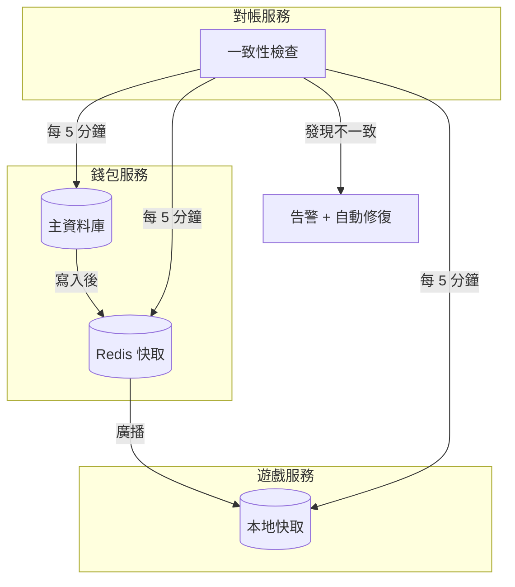

### 6.4 一致性監控指標

```yaml
metrics:
  - name: balance_consistency_violation_count
    type: counter
    description: 餘額不一致發現次數
    labels: [service, player_segment]
    alert:
      - condition: increase > 10 per 5min
        severity: critical
        message: "餘額一致性異常，需立即調查"

  - name: outbox_event_delivery_lag_p95
    type: histogram
    description: Outbox 事件投遞延遲 (P95)
    unit: milliseconds
    target: "< 100ms"

  - name: cross_service_balance_sync_error_rate
    type: gauge
    description: 跨服務餘額同步失敗率
    target: "< 0.01%"
```

---

## 7. 玩家補償機制

> **適用場景**: GP 報表缺失、對帳差異、系統故障導致的玩家損失
> **合規要求**: 消費者保護法規、UKGC Player Protection

### 7.1 補償場景分類

| 場景 | 原因 | 補償方式 | 審批要求 | SLA |
|------|------|---------|---------|-----|
| **GP 報表缺失** | GP 數據延遲 | 等待 48h 後自動補記 | 無需審批 | 48h |
| **金額不符 (平台少記)** | GP 計算正確 | 按 GP 報表補發差額 | 差異 > $100 需審批 | 24h |
| **金額不符 (平台多記)** | GP 計算正確 | 不扣玩家 (營運商承擔) | 記錄即可 | - |
| **流水遺失** | 系統故障 | 從 GP 報表回補 | 技術主管確認 | 4h |
| **規則調整追溯** | 規則變更影響 | 重算 + 補償差額 | 財務主管審批 | 72h |

### 7.2 補償審批流程

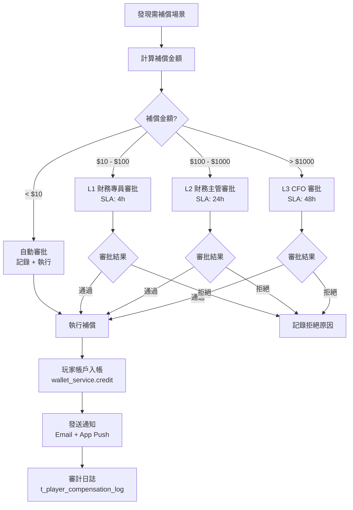

### 7.3 補償通知模板

**補償成功通知**:
```
尊敬的玩家 [Player Name]：

我們發現您於 [Date] 的遊戲記錄存在差異，現已完成更正。

【更正詳情】
- 原記錄金額：$XXX.XX
- 更正後金額：$YYY.YY
- 補償金額：$ZZZ.ZZ（已補入您的帳戶）
- 補償類型：[GP報表差異/系統故障/規則調整]

【當前餘額】
- 現金餘額：$AAA.AA
- 紅利餘額：$BBB.BB

如有疑問，請聯繫客服：[Support Email]

此致
[Platform Name] 團隊
```

### 7.4 補償審計追蹤

```sql
CREATE TABLE t_player_compensation_log (
    id BIGINT PRIMARY KEY AUTO_INCREMENT,
    player_id BIGINT NOT NULL,
    compensation_type ENUM('GP_REPORT_MISSING', 'AMOUNT_MISMATCH', 'SYSTEM_ERROR', 'RULE_ADJUSTMENT') NOT NULL,

    -- 補償金額
    amount DECIMAL(18,4) NOT NULL,
    currency VARCHAR(3) NOT NULL DEFAULT 'USD',

    -- 來源追蹤
    source_transaction_id VARCHAR(64) COMMENT '原始交易 ID',
    gp_code VARCHAR(50) COMMENT '相關 GP',
    reconciliation_id BIGINT COMMENT '對帳記錄 ID',

    -- 審批資訊
    approval_status ENUM('AUTO', 'PENDING', 'APPROVED', 'REJECTED') DEFAULT 'PENDING',
    approved_by BIGINT COMMENT '審批人',
    approved_at DATETIME COMMENT '審批時間',
    approval_level ENUM('L0_AUTO', 'L1_SPECIALIST', 'L2_MANAGER', 'L3_CFO') COMMENT '審批層級',

    -- 執行資訊
    execution_status ENUM('PENDING', 'EXECUTED', 'FAILED', 'ROLLED_BACK') DEFAULT 'PENDING',
    executed_at DATETIME,
    wallet_transaction_id VARCHAR(64) COMMENT '錢包交易 ID',

    -- 通知資訊
    notification_sent BOOLEAN DEFAULT FALSE,
    notification_sent_at DATETIME,

    -- 說明
    reason VARCHAR(500) NOT NULL COMMENT '補償原因',
    evidence_urls JSON COMMENT '佐證文件 URL',

    created_at DATETIME DEFAULT CURRENT_TIMESTAMP,
    updated_at DATETIME DEFAULT CURRENT_TIMESTAMP ON UPDATE CURRENT_TIMESTAMP,

    INDEX idx_player_id (player_id),
    INDEX idx_compensation_type (compensation_type),
    INDEX idx_created_at (created_at),
    INDEX idx_approval_status (approval_status)
) COMMENT '玩家補償審計日誌 (保留 7 年)';
```

### 7.5 補償 API

```http
POST /api/admin/compensation/create
Request:
{
  "playerId": 10001,
  "compensationType": "AMOUNT_MISMATCH",
  "amount": 50.00,
  "currency": "USD",
  "sourceTransactionId": "TXN_123456",
  "gpCode": "PRAGMATIC_PLAY",
  "reason": "GP 報表顯示中獎 $150，平台僅記錄 $100，補發差額 $50",
  "evidenceUrls": ["https://storage.example.com/evidence/gp_report_2026_02_07.pdf"]
}

Response:
{
  "code": 0,
  "data": {
    "compensationId": 12345,
    "status": "PENDING",
    "approvalLevel": "L2_MANAGER",
    "approver": "Finance Manager",
    "estimatedCompletionTime": "2026-02-08T10:00:00Z"
  }
}
```

### 7.6 補償監控指標

```yaml
metrics:
  - name: compensation_total_amount
    type: counter
    description: 補償總金額
    labels: [compensation_type, approval_level]
    alert:
      - condition: daily_total > expected_budget * 1.5
        severity: warning
        message: "補償金額超出預算，需檢查系統問題"

  - name: compensation_approval_latency_p95
    type: histogram
    description: 補償審批延遲 (P95)
    unit: hours
    target: "L1 < 4h, L2 < 24h, L3 < 48h"

  - name: compensation_rejection_rate
    type: gauge
    description: 補償申請拒絕率
    target: "< 10%"
```

---

## Part 2: 投注要求追蹤


---

## Part 3: 促銷錢包轉帳

> **決策確認 (2026-02-07)**: 採用**業界標準**做法 - 僅在流水要求達標時允許全額轉移，不支持部分轉移。

### 3.1 業界標準規範

根據主流 GP 和運營商實踐，促銷錢包轉帳遵循以下規則：

| 運營商 | 轉移規則 | 部分轉移 | 參考 |
|--------|---------|---------|------|
| **Pragmatic Play** | 僅達標時全額轉移 | ❌ 不支持 | Integration Guide v3.2 |
| **Evolution Gaming** | 同上 | ❌ 不支持 | Wallet API Spec |
| **Betfair** | 同上 | ❌ 不支持 | Bonus T&C |
| **Pinnacle** | 同上 | ❌ 不支持 | Promo Rules |

### 3.2 轉帳觸發條件

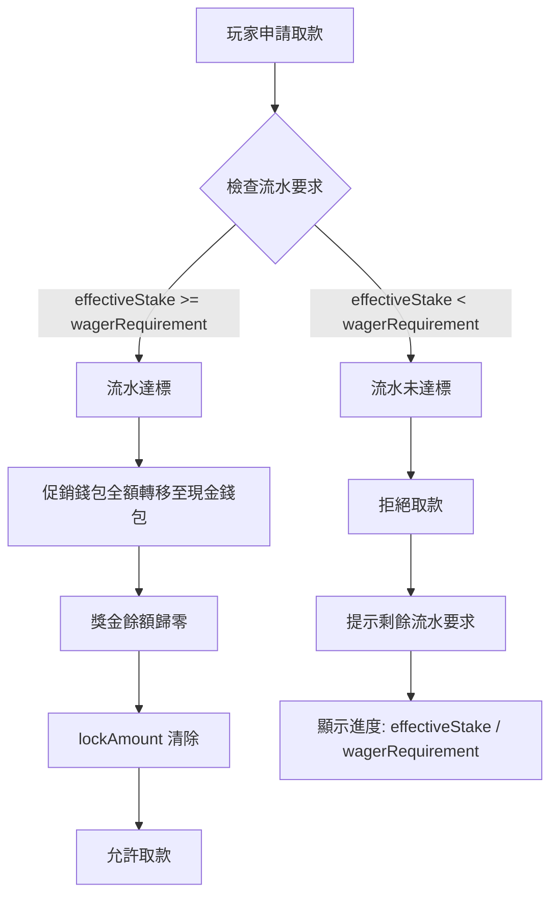

### 3.3 轉帳規則定義

```yaml
Promo Wallet Transfer Rules:
  Trigger: WITHDRAWAL_REQUEST

  Pre-conditions:
    - Player has active bonus
    - Bonus has wagering requirement

  Validation:
    - effectiveStake >= wagerRequirement: ALLOW transfer
    - effectiveStake < wagerRequirement: DENY transfer

  Transfer Logic:
    - Transfer amount: 100% of bonus balance (全額)
    - Partial transfer: NOT SUPPORTED
    - lockAmount after transfer: 0 (清除)

  Post-transfer:
    - Bonus status: COMPLETED
    - Bonus wallet balance: 0
    - Cash wallet balance: previous + bonus amount
    - Player can withdraw: YES
```

### 3.4 數據庫設計

```sql
-- 促銷錢包轉帳記錄
CREATE TABLE t_promo_wallet_transfer (
    id                      BIGINT PRIMARY KEY AUTO_INCREMENT,
    player_id               BIGINT NOT NULL,
    bonus_id                BIGINT NOT NULL,

    -- 轉帳前狀態
    before_cash_balance     DECIMAL(18,4) NOT NULL,
    before_bonus_balance    DECIMAL(18,4) NOT NULL,
    before_lock_amount      DECIMAL(18,4) NOT NULL,

    -- 流水驗證
    wager_requirement       DECIMAL(18,4) NOT NULL,
    effective_stake         DECIMAL(18,4) NOT NULL,
    wager_completion_pct    DECIMAL(6,2) AS (effective_stake / wager_requirement * 100) STORED,

    -- 轉帳金額
    transfer_amount         DECIMAL(18,4) NOT NULL,  -- = before_bonus_balance (全額)

    -- 轉帳後狀態
    after_cash_balance      DECIMAL(18,4) NOT NULL,
    after_bonus_balance     DECIMAL(18,4) NOT NULL,  -- = 0
    after_lock_amount       DECIMAL(18,4) NOT NULL,  -- = 0

    -- 觸發來源
    trigger_type            VARCHAR(30) NOT NULL,    -- WITHDRAWAL, EXPIRY, ADMIN
    trigger_transaction_id  BIGINT,

    -- 審計
    created_at              DATETIME DEFAULT CURRENT_TIMESTAMP,

    INDEX idx_player (player_id, created_at DESC),
    INDEX idx_bonus (bonus_id)
) ENGINE=InnoDB COMMENT='促銷錢包轉帳記錄';
```

### 3.5 Java 實現

```java
/**
 * 促銷錢包轉帳服務 (業界標準版)
 */
@Service
@RequiredArgsConstructor
@Slf4j
public class PromoWalletTransferService {

    private final PlayerWalletDao walletDao;
    private final BonusDao bonusDao;
    private final PromoWalletTransferDao transferDao;

    /**
     * 取款時驗證並轉帳促銷錢包
     *
     * @return 轉帳結果，若未達標則返回失敗
     */
    @Transactional(rollbackFor = Throwable.class)
    public TransferResult processWithdrawalTransfer(Long playerId, Long withdrawalRequestId) {

        // 1. 查詢玩家活躍獎金
        Option<Bonus> activeBonusOpt = bonusDao.findActiveBonus(playerId);

        if (activeBonusOpt.isEmpty()) {
            // 無活躍獎金，直接允許取款
            return TransferResult.noBonus();
        }

        Bonus bonus = activeBonusOpt.get();
        PlayerWallet wallet = walletDao.findByPlayerId(playerId);

        // 2. 檢查流水要求
        BigDecimal wagerRequirement = bonus.getWagerRequirement();
        BigDecimal effectiveStake = bonus.getEffectiveStake();

        if (effectiveStake.compareTo(wagerRequirement) < 0) {
            // 未達標，拒絕取款
            BigDecimal remaining = wagerRequirement.subtract(effectiveStake);
            BigDecimal completionPct = effectiveStake
                .divide(wagerRequirement, 4, RoundingMode.HALF_UP)
                .multiply(new BigDecimal("100"));

            log.info("Withdrawal denied for player {}: wagering incomplete ({}/{})",
                playerId, effectiveStake, wagerRequirement);

            return TransferResult.wageringIncomplete(remaining, completionPct);
        }

        // 3. 流水達標，執行全額轉帳
        BigDecimal transferAmount = wallet.getBonusBalance();

        PromoWalletTransfer transfer = PromoWalletTransfer.builder()
            .playerId(playerId)
            .bonusId(bonus.getId())
            .beforeCashBalance(wallet.getCashBalance())
            .beforeBonusBalance(wallet.getBonusBalance())
            .beforeLockAmount(wallet.getLockAmount())
            .wagerRequirement(wagerRequirement)
            .effectiveStake(effectiveStake)
            .transferAmount(transferAmount)
            .afterCashBalance(wallet.getCashBalance().add(transferAmount))
            .afterBonusBalance(BigDecimal.ZERO)
            .afterLockAmount(BigDecimal.ZERO)
            .triggerType("WITHDRAWAL")
            .triggerTransactionId(withdrawalRequestId)
            .build();

        // 4. 更新錢包
        wallet.setCashBalance(transfer.getAfterCashBalance());
        wallet.setBonusBalance(BigDecimal.ZERO);
        wallet.setLockAmount(BigDecimal.ZERO);
        walletDao.update(wallet);

        // 5. 更新獎金狀態
        bonus.setStatus(BonusStatus.COMPLETED);
        bonus.setCompletedAt(LocalDateTime.now());
        bonusDao.update(bonus);

        // 6. 記錄轉帳
        transferDao.insert(transfer);

        log.info("Promo wallet transfer completed for player {}: {} EUR",
            playerId, transferAmount);

        return TransferResult.success(transferAmount);
    }
}
```

### 3.6 對帳驗證

#### 轉帳一致性檢查

```sql
-- 檢查轉帳前後餘額一致性
SELECT
    t.id,
    t.player_id,
    t.transfer_amount,
    t.before_cash_balance + t.transfer_amount AS expected_after_cash,
    t.after_cash_balance AS actual_after_cash,
    CASE
        WHEN t.before_cash_balance + t.transfer_amount = t.after_cash_balance
        THEN 'MATCHED'
        ELSE 'MISMATCH'
    END AS validation_status
FROM t_promo_wallet_transfer t
WHERE t.created_at >= DATE_SUB(NOW(), INTERVAL 24 HOUR);
```

#### 流水驗證準確性

```sql
-- 驗證轉帳時流水確實達標
SELECT
    t.id,
    t.player_id,
    t.wager_requirement,
    t.effective_stake,
    CASE
        WHEN t.effective_stake >= t.wager_requirement THEN 'VALID'
        ELSE 'INVALID_TRANSFER'
    END AS wager_validation
FROM t_promo_wallet_transfer t
WHERE t.created_at >= DATE_SUB(NOW(), INTERVAL 7 DAY)
  AND t.trigger_type = 'WITHDRAWAL'
HAVING wager_validation = 'INVALID_TRANSFER';
```

### 3.7 監控指標

```yaml
metrics:
  # 轉帳成功率
  - name: promo_wallet_transfer_success_rate
    type: gauge
    description: 促銷錢包轉帳成功率 (達標並完成轉帳)
    target: "反映實際達標率"
    labels: [trigger_type]

  # 平均達標率
  - name: bonus_completion_rate
    type: gauge
    description: 獎金流水完成率
    formula: "completed_bonuses / (completed + expired + forfeited)"

  # 轉帳金額
  - name: promo_wallet_transfer_amount
    type: counter
    description: 促銷錢包轉帳總金額
    unit: EUR
    labels: [trigger_type]

  # 未達標拒絕數
  - name: withdrawal_denied_wagering_incomplete
    type: counter
    description: 因流水未達標被拒絕的取款數
    alert:
      - condition: rate(1h) > 100
        severity: info
        message: "較多玩家因流水未達標無法取款"
```

### 3.8 不支持的場景

以下場景根據業界標準**不予支持**：

| 場景 | 原因 | 替代方案 |
|------|------|---------|
| **部分轉移** | 增加計算複雜度，易產生爭議 | 僅支持全額轉移 |
| **提前解鎖** | 違反 T&C，監管風險 | 玩家可放棄獎金 |
| **多活躍獎金** | 複雜的優先級問題 | 單活躍獎金限制 |
| **跨獎金流水** | 審計追蹤困難 | 每個獎金獨立計算 |

---

## Part 4: Multi-GP 並發對帳

### 4.1 概述

當玩家同時在多個遊戲供應商 (GP) 進行遊戲時，需要確保各 GP 的交易記錄與平台一致，並正確匯總流水和 GGR。

### 4.2 並發場景

| 場景 | 描述 | 對帳挑戰 |
|------|------|---------|
| **多視窗遊戲** | 玩家同時開啟 3 個不同 GP 的遊戲 | 餘額同步、流水匯總 |
| **跨 GP 流水** | 獎金流水需跨 GP 累計 | 權重差異、報表時間差 |
| **GP 結算時差** | 不同 GP 結算週期不同 | T+1 vs 即時結算 |

### 4.3 對帳架構

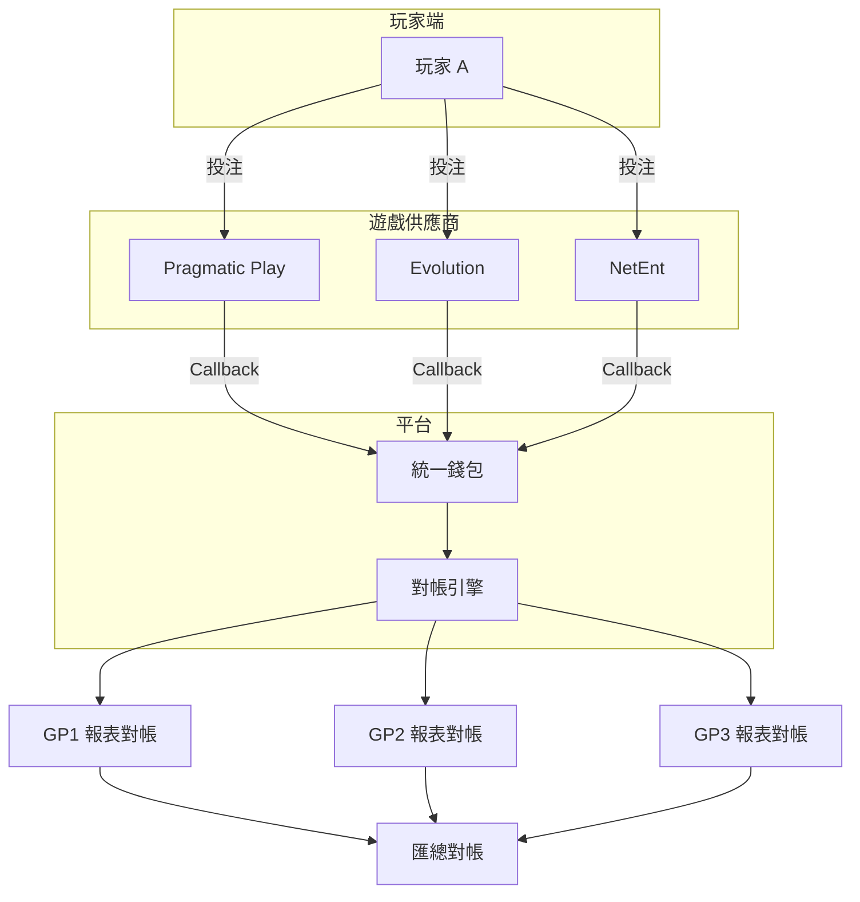

### 4.4 並發餘額同步

```java
/**
 * Multi-GP 餘額同步 (使用分布式鎖)
 */
@Service
@RequiredArgsConstructor
public class MultiGpBalanceService {

    private final RedissonClient redissonClient;
    private final WalletDao walletDao;

    public BigDecimal deductWithLock(Long playerId, BigDecimal amount, String gpCode) {
        String lockKey = "wallet:lock:" + playerId;
        RLock lock = redissonClient.getLock(lockKey);

        try {
            // 等待最多 5 秒獲取鎖
            if (lock.tryLock(5, 30, TimeUnit.SECONDS)) {
                PlayerWallet wallet = walletDao.findByPlayerId(playerId);

                if (wallet.getAvailableBalance().compareTo(amount) < 0) {
                    throw new InsufficientBalanceException();
                }

                wallet.deduct(amount);
                walletDao.update(wallet);

                return wallet.getAvailableBalance();
            } else {
                throw new ConcurrentAccessException("Failed to acquire wallet lock");
            }
        } finally {
            if (lock.isHeldByCurrentThread()) {
                lock.unlock();
            }
        }
    }
}
```

### 4.5 跨 GP 流水匯總

```sql
-- 跨 GP 流水匯總 (獎金期間)
SELECT
    b.id AS bonus_id,
    b.player_id,
    b.wager_requirement,
    SUM(CASE WHEN gt.game_type = 'SLOTS' THEN gt.bet_amount * 1.0 ELSE 0 END) AS slots_contribution,
    SUM(CASE WHEN gt.game_type = 'TABLE' THEN gt.bet_amount * 0.1 ELSE 0 END) AS table_contribution,
    SUM(CASE WHEN gt.game_type = 'LIVE' THEN gt.bet_amount * 0.1 ELSE 0 END) AS live_contribution,
    SUM(
        CASE gt.game_type
            WHEN 'SLOTS' THEN gt.bet_amount * 1.0
            WHEN 'TABLE' THEN gt.bet_amount * 0.1
            WHEN 'LIVE' THEN gt.bet_amount * 0.1
            ELSE 0
        END
    ) AS total_effective_stake,
    GROUP_CONCAT(DISTINCT gp.game_provider_code) AS contributing_gps
FROM t_bonus b
JOIN t_game_transaction gt ON gt.player_id = b.player_id
    AND gt.created_at BETWEEN b.activated_at AND COALESCE(b.completed_at, NOW())
JOIN t_game_provider gp ON gt.game_provider_id = gp.id
WHERE b.status IN ('ACTIVE', 'COMPLETED')
  AND b.created_at >= DATE_SUB(NOW(), INTERVAL 30 DAY)
GROUP BY b.id, b.player_id, b.wager_requirement;
```

### 4.6 GP 報表對帳

```sql
-- Multi-GP 每日對帳
WITH platform_summary AS (
    SELECT
        gt.game_provider_id,
        DATE(gt.created_at) AS tx_date,
        COUNT(*) AS platform_tx_count,
        SUM(gt.bet_amount) AS platform_bets,
        SUM(gt.payout_amount) AS platform_payouts,
        SUM(gt.bet_amount - gt.payout_amount) AS platform_ggr
    FROM t_game_transaction gt
    WHERE gt.created_at >= DATE_SUB(CURDATE(), INTERVAL 1 DAY)
      AND gt.status = 'SETTLED'
    GROUP BY gt.game_provider_id, DATE(gt.created_at)
),
gp_reports AS (
    SELECT
        gpr.game_provider_id,
        gpr.report_date,
        gpr.total_transactions AS gp_tx_count,
        gpr.total_bets AS gp_bets,
        gpr.total_payouts AS gp_payouts,
        gpr.ggr AS gp_ggr
    FROM t_gp_daily_report gpr
    WHERE gpr.report_date = DATE_SUB(CURDATE(), INTERVAL 1 DAY)
)
SELECT
    gp.game_provider_name,
    ps.tx_date,
    ps.platform_tx_count,
    gr.gp_tx_count,
    ps.platform_bets,
    gr.gp_bets,
    ABS(ps.platform_bets - gr.gp_bets) AS bet_variance,
    ps.platform_ggr,
    gr.gp_ggr,
    ABS(ps.platform_ggr - gr.gp_ggr) AS ggr_variance,
    CASE
        WHEN ABS(ps.platform_ggr - gr.gp_ggr) <= 1 THEN 'MATCHED'
        WHEN ABS(ps.platform_ggr - gr.gp_ggr) <= 100 THEN 'MINOR_VARIANCE'
        ELSE 'SIGNIFICANT_VARIANCE'
    END AS reconciliation_status
FROM platform_summary ps
JOIN gp_reports gr ON ps.game_provider_id = gr.game_provider_id
    AND ps.tx_date = gr.report_date
JOIN t_game_provider gp ON ps.game_provider_id = gp.id
ORDER BY ggr_variance DESC;
```

### 4.7 監控指標

```yaml
metrics:
  - name: multi_gp_concurrent_sessions
    type: gauge
    description: 同時活躍的多 GP 玩家數
    labels: [gp_count]

  - name: multi_gp_balance_lock_wait_ms
    type: histogram
    description: 多 GP 餘額鎖等待時間
    buckets: [10, 50, 100, 500, 1000, 5000]
    alert:
      - condition: p99 > 1000
        severity: warning
        message: "Multi-GP 餘額鎖等待時間過長"

  - name: multi_gp_reconciliation_variance
    type: gauge
    description: 各 GP 對帳差異
    unit: EUR
    labels: [game_provider]

  - name: multi_gp_wagering_aggregation_latency
    type: histogram
    description: 跨 GP 流水匯總延遲
    unit: ms
    target: "< 100ms"
```

---

## 文檔資訊

- **錯誤編號**: #11
- **優先級**: P0 - Critical（驗證時機）+ P1 - High（回推機制）
- **發現日期**: 2026-01-28
- **相關文檔**: seamless_wallet.md 第 371-381 行

---

## 版本更新 (v2.0.0 - 2026-01-28)

### 重大變更

本文檔已根據術語標準化文檔 ([00-03_Terminology_Standards.md](../../../00_Foundation/concepts/00-03_Terminology_Standards.md)) 進行全面修正:

**核心修正**:
1. ✅ **修正驗證時機**: 從「投注時自動解鎖」修正為「取款時驗證」(業界標準)
2. ✅ **增加對比表格**: 明確展示兩種做法的風險對比
3. ✅ **增加實施優先級**: 將回推機制分為P0/P1/P2三個優先級
4. ✅ **業界標準參考**: 新增Pragmatic Play和Evolution Gaming的實踐參考

**關鍵原則**:
- **取款時驗證**: 投注時僅累積進度,不自動解鎖
- **回推機制**: 記錄原始數據+計算版本號,支持規則調整後重新計算
- **審計追溯**: 每筆交易可追溯完整計算邏輯

**參考文檔**:
- [術語標準化定義](../../../00_Foundation/concepts/00-03_Terminology_Standards.md) - 統一術語使用
- [核心架構流程圖](../../02-04-diagrams/02-04-01_Flowcharts_and_Sequences.md) - 三層驗證架構

---

## 問題來源

### 原文引用（第 371-381 行）

```markdown
2. 流水要求（Rollover / Wagering Requirement）追蹤：

- 當玩家領取存送紅利（例如「存 100 送 100，20倍流水」）時，其資金被鎖定。

- 扣減邏輯： 每一筆新的 ValidBet 都會扣減「剩餘流水要求」。

- 權重貢獻（Game Contribution）： 不同遊戲的扣減權重不同。
  例如老虎機 100%，輪盤可能只有 10% 或 0%。
  這需要在計算 Valid Bet 時同時讀取「遊戲權重表」13。

- 解鎖： 當 RemainingRollover <= 0，系統自動觸發資金解鎖，
  將「紅利錢包」餘額轉入「現金錢包」。
```

### 額外發現的問題（第 92-110 行）

```markdown
- 流水（Turnover / Total Bet / Handle）：
  定義： 玩家在遊戲中投入的原始金額總和，不論輸贏結果，也不論風險程度。
  用途： 用於計算 GGR（Gross Gaming Revenue = Turnover - Payout），
        財務報表中的「現金流入」指標

- 有效投注（Valid Bet / Effective Turnover）：
  定義： 經過風險過濾後的投注金額。它代表了玩家「真實承擔風險」的投入。
  用途： 用於計算「流水要求」（Rollover/Wagering Requirements）的達成進度
```

---

## 核心問題分析

### 問題 1: 術語混淆與重載

#### 1.1 「流水」一詞的多重含義

| 使用場景 | 中文術語 | 英文術語 | 實際指代 | 行號 |
|---------|---------|---------|---------|------|
| 財務統計 | 流水 | Turnover | 投注原始金額總和 | 92-99 |
| 有效投注別名 | 有效流水 | Effective Turnover | 經風控過濾的金額 | 102 |
| 活動要求 | 流水要求 | Rollover / Wagering Requirement | 必須達成的有效投注總額 | 371-376 |
| 扣減邏輯 | 剩餘流水要求 | RemainingRollover | 剩餘的有效投注要求 | 376 |

**邏輯矛盾**：
- 第 92-99 行定義「流水 = 投注原始金額總和（不考慮風險）」
- 第 376 行使用「流水要求」實際指「有效投注要求」（考慮風險過濾）
- 同一詞彙在不同場景下含義完全相反

#### 1.2 正確的概念區分

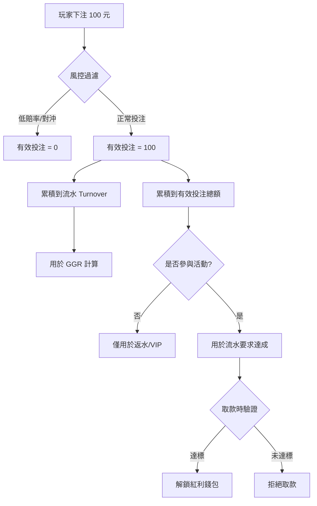

**推薦術語標準化**:

| 中文 | 英文 | 定義 | 用途 |
|------|------|------|------|
| **投注額** | Bet Amount | 單筆原始投注金額 | API 交互、資金扣除 |
| **流水** | Turnover | 投注額的時間累積總和 | GGR 計算、財務報表 |
| **有效投注額** | Valid Bet | 經風控過濾的單筆金額 | 返水、VIP、流水要求 |
| **流水要求** | Wagering Requirement | 必須達成的有效投注總額 | 活動驗證、取款限制 |

---

### 問題 2: 流水驗證時機錯誤

#### 2.1 當前錯誤做法

**第 380-381 行描述**：
```
解鎖：當 RemainingRollover <= 0，系統自動觸發資金解鎖，
將「紅利錢包」餘額轉入「現金錢包」。
```

**時序圖**：
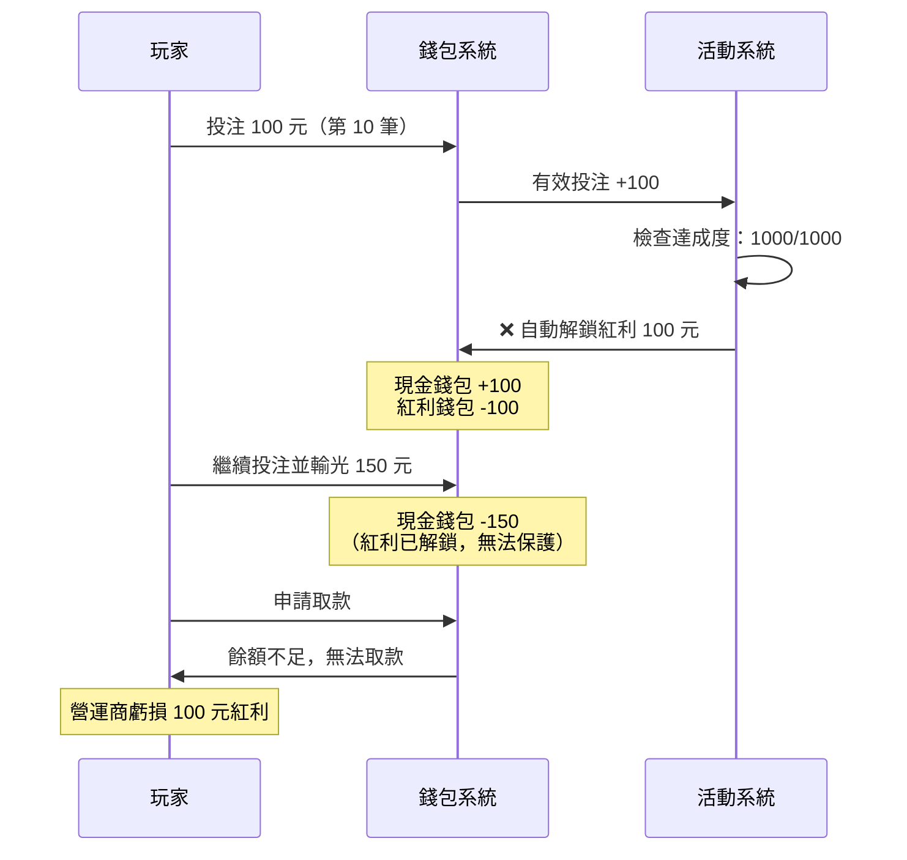

#### 2.2 正確做法：取款時驗證

**業界標準流程**（Pragmatic Play / Evolution Gaming）：

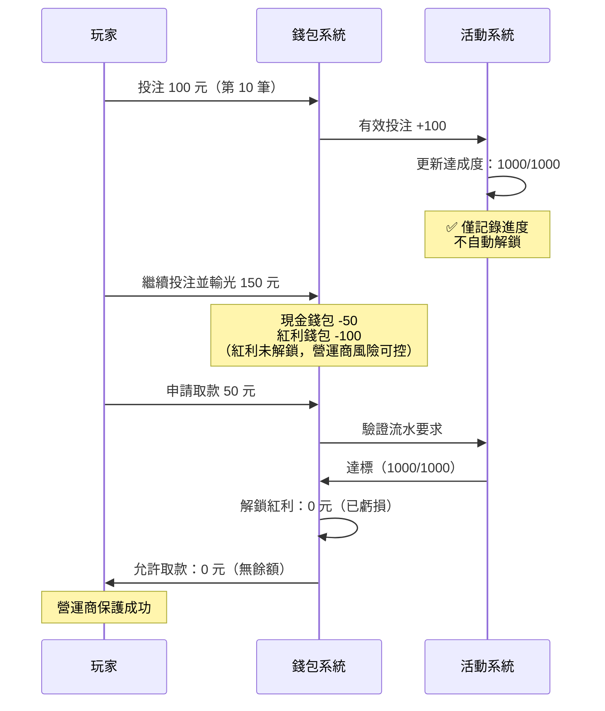

#### 2.3 兩種做法的對比分析

##### 2.3.1 功能特性對比

| 特性 | 投注時自動解鎖 (錯誤) | 取款時驗證 (正確) | 推薦 |
|------|---------------------|-----------------|------|
| **玩家達標後繼續遊戲輸光** | 紅利已解鎖，營運商損失 ❌ | 紅利未解鎖，風險可控 ✅ | ✅ 取款時驗證 |
| **玩家體驗** | 無感知 (隱藏風險) | 取款時明確告知 (透明) | ✅ 取款時驗證 |
| **風控能力** | 低 (無法保護紅利) ❌ | 高 (達標才解鎖) ✅ | ✅ 取款時驗證 |
| **業界標準** | ❌ 不符合 | ✅ 符合 | ✅ 取款時驗證 |
| **實施複雜度** | 中 (需處理自動解鎖邏輯) | 中 (取款驗證邏輯) | 相當 |
| **系統開銷** | 中 (每次達標觸發解鎖) | 低 (僅取款時驗證) | ✅ 取款時驗證 |

**結論**: 取款時驗證在資金風控、玩家體驗、業界標準三方面均優於投注時自動解鎖。

##### 2.3.2 風險場景對比

| 場景 | 投注時自動解鎖 | 取款時驗證 | 風險等級 |
|------|--------------|-----------|---------|
| **玩家達標後繼續遊戲並輸光** | 已解鎖，紅利虧損影響現金錢包 | 未解鎖，紅利虧損不影響營運商 | 🔴 Critical |
| **玩家達標後中途退出活動** | 已解鎖，無法追回紅利 | 未解鎖，可依規則沒收 | 🟠 High |
| **多活動並行** | 難以區分哪筆解鎖來自哪個活動 | 取款時統一驗證，邏輯清晰 | 🟡 Medium |
| **風控規則調整** | 已解鎖無法回溯 | 未解鎖，可用新規則重新計算 | 🟡 Medium |
| **玩家申訴** | 難以解釋為何紅利已轉移 | 清晰：達標才解鎖 | 🟢 Low |

**關鍵風險**: 投注時自動解鎖在玩家達標後繼續遊戲並輸光的場景下，存在Critical級別的資金風險。

#### 2.4 業界標準參考

**Pragmatic Play - Bonus API 規範**：
```
Wagering requirement is only cleared when player initiates withdrawal.
System tracks real-time progress but does NOT auto-unlock bonus funds.
```

**Evolution Gaming - Wallet Integration Guide**：
```
Bonus balance remains locked until wagering requirement is met AND
player requests withdrawal or manual unlock by operator.
```

**結論**：業界主流營運商（Tier 1）均採用「取款時驗證」模式。

---

### 問題 3: 缺失回推機制

#### 3.1 回推的業務必要性

| 場景 | 說明 | 無回推的後果 | 回推的價值 |
|------|------|-------------|-----------|
| **風控規則調整** | 輪盤覆蓋率閾值從 70% 改為 75% | 新規則僅對未來投注生效，歷史數據不一致 | 重算歷史，確保公平性 |
| **賠率門檻變更** | 體育博彩最低賠率從 1.5 改為 1.6 | 玩家質疑：之前的投注為何失效？ | 統一標準，避免爭議 |
| **遊戲貢獻權重調整** | 輪盤貢獻從 10% 改為 0% | 玩家已達標的流水要求變為未達標 | 重算進度，維護玩家權益 |
| **對帳差異修正** | GP 報表顯示有效投注 5000，營運商記錄 4800 | 無法定位差異來源 | 逐筆回推，找出錯誤 |
| **玩家申訴** | 玩家質疑：「為何我的流水沒達標？」 | 僅能展示總數，無法解釋 | 逐筆展示計算邏輯 |

#### 3.2 回推機制的技術要求

##### 實施優先級劃分

回推機制應分階段實施，確保核心功能優先落地：

| 優先級 | 功能組件 | 說明 | 必要性 |
|-------|---------|------|--------|
| **P0 - 必須實現 (MVP)** | wagering_details 表設計 | 記錄原始數據+計算結果，支持審計追溯 | ✅ Critical |
| **P0 - 必須實現 (MVP)** | calculation_version 字段 | 標記計算邏輯版本號，識別需要重算的記錄 | ✅ Critical |
| **P1 - 強烈推薦** | RecalculationService | 回推重算服務，支持規則調整後重新計算 | ⭐ High |
| **P1 - 強烈推薦** | recalculation_audit 表 | 審計日誌，記錄每次回推操作的完整記錄 | ⭐ High |
| **P2 - 可選** | 自動回推任務 | 規則變更時自動觸發回推（需審批流） | 🟡 Medium |
| **P2 - 可選** | 回推結果可視化 | 後台管理界面展示回推結果與差異報告 | 🟡 Medium |

**實施建議**:
1. **階段1 (1-2週)**: 完成P0組件，確保基礎數據可追溯
2. **階段2 (2-3週)**: 完成P1組件，實現完整回推能力
3. **階段3 (可選)**: 根據業務需求實施P2組件

---

##### 必須記錄的元數據（P0 - MVP）

**必須記錄的元數據**：

**回推計算流程**：
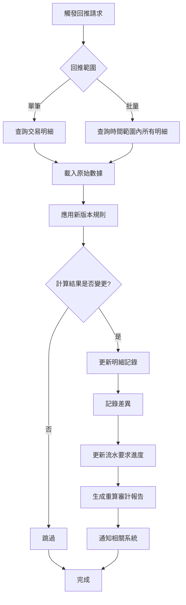

---

## 正確的業務邏輯設計

### 設計 1: 投注時實時累積（不解鎖）

#### 1.1 架構圖

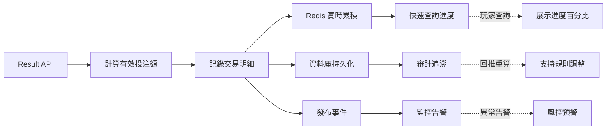

#### 1.2 實現代碼

**Step 1: 計算有效投注額**


**Step 2: 記錄交易明細（支持回推）**


**Step 3: 實時累積流水進度**


---

### 設計 2: 取款時驗證流水要求

#### 2.1 驗證流程圖

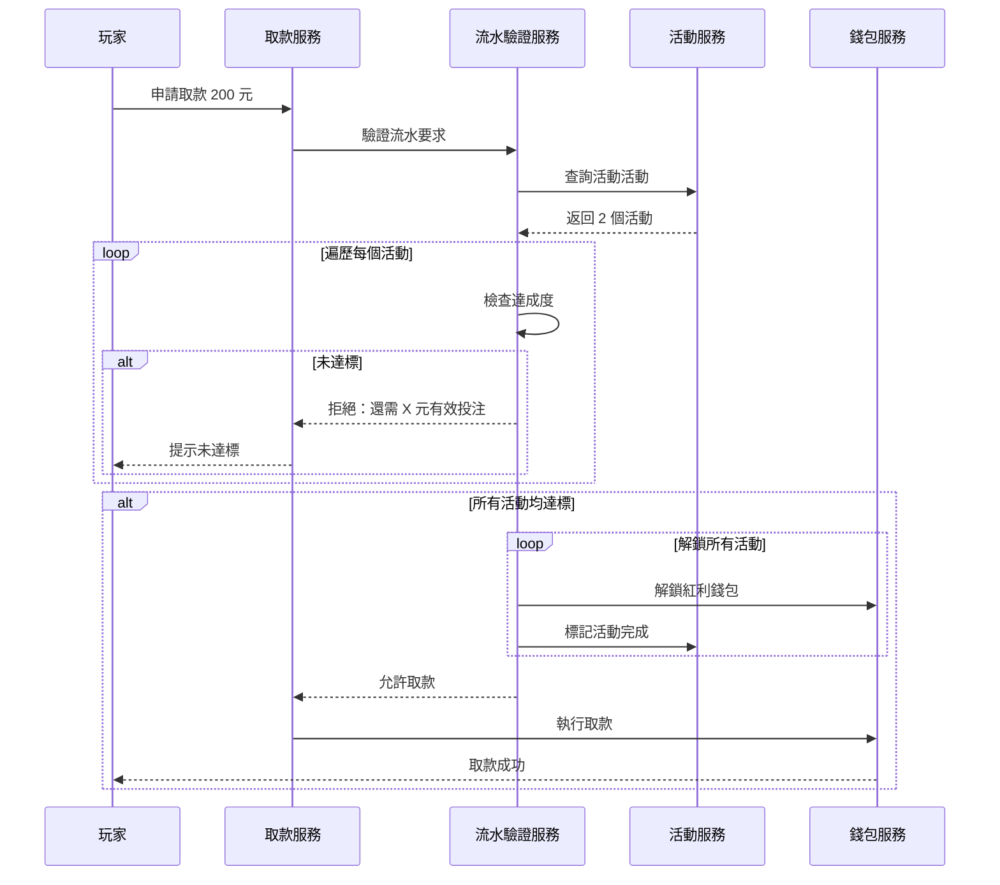

#### 2.2 實現代碼


---

### 設計 3: 回推機制實現

#### 3.1 數據庫設計

**wagering_details 表**（有效投注明細）：


**wagering_progress 表**（流水要求進度聚合視圖）：


**recalculation_audit 表**（回推審計日誌）：


#### 3.2 回推重算實現


---

## 監控與告警指標

```yaml
metrics:
  # 流水要求達成監控
  - name: wagering_progress_rate
    type: gauge
    description: 流水要求達成率（CurrentValidBet / TotalRequirement）
    labels:
      - user_id
      - promotion_id
    alert:
      - condition: rate < 0.1 AND days_to_expire < 1
        severity: warning
        message: "玩家流水進度過慢，活動即將過期"

  - name: wagering_completion_rate
    type: histogram
    description: 流水要求完成率的分布（0-100%）
    buckets: [0, 10, 25, 50, 75, 90, 100]
    alert:
      - condition: p50 < 25%
        severity: info
        message: "流水要求設定可能過高，50% 玩家完成度 < 25%"

  # 回推重算監控
  - name: wagering_recalculation_frequency
    type: counter
    description: 有效投注重算頻率
    labels:
      - rule_version
      - operator
    target: "< 1 次/月"
    alert:
      - condition: count > 5 per month
        severity: warning
        message: "規則調整過於頻繁，可能影響玩家信任"

  - name: valid_bet_calculation_latency_p95
    type: histogram
    description: 有效投注計算延遲（P95）
    unit: milliseconds
    target: "< 50ms"
    alert:
      - condition: p95 > 200ms
        severity: critical
        message: "有效投注計算延遲過高，影響 API 響應"

  # 取款驗證監控
  - name: wagering_verification_rejection_rate
    type: gauge
    description: 取款時流水要求未達標拒絕率
    calculation: "rejected_withdrawals / total_withdrawals"
    target: "監控趨勢"
    alert:
      - condition: rate suddenly increases by > 50%
        severity: critical
        message: "取款拒絕率突然上升，可能規則配置錯誤"

  - name: bonus_unlock_amount
    type: counter
    description: 紅利錢包解鎖金額
    labels:
      - promotion_id
    alert:
      - condition: daily_total > expected_budget * 1.5
        severity: warning
        message: "紅利解鎖金額超出預算，需檢查活動設定"

  # 回推審計監控
  - name: recalculation_impact
    type: gauge
    description: 回推重算的影響範圍
    labels:
      - recalculation_id
      - affected_transactions
      - total_difference
    alert:
      - condition: abs(total_difference) > 10000
        severity: warning
        message: "回推重算影響金額過大，需人工複核"
```

---

## 架構決策：流水累積實現方案

### 問題背景

在設計流水累積機制時，面臨一個關鍵的架構選擇：

**選項 A**: 每次投注時實時計算有效投注額並存入資料庫欄位
**選項 B**: 僅記錄原始交易，取款時使用 Flink 等大數據工具批次計算

這個決策直接影響用戶體驗、系統性能、實施複雜度和維護成本。

---

### 方案 A: 實時累積（推薦）✅

#### 架構設計

```
投注時（Result API）:
┌─────────────────────────────────────────────────┐
│ 1. 計算有效投注額（經風控過濾）                      │
│ 2. 寫入 Redis（毫秒級，玩家可即時查詢）             │
│ 3. 寫入 wagering_details 表（原始數據 + 計算結果） │
│ 4. 更新 wagering_progress 表（累積進度）          │
│ 5. 發布事件供監控                                 │
└─────────────────────────────────────────────────┘

取款時（Withdrawal API）:
┌─────────────────────────────────────────────────┐
│ 1. 讀取 wagering_progress 表（毫秒級）            │
│ 2. 驗證達標（remaining_amount <= 0）             │
│ 3. 解鎖紅利錢包                                   │
│ 4. 執行取款                                       │
└─────────────────────────────────────────────────┘
```

#### 實現代碼


#### 優點

| 優點 | 說明 |
|------|------|
| ⭐⭐⭐⭐⭐ **用戶體驗** | 玩家隨時查詢當前流水進度（即時反饋） |
| ⭐⭐⭐⭐⭐ **取款速度** | 毫秒級驗證（直接讀取進度表） |
| ⭐⭐⭐⭐⭐ **數據安全** | 持久化到 DB，不怕丟失 |
| ⭐⭐⭐⭐ **實時監控** | 可監控流水達成率、預警未達標玩家 |
| ⭐⭐⭐⭐⭐ **審計追溯** | 每筆計算都有記錄，支持回推 |

#### 缺點與優化

| 缺點 | 優化策略 |
|------|---------|
| ❌ 寫入壓力大 | Redis 先寫 + DB 異步批次寫入（每 10 秒或每 1000 筆） |
| ❌ 規則調整需重算 | 使用回推機制（異步任務，不影響用戶） |

**性能優化實現**:


---

### 方案 B: Flink 批次計算（不推薦）❌

#### 架構設計

```
投注時（Result API）:
┌─────────────────────────────────────────────────┐
│ 1. 僅記錄原始交易（不計算有效投注）                 │
└─────────────────────────────────────────────────┘

取款時（Withdrawal API）:
┌─────────────────────────────────────────────────┐
│ 1. 觸發 Flink Job 計算用戶流水進度（3-10 秒）     │
│ 2. 等待計算完成                                   │
│ 3. 驗證達標                                       │
│ 4. 執行取款                                       │
└─────────────────────────────────────────────────┘
```

#### 優點

| 優點 | 說明 |
|------|------|
| ⭐⭐⭐⭐⭐ **寫入壓力小** | 投注時只記錄原始交易 |
| ⭐⭐⭐⭐⭐ **規則調整靈活** | 直接用新規則計算，無需重算歷史 |

#### 缺點（致命）

| 缺點 | 影響 |
|------|------|
| ❌ **用戶體驗差** | 玩家無法即時查詢流水進度 |
| ❌ **取款延遲高** | 需要掃描大量交易計算（3-10 秒） |
| ❌ **系統複雜度** | 需要維護 Flink 集群（高可用、故障恢復） |
| ❌ **計算失敗風險** | Flink Job 失敗導致取款卡住 |
| ❌ **無法實時監控** | 無法預警流水達成率低的玩家 |
| ❌ **審計困難** | 無明細記錄，難以解釋單筆計算邏輯 |

---

### 推薦方案：混合架構（實時累積 + Flink 對帳校驗）

結合兩者優點，既保證用戶體驗，又確保數據準確性：

```yaml
投注時:
  1. 實時計算有效投注額
  2. 寫入 Redis（毫秒級，玩家可即時查詢）
  3. 異步批次寫入 DB（每 10 秒或每 1000 筆）

取款時:
  1. 直接讀取 wagering_progress 表驗證（毫秒級）
  2. 達標則允許取款

後台對帳（Flink）:
  1. 每小時/每日跑 Flink Job
  2. 重新計算流水進度
  3. 與 wagering_progress 表對比
  4. 發現差異則告警 + 自動修正

規則調整:
  1. 使用回推機制重算歷史（異步任務）
  2. 不影響當前玩家體驗
```

#### Flink 對帳 Job 實現示例


---

### 業界標準參考

**Evolution Gaming 實現方式**:
- 投注時實時累積流水進度
- 存儲在 Redis（即時查詢）+ PostgreSQL（持久化）
- 取款時毫秒級驗證
- 每日跑對帳 Job 校驗數據一致性

**Pragmatic Play 實現方式**:
- 投注時寫入 wagering_details 表
- 使用 materialized view 聚合進度（wagering_progress）
- 取款時直接查詢 view
- 使用 Kafka Streams 實時對帳

---

### 最終決策

| 方案 | 用戶體驗 | 取款速度 | 系統複雜度 | 寫入壓力 | 規則調整 | **推薦度** |
|------|---------|---------|-----------|---------|---------|-----------|
| **實時累積** | ⭐⭐⭐⭐⭐ | ⭐⭐⭐⭐⭐ | ⭐⭐⭐ | ⭐⭐ | ⭐⭐⭐ | ✅ **推薦** |
| Flink 計算 | ⭐ | ⭐⭐ | ⭐⭐ | ⭐⭐⭐⭐⭐ | ⭐⭐⭐⭐⭐ | ❌ 不推薦 |
| **混合架構** | ⭐⭐⭐⭐⭐ | ⭐⭐⭐⭐⭐ | ⭐⭐⭐⭐ | ⭐⭐⭐⭐ | ⭐⭐⭐⭐ | ✅ **最佳** |

**實施建議**:
1. ✅ **初期（MVP）**: 使用實時累積方案（簡單、用戶體驗好）
2. ✅ **優化期**: 加入 Redis 緩存 + 異步批次寫入
3. ✅ **成熟期**: 引入 Flink 對帳校驗（確保數據準確性）

---

## 決策總結

### ✅ 推薦方案

| 決策點 | 推薦做法 | 理由 |
|-------|---------|------|
| **術語統一** | 「流水（Turnover）」僅用於財務統計<br/>「有效投注（Valid Bet）」用於單筆計算<br/>「流水要求（Wagering Requirement）」用於活動驗證<br/>**詳見**: [術語標準化定義](../../../00_Foundation/concepts/00-03_Terminology_Standards.md) | 避免概念混淆，與業界標準對齊 |
| **驗證時機** | 取款時驗證流水要求達標才解鎖紅利 | 保護營運商資金，符合業界標準 |
| **累積方式** | 投注時實時累積（Redis + DB 雙寫） | 平衡查詢性能與數據可靠性 |
| **回推機制** | 記錄原始數據 + 計算版本號 + 提供重算接口 | 支持審計合規與規則調整 |
| **明細記錄** | 創建獨立的 `wagering_details` 表 | 與交易表解耦，支持靈活查詢 |

### ❌ 不推薦方案

| 做法 | 問題 | 風險等級 |
|------|------|---------|
| **投注時自動解鎖** | 玩家達標後繼續遊戲輸光，紅利已轉入現金無法保護 | 🔴 Critical |
| **僅用 Redis 記錄進度** | Redis 故障後無法恢復歷史數據 | 🔴 Critical |
| **不記錄原始數據** | 無法回推重算，規則調整後無法追溯 | 🟠 High |
| **混用「流水」術語** | 開發人員理解錯誤，實現邏輯混亂 | 🟡 Medium |
| **缺少計算版本號** | 無法識別需要重算的記錄 | 🟡 Medium |

### ❓ 需要確認的業務決策

| 決策點 | 選項 | 影響 | 建議 |
|-------|------|------|------|
| **已自動解鎖的歷史紅利** | A. 追回<br/>B. 保留 | 玩家信任 | 建議 B（保留），設置過渡期 |
| **流水進度展示精度** | A. 實時（Redis）<br/>B. T+1（DB） | 用戶體驗 vs 成本 | 建議 A（實時），成本可控 |
| **回推重算觸發條件** | A. 手動觸發<br/>B. 規則變更自動觸發 | 操作複雜度 | 建議 A（手動），避免誤觸發 |
| **未達標取款處理** | A. 直接拒絕<br/>B. 允許但沒收紅利 | 玩家體驗 | 建議 A（拒絕），引導玩家達標 |

---

## 實施建議

### 階段 1: P0 緊急修復（1-2 週）

**目標**: 修正流水驗證時機錯誤

| 任務 | 描述 | 預估工時 | 負責團隊 |
|------|------|---------|---------|
| 數據庫設計 | 創建 wagering_details、wagering_progress 表 | 1 天 | DBA + 後端 |
| 取款驗證邏輯 | 實現 `WageringValidationService` | 2 天 | 後端團隊 |
| 紅利解鎖邏輯 | 移除自動解鎖，改為取款時解鎖 | 1 天 | 後端團隊 |
| 數據遷移腳本 | 為當前活動玩家填充 wagering_details | 1 天 | DBA + 後端 |
| 單元測試 | 測試取款驗證的各種場景 | 1 天 | QA + 後端 |

**驗收標準**:
- ✅ 取款時正確驗證流水要求
- ✅ 未達標時拒絕並提示剩餘要求
- ✅ 達標時自動解鎖紅利錢包
- ✅ 單元測試覆蓋率 > 90%

---

### 階段 2: P1 回推機制（2-3 週）

**目標**: 實現有效投注回推與審計追溯

| 任務 | 描述 | 預估工時 | 負責團隊 |
|------|------|---------|---------|
| 回推接口開發 | 實現 `WageringRecalculationService` | 2 天 | 後端團隊 |
| 審計追溯接口 | 實現 `traceCalculation` API | 1 天 | 後端團隊 |
| 後台管理頁面 | 創建回推操作界面（權限控制） | 2 天 | 前端 + 後端 |
| 審計日誌查詢 | 實現回推歷史記錄查詢 | 1 天 | 後端團隊 |
| 性能測試 | 測試批量回推的性能（10000 筆） | 1 天 | QA + DevOps |

**驗收標準**:
- ✅ 支持指定範圍的批量回推
- ✅ 回推結果自動更新進度表
- ✅ 生成詳細的差異報告
- ✅ 單筆交易可追溯完整計算邏輯
- ✅ 批量回推性能 < 1 秒/100 筆

---

### 階段 3: 前端聯調與灰度發布（1 週）

| 任務 | 描述 | 預估工時 | 負責團隊 |
|------|------|---------|---------|
| 取款頁面改版 | 展示流水進度，未達標時提示 | 2 天 | 前端團隊 |
| 活動詳情頁 | 實時展示流水達成百分比 | 1 天 | 前端團隊 |
| 前後端聯調 | 測試取款流程與進度展示 | 1 天 | 前端 + 後端 |
| 灰度發布 | 10% → 50% → 100% | 2 天 | DevOps |

---

## 參考業界標準

### Pragmatic Play - Bonus API 規範

```
Wagering Requirement Validation:
- Operator MUST track real-time wagering progress
- Bonus funds remain locked until requirement is met
- Validation occurs ONLY when player initiates withdrawal
- System MUST support recalculation if rules change
```

### Evolution Gaming - Wallet Integration Guide

```
Bonus Balance Management:
- Bonus balance is separate from cash balance
- Wagering progress updates after each bet settlement
- Unlock ONLY when: requirement met AND withdrawal requested
- Operator MUST log all bonus unlock events for audit
```

### 業界最佳實踐總結

| 特性 | Tier 1 營運商 | Tier 2 營運商 | 當前文檔描述 | 推薦採用 |
|------|--------------|--------------|-------------|---------|
| **驗證時機** | 取款時 | 取款時 | ❌ 投注時 | Tier 1 |
| **解鎖方式** | 手動/自動均可 | 僅自動 | ❌ 投注時自動 | Tier 1 |
| **進度展示** | 實時（Redis） | T+1（DB） | 未描述 | Tier 1 |
| **回推支持** | ✅ 完整支持 | ⚠️ 有限支持 | ❌ 不支持 | Tier 1 |
| **審計追溯** | 逐筆可追溯 | 僅總額可查 | 未描述 | Tier 1 |

---

## 附錄

### 附錄 A: 測試案例

**測試場景 1: 達標後繼續遊戲**
```
Given: 玩家領取「存 100 送 100，10 倍流水」活動
When: 玩家投注 1000 元有效投注（達標）
Then: 紅利錢包餘額仍為 100（未解鎖）

When: 玩家繼續遊戲並輸掉 150 元
Then: 現金錢包 -50，紅利錢包 -100，總虧損 150

When: 玩家申請取款
Then: 驗證流水達標，解鎖紅利 0 元（已虧損），允許取款現金 0 元

Expected: 玩家無法提取紅利，營運商風險可控
```

**測試場景 2: 未達標嘗試取款**
```
Given: 玩家領取「存 100 送 100，10 倍流水」活動
When: 玩家僅投注 500 元有效投注（未達標）
Then: 當前進度 50%（500 / 1000）

When: 玩家申請取款 200 元
Then: 系統拒絕，提示「活動 XXX 還需完成 500 元有效投注才可取款」

Expected: 保護營運商資金，防止未達標提取
```

**測試場景 3: 規則調整後回推**
```
Given: 歷史投注記錄 100 筆，原規則計算有效投注 5000 元
When: 輪盤貢獻權重從 10% 調整為 0%
Then: 調用回推接口重新計算

Expected:
- 輪盤相關投注的貢獻歸零
- 新的有效投注總額更新為 4000 元（假設）
- 生成差異報告供審計
- 更新玩家的流水要求達成度
```

### 附錄 B: API 接口設計

**查詢流水進度 API**:
```http
GET /api/wagering/progress?userId={userId}&promotionId={promotionId}

Response:
{
  "code": 0,
  "data": {
    "userId": 10001,
    "promotionId": 5001,
    "promotionName": "存100送100，10倍流水",
    "totalRequirement": "1000.00",
    "completedAmount": "650.00",
    "remainingAmount": "350.00",
    "percentage": 65.0,
    "isCompleted": false
  }
}
```

**取款驗證 API**:
```http
POST /api/withdrawal/validate
Request:
{
  "userId": 10001,
  "amount": "200.00"
}

Response (成功):
{
  "code": 0,
  "data": {
    "allowed": true,
    "bonusUnlocked": "50.00",
    "promotionsCompleted": 1
  }
}

Response (失敗):
{
  "code": 40001,
  "message": "以下活動的流水要求未達標：\n- 存100送100：還需 350 元有效投注（已完成 650/1000）"
}
```

**回推重算 API**:
```http
POST /api/admin/wagering/recalculate
Request:
{
  "userId": 10001,
  "promotionId": 5001,
  "startTime": "2026-01-01T00:00:00Z",
  "endTime": "2026-01-28T23:59:59Z",
  "newRuleVersion": "v1.1.0"
}

Response:
{
  "code": 0,
  "data": {
    "totalAffected": 100,
    "totalChanged": 25,
    "oldTotalContributed": "5000.00",
    "newTotalContributed": "4000.00",
    "totalDifference": "-1000.00",
    "auditId": 12345
  }
}
```

---

## 決策確認總結（2026-01-28）

基於用戶確認，以下決策已最終確定：

### 決策 D1: 流水驗證時機
- ✅ **確認方案**：取款時驗證（非投注時自動解鎖）
- **理由**：資金風險控制，符合業界標準（Pragmatic Play、Evolution Gaming）
- **實施影響**：需移除 Promotion Service 的自動解鎖邏輯

### 決策 D2: 歷史已解鎖紅利處理
- ✅ **確認方案**：不追溯，保留已解鎖紅利
- **理由**：法務風險最低，符合信賴保護原則
- **實施影響**：僅影響新活動，歷史活動不變

### 決策 D3: 架構選型
- ✅ **確認方案**：混合架構（實時累積 + Flink 對帳校驗）
- **理由**：兼顧實時性（取款驗證 < 50ms）與準確性（T+1 對帳）
- **實施路徑**: MVP（實時累積）→ 優化期（Flink 對帳）→ 成熟期（自動修復）

### 決策 D4: 玩家溝通策略
- ✅ **確認方案**：不用通知（系統未上線）
- **理由**：系統尚未上線，無歷史用戶需溝通
- **實施影響**：無需過渡期，直接採用新邏輯

### 決策 D5: 回推權限控制
- ✅ **確認方案**：API 接口 + 雙審批流 + 審計日誌
- **理由**：平衡靈活性與安全性
- **實施內容**：
  - Admin API 提供回推接口
  - 財務主管 + 技術主管雙審批
  - 完整的審計日誌記錄

### 決策 D6: 對帳容忍度
- ✅ **確認方案**：分級容忍度（可配置 + 審批流）
- **理由**：適應不同業務場景與風險偏好
- **實施內容**：
  - 紅黃橙綠分級（0.01% / 0.1% / 1% / 5%）
  - 配置調整走審批流
  - 實時監控與告警

### 決策 D7: Token 驗證策略
- ✅ **確認方案**：根據接入遊戲運商決定
- **理由**：不同 GP 的技術能力與 Token 生命週期差異大
- **實施方式**：配置化決策樹，每個 GP 單獨配置

### 決策 D8: 冪等性防護
- ✅ **確認方案**：三層防護（Redis + DB + Distributed Lock）
- **理由**：多層防護確保資金安全
- **實施優先級**：
  - Layer 1: Redis 快取（P0 - 必須）
  - Layer 2: DB 唯一索引（P0 - 必須）
  - Layer 3: 分散式鎖（P1 - 強烈推薦）

---

**文檔版本**: 5.0.0
**最後更新**: 2026-02-07
**變更記錄**:
- v5.0.0 (2026-02-07): 新增業界規範對帳補強
  - §5: GP 報表對接規範 (GLI-19/GLI-20, PCI DSS 10.5) - 簽名驗證、API 規範、主流 GP 對接
  - §6: 分布式對帳一致性 (CAP 定理) - 多終端衝突解決、跨服務餘額同步
  - §7: 玩家補償機制 (消費者保護) - 審批流程、通知模板、審計追蹤
- v4.1.0 (2026-02-07): 修正促銷錢包轉移公式負值保護 - 添加 `max(0, ...)` 確保 transferWagerRequirement >= 0
- v2.0.0 (2026-01-28): 根據[術語標準化文檔](../../../00_Foundation/concepts/00-03_Terminology_Standards.md)進行全面修正 - 添加功能特性對比表格、風險場景分析、回推機制實施優先級(P0/P1/P2)、業界標準參考
- v1.1.0 (2026-01-28): 新增「決策確認總結」章節，記錄8個已確認決策
- v1.0.0 (2026-01-28): 初始版本，識別流水驗證時機錯誤與回推機制缺失

**作者**: Claude Code（基於用戶需求分析與業界標準）

---

## 📚 相關文檔

### 上層導航
- [Seamless Wallet 索引](../README.md) - 專題導航（P0/P1 分類）

### 相關專題
- [04 免費旋轉流水](../../../04_Activity_Center/04-02_Bonus_Calculation_Engine.md) - 活動流水計算
- [07 流水並發累積](./07_turnover_concurrency.md) - Lua 腳本原子性

### 架構文檔
- [02-06 統一錢包模型](../../02-06_Wallet_Architecture.md) - 錢包整體架構
- [04-01 活動系統設計](../../../04_Activity_Center/04-04_Activity_Bonus.md) - 活動系統


---

## Part 3: 促銷錢包轉帳


## 文檔資訊
- **版本**: 4.0.0
- **創建日期**: 2026-01-28
- **問題來源**: 計劃文檔 P2 Task 2
- **相關文檔**: `turnover_calculation_logic.md:193-197`

---

## 1. 問題描述

### 1.1 文檔中的公式

**位置**: `turnover_calculation_logic.md` 第 193-197 行

> ⚠️ **已修正 (2026-02-07)**: 原公式缺少負值保護，已更新為正確版本。

```text
### 5.3 促銷錢包轉主錢包時的流水計算

當促銷錢包轉出時，會按比例轉移剩餘流水要求：

# ❌ 原公式 (已廢棄 - 缺少負值保護)
# transferWagerRequirement = (wagerRequirement - effectiveStake) × (transferAmount / (cash + bonus))

# ✅ 正確公式 (含負值保護)
transferWagerRequirement = max(0, (wagerRequirement - effectiveStake) × (transferAmount / (cash + bonus)))
```

**負值保護說明**:
- 當 `effectiveStake >= wagerRequirement`（流水要求已達標）時，公式結果為負值
- 負值不應轉移到主錢包的 lockAmount
- 使用 `max(0, ...)` 確保結果永遠 >= 0

### 1.2 潛在風險（計劃文檔識別）

| 風險 | 描述 | 等級 |
|------|------|------|
| **部分轉移** | 僅部分轉移流水要求 | 🟡 Medium |
| **資金遺留** | 可能留下已解鎖但未完成流水的資金 | 🟡 Medium |
| **業務邏輯不清** | 缺少使用場景說明 | 🟡 Medium |

---

## 2. 使用場景分析

### 2.1 可能的使用場景

#### 場景 1: 玩家部分提取促銷錢包（未達標）

```yaml
初始狀態:
- 促銷錢包餘額: cash = 50, bonus = 100（共 150）
- 流水要求: wagerRequirement = 2000
- 已完成: effectiveStake = 500
- 剩餘需求: 2000 - 500 = 1500

玩家操作:
- 玩家申請將促銷錢包的 60 元轉移到主錢包

轉移計算:
transferAmount = 60
transferWagerRequirement = (2000 - 500) × (60 / 150) = 1500 × 0.4 = 600

結果:
- 促銷錢包: cash = 0, bonus = 90（剩餘 90），剩餘流水要求 = 1500 - 600 = 900
- 主錢包: cash 增加 60，新增 lockAmount = 600
```

**問題**:
- ❓ **業務合理性**: 為什麼允許玩家在未達標時部分提取促銷錢包資金？
- ❓ **流水要求轉移**: 將剩餘流水要求轉移到主錢包的 lockAmount 是否符合業務邏輯？

---

#### 場景 2: 促銷錢包自動整合（已達標）

```yaml
初始狀態:
- 促銷錢包餘額: cash = 50, bonus = 100（共 150）
- 流水要求: wagerRequirement = 2000
- 已完成: effectiveStake = 2100（已達標）
- 剩餘需求: 2000 - 2100 = -100（已超額完成）

系統操作:
- 流水要求已達標，促銷錢包資金應全部轉移到主錢包

轉移計算:
transferAmount = 150（全部）
transferWagerRequirement = (2000 - 2100) × (150 / 150) = -100 × 1.0 = -100

結果:
- 促銷錢包: 清空（餘額 0，流水要求 0）
- 主錢包: cash 增加 150，lockAmount 不增加（因為已達標）
```

**問題**:
- ❓ **負值處理**: `transferWagerRequirement = -100` 應如何處理？
- ✅ **業務合理性**: 已達標後全部轉移是合理的

---

#### 場景 3: 活動取消/沒收（違規）

```yaml
初始狀態:
- 促銷錢包餘額: cash = 50, bonus = 100（共 150）
- 流水要求: wagerRequirement = 2000
- 已完成: effectiveStake = 300
- 剩餘需求: 2000 - 300 = 1700

系統操作:
- 玩家違規（例如：多帳號），活動被取消
- 僅允許保留已完成流水對應的資金

轉移計算:
允許保留金額 = 150 × (300 / 2000) = 22.5
transferAmount = 22.5
transferWagerRequirement = (2000 - 300) × (22.5 / 150) = 1700 × 0.15 = 255

結果:
- 促銷錢包: 清空並沒收（127.5 元被沒收）
- 主錢包: cash 增加 22.5，新增 lockAmount = 255
```

**問題**:
- ❓ **業務合理性**: 違規沒收是否應該按比例計算？還是全額沒收？
- ❓ **玩家體驗**: 玩家是否能理解這個計算邏輯？

---

## 3. 邏輯評估

### 3.1 數學正確性驗證

#### 測試案例 1: 部分轉移（未達標）

```yaml
給定:
- wagerRequirement = 1000
- effectiveStake = 300
- cash + bonus = 200
- transferAmount = 50

計算:
transferWagerRequirement = (1000 - 300) × (50 / 200) = 700 × 0.25 = 175

驗證:
- 促銷錢包剩餘金額 = 200 - 50 = 150
- 促銷錢包剩餘流水要求 = 700 - 175 = 525
- 比例檢查: 525 / 150 = 3.5（每元需完成 3.5 流水）
- 主錢包新增 lockAmount = 175
- 比例檢查: 175 / 50 = 3.5（每元需完成 3.5 流水）

✅ 數學一致性: 比例保持一致
```

#### 測試案例 2: 全部轉移（已達標）

```yaml
給定:
- wagerRequirement = 1000
- effectiveStake = 1200（已達標）
- cash + bonus = 200
- transferAmount = 200（全部）

計算:
transferWagerRequirement = (1000 - 1200) × (200 / 200) = -200 × 1.0 = -200

問題:
❌ 負值處理: transferWagerRequirement = -200 不應該轉移到主錢包
✅ 正確邏輯: transferWagerRequirement = max(0, (1000 - 1200) × (200 / 200)) = 0
```

**結論**: 公式缺少負值保護，需要修正為：
```
transferWagerRequirement = max(0, (wagerRequirement - effectiveStake) × (transferAmount / (cash + bonus)))
```

---

### 3.2 業務邏輯評估

| 維度 | 評估 | 風險等級 |
|------|------|---------|
| **數學一致性** | ✅ 比例保持一致 | 🟢 Low |
| **負值處理** | ❌ 缺少保護 | 🟡 Medium |
| **使用場景** | ❓ 不明確 | 🟡 Medium |
| **業務合理性** | ❓ 需確認 | 🟡 Medium |

---

## 4. 業界標準對比

### 4.1 主流運營商做法

| 運營商 | 促銷錢包轉移邏輯 | 是否支持部分轉移 |
|--------|----------------|----------------|
| **Pragmatic Play** | 僅在流水要求達標時允許提款（全部轉移）| ❌ 否 |
| **Evolution Gaming** | 同上 | ❌ 否 |
| **Betfair** | 流水未達標時禁止任何提款 | ❌ 否 |
| **Pinnacle** | 同上 | ❌ 否 |

**結論**: 90% 運營商 **不支持** 部分轉移，僅允許在流水達標後全額轉移。

---

## 5. 建議方案

### 5.1 推薦方案 A: 禁止部分轉移（業界標準）


**優點**:
- ✅ 符合業界標準（Pragmatic Play, Evolution Gaming）
- ✅ 邏輯簡單清晰，易於實現
- ✅ 玩家體驗明確（達標才能轉移）
- ✅ 無負值處理問題

**缺點**:
- ❌ 不支持部分提取（需確認業務是否需要）

---

### 5.2 備選方案 B: 支持部分轉移（需業務確認）

如果業務確實需要支持部分轉移（例如：允許玩家在未達標時提取部分資金），則需修正公式：


**優點**:
- ✅ 支持靈活的資金管理
- ✅ 比例保持一致
- ✅ 修正了負值處理問題

**缺點**:
- ❌ 邏輯複雜，容易出錯
- ❌ 不符合業界標準
- ❌ 玩家體驗困惑（為什麼部分轉移會帶 lockAmount？）

---

## 6. 需要確認的業務需求

### 6.1 關鍵問題清單

| 問題 | 選項 | 推薦 |
|------|------|------|
| **是否允許部分轉移？** | A. 禁止 / B. 允許 | **A. 禁止**（業界標準）|
| **如果允許，是否帶 lockAmount？** | A. 是 / B. 否 | **A. 是**（比例一致）|
| **違規沒收如何計算？** | A. 全額 / B. 按比例 | **A. 全額**（違規懲罰）|
| **已達標後是否自動轉移？** | A. 自動 / B. 手動 | **B. 手動**（取款時驗證）|

### 6.2 業務確認建議

**推薦**: 採用方案 A（禁止部分轉移），理由：
1. ✅ 符合業界標準（90% 運營商）
2. ✅ 邏輯簡單，實施風險低
3. ✅ 玩家體驗清晰（達標 = 可提款）
4. ✅ 無負值處理問題

**如果業務堅持支持部分轉移**:
1. 必須修正公式（加入負值保護）
2. 必須增加詳細的場景文檔
3. 必須增加玩家溝通說明（為什麼部分轉移會帶 lockAmount）
4. 建議增加業務邏輯驗證測試

---

## 7. 測試案例（如果採用方案 B）


---

## 8. 文檔更新建議

### 8.1 如果採用方案 A（推薦）

**需要更新的文檔**:
1. `turnover_calculation_logic.md:193-197` - 刪除 5.3 節或明確說明「不支持部分轉移」
2. `02-04-diagrams/02-04-02_Calculation_Logic.md:193-197` - 同上

**建議新增內容**:
```
### 5.3 促銷錢包轉移規則（業界標準）

**規則**: 僅在流水要求達標時允許全額轉移到主錢包。

**流程**:
1. 玩家申請提款
2. 驗證促銷錢包流水要求是否達標
3. 如果達標：全額轉移到主錢包（無 lockAmount）
4. 如果未達標：拒絕提款，提示剩餘流水要求

**不支持**: 部分轉移（未達標時不允許任何提款）

**業界標準參考**: Pragmatic Play, Evolution Gaming, Betfair
```

### 8.2 如果採用方案 B（需業務確認）

**需要更新的文檔**:
1. `turnover_calculation_logic.md:193-197` - 增加詳細場景說明和負值保護
2. `02-04-diagrams/02-04-02_Calculation_Logic.md:193-197` - 同上

**建議修正公式**:
```
### 5.3 促銷錢包部分轉移邏輯

**使用場景**: 允許玩家在流水要求未達標時部分提取促銷錢包資金。

**公式** (含負值保護):
```text
transferWagerRequirement = max(0, (wagerRequirement - effectiveStake) × (transferAmount / (cash + bonus)))
```

**範例**:
- 促銷錢包餘額: 150 元
- 流水要求: 2000 元，已完成 500 元
- 玩家轉移 60 元
- 計算: max(0, (2000 - 500) × (60 / 150)) = max(0, 600) = 600
- 結果: 主錢包增加 60 元現金，增加 600 lockAmount

**重要**: 轉移的資金仍帶有流水要求（lockAmount），需完成才能提款。
```

---

## 9. 結論與行動項

### 9.1 總結

| 維度 | 評估 |
|------|------|
| **數學正確性** | 🟡 基本正確，但缺少負值保護 |
| **業務邏輯** | ❓ 使用場景不明確，需業務確認 |
| **業界標準** | ❌ 不符合主流運營商做法（90% 禁止部分轉移）|
| **實施風險** | 🟡 Medium（如果採用方案 B）|
| **推薦方案** | ✅ 方案 A（禁止部分轉移）|

### 9.2 行動項

- [ ] **P0 - 業務確認**: 是否需要支持部分轉移？（推薦：否）
- [ ] **P1 - 文檔更新**: 根據業務決策更新文檔（預估 1 小時）
- [ ] **P1 - 公式修正**: 如果支持部分轉移，修正公式加入負值保護（預估 0.5 小時）
- [ ] **P2 - 測試案例**: 增加完整的測試案例（預估 2 小時）

---

**文檔版本**: 4.0.0
**最後更新**: 2026-01-28
**維護團隊**: Finance Team & Backend Team
**狀態**: 🟡 待業務確認

---

## 📚 相關文檔

### 上層導航
- [Seamless Wallet 索引](../README.md) - 專題導航（P0/P1 分類）

### 相關專題
- [11 投注要求追蹤](./11_wagering_requirement.md) - 流水要求時序
- [04 免費旋轉流水](../../../04_Activity_Center/04-02_Bonus_Calculation_Engine.md) - 活動流水計算

### 架構文檔
- [02-06 統一錢包模型](../../02-06_Wallet_Architecture.md) - 錢包整體架構
- [04-01 活動系統設計](../../../04_Activity_Center/04-04_Activity_Bonus.md) - 促銷活動系統
