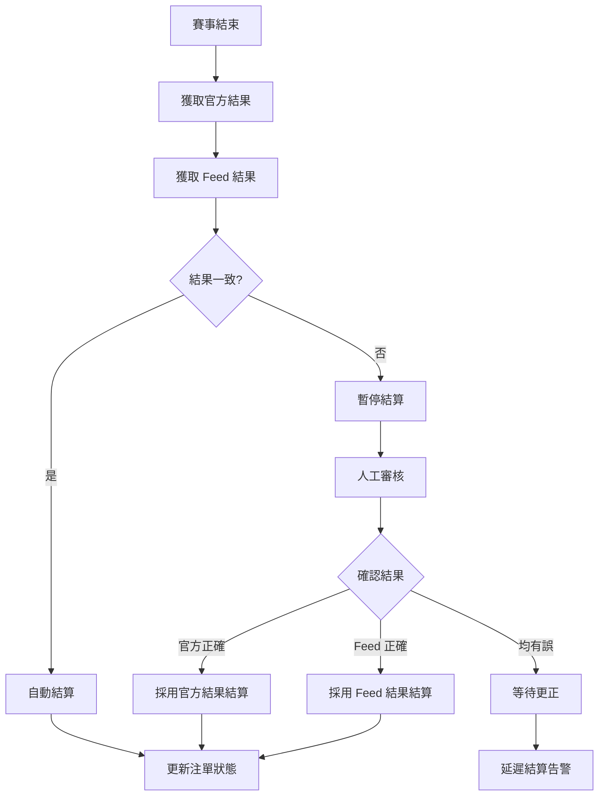
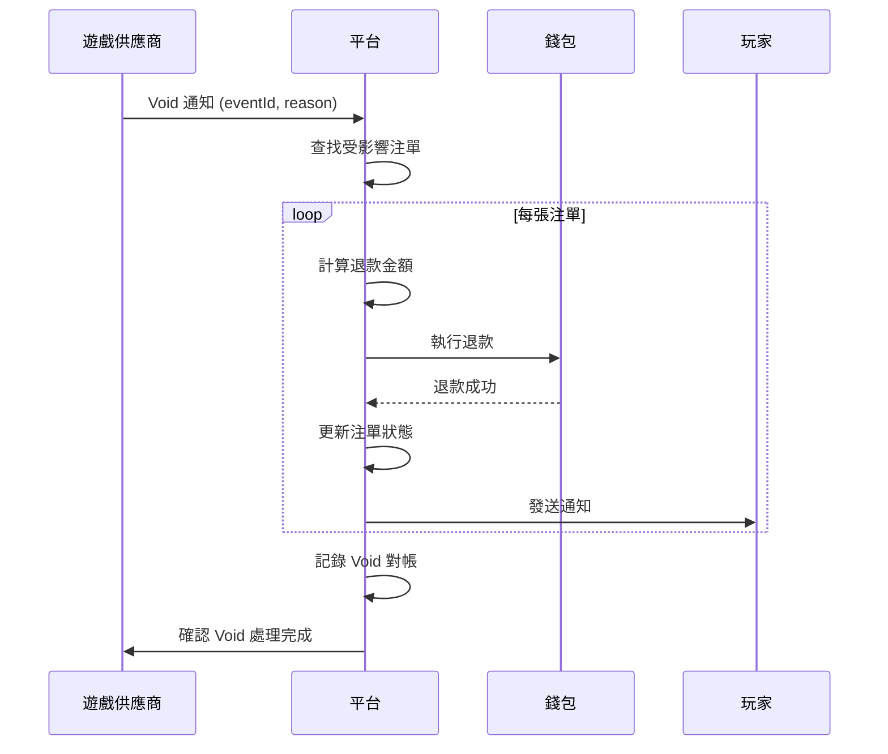

# 02-SW-10 體育博彩結算對帳 (Sports Settlement Reconciliation)

**版本**: 1.0.0
**創建日期**: 2026-02-07
**狀態**: P1 - 業務關鍵

---

## 1. 概述

體育博彩結算對帳確保賽事結果、注單結算、退款處理與遊戲供應商 (GP) 一致，並處理結算糾紛和異常情況。

### 1.1 對帳目的

- **結算準確性**: 確保賽事結果與結算金額一致
- **糾紛處理**: 建立結算糾紛的標準處理流程
- **Void 處理**: 確保取消賽事的注單正確處理
- **IBIA 合規**: 可疑投注報告與對帳

### 1.2 業界標準

| 標準 | 適用範圍 | 關鍵條款 |
|------|---------|---------|
| **GLI-21** | 體育博彩系統 | Event Wagering, Settlement |
| **GLI-33** | 事件投注 | Parlay, Cashout, Void |
| **IBIA** | 體育誠信 | Suspicious Betting Protocols |
| **UKGC** | 英國市場 | Sports Betting Fairness |

---

## 2. 賽事結果對帳

### 2.1 多數據源對帳

```yaml
賽事結果來源:
  官方來源 (Primary):
    - 官方賽事組織 API
    - 體育聯盟官網
    - 權威媒體

  博彩數據源 (Secondary):
    - Sportradar
    - Betgenius
    - IMG/Stats Perform

  對帳規則:
    - 優先採用官方來源
    - 兩個獨立來源一致才結算
    - 來源不一致時人工審核
```

### 2.2 結果對帳流程



### 2.3 結果對帳實現

```java
/**
 * 賽事結果對帳服務
 */
@Service
@RequiredArgsConstructor
@Slf4j
public class EventResultReconciliationService {

    private final OfficialResultClient officialClient;
    private final FeedResultClient feedClient;
    private final BetSettlementManager settlementManager;

    /**
     * 對帳賽事結果
     */
    public EventResultReconciliation reconcileEventResult(Long eventId) {
        // 1. 獲取官方結果
        Option<EventResult> officialResult = officialClient.getResult(eventId);

        // 2. 獲取 Feed 結果
        Option<EventResult> feedResult = feedClient.getResult(eventId);

        // 3. 比對結果
        if (officialResult.isEmpty() && feedResult.isEmpty()) {
            return EventResultReconciliation.pending("等待結果");
        }

        if (officialResult.isDefined() && feedResult.isDefined()) {
            EventResult official = officialResult.get();
            EventResult feed = feedResult.get();

            if (resultsMatch(official, feed)) {
                // 結果一致，自動結算
                return EventResultReconciliation.matched(official);
            } else {
                // 結果不一致，需要人工審核
                return EventResultReconciliation.mismatch(official, feed);
            }
        }

        // 只有一個來源有結果
        if (officialResult.isDefined()) {
            return EventResultReconciliation.singleSource(
                officialResult.get(), "OFFICIAL");
        } else {
            return EventResultReconciliation.singleSource(
                feedResult.get(), "FEED");
        }
    }

    /**
     * 比對結果是否一致
     */
    private boolean resultsMatch(EventResult r1, EventResult r2) {
        // 比對主要結果
        if (!r1.getHomeScore().equals(r2.getHomeScore()) ||
            !r1.getAwayScore().equals(r2.getAwayScore())) {
            return false;
        }

        // 比對關鍵事件 (進球、紅牌等)
        // ...

        return true;
    }
}
```

---

## 3. Void Bet 對帳

### 3.1 Void 原因分類

| Void 原因 | 英文 | 處理方式 | 流水計算 |
|---------|------|---------|---------|
| **賽事取消** | Event Cancelled | 全額退款 | 0% |
| **賽事延期** | Event Postponed | 依規則處理 | 0% |
| **無效投注** | Invalid Bet | 全額退款 | 0% |
| **球員未上場** | Player Did Not Play | 退款或重算 | 0% |
| **明顯錯誤賠率** | Palpable Error | 退款或按正確賠率結算 | 依情況 |

### 3.2 Void 對帳流程



### 3.3 Void 對帳 SQL

```sql
-- Void Bet 每日對帳
SELECT
    v.void_date,
    v.void_reason,
    COUNT(b.id) AS bet_count,
    SUM(b.stake) AS total_stake,
    SUM(b.refund_amount) AS total_refund,

    -- GP 報告
    gp.void_bet_count AS gp_bet_count,
    gp.void_total_stake AS gp_stake,

    -- 差異
    COUNT(b.id) - gp.void_bet_count AS count_variance,
    SUM(b.stake) - gp.void_total_stake AS stake_variance

FROM t_void_event v
JOIN t_bet b ON v.event_id = b.event_id AND b.status = 'VOID'
LEFT JOIN t_gp_void_report gp ON v.void_date = gp.report_date
    AND v.event_id = gp.event_id
WHERE v.void_date = CURDATE() - INTERVAL 1 DAY
GROUP BY v.void_date, v.void_reason
HAVING count_variance != 0 OR stake_variance > 0.01;
```

---

## 4. Parlay 串關對帳

### 4.1 部分 Void 處理

```yaml
Parlay 部分 Void 規則:

  場景: 5 關串關，其中 1 關 Void

  處理方式:
    1. Dead Heat 法: 該關視為無效，重算為 4 關串關
    2. 賠率調整: 該關賠率視為 1.00，繼續計算

  SmartAdmin 採用: Dead Heat 法 (業界標準)

  計算公式:
    原始賠率: 2.0 × 1.8 × 2.2 × 1.5 × 1.9 = 22.572
    一關 Void: 2.0 × 1.8 × 2.2 × 1.5 × 1.0 = 11.88 (移除 Void 關)
    或: 2.0 × 1.8 × 2.2 × 1.5 = 11.88 (視為 4 關)
```

### 4.2 Parlay 對帳邏輯

```java
/**
 * Parlay 結算對帳服務
 */
@Service
@RequiredArgsConstructor
public class ParlaySettlementService {

    /**
     * 處理 Parlay 部分 Void
     */
    public ParlaySettlementResult settleWithPartialVoid(Bet parlayBet) {
        List<BetSelection> selections = parlayBet.getSelections();

        // 1. 找出 Void 的選項
        List<BetSelection> voidSelections = selections.stream()
            .filter(s -> s.getStatus() == SelectionStatus.VOID)
            .toList();

        // 2. 找出有效的選項
        List<BetSelection> validSelections = selections.stream()
            .filter(s -> s.getStatus() != SelectionStatus.VOID)
            .toList();

        // 3. 如果所有選項都 Void，全額退款
        if (validSelections.isEmpty()) {
            return ParlaySettlementResult.fullRefund(parlayBet.getStake());
        }

        // 4. 如果有效選項中有輸的，整單輸
        boolean hasLoser = validSelections.stream()
            .anyMatch(s -> s.getStatus() == SelectionStatus.LOST);
        if (hasLoser) {
            return ParlaySettlementResult.lost(BigDecimal.ZERO);
        }

        // 5. 計算調整後的賠率 (移除 Void 關)
        BigDecimal adjustedOdds = validSelections.stream()
            .map(BetSelection::getOdds)
            .reduce(BigDecimal.ONE, BigDecimal::multiply);

        // 6. 計算派彩
        BigDecimal payout = parlayBet.getStake().multiply(adjustedOdds);

        return ParlaySettlementResult.builder()
            .originalOdds(parlayBet.getTotalOdds())
            .adjustedOdds(adjustedOdds)
            .voidCount(voidSelections.size())
            .validCount(validSelections.size())
            .payout(payout)
            .build();
    }
}
```

---

## 5. IBIA 可疑投注對帳

### 5.1 IBIA 報告流程

```yaml
IBIA (International Betting Integrity Association):

  報告觸發:
    - 異常投注模式
    - 賽事結果可疑
    - 內部人員投注嫌疑

  報告內容:
    - 賽事詳情
    - 可疑投注明細
    - 投注時間線
    - 玩家資訊 (匿名化)

  對帳要求:
    - 與 IBIA 報告確認一致
    - 追蹤 IBIA 調查結果
    - 配合後續處置
```

### 5.2 IBIA 對帳實現

```java
/**
 * IBIA 報告對帳服務
 */
@Service
@RequiredArgsConstructor
public class IbiaReconciliationService {

    private final IbiaReportDao reportDao;
    private final IbiaApiClient ibiaClient;

    /**
     * 每週 IBIA 報告對帳
     */
    @Scheduled(cron = "0 0 10 ? * MON")  // 每週一 10:00
    public void weeklyIbiaReconciliation() {
        LocalDate startDate = LocalDate.now().minusWeeks(1);
        LocalDate endDate = LocalDate.now().minusDays(1);

        // 1. 獲取內部提交的 IBIA 報告
        List<IbiaReport> internalReports = reportDao
            .findByDateRange(startDate, endDate);

        // 2. 獲取 IBIA 確認記錄
        List<IbiaConfirmation> externalConfirmations = ibiaClient
            .getConfirmations(startDate, endDate);

        // 3. 對帳
        for (IbiaReport report : internalReports) {
            Option<IbiaConfirmation> confirmation = externalConfirmations.stream()
                .filter(c -> c.getReportId().equals(report.getExternalId()))
                .findFirst()
                .map(Option::of)
                .orElse(Option.none());

            if (confirmation.isDefined()) {
                updateReportStatus(report, confirmation.get());
            } else {
                markAsPendingConfirmation(report);
            }
        }

        // 4. 生成對帳報告
        generateWeeklyIbiaReport(startDate, endDate, internalReports);
    }
}
```

---

## 6. 結算差異處理

### 6.1 差異分類

| 差異類型 | 原因 | 處理方式 |
|---------|------|---------|
| **金額差異** | 賠率計算差異 | 核對賠率歷史 |
| **狀態差異** | Win/Loss 判定不一致 | 核對賽事結果 |
| **缺失注單** | 同步問題 | 補錄/補結算 |
| **重複結算** | 系統錯誤 | 回滾多餘結算 |

### 6.2 差異對帳表

```sql
-- 體育結算差異對帳表
CREATE TABLE t_sports_settlement_reconciliation (
    id                  BIGINT PRIMARY KEY AUTO_INCREMENT,
    reconciliation_date DATE NOT NULL,
    event_id            BIGINT NOT NULL,

    -- 平台統計
    platform_bet_count      INT,
    platform_total_stake    DECIMAL(18,2),
    platform_total_payout   DECIMAL(18,2),

    -- GP 報告
    gp_bet_count            INT,
    gp_total_stake          DECIMAL(18,2),
    gp_total_payout         DECIMAL(18,2),

    -- 差異
    bet_count_variance      INT,
    stake_variance          DECIMAL(18,2),
    payout_variance         DECIMAL(18,2),

    -- 狀態
    status                  VARCHAR(20) DEFAULT 'PENDING',
    resolution_notes        TEXT,

    created_at              DATETIME DEFAULT CURRENT_TIMESTAMP,

    INDEX idx_date (reconciliation_date),
    INDEX idx_event (event_id)
);
```

---

## 7. 監控與告警

### 7.1 關鍵指標

| 指標 | Prometheus 名稱 | 告警閾值 |
|------|----------------|---------|
| 結果不一致率 | `sports_result_mismatch_rate` | > 0.1% |
| 未結算賽事數 | `sports_unsettled_events_count` | > 10 超過 2 小時 |
| Void 處理延遲 | `sports_void_processing_delay_hours` | > 1 小時 |
| IBIA 待確認數 | `ibia_pending_confirmation_count` | > 5 |

---

## 8. 相關文檔

- [02-SW-09 體育博彩](02-SW-09_Sports_Betting.md) - 體育博彩基礎
- [02-SW-11 Cashout 對帳](02-SW-11_Cashout_Reconciliation.md) - 提前結算對帳
- [02-03 對帳系統](../02-03_Reconciliation_System.md) - 核心對帳架構

---

**返回**: [無縫錢包](README.md) | [財務中心](../README.md)
