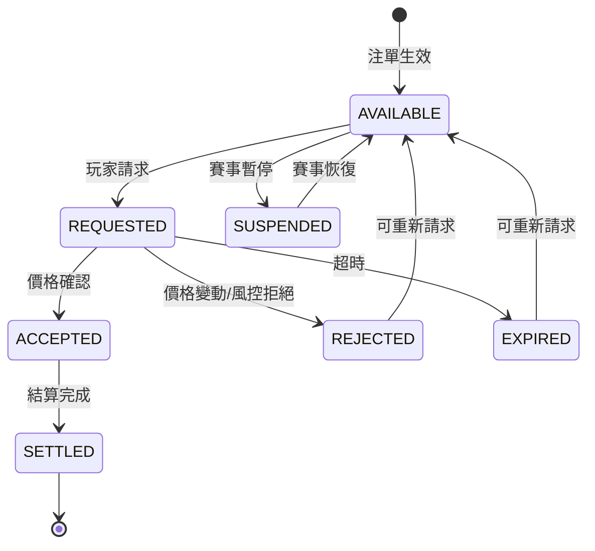

# 02-SW-11 Cashout 結算對帳 (Cashout Reconciliation)

**版本**: 1.0.0
**創建日期**: 2026-02-07
**狀態**: P1 - 業務關鍵

---

## 1. 概述

Cashout (提前結算) 對帳確保玩家提前結算請求的處理正確，定價模型準確，並追蹤部分 Cashout 的剩餘注單狀態。

### 1.1 對帳目的

- **定價準確性**: 驗證 Cashout 報價與實際結算一致
- **部分 Cashout 追蹤**: 確保剩餘注單正確處理
- **拒絕原因對帳**: 驗證拒絕決策符合風控規則
- **市場波動補償**: 處理價格變動導致的差異

### 1.2 業界標準

| 標準 | 適用範圍 | 關鍵條款 |
|------|---------|---------|
| **GLI-21** | 體育博彩 | Early Settlement Requirements |
| **UKGC** | 英國市場 | Cashout Fairness Guidance |
| **ASA/CAP** | 廣告標準 | Cashout Terms Transparency |

---

## 2. Cashout 類型

### 2.1 Cashout 類型分類

| 類型 | 英文 | 說明 | 對帳複雜度 |
|------|------|------|-----------|
| **全額 Cashout** | Full Cashout | 完全結算，注單結束 | 低 |
| **部分 Cashout** | Partial Cashout | 部分結算，剩餘繼續 | 高 |
| **自動 Cashout** | Auto Cashout | 達到預設金額自動觸發 | 中 |
| **Cashout+ (加碼)** | Cashout Boost | 獎金加碼的 Cashout | 中 |

### 2.2 Cashout 狀態機



---

## 3. Cashout 定價對帳

### 3.1 定價模型驗證

```yaml
Cashout 定價公式:
  CashoutValue = Stake × (CurrentOdds / OriginalOdds) × Margin

  參數說明:
    - Stake: 原始投注金額
    - CurrentOdds: 當前市場賠率
    - OriginalOdds: 下注時賠率
    - Margin: 運營商利潤率 (通常 3-5%)

  對帳目標:
    - 驗證 CurrentOdds 來自正確的市場快照
    - 驗證 Margin 配置正確
    - 驗證最終結算金額與報價一致
```

### 3.2 定價對帳服務

```java
/**
 * Cashout 定價對帳服務
 */
@Service
@RequiredArgsConstructor
@Slf4j
public class CashoutPricingReconciliationService {

    private final CashoutRecordDao cashoutRecordDao;
    private final OddsSnapshotDao oddsSnapshotDao;
    private final CashoutConfigDao configDao;

    /**
     * 驗證 Cashout 定價準確性
     */
    public CashoutPricingValidation validatePricing(CashoutRecord record) {
        // 1. 獲取原始投注
        Bet originalBet = betDao.selectById(record.getBetId());

        // 2. 獲取 Cashout 時的市場賠率快照
        OddsSnapshot snapshot = oddsSnapshotDao.findByTimestamp(
            record.getSelectionId(),
            record.getRequestedAt()
        );

        if (snapshot == null) {
            return CashoutPricingValidation.error("無法找到賠率快照");
        }

        // 3. 獲取 Margin 配置
        CashoutConfig config = configDao.findByMarket(record.getMarketType());
        BigDecimal margin = config.getMargin();

        // 4. 重新計算預期 Cashout 金額
        BigDecimal expectedValue = originalBet.getStake()
            .multiply(snapshot.getOdds())
            .divide(originalBet.getOdds(), 4, RoundingMode.HALF_UP)
            .multiply(BigDecimal.ONE.subtract(margin));

        // 5. 比對實際金額
        BigDecimal actualValue = record.getCashoutAmount();
        BigDecimal variance = actualValue.subtract(expectedValue).abs();
        BigDecimal variancePercent = variance.divide(expectedValue, 4, RoundingMode.HALF_UP)
            .multiply(new BigDecimal("100"));

        // 6. 判斷是否在容差範圍內
        boolean isValid = variancePercent.compareTo(new BigDecimal("0.5")) <= 0; // 0.5% 容差

        return CashoutPricingValidation.builder()
            .cashoutId(record.getId())
            .expectedValue(expectedValue)
            .actualValue(actualValue)
            .variance(variance)
            .variancePercent(variancePercent)
            .isValid(isValid)
            .oddsSnapshot(snapshot)
            .marginApplied(margin)
            .build();
    }

    /**
     * 批量定價對帳
     */
    public CashoutPricingReport batchValidation(LocalDate date) {
        List<CashoutRecord> records = cashoutRecordDao
            .findByDateAndStatus(date, CashoutStatus.SETTLED);

        List<CashoutPricingValidation> validations = records.stream()
            .map(this::validatePricing)
            .toList();

        long validCount = validations.stream()
            .filter(CashoutPricingValidation::isValid)
            .count();

        long invalidCount = validations.size() - validCount;

        return CashoutPricingReport.builder()
            .date(date)
            .totalCount(validations.size())
            .validCount(validCount)
            .invalidCount(invalidCount)
            .invalidRecords(validations.stream()
                .filter(v -> !v.isValid())
                .toList())
            .build();
    }
}
```

---

## 4. 部分 Cashout 對帳

### 4.1 部分 Cashout 邏輯

```yaml
部分 Cashout 計算:
  原始注單: $100 @ 3.0 (潛在派彩 $300)
  部分 Cashout: 50% ($50)

  計算過程:
    - Cashout 金額: $50 × (當前賠率/原始賠率) × (1 - margin)
    - 剩餘注單: $50 @ 3.0 (潛在派彩 $150)

  對帳要點:
    - 驗證 Cashout 金額正確
    - 驗證剩餘注單金額和賠率正確
    - 追蹤剩餘注單的最終結算
```

### 4.2 部分 Cashout 追蹤表

```sql
-- 部分 Cashout 追蹤表
CREATE TABLE t_partial_cashout_tracking (
    id                  BIGINT PRIMARY KEY AUTO_INCREMENT,
    original_bet_id     BIGINT NOT NULL,
    cashout_id          BIGINT NOT NULL,

    -- 原始注單資訊
    original_stake      DECIMAL(18,2) NOT NULL,
    original_odds       DECIMAL(10,4) NOT NULL,

    -- Cashout 資訊
    cashout_percentage  DECIMAL(5,2) NOT NULL,  -- 50.00 = 50%
    cashout_stake       DECIMAL(18,2) NOT NULL,
    cashout_amount      DECIMAL(18,2) NOT NULL,

    -- 剩餘注單資訊
    remaining_bet_id    BIGINT,
    remaining_stake     DECIMAL(18,2) NOT NULL,
    remaining_odds      DECIMAL(10,4) NOT NULL,

    -- 剩餘注單結算
    remaining_status    VARCHAR(20),  -- PENDING, WON, LOST, VOID
    remaining_payout    DECIMAL(18,2),
    remaining_settled_at DATETIME,

    -- 對帳狀態
    reconciled          BOOLEAN DEFAULT FALSE,
    reconciled_at       DATETIME,
    variance_amount     DECIMAL(18,2),

    created_at          DATETIME DEFAULT CURRENT_TIMESTAMP,

    INDEX idx_original_bet (original_bet_id),
    INDEX idx_remaining_bet (remaining_bet_id),
    INDEX idx_reconciled (reconciled)
);
```

### 4.3 部分 Cashout 對帳查詢

```sql
-- 部分 Cashout 對帳查詢
SELECT
    pct.id,
    pct.original_bet_id,
    pct.original_stake,

    -- Cashout 部分
    pct.cashout_percentage,
    pct.cashout_amount,

    -- 剩餘注單
    pct.remaining_stake,
    pct.remaining_status,
    pct.remaining_payout,

    -- 總回報計算
    pct.cashout_amount + COALESCE(pct.remaining_payout, 0) AS total_return,
    pct.original_stake AS total_stake,
    (pct.cashout_amount + COALESCE(pct.remaining_payout, 0)) / pct.original_stake AS return_ratio,

    -- 對帳狀態
    CASE
        WHEN pct.remaining_status IS NULL THEN 'PENDING_SETTLEMENT'
        WHEN pct.reconciled = TRUE THEN 'RECONCILED'
        WHEN ABS(pct.variance_amount) > 0.01 THEN 'VARIANCE_DETECTED'
        ELSE 'READY_TO_RECONCILE'
    END AS reconciliation_status

FROM t_partial_cashout_tracking pct
WHERE pct.created_at >= DATE_SUB(CURDATE(), INTERVAL 7 DAY)
ORDER BY pct.created_at DESC;
```

---

## 5. Cashout 拒絕對帳

### 5.1 拒絕原因分類

| 拒絕原因 | 英文 | 說明 | 對帳要求 |
|---------|------|------|---------|
| **價格變動** | Price Changed | 市場賠率變動超過閾值 | 驗證賠率變動幅度 |
| **賽事暫停** | Event Suspended | 賽事暫時中斷 | 驗證暫停時間 |
| **風控限制** | Risk Limit | 玩家風控標記 | 驗證風控規則 |
| **系統繁忙** | System Busy | 高峰期流量控制 | 驗證系統狀態 |
| **超時** | Request Timeout | 請求處理超時 | 驗證處理時間 |

### 5.2 拒絕對帳邏輯

```java
/**
 * Cashout 拒絕對帳服務
 */
@Service
@RequiredArgsConstructor
public class CashoutRejectionReconciliationService {

    /**
     * 驗證拒絕決策是否合理
     */
    public CashoutRejectionValidation validateRejection(CashoutRecord record) {
        if (record.getStatus() != CashoutStatus.REJECTED) {
            return CashoutRejectionValidation.notApplicable();
        }

        switch (record.getRejectionReason()) {
            case PRICE_CHANGED:
                return validatePriceChange(record);
            case EVENT_SUSPENDED:
                return validateEventSuspension(record);
            case RISK_LIMIT:
                return validateRiskLimit(record);
            default:
                return CashoutRejectionValidation.unknown(record.getRejectionReason());
        }
    }

    /**
     * 驗證價格變動拒絕
     */
    private CashoutRejectionValidation validatePriceChange(CashoutRecord record) {
        // 獲取請求時的賠率
        OddsSnapshot requestOdds = oddsSnapshotDao.findByTimestamp(
            record.getSelectionId(), record.getRequestedAt());

        // 獲取處理時的賠率
        OddsSnapshot processOdds = oddsSnapshotDao.findByTimestamp(
            record.getSelectionId(), record.getProcessedAt());

        if (requestOdds == null || processOdds == null) {
            return CashoutRejectionValidation.error("無法獲取賠率快照");
        }

        // 計算價格變動百分比
        BigDecimal priceChange = processOdds.getOdds()
            .subtract(requestOdds.getOdds())
            .abs()
            .divide(requestOdds.getOdds(), 4, RoundingMode.HALF_UP)
            .multiply(new BigDecimal("100"));

        // 獲取配置的閾值
        BigDecimal threshold = configDao.getPriceChangeThreshold();

        boolean isValid = priceChange.compareTo(threshold) > 0;

        return CashoutRejectionValidation.builder()
            .reason(RejectionReason.PRICE_CHANGED)
            .isValid(isValid)
            .requestOdds(requestOdds.getOdds())
            .processOdds(processOdds.getOdds())
            .priceChange(priceChange)
            .threshold(threshold)
            .build();
    }
}
```

---

## 6. 市場波動補償

### 6.1 價格延遲補償

```yaml
價格延遲場景:
  問題: 玩家請求 Cashout 時看到 $50，但處理時價格變為 $48

  補償規則:
    - 價格下跌 < 2%: 按新價格結算，無補償
    - 價格下跌 2-5%: 按新價格結算，通知玩家
    - 價格下跌 > 5%: 拒絕請求，玩家重新操作

    - 價格上漲: 按原請求價格結算（有利於運營商）
    - 或: 按新價格結算（有利於玩家，可選配置）

  對帳要求:
    - 記錄請求價格和結算價格
    - 記錄價格變動百分比
    - 追蹤補償金額
```

### 6.2 價格補償對帳表

```sql
-- Cashout 價格補償對帳表
CREATE TABLE t_cashout_price_compensation (
    id                  BIGINT PRIMARY KEY AUTO_INCREMENT,
    cashout_id          BIGINT NOT NULL,
    bet_id              BIGINT NOT NULL,

    -- 價格資訊
    requested_price     DECIMAL(18,2) NOT NULL,
    settled_price       DECIMAL(18,2) NOT NULL,
    price_difference    DECIMAL(18,2) NOT NULL,
    price_change_pct    DECIMAL(8,4) NOT NULL,

    -- 補償資訊
    compensation_amount DECIMAL(18,2) DEFAULT 0,
    compensation_reason VARCHAR(100),

    -- 時間資訊
    requested_at        DATETIME NOT NULL,
    processed_at        DATETIME NOT NULL,
    processing_delay_ms INT NOT NULL,

    created_at          DATETIME DEFAULT CURRENT_TIMESTAMP,

    INDEX idx_cashout (cashout_id),
    INDEX idx_price_change (price_change_pct)
);
```

---

## 7. 對帳報表

### 7.1 每日 Cashout 對帳報表

```sql
-- 每日 Cashout 對帳匯總
SELECT
    DATE(c.created_at) AS report_date,

    -- 統計
    COUNT(*) AS total_requests,
    SUM(CASE WHEN c.status = 'SETTLED' THEN 1 ELSE 0 END) AS settled_count,
    SUM(CASE WHEN c.status = 'REJECTED' THEN 1 ELSE 0 END) AS rejected_count,

    -- 金額
    SUM(CASE WHEN c.status = 'SETTLED' THEN c.cashout_amount ELSE 0 END) AS total_payout,
    SUM(CASE WHEN c.cashout_type = 'PARTIAL' THEN 1 ELSE 0 END) AS partial_count,

    -- 拒絕原因分佈
    SUM(CASE WHEN c.rejection_reason = 'PRICE_CHANGED' THEN 1 ELSE 0 END) AS price_rejections,
    SUM(CASE WHEN c.rejection_reason = 'RISK_LIMIT' THEN 1 ELSE 0 END) AS risk_rejections,

    -- 處理時間
    AVG(TIMESTAMPDIFF(MILLISECOND, c.requested_at, c.processed_at)) AS avg_processing_ms,

    -- 與 GP 對帳
    gp.total_cashout_count AS gp_count,
    gp.total_cashout_amount AS gp_amount,
    COUNT(*) - gp.total_cashout_count AS count_variance

FROM t_cashout_record c
LEFT JOIN t_gp_cashout_report gp
    ON DATE(c.created_at) = gp.report_date
WHERE DATE(c.created_at) = CURDATE() - INTERVAL 1 DAY
GROUP BY DATE(c.created_at);
```

---

## 8. 監控與告警

### 8.1 關鍵指標

| 指標 | Prometheus 名稱 | 告警閾值 |
|------|----------------|---------|
| Cashout 成功率 | `cashout_success_rate` | < 80% |
| 定價差異率 | `cashout_pricing_variance_rate` | > 0.5% |
| 處理延遲 | `cashout_processing_latency_p99` | > 3 秒 |
| 部分 Cashout 未結算 | `partial_cashout_pending_count` | > 100 |

---

## 9. 相關文檔

- [02-SW-09 體育博彩](02-SW-09_Sports_Betting.md) - 體育博彩基礎
- [02-SW-10 體育結算對帳](02-SW-10_Sports_Settlement_Reconciliation.md) - 結算對帳
- [02-03 對帳系統](../02-03_Reconciliation_System.md) - 核心對帳架構

---

**返回**: [無縫錢包](README.md) | [財務中心](../README.md)
