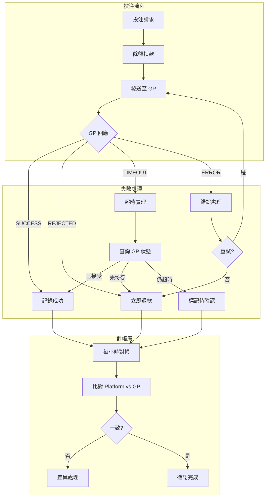

# 02-SW-12 Bet Failure Reconciliation (投注失敗對帳)

**版本**: 1.0.0
**創建日期**: 2026-02-07
**狀態**: ✅ 規範完成
**優先級**: P1 High

---

## 概述

投注失敗對帳處理投注請求失敗、部分成功、超時等異常場景，確保玩家餘額與 GP 記錄一致。

---

## 失敗場景分類

### 場景矩陣

| 場景 | 扣款狀態 | GP 回應 | 處理方式 | 優先級 |
|------|---------|--------|---------|--------|
| **A: 扣款前失敗** | ❌ 未扣款 | 未發送 | 直接拒絕 | Low |
| **B: 扣款後 GP 拒絕** | ✅ 已扣款 | REJECTED | 立即退款 | P0 |
| **C: 扣款後 GP 超時** | ✅ 已扣款 | TIMEOUT | 查詢確認 → 退款/確認 | P0 |
| **D: 扣款後通訊失敗** | ✅ 已扣款 | ERROR | 重試 → 退款 | P0 |
| **E: 部分成功 (Parlay)** | ✅ 已扣款 | PARTIAL | 調整金額 | P1 |

---

## 對帳架構



---

## 數據庫設計

```sql
-- 投注失敗記錄
CREATE TABLE t_bet_failure (
    id                      BIGINT PRIMARY KEY AUTO_INCREMENT,
    player_id               BIGINT NOT NULL,
    bet_request_id          VARCHAR(100) NOT NULL,  -- 平台投注請求 ID

    -- 投注詳情
    game_provider_id        BIGINT NOT NULL,
    game_id                 BIGINT NOT NULL,
    bet_amount              DECIMAL(18,4) NOT NULL,
    currency                VARCHAR(10) NOT NULL,

    -- 失敗詳情
    failure_type            VARCHAR(30) NOT NULL,   -- REJECTED, TIMEOUT, ERROR, PARTIAL
    failure_code            VARCHAR(50),
    failure_message         TEXT,
    gp_response             JSON,

    -- 餘額狀態
    balance_deducted        BOOLEAN NOT NULL,
    deduction_transaction_id BIGINT,
    balance_before          DECIMAL(18,4),
    balance_after_deduction DECIMAL(18,4),

    -- 退款狀態
    refund_required         BOOLEAN NOT NULL,
    refund_status           VARCHAR(20),            -- PENDING, COMPLETED, FAILED
    refund_transaction_id   BIGINT,
    refund_amount           DECIMAL(18,4),
    refunded_at             DATETIME,

    -- GP 確認
    gp_confirmation_status  VARCHAR(20),            -- PENDING, CONFIRMED, NOT_FOUND
    gp_bet_id               VARCHAR(100),
    gp_confirmed_at         DATETIME,

    -- 對帳
    reconciliation_status   VARCHAR(20) NOT NULL,   -- OPEN, RECONCILED, MANUAL
    reconciled_at           DATETIME,

    -- 審計
    created_at              DATETIME DEFAULT CURRENT_TIMESTAMP,
    updated_at              DATETIME DEFAULT CURRENT_TIMESTAMP ON UPDATE CURRENT_TIMESTAMP,

    INDEX idx_player (player_id, created_at DESC),
    INDEX idx_status (failure_type, refund_status),
    INDEX idx_reconciliation (reconciliation_status, created_at)
) ENGINE=InnoDB COMMENT='投注失敗記錄';
```

---

## 處理流程

### 場景 B: GP 拒絕後退款

```java
/**
 * GP 拒絕投注處理
 */
@Transactional(rollbackFor = Throwable.class)
public void handleGpRejection(BetRequest request, GpResponse response) {

    // 1. 記錄失敗
    BetFailure failure = BetFailure.builder()
        .playerId(request.getPlayerId())
        .betRequestId(request.getRequestId())
        .gameProviderId(request.getGpId())
        .betAmount(request.getAmount())
        .failureType("REJECTED")
        .failureCode(response.getErrorCode())
        .failureMessage(response.getErrorMessage())
        .balanceDeducted(true)
        .deductionTransactionId(request.getDeductionTxId())
        .refundRequired(true)
        .refundStatus("PENDING")
        .reconciliationStatus("OPEN")
        .build();

    betFailureDao.insert(failure);

    // 2. 立即退款
    WalletTransaction refund = walletService.refund(
        request.getPlayerId(),
        request.getAmount(),
        "BET_REJECTED",
        request.getRequestId()
    );

    // 3. 更新狀態
    failure.setRefundTransactionId(refund.getId());
    failure.setRefundAmount(request.getAmount());
    failure.setRefundStatus("COMPLETED");
    failure.setRefundedAt(LocalDateTime.now());
    failure.setReconciliationStatus("RECONCILED");
    failure.setReconciledAt(LocalDateTime.now());

    betFailureDao.update(failure);
}
```

### 場景 C: 超時後查詢確認

```java
/**
 * 超時投注處理
 */
@Transactional(rollbackFor = Throwable.class)
public void handleTimeout(BetRequest request) {

    // 1. 記錄超時
    BetFailure failure = BetFailure.builder()
        .playerId(request.getPlayerId())
        .betRequestId(request.getRequestId())
        .failureType("TIMEOUT")
        .balanceDeducted(true)
        .refundRequired(true)  // 假設需要退款
        .refundStatus("PENDING")
        .gpConfirmationStatus("PENDING")
        .reconciliationStatus("OPEN")
        .build();

    betFailureDao.insert(failure);

    // 2. 查詢 GP 確認
    GpBetStatus gpStatus = gpClient.queryBetStatus(
        request.getGpId(),
        request.getRequestId()
    );

    if (gpStatus.isAccepted()) {
        // GP 已接受，不需退款
        failure.setGpConfirmationStatus("CONFIRMED");
        failure.setGpBetId(gpStatus.getBetId());
        failure.setRefundRequired(false);
        failure.setRefundStatus(null);
        failure.setReconciliationStatus("RECONCILED");
    } else if (gpStatus.isNotFound()) {
        // GP 未收到，需退款
        failure.setGpConfirmationStatus("NOT_FOUND");
        processRefund(failure, request.getAmount());
    } else {
        // 仍不確定，標記待處理
        failure.setGpConfirmationStatus("PENDING");
        // 留給定時對帳任務處理
    }

    betFailureDao.update(failure);
}
```

---

## 對帳查詢

```sql
-- 未完成的投注失敗對帳
SELECT
    bf.id,
    bf.player_id,
    bf.bet_request_id,
    bf.bet_amount,
    bf.failure_type,
    bf.balance_deducted,
    bf.refund_status,
    bf.gp_confirmation_status,
    bf.reconciliation_status,
    TIMESTAMPDIFF(MINUTE, bf.created_at, NOW()) AS age_minutes
FROM t_bet_failure bf
WHERE bf.reconciliation_status = 'OPEN'
ORDER BY bf.created_at;

-- 需要人工處理的失敗
SELECT
    bf.*,
    pw.cash_balance AS current_balance
FROM t_bet_failure bf
JOIN t_player_wallet pw ON bf.player_id = pw.player_id
WHERE bf.reconciliation_status = 'OPEN'
  AND bf.created_at < DATE_SUB(NOW(), INTERVAL 1 HOUR)
  AND (bf.refund_status = 'PENDING' OR bf.gp_confirmation_status = 'PENDING');
```

---

## 監控指標

```yaml
metrics:
  - name: bet_failure_count
    type: counter
    description: 投注失敗數量
    labels: [failure_type, game_provider]

  - name: bet_failure_refund_success_rate
    type: gauge
    description: 投注失敗退款成功率
    target: ">= 99.9%"

  - name: bet_failure_resolution_time_p95
    type: histogram
    description: 投注失敗處理時間 (P95)
    unit: seconds
    target: "< 60s"
    buckets: [5, 10, 30, 60, 120, 300]

  - name: bet_failure_open_count
    type: gauge
    description: 未解決的投注失敗數量
    alert:
      - condition: value > 10
        severity: warning
        message: "存在未解決的投注失敗"
```

---

## 相關文檔

- [02-SW-03_Recovery.md](02-SW-03_Recovery.md) - 錯誤恢復
- [02-SW-13_Rollback_Chain_Reconciliation.md](02-SW-13_Rollback_Chain_Reconciliation.md) - 回滾鏈對帳
- [02-SW-14_GP_Timeout_Framework.md](02-SW-14_GP_Timeout_Framework.md) - GP 超時框架

---

## 版本歷史

| 版本 | 日期 | 變更內容 |
|------|------|---------|
| 1.0.0 | 2026-02-07 | 初始版本：投注失敗場景分類、處理流程、對帳查詢 |

---

**返回**: [Seamless Wallet](README.md) | [財務中心](../README.md)
