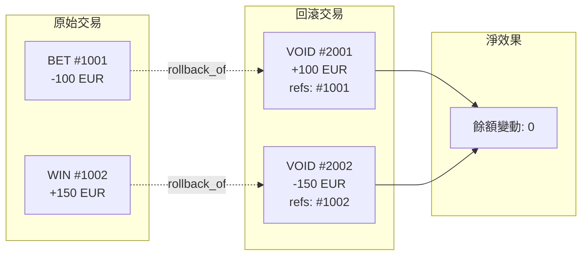

# 02-SW-13 Rollback Chain Reconciliation (回滾鏈對帳)

**版本**: 1.0.0
**創建日期**: 2026-02-07
**狀態**: ✅ 規範完成
**優先級**: P1 High

---

## 概述

回滾鏈對帳追蹤和驗證 GP 發起的回滾操作，確保原始交易與回滾交易的因果關係正確，防止重複回滾和餘額洩漏。

---

## 回滾類型

| 類型 | 觸發方 | 原因 | 時效 |
|------|--------|------|------|
| **VOID** | GP | 遊戲取消/錯誤 | 通常 24 小時內 |
| **REFUND** | GP | 玩家爭議 | 可達 30 天 |
| **CORRECTION** | GP | 結算錯誤 | 不限 |
| **CANCEL** | Platform | 系統錯誤 | 即時 |

---

## 回滾鏈模型



---

## 數據庫設計

```sql
-- 回滾鏈記錄
CREATE TABLE t_rollback_chain (
    id                      BIGINT PRIMARY KEY AUTO_INCREMENT,
    player_id               BIGINT NOT NULL,

    -- 回滾交易
    rollback_transaction_id BIGINT NOT NULL,
    rollback_type           VARCHAR(20) NOT NULL,  -- VOID, REFUND, CORRECTION, CANCEL
    rollback_amount         DECIMAL(18,4) NOT NULL,
    rollback_reason         VARCHAR(200),

    -- 原始交易
    original_transaction_id BIGINT NOT NULL,
    original_transaction_type VARCHAR(20) NOT NULL,
    original_amount         DECIMAL(18,4) NOT NULL,
    original_timestamp      DATETIME NOT NULL,

    -- GP 資訊
    game_provider_id        BIGINT NOT NULL,
    gp_rollback_id          VARCHAR(100),
    gp_original_bet_id      VARCHAR(100),

    -- 驗證
    amount_matched          BOOLEAN AS (ABS(rollback_amount) = ABS(original_amount)) STORED,
    chain_status            VARCHAR(20) NOT NULL,  -- VALID, MISMATCH, DUPLICATE, ORPHAN

    -- 對帳
    reconciled              BOOLEAN DEFAULT FALSE,
    reconciled_at           DATETIME,

    -- 審計
    created_at              DATETIME DEFAULT CURRENT_TIMESTAMP,

    INDEX idx_player (player_id, created_at DESC),
    INDEX idx_original (original_transaction_id),
    INDEX idx_status (chain_status, reconciled)
) ENGINE=InnoDB COMMENT='回滾鏈記錄';
```

---

## 驗證規則

### 回滾鏈完整性檢查

```java
/**
 * 回滾請求處理
 */
@Transactional(rollbackFor = Throwable.class)
public RollbackResult processRollback(RollbackRequest request) {

    // 1. 查找原始交易
    Option<WalletTransaction> originalOpt = walletTransactionDao
        .findByGpBetId(request.getOriginalBetId());

    if (originalOpt.isEmpty()) {
        return RollbackResult.orphan("Original transaction not found");
    }

    WalletTransaction original = originalOpt.get();

    // 2. 檢查是否已回滾
    boolean alreadyRolledBack = rollbackChainDao
        .existsByOriginalTransactionId(original.getId());

    if (alreadyRolledBack) {
        return RollbackResult.duplicate("Already rolled back");
    }

    // 3. 驗證金額
    if (!request.getAmount().abs().equals(original.getAmount().abs())) {
        log.warn("Rollback amount mismatch: {} vs {}",
            request.getAmount(), original.getAmount());
        // 仍處理，但標記為 MISMATCH
    }

    // 4. 執行回滾
    WalletTransaction rollbackTx = walletService.rollback(
        original.getPlayerId(),
        original.getAmount(),
        request.getReason(),
        original.getId()
    );

    // 5. 記錄回滾鏈
    RollbackChain chain = RollbackChain.builder()
        .playerId(original.getPlayerId())
        .rollbackTransactionId(rollbackTx.getId())
        .rollbackType(request.getType())
        .rollbackAmount(rollbackTx.getAmount())
        .rollbackReason(request.getReason())
        .originalTransactionId(original.getId())
        .originalTransactionType(original.getTransactionType())
        .originalAmount(original.getAmount())
        .originalTimestamp(original.getCreatedAt())
        .gameProviderId(request.getGpId())
        .gpRollbackId(request.getGpRollbackId())
        .gpOriginalBetId(request.getOriginalBetId())
        .chainStatus(determineChainStatus(request, original))
        .build();

    rollbackChainDao.insert(chain);

    return RollbackResult.success(chain);
}
```

---

## 對帳查詢

```sql
-- 回滾鏈完整性檢查
SELECT
    rc.id,
    rc.player_id,
    rc.rollback_type,
    rc.rollback_amount,
    rc.original_amount,
    rc.amount_matched,
    rc.chain_status,
    CASE
        WHEN rc.chain_status = 'ORPHAN' THEN '孤立回滾：找不到原始交易'
        WHEN rc.chain_status = 'DUPLICATE' THEN '重複回滾：原始交易已回滾'
        WHEN rc.chain_status = 'MISMATCH' THEN '金額不符：回滾金額與原始不同'
        ELSE '正常'
    END AS issue_description
FROM t_rollback_chain rc
WHERE rc.chain_status != 'VALID'
  AND rc.created_at >= DATE_SUB(NOW(), INTERVAL 7 DAY);

-- 未匹配回滾的原始交易
SELECT
    wt.id AS original_tx_id,
    wt.player_id,
    wt.amount,
    wt.transaction_type,
    wt.created_at,
    TIMESTAMPDIFF(HOUR, wt.created_at, NOW()) AS age_hours
FROM t_wallet_transaction wt
LEFT JOIN t_rollback_chain rc ON wt.id = rc.original_transaction_id
WHERE wt.transaction_type = 'BET'
  AND wt.status = 'VOIDED'  -- GP 標記為 VOID
  AND rc.id IS NULL          -- 但平台無回滾記錄
  AND wt.created_at >= DATE_SUB(NOW(), INTERVAL 24 HOUR);
```

---

## 監控指標

```yaml
metrics:
  - name: rollback_chain_count
    type: counter
    description: 回滾鏈記錄數
    labels: [rollback_type, chain_status]

  - name: rollback_duplicate_rate
    type: gauge
    description: 重複回滾請求率
    target: "< 0.1%"
    alert:
      - condition: value > 1
        severity: warning
        message: "重複回滾請求異常增加"

  - name: rollback_orphan_count
    type: gauge
    description: 孤立回滾數量
    alert:
      - condition: value > 0
        severity: critical
        message: "存在孤立回滾，可能導致餘額洩漏"

  - name: rollback_mismatch_count
    type: gauge
    description: 金額不符的回滾數
    alert:
      - condition: value > 5
        severity: warning
```

---

## 相關文檔

- [02-SW-12_Bet_Failure_Reconciliation.md](02-SW-12_Bet_Failure_Reconciliation.md) - 投注失敗對帳
- [02-SW-03_Recovery.md](02-SW-03_Recovery.md) - 錯誤恢復

---

## 版本歷史

| 版本 | 日期 | 變更內容 |
|------|------|---------|
| 1.0.0 | 2026-02-07 | 初始版本：回滾鏈模型、驗證規則、對帳查詢 |

---

**返回**: [Seamless Wallet](README.md) | [財務中心](../README.md)
