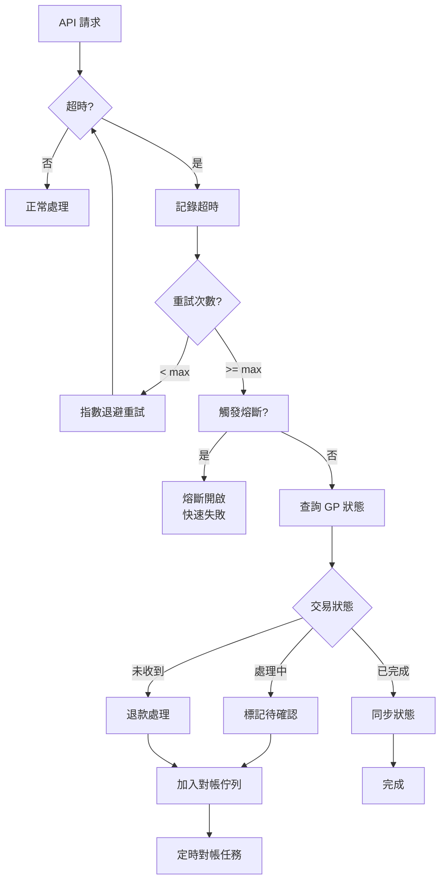

# 02-SW-14 GP Timeout Framework (GP 超時對帳框架)

**版本**: 1.0.0
**創建日期**: 2026-02-07
**狀態**: ✅ 規範完成
**優先級**: P1 High

---

## 概述

GP 超時框架定義與遊戲供應商通訊超時的處理策略，包括重試機制、狀態查詢、自動恢復和對帳驗證。

---

## 超時場景

| 場景 | 超時點 | 影響 | 處理策略 |
|------|--------|------|---------|
| **Bet Request** | 投注請求 | 扣款後無確認 | 查詢 → 退款 |
| **Result Submit** | 結果提交 | 派彩未入帳 | 重試 → 人工 |
| **Rollback Request** | 回滾請求 | 餘額不一致 | 重試 → 對帳 |
| **Balance Query** | 餘額查詢 | 同步失敗 | 快取 → 重試 |

---

## 超時配置

```yaml
GP Timeout Configuration:
  Default:
    connect_timeout: 5s
    read_timeout: 30s
    retry_count: 3
    retry_backoff: [1s, 3s, 10s]

  Per-GP Overrides:
    PragmaticPlay:
      read_timeout: 45s  # 複雜遊戲邏輯
    Evolution:
      read_timeout: 60s  # 真人遊戲延遲
    Betsoft:
      retry_count: 5     # 不穩定連線

  Circuit Breaker:
    failure_threshold: 5
    reset_timeout: 60s
    half_open_requests: 3
```

---

## 處理流程



---

## 數據庫設計

```sql
-- GP 超時記錄
CREATE TABLE t_gp_timeout_log (
    id                      BIGINT PRIMARY KEY AUTO_INCREMENT,
    request_id              VARCHAR(100) NOT NULL,
    player_id               BIGINT NOT NULL,
    game_provider_id        BIGINT NOT NULL,

    -- 請求詳情
    request_type            VARCHAR(30) NOT NULL,  -- BET, RESULT, ROLLBACK, BALANCE
    request_payload         JSON,
    request_timestamp       DATETIME NOT NULL,

    -- 超時詳情
    timeout_type            VARCHAR(20) NOT NULL,  -- CONNECT, READ, WRITE
    timeout_ms              INT NOT NULL,
    retry_count             INT DEFAULT 0,

    -- 恢復狀態
    recovery_status         VARCHAR(20) NOT NULL,  -- PENDING, RESOLVED, FAILED
    recovery_action         VARCHAR(30),           -- RETRY, REFUND, SYNC, MANUAL
    gp_confirmed_status     VARCHAR(20),           -- ACCEPTED, NOT_FOUND, PROCESSING

    -- 對帳
    reconciliation_id       BIGINT,
    reconciled_at           DATETIME,

    -- 審計
    created_at              DATETIME DEFAULT CURRENT_TIMESTAMP,
    resolved_at             DATETIME,

    INDEX idx_player (player_id, created_at DESC),
    INDEX idx_gp (game_provider_id, created_at),
    INDEX idx_status (recovery_status, request_type)
) ENGINE=InnoDB COMMENT='GP 超時記錄';

-- GP 熔斷狀態
CREATE TABLE t_gp_circuit_breaker (
    id                  BIGINT PRIMARY KEY AUTO_INCREMENT,
    game_provider_id    BIGINT NOT NULL,

    -- 熔斷狀態
    state               VARCHAR(20) NOT NULL,  -- CLOSED, OPEN, HALF_OPEN
    failure_count       INT DEFAULT 0,
    last_failure_at     DATETIME,
    opened_at           DATETIME,
    half_opened_at      DATETIME,

    -- 恢復嘗試
    success_count       INT DEFAULT 0,
    recovery_requests   INT DEFAULT 0,

    updated_at          DATETIME DEFAULT CURRENT_TIMESTAMP ON UPDATE CURRENT_TIMESTAMP,

    UNIQUE KEY uk_gp (game_provider_id)
) ENGINE=InnoDB COMMENT='GP 熔斷狀態';
```

---

## Java 實現

```java
/**
 * GP 超時處理服務
 */
@Service
@RequiredArgsConstructor
@Slf4j
public class GpTimeoutService {

    private final GpTimeoutLogDao timeoutLogDao;
    private final CircuitBreakerRegistry circuitBreakerRegistry;
    private final GpApiClient gpClient;
    private final WalletService walletService;

    /**
     * 處理投注超時
     */
    @Transactional(rollbackFor = Throwable.class)
    public TimeoutResult handleBetTimeout(BetRequest request, TimeoutException ex) {

        // 1. 記錄超時
        GpTimeoutLog log = GpTimeoutLog.builder()
            .requestId(request.getRequestId())
            .playerId(request.getPlayerId())
            .gameProviderId(request.getGpId())
            .requestType("BET")
            .requestPayload(JsonUtil.toJson(request))
            .timeoutType(ex.getTimeoutType())
            .timeoutMs(ex.getTimeoutMs())
            .retryCount(request.getRetryCount())
            .recoveryStatus("PENDING")
            .build();

        timeoutLogDao.insert(log);

        // 2. 更新熔斷器
        CircuitBreaker cb = circuitBreakerRegistry.get(request.getGpId());
        cb.recordFailure();

        // 3. 嘗試查詢 GP 狀態
        if (!cb.isOpen()) {
            try {
                GpBetStatus status = gpClient.queryBetStatus(
                    request.getGpId(), request.getRequestId());

                if (status.isAccepted()) {
                    log.setRecoveryStatus("RESOLVED");
                    log.setRecoveryAction("SYNC");
                    log.setGpConfirmedStatus("ACCEPTED");
                    log.setResolvedAt(LocalDateTime.now());
                    timeoutLogDao.update(log);

                    return TimeoutResult.confirmed();
                } else if (status.isNotFound()) {
                    // GP 未收到，退款
                    processRefund(request, log);
                    return TimeoutResult.refunded();
                }
            } catch (Exception queryEx) {
                log.warn("Failed to query GP status", queryEx);
            }
        }

        // 4. 無法確認，加入對帳佇列
        log.setRecoveryAction("MANUAL");
        timeoutLogDao.update(log);

        return TimeoutResult.pendingReconciliation();
    }

    /**
     * 定時對帳任務
     */
    @Scheduled(fixedRate = 300000) // 5 分鐘
    public void reconcileTimeouts() {
        List<GpTimeoutLog> pending = timeoutLogDao.findPending();

        for (GpTimeoutLog log : pending) {
            try {
                GpBetStatus status = gpClient.queryBetStatus(
                    log.getGameProviderId(), log.getRequestId());

                if (status.isAccepted()) {
                    log.setRecoveryStatus("RESOLVED");
                    log.setGpConfirmedStatus("ACCEPTED");
                } else if (status.isNotFound()) {
                    // 超過 1 小時未確認，自動退款
                    if (log.getCreatedAt().isBefore(LocalDateTime.now().minusHours(1))) {
                        BetRequest request = JsonUtil.fromJson(
                            log.getRequestPayload(), BetRequest.class);
                        processRefund(request, log);
                    }
                }

                log.setResolvedAt(LocalDateTime.now());
                timeoutLogDao.update(log);
            } catch (Exception ex) {
                log.error("Failed to reconcile timeout: {}", log.getId(), ex);
            }
        }
    }
}
```

---

## 對帳查詢

```sql
-- 未解決的超時記錄
SELECT
    t.id,
    t.player_id,
    gp.game_provider_name,
    t.request_type,
    t.timeout_type,
    t.retry_count,
    t.recovery_status,
    TIMESTAMPDIFF(MINUTE, t.created_at, NOW()) AS age_minutes
FROM t_gp_timeout_log t
JOIN t_game_provider gp ON t.game_provider_id = gp.id
WHERE t.recovery_status = 'PENDING'
ORDER BY t.created_at;

-- GP 超時統計 (過去 24 小時)
SELECT
    gp.game_provider_name,
    t.request_type,
    COUNT(*) AS timeout_count,
    AVG(t.timeout_ms) AS avg_timeout_ms,
    SUM(CASE WHEN t.recovery_status = 'RESOLVED' THEN 1 ELSE 0 END) AS resolved_count,
    SUM(CASE WHEN t.recovery_status = 'FAILED' THEN 1 ELSE 0 END) AS failed_count
FROM t_gp_timeout_log t
JOIN t_game_provider gp ON t.game_provider_id = gp.id
WHERE t.created_at >= DATE_SUB(NOW(), INTERVAL 24 HOUR)
GROUP BY gp.game_provider_name, t.request_type;
```

---

## 監控指標

```yaml
metrics:
  - name: gp_timeout_count
    type: counter
    description: GP 超時次數
    labels: [game_provider, request_type, timeout_type]

  - name: gp_timeout_recovery_rate
    type: gauge
    description: GP 超時恢復成功率
    target: ">= 95%"
    labels: [game_provider]

  - name: gp_circuit_breaker_state
    type: gauge
    description: GP 熔斷器狀態 (0=CLOSED, 1=HALF_OPEN, 2=OPEN)
    labels: [game_provider]
    alert:
      - condition: value == 2
        severity: warning
        message: "GP {game_provider} 熔斷器開啟"

  - name: gp_timeout_pending_count
    type: gauge
    description: 待對帳的超時記錄數
    alert:
      - condition: value > 20
        severity: warning
```

---

## 相關文檔

- [02-SW-12_Bet_Failure_Reconciliation.md](02-SW-12_Bet_Failure_Reconciliation.md) - 投注失敗對帳
- [02-SW-03_Recovery.md](02-SW-03_Recovery.md) - 錯誤恢復

---

## 版本歷史

| 版本 | 日期 | 變更內容 |
|------|------|---------|
| 1.0.0 | 2026-02-07 | 初始版本：超時框架、熔斷機制、對帳流程 |

---

**返回**: [Seamless Wallet](README.md) | [財務中心](../README.md)
