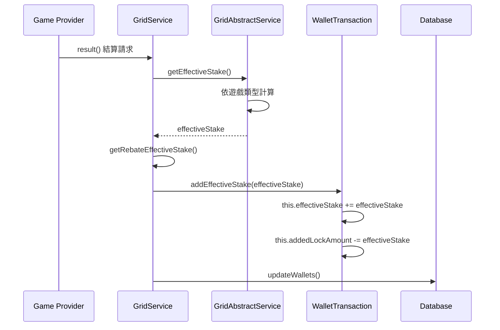
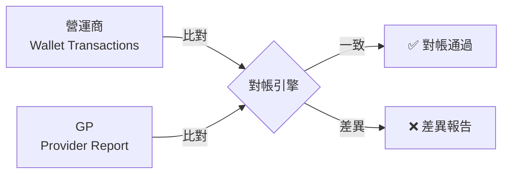
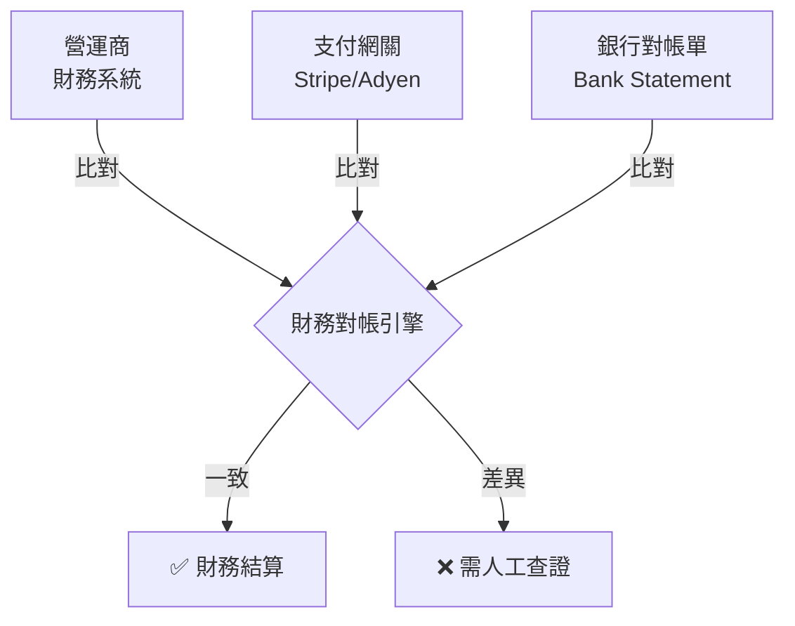
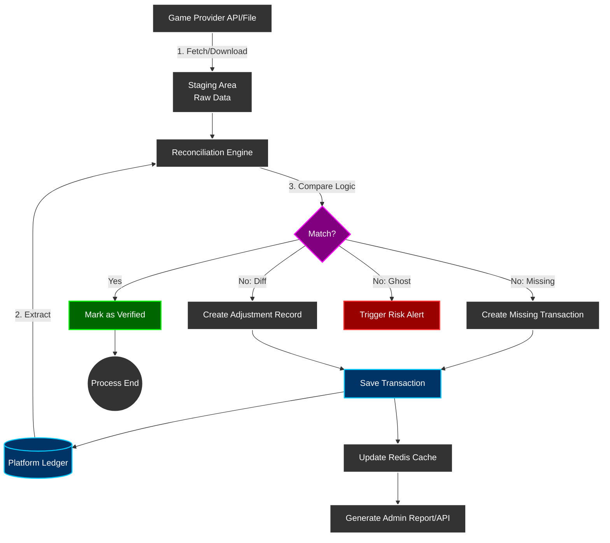
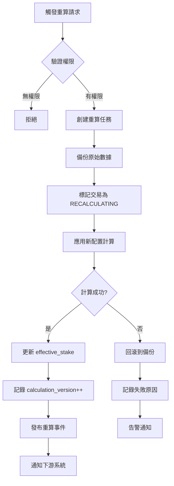

# 03-04-03 對帳模型 (Reconciliation Model)

<!-- SSOT: Authoritative definition of Valid Bet Calculation, Free Spins Turnover, Cross-Module Consistency, and Game Reconciliation -->

> **父文檔**: [03-04 流水計算與遊戲對帳](./03-04_Turnover_Calculation.md)
>
> **三層風控架構定位**: 本子文檔定義有效投注計算、免費旋轉流水、跨模組一致性保障與遊戲對帳邏輯。
>
> **創建日期**: 2026-02-07
> **最後更新**: 2026-02-07
> **版本**: 4.0.0

---

## 5. 有效投注計算 (Valid Bet Calculation)

### 5.1 計算時機

<!-- SSOT: Valid Bet calculation timing -->

**核心規則**: 有效投注**僅在結算時**計算，下注時不計算。

**時序圖**:



### 5.2 各遊戲類型計算公式

<!-- SSOT: Game-specific valid bet formulas -->

| 遊戲類型 | 條件 | effectiveStake 公式 |
|----------|------|---------------------|
| **SPORTS / E-SPORTS** | - | `|winAmount + lossAmount|` |
| **CASINO** | 和局 (payout == betAmount) | `0` |
| **CASINO** | 贏錢 (winAmount > 0) | `min(winAmount, betAmount)` |
| **CASINO** | 輸錢 (winAmount == 0) | `betAmount` |
| **其他類型** | - | `betAmount` |

**實現代碼**:

```typescript
/**
 * 計算有效投注額 (Effective Stake)
 * 位置: GridAbstractService.java:171-193
 */
function getEffectiveStake(bet: Transaction): number {
  const gameType = bet.gameType;
  const betAmount = bet.betAmount;
  const payout = bet.payout;
  const winAmount = payout - betAmount;
  const lossAmount = betAmount - payout;

  // 體育類：絕對值 (winAmount + lossAmount)
  if (gameType === 'SPORTS' || gameType === 'E_SPORTS') {
    return Math.abs(winAmount + lossAmount);
  }

  // 娛樂場類
  if (gameType === 'CASINO') {
    // 和局：0
    if (payout === betAmount) {
      return 0;
    }
    // 贏錢：取 min(winAmount, betAmount)
    if (winAmount > 0) {
      return Math.min(winAmount, betAmount);
    }
    // 輸錢：betAmount
    return betAmount;
  }

  // 其他類型：betAmount
  return betAmount;
}
```

### 5.3 effectiveStake 與 lockAmount 的關係

**關鍵規則**: effectiveStake 增加時，lockAmount 減少相同金額。

```typescript
/**
 * 累加有效投注並調整 lockAmount
 * 位置: WalletTransaction.java:119-125
 */
function addEffectiveStake(amount: number): void {
  this.effectiveStake += amount;
  this.addedLockAmount -= amount; // lockAmount 減少

  log.info(`[Wallet] effectiveStake=${this.effectiveStake}, lockAmount=${this.lockAmount}`);
}
```

**範例**:
- Before: lockAmount=500, effectiveStake=100
- 投注結算產生 effectiveStake=200
- After: lockAmount=300, effectiveStake=300

---

## 6. 免費旋轉流水計算 (Free Spins Turnover Calculation)

<!-- SSOT: Free Spins Turnover = Face Value, Valid Bet = 0 -->

### 6.1 核心原則

**關鍵概念**: 免費旋轉的 **Turnover** 與 **Valid Bet** 必須分開處理，用途完全不同。

| 指標 | 定義 | 計算方式 | 用途 |
|------|------|---------|------|
| **Turnover** | 遊戲中流動的金額總和 | **免費旋轉面額總和** | 財務報表、GGR 計算 |
| **Valid Bet** | 計入流水要求的金額 | **0 (不計入)** | 優惠活動、返水計算 |

**為何 Turnover ≠ 0？**

```yaml
場景: 贈送 10 次免費旋轉，每次面額 $1
遊戲結果: 玩家贏了 $8.50

❌ 錯誤計算 (Turnover = 0):
  Turnover = $0
  Payout = $8.50
  GGR = $0 - $8.50 = -$8.50  ← 看起來像虧損

✅ 正確計算 (Turnover = 面額總和):
  Turnover = $10.00
  Payout = $8.50
  GGR = $10.00 - $8.50 = $1.50  ← 促銷淨成本
```

### 6.2 業界標準

所有主流遊戲供應商均採用此邏輯:

| 供應商 | Turnover | Valid Bet | 依據 |
|-------|----------|-----------|------|
| **Evolution Gaming** | ✅ 面額總和 | 0 | 官方 API 文檔 |
| **Pragmatic Play** | ✅ 面額總和 | 0 | 官方 API 文檔 |
| **Hub88 (Aggregator)** | ✅ 面額總和 | 0 | 技術白皮書 |

**上市公司財報範例** (Evolution Gaming Annual Report 2023):
```yaml
"Free spins provided to players are recorded as:
 - Turnover: At the face value of the free spin
 - Payout: At the actual win amount
 - Marketing Expense: Net cost (face value - payout)"
```

### 6.3 GGR 計算實現

```typescript
/**
 * 計算 GGR (包含免費旋轉成本)
 */
public calculateGGR(date: LocalDate): GgrReport {
    const transactions = this.transactionRepository.findByDate(date);

    let totalTurnover = 0;
    let totalPayout = 0;
    let freespinTurnover = 0;  // 促銷成本追蹤

    for (const tx of transactions) {
        // Turnover 計算 (包含免費旋轉面額)
        if (tx.transactionType.endsWith('_BET')) {
            totalTurnover += tx.turnover;

            if (tx.isFreeRpin) {
                freespinTurnover += tx.turnover;  // ✅ 記錄促銷成本
            }
        }

        // Payout 計算
        if (tx.transactionType.endsWith('_WIN')) {
            totalPayout += tx.amount;
        }
    }

    // GGR = Turnover - Payout
    const ggr = totalTurnover - totalPayout;

    return {
        date,
        totalTurnover,
        freespinTurnover,      // 促銷成本
        cashTurnover: totalTurnover - freespinTurnover,
        totalPayout,
        ggr
    };
}
```

### 6.4 關鍵決策總結

✅ **推薦方案**: Turnover = 面額總和, Valid Bet = 0

**理由**:
1. **財務準確性**: 正確反映促銷成本
2. **GGR 計算**: 符合會計準則
3. **業界標準**: 所有主流 GP 都採用此邏輯
4. **上市合規**: 符合財報披露要求

---

## 7. 跨模組流水一致性保障 (Cross-Module Turnover Consistency)

### 7.1 三層驗證架構中的財務層定位

財務模組負責 **Layer 2: Status-Based Turnover Adjustment**，在Risk Engine基礎驗證之上應用狀態因子。

**關鍵原則**: 每層僅負責自己的職責，拒絕決策由Layer 1統一處理，後續層級僅做數值調整。

**三層架構職責劃分** (v2.0.0 ✅):

```
┌─────────────────────────────────────────────────────────────────────────────┐
│                   Unified Turnover Validation Stack                         │
├─────────────────────────────────────────────────────────────────────────────┤
│                                                                             │
│  Layer 1: Risk Validation (Risk Engine - 05-01)                            │
│  ┌─────────────────────────────────────────────────────────────┐           │
│  │ 職責: 拒絕決策 (Rejection Decision)                         │           │
│  │ 檢查: Hedge/Arbitrage/Low Odds/同 IP 對沖                   │           │
│  │ 輸出: { is_valid: boolean, effective_turnover_base: number }│           │
│  │                                                             │           │
│  │ ❌ is_valid = false → 直接返回 0 (不進入 Layer 2/3)        │           │
│  │ ✅ is_valid = true  → 返回 effective_turnover_base         │           │
│  └─────────────────────────────────────────────────────────────┘           │
│                           ↓ (僅當 is_valid = true 時)                       │
│  Layer 2: Finance Layer (THIS MODULE - 02-04) ✅                           │
│  ┌─────────────────────────────────────────────────────────────┐           │
│  │ 職責: 狀態因子調整 (Status Factor Adjustment)              │           │
│  │ 檢查: WIN/LOSS/DRAW/CANCEL/HALF_WIN/HALF_LOSS               │           │
│  │ 輸出: valid_turnover_finance                                │           │
│  │     = effective_turnover_base × status_factor              │           │
│  │                                                             │           │
│  │ ⚠️ 不負責拒絕決策 (No Rejection Logic Here)                │           │
│  └─────────────────────────────────────────────────────────────┘           │
│                           ↓                                                 │
│  Layer 3: Activity Layer (04-01)                                           │
│  ┌─────────────────────────────────────────────────────────────┐           │
│  │ 職責: 遊戲權重應用 (Game Weight Adjustment)                │           │
│  │ 檢查: SLOTS/SPORTS/BACCARAT/LOTTERY 等遊戲類型             │           │
│  │ 輸出: activity_valid_turnover                               │           │
│  │     = valid_turnover_finance × game_weight                 │           │
│  │                                                             │           │
│  │ ⚠️ 不負責拒絕決策 (No Rejection Logic Here)                │           │
│  └─────────────────────────────────────────────────────────────┘           │
│                                                                             │
└─────────────────────────────────────────────────────────────────────────────┘
```

### 7.2 與活動系統的數據交換

財務模組計算完成後，需將 `valid_turnover_finance` 發布至事件總線供活動系統使用:

```typescript
// Publish finance turnover result to Kafka
await kafkaProducer.send({
  topic: 'finance.turnover.calculated',
  messages: [{
    key: bet.player_id,
    value: JSON.stringify({
      bet_id: bet.id,
      player_id: bet.player_id,
      game_type: bet.game_type,
      effective_turnover_base: effective_turnover_base,
      valid_turnover_finance: valid_turnover_finance,
      status: bet.status,
      status_factor: status_factor,
      timestamp: new Date().toISOString()
    })
  }]
});
```

**活動系統訂閱此事件**後，在 `valid_turnover_finance` 基礎上應用遊戲權重:
```typescript
// Activity System consumes this event
const activity_valid_turnover = message.valid_turnover_finance * GAME_WEIGHTS[message.game_type];
```

### 7.3 每日對帳驗證程序

**執行時間**: 每日凌晨 03:00 (UTC+8)

**偏差閾值設定依據** (v2.0.0):

| 偏差範圍 | 閾值設定 | 業務影響分析 | 設定依據 |
|---------|---------|-------------|---------|
| **< 0.01%** | 可接受範圍 | 幾乎無影響 (單個玩家每日流水 $1000 → 偏差 $0.1) | 浮點數精度誤差、時區轉換誤差、遊戲權重配置微調 |
| **0.01% - 1%** | 警告區間 | 中等影響 (可能是配置錯誤) | 遊戲權重配置錯誤、狀態因子映射錯誤、對帳時間窗口不一致 |
| **> 1%** | 緊急區間 | 嚴重影響 (資金風險) | 系統 Bug、數據丟失、惡意攻擊、雙重扣款 |

**計算範例**:
```
假設玩家日流水 = $10,000
0.01% 偏差 = $1 (可接受)
1% 偏差 = $100 (需警報)
10% 偏差 = $1,000 (緊急)

業界標準: 大部分 iGaming 平台採用 0.01%-0.1% 作為自動驗證閾值
SmartAdmin 選擇: 0.01% (更嚴格,降低風險)
```

### 7.4 配置同步要求

財務模組與活動模組必須從 **統一配置中心 (Unified Config Service)** 讀取以下參數，禁止本地硬編碼:

1. **賠率門檻 (Odds Thresholds)** - 由 Risk Engine 定義：
```json
{
  "odds_thresholds": {
    "EUR": 1.5,  // European decimal odds
    "HK": 0.5,   // Hong Kong odds
    "MY": 0.5,   // Malay odds
    "ID": 1.2    // Indonesian odds
  }
}
```

2. **遊戲權重表 (Game Weights)** - 由活動模組定義：
```json
{
  "game_weights": {
    "SLOTS": 1.0,
    "SPORTS": 1.0,
    "BACCARAT": 0.15,
    "BLACKJACK": 0.10,
    "ROULETTE": 0.20,
    "VIDEO_POKER": 0.15,
    "LOTTERY": 0.10,
    "PVP": 0.0
  }
}
```

3. **狀態因子表 (Status Factors)** - 由財務模組定義與維護：
```json
{
  "status_factors": {
    "WIN": 1.0,
    "LOSS": 1.0,
    "DRAW": 0.0,
    "TIE": 0.0,
    "VOID": 0.0,
    "CANCEL": 0.0,
    "HALF_WIN": 1.0,
    "HALF_LOSS": 1.0,
    "RUNNING": 0.0
  }
}
```

### 7.5 監控指標與 SLA

**關鍵監控指標**:
- `finance.turnover.calculation.latency_p99` < 100ms
- `finance.turnover.risk_engine.call.success_rate` > 99.9%
- `finance.turnover.daily_reconciliation.deviation_rate` < 0.01%
- `finance.turnover.event_publish.success_rate` > 99.99%

**警報規則**:
```yaml
alerts:
  - name: turnover_calculation_latency_high
    condition: finance.turnover.calculation.latency_p99 > 500ms
    severity: WARNING
    notify: slack:#finance-ops

  - name: risk_engine_call_failure
    condition: finance.turnover.risk_engine.call.success_rate < 99%
    severity: CRITICAL
    notify: pagerduty:finance-oncall

  - name: daily_reconciliation_deviation
    condition: finance.turnover.daily_reconciliation.deviation_rate > 0.01
    severity: WARNING
    notify: slack:#finance-ops, email:finance-team@company.com

  - name: event_publish_failure
    condition: finance.turnover.event_publish.success_rate < 99.9
    severity: CRITICAL
    notify: pagerduty:finance-oncall
```

---

## 8. 遊戲對帳計算邏輯 (Game Reconciliation Logic)

### 8.1 對帳模型分類

<!-- SSOT: 2-Party vs 3-Party Reconciliation Models -->

**核心區分**: 遊戲交易對帳（雙方）vs 存提款對帳（三方）

#### 模型 1: 遊戲交易對帳（雙方對帳）



**涉及**:
- 方 1：營運商帳本
- 方 2：供應商報表

**資金性質**: 虛擬貨幣（遊戲積分）
**對帳頻率**: 實時/每小時
**匹配欄位**: transaction_id
**差異原因**: API 超時、掉單

#### 模型 2: 存提款對帳（三方對帳）



**涉及**:
- 方 1：營運商財務系統
- 方 2：支付網關
- 方 3：銀行對帳單

**資金性質**: 真實貨幣（法幣）
**對帳頻率**: 每日/每週
**匹配欄位**: 金額 + 時間
**差異原因**: 銀行延遲、手續費

### 8.2 三層對帳體系

#### Layer 1: 即時串流對帳 (Real-time Stream Check)

- **時機**：每次收到 `GameEnd` 或 `Settlement` Webhook 後 1-5 分鐘
- **機制**：
    - 透過 GP API 查詢單筆詳情 (`GetTransactionStatus`)
    - 比對 `Amount`, `Status`, `WinLoss`
    - **目的**：快速修復即時掉單 (Latency Issue)

#### Layer 2: 準即時週期對帳 (Near Real-time Batch)

- **時機**：每 10-30 分鐘執行一次
- **機制**：
    - 呼叫 GP 的 `FetchHistory` API (依時間區間 Time Range)
    - 拉取過去 30 分鐘的所有注單
    - 與 DB 進行 `Anti-Join` (找出 GP 有但 DB 無的單)
    - **目的**：補錄 Callback 丟失的注單 (Self-Healing)

#### Layer 3: T+1 全量日結對帳 (Daily Final Settlement)

- **時機**：每日凌晨 (e.g. 02:00)，GP 產出昨日完整報表後
- **機制**：
    - 下載 GP 提供的 Settlement Files (CSV/XML/JSON)
    - 將數據載入 Staging Table
    - 執行 `Full Outer Join` 比對：
        1.  **GP 有，DB 無** -> 補單 (Recover)
        2.  **GP 無，DB 有** -> 標記異常 (Invalid/Rollback)，需人工確認
        3.  **金額不符** -> 產出 `DiffReport`，以 GP 最終結算金額為準進行調帳

### 8.3 異常處理矩陣

| 異常情境 | 系統行為 | 處置方式 |
| :--- | :--- | :--- |
| **補單 (Recover)** | 發現 GP 有單但 DB 無 | 自動建立注單，補扣/補發金額，記錄 Source="Reconciliation" |
| **金額差異 (Diff)** | 雙方金額不一致 | 若差異 < 容差 (e.g. 0.01)，自動平帳；否則 Alert |
| **狀態衝突 (Conflict)** | DB=Win, GP=Loss | 以 **GP 報表** 為準，執行 `Reverse + Re-settle` |
| **幽靈單 (Ghost)** | DB 有單，GP 查無 | 極度危險 (可能是駭客注入)。**凍結帳號**，人工查核 |

### 8.4 對帳數據流向圖



---

## 9. 重算機制 (Recalculation Mechanism)

### 9.1 概述

當發現流水計算錯誤或配置變更需要回溯時，需要重算機制確保數據一致性。

**觸發場景**:
| 場景 | 優先級 | 重算範圍 | 時效 |
|------|--------|---------|------|
| 狀態因子配置錯誤 | P0 | 受影響交易 | 即時 |
| 遊戲權重調整 | P1 | 指定遊戲類型 | 24h |
| GP 結算差異 | P1 | 單筆或批量 | 4h |
| 活動規則變更 | P2 | 活動相關交易 | 批次 |

### 9.2 重算流程



### 9.3 數據結構

```sql
-- 重算任務表
CREATE TABLE t_turnover_recalculation_task (
    id                  BIGINT PRIMARY KEY AUTO_INCREMENT,
    task_id             VARCHAR(64) NOT NULL UNIQUE,
    trigger_type        VARCHAR(50) NOT NULL,  -- CONFIG_CHANGE, GP_DIFF, MANUAL
    trigger_reason      VARCHAR(500),

    -- 重算範圍
    player_id           BIGINT,                -- NULL = 全量
    game_type           VARCHAR(50),
    date_range_start    DATETIME,
    date_range_end      DATETIME,
    affected_count      INT,

    -- 新配置
    new_config          JSON,                  -- 新的 status_factor / game_weight

    -- 執行狀態
    status              VARCHAR(20) DEFAULT 'PENDING',
    started_at          DATETIME,
    completed_at        DATETIME,
    error_message       TEXT,

    -- 審計
    created_by          VARCHAR(100) NOT NULL,
    approved_by         VARCHAR(100),
    approved_at         DATETIME,

    created_at          DATETIME DEFAULT CURRENT_TIMESTAMP,
    updated_at          DATETIME DEFAULT CURRENT_TIMESTAMP ON UPDATE CURRENT_TIMESTAMP,

    INDEX idx_status (status),
    INDEX idx_trigger_type (trigger_type),
    INDEX idx_date_range (date_range_start, date_range_end)
);

-- 重算審計表
CREATE TABLE t_turnover_recalculation_audit (
    id                  BIGINT PRIMARY KEY AUTO_INCREMENT,
    task_id             VARCHAR(64) NOT NULL,
    transaction_id      BIGINT NOT NULL,

    -- 原始值
    original_effective_stake    DECIMAL(18,4),
    original_status_factor      DECIMAL(8,4),
    original_game_weight        DECIMAL(8,4),
    original_calculation_version INT,

    -- 新值
    new_effective_stake         DECIMAL(18,4),
    new_status_factor           DECIMAL(8,4),
    new_game_weight             DECIMAL(8,4),
    new_calculation_version     INT,

    -- 差異
    stake_difference            DECIMAL(18,4),

    created_at          DATETIME DEFAULT CURRENT_TIMESTAMP,

    INDEX idx_task_id (task_id),
    INDEX idx_transaction_id (transaction_id)
);
```

### 9.4 重算服務實現

```java
@Service
@RequiredArgsConstructor
@Slf4j
public class TurnoverRecalculationService {

    private final RecalculationTaskDao taskDao;
    private final RecalculationAuditDao auditDao;
    private final GameTransactionDao transactionDao;
    private final ConfigService configService;
    private final KafkaProducer kafkaProducer;

    /**
     * 執行重算任務
     */
    @Transactional(rollbackFor = Throwable.class)
    public RecalculationResult execute(String taskId) {
        RecalculationTask task = taskDao.findByTaskId(taskId)
            .orElseThrow(() -> new BusinessException("任務不存在"));

        if (task.getApprovedBy() == null) {
            throw new BusinessException("任務未審批");
        }

        task.setStatus("RUNNING");
        task.setStartedAt(LocalDateTime.now());
        taskDao.updateById(task);

        try {
            // 1. 查詢受影響交易
            List<GameTransaction> transactions = transactionDao.findByRecalculationCriteria(
                task.getPlayerId(),
                task.getGameType(),
                task.getDateRangeStart(),
                task.getDateRangeEnd()
            );

            // 2. 逐筆重算
            int successCount = 0;
            BigDecimal totalDifference = BigDecimal.ZERO;

            for (GameTransaction tx : transactions) {
                RecalculationAudit audit = recalculateSingle(tx, task);
                auditDao.insert(audit);
                totalDifference = totalDifference.add(audit.getStakeDifference());
                successCount++;
            }

            // 3. 更新任務狀態
            task.setStatus("COMPLETED");
            task.setAffectedCount(successCount);
            task.setCompletedAt(LocalDateTime.now());
            taskDao.updateById(task);

            // 4. 發布重算完成事件
            kafkaProducer.send("finance.recalculation.completed", RecalculationEvent.builder()
                .taskId(taskId)
                .affectedCount(successCount)
                .totalDifference(totalDifference)
                .build());

            return RecalculationResult.success(successCount, totalDifference);

        } catch (Exception e) {
            task.setStatus("FAILED");
            task.setErrorMessage(e.getMessage());
            taskDao.updateById(task);
            throw e;
        }
    }

    private RecalculationAudit recalculateSingle(GameTransaction tx, RecalculationTask task) {
        // 保存原始值
        BigDecimal originalStake = tx.getEffectiveStake();
        int originalVersion = tx.getCalculationVersion();

        // 應用新配置計算
        BigDecimal newStatusFactor = getNewStatusFactor(tx.getStatus(), task.getNewConfig());
        BigDecimal newGameWeight = getNewGameWeight(tx.getGameType(), task.getNewConfig());
        BigDecimal newStake = tx.getBetAmount()
            .multiply(newStatusFactor)
            .multiply(newGameWeight);

        // 更新交易
        tx.setEffectiveStake(newStake);
        tx.setCalculationVersion(originalVersion + 1);
        transactionDao.updateById(tx);

        // 返回審計記錄
        return RecalculationAudit.builder()
            .taskId(task.getTaskId())
            .transactionId(tx.getId())
            .originalEffectiveStake(originalStake)
            .newEffectiveStake(newStake)
            .stakeDifference(newStake.subtract(originalStake))
            .build();
    }
}
```

### 9.5 監控與告警

| 指標 | Prometheus 名稱 | 告警閾值 |
|------|----------------|---------|
| 重算任務執行時間 | `recalculation_duration_seconds` | > 30min |
| 重算差異金額 | `recalculation_stake_difference_total` | > $10,000 |
| 重算失敗率 | `recalculation_failure_rate` | > 1% |

---

## 相關文檔

### 子文檔導航
- **上一篇**: [03-04-02 三層驗證架構](./03-04-02_Three_Layer_Validation.md) - Layer 2 財務狀態 + Layer 3 活動權重
- **下一篇**: [03-04-04 SmartAdmin 架構映射](./03-04-04_SmartAdmin_Mapping.md) - 投注要求追蹤 + 代碼實現 + 監控
- [03-04-01 流水計算核心邏輯](./03-04-01_Turnover_Core_Logic.md) - 系統概述 + Layer 1 風控驗證

### 外部依賴
- [02-03 對帳系統](../02_Finance_Center/02-03_Reconciliation_System.md) - 財務對帳詳細規範
- [03-03 無縫錢包分析](../03_Game_Center/03-03_Seamless_Wallet_Analysis.md) - GP API 規範

---

**文檔版本**: 4.1.0
**最後更新**: 2026-02-07
**維護團隊**: Finance Team & Backend Team & Risk Team

**變更記錄**:
- v4.1.0 (2026-02-07): 新增 §9 重算機制 (Recalculation Mechanism)
