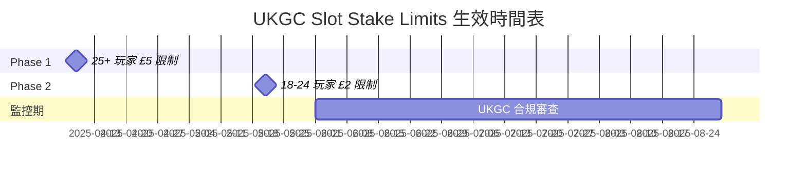
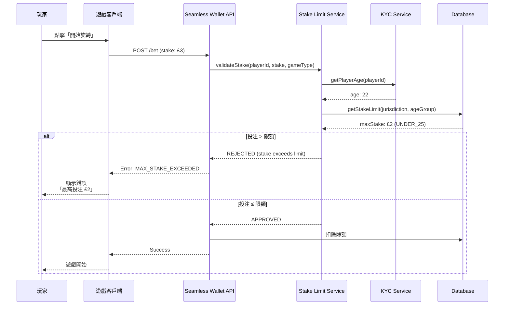
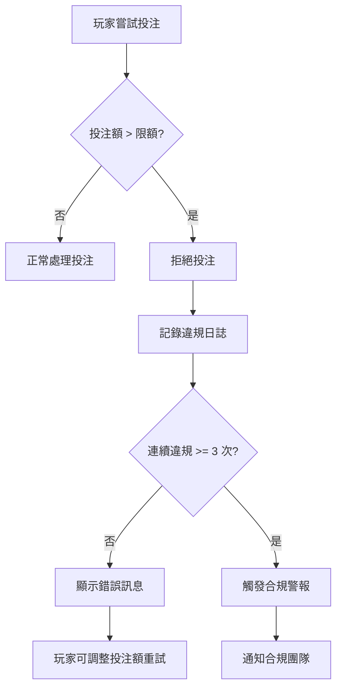

# 03-08 Slot Stake Limits (老虎機投注限額)

**版本**: 1.0.0
**創建日期**: 2026-02-07
**狀態**: ✅ 完整
**維護團隊**: Compliance Team / Game Team
**監管依據**: UKGC LCCP 3.2.2, Gambling Commission Slots Review 2023

**前置依賴**:
- [03-01 遊戲整合標準](./03-01_Game_Integration_Standard.md) - 遊戲 API 整合 (§2.1)
- [05-03 KYC/AML](../05_Risk_Control/05-03_KYC_AML.md) - 年齡驗證 (§1.1)
- [02-SW-01 Seamless Wallet 概述](../02_Finance_Center/seamless-wallet/02-SW-01_Overview.md) - 錢包 API (§3)

---

## 🎯 執行摘要

UKGC 於 2023 年發布「Slots Review」，對線上老虎機實施年齡分層投注限額，旨在保護年輕玩家免受高額投注的傷害。本文檔詳細說明 SmartAdmin iGaming 平台如何實現這一監管要求。

### 核心規則

| 年齡組 | 最高投注額 | 生效日期 | LCCP 條款 |
|--------|----------|---------|-----------|
| **18-24 歲** | £2/spin | 2025-05-21 | LCCP 3.2.2(a) |
| **25 歲以上** | £5/spin | 2025-04-09 | LCCP 3.2.2(b) |

> ⚠️ **重要**: 這些限制適用於所有遊戲類型被分類為「老虎機」(Slots) 的遊戲，包括視頻老虎機、經典老虎機、累積獎池老虎機等。

### 業務影響

| 影響維度 | 說明 |
|---------|------|
| **合規風險** | 不遵守可導致牌照暫停，罰款可達 GGR 的 15% |
| **技術整合** | 需要與 KYC 系統整合以獲取玩家年齡 |
| **遊戲供應商** | 需要更新遊戲整合 API 以支援投注限制 |
| **用戶體驗** | 年輕玩家投注體驗受限，需清晰的 UI 提示 |

---

## 1. 監管背景

### 1.1 UKGC Slots Review 2023

**背景**: UK Gambling Commission 於 2023 年完成對線上老虎機的全面審查，識別年輕玩家（18-24 歲）面臨較高的賭博傷害風險。

**關鍵發現**:
- 18-24 歲玩家的問題賭博率是其他年齡組的 2.5 倍
- 高額投注是導致財務損失的主要因素
- 老虎機遊戲佔線上博彩收入的 70%

### 1.2 分階段生效時間表



### 1.3 適用範圍

| 遊戲類型 | 是否適用 | 說明 |
|---------|---------|------|
| 視頻老虎機 (Video Slots) | ✅ 是 | 所有主流供應商遊戲 |
| 經典老虎機 (Classic Slots) | ✅ 是 | 3 軸老虎機 |
| 累積獎池 (Progressive Jackpot) | ✅ 是 | 投注限制適用，獎池贏取無限制 |
| 桌遊 (Table Games) | ❌ 否 | 21 點、輪盤等不受此限制 |
| 真人荷官 (Live Dealer) | ❌ 否 | Live Casino 不受此限制 |
| 體育博彩 (Sports Betting) | ❌ 否 | 獨立監管框架 |

---

## 2. 技術架構

### 2.1 系統流程



### 2.2 與 Seamless Wallet 整合

投注限額驗證整合在 Seamless Wallet API 的 `/bet` 端點中：

```java
/**
 * Seamless Wallet Bet 端點增強
 * 新增老虎機投注限額驗證
 */
@PostMapping("/bet")
@SaCheckPermission("seamless:wallet:bet")
public ResponseDTO<BetResultVO> placeBet(@RequestBody @Valid BetRequestForm form) {
    // 1. 基礎驗證（餘額、遊戲狀態等）
    // 2. 新增：老虎機投注限額驗證
    if (isSlotGame(form.getGameType())) {
        StakeLimitValidation validation = stakeLimitService.validateStake(
            form.getPlayerId(),
            form.getStake(),
            form.getJurisdiction()
        );
        if (!validation.isValid()) {
            return ResponseDTO.error(
                GameErrorCode.MAX_STAKE_EXCEEDED,
                String.format("Maximum stake for your age group is %s",
                    validation.getMaxAllowedStake())
            );
        }
    }
    // 3. 正常處理投注
    return seamlessWalletService.processBet(form);
}
```

---

## 3. 數據庫設計

### 3.1 投注限額配置表

```sql
-- 投注限額配置表
CREATE TABLE t_slot_stake_limit_config (
    id BIGINT PRIMARY KEY AUTO_INCREMENT,

    -- 核心配置
    jurisdiction VARCHAR(20) NOT NULL COMMENT '司法管轄區: UKGC, MGA, etc.',
    age_group ENUM('UNDER_25', 'OVER_25') NOT NULL COMMENT '年齡組',
    max_stake_amount DECIMAL(10,2) NOT NULL COMMENT '最高投注額',
    currency VARCHAR(3) NOT NULL DEFAULT 'GBP' COMMENT '幣種',

    -- 生效時間
    effective_date DATE NOT NULL COMMENT '生效日期',
    expiry_date DATE COMMENT '失效日期（NULL 表示永久有效）',

    -- 審計
    created_at DATETIME NOT NULL DEFAULT CURRENT_TIMESTAMP,
    updated_at DATETIME ON UPDATE CURRENT_TIMESTAMP,
    created_by BIGINT COMMENT '創建者',

    -- 索引
    UNIQUE KEY uk_jurisdiction_age_currency (jurisdiction, age_group, currency),
    INDEX idx_effective_date (effective_date)
) ENGINE=InnoDB COMMENT='老虎機投注限額配置表';

-- 初始化 UKGC 數據
INSERT INTO t_slot_stake_limit_config
    (jurisdiction, age_group, max_stake_amount, currency, effective_date)
VALUES
    ('UKGC', 'OVER_25', 5.00, 'GBP', '2025-04-09'),
    ('UKGC', 'UNDER_25', 2.00, 'GBP', '2025-05-21');
```

### 3.2 投注限額違規日誌表

```sql
-- 投注限額違規日誌表（審計用途）
CREATE TABLE t_slot_stake_violation_log (
    id BIGINT PRIMARY KEY AUTO_INCREMENT,

    -- 玩家信息
    player_id BIGINT NOT NULL COMMENT '玩家 ID',
    player_age INT NOT NULL COMMENT '玩家年齡',
    age_group ENUM('UNDER_25', 'OVER_25') NOT NULL COMMENT '年齡組',

    -- 遊戲信息
    game_id VARCHAR(100) NOT NULL COMMENT '遊戲 ID',
    game_provider VARCHAR(50) COMMENT '遊戲供應商',

    -- 違規詳情
    requested_stake DECIMAL(10,2) NOT NULL COMMENT '請求的投注額',
    max_allowed_stake DECIMAL(10,2) NOT NULL COMMENT '允許的最高投注額',
    currency VARCHAR(3) NOT NULL DEFAULT 'GBP',

    -- 元數據
    jurisdiction VARCHAR(20) NOT NULL DEFAULT 'UKGC',
    session_id VARCHAR(100) COMMENT '遊戲會話 ID',
    ip_address VARCHAR(45) COMMENT '玩家 IP',

    -- 時間戳
    blocked_at DATETIME NOT NULL DEFAULT CURRENT_TIMESTAMP,

    -- 索引
    INDEX idx_player_date (player_id, blocked_at),
    INDEX idx_game_provider (game_provider, blocked_at),
    INDEX idx_jurisdiction (jurisdiction, blocked_at)
) ENGINE=InnoDB COMMENT='老虎機投注限額違規日誌';
```

---

## 4. API 設計

### 4.1 投注驗證 API

```java
/**
 * 投注限額驗證服務
 */
@Service
@RequiredArgsConstructor
public class SlotStakeLimitService {

    private final SlotStakeLimitConfigDao configDao;
    private final SlotStakeViolationLogDao violationLogDao;
    private final KycService kycService;

    /**
     * 驗證投注是否符合年齡限額
     *
     * @param playerId 玩家 ID
     * @param stake 投注金額
     * @param jurisdiction 司法管轄區
     * @return 驗證結果
     */
    public StakeLimitValidation validateStake(Long playerId, BigDecimal stake, String jurisdiction) {
        // 1. 獲取玩家年齡
        Integer playerAge = kycService.getVerifiedAge(playerId);
        if (playerAge == null) {
            return StakeLimitValidation.rejected("Age verification required");
        }

        // 2. 確定年齡組
        AgeGroup ageGroup = playerAge < 25 ? AgeGroup.UNDER_25 : AgeGroup.OVER_25;

        // 3. 獲取限額配置
        SlotStakeLimitConfig config = configDao.findByJurisdictionAndAgeGroup(jurisdiction, ageGroup);
        if (config == null) {
            // 無配置時使用最嚴格限制
            config = SlotStakeLimitConfig.defaultStrict();
        }

        // 4. 驗證投注額
        BigDecimal maxStake = config.getMaxStakeAmount();
        if (stake.compareTo(maxStake) > 0) {
            // 記錄違規
            logViolation(playerId, playerAge, ageGroup, stake, maxStake, jurisdiction);
            return StakeLimitValidation.rejected(maxStake, stake);
        }

        return StakeLimitValidation.approved(maxStake);
    }

    private void logViolation(Long playerId, Integer age, AgeGroup ageGroup,
                              BigDecimal requested, BigDecimal max, String jurisdiction) {
        SlotStakeViolationLog log = SlotStakeViolationLog.builder()
            .playerId(playerId)
            .playerAge(age)
            .ageGroup(ageGroup)
            .requestedStake(requested)
            .maxAllowedStake(max)
            .jurisdiction(jurisdiction)
            .blockedAt(LocalDateTime.now())
            .build();
        violationLogDao.insert(log);
    }
}
```

### 4.2 驗證結果 VO

```java
@Data
@Builder
public class StakeLimitValidation {
    private boolean valid;
    private BigDecimal maxAllowedStake;
    private BigDecimal requestedStake;
    private String message;

    public static StakeLimitValidation approved(BigDecimal maxStake) {
        return StakeLimitValidation.builder()
            .valid(true)
            .maxAllowedStake(maxStake)
            .build();
    }

    public static StakeLimitValidation rejected(BigDecimal maxStake, BigDecimal requested) {
        return StakeLimitValidation.builder()
            .valid(false)
            .maxAllowedStake(maxStake)
            .requestedStake(requested)
            .message(String.format("Stake £%.2f exceeds maximum £%.2f for your age group",
                requested, maxStake))
            .build();
    }

    public static StakeLimitValidation rejected(String message) {
        return StakeLimitValidation.builder()
            .valid(false)
            .message(message)
            .build();
    }
}
```

### 4.3 管理後台 API

```java
/**
 * 老虎機限額管理 API (Admin)
 */
@RestController
@RequestMapping("/api/admin/slot-stake-limit")
@RequiredArgsConstructor
public class SlotStakeLimitAdminController {

    private final SlotStakeLimitService service;

    /**
     * 獲取限額配置列表
     */
    @GetMapping("/config")
    @SaCheckPermission("slot:stake:config:view")
    public ResponseDTO<List<SlotStakeLimitConfigVO>> listConfigs(
            @RequestParam(required = false) String jurisdiction) {
        return ResponseDTO.ok(service.listConfigs(jurisdiction));
    }

    /**
     * 更新限額配置
     */
    @PutMapping("/config/{id}")
    @SaCheckPermission("slot:stake:config:edit")
    public ResponseDTO<Void> updateConfig(
            @PathVariable Long id,
            @RequestBody @Valid SlotStakeLimitConfigUpdateForm form) {
        service.updateConfig(id, form);
        return ResponseDTO.ok();
    }

    /**
     * 獲取違規統計
     */
    @GetMapping("/violation/stats")
    @SaCheckPermission("slot:stake:violation:view")
    public ResponseDTO<SlotStakeViolationStatsVO> getViolationStats(
            @RequestParam @DateTimeFormat(iso = DateTimeFormat.ISO.DATE) LocalDate startDate,
            @RequestParam @DateTimeFormat(iso = DateTimeFormat.ISO.DATE) LocalDate endDate) {
        return ResponseDTO.ok(service.getViolationStats(startDate, endDate));
    }
}
```

---

## 5. 業務規則

### 5.1 投注限額規則

| 規則 ID | 規則描述 | 優先級 |
|--------|---------|--------|
| SL-001 | 18-24 歲玩家單次投注不得超過 £2 | P0 |
| SL-002 | 25+ 歲玩家單次投注不得超過 £5 | P0 |
| SL-003 | 年齡未驗證玩家禁止投注老虎機 | P0 |
| SL-004 | 違規投注嘗試需記錄審計日誌 | P1 |
| SL-005 | 連續 3 次違規嘗試觸發合規警報 | P1 |

### 5.2 違規處理流程



### 5.3 邊界情況處理

| 情況 | 處理方式 |
|------|---------|
| **玩家生日當天** | 實時更新年齡組，投注時重新計算 |
| **跨時區問題** | 使用 UTC 時間判斷生效日期 |
| **多幣種** | 使用實時匯率轉換為 GBP 後驗證 |
| **VPN 繞過** | 結合 GeoIP + 賬戶註冊地進行雙重驗證 |

---

## 6. 前端整合

### 6.1 遊戲大廳顯示

```vue
<template>
  <div class="stake-limit-notice" v-if="showStakeLimitNotice">
    <a-alert
      type="info"
      :message="stakeLimitMessage"
      show-icon
    >
      <template #icon>
        <info-circle-outlined />
      </template>
    </a-alert>
  </div>
</template>

<script setup lang="ts">
import { computed } from 'vue';
import { usePlayerStore } from '@/stores/player';

const playerStore = usePlayerStore();

const showStakeLimitNotice = computed(() =>
  playerStore.jurisdiction === 'UKGC' &&
  playerStore.age !== null
);

const stakeLimitMessage = computed(() => {
  const maxStake = playerStore.age < 25 ? '£2' : '£5';
  return `UK regulations limit your maximum slot stake to ${maxStake} per spin.`;
});
</script>
```

### 6.2 投注失敗處理

```typescript
// 遊戲客戶端 API 錯誤處理
async function placeBet(stake: number): Promise<BetResult> {
  try {
    const result = await seamlessWalletApi.bet({ stake });
    return result;
  } catch (error) {
    if (error.code === 'MAX_STAKE_EXCEEDED') {
      showStakeLimitModal({
        requestedStake: stake,
        maxAllowedStake: error.data.maxAllowedStake,
        ageGroup: error.data.ageGroup,
      });
      return { success: false, reason: 'stake_exceeded' };
    }
    throw error;
  }
}
```

---

## 7. 監控與告警

### 7.1 關鍵指標 (KPIs)

| 指標 | 計算公式 | 目標值 | 告警閾值 |
|------|---------|--------|---------|
| **違規率** | 違規次數 / 總投注次數 | < 1% | > 5% |
| **年齡組分布** | 各年齡組投注佔比 | - | UNDER_25 > 50% |
| **平均投注額 (UNDER_25)** | SUM(stake) / COUNT | < £1.50 | > £1.80 |
| **驗證延遲** | 投注驗證 P99 | < 10ms | > 50ms |

### 7.2 Prometheus 指標

```yaml
# Prometheus 指標定義
slot_stake_validation_total:
  type: counter
  labels: [jurisdiction, age_group, result]
  description: "老虎機投注限額驗證總數"

slot_stake_violation_total:
  type: counter
  labels: [jurisdiction, age_group, game_provider]
  description: "老虎機投注限額違規總數"

slot_stake_validation_latency_seconds:
  type: histogram
  labels: [jurisdiction]
  buckets: [0.001, 0.005, 0.01, 0.025, 0.05, 0.1]
  description: "投注限額驗證延遲"

slot_stake_average_by_age_group:
  type: gauge
  labels: [jurisdiction, age_group]
  description: "各年齡組平均投注額"
```

### 7.3 告警規則

```yaml
# Alertmanager 規則
groups:
  - name: slot_stake_limits
    rules:
      - alert: HighViolationRate
        expr: rate(slot_stake_violation_total[5m]) / rate(slot_stake_validation_total[5m]) > 0.05
        for: 5m
        labels:
          severity: warning
        annotations:
          summary: "老虎機投注限額違規率過高"
          description: "過去 5 分鐘違規率超過 5%，當前 {{ $value | humanizePercentage }}"

      - alert: AgeVerificationFailures
        expr: rate(slot_stake_validation_total{result="age_unknown"}[5m]) > 10
        for: 5m
        labels:
          severity: critical
        annotations:
          summary: "年齡驗證失敗率異常"
          description: "過去 5 分鐘有 {{ $value }} 次年齡驗證失敗"
```

---

## 8. 合規報告

### 8.1 月度報告結構

```sql
-- 月度合規報告查詢
SELECT
    DATE_FORMAT(blocked_at, '%Y-%m') AS report_month,
    jurisdiction,
    age_group,
    COUNT(*) AS violation_count,
    COUNT(DISTINCT player_id) AS unique_players,
    AVG(requested_stake) AS avg_requested_stake,
    MAX(requested_stake) AS max_requested_stake
FROM t_slot_stake_violation_log
WHERE blocked_at >= DATE_SUB(CURRENT_DATE, INTERVAL 1 MONTH)
GROUP BY report_month, jurisdiction, age_group
ORDER BY report_month, jurisdiction, age_group;
```

### 8.2 UKGC 報告要求

| 報告項目 | 頻率 | 內容 |
|---------|------|------|
| 違規統計 | 月度 | 各年齡組違規次數、趨勢 |
| 系統變更 | 即時 | 限額配置變更記錄 |
| 技術失敗 | 即時 | 驗證系統故障、降級事件 |

---

## 9. 變更日誌

| 版本 | 日期 | 變更內容 | 變更者 |
|------|------|---------|--------|
| 1.0.0 | 2026-02-07 | 初始版本，實現 UKGC Slots Review 2023 要求 | Claude Code |

---

## 10. 相關文檔

### 業務參考
- [03-01 遊戲整合標準](./03-01_Game_Integration_Standard.md) - 遊戲供應商 API 整合
- [02-SW-01 Seamless Wallet 概述](../02_Finance_Center/seamless-wallet/02-SW-01_Overview.md) - 錢包 API

### 合規參考
- [06-08 UKGC 合規](../06_Platform_Governance/06-08_UKGC_Compliance.md) - UK 牌照總體要求
- [06-12 合規時間線](../06_Platform_Governance/06-12_Compliance_Timeline.md) - 監管截止日期追蹤

### 技術參考
- [05-03 KYC/AML](../05_Risk_Control/05-03_KYC_AML.md) - 年齡驗證 (§1.1)

---

**返回**: [03_Game_Center](README.md) | [iGaming 首頁](../README.md)
