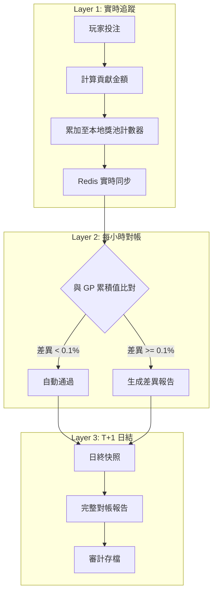
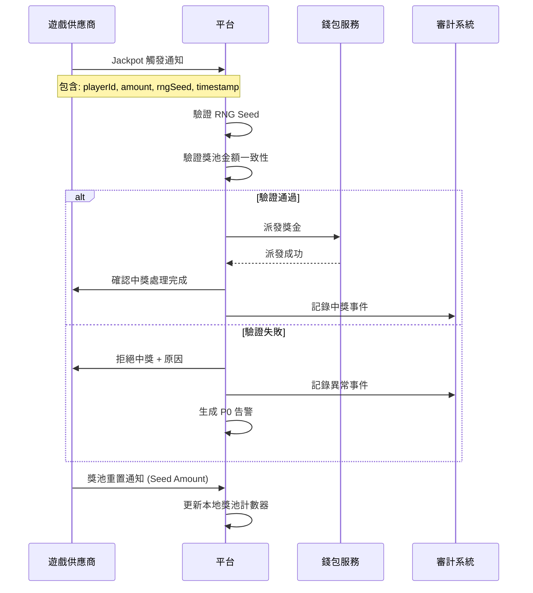
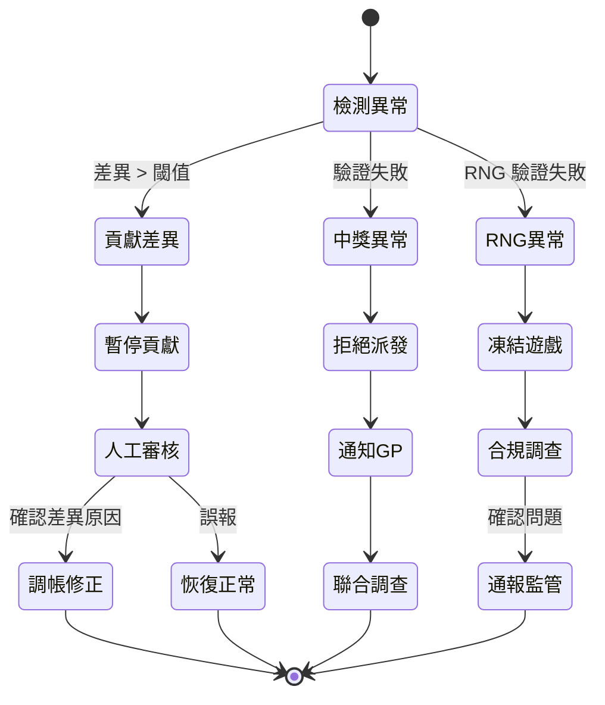

# 03-09 Jackpot 累積獎池對帳 (Jackpot Pool Reconciliation)

**版本**: 1.0.0
**創建日期**: 2026-02-07
**狀態**: P0 - 監管合規必要

---

## 1. 概述

Jackpot 累積獎池對帳確保平台與遊戲供應商 (GP) 之間的累積獎池金額一致，並驗證中獎事件的準確性與公平性。

### 1.1 對帳目的

- **資金準確性**: 確保獎池累積金額與 GP 報表一致
- **中獎驗證**: 驗證 Jackpot 觸發與派獎的正確性
- **RNG 合規**: 確保隨機性符合 GLI 認證標準
- **審計追蹤**: 提供完整的獎池變動軌跡

### 1.2 業界標準

| 標準 | 適用範圍 | 關鍵條款 |
|------|---------|---------|
| **GLI-11** | 電子遊戲機 | §4.8 Progressive Meter Requirements |
| **GLI-13** | 聯網獎池系統 | §3 Pooled Progressive Standards |
| **eCOGRA** | 公平遊戲 | Progressive Jackpot Fairness |
| **UKGC RTS** | 英國市場 | 5.1.1 Progressive Jackpot Display |

---

## 2. Jackpot 類型分類

### 2.1 獎池類型

| 類型 | 英文名稱 | 說明 | 對帳複雜度 |
|------|---------|------|-----------|
| **本地獎池** | Local Progressive | 單一遊戲累積 | 低 |
| **連線獎池** | Linked Progressive | 同供應商多遊戲共享 | 中 |
| **廣域獎池** | Wide Area Progressive (WAP) | 跨供應商/跨營運商共享 | 高 |
| **固定獎池** | Fixed Jackpot | 非累積，固定金額 | 無需對帳 |

### 2.2 貢獻率結構

```
每筆投注貢獻:
  Total Contribution = Bet Amount × Contribution Rate

  分配比例 (示例):
    - Grand Jackpot: 0.5%
    - Major Jackpot: 0.3%
    - Minor Jackpot: 0.15%
    - Mini Jackpot: 0.05%

  總貢獻率: 1.0% (從玩家投注中抽取)
```

### 2.3 種子金額 (Seed Amount)

```yaml
種子金額定義:
  目的: Jackpot 中獎後的重置起始金額

  責任歸屬:
    Local: 營運商負責
    Linked: 供應商負責
    WAP: 參與方按比例分攤

  種子金額範例:
    Grand: $10,000
    Major: $1,000
    Minor: $100
    Mini: $10
```

---

## 3. 貢獻率對帳

### 3.1 對帳架構



### 3.2 貢獻率計算

```java
/**
 * Jackpot 貢獻計算服務
 * SmartAdmin 架構: Service 層
 */
@Service
@RequiredArgsConstructor
@Slf4j
public class JackpotContributionService {

    private final JackpotPoolDao jackpotPoolDao;
    private final JackpotContributionManager contributionManager;

    /**
     * 計算並記錄投注的 Jackpot 貢獻
     */
    public Option<JackpotContribution> calculateContribution(
            String gameId,
            BigDecimal betAmount,
            String transactionId) {

        // 1. 獲取遊戲的 Jackpot 配置
        return jackpotPoolDao.findByGameId(gameId)
            .map(pool -> {
                // 2. 計算各級別貢獻
                BigDecimal grandContribution = betAmount
                    .multiply(pool.getGrandContributionRate());
                BigDecimal majorContribution = betAmount
                    .multiply(pool.getMajorContributionRate());
                BigDecimal minorContribution = betAmount
                    .multiply(pool.getMinorContributionRate());
                BigDecimal miniContribution = betAmount
                    .multiply(pool.getMiniContributionRate());

                BigDecimal totalContribution = grandContribution
                    .add(majorContribution)
                    .add(minorContribution)
                    .add(miniContribution);

                // 3. 記錄貢獻
                JackpotContribution contribution = JackpotContribution.builder()
                    .poolId(pool.getId())
                    .transactionId(transactionId)
                    .betAmount(betAmount)
                    .grandContribution(grandContribution)
                    .majorContribution(majorContribution)
                    .minorContribution(minorContribution)
                    .miniContribution(miniContribution)
                    .totalContribution(totalContribution)
                    .createdAt(LocalDateTime.now())
                    .build();

                // 4. 更新獎池累積 (Manager 層處理事務)
                contributionManager.recordContribution(contribution);

                return contribution;
            });
    }
}
```

### 3.3 對帳 SQL

```sql
-- 每小時貢獻對帳
SELECT
    jp.pool_id,
    jp.pool_name,
    jp.game_provider,

    -- 平台計算值
    SUM(jc.total_contribution) AS platform_contribution,

    -- 平台當前獎池值
    jp.current_grand_amount AS platform_grand,
    jp.current_major_amount AS platform_major,
    jp.current_minor_amount AS platform_minor,
    jp.current_mini_amount AS platform_mini,

    -- GP 報告值 (從同步表獲取)
    gps.grand_amount AS gp_grand,
    gps.major_amount AS gp_major,
    gps.minor_amount AS gp_minor,
    gps.mini_amount AS gp_mini,

    -- 差異計算
    ABS(jp.current_grand_amount - gps.grand_amount) AS grand_variance,
    ABS(jp.current_grand_amount - gps.grand_amount) / NULLIF(gps.grand_amount, 0) * 100 AS grand_variance_pct

FROM t_jackpot_pool jp
LEFT JOIN t_jackpot_contribution jc ON jp.pool_id = jc.pool_id
    AND jc.created_at >= DATE_SUB(NOW(), INTERVAL 1 HOUR)
LEFT JOIN t_gp_jackpot_sync gps ON jp.pool_id = gps.pool_id
    AND gps.sync_time = (SELECT MAX(sync_time) FROM t_gp_jackpot_sync WHERE pool_id = jp.pool_id)
GROUP BY jp.pool_id
HAVING grand_variance_pct > 0.1 OR major_variance_pct > 0.1;
```

---

## 4. 中獎事件對帳

### 4.1 中獎驗證流程



### 4.2 中獎驗證邏輯

```java
/**
 * Jackpot 中獎驗證 Manager
 * SmartAdmin 架構: Manager 層 (涉及事務)
 */
@Component
@RequiredArgsConstructor
@Slf4j
public class JackpotWinVerificationManager {

    private final JackpotPoolDao poolDao;
    private final JackpotWinRecordDao winRecordDao;
    private final WalletManager walletManager;
    private final RngVerificationService rngService;

    /**
     * 驗證並處理 Jackpot 中獎
     */
    @Transactional(rollbackFor = Throwable.class)
    public ResponseDTO<JackpotWinResult> verifyAndProcessWin(JackpotWinRequest request) {

        // 1. 驗證獎池存在且狀態正常
        JackpotPool pool = poolDao.selectById(request.getPoolId());
        if (pool == null || pool.getStatus() != PoolStatus.ACTIVE) {
            return ResponseDTO.error(SystemErrorCode.JACKPOT_POOL_NOT_FOUND);
        }

        // 2. 驗證中獎金額與當前獎池一致
        BigDecimal currentAmount = getCurrentPoolAmount(pool, request.getJackpotLevel());
        BigDecimal tolerance = currentAmount.multiply(new BigDecimal("0.001")); // 0.1% 容差

        if (request.getWinAmount().subtract(currentAmount).abs().compareTo(tolerance) > 0) {
            log.error("Jackpot amount mismatch: expected={}, received={}, poolId={}",
                currentAmount, request.getWinAmount(), request.getPoolId());

            // 記錄異常
            recordAnomalyEvent(request, currentAmount, "AMOUNT_MISMATCH");

            return ResponseDTO.error(SystemErrorCode.JACKPOT_AMOUNT_MISMATCH,
                String.format("獎池金額不一致: 平台=%s, GP=%s",
                    currentAmount, request.getWinAmount()));
        }

        // 3. 驗證 RNG Seed (GLI-11 要求)
        if (!rngService.verifyRngSeed(request.getRngSeed(), request.getGameRoundId())) {
            log.error("RNG verification failed: seed={}, roundId={}",
                request.getRngSeed(), request.getGameRoundId());

            recordAnomalyEvent(request, currentAmount, "RNG_VERIFICATION_FAILED");

            return ResponseDTO.error(SystemErrorCode.RNG_VERIFICATION_FAILED);
        }

        // 4. 派發獎金
        WalletCreditResult creditResult = walletManager.creditJackpotWin(
            request.getPlayerId(),
            request.getWinAmount(),
            request.getTransactionId()
        );

        if (!creditResult.isSuccess()) {
            return ResponseDTO.error(SystemErrorCode.WALLET_CREDIT_FAILED);
        }

        // 5. 重置獎池至種子金額
        resetPoolToSeed(pool, request.getJackpotLevel());

        // 6. 記錄中獎事件
        JackpotWinRecord record = JackpotWinRecord.builder()
            .poolId(request.getPoolId())
            .playerId(request.getPlayerId())
            .jackpotLevel(request.getJackpotLevel())
            .winAmount(request.getWinAmount())
            .rngSeed(request.getRngSeed())
            .gameRoundId(request.getGameRoundId())
            .verifiedAt(LocalDateTime.now())
            .walletTransactionId(creditResult.getTransactionId())
            .build();

        winRecordDao.insert(record);

        log.info("Jackpot win processed: playerId={}, amount={}, level={}, poolId={}",
            request.getPlayerId(), request.getWinAmount(),
            request.getJackpotLevel(), request.getPoolId());

        return ResponseDTO.ok(JackpotWinResult.success(record));
    }
}
```

### 4.3 中獎事件對帳表

```sql
-- Jackpot 中獎對帳表
CREATE TABLE t_jackpot_win_reconciliation (
    id                  BIGINT PRIMARY KEY AUTO_INCREMENT,
    reconciliation_date DATE NOT NULL,
    pool_id             BIGINT NOT NULL,
    pool_name           VARCHAR(100),
    game_provider       VARCHAR(50),

    -- 平台記錄
    platform_win_count      INT DEFAULT 0,
    platform_total_payout   DECIMAL(18,2) DEFAULT 0,

    -- GP 報告
    gp_win_count            INT DEFAULT 0,
    gp_total_payout         DECIMAL(18,2) DEFAULT 0,

    -- 差異
    win_count_variance      INT DEFAULT 0,
    payout_variance         DECIMAL(18,2) DEFAULT 0,
    payout_variance_pct     DECIMAL(8,4) DEFAULT 0,

    -- 狀態
    status                  VARCHAR(20) DEFAULT 'PENDING',
    reviewed_by             VARCHAR(100),
    reviewed_at             DATETIME,
    resolution_notes        TEXT,

    created_at              DATETIME DEFAULT CURRENT_TIMESTAMP,

    UNIQUE KEY uk_date_pool (reconciliation_date, pool_id),
    INDEX idx_status (status)
);

-- Jackpot 中獎明細表
CREATE TABLE t_jackpot_win_record (
    id                  BIGINT PRIMARY KEY AUTO_INCREMENT,
    pool_id             BIGINT NOT NULL,
    player_id           BIGINT NOT NULL,
    jackpot_level       VARCHAR(20) NOT NULL,  -- GRAND, MAJOR, MINOR, MINI
    win_amount          DECIMAL(18,2) NOT NULL,

    -- 驗證資訊
    rng_seed            VARCHAR(256),
    game_round_id       VARCHAR(100),
    verified_at         DATETIME,
    verification_status VARCHAR(20) DEFAULT 'VERIFIED',

    -- 關聯交易
    wallet_transaction_id   BIGINT,
    gp_transaction_id       VARCHAR(100),

    -- 對帳狀態
    reconciled          BOOLEAN DEFAULT FALSE,
    reconciled_at       DATETIME,

    created_at          DATETIME DEFAULT CURRENT_TIMESTAMP,

    INDEX idx_pool_date (pool_id, created_at),
    INDEX idx_player (player_id),
    INDEX idx_reconciled (reconciled)
);
```

---

## 5. 跨供應商獎池對帳 (WAP)

### 5.1 WAP 對帳挑戰

```yaml
Wide Area Progressive 對帳挑戰:

  多方參與:
    - 多個遊戲供應商
    - 多個營運商
    - 中央獎池管理者

  資金分配:
    - 按參與度分配種子金額
    - 按貢獻比例分配中獎重置成本
    - 手續費分攤

  對帳頻率:
    - 貢獻對帳: 每小時
    - 中獎對帳: 實時
    - 資金結算: 每日
```

### 5.2 WAP 對帳流程

```mermaid
flowchart TD
    subgraph 營運商A
        A1[貢獻 $500]
    end

    subgraph 營運商B
        B1[貢獻 $300]
    end

    subgraph 營運商C
        C1[貢獻 $200]
    end

    subgraph 中央獎池管理
        D1[總貢獻 $1000]
        D2[當前獎池 $50,000]
    end

    A1 --> D1
    B1 --> D1
    C1 --> D1
    D1 --> D2

    D2 --> E{中獎觸發}

    E -->|營運商A 玩家中獎| F[派發 $50,000]

    F --> G[種子金額分攤]
    G --> H1[營運商A: $5,000 (50%)]
    G --> H2[營運商B: $3,000 (30%)]
    G --> H3[營運商C: $2,000 (20%)]
```

### 5.3 WAP 對帳 SQL

```sql
-- WAP 每日貢獻對帳
SELECT
    wap.wap_pool_id,
    wap.pool_name,
    o.operator_id,
    o.operator_name,

    -- 貢獻統計
    SUM(wc.contribution_amount) AS operator_contribution,
    wap.total_contribution AS wap_total_contribution,
    SUM(wc.contribution_amount) / wap.total_contribution * 100 AS contribution_pct,

    -- 種子金額分攤
    SUM(wc.contribution_amount) / wap.total_contribution * wap.seed_amount AS seed_share,

    -- 差異
    ABS(SUM(wc.contribution_amount) - wap_report.operator_contribution) AS variance

FROM t_wap_pool wap
JOIN t_wap_contribution wc ON wap.wap_pool_id = wc.wap_pool_id
JOIN t_operator o ON wc.operator_id = o.operator_id
LEFT JOIN t_wap_operator_report wap_report
    ON wap.wap_pool_id = wap_report.wap_pool_id
    AND o.operator_id = wap_report.operator_id
    AND wap_report.report_date = CURDATE() - INTERVAL 1 DAY
WHERE wc.created_at >= CURDATE() - INTERVAL 1 DAY
  AND wc.created_at < CURDATE()
GROUP BY wap.wap_pool_id, o.operator_id;
```

---

## 6. RNG 驗證 (GLI-11/13 合規)

### 6.1 RNG 驗證要求

```yaml
GLI-11 §4.8 要求:
  - 必須記錄觸發 Jackpot 的 RNG 結果
  - 必須能夠重現 RNG 計算過程
  - 必須提供審計追蹤

驗證內容:
  - RNG Seed 有效性
  - 計算結果可重現
  - 時間戳完整性
  - 無篡改證據
```

### 6.2 RNG 驗證實現

```java
/**
 * RNG 驗證服務
 */
@Service
@RequiredArgsConstructor
public class RngVerificationService {

    /**
     * 驗證 RNG Seed 的有效性
     */
    public boolean verifyRngSeed(String rngSeed, String gameRoundId) {
        // 1. 解析 RNG Seed
        RngSeedComponents components = parseRngSeed(rngSeed);

        // 2. 驗證時間戳
        if (!isTimestampValid(components.getTimestamp())) {
            return false;
        }

        // 3. 驗證簽名 (GP 簽名驗證)
        if (!verifyGpSignature(components)) {
            return false;
        }

        // 4. 驗證 Round ID 關聯
        if (!components.getGameRoundId().equals(gameRoundId)) {
            return false;
        }

        // 5. 重現 RNG 計算 (如果 GP 提供算法)
        if (components.getAlgorithm() != null) {
            return reproduceRngCalculation(components);
        }

        return true;
    }

    /**
     * 記錄 RNG 驗證結果供審計
     */
    public void recordVerificationResult(
            String rngSeed,
            String gameRoundId,
            boolean verified,
            String failureReason) {

        RngVerificationLog log = RngVerificationLog.builder()
            .rngSeed(hashForStorage(rngSeed))  // 安全存儲
            .gameRoundId(gameRoundId)
            .verified(verified)
            .failureReason(failureReason)
            .verifiedAt(LocalDateTime.now())
            .build();

        rngVerificationLogDao.insert(log);
    }
}
```

---

## 7. 異常處理

### 7.1 異常分類

| 異常類型 | 風險等級 | 處理方式 |
|---------|---------|---------|
| **貢獻差異 > 1%** | HIGH | 暫停貢獻，人工審核 |
| **中獎金額不符** | CRITICAL | 拒絕派發，通知 GP |
| **RNG 驗證失敗** | CRITICAL | 凍結遊戲，合規調查 |
| **WAP 結算差異** | HIGH | 暫停結算，多方協調 |
| **種子金額錯誤** | MEDIUM | 自動修正，記錄日誌 |

### 7.2 異常處理流程



---

## 8. 監控與告警

### 8.1 關鍵指標

| 指標 | Prometheus 名稱 | 告警閾值 |
|------|----------------|---------|
| 貢獻差異率 | `jackpot_contribution_variance_rate` | > 0.1% |
| 未對帳中獎數 | `jackpot_unreconciled_wins_count` | > 0 持續 1 小時 |
| RNG 驗證失敗率 | `jackpot_rng_verification_failure_rate` | > 0 |
| WAP 結算延遲 | `wap_settlement_delay_hours` | > 24 小時 |

### 8.2 告警規則

```yaml
alerts:
  - name: jackpot_contribution_variance_high
    condition: jackpot_contribution_variance_rate > 0.001
    severity: WARNING
    notify: slack:#game-ops

  - name: jackpot_rng_verification_failed
    condition: jackpot_rng_verification_failure_rate > 0
    severity: CRITICAL
    notify: pagerduty:game-oncall, email:compliance@company.com

  - name: jackpot_win_unreconciled
    condition: jackpot_unreconciled_wins_count > 0
    for: 1h
    severity: HIGH
    notify: slack:#finance-ops
```

---

## 9. 審計追蹤

### 9.1 數據保留

| 數據類型 | 保留期限 | 存儲位置 |
|---------|---------|---------|
| 貢獻明細 | 7 年 | PostgreSQL + S3 |
| 中獎記錄 | 永久 | 加密存儲 |
| RNG 驗證日誌 | 10 年 | 審計日誌表 |
| 對帳報告 | 10 年 | 文檔管理系統 |

### 9.2 審計報表

```yaml
日報表:
  - 各獎池貢獻總額
  - 中獎事件清單
  - 對帳差異摘要

週報表:
  - 獎池累積趨勢
  - 中獎頻率分析
  - RNG 驗證統計

月報表:
  - 監管合規報告
  - WAP 結算報表
  - 審計完整性驗證
```

---

## 10. 相關文檔

- [03-04-03 對帳模型](03-04-03_Reconciliation_Model.md) - 遊戲對帳基礎
- [03-05 GLI 認證](03-05_GLI_Certification.md) - RNG 認證流程
- [02-03 對帳系統](../02_Finance_Center/02-03_Reconciliation_System.md) - 核心對帳架構
- [02-11 GGR 稅務對帳](../02_Finance_Center/02-11_GGR_Tax_Reconciliation.md) - Jackpot Payout 計入 GGR

---

**返回**: [遊戲中心](README.md) | [iGaming 首頁](../README.md)
