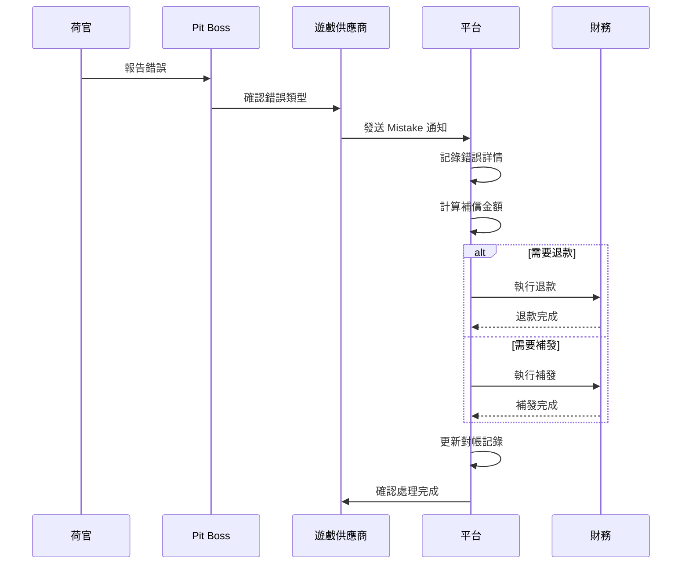

# 03-10 Live Dealer 對帳 (Live Dealer Reconciliation)

**版本**: 1.0.0
**創建日期**: 2026-02-07
**狀態**: P1 - 業務關鍵

---

## 1. 概述

Live Dealer (真人荷官) 對帳確保視訊遊戲結果、荷官操作、投注結算與遊戲供應商一致，並處理 Dealer Mistake 等特殊情況。

### 1.1 對帳目的

- **結果準確性**: 驗證遊戲結果與視訊記錄一致
- **Dealer Mistake 處理**: 標準化荷官錯誤的補償對帳
- **牌靴驗證**: 確保洗牌隨機性符合 RNG 標準
- **桌台限額**: 驗證投注限額配置正確執行

### 1.2 業界標準

| 標準 | 適用範圍 | 關鍵條款 |
|------|---------|---------|
| **GLI-19** | 互動博彩 | §7 Live Games Verification |
| **GLI-20** | 真人遊戲 | §3 Table Game Control |
| **UKGC RTS** | 英國市場 | 5.1.2 Live Game Fairness |
| **MGA** | 馬耳他市場 | Live Casino Requirements |

---

## 2. 遊戲結果對帳

### 2.1 視訊與結果關聯

```yaml
視訊存檔要求:
  保留期限: 至少 180 天 (UKGC 要求)
  存儲格式: MP4 / WebM
  關聯資訊:
    - Round ID
    - 時間戳
    - 遊戲結果
    - 參與玩家列表

對帳要點:
  - 視訊時間戳與遊戲結果時間戳一致
  - 視訊內容與結算結果匹配
  - 支持玩家爭議回放
```

### 2.2 結果對帳服務

```java
/**
 * Live Dealer 結果對帳服務
 */
@Service
@RequiredArgsConstructor
@Slf4j
public class LiveDealerReconciliationService {

    private final LiveGameRoundDao roundDao;
    private final VideoArchiveService videoService;
    private final GpResultClient gpResultClient;

    /**
     * 對帳遊戲回合結果
     */
    public LiveDealerReconciliationResult reconcileRound(String roundId) {
        // 1. 獲取平台記錄的結果
        LiveGameRound platformRound = roundDao.findByRoundId(roundId);
        if (platformRound == null) {
            return LiveDealerReconciliationResult.error("Round not found");
        }

        // 2. 獲取 GP 報告的結果
        GpGameResult gpResult = gpResultClient.getResult(roundId);

        // 3. 獲取視訊存檔資訊
        VideoArchive video = videoService.getArchive(roundId);

        // 4. 比對結果
        boolean resultsMatch = compareResults(platformRound, gpResult);

        // 5. 驗證視訊關聯
        boolean videoLinked = video != null &&
            video.getTimestamp().equals(platformRound.getEndedAt());

        return LiveDealerReconciliationResult.builder()
            .roundId(roundId)
            .tableId(platformRound.getTableId())
            .gameType(platformRound.getGameType())
            .platformResult(platformRound.getResult())
            .gpResult(gpResult.getResult())
            .resultsMatch(resultsMatch)
            .videoLinked(videoLinked)
            .videoUrl(video != null ? video.getUrl() : null)
            .reconciliationTime(LocalDateTime.now())
            .build();
    }

    /**
     * 比對遊戲結果
     */
    private boolean compareResults(LiveGameRound platform, GpGameResult gp) {
        // 比對牌面結果
        if (!platform.getCards().equals(gp.getCards())) {
            return false;
        }

        // 比對輪盤號碼 (如果適用)
        if (platform.getGameType() == GameType.ROULETTE) {
            if (!platform.getWinningNumber().equals(gp.getWinningNumber())) {
                return false;
            }
        }

        // 比對結算金額
        return platform.getTotalPayout().compareTo(gp.getTotalPayout()) == 0;
    }
}
```

---

## 3. Dealer Mistake 對帳

### 3.1 Dealer Mistake 類型

| 錯誤類型 | 英文 | 說明 | 處理方式 |
|---------|------|------|---------|
| **發錯牌** | Misdeal | 發牌順序錯誤 | 回合無效，退款 |
| **多發牌** | Extra Card | 多發了一張牌 | 視情況處理 |
| **少發牌** | Missing Card | 漏發牌 | 補發或無效 |
| **錯誤結算** | Wrong Settlement | 結算金額錯誤 | 調帳補償 |
| **輪盤錯誤** | Ball Error | 球落入但未記錄 | 視訊驗證 |

### 3.2 Dealer Mistake 對帳流程



### 3.3 Dealer Mistake 對帳表

```sql
-- Dealer Mistake 對帳表
CREATE TABLE t_dealer_mistake_reconciliation (
    id                  BIGINT PRIMARY KEY AUTO_INCREMENT,
    round_id            VARCHAR(50) NOT NULL,
    table_id            VARCHAR(50) NOT NULL,
    game_type           VARCHAR(30) NOT NULL,

    -- 錯誤資訊
    mistake_type        VARCHAR(50) NOT NULL,
    mistake_description TEXT,
    reported_at         DATETIME NOT NULL,
    reported_by         VARCHAR(100),  -- Dealer/Pit Boss ID

    -- 影響範圍
    affected_bets       INT NOT NULL,
    affected_amount     DECIMAL(18,2) NOT NULL,

    -- 處理方式
    resolution_type     VARCHAR(50) NOT NULL,  -- VOID, REFUND, ADJUSTMENT
    resolution_amount   DECIMAL(18,2) NOT NULL,

    -- GP 確認
    gp_reference        VARCHAR(100),
    gp_confirmed_at     DATETIME,

    -- 對帳狀態
    platform_processed  BOOLEAN DEFAULT FALSE,
    gp_matched          BOOLEAN DEFAULT FALSE,
    variance_amount     DECIMAL(18,2) DEFAULT 0,

    -- 視訊證據
    video_url           VARCHAR(500),
    video_timestamp     VARCHAR(50),

    created_at          DATETIME DEFAULT CURRENT_TIMESTAMP,

    INDEX idx_round (round_id),
    INDEX idx_table (table_id),
    INDEX idx_date (reported_at)
);
```

### 3.4 Dealer Mistake 對帳查詢

```sql
-- Dealer Mistake 每日對帳
SELECT
    DATE(dm.reported_at) AS report_date,
    dm.table_id,
    dm.game_type,
    dm.mistake_type,

    -- 平台統計
    COUNT(*) AS mistake_count,
    SUM(dm.affected_amount) AS total_affected,
    SUM(dm.resolution_amount) AS total_resolution,

    -- GP 報告
    gp.mistake_count AS gp_count,
    gp.total_amount AS gp_amount,

    -- 差異
    COUNT(*) - gp.mistake_count AS count_variance,
    SUM(dm.resolution_amount) - gp.total_amount AS amount_variance

FROM t_dealer_mistake_reconciliation dm
LEFT JOIN t_gp_mistake_report gp
    ON DATE(dm.reported_at) = gp.report_date
    AND dm.table_id = gp.table_id
WHERE DATE(dm.reported_at) = CURDATE() - INTERVAL 1 DAY
GROUP BY DATE(dm.reported_at), dm.table_id, dm.game_type, dm.mistake_type;
```

---

## 4. 牌靴 Shuffle 驗證

### 4.1 RNG 驗證要求

```yaml
GLI-20 牌靴要求:
  - 洗牌結果必須來自認證的 RNG
  - 必須記錄 RNG Seed
  - 結果必須可重現 (審計用途)
  - 視訊中必須顯示洗牌過程

對帳要點:
  - 驗證 RNG Seed 有效性
  - 驗證牌序與 RNG 輸出匹配
  - 定期抽檢牌序分佈
```

### 4.2 Shuffle 驗證服務

```java
/**
 * 牌靴 Shuffle 驗證服務
 */
@Service
@RequiredArgsConstructor
public class ShuffleVerificationService {

    /**
     * 驗證牌靴洗牌結果
     */
    public ShuffleVerificationResult verifyShoe(String shoeId) {
        // 1. 獲取牌靴資訊
        LiveShoe shoe = shoeDao.findById(shoeId);

        // 2. 獲取 RNG Seed
        String rngSeed = shoe.getRngSeed();

        // 3. 重現 RNG 計算
        List<Card> expectedOrder = rngService.reproduceShuffle(rngSeed);

        // 4. 比對實際牌序
        List<Card> actualOrder = shoe.getCardOrder();
        boolean orderMatch = expectedOrder.equals(actualOrder);

        // 5. 統計檢驗 (卡方檢驗)
        double chiSquare = calculateChiSquare(actualOrder);
        boolean passChiSquare = chiSquare < 50.0; // 閾值

        return ShuffleVerificationResult.builder()
            .shoeId(shoeId)
            .rngSeed(rngSeed)
            .orderMatch(orderMatch)
            .chiSquareValue(chiSquare)
            .passStatisticalTest(passChiSquare)
            .verifiedAt(LocalDateTime.now())
            .build();
    }

    /**
     * 批量驗證 (每日抽檢)
     */
    @Scheduled(cron = "0 0 4 * * ?")  // 每日 04:00
    public void dailySamplingVerification() {
        LocalDate yesterday = LocalDate.now().minusDays(1);

        // 隨機抽取 10% 的牌靴
        List<LiveShoe> shoes = shoeDao.findByDate(yesterday);
        int sampleSize = Math.max(10, shoes.size() / 10);
        List<LiveShoe> sample = randomSample(shoes, sampleSize);

        List<ShuffleVerificationResult> results = sample.stream()
            .map(shoe -> verifyShoe(shoe.getId()))
            .toList();

        // 生成驗證報告
        generateVerificationReport(yesterday, results);
    }
}
```

---

## 5. 桌台限額對帳

### 5.1 限額配置

```yaml
桌台限額類型:
  最低投注: 單注最低金額
  最高投注: 單注最高金額
  桌台限額: 單回合總限額
  玩家限額: 玩家在該桌的個人限額

對帳要點:
  - 驗證配置與 GP 一致
  - 驗證投注攔截正確執行
  - 追蹤超限投注異常
```

### 5.2 限額對帳查詢

```sql
-- 桌台限額配置對帳
SELECT
    t.table_id,
    t.table_name,
    t.game_type,

    -- 平台配置
    t.min_bet AS platform_min,
    t.max_bet AS platform_max,
    t.table_limit AS platform_table_limit,

    -- GP 配置
    gp.min_bet AS gp_min,
    gp.max_bet AS gp_max,
    gp.table_limit AS gp_table_limit,

    -- 差異
    CASE
        WHEN t.min_bet != gp.min_bet THEN 'MIN_MISMATCH'
        WHEN t.max_bet != gp.max_bet THEN 'MAX_MISMATCH'
        WHEN t.table_limit != gp.table_limit THEN 'TABLE_LIMIT_MISMATCH'
        ELSE 'OK'
    END AS config_status

FROM t_live_table t
JOIN t_gp_table_config gp ON t.table_id = gp.table_id
WHERE t.status = 'ACTIVE';

-- 超限投注檢測
SELECT
    b.round_id,
    b.table_id,
    b.player_id,
    b.bet_amount,
    t.max_bet AS table_limit,
    b.bet_amount - t.max_bet AS excess_amount,
    b.created_at

FROM t_live_bet b
JOIN t_live_table t ON b.table_id = t.table_id
WHERE b.bet_amount > t.max_bet
  AND b.created_at >= DATE_SUB(NOW(), INTERVAL 24 HOUR)
ORDER BY b.created_at DESC;
```

---

## 6. 對帳報表

### 6.1 每日 Live Dealer 對帳報表

```sql
-- Live Dealer 每日對帳匯總
SELECT
    DATE(r.ended_at) AS report_date,
    r.game_type,
    t.table_name,

    -- 回合統計
    COUNT(DISTINCT r.round_id) AS total_rounds,
    COUNT(DISTINCT b.player_id) AS unique_players,

    -- 金額統計
    SUM(b.bet_amount) AS total_bets,
    SUM(b.payout_amount) AS total_payouts,
    SUM(b.bet_amount) - SUM(b.payout_amount) AS ggr,

    -- Dealer Mistake
    COUNT(DISTINCT dm.id) AS mistake_count,
    COALESCE(SUM(dm.resolution_amount), 0) AS mistake_resolution,

    -- 對帳狀態
    SUM(CASE WHEN rec.results_match = FALSE THEN 1 ELSE 0 END) AS result_mismatches,
    SUM(CASE WHEN rec.video_linked = FALSE THEN 1 ELSE 0 END) AS video_unlinked

FROM t_live_game_round r
JOIN t_live_table t ON r.table_id = t.table_id
LEFT JOIN t_live_bet b ON r.round_id = b.round_id
LEFT JOIN t_dealer_mistake_reconciliation dm ON r.round_id = dm.round_id
LEFT JOIN t_live_dealer_reconciliation rec ON r.round_id = rec.round_id
WHERE DATE(r.ended_at) = CURDATE() - INTERVAL 1 DAY
GROUP BY DATE(r.ended_at), r.game_type, t.table_name;
```

---

## 7. 監控與告警

### 7.1 關鍵指標

| 指標 | Prometheus 名稱 | 告警閾值 |
|------|----------------|---------|
| 結果不匹配率 | `live_dealer_result_mismatch_rate` | > 0.01% |
| Dealer Mistake 頻率 | `live_dealer_mistake_rate` | > 0.5% |
| 視訊缺失率 | `live_dealer_video_missing_rate` | > 1% |
| RNG 驗證失敗 | `live_dealer_rng_failure_count` | > 0 |

---

## 8. 相關文檔

- [03-04-03 對帳模型](03-04-03_Reconciliation_Model.md) - 遊戲對帳基礎
- [03-05 GLI 認證](03-05_GLI_Certification.md) - RNG 認證流程
- [02-SW-08 百家樂平局](../02_Finance_Center/seamless-wallet/02-SW-08_Baccarat_Tie.md) - 百家樂特殊邏輯
- [02-03 對帳系統](../02_Finance_Center/02-03_Reconciliation_System.md) - 核心對帳架構

---

**返回**: [遊戲中心](README.md) | [iGaming 首頁](../README.md)
