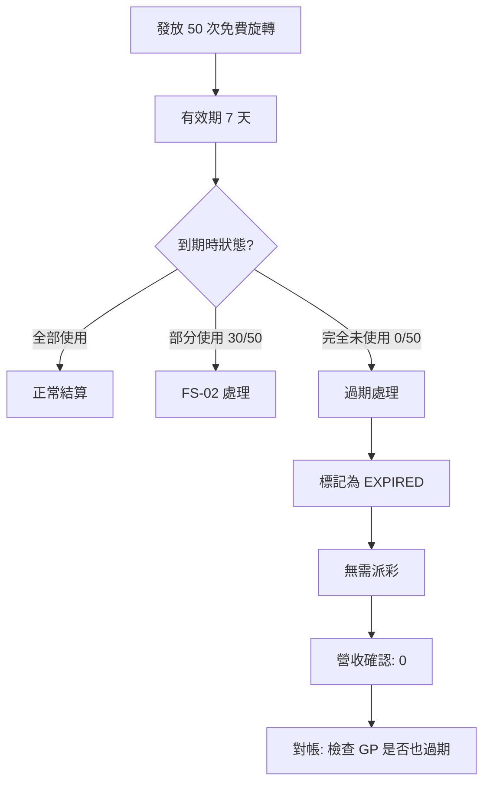

# 03-11 Free Spins Edge Case Reconciliation (免費旋轉邊緣案例對帳)

**版本**: 1.0.0
**創建日期**: 2026-02-07
**狀態**: ✅ 規範完成
**優先級**: P1 High

---

## 概述

免費旋轉 (Free Spins) 邊緣案例對帳處理免費旋轉的異常場景，包括過期處理、部分使用、跨活動衝突、和錢包分配問題。

---

## 邊緣案例分類

| 案例 | 描述 | 影響 | 優先級 |
|------|------|------|--------|
| **FS-01** | 免費旋轉過期未使用 | 營收確認時機 | P0 |
| **FS-02** | 部分使用後過期 | 剩餘處理 | P1 |
| **FS-03** | 跨活動免費旋轉衝突 | 優先級判定 | P1 |
| **FS-04** | 獎金錢包 vs 現金錢包分配 | 餘額一致性 | P0 |
| **FS-05** | 免費旋轉轉換率差異 | GP 對帳 | P1 |
| **FS-06** | 累積獎金觸發 | 額外派彩 | P2 |

---

## 案例詳解

### FS-01: 免費旋轉過期未使用



**對帳規則**:
```sql
-- 過期免費旋轉對帳
SELECT
    fs.id,
    fs.player_id,
    fs.total_spins,
    fs.used_spins,
    fs.expired_at,
    gp.gp_status,
    CASE
        WHEN fs.status = 'EXPIRED' AND gp.gp_status = 'EXPIRED' THEN 'MATCHED'
        WHEN fs.status = 'EXPIRED' AND gp.gp_status != 'EXPIRED' THEN 'GP_MISMATCH'
        ELSE 'PLATFORM_MISMATCH'
    END AS reconciliation_status
FROM t_free_spins fs
LEFT JOIN t_gp_free_spins_report gp ON fs.gp_free_spin_id = gp.gp_id
WHERE fs.expired_at <= NOW()
  AND fs.expired_at >= DATE_SUB(NOW(), INTERVAL 24 HOUR);
```

### FS-02: 部分使用後過期

| 情況 | 已使用旋轉 | 剩餘旋轉 | 處理 |
|------|-----------|---------|------|
| 已產生獎金 | 30 | 20 (作廢) | 派發已贏獎金，剩餘作廢 |
| 無獎金產生 | 30 | 20 (作廢) | 無需派彩，全部作廢 |

```java
/**
 * 部分使用免費旋轉過期處理
 */
@Transactional(rollbackFor = Throwable.class)
public void handlePartialExpiry(FreeSpins fs) {

    // 1. 計算已使用旋轉的獎金
    BigDecimal totalWinnings = freeSpinResultDao.sumWinnings(fs.getId());

    // 2. 標記過期
    fs.setStatus(FreeSpinsStatus.EXPIRED);
    fs.setExpiredSpins(fs.getTotalSpins() - fs.getUsedSpins());

    // 3. 派發已贏獎金 (如有)
    if (totalWinnings.compareTo(BigDecimal.ZERO) > 0) {
        walletService.creditBonusWallet(
            fs.getPlayerId(),
            totalWinnings,
            "FREE_SPINS_WINNINGS",
            fs.getId()
        );
    }

    // 4. 記錄過期旋轉
    ExpiredSpinsLog log = ExpiredSpinsLog.builder()
        .freeSpinsId(fs.getId())
        .playerId(fs.getPlayerId())
        .expiredSpins(fs.getExpiredSpins())
        .totalWinnings(totalWinnings)
        .build();

    expiredSpinsLogDao.insert(log);
    freeSpinsDao.update(fs);
}
```

### FS-04: 獎金錢包 vs 現金錢包分配

免費旋轉獎金通常進入獎金錢包 (Bonus Wallet)，需滿足流水要求後才能提取。

```yaml
Free Spins Wallet Allocation:
  Winnings Destination:
    Default: Bonus Wallet
    Wagering Requirement: Yes (通常 35x-50x)

  Exceptions:
    - No Wagering Free Spins: → Cash Wallet (直接可提)
    - VIP Player Free Spins: → Cash Wallet (部分運營商)

  Reconciliation Check:
    - Verify winnings credited to correct wallet type
    - Match wagering requirement with activity system
    - Ensure no double-credit (bonus + cash)
```

**對帳查詢**:
```sql
-- 檢查免費旋轉獎金錢包分配
SELECT
    fs.id AS free_spins_id,
    fs.player_id,
    fs.free_spins_type,  -- STANDARD, NO_WAGERING, VIP
    fsr.total_winnings,
    wt.wallet_type,      -- CASH, BONUS
    CASE
        WHEN fs.free_spins_type = 'STANDARD' AND wt.wallet_type = 'BONUS' THEN 'CORRECT'
        WHEN fs.free_spins_type = 'NO_WAGERING' AND wt.wallet_type = 'CASH' THEN 'CORRECT'
        ELSE 'INCORRECT_ALLOCATION'
    END AS allocation_status
FROM t_free_spins fs
JOIN t_free_spin_result fsr ON fs.id = fsr.free_spins_id
JOIN t_wallet_transaction wt ON fsr.credit_transaction_id = wt.id
WHERE fs.completed_at >= DATE_SUB(NOW(), INTERVAL 24 HOUR);
```

### FS-05: 免費旋轉轉換率差異

不同 GP 可能有不同的免費旋轉價值計算：

| GP | 計算方式 | 範例 |
|----|---------|------|
| **Pragmatic Play** | 固定面額 × 次數 | 0.20 EUR × 50 = 10 EUR 價值 |
| **NetEnt** | 最小投注 × 次數 | Min Bet × 50 |
| **Microgaming** | 可配置面額 | 0.10-1.00 EUR 可選 |

**對帳**:
```sql
-- GP 免費旋轉價值對帳
SELECT
    fs.id,
    fs.game_provider_id,
    fs.spin_value AS platform_spin_value,
    gp_report.spin_value AS gp_spin_value,
    fs.total_spins,
    fs.spin_value * fs.total_spins AS platform_total_value,
    gp_report.total_value AS gp_total_value,
    ABS(fs.spin_value * fs.total_spins - gp_report.total_value) AS variance
FROM t_free_spins fs
LEFT JOIN t_gp_free_spins_report gp_report
    ON fs.gp_free_spin_id = gp_report.gp_id
WHERE fs.created_at >= DATE_SUB(NOW(), INTERVAL 7 DAY)
  AND ABS(fs.spin_value * fs.total_spins - gp_report.total_value) > 0.01;
```

---

## 數據庫設計

```sql
-- 免費旋轉邊緣案例記錄
CREATE TABLE t_free_spins_edge_case (
    id                      BIGINT PRIMARY KEY AUTO_INCREMENT,
    free_spins_id           BIGINT NOT NULL,
    player_id               BIGINT NOT NULL,

    -- 案例類型
    edge_case_type          VARCHAR(20) NOT NULL,  -- FS-01 to FS-06
    edge_case_description   TEXT,

    -- 影響
    affected_spins          INT,
    affected_amount         DECIMAL(18,4),
    wallet_type_affected    VARCHAR(20),

    -- 處理
    resolution_status       VARCHAR(20) NOT NULL,  -- OPEN, RESOLVED, WAIVED
    resolution_action       TEXT,
    resolved_by             BIGINT,
    resolved_at             DATETIME,

    -- GP 對帳
    gp_aligned              BOOLEAN,
    gp_discrepancy_detail   TEXT,

    -- 審計
    created_at              DATETIME DEFAULT CURRENT_TIMESTAMP,

    INDEX idx_free_spins (free_spins_id),
    INDEX idx_type (edge_case_type, resolution_status)
) ENGINE=InnoDB COMMENT='免費旋轉邊緣案例';
```

---

## 監控指標

```yaml
metrics:
  - name: free_spins_expired_unused_count
    type: counter
    description: 完全未使用即過期的免費旋轉數
    labels: [game_provider, activity_id]

  - name: free_spins_partial_expiry_rate
    type: gauge
    description: 部分使用後過期的比率
    target: "< 20%"

  - name: free_spins_wallet_allocation_errors
    type: counter
    description: 錢包分配錯誤數
    alert:
      - condition: value > 0
        severity: critical
        message: "免費旋轉獎金分配到錯誤錢包"

  - name: free_spins_gp_value_variance
    type: gauge
    description: GP 免費旋轉價值差異
    unit: EUR
    alert:
      - condition: abs(value) > 100
        severity: warning
```

---

## 相關文檔

- [02-SW-06_Free_Spins.md](../02_Finance_Center/seamless-wallet/02-SW-06_Free_Spins.md) - 免費旋轉基礎
- [04-05_Bonus_Wagering_Reconciliation.md](../04_Activity_Center/04-05_Bonus_Wagering_Reconciliation.md) - 獎金流水對帳
- [03-04-03_Reconciliation_Model.md](03-04-03_Reconciliation_Model.md) - 遊戲對帳模型

---

## 版本歷史

| 版本 | 日期 | 變更內容 |
|------|------|---------|
| 1.0.0 | 2026-02-07 | 初始版本：6 種邊緣案例定義、對帳規則、監控指標 |

---

**返回**: [遊戲中心](README.md) | [iGaming 首頁](../README.md)
