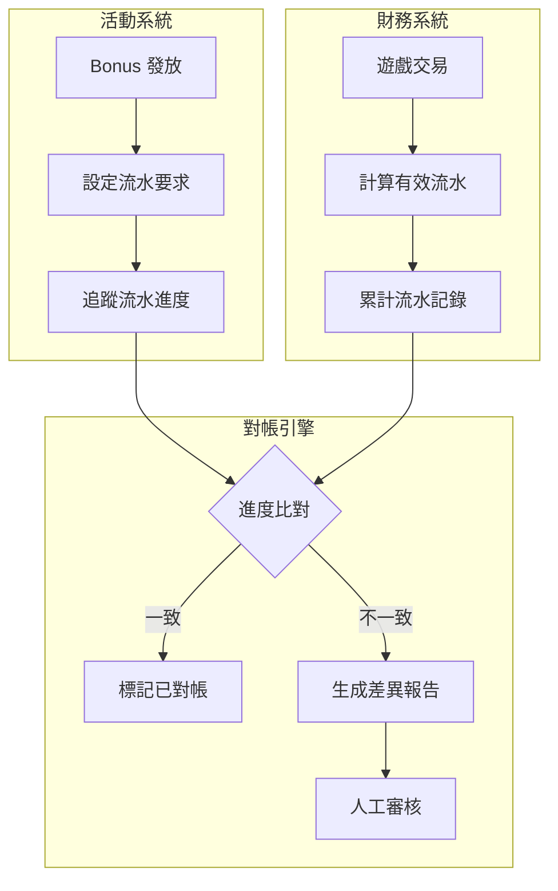

# 04-05 Bonus 投注要求對帳 (Bonus Wagering Reconciliation)

**版本**: 1.0.0
**創建日期**: 2026-02-07
**狀態**: P1 - 業務關鍵

---

## 1. 概述

Bonus 投注要求對帳確保活動系統與財務系統的流水進度一致，正確處理過期獎金，並追蹤跨 GP 的流水歸集。

### 1.1 對帳目的

- **進度一致性**: 確保活動系統與財務系統的流水進度同步
- **過期處理**: 驗證過期獎金的扣回金額正確
- **跨 GP 歸集**: 確保不同遊戲供應商的流水正確累計
- **玩家爭議**: 支持玩家流水查詢和爭議處理

### 1.2 業界標準

| 標準 | 適用範圍 | 關鍵條款 |
|------|---------|---------|
| **UKGC** | 英國市場 | Fairness of Terms, SR 3.2.2 |
| **MGA** | 馬耳他市場 | Bonus Terms Directive |
| **ASA/CAP** | 廣告標準 | Wagering Requirement Transparency |

---

## 2. 投注要求結構

### 2.1 投注要求類型

| 類型 | 英文 | 計算基礎 | 典型倍數 |
|------|------|---------|---------|
| **獎金流水** | Bonus Wagering | Bonus Amount | 20-40x |
| **存款+獎金流水** | Deposit + Bonus | Deposit + Bonus | 15-35x |
| **純存款流水** | Deposit Only | Deposit Amount | 1-5x |
| **派彩流水** | Winnings Wagering | Bonus Winnings | 1-3x |

### 2.2 流水進度計算

```yaml
投注要求計算:
  公式: RequiredWagering = BaseAmount × WageringMultiplier

  範例:
    獎金: $100
    流水倍數: 35x
    總流水要求: $100 × 35 = $3,500

  進度追蹤:
    累計有效流水: $2,100
    完成進度: $2,100 / $3,500 = 60%
    剩餘流水: $1,400

  遊戲權重影響:
    Slots: 100% (投注 $100 → 貢獻 $100)
    Live: 10% (投注 $100 → 貢獻 $10)
    Sports: 不計入 (投注 $100 → 貢獻 $0)
```

---

## 3. 雙系統進度對帳

### 3.1 對帳架構



### 3.2 對帳服務實現

```java
/**
 * Bonus 流水對帳服務
 * SmartAdmin 架構: Service 層
 */
@Service
@RequiredArgsConstructor
@Slf4j
public class BonusWageringReconciliationService {

    private final BonusInstanceDao bonusInstanceDao;
    private final WageringProgressDao wageringProgressDao;
    private final GameTransactionDao gameTransactionDao;

    /**
     * 對帳玩家的流水進度
     */
    public WageringReconciliationResult reconcilePlayerWagering(
            Long playerId,
            Long bonusInstanceId) {

        // 1. 獲取活動系統的流水記錄
        BonusInstance bonus = bonusInstanceDao.selectById(bonusInstanceId);
        BigDecimal activityProgress = bonus.getWageringProgress();

        // 2. 從財務系統計算實際流水
        BigDecimal financeProgress = calculateFinanceWagering(
            playerId,
            bonus.getActivatedAt(),
            bonus.getExpiresAt()
        );

        // 3. 比對差異
        BigDecimal variance = activityProgress.subtract(financeProgress).abs();
        BigDecimal variancePercent = variance.divide(bonus.getWageringRequired(), 4, RoundingMode.HALF_UP)
            .multiply(new BigDecimal("100"));

        // 4. 判斷是否需要調整
        boolean needsAdjustment = variancePercent.compareTo(new BigDecimal("0.1")) > 0; // 0.1% 容差

        return WageringReconciliationResult.builder()
            .bonusInstanceId(bonusInstanceId)
            .playerId(playerId)
            .wageringRequired(bonus.getWageringRequired())
            .activityProgress(activityProgress)
            .financeProgress(financeProgress)
            .variance(variance)
            .variancePercent(variancePercent)
            .needsAdjustment(needsAdjustment)
            .build();
    }

    /**
     * 從財務系統計算有效流水
     */
    private BigDecimal calculateFinanceWagering(
            Long playerId,
            LocalDateTime startTime,
            LocalDateTime endTime) {

        // 獲取時間範圍內的遊戲交易
        List<GameTransaction> transactions = gameTransactionDao
            .findByPlayerIdAndDateRange(playerId, startTime, endTime);

        // 按遊戲權重計算有效流水
        return transactions.stream()
            .filter(tx -> tx.getType() == TransactionType.BET)
            .map(tx -> {
                BigDecimal weight = getGameWeight(tx.getGameType());
                return tx.getAmount().multiply(weight);
            })
            .reduce(BigDecimal.ZERO, BigDecimal::add);
    }

    /**
     * 批量對帳
     */
    public List<WageringReconciliationResult> batchReconcile(LocalDate date) {
        // 獲取當日有流水活動的 Bonus
        List<BonusInstance> activeBonuses = bonusInstanceDao
            .findActiveWithWageringActivity(date);

        return activeBonuses.stream()
            .map(bonus -> reconcilePlayerWagering(bonus.getPlayerId(), bonus.getId()))
            .filter(WageringReconciliationResult::needsAdjustment)
            .toList();
    }
}
```

---

## 4. 過期獎金對帳

### 4.1 過期處理規則

```yaml
過期獎金處理:

  情境 1: 流水未完成，有獎金餘額
    處理: 扣除獎金餘額，保留現金餘額
    對帳: 驗證扣除金額 = 剩餘獎金

  情境 2: 流水完成，已轉為現金
    處理: 無需處理
    對帳: 驗證流水記錄完整

  情境 3: 流水未完成，無獎金餘額
    處理: 無需處理
    對帳: 驗證獎金已使用完畢

  情境 4: 流水完成，有派彩限制
    處理: 按最大派彩限制處理
    對帳: 驗證超額派彩已扣回
```

### 4.2 過期對帳實現

```java
/**
 * Bonus 過期對帳 Manager
 * SmartAdmin 架構: Manager 層 (涉及事務)
 */
@Component
@RequiredArgsConstructor
@Slf4j
public class BonusExpirationReconciliationManager {

    private final BonusInstanceDao bonusInstanceDao;
    private final WalletManager walletManager;

    /**
     * 處理過期 Bonus 並對帳
     */
    @Scheduled(cron = "0 0 3 * * ?")  // 每日 03:00
    @Transactional(rollbackFor = Throwable.class)
    public void processExpiredBonuses() {
        LocalDateTime now = LocalDateTime.now();

        // 1. 獲取已過期但未處理的 Bonus
        List<BonusInstance> expiredBonuses = bonusInstanceDao
            .findExpiredUnprocessed(now);

        List<BonusExpirationRecord> records = new ArrayList<>();

        for (BonusInstance bonus : expiredBonuses) {
            BonusExpirationRecord record = processExpiration(bonus);
            records.add(record);
        }

        // 2. 生成過期對帳報告
        generateExpirationReport(records);
    }

    private BonusExpirationRecord processExpiration(BonusInstance bonus) {
        // 1. 計算需扣回的金額
        BigDecimal bonusBalance = walletManager.getBonusBalance(
            bonus.getPlayerId(), bonus.getId());

        // 2. 執行扣回
        if (bonusBalance.compareTo(BigDecimal.ZERO) > 0) {
            walletManager.debitBonusExpiration(
                bonus.getPlayerId(),
                bonus.getId(),
                bonusBalance
            );
        }

        // 3. 更新 Bonus 狀態
        bonus.setStatus(BonusStatus.EXPIRED);
        bonus.setExpiredAt(LocalDateTime.now());
        bonus.setForfeitedAmount(bonusBalance);
        bonusInstanceDao.updateById(bonus);

        // 4. 記錄對帳結果
        return BonusExpirationRecord.builder()
            .bonusInstanceId(bonus.getId())
            .playerId(bonus.getPlayerId())
            .bonusAmount(bonus.getBonusAmount())
            .wageringRequired(bonus.getWageringRequired())
            .wageringProgress(bonus.getWageringProgress())
            .completionPercent(bonus.getWageringProgress()
                .divide(bonus.getWageringRequired(), 4, RoundingMode.HALF_UP)
                .multiply(new BigDecimal("100")))
            .bonusBalance(bonusBalance)
            .forfeitedAmount(bonusBalance)
            .expiredAt(LocalDateTime.now())
            .build();
    }
}
```

### 4.3 過期對帳表

```sql
-- Bonus 過期對帳表
CREATE TABLE t_bonus_expiration_reconciliation (
    id                  BIGINT PRIMARY KEY AUTO_INCREMENT,
    reconciliation_date DATE NOT NULL,

    -- 統計
    total_expired       INT NOT NULL,
    total_forfeited_amount DECIMAL(18,2) NOT NULL,

    -- 完成率分佈
    completed_0_25_pct  INT DEFAULT 0,   -- 0-25% 完成
    completed_25_50_pct INT DEFAULT 0,   -- 25-50% 完成
    completed_50_75_pct INT DEFAULT 0,   -- 50-75% 完成
    completed_75_99_pct INT DEFAULT 0,   -- 75-99% 完成

    -- 對帳狀態
    all_reconciled      BOOLEAN DEFAULT TRUE,
    discrepancy_count   INT DEFAULT 0,

    created_at          DATETIME DEFAULT CURRENT_TIMESTAMP,

    UNIQUE KEY uk_date (reconciliation_date)
);

-- Bonus 過期明細表
CREATE TABLE t_bonus_expiration_detail (
    id                  BIGINT PRIMARY KEY AUTO_INCREMENT,
    reconciliation_id   BIGINT NOT NULL,
    bonus_instance_id   BIGINT NOT NULL,
    player_id           BIGINT NOT NULL,

    bonus_amount        DECIMAL(18,2) NOT NULL,
    wagering_required   DECIMAL(18,2) NOT NULL,
    wagering_progress   DECIMAL(18,2) NOT NULL,
    completion_percent  DECIMAL(8,4) NOT NULL,

    bonus_balance       DECIMAL(18,2) NOT NULL,
    forfeited_amount    DECIMAL(18,2) NOT NULL,

    -- 對帳
    balance_verified    BOOLEAN DEFAULT TRUE,
    variance_amount     DECIMAL(18,2) DEFAULT 0,

    expired_at          DATETIME NOT NULL,
    created_at          DATETIME DEFAULT CURRENT_TIMESTAMP,

    INDEX idx_reconciliation (reconciliation_id),
    INDEX idx_player (player_id),
    INDEX idx_bonus (bonus_instance_id)
);
```

---

## 5. 跨 GP 流水歸集

### 5.1 歸集邏輯

```yaml
跨 GP 流水歸集:

  場景: 玩家在多個 GP 遊戲中產生流水

  歸集規則:
    - 每個 GP 獨立報告流水
    - 平台匯總所有 GP 流水
    - 按統一權重計算有效流水

  對帳要點:
    - 驗證各 GP 報告的流水準確
    - 驗證匯總計算正確
    - 處理 GP 報告延遲
```

### 5.2 跨 GP 對帳查詢

```sql
-- 跨 GP 流水歸集對帳
SELECT
    bi.id AS bonus_instance_id,
    bi.player_id,
    bi.wagering_required,

    -- 各 GP 流水統計
    gp.provider_code,
    SUM(gt.bet_amount) AS gross_wagering,
    SUM(gt.bet_amount * gw.weight) AS weighted_wagering,

    -- 歸集後總流水
    (SELECT SUM(bet_amount * weight)
     FROM t_game_transaction gt2
     JOIN t_game_weight gw2 ON gt2.game_type = gw2.game_type
     WHERE gt2.player_id = bi.player_id
       AND gt2.created_at BETWEEN bi.activated_at AND bi.expires_at
    ) AS total_weighted_wagering,

    -- 活動系統記錄
    bi.wagering_progress AS activity_progress,

    -- 差異
    ABS(bi.wagering_progress -
        (SELECT SUM(bet_amount * weight)
         FROM t_game_transaction gt3
         JOIN t_game_weight gw3 ON gt3.game_type = gw3.game_type
         WHERE gt3.player_id = bi.player_id
           AND gt3.created_at BETWEEN bi.activated_at AND bi.expires_at
        )) AS variance

FROM t_bonus_instance bi
JOIN t_game_transaction gt ON bi.player_id = gt.player_id
    AND gt.created_at BETWEEN bi.activated_at AND bi.expires_at
JOIN t_game_provider gp ON gt.provider_id = gp.id
JOIN t_game_weight gw ON gt.game_type = gw.game_type
WHERE bi.status IN ('ACTIVE', 'COMPLETED')
  AND bi.activated_at >= DATE_SUB(CURDATE(), INTERVAL 30 DAY)
GROUP BY bi.id, gp.provider_code
HAVING variance > 1  -- 差異 > $1
ORDER BY variance DESC;
```

---

## 6. 流水要求變更追溯

### 6.1 變更場景

| 變更類型 | 觸發條件 | 處理方式 |
|---------|---------|---------|
| **規則更新** | 活動規則修改 | 不追溯，僅影響新 Bonus |
| **權重調整** | 遊戲權重變更 | 可選追溯或僅新流水 |
| **手動調整** | 客服處理爭議 | 記錄變更日誌 |

### 6.2 變更追蹤表

```sql
-- 流水要求變更追蹤表
CREATE TABLE t_wagering_requirement_change (
    id                  BIGINT PRIMARY KEY AUTO_INCREMENT,
    bonus_instance_id   BIGINT NOT NULL,
    player_id           BIGINT NOT NULL,

    -- 變更資訊
    change_type         VARCHAR(50) NOT NULL,  -- RULE_UPDATE, WEIGHT_CHANGE, MANUAL_ADJUST
    old_requirement     DECIMAL(18,2) NOT NULL,
    new_requirement     DECIMAL(18,2) NOT NULL,
    old_progress        DECIMAL(18,2) NOT NULL,
    new_progress        DECIMAL(18,2),

    -- 變更原因
    reason              VARCHAR(500),
    changed_by          VARCHAR(100) NOT NULL,  -- SYSTEM, operator_id

    created_at          DATETIME DEFAULT CURRENT_TIMESTAMP,

    INDEX idx_bonus (bonus_instance_id),
    INDEX idx_player (player_id)
);
```

---

## 7. 玩家爭議處理

### 7.1 常見爭議類型

| 爭議類型 | 說明 | 處理方式 |
|---------|------|---------|
| **進度不符** | 玩家認為流水已達標 | 提供詳細流水記錄 |
| **遊戲不計入** | 某遊戲投注未計入 | 核對遊戲權重配置 |
| **過期爭議** | 爭議過期時間 | 核對活動規則和時間 |

### 7.2 爭議查詢 API

```java
/**
 * 玩家流水查詢 Controller
 */
@RestController
@RequestMapping("/bonus/wagering")
@RequiredArgsConstructor
public class WageringQueryController {

    private final WageringQueryService wageringQueryService;

    /**
     * 查詢流水詳情
     */
    @GetMapping("/detail/{bonusInstanceId}")
    public ResponseDTO<WageringDetailVO> getWageringDetail(
            @PathVariable Long bonusInstanceId,
            @RequestParam(required = false) LocalDate startDate,
            @RequestParam(required = false) LocalDate endDate) {

        return wageringQueryService.getWageringDetail(
            bonusInstanceId, startDate, endDate)
            .map(ResponseDTO::ok)
            .getOrElse(() -> ResponseDTO.error(UserErrorCode.BONUS_NOT_FOUND));
    }

    /**
     * 查詢按遊戲分組的流水
     */
    @GetMapping("/by-game/{bonusInstanceId}")
    public ResponseDTO<List<GameWageringVO>> getWageringByGame(
            @PathVariable Long bonusInstanceId) {

        return ResponseDTO.ok(
            wageringQueryService.getWageringByGame(bonusInstanceId));
    }
}
```

---

## 8. 監控與告警

### 8.1 關鍵指標

| 指標 | Prometheus 名稱 | 告警閾值 |
|------|----------------|---------|
| 進度差異率 | `bonus_wagering_variance_rate` | > 0.5% |
| 過期處理延遲 | `bonus_expiration_delay_hours` | > 1 小時 |
| 爭議處理時間 | `bonus_dispute_resolution_hours` | > 24 小時 |
| 跨 GP 同步延遲 | `gp_wagering_sync_delay_minutes` | > 30 分鐘 |

---

## 9. 相關文檔

- [04-02 Bonus 計算引擎](04-02_Bonus_Calculation_Engine.md) - 流水計算規則
- [02-04 流水計算](../02_Finance_Center/02-04_Turnover_and_Game_Reconciliation_Analysis.md) - 財務流水計算
- [02-03 對帳系統](../02_Finance_Center/02-03_Reconciliation_System.md) - 核心對帳架構

---

**返回**: [活動中心](README.md) | [iGaming 首頁](../README.md)
