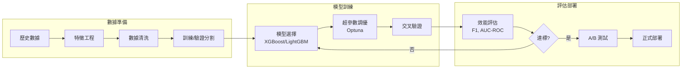

# 05-02-03 多維度風控規則 (ML Integration & Multi-Dimensional Rules)

## 文檔信息

| 屬性 | 值 |
|------|-----|
| **文檔版本** | 4.0.0 |
| **最後更新** | 2026-02-07 |
| **父文檔** | [05-02 欺詐檢測](./05-02_Fraud_Detection.md) |
| **維護團隊** | Risk Team & Backend Team |

---

## 1. 遊戲類型維度配置

### 1.1 t_risk_rule_config 遊戲類型過濾

```sql
-- 查詢適用於特定遊戲類型的規則
SELECT
    rule_code,
    rule_name,
    action_type,
    rule_params
FROM t_risk_rule_config
WHERE enabled = TRUE
  AND (
    game_types IS NULL  -- 適用所有遊戲類型
    OR JSON_CONTAINS(game_types, JSON_QUOTE(#{gameType}))  -- 包含指定遊戲類型
  )
  AND deleted = FALSE
ORDER BY rule_category, rule_code;
```

### 1.2 遊戲類型枚舉

```java
/**
 * 遊戲類型枚舉
 */
public enum GameType {
    SPORTS("體育博彩"),
    LIVE("真人娛樂"),
    SLOTS("老虎機"),
    LOTTERY("彩票"),
    POKER("撲克"),
    FISHING("捕魚機"),
    ESPORTS("電子競技");

    private final String description;

    GameType(String description) {
        this.description = description;
    }
}
```

### 1.3 配置示例

```sql
-- 僅適用於體育博彩的規則
INSERT INTO t_risk_rule_config (rule_code, rule_name, action_type, game_types) VALUES
('SAME_MATCH_HEDGE', '同局反向投注', 'BLOCK', '["SPORTS"]'),
('CROSS_MATCH_HEDGE', '跨局反向投注', 'FLAG', '["SPORTS"]');

-- 適用於體育博彩和真人娛樂的規則
INSERT INTO t_risk_rule_config (rule_code, rule_name, action_type, game_types) VALUES
('LOW_ODDS_WAGERING', '低賠率洗水', 'FLAG', '["SPORTS", "LIVE"]');

-- 適用所有遊戲類型的規則 (game_types = NULL)
INSERT INTO t_risk_rule_config (rule_code, rule_name, action_type, game_types) VALUES
('BLACKLIST_PLAYER', '黑名單玩家', 'BLOCK', NULL),
('BOT_DETECTION', '機器人檢測', 'BLOCK', NULL);
```

---

## 2. 個別遊戲黑名單

### 2.1 excluded_games 欄位用途

排除特定遊戲商或遊戲 ID。

**配置示例**:

```sql
-- 排除 Evolution Gaming 的 Baccarat
UPDATE t_risk_rule_config
SET excluded_games = '["EVOLUTION_BACCARAT", "EVOLUTION_DRAGON_TIGER"]'
WHERE rule_code = 'LOW_ODDS_WAGERING';

-- 查詢時過濾排除的遊戲
SELECT
    rule_code,
    rule_name,
    action_type
FROM t_risk_rule_config
WHERE enabled = TRUE
  AND (
    excluded_games IS NULL
    OR NOT JSON_CONTAINS(excluded_games, JSON_QUOTE(#{gameId}))
  )
  AND deleted = FALSE;
```

### 2.2 SmartAdmin 實現

```java
/**
 * Dao 層 - 規則配置查詢（含遊戲過濾）
 */
@Mapper
public interface RiskRuleConfigDao extends BaseMapper<RiskRuleConfigEntity> {

    /**
     * 查詢適用於指定遊戲的啟用規則
     *
     * @param gameType 遊戲類型
     * @param gameId 遊戲 ID
     * @return List<RiskRuleConfigEntity> 規則列表
     */
    @Select({
        "<script>",
        "SELECT * FROM t_risk_rule_config",
        "WHERE enabled = TRUE",
        "  AND deleted = FALSE",
        "  AND (",
        "    game_types IS NULL",
        "    OR JSON_CONTAINS(game_types, #{gameType})",
        "  )",
        "  AND (",
        "    excluded_games IS NULL",
        "    OR NOT JSON_CONTAINS(excluded_games, #{gameId})",
        "  )",
        "ORDER BY rule_category, rule_code",
        "</script>"
    })
    List<RiskRuleConfigEntity> selectEnabledRulesForGame(
        @Param("gameType") String gameType,
        @Param("gameId") String gameId
    );
}
```

---

## 3. 個別玩家風險分級

### ⚠️ VIP 玩家風控重要說明

> **合規要求**: 根據 UKGC LCCP 及 Entain £17M 罰款案例教訓，**VIP 玩家必須經過與普通玩家完全相同的風控規則檢查**。
>
> VIP Level 的唯一影響是：
> - ✅ 人工審核隊列中的優先級排序（VIP 提案優先處理）
> - ✅ 專屬客服協助準備 KYC/SOF 文件
> - ❌ **不影響**風控規則觸發條件
> - ❌ **不影響** AML 閾值
> - ❌ **不影響**可負擔性評估觸發
>
> **違規案例參考**: [05-03 KYC/AML §11](./05-03_KYC_AML.md) - Entain £17M、888 Holdings、Betfred £3.25M

### 3.1 t_player_risk_profile 表結構

```sql
CREATE TABLE t_player_risk_profile (
    id BIGINT PRIMARY KEY AUTO_INCREMENT COMMENT '玩家風險檔案 ID',
    player_id BIGINT NOT NULL UNIQUE COMMENT '玩家 ID',

    -- 風險等級
    risk_level VARCHAR(20) DEFAULT 'LOW' COMMENT '風險等級 (LOW/MEDIUM/HIGH/BLACKLIST)',
    risk_score INT DEFAULT 0 COMMENT '風險評分 (0-100)',

    -- 統計數據
    total_bets INT DEFAULT 0 COMMENT '總投注次數',
    total_bet_amount DECIMAL(15, 2) DEFAULT 0 COMMENT '總投注金額',
    total_win_amount DECIMAL(15, 2) DEFAULT 0 COMMENT '總贏得金額',
    win_rate DECIMAL(5, 2) DEFAULT 0 COMMENT '勝率 (%)',

    -- 風控標記
    flagged_count INT DEFAULT 0 COMMENT '被風控標記次數',
    blocked_count INT DEFAULT 0 COMMENT '被阻斷次數',
    last_flagged_at DATETIME COMMENT '最後風控標記時間',

    -- 黑名單資訊
    is_blacklisted BOOLEAN DEFAULT FALSE COMMENT '是否黑名單',
    blacklist_reason VARCHAR(500) COMMENT '黑名單原因',
    blacklisted_at DATETIME COMMENT '加入黑名單時間',
    blacklisted_by BIGINT COMMENT '操作人員 ID',

    -- 審計欄位
    created_at DATETIME DEFAULT CURRENT_TIMESTAMP,
    updated_at DATETIME DEFAULT CURRENT_TIMESTAMP ON UPDATE CURRENT_TIMESTAMP,
    deleted BOOLEAN DEFAULT FALSE,

    INDEX idx_risk_level (risk_level, deleted),
    INDEX idx_blacklist (is_blacklisted, deleted),
    INDEX idx_last_flagged (last_flagged_at)
) COMMENT='玩家風險檔案表';
```

### 3.2 風險評分計算

```java
/**
 * Manager 層 - 玩家風險評分計算
 */
@Service
@RequiredArgsConstructor
public class PlayerRiskProfileManager {

    private final PlayerRiskProfileDao playerRiskProfileDao;
    private final RiskProposalDao riskProposalDao;

    /**
     * 更新玩家風險評分（含事務）
     *
     * @param playerId 玩家 ID
     * @return int 新的風險評分
     */
    @Transactional(rollbackFor = Throwable.class)
    public int updateRiskScore(Long playerId) {
        // 1. 查詢玩家風險檔案
        PlayerRiskProfileEntity profile = playerRiskProfileDao.selectById(playerId);
        if (profile == null) {
            profile = createDefaultProfile(playerId);
        }

        // 2. 計算風險評分（多因子加權）
        int score = calculateRiskScore(profile);

        // 3. 更新風險等級
        String riskLevel = determineRiskLevel(score);

        profile.setRiskScore(score);
        profile.setRiskLevel(riskLevel);
        playerRiskProfileDao.updateById(profile);

        return score;
    }

    /**
     * 計算風險評分 (0-100)
     * 評分規則:
     * - 被風控標記次數: 每次 +5 分
     * - 被阻斷次數: 每次 +10 分
     * - 異常勝率 (>60% 或 <30%): +20 分
     * - 近期風控提案數量: 每個 +3 分
     */
    private int calculateRiskScore(PlayerRiskProfileEntity profile) {
        int score = 0;

        // 因子 1: 風控標記次數
        score += Math.min(profile.getFlaggedCount() * 5, 30);

        // 因子 2: 阻斷次數
        score += Math.min(profile.getBlockedCount() * 10, 40);

        // 因子 3: 異常勝率
        BigDecimal winRate = profile.getWinRate();
        if (winRate.compareTo(new BigDecimal("60")) > 0 ||
            winRate.compareTo(new BigDecimal("30")) < 0) {
            score += 20;
        }

        // 因子 4: 近期風控提案數量 (30 天)
        LocalDateTime startDate = LocalDateTime.now().minusDays(30);
        int recentProposals = riskProposalDao.countByPlayerId(profile.getPlayerId(), startDate);
        score += Math.min(recentProposals * 3, 20);

        // 總分限制在 0-100
        return Math.min(Math.max(score, 0), 100);
    }

    /**
     * 決定風險等級
     */
    private String determineRiskLevel(int score) {
        if (score >= 70) return "HIGH";    // [70, 100] AUTO_REJECT
        if (score >= 30) return "MEDIUM";  // [30, 70) MANUAL_REVIEW
        return "LOW";                       // [0, 30)  AUTO_APPROVE
    }
}
```

### 3.3 黑名單檢查規則實現

```java
/**
 * 風控規則實現 - 黑名單玩家檢查
 */
public class BlacklistPlayerRule implements RiskRule {

    private final PlayerRiskProfileDao playerRiskProfileDao;

    @Override
    public RuleCheckResult execute(BetRequest betRequest) {
        // 查詢玩家風險檔案
        PlayerRiskProfileEntity profile = playerRiskProfileDao.selectById(betRequest.getPlayerId());

        if (profile != null && profile.getIsBlacklisted()) {
            return RuleCheckResult.builder()
                .matched(true)
                .ruleCode("BLACKLIST_PLAYER")
                .ruleName("黑名單玩家")
                .matchedReason(String.format(
                    "玩家已被列入黑名單: %s (加入時間: %s)",
                    profile.getBlacklistReason(),
                    profile.getBlacklistedAt()
                ))
                .build();
        }

        return RuleCheckResult.notMatched();
    }
}
```

---

## 4. 風險評分因子說明

### 4.1 評分因子權重

| 因子 | 權重 | 上限 | 說明 |
|-----|------|------|------|
| 風控標記次數 | +5/次 | 30 分 | 被風控標記的歷史次數 |
| 阻斷次數 | +10/次 | 40 分 | 實際被阻斷的次數 |
| 異常勝率 | +20 | 20 分 | 勝率 >60% 或 <30% |
| 近期提案數量 | +3/個 | 20 分 | 30 天內的風控提案數量 |

### 4.2 風險等級對應

| 評分範圍 | 風險等級 | 處置建議 |
|---------|---------|---------|
| 0-49 | LOW | 正常監控 |
| 50-79 | MEDIUM | 加強監控 |
| 80-100 | HIGH | 人工審核 |
| 黑名單 | BLACKLIST | 拒絕投注 |

---

## 5. ML 模型基準與評估

### 5.1 模型性能基準

| 模型類型 | 用途 | 準確率目標 | 延遲目標 | 當前狀態 |
|---------|------|-----------|---------|---------|
| **異常投注偵測** | 識別可疑投注模式 | ≥ 95% | < 50ms | ⭐⭐⭐⭐ |
| **多帳戶偵測** | 設備/行為聚類分析 | ≥ 90% | < 100ms | ⭐⭐⭐⭐ |
| **獎金套利偵測** | 識別獎金濫用行為 | ≥ 85% | < 200ms | ⭐⭐⭐ |
| **洗錢風險評分** | AML 風險分級 | ≥ 80% | < 500ms | ⭐⭐⭐ |
| **欺詐交易偵測** | 支付欺詐識別 | ≥ 92% | < 100ms | ⭐⭐⭐⭐ |

### 5.2 評估指標定義

```java
/**
 * ML 模型評估指標
 */
public class MLModelMetrics {

    /**
     * 計算 F1 分數
     * F1 = 2 * (Precision * Recall) / (Precision + Recall)
     */
    public double calculateF1Score(ConfusionMatrix cm) {
        double precision = (double) cm.getTruePositives() /
            (cm.getTruePositives() + cm.getFalsePositives());
        double recall = (double) cm.getTruePositives() /
            (cm.getTruePositives() + cm.getFalseNegatives());

        if (precision + recall == 0) return 0;
        return 2 * (precision * recall) / (precision + recall);
    }

    /**
     * 計算 AUC-ROC
     */
    public double calculateAUCROC(List<PredictionResult> predictions) {
        // 按預測概率排序
        predictions.sort(Comparator.comparing(PredictionResult::getScore).reversed());

        int positives = (int) predictions.stream().filter(p -> p.isActualPositive()).count();
        int negatives = predictions.size() - positives;

        if (positives == 0 || negatives == 0) return 0.5;

        double auc = 0;
        int tpCount = 0;

        for (PredictionResult pred : predictions) {
            if (pred.isActualPositive()) {
                tpCount++;
            } else {
                auc += tpCount;
            }
        }

        return auc / (positives * negatives);
    }
}
```

### 5.3 模型訓練管道



### 5.4 模型漂移監控

```yaml
模型漂移監控:
  數據漂移:
    - 特徵分佈變化 (KS Test, PSI)
    - 缺失值比例變化
    - 新增類別值

  概念漂移:
    - 預測分佈變化
    - 準確率下降趨勢
    - 誤報率上升

  告警閾值:
    - PSI > 0.2: 重新評估模型
    - F1 下降 > 5%: 觸發再訓練
    - 延遲增加 > 50%: 優化模型
```

### 5.5 A/B 測試框架

```java
/**
 * ML 模型 A/B 測試服務
 */
@Service
@RequiredArgsConstructor
public class MLABTestService {

    /**
     * 執行 A/B 測試分流
     */
    public RiskCheckResult executeWithABTest(
            BetRequest request,
            String experimentId) {

        Experiment experiment = experimentDao.findById(experimentId);

        // 計算分組 (一致性 Hash)
        int bucket = Math.abs(request.getPlayerId().hashCode() % 100);

        if (bucket < experiment.getTreatmentRatio()) {
            // 實驗組 - 新模型
            RiskCheckResult result = newModelService.evaluate(request);
            logExperimentResult(experimentId, "TREATMENT", request, result);
            return result;
        } else {
            // 對照組 - 現有模型
            RiskCheckResult result = currentModelService.evaluate(request);
            logExperimentResult(experimentId, "CONTROL", request, result);
            return result;
        }
    }

    /**
     * 統計顯著性檢驗
     */
    public ABTestResult analyzeExperiment(String experimentId) {
        ExperimentStats control = experimentDao.getStats(experimentId, "CONTROL");
        ExperimentStats treatment = experimentDao.getStats(experimentId, "TREATMENT");

        // Chi-Square 檢驗
        double chiSquare = calculateChiSquare(control, treatment);
        double pValue = chiSquareDistribution.cumulativeProbability(chiSquare);

        return ABTestResult.builder()
            .experimentId(experimentId)
            .controlF1(control.getF1Score())
            .treatmentF1(treatment.getF1Score())
            .improvement((treatment.getF1Score() - control.getF1Score()) / control.getF1Score())
            .pValue(pValue)
            .isSignificant(pValue < 0.05)
            .build();
    }
}
```

### 5.6 Prometheus 監控指標

```yaml
ml_model_prediction_total:
  type: counter
  labels: [model_name, model_version, prediction]
  description: "ML 模型預測總數"

ml_model_latency_seconds:
  type: histogram
  labels: [model_name, model_version]
  buckets: [0.01, 0.025, 0.05, 0.1, 0.25, 0.5]
  description: "ML 模型推論延遲"

ml_model_accuracy:
  type: gauge
  labels: [model_name, model_version]
  description: "ML 模型準確率 (滾動 7 天)"

ml_model_drift_score:
  type: gauge
  labels: [model_name, drift_type]
  description: "模型漂移分數 (PSI)"
```

---

## 相關文檔

- [05-02-01 檢測模型](./05-02-01_Detection_Model.md) - 系統概述與架構
- [05-02-02 規則配置](./05-02-02_Rule_Configuration.md) - 風控提案服務與延遲檢查
- [05-02-04 運營工具](./05-02-04_Operations_Tools.md) - SmartAdmin 架構映射與監控
