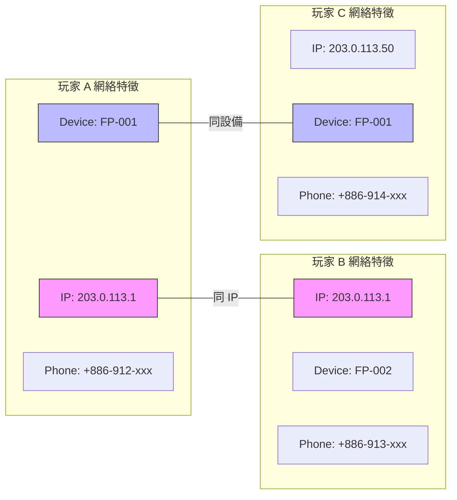
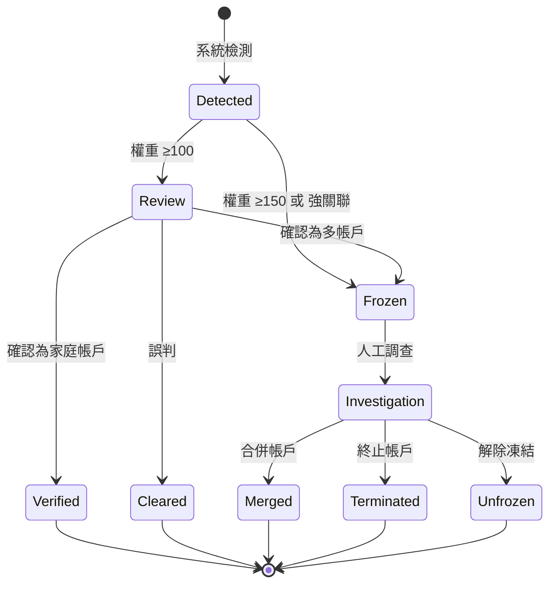
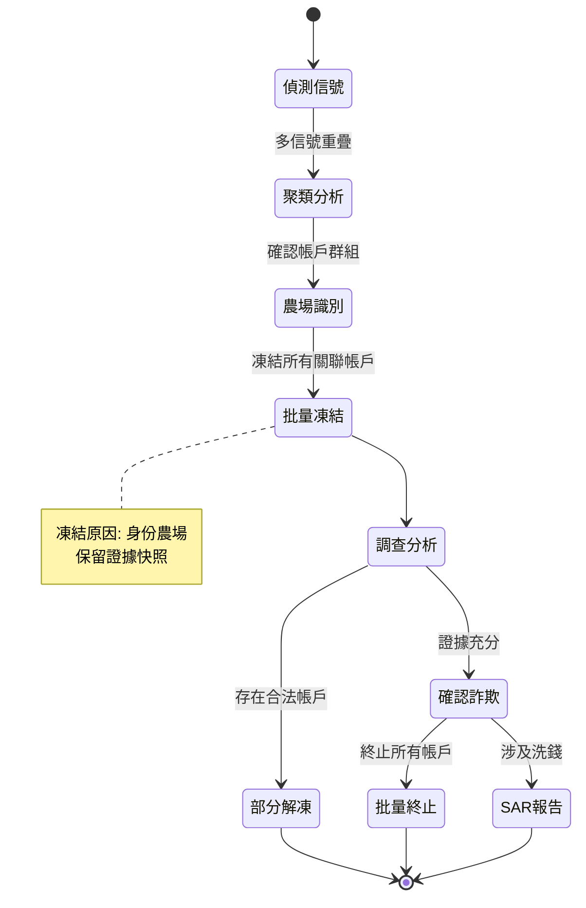

# 05-02-05 多帳戶檢測 (Multi-Account Detection)

## 文檔信息

| 屬性 | 值 |
|------|-----|
| **文檔版本** | 1.0.0 |
| **最後更新** | 2026-02-07 |
| **維護團隊** | Risk Team & Backend Team |
| **合規要求** | UKGC LCCP 17.1.1, MGA License Condition 5.3.4 |

**前置依賴**:
- [05-02 欺詐檢測](./05-02_Fraud_Detection.md) - 索引文檔
- [05-02-01 檢測模型](./05-02-01_Detection_Model.md) - 5 層架構
- [05-02-03 ML 整合](./05-02-03_ML_Integration.md) - 機器學習風控規則
- [15-01 自我排除](../15_Responsible_Gambling/15-01_Self_Exclusion.md) - 自我排除系統

---

## 執行摘要

多帳戶檢測 (Multi-Account Detection) 是 iGaming 反欺詐系統的核心功能，用於識別和處理玩家使用多個帳戶規避平台規則（如獎金套利、自我排除逃避）的行為。

### 業務背景

| 問題類型 | 風險等級 | 監管要求 |
|---------|---------|---------|
| **獎金套利** (Bonus Abuse) | HIGH | UKGC: 每個玩家僅限一個帳戶 |
| **自我排除逃避** | CRITICAL | UKGC LCCP 17.1.1: 必須阻止已排除玩家創建新帳戶 |
| **共謀欺詐** (Collusion) | HIGH | 撲克/P2P 遊戲禁止多帳戶 |
| **洗錢拆分** (Structuring) | CRITICAL | AML 法規: 禁止拆分交易 |

### 系統目標

- **檢測率**: ≥95% 多帳戶行為檢測
- **誤判率**: ≤1% False Positive Rate
- **檢測延遲**: 註冊時 <100ms, 登入時 <50ms
- **家庭帳戶處理**: 支持合法家庭共用設備場景

---

## 1. 設備指紋技術 (Device Fingerprinting)

### 1.1 指紋採集維度

```yaml
設備指紋組成:
  瀏覽器指紋:
    - User-Agent: 完整字符串 + 解析後的 OS/Browser/Version
    - Screen: resolution, colorDepth, devicePixelRatio
    - Timezone: offset, name (IANA)
    - Language: navigator.language, navigator.languages[]
    - Plugins: 已安裝插件列表 (僅 desktop)
    - Canvas: canvas2D 指紋 (anti-aliasing, font rendering)
    - WebGL: renderer, vendor, extensions
    - Audio: AudioContext 指紋
    - Fonts: 系統字體列表 (通過 CSS probing)

  硬體指紋:
    - CPU: hardwareConcurrency, deviceMemory
    - GPU: WebGL renderer (e.g., "ANGLE (Intel HD Graphics 630)")
    - Touch: maxTouchPoints, touch event support
    - Battery: 充電狀態 (如果 API 可用)

  行為指紋:
    - Mouse: 移動軌跡熵值, 點擊間隔模式
    - Keyboard: 打字節奏 (keystroke dynamics)
    - Scroll: 滾動速度, 加速度
    - Navigation: 頁面瀏覽路徑
```

### 1.2 指紋計算算法

```java
/**
 * 設備指紋服務
 * SmartAdmin 架構: Service 層
 */
@Service
@RequiredArgsConstructor
public class DeviceFingerprintService {

    private final DeviceFingerprintDao deviceFingerprintDao;
    private final FingerprintHashManager fingerprintHashManager;

    /**
     * 計算設備指紋
     * @param rawData 原始採集數據
     * @return 指紋 Hash + 相似度向量
     */
    public DeviceFingerprintResult calculateFingerprint(RawDeviceData rawData) {
        // 1. 穩定特徵計算 (變化頻率低)
        String stableHash = fingerprintHashManager.hashStableFeatures(
            rawData.getScreenResolution(),
            rawData.getTimezone(),
            rawData.getLanguage(),
            rawData.getWebglRenderer()
        );

        // 2. 動態特徵計算 (允許一定變化)
        String dynamicHash = fingerprintHashManager.hashDynamicFeatures(
            rawData.getUserAgent(),
            rawData.getPlugins(),
            rawData.getCanvasHash()
        );

        // 3. 行為特徵計算 (需要足夠樣本)
        String behaviorHash = fingerprintHashManager.hashBehaviorFeatures(
            rawData.getMouseEntropy(),
            rawData.getKeyboardRhythm()
        );

        // 4. 組合計算
        return DeviceFingerprintResult.builder()
            .fingerprintId(generateFingerprintId(stableHash, dynamicHash))
            .stableHash(stableHash)
            .dynamicHash(dynamicHash)
            .behaviorHash(behaviorHash)
            .confidence(calculateConfidence(rawData))
            .build();
    }

    /**
     * 指紋相似度比對
     * @param fp1 指紋 1
     * @param fp2 指紋 2
     * @return 相似度 (0.0 - 1.0)
     */
    public double compareFingerprintSimilarity(
            DeviceFingerprintResult fp1,
            DeviceFingerprintResult fp2) {

        // 加權相似度計算
        double stableSimilarity = jaccardSimilarity(
            fp1.getStableHash(), fp2.getStableHash()
        ) * 0.5;  // 穩定特徵權重 50%

        double dynamicSimilarity = jaccardSimilarity(
            fp1.getDynamicHash(), fp2.getDynamicHash()
        ) * 0.3;  // 動態特徵權重 30%

        double behaviorSimilarity = cosineSimilarity(
            fp1.getBehaviorVector(), fp2.getBehaviorVector()
        ) * 0.2;  // 行為特徵權重 20%

        return stableSimilarity + dynamicSimilarity + behaviorSimilarity;
    }
}
```

### 1.3 指紋穩定性與變化處理

```yaml
指紋變化處理策略:

  穩定特徵 (權重 50%):
    變化頻率: 每年 <5%
    允許變化: 否
    處理方式: 完全匹配
    示例: 時區、語言、硬件並發數

  動態特徵 (權重 30%):
    變化頻率: 每月 10-20%
    允許變化: 允許 1-2 項變化
    處理方式: 相似度匹配 (閾值 0.8)
    示例: User-Agent (瀏覽器更新), 插件列表

  行為特徵 (權重 20%):
    變化頻率: 持續微變
    允許變化: 允許一定範圍波動
    處理方式: 向量相似度 (餘弦相似度 >0.7)
    示例: 鍵盤節奏、滑鼠軌跡

  更新策略:
    - 每次登入更新動態特徵
    - 每 30 天更新行為特徵基準線
    - 穩定特徵變化 → 觸發風控審核
```

---

## 2. 網絡層檢測 (Network Layer Detection)

### 2.1 IP 地址分析

```yaml
IP 分析維度:

  直接 IP:
    - IPv4/IPv6 地址
    - GeoIP: 國家、城市、ISP
    - ASN: 自治系統號
    - IP 類型: Residential / Datacenter / Mobile

  代理/VPN 檢測:
    - 端口掃描: 常見代理端口 (1080, 8080, 3128)
    - DNS 泄漏: DNS 解析與 IP 地理位置不符
    - WebRTC 泄漏: 內網 IP 與公網 IP 不符
    - 時區不符: IP 地理位置與瀏覽器時區差異
    - HTTP Header: X-Forwarded-For, Via, Proxy-Connection

  風險 IP 庫:
    - Tor 出口節點
    - 已知 VPN 服務 IP 段
    - Datacenter IP 段 (AWS, GCP, Azure)
    - 歷史欺詐 IP 黑名單
```

### 2.2 家庭網絡檢測 (Household Detection)

```yaml
家庭帳戶合法場景:
  - 夫妻/伴侶各有帳戶
  - 成年子女與父母同住
  - 室友共用網絡

家庭網絡識別規則:

  同一 IP 多帳戶:
    檢測條件:
      - 同一 IP 存在 2+ 帳戶
      - 帳戶註冊時間間隔 >7 天
      - 設備指紋不同
    處理方式: 標記為潛在家庭帳戶

  家庭驗證流程:
    步驟:
      1. 系統檢測到同 IP 多帳戶 → 觸發驗證
      2. 發送驗證郵件給所有帳戶持有人
      3. 每個帳戶獨立完成 KYC 驗證
      4. 人工審核 KYC 文件 (確認不同身份)
      5. 標記為「已驗證家庭帳戶」

  家庭帳戶限制:
    - 禁止參與相同賽事/錦標賽
    - 禁止互相轉帳/贈送
    - 獎金活動各自獨立 (不可分享)
    - P2P 遊戲自動避免對戰
```

### 2.3 網絡關聯圖分析



**關聯分析決策**:
| 關聯類型 | 風險等級 | 處理方式 |
|---------|---------|---------|
| 同 IP + 同設備 | CRITICAL | 立即凍結，人工審核 |
| 同 IP + 不同設備 | MEDIUM | 家庭驗證流程 |
| 不同 IP + 同設備 | HIGH | 帳戶合併調查 |
| 同手機號 | CRITICAL | 不允許 (註冊時阻斷) |

---

## 3. 帳戶關聯分析 (Account Linking)

### 3.1 關聯特徵權重

```yaml
關聯特徵權重表:

  強關聯 (權重 100):
    - 相同身份證號 (同一人)
    - 相同銀行帳戶 (資金關聯)
    - 相同手機號 (驗證衝突)

  中關聯 (權重 60):
    - 相同設備指紋 (同設備)
    - 相同 IP + 相同瀏覽器 (同環境)
    - 相同提款銀行 + 相同戶名 (資金路徑)

  弱關聯 (權重 30):
    - 相同 IP 段 (/24)
    - 相似用戶名模式
    - 相同註冊來源 (Referral)

  觸發閾值:
    - 單一強關聯 → 立即阻斷
    - 總權重 ≥100 → 人工審核
    - 總權重 ≥150 → 帳戶凍結
```

### 3.2 關聯圖構建

```java
/**
 * 帳戶關聯圖服務
 * SmartAdmin 架構: Manager 層 (涉及事務)
 */
@Component
@RequiredArgsConstructor
public class AccountLinkageManager {

    private final AccountLinkageDao accountLinkageDao;
    private final RiskProposalManager riskProposalManager;

    /**
     * 構建帳戶關聯圖
     * @param playerId 玩家 ID
     * @return 關聯帳戶列表 + 關聯強度
     */
    @Transactional(readOnly = true)
    public AccountLinkageGraph buildLinkageGraph(Long playerId) {
        AccountLinkageGraph graph = new AccountLinkageGraph(playerId);

        // 1. 設備指紋關聯
        List<AccountLink> deviceLinks = accountLinkageDao
            .findByDeviceFingerprint(playerId);
        deviceLinks.forEach(link ->
            graph.addEdge(link.getLinkedPlayerId(), LinkType.DEVICE, 60)
        );

        // 2. IP 關聯
        List<AccountLink> ipLinks = accountLinkageDao
            .findByIpAddress(playerId);
        ipLinks.forEach(link ->
            graph.addEdge(link.getLinkedPlayerId(), LinkType.IP, 30)
        );

        // 3. 銀行帳戶關聯
        List<AccountLink> bankLinks = accountLinkageDao
            .findByBankAccount(playerId);
        bankLinks.forEach(link ->
            graph.addEdge(link.getLinkedPlayerId(), LinkType.BANK, 100)
        );

        // 4. 計算總權重
        graph.calculateTotalWeights();

        return graph;
    }

    /**
     * 評估關聯風險並生成提案
     */
    @Transactional(rollbackFor = Throwable.class)
    public void evaluateLinkageRisk(AccountLinkageGraph graph) {
        for (AccountLinkageNode node : graph.getNodes()) {
            if (node.getTotalWeight() >= 150) {
                // 凍結帳戶
                freezeAccount(node.getPlayerId(), "Multi-account detected");
            } else if (node.getTotalWeight() >= 100) {
                // 生成審核提案
                riskProposalManager.createProposal(
                    RiskProposalType.MULTI_ACCOUNT,
                    node.getPlayerId(),
                    node.getEvidenceJson(),
                    RiskPriority.HIGH
                );
            }
        }
    }
}
```

### 3.3 關聯數據表結構

```sql
-- 帳戶關聯表
CREATE TABLE t_account_linkage (
    id              BIGINT PRIMARY KEY,
    player_id_a     BIGINT NOT NULL,
    player_id_b     BIGINT NOT NULL,
    link_type       VARCHAR(32) NOT NULL,  -- DEVICE, IP, BANK, PHONE
    link_value      VARCHAR(256) NOT NULL, -- 關聯特徵值
    weight          INT NOT NULL,
    first_seen      TIMESTAMP NOT NULL,
    last_seen       TIMESTAMP NOT NULL,
    status          VARCHAR(32) DEFAULT 'ACTIVE',
    verified        BOOLEAN DEFAULT FALSE,
    verified_reason VARCHAR(256),
    created_at      TIMESTAMP DEFAULT CURRENT_TIMESTAMP,

    UNIQUE (player_id_a, player_id_b, link_type),
    INDEX idx_player_a (player_id_a),
    INDEX idx_player_b (player_id_b),
    INDEX idx_link_type_value (link_type, link_value)
);

-- 設備指紋歷史表
CREATE TABLE t_device_fingerprint (
    id                  BIGINT PRIMARY KEY,
    fingerprint_id      VARCHAR(64) NOT NULL UNIQUE,
    stable_hash         VARCHAR(64) NOT NULL,
    dynamic_hash        VARCHAR(64) NOT NULL,
    behavior_hash       VARCHAR(64),
    raw_data            JSONB NOT NULL,
    first_player_id     BIGINT NOT NULL,
    player_ids          BIGINT[] DEFAULT '{}',
    player_count        INT DEFAULT 1,
    risk_score          DECIMAL(5,2) DEFAULT 0,
    created_at          TIMESTAMP DEFAULT CURRENT_TIMESTAMP,
    updated_at          TIMESTAMP DEFAULT CURRENT_TIMESTAMP,

    INDEX idx_stable_hash (stable_hash),
    INDEX idx_player_count (player_count) WHERE player_count > 1
);

-- 玩家登入歷史 (用於關聯分析)
CREATE TABLE t_player_login_history (
    id              BIGINT PRIMARY KEY,
    player_id       BIGINT NOT NULL,
    fingerprint_id  VARCHAR(64) NOT NULL,
    ip_address      INET NOT NULL,
    ip_type         VARCHAR(32),  -- RESIDENTIAL, DATACENTER, VPN, TOR
    geo_country     VARCHAR(2),
    geo_city        VARCHAR(64),
    user_agent      VARCHAR(512),
    login_at        TIMESTAMP NOT NULL,
    session_id      VARCHAR(64),

    INDEX idx_player_login (player_id, login_at DESC),
    INDEX idx_fingerprint (fingerprint_id),
    INDEX idx_ip (ip_address)
);
```

---

## 4. 多帳戶處置流程

### 4.1 帳戶凍結流程



### 4.2 帳戶合併規則

```yaml
帳戶合併規則:

  保留帳戶選擇:
    優先級:
      1. KYC 已驗證帳戶
      2. 帳戶存續時間較長
      3. 餘額較高帳戶
      4. 最近活躍帳戶

  資金處理:
    - 現金餘額: 合併至保留帳戶
    - 獎金餘額: 根據條款決定 (通常沒收)
    - 待處理出金: 取消並退回餘額
    - 待處理入金: 完成後合併

  歷史數據:
    - 投注歷史: 保留，標記來源帳戶
    - 交易歷史: 保留，標記來源帳戶
    - 負責任博彩設定: 取較嚴格者
    - 自我排除: 如任一帳戶有排除，保留排除狀態

  禁止合併情況:
    - 任一帳戶有待處理爭議
    - 任一帳戶涉及 AML 調查
    - 帳戶屬於不同身份 (不是同一人)
```

### 4.3 處置 API

```java
/**
 * 多帳戶處置 Controller
 */
@RestController
@RequestMapping("/risk/multi-account")
@RequiredArgsConstructor
public class MultiAccountController {

    private final MultiAccountService multiAccountService;

    /**
     * 查詢帳戶關聯圖
     */
    @GetMapping("/linkage/{playerId}")
    @SaCheckPermission("risk:multi-account:query")
    public ResponseDTO<AccountLinkageGraphVO> getLinkageGraph(
            @PathVariable Long playerId) {
        return multiAccountService.getLinkageGraph(playerId)
            .map(ResponseDTO::ok)
            .getOrElse(() -> ResponseDTO.error(UserErrorCode.PLAYER_NOT_FOUND));
    }

    /**
     * 凍結帳戶
     */
    @PostMapping("/freeze/{playerId}")
    @SaCheckPermission("risk:multi-account:freeze")
    public ResponseDTO<Void> freezeAccount(
            @PathVariable Long playerId,
            @RequestBody @Valid FreezeAccountForm form) {
        return multiAccountService.freezeAccount(playerId, form);
    }

    /**
     * 合併帳戶
     */
    @PostMapping("/merge")
    @SaCheckPermission("risk:multi-account:merge")
    public ResponseDTO<MergeResultVO> mergeAccounts(
            @RequestBody @Valid MergeAccountsForm form) {
        return multiAccountService.mergeAccounts(form);
    }

    /**
     * 驗證家庭帳戶
     */
    @PostMapping("/verify-household")
    @SaCheckPermission("risk:multi-account:verify")
    public ResponseDTO<Void> verifyHousehold(
            @RequestBody @Valid VerifyHouseholdForm form) {
        return multiAccountService.verifyHousehold(form);
    }
}
```

---

## 5. 身份農場偵測 (Identity Farm Detection)

### 5.1 身份農場定義

身份農場是一種有組織的欺詐模式，使用大量虛假或盜用身份批量創建帳戶，用於：
- 獎金套利
- 洗錢
- 比賽操控
- 流量詐欺

### 5.2 偵測信號

| 信號類別 | 具體指標 | 風險等級 |
|---------|---------|---------|
| **批量註冊** | 同 IP/設備 24h 內註冊 > 5 帳戶 | 🔴 Critical |
| **順序身份** | 證件號碼/生日呈順序模式 | 🔴 Critical |
| **合成身份** | 姓名+生日+地址組合異常 | 🟠 High |
| **共享 KYC 文件** | 同一證件照片用於多帳戶 | 🔴 Critical |
| **行為一致性** | 多帳戶投注模式高度相似 | 🟠 High |

### 5.3 偵測演算法

```java
/**
 * 身份農場偵測服務
 */
@Service
@RequiredArgsConstructor
public class IdentityFarmDetector {

    private static final int BATCH_REGISTRATION_THRESHOLD = 5;
    private static final double BEHAVIOR_SIMILARITY_THRESHOLD = 0.85;

    /**
     * 批量註冊偵測
     */
    public IdentityFarmSignal detectBatchRegistration(Long playerId) {
        Player player = playerDao.selectById(playerId);

        // 1. 查找同 IP 24h 內註冊的帳戶
        List<Player> sameIpPlayers = playerDao.findByRegistrationIp(
            player.getRegistrationIp(),
            player.getCreatedAt().minusHours(24),
            player.getCreatedAt().plusHours(24)
        );

        // 2. 查找同設備 24h 內註冊的帳戶
        List<Player> sameDevicePlayers = playerDao.findByRegistrationDevice(
            player.getRegistrationDeviceId(),
            player.getCreatedAt().minusHours(24),
            player.getCreatedAt().plusHours(24)
        );

        int totalRelated = Stream.concat(
            sameIpPlayers.stream(),
            sameDevicePlayers.stream()
        ).distinct().mapToInt(p -> 1).sum();

        if (totalRelated >= BATCH_REGISTRATION_THRESHOLD) {
            return IdentityFarmSignal.builder()
                .signalType(SignalType.BATCH_REGISTRATION)
                .playerId(playerId)
                .relatedPlayerIds(extractPlayerIds(sameIpPlayers, sameDevicePlayers))
                .count(totalRelated)
                .riskLevel(RiskLevel.CRITICAL)
                .build();
        }

        return null;
    }

    /**
     * 順序身份偵測
     */
    public IdentityFarmSignal detectSequentialIdentity(List<Player> players) {
        if (players.size() < 3) return null;

        // 檢查證件號碼是否呈順序模式
        List<String> docNumbers = players.stream()
            .map(Player::getDocumentNumber)
            .filter(Objects::nonNull)
            .sorted()
            .toList();

        int sequentialCount = 0;
        for (int i = 1; i < docNumbers.size(); i++) {
            if (isSequential(docNumbers.get(i-1), docNumbers.get(i))) {
                sequentialCount++;
            }
        }

        if (sequentialCount >= 2) {
            return IdentityFarmSignal.builder()
                .signalType(SignalType.SEQUENTIAL_IDENTITY)
                .playerIds(extractPlayerIds(players))
                .sequentialCount(sequentialCount)
                .riskLevel(RiskLevel.CRITICAL)
                .build();
        }

        return null;
    }

    /**
     * KYC 文件重用偵測
     */
    public IdentityFarmSignal detectSharedKycDocument(Long playerId) {
        KycDocument doc = kycDocumentDao.getLatestByPlayerId(playerId);
        if (doc == null) return null;

        // 計算文件 Hash
        String documentHash = doc.getDocumentHash();

        // 查找使用相同文件 Hash 的其他帳戶
        List<KycDocument> sharedDocs = kycDocumentDao.findByDocumentHash(documentHash);

        if (sharedDocs.size() > 1) {
            List<Long> otherPlayerIds = sharedDocs.stream()
                .map(KycDocument::getPlayerId)
                .filter(id -> !id.equals(playerId))
                .toList();

            return IdentityFarmSignal.builder()
                .signalType(SignalType.SHARED_KYC_DOCUMENT)
                .playerId(playerId)
                .relatedPlayerIds(otherPlayerIds)
                .documentHash(documentHash)
                .riskLevel(RiskLevel.CRITICAL)
                .build();
        }

        return null;
    }

    /**
     * 行為相似度分析
     */
    public IdentityFarmSignal detectBehaviorSimilarity(List<Long> playerIds) {
        // 提取行為特徵向量
        Map<Long, double[]> behaviorVectors = new HashMap<>();
        for (Long playerId : playerIds) {
            double[] vector = extractBehaviorVector(playerId);
            behaviorVectors.put(playerId, vector);
        }

        // 計算兩兩相似度
        List<SimilarityPair> highSimilarityPairs = new ArrayList<>();

        for (int i = 0; i < playerIds.size(); i++) {
            for (int j = i + 1; j < playerIds.size(); j++) {
                double similarity = cosineSimilarity(
                    behaviorVectors.get(playerIds.get(i)),
                    behaviorVectors.get(playerIds.get(j))
                );

                if (similarity >= BEHAVIOR_SIMILARITY_THRESHOLD) {
                    highSimilarityPairs.add(new SimilarityPair(
                        playerIds.get(i),
                        playerIds.get(j),
                        similarity
                    ));
                }
            }
        }

        if (!highSimilarityPairs.isEmpty()) {
            return IdentityFarmSignal.builder()
                .signalType(SignalType.BEHAVIOR_SIMILARITY)
                .similarityPairs(highSimilarityPairs)
                .riskLevel(RiskLevel.HIGH)
                .build();
        }

        return null;
    }

    /**
     * 提取行為特徵向量
     */
    private double[] extractBehaviorVector(Long playerId) {
        // 特徵: [平均投注額, 投注頻率, 偏好遊戲類型分佈, 活躍時段分佈...]
        return bettingAnalyticsService.extractFeatures(playerId);
    }
}
```

### 5.4 身份農場處置流程



### 5.5 數據庫設計

```sql
CREATE TABLE t_identity_farm_detection (
    id BIGINT PRIMARY KEY AUTO_INCREMENT,
    farm_id VARCHAR(50) NOT NULL UNIQUE COMMENT '農場群組 ID',

    -- 農場特徵
    total_accounts INT NOT NULL DEFAULT 0,
    affected_player_ids JSON COMMENT '涉及帳戶列表',

    -- 偵測信號
    detection_signals JSON COMMENT '["BATCH_REG", "SEQ_IDENTITY"]',
    primary_signal VARCHAR(50),
    confidence_score DECIMAL(5,4),

    -- 共享特徵
    shared_ip_addresses JSON,
    shared_devices JSON,
    shared_documents JSON,

    -- 處置狀態
    status ENUM(
        'DETECTED',
        'INVESTIGATING',
        'CONFIRMED',
        'FALSE_POSITIVE'
    ) DEFAULT 'DETECTED',

    -- 處置動作
    accounts_frozen INT DEFAULT 0,
    accounts_terminated INT DEFAULT 0,
    sar_filed BOOLEAN DEFAULT FALSE,

    -- 財務影響
    total_deposits DECIMAL(18,2) DEFAULT 0,
    total_withdrawals DECIMAL(18,2) DEFAULT 0,
    bonus_claimed DECIMAL(18,2) DEFAULT 0,

    -- 審計
    detected_at DATETIME DEFAULT CURRENT_TIMESTAMP,
    investigated_by BIGINT,
    resolved_at DATETIME,

    INDEX idx_status (status, detected_at),
    INDEX idx_signal (primary_signal)
) ENGINE=InnoDB COMMENT='身份農場偵測記錄';
```

---

## 6. 自我排除逃避檢測

### 6.1 UKGC 合規要求

根據 UKGC LCCP 17.1.1:

> "Licensees must have effective procedures to prevent any individual who has made a self-exclusion request from gambling."

```yaml
自我排除逃避檢測:

  註冊時檢查:
    - 姓名模糊匹配 (Levenshtein distance ≤2)
    - 生日匹配
    - 地址模糊匹配
    - 手機號匹配 (包含變體)
    - 電子郵件域名匹配
    - Gamstop API 查詢 (UK 市場)

  登入時檢查:
    - 設備指紋匹配
    - IP 地址匹配 (近期使用)
    - 行為模式匹配

  檢測結果處理:
    潛在匹配 (Similarity ≥70%):
      - 暫停帳戶
      - 生成高優先級審核提案
      - 24 小時內人工審核

    確認匹配:
      - 立即凍結帳戶
      - 取消所有待處理投注
      - 退回現金餘額
      - 沒收獎金餘額 (依條款)
      - 通知玩家
      - 記錄違規事件
```

### 5.2 Gamstop 整合

```java
/**
 * Gamstop 自我排除檢查服務
 */
@Service
@RequiredArgsConstructor
@Slf4j
public class GamstopService {

    private final GamstopApiClient gamstopClient;
    private final SelfExclusionDao selfExclusionDao;

    /**
     * 檢查玩家是否在 Gamstop 排除名單
     * @return 排除狀態
     */
    public GamstopCheckResult checkPlayer(PlayerRegistrationForm form) {
        try {
            GamstopRequest request = GamstopRequest.builder()
                .firstName(form.getFirstName())
                .lastName(form.getLastName())
                .dateOfBirth(form.getDateOfBirth())
                .postcode(form.getPostcode())
                .email(form.getEmail())
                .build();

            GamstopResponse response = gamstopClient.check(request);

            // 記錄查詢結果
            selfExclusionDao.logGamstopCheck(
                form.getEmail(),
                response.isExcluded(),
                response.getExclusionEndDate()
            );

            return GamstopCheckResult.builder()
                .excluded(response.isExcluded())
                .exclusionEndDate(response.getExclusionEndDate())
                .exclusionType(response.getExclusionType())
                .build();

        } catch (GamstopApiException e) {
            log.error("Gamstop API error: {}", e.getMessage());
            // API 失敗時，允許註冊但標記為待驗證
            return GamstopCheckResult.pendingVerification();
        }
    }
}
```

---

## 7. 監控與告警

### 7.1 關鍵指標

| 指標名稱 | 計算方式 | 告警閾值 | 說明 |
|---------|---------|---------|------|
| `multi_account_detection_rate` | 檢測數 / 註冊數 | >5% | 多帳戶檢測率異常高 |
| `device_fingerprint_collision_rate` | 碰撞數 / 總指紋數 | >1% | 指紋算法可能有問題 |
| `household_verification_pending` | 待驗證家庭帳戶數 | >50 | 驗證積壓 |
| `self_exclusion_bypass_attempts` | 逃避嘗試次數 / 日 | >10 | 異常高繞過嘗試 |
| `gamstop_api_error_rate` | 錯誤數 / 請求數 | >1% | Gamstop API 問題 |

### 7.2 報表需求

```yaml
日報表:
  - 新增多帳戶案例數
  - 帳戶凍結/合併數
  - 家庭帳戶驗證數
  - 自我排除逃避嘗試數
  - Gamstop 查詢統計

週報表:
  - 檢測率趨勢
  - 誤判率分析
  - 設備指紋穩定性
  - 關聯圖複雜度分析

月報表:
  - 監管合規報告
  - 多帳戶損失估算
  - 系統效能評估
```

---

## 8. 隱私與合規

### 8.1 數據保留

| 數據類型 | 保留期限 | 依據 |
|---------|---------|------|
| 設備指紋 | 帳戶關閉後 5 年 | UKGC LCCP |
| IP 登入歷史 | 5 年 | AML 法規 |
| 關聯分析結果 | 10 年 | MGA 要求 |
| Gamstop 查詢記錄 | 5 年 | UKGC 要求 |

### 8.2 GDPR 合規

```yaml
GDPR 考量:

  數據收集告知:
    - 隱私政策明確說明設備指紋採集
    - 說明採集目的 (防止欺詐、合規要求)
    - 說明數據保留期限

  數據訪問權 (SAR):
    - 玩家可請求設備指紋數據
    - 玩家可請求關聯分析結果
    - 玩家可請求 Gamstop 查詢記錄

  數據刪除權:
    - 設備指紋: 可刪除 (除非有法規保留要求)
    - 關聯分析: 帳戶關閉後可刪除
    - AML 記錄: 法規保留期內不可刪除

  數據最小化:
    - 僅採集必要特徵
    - Hash 存儲敏感數據
    - 定期清理過期數據
```

---

## 9. 性能優化

### 9.1 查詢優化

```sql
-- 高效查詢多帳戶關聯
-- 使用 GIN 索引加速 JSONB 查詢
CREATE INDEX idx_device_fp_player_ids ON t_device_fingerprint
    USING GIN (player_ids);

-- 使用部分索引加速風險帳戶查詢
CREATE INDEX idx_linkage_high_risk ON t_account_linkage (player_id_a, weight)
    WHERE weight >= 100;

-- 使用覆蓋索引加速登入歷史查詢
CREATE INDEX idx_login_covering ON t_player_login_history
    (player_id, login_at DESC)
    INCLUDE (fingerprint_id, ip_address);
```

### 9.2 緩存策略

```yaml
緩存策略:

  設備指紋緩存:
    Key: "device:fp:{fingerprintId}"
    TTL: 24 小時
    更新: 每次登入刷新

  關聯圖緩存:
    Key: "linkage:graph:{playerId}"
    TTL: 1 小時
    更新: 新增關聯時失效

  Gamstop 結果緩存:
    Key: "gamstop:{email_hash}"
    TTL: 24 小時
    更新: 每日排程刷新
```

---

## 10. 關聯帳戶財務對帳 (Associated Account Financial Reconciliation)

### 10.1 對帳目的

確保被標記為關聯帳戶後的財務處置正確執行，包括：
- 獎金沒收對帳
- 資金追回對帳
- 跨帳戶資金流動追蹤

### 10.2 獎金沒收對帳

```yaml
獎金沒收規則:
  觸發條件: 確認為多帳戶或 Bonus Abuse

  沒收範圍:
    - 所有未完成流水的獎金
    - 獎金產生的派彩 (如條款規定)
    - 正在進行的活動資格

  對帳要點:
    - 驗證沒收金額與獎金記錄一致
    - 驗證現金餘額未被誤扣
    - 記錄沒收操作的審計軌跡
```

```sql
-- 關聯帳戶獎金沒收對帳
SELECT
    al.player_id_a,
    al.player_id_b,
    al.link_type,
    al.confirmed_at,

    -- 帳戶 A 獎金沒收
    SUM(CASE WHEN bf.player_id = al.player_id_a THEN bf.bonus_amount ELSE 0 END) AS account_a_bonus_forfeited,
    SUM(CASE WHEN bf.player_id = al.player_id_a THEN bf.bonus_winnings ELSE 0 END) AS account_a_winnings_forfeited,

    -- 帳戶 B 獎金沒收
    SUM(CASE WHEN bf.player_id = al.player_id_b THEN bf.bonus_amount ELSE 0 END) AS account_b_bonus_forfeited,
    SUM(CASE WHEN bf.player_id = al.player_id_b THEN bf.bonus_winnings ELSE 0 END) AS account_b_winnings_forfeited,

    -- 總沒收金額
    SUM(bf.bonus_amount) AS total_forfeited

FROM t_account_linkage al
LEFT JOIN t_bonus_forfeiture bf
    ON bf.player_id IN (al.player_id_a, al.player_id_b)
    AND bf.forfeit_reason = 'MULTI_ACCOUNT'
    AND bf.forfeited_at > al.confirmed_at
WHERE al.status = 'CONFIRMED'
  AND al.confirmed_at >= DATE_SUB(CURDATE(), INTERVAL 7 DAY)
GROUP BY al.player_id_a, al.player_id_b;
```

### 10.3 跨帳戶資金流動對帳

```java
/**
 * 關聯帳戶資金流動對帳服務
 */
@Service
@RequiredArgsConstructor
public class AssociatedAccountFinanceReconciliationService {

    private final AccountLinkageDao linkageDao;
    private final TransactionDao transactionDao;

    /**
     * 對帳關聯帳戶的資金流動
     */
    public AssociatedAccountReconciliation reconcileLinkedAccounts(Long linkageId) {
        AccountLinkage linkage = linkageDao.selectById(linkageId);

        Long playerA = linkage.getPlayerIdA();
        Long playerB = linkage.getPlayerIdB();
        LocalDateTime linkConfirmedAt = linkage.getConfirmedAt();

        // 1. 查找可疑的跨帳戶轉移 (同一銀行帳戶)
        List<Transaction> suspiciousTransfers = transactionDao
            .findByPlayersWithSameBankAccount(
                List.of(playerA, playerB), linkConfirmedAt);

        // 2. 檢查獎金沒收執行情況
        BonusForfeitureCheck forfeitureCheck = checkBonusForfeitures(
            List.of(playerA, playerB), linkConfirmedAt);

        // 3. 計算資金追回情況
        BigDecimal totalToRecover = calculateRecoveryAmount(playerA, playerB);
        BigDecimal actualRecovered = getActualRecovered(playerA, playerB);

        return AssociatedAccountReconciliation.builder()
            .linkageId(linkageId)
            .playerIdA(playerA)
            .playerIdB(playerB)
            .suspiciousTransfers(suspiciousTransfers)
            .forfeitureCheck(forfeitureCheck)
            .totalToRecover(totalToRecover)
            .actualRecovered(actualRecovered)
            .recoveryVariance(totalToRecover.subtract(actualRecovered))
            .build();
    }
}
```

### 10.4 財務對帳報表

```sql
-- 關聯帳戶財務處置對帳表
CREATE TABLE t_associated_account_finance_reconciliation (
    id                  BIGINT PRIMARY KEY AUTO_INCREMENT,
    reconciliation_date DATE NOT NULL,
    linkage_id          BIGINT NOT NULL,

    -- 涉及帳戶
    player_id_a         BIGINT NOT NULL,
    player_id_b         BIGINT NOT NULL,

    -- 獎金沒收
    bonus_forfeited_a   DECIMAL(18,2) DEFAULT 0,
    bonus_forfeited_b   DECIMAL(18,2) DEFAULT 0,
    total_forfeited     DECIMAL(18,2) DEFAULT 0,

    -- 資金追回
    recovery_target     DECIMAL(18,2) DEFAULT 0,
    recovery_actual     DECIMAL(18,2) DEFAULT 0,
    recovery_variance   DECIMAL(18,2) DEFAULT 0,

    -- 可疑交易
    suspicious_tx_count INT DEFAULT 0,
    suspicious_tx_amount DECIMAL(18,2) DEFAULT 0,

    -- 對帳狀態
    status              VARCHAR(20) DEFAULT 'PENDING',
    reviewed_by         VARCHAR(100),
    reviewed_at         DATETIME,

    created_at          DATETIME DEFAULT CURRENT_TIMESTAMP,

    INDEX idx_linkage (linkage_id),
    INDEX idx_status (status)
);
```

### 10.5 監控指標

| 指標 | Prometheus 名稱 | 告警閾值 |
|------|----------------|---------|
| 獎金未沒收數 | `multi_account_bonus_unforfeited_count` | > 0 |
| 資金追回差異 | `multi_account_recovery_variance` | > $100 |
| 可疑跨帳戶交易 | `multi_account_suspicious_transfers_count` | > 0 |

---

## 變更日誌

### v1.1.0 (2026-02-07)

**新增**:
- §10 關聯帳戶財務對帳
  - 獎金沒收對帳
  - 跨帳戶資金流動追蹤
  - 財務處置對帳報表
  - 監控指標

### v1.0.0 (2026-02-07)

**初始版本**:
- 設備指紋採集與計算
- 網絡層檢測 (IP/VPN/代理)
- 家庭網絡識別與驗證
- 帳戶關聯圖分析
- 多帳戶處置流程
- 自我排除逃避檢測
- Gamstop 整合
- 監控與告警

---

## 相關文檔

- [05-02 欺詐檢測](./05-02_Fraud_Detection.md) - 索引文檔
- [05-02-01 檢測模型](./05-02-01_Detection_Model.md) - 5 層架構
- [05-03 KYC/AML](./05-03_KYC_AML.md) - 身份驗證
- [15-01 自我排除](../15_Responsible_Gambling/15-01_Self_Exclusion.md) - 自我排除系統
- [06-08 UKGC 合規](../06_Platform_Governance/06-08_UKGC_Compliance.md) - 英國監管合規
