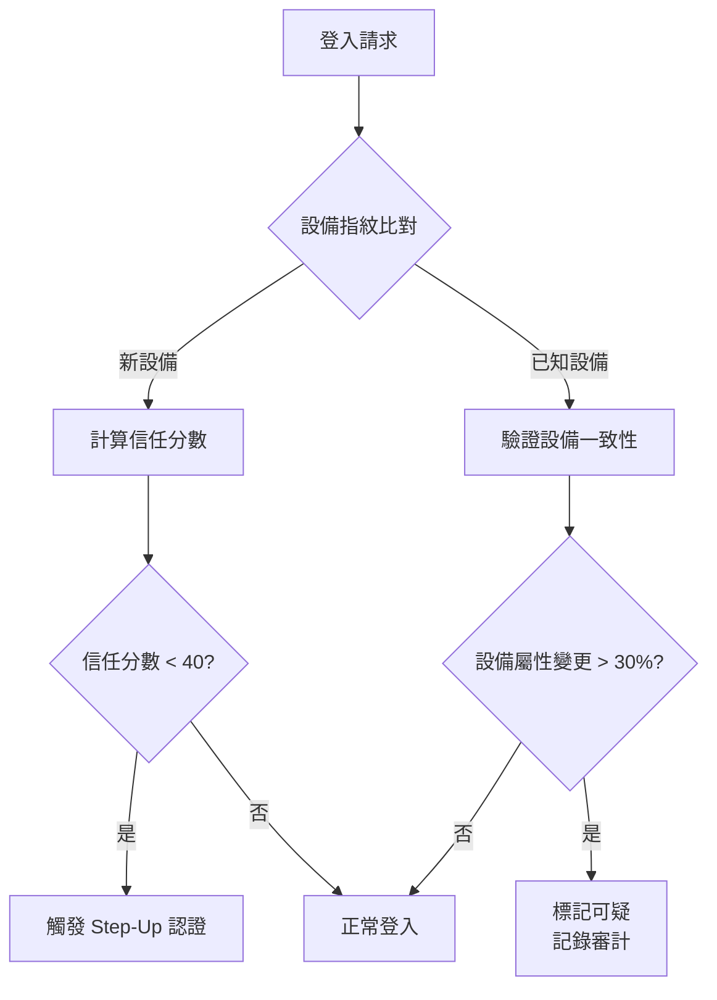
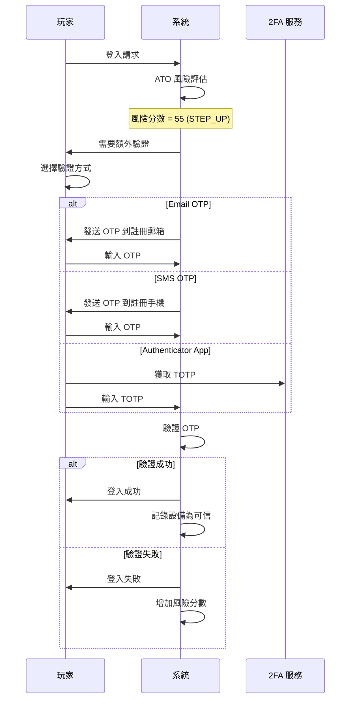

# 05-02-06 Account Takeover Detection (帳戶接管偵測)

**版本**: 1.0.0
**創建日期**: 2026-02-07
**狀態**: ✅ 完整
**維護團隊**: Security + Risk Control Team

**前置依賴**:
- [05-02-05 多帳戶偵測](./05-02-05_Multi_Account_Detection.md) - 設備指紋技術 (§2)
- [05-01 風控框架](./05-01_Risk_Framework.md) - 事件驅動架構 (§1)
- [12-01 身份認證](../12_System_Security/12-01_Authentication.md) - 認證機制

---

## 🎯 執行摘要

帳戶接管 (Account Takeover, ATO) 是 iGaming 行業最常見的詐欺攻擊之一。根據 Akamai 2024 報告，全球每月發生超過 **2600 億次**撞庫攻擊，平均每次成功的 ATO 攻擊造成 **$4.81M** 損失（IBM 2024）。

本文檔定義 SmartAdmin iGaming 平台的 ATO 偵測與防護機制。

### 核心能力

| 能力 | 說明 | 偵測延遲 |
|------|------|---------|
| **設備信任評分** | 基於設備指紋的信任度評估 | 實時 (<50ms) |
| **地理異常偵測** | 不可能的旅行模式識別 | 實時 (<100ms) |
| **行為生物識別** | 鍵盤/滑鼠動態分析 | 準實時 (<1s) |
| **撞庫攻擊防護** | 登入嘗試頻率限制 | 實時 |
| **會話異常偵測** | 會話劫持識別 | 實時 |

---

## 1. ATO 攻擊類型

### 1.1 常見攻擊向量

| 攻擊類型 | 說明 | 嚴重性 |
|---------|------|--------|
| **撞庫攻擊** (Credential Stuffing) | 使用洩露的帳密組合批量嘗試 | 🔴 Critical |
| **暴力破解** (Brute Force) | 對單一帳戶嘗試多種密碼 | 🔴 Critical |
| **會話劫持** (Session Hijacking) | 竊取有效的會話令牌 | 🔴 Critical |
| **社會工程** (Social Engineering) | 欺騙客服重置密碼 | 🟠 High |
| **SIM 卡交換** (SIM Swapping) | 劫持 2FA 短信驗證 | 🟠 High |
| **中間人攻擊** (MITM) | 攔截通信竊取憑證 | 🟠 High |

### 1.2 攻擊後果

| 後果 | 對玩家影響 | 對平台影響 |
|------|-----------|-----------|
| **資金盜取** | 餘額被盜 | 賠付責任、聲譽損失 |
| **獎金濫用** | 獎金被冒領 | 直接財務損失 |
| **身份冒用** | 個人資料洩露 | GDPR 違規、罰款 |
| **洗錢通道** | 帳戶被用於洗錢 | AML 違規、牌照風險 |

---

## 2. 偵測信號

### 2.1 設備信號



**設備信任評分維度**:

| 維度 | 權重 | 說明 |
|------|------|------|
| 設備歷史 | 30% | 該設備是否曾在此帳戶成功登入 |
| 設備年齡 | 15% | 設備首次出現到現在的時間 |
| 使用頻率 | 20% | 該設備登入頻率 |
| 環境一致性 | 20% | IP/時區/語言與歷史一致性 |
| 風險標記 | 15% | 是否有 VPN/Proxy/Tor 標記 |

### 2.2 地理信號

**不可能旅行偵測**:

```java
/**
 * 地理異常偵測服務
 */
@Service
@RequiredArgsConstructor
public class GeoAnomalyDetector {

    private static final double MAX_HUMAN_SPEED_KMH = 1200; // 商業航班最高速度

    /**
     * 檢測不可能的旅行
     */
    public ImpossibleTravelResult detectImpossibleTravel(
            Long playerId, GeoLocation currentLocation) {

        // 獲取上次登入位置
        LoginHistory lastLogin = loginHistoryDao.getLastSuccessfulLogin(playerId);
        if (lastLogin == null) {
            return ImpossibleTravelResult.noHistory();
        }

        // 計算距離和時間
        double distanceKm = calculateDistance(
            lastLogin.getLatitude(), lastLogin.getLongitude(),
            currentLocation.getLatitude(), currentLocation.getLongitude()
        );
        long minutesSinceLastLogin = ChronoUnit.MINUTES.between(
            lastLogin.getLoginTime(), LocalDateTime.now()
        );

        // 計算所需最短時間（假設最快交通工具）
        double hoursRequired = distanceKm / MAX_HUMAN_SPEED_KMH;
        long minutesRequired = (long) (hoursRequired * 60);

        if (minutesSinceLastLogin < minutesRequired) {
            return ImpossibleTravelResult.detected(
                distanceKm,
                minutesSinceLastLogin,
                minutesRequired,
                RiskLevel.HIGH
            );
        }

        return ImpossibleTravelResult.normal();
    }
}
```

### 2.3 行為信號

| 信號 | 正常基線 | 異常閾值 | 偵測方法 |
|------|---------|---------|---------|
| 登入後首動作 | 查看餘額/玩遊戲 | 立即修改資料/提款 | 行為序列分析 |
| 頁面瀏覽模式 | 漸進式瀏覽 | 直接訪問敏感頁面 | 點擊流分析 |
| 操作速度 | 人類速度 | 超人類速度 (bot) | 時間序列分析 |
| 滑鼠軌跡 | 自然曲線 | 直線/無軌跡 | 行為生物識別 |

---

## 3. 偵測規則

### 3.1 規則配置

```sql
-- ATO 偵測規則配置表
CREATE TABLE t_ato_detection_rule (
    id BIGINT PRIMARY KEY AUTO_INCREMENT,
    rule_code VARCHAR(50) NOT NULL UNIQUE,
    rule_name VARCHAR(100) NOT NULL,
    rule_type ENUM('DEVICE', 'GEO', 'BEHAVIOR', 'VELOCITY') NOT NULL,

    -- 規則條件
    condition_expression TEXT NOT NULL COMMENT 'SpEL 表達式',
    threshold_value DECIMAL(10,4),

    -- 響應動作
    action_type ENUM('BLOCK', 'STEP_UP', 'FLAG', 'LOG') NOT NULL,
    risk_score_delta INT DEFAULT 0 COMMENT '風險分增量',

    -- 狀態
    is_enabled BOOLEAN DEFAULT TRUE,
    priority INT DEFAULT 100,

    created_at DATETIME DEFAULT CURRENT_TIMESTAMP,
    updated_at DATETIME ON UPDATE CURRENT_TIMESTAMP,

    INDEX idx_rule_type (rule_type),
    INDEX idx_enabled_priority (is_enabled, priority)
) ENGINE=InnoDB COMMENT='ATO 偵測規則配置';

-- 預置規則
INSERT INTO t_ato_detection_rule (rule_code, rule_name, rule_type, condition_expression, action_type, risk_score_delta) VALUES
('ATO_001', '新設備首次登入', 'DEVICE', 'device.isNew == true', 'STEP_UP', 20),
('ATO_002', '不可能的旅行', 'GEO', 'geo.impossibleTravel == true', 'BLOCK', 50),
('ATO_003', '高風險 IP (VPN/Tor)', 'GEO', 'ip.isHighRisk == true', 'FLAG', 15),
('ATO_004', '登入後立即提款', 'BEHAVIOR', 'behavior.withdrawalWithin5Min == true', 'STEP_UP', 25),
('ATO_005', '連續登入失敗 > 5 次', 'VELOCITY', 'velocity.failedLogins5Min > 5', 'BLOCK', 40),
('ATO_006', '密碼重置後 24h 內提款', 'BEHAVIOR', 'behavior.withdrawalAfterPasswordReset == true', 'STEP_UP', 30);
```

### 3.2 風險評分模型

```java
/**
 * ATO 風險評分計算
 * 分數範圍: 0-100，越高風險越大
 */
public int calculateATORiskScore(LoginContext context) {
    int score = 0;

    // 1. 設備信號 (max 30)
    if (context.isNewDevice()) score += 15;
    if (context.getDeviceTrustScore() < 40) score += 15;

    // 2. 地理信號 (max 30)
    if (context.isImpossibleTravel()) score += 30;
    else if (context.isNewCountry()) score += 15;
    else if (context.isNewCity()) score += 5;

    // 3. 行為信號 (max 25)
    if (context.isUnusualLoginTime()) score += 10;
    if (context.hasHighRiskIP()) score += 15;

    // 4. 歷史信號 (max 15)
    if (context.recentPasswordReset()) score += 10;
    if (context.recentFailedLogins() > 3) score += 5;

    return Math.min(score, 100);
}
```

---

## 4. 響應動作

### 4.1 動作層級

| 風險分數 | 動作 | 說明 |
|---------|------|------|
| 0-30 | LOG | 僅記錄，正常放行 |
| 31-50 | FLAG | 標記審核，正常放行 |
| 51-70 | STEP_UP | 要求額外驗證 (2FA/OTP) |
| 71-85 | BLOCK_SENSITIVE | 阻止敏感操作（提款/修改資料）|
| 86-100 | BLOCK | 阻止登入，觸發調查 |

### 4.2 Step-Up 認證



---

## 5. 數據庫設計

### 5.1 ATO 事件表

```sql
CREATE TABLE t_ato_detection_event (
    id BIGINT PRIMARY KEY AUTO_INCREMENT,
    event_id VARCHAR(50) NOT NULL UNIQUE COMMENT '事件唯一 ID',

    -- 玩家信息
    player_id BIGINT NOT NULL,
    player_username VARCHAR(100),

    -- 登入信息
    login_attempt_id BIGINT COMMENT '登入嘗試 ID',
    session_id VARCHAR(100),

    -- 風險評估
    risk_score INT NOT NULL COMMENT '風險分數 0-100',
    risk_level ENUM('LOW', 'MEDIUM', 'HIGH', 'CRITICAL') NOT NULL,
    triggered_rules JSON COMMENT '觸發的規則列表',

    -- 偵測信號
    device_fingerprint VARCHAR(100),
    device_trust_score INT,
    is_new_device BOOLEAN,
    ip_address VARCHAR(45),
    geo_country VARCHAR(2),
    geo_city VARCHAR(100),
    is_impossible_travel BOOLEAN DEFAULT FALSE,

    -- 響應動作
    action_taken ENUM('LOG', 'FLAG', 'STEP_UP', 'BLOCK_SENSITIVE', 'BLOCK') NOT NULL,
    step_up_method VARCHAR(50) COMMENT 'EMAIL_OTP/SMS_OTP/TOTP',
    step_up_result ENUM('SUCCESS', 'FAILURE', 'TIMEOUT', 'PENDING'),

    -- 調查狀態
    investigation_status ENUM('PENDING', 'IN_PROGRESS', 'CONFIRMED_FRAUD', 'FALSE_POSITIVE', 'CLOSED'),
    investigated_by BIGINT,
    investigation_notes TEXT,

    -- 時間
    detected_at DATETIME NOT NULL DEFAULT CURRENT_TIMESTAMP,
    resolved_at DATETIME,

    -- 索引
    INDEX idx_player_date (player_id, detected_at),
    INDEX idx_risk_level (risk_level, detected_at),
    INDEX idx_investigation (investigation_status)
) ENGINE=InnoDB COMMENT='ATO 偵測事件';
```

### 5.2 可信設備表

```sql
CREATE TABLE t_trusted_device (
    id BIGINT PRIMARY KEY AUTO_INCREMENT,
    player_id BIGINT NOT NULL,
    device_fingerprint VARCHAR(100) NOT NULL,
    device_name VARCHAR(100) COMMENT '用戶自定義設備名稱',

    -- 設備信息
    device_type ENUM('DESKTOP', 'MOBILE', 'TABLET') NOT NULL,
    os_name VARCHAR(50),
    browser_name VARCHAR(50),

    -- 信任狀態
    trust_level ENUM('TRUSTED', 'VERIFIED', 'SUSPICIOUS', 'BLOCKED') DEFAULT 'VERIFIED',
    trust_score INT DEFAULT 50,

    -- 統計
    successful_logins INT DEFAULT 0,
    failed_logins INT DEFAULT 0,
    last_used_at DATETIME,

    -- 生命週期
    first_seen_at DATETIME NOT NULL DEFAULT CURRENT_TIMESTAMP,
    expires_at DATETIME COMMENT '信任過期時間（90天）',
    revoked_at DATETIME,
    revoked_reason VARCHAR(200),

    -- 索引
    UNIQUE KEY uk_player_device (player_id, device_fingerprint),
    INDEX idx_player_trust (player_id, trust_level),
    INDEX idx_expires (expires_at)
) ENGINE=InnoDB COMMENT='可信設備列表';
```

---

## 6. 監控與告警

### 6.1 關鍵指標

| 指標 | 計算公式 | 目標值 | 告警閾值 |
|------|---------|--------|---------|
| ATO 攻擊偵測率 | 偵測 ATO / 確認 ATO | > 95% | < 90% |
| 誤報率 | 誤報 / 總告警 | < 5% | > 10% |
| Step-Up 成功率 | 成功驗證 / 總 Step-Up | > 80% | < 70% |
| 平均偵測延遲 | Avg(偵測時間 - 攻擊時間) | < 1s | > 5s |
| 撞庫攻擊阻擋率 | 阻擋 / 總撞庫嘗試 | > 99% | < 95% |

### 6.2 Prometheus 指標

```yaml
ato_detection_total:
  type: counter
  labels: [risk_level, action_taken, rule_code]
  description: "ATO 偵測事件總數"

ato_step_up_result:
  type: counter
  labels: [method, result]
  description: "Step-Up 驗證結果"

ato_risk_score_distribution:
  type: histogram
  buckets: [10, 20, 30, 40, 50, 60, 70, 80, 90, 100]
  description: "ATO 風險分數分布"

ato_detection_latency_seconds:
  type: histogram
  labels: [rule_type]
  buckets: [0.01, 0.05, 0.1, 0.25, 0.5, 1.0]
  description: "ATO 偵測延遲"
```

---

## 7. 與其他模塊整合

### 7.1 與多帳戶偵測整合

```java
/**
 * 整合 ATO 與多帳戶偵測
 * 當 ATO 事件發生時，檢查是否為多帳戶關聯
 */
@EventListener
public void onATODetected(ATODetectionEvent event) {
    if (event.getRiskLevel() == RiskLevel.HIGH) {
        // 檢查該設備是否關聯其他帳戶
        List<Long> relatedPlayers = multiAccountService
            .findPlayersByDevice(event.getDeviceFingerprint());

        if (relatedPlayers.size() > 1) {
            // 可能是跨帳戶攻擊
            riskProposalService.createProposal(
                RiskProposalType.CROSS_ACCOUNT_ATO,
                event.getPlayerId(),
                relatedPlayers
            );
        }
    }
}
```

### 7.2 與風控提案整合

ATO 事件會自動創建風控提案，進入 [05-02 詐欺偵測](./05-02_Fraud_Detection.md) 的審核流程。

---

## 8. 變更日誌

| 版本 | 日期 | 變更內容 | 變更者 |
|------|------|---------|--------|
| 1.0.0 | 2026-02-07 | 初始版本，實現 ATO 偵測核心能力 | Claude Code |

---

## 9. 相關文檔

- [05-02-05 多帳戶偵測](./05-02-05_Multi_Account_Detection.md) - 設備指紋技術
- [05-01 風控框架](./05-01_Risk_Framework.md) - 事件驅動架構
- [12-01 身份認證](../12_System_Security/12-01_Authentication.md) - 認證機制
- [12-03 會話管理](../12_System_Security/12-03_Session_Management.md) - 會話安全

---

**返回**: [05_Risk_Control](README.md) | [iGaming 首頁](../README.md)
