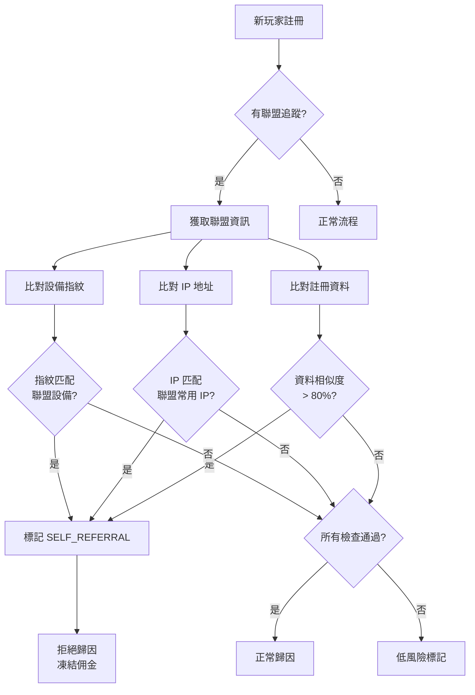
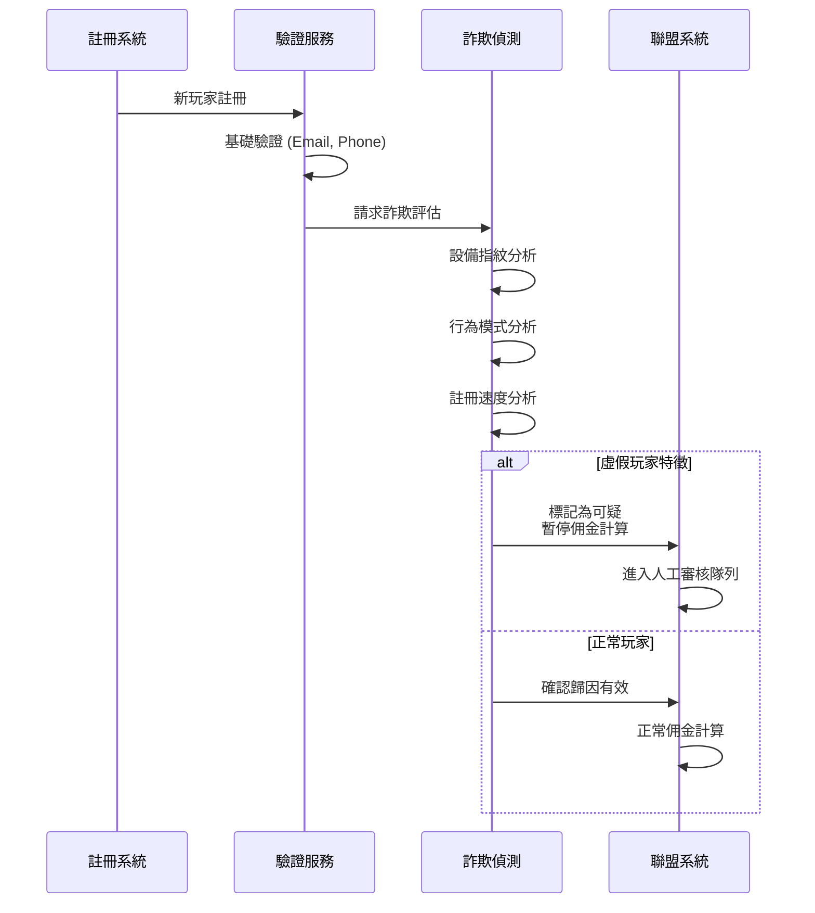
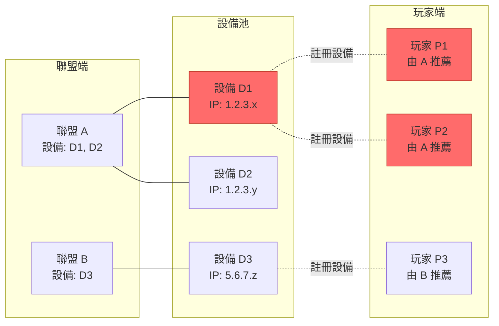
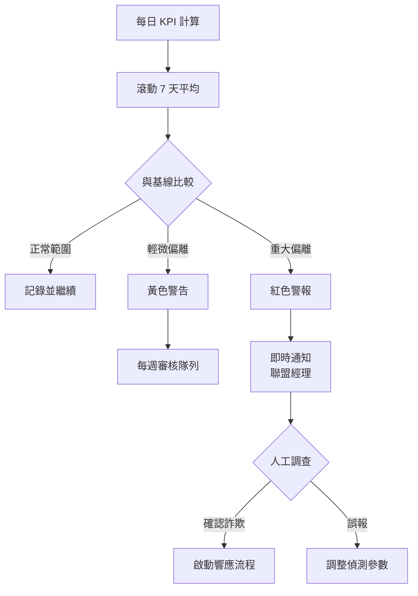
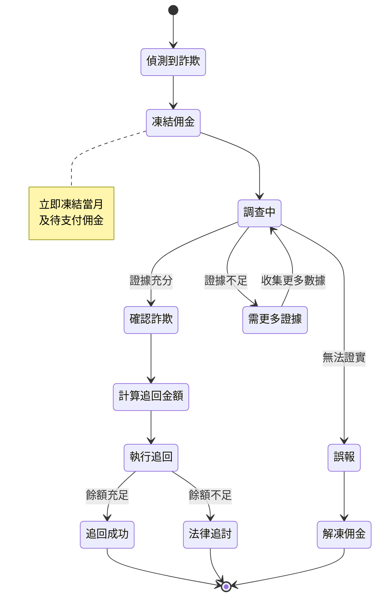
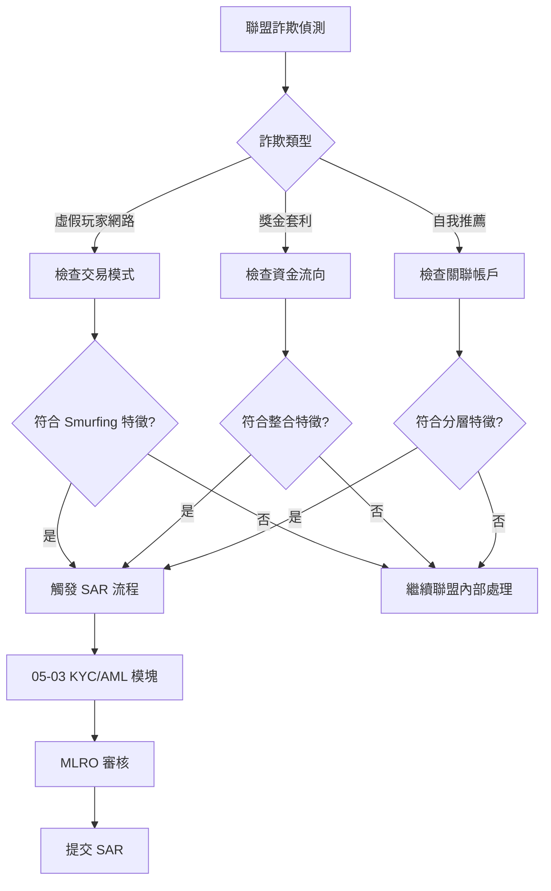

# 05-02-07 Affiliate Fraud Detection (聯盟詐欺偵測)

**版本**: 1.0.0
**創建日期**: 2026-02-07
**狀態**: ✅ 完整
**維護團隊**: Risk Control + Affiliate Management Team

**前置依賴**:
- [05-02-05 多帳戶偵測](./05-02-05_Multi_Account_Detection.md) - 設備指紋技術 (§2)
- [05-02-06 帳戶接管偵測](./05-02-06_Account_Takeover_Detection.md) - 設備信任評分 (§2)
- [05-03 KYC/AML](./05-03_KYC_AML.md) - AML 整合 (§3)

---

## 🎯 執行摘要

聯盟詐欺 (Affiliate Fraud) 是 iGaming 行業的重大財務風險。根據 Income Access 2024 報告，**15-30%** 的聯盟流量涉及某種形式的詐欺，年損失達 **$3.4B**（全球 iGaming）。

本文檔定義 SmartAdmin iGaming 平台的聯盟詐欺偵測與防護機制。

### 核心能力

| 能力 | 說明 | 偵測延遲 |
|------|------|---------|
| **自我推薦偵測** | 聯盟使用自己/親屬帳戶 | 準實時 (<1s) |
| **Cookie Stuffing 偵測** | 強制植入追蹤 Cookie | 批次 (1h) |
| **虛假玩家偵測** | 機器人/刷量帳戶 | 準實時 (<1s) |
| **獎金套利偵測** | 透過聯盟網路的獎金濫用 | 批次 (24h) |
| **異常表現分析** | 聯盟 KPI 異常模式 | 批次 (24h) |

---

## 1. 聯盟詐欺類型

### 1.1 常見詐欺模式

| 詐欺類型 | 說明 | 嚴重性 | 財務影響 |
|---------|------|--------|---------|
| **自我推薦** (Self-Referral) | 聯盟用自己帳戶或親屬帳戶獲取佣金 | 🔴 Critical | 高 |
| **Cookie Stuffing** | 在無意瀏覽中強制植入追蹤 Cookie | 🔴 Critical | 高 |
| **虛假玩家** (Fake Players) | 使用機器人或刷量服務創建假帳戶 | 🔴 Critical | 高 |
| **獎金套利** (Bonus Abuse) | 透過聯盟網路有組織地套取獎金 | 🟠 High | 中-高 |
| **流量劫持** (Traffic Hijacking) | 竊取其他聯盟的合法流量 | 🟠 High | 中 |
| **Click Fraud** | 使用機器人或點擊農場刷點擊量 | 🟡 Medium | 低-中 |

### 1.2 詐欺後果

| 後果 | 對平台影響 | 對合法聯盟影響 |
|------|-----------|---------------|
| **直接財務損失** | 支付不當佣金 | 佣金池稀釋 |
| **獎金損失** | 被套取的獎金 | 獎金政策收緊 |
| **數據污染** | 行銷數據失真 | 績效評估不公 |
| **監管風險** | AML 違規（洗錢通道）| 聯盟計劃終止 |

---

## 2. 偵測類別

### 2.1 自我推薦偵測 (Self-Referral Detection)



**偵測維度**:

| 維度 | 檢查方法 | 權重 |
|------|---------|------|
| 設備指紋 | 玩家設備 vs 聯盟登入設備 | 35% |
| IP 地址 | 玩家 IP vs 聯盟常用 IP (子網比對) | 25% |
| 註冊資料 | 姓名/地址/銀行卡相似度 (Levenshtein) | 20% |
| 行為模式 | 註冊時間/瀏覽路徑一致性 | 10% |
| 社交關聯 | 是否為聯盟的社交好友 | 10% |

```java
/**
 * 自我推薦偵測服務
 */
@Service
@RequiredArgsConstructor
public class SelfReferralDetector {

    private static final double SIMILARITY_THRESHOLD = 0.8;

    /**
     * 檢測自我推薦
     */
    public SelfReferralResult detect(Long playerId, Long affiliateId) {
        Player player = playerDao.selectById(playerId);
        Affiliate affiliate = affiliateDao.selectById(affiliateId);

        double score = 0.0;
        List<String> signals = new ArrayList<>();

        // 1. 設備指紋比對 (35%)
        if (deviceService.isSameDevice(
                player.getRegistrationDeviceId(),
                affiliate.getLastLoginDeviceId())) {
            score += 0.35;
            signals.add("DEVICE_MATCH");
        }

        // 2. IP 地址比對 (25%)
        if (ipService.isSameSubnet(
                player.getRegistrationIp(),
                affiliate.getCommonIps())) {
            score += 0.25;
            signals.add("IP_SUBNET_MATCH");
        }

        // 3. 註冊資料相似度 (20%)
        double nameSimilarity = stringSimilarity(
            player.getRealName(), affiliate.getRealName());
        if (nameSimilarity > SIMILARITY_THRESHOLD) {
            score += 0.20;
            signals.add("NAME_SIMILAR:" + nameSimilarity);
        }

        // 4. 行為模式 (10%)
        if (behaviorService.isSimilarPattern(player, affiliate)) {
            score += 0.10;
            signals.add("BEHAVIOR_SIMILAR");
        }

        // 5. 社交關聯 (10%)
        if (socialService.isConnected(player, affiliate)) {
            score += 0.10;
            signals.add("SOCIAL_CONNECTED");
        }

        return SelfReferralResult.builder()
            .score(score)
            .isSelfReferral(score >= 0.6)
            .signals(signals)
            .build();
    }
}
```

### 2.2 Cookie Stuffing 偵測

Cookie Stuffing 是一種強制植入追蹤 Cookie 的詐欺手法，玩家在不知情的情況下被歸因到詐欺聯盟。

**偵測信號**:

| 信號 | 說明 | 異常閾值 |
|------|------|---------|
| 無點擊歸因 | 有 Cookie 但無點擊記錄 | 比率 > 20% |
| 批量 Cookie 時間戳 | 多個 Cookie 時間相近 | 差異 < 1s |
| 不可能的用戶路徑 | 從未訪問聯盟頁面 | 路徑缺失 |
| 異常 Referer | Referer 與聯盟網站不符 | 不匹配 |

```sql
-- Cookie Stuffing 偵測查詢
SELECT
    a.affiliate_id,
    a.affiliate_name,
    COUNT(DISTINCT r.player_id) AS total_referrals,
    SUM(CASE WHEN r.click_id IS NULL THEN 1 ELSE 0 END) AS no_click_referrals,
    SUM(CASE WHEN r.click_id IS NULL THEN 1 ELSE 0 END) * 100.0 /
        COUNT(DISTINCT r.player_id) AS no_click_rate
FROM t_affiliate a
JOIN t_affiliate_referral r ON a.affiliate_id = r.affiliate_id
WHERE r.created_at >= DATE_SUB(NOW(), INTERVAL 30 DAY)
GROUP BY a.affiliate_id, a.affiliate_name
HAVING no_click_rate > 20  -- 異常閾值
ORDER BY no_click_rate DESC;
```

### 2.3 虛假玩家偵測 (Fake Player Detection)



**虛假玩家特徵**:

| 特徵類別 | 具體指標 | 風險信號 |
|---------|---------|---------|
| **註冊行為** | 表單填寫時間 | < 10 秒 |
| | 滑鼠軌跡 | 無軌跡或直線 |
| | 錯誤修正次數 | 0 次 (完美輸入) |
| **帳戶活動** | 首次存款時間 | < 5 分鐘 |
| | 單次存款金額 | 恰好等於最低存款額 |
| | 遊戲選擇 | 僅玩高 RTP 遊戲 |
| **設備環境** | User-Agent | 已知自動化工具 |
| | Canvas 指紋 | 相同指紋 > 5 帳戶 |
| | 時區 vs IP | 不一致 |

### 2.4 獎金套利偵測 (Bonus Arbitrage Detection)

透過聯盟網路有組織地套取獎金是一種複雜的詐欺模式。

```java
/**
 * 獎金套利偵測
 * 分析透過特定聯盟註冊的玩家群體獎金使用模式
 */
@Service
@RequiredArgsConstructor
public class BonusArbitrageDetector {

    /**
     * 分析聯盟的獎金套利風險
     */
    public ArbitrageRiskResult analyzeAffiliate(Long affiliateId, int days) {
        List<Player> referredPlayers = affiliateService
            .getRecentReferrals(affiliateId, days);

        // 計算關鍵指標
        double avgBonusUtilization = calculateBonusUtilization(referredPlayers);
        double avgBonusToDepositRatio = calculateBonusToDepositRatio(referredPlayers);
        double avgWagerAfterBonus = calculateWagerAfterBonus(referredPlayers);
        double playerRetentionRate = calculateRetentionRate(referredPlayers);

        // 評估套利風險
        int riskScore = 0;

        // 1. 獎金使用率過高
        if (avgBonusUtilization > 0.95) riskScore += 25;

        // 2. 獎金/存款比過高
        if (avgBonusToDepositRatio > 0.5) riskScore += 25;

        // 3. 獎金後投注量低
        if (avgWagerAfterBonus < 1.5) riskScore += 25;

        // 4. 留存率極低
        if (playerRetentionRate < 0.1) riskScore += 25;

        return ArbitrageRiskResult.builder()
            .affiliateId(affiliateId)
            .riskScore(riskScore)
            .riskLevel(getRiskLevel(riskScore))
            .metrics(Map.of(
                "bonusUtilization", avgBonusUtilization,
                "bonusToDepositRatio", avgBonusToDepositRatio,
                "wagerAfterBonus", avgWagerAfterBonus,
                "retentionRate", playerRetentionRate
            ))
            .build();
    }
}
```

---

## 3. 設備/IP 關聯分析

### 3.1 聯盟-玩家關聯圖



### 3.2 關聯偵測規則

```sql
-- 聯盟與被推薦玩家的設備重疊分析
CREATE VIEW v_affiliate_device_overlap AS
SELECT
    ar.affiliate_id,
    a.affiliate_name,
    p.player_id,
    p.username,
    pd.device_fingerprint,
    CASE
        WHEN ad.device_fingerprint IS NOT NULL THEN 'EXACT_MATCH'
        WHEN SUBSTRING_INDEX(p.registration_ip, '.', 3) =
             SUBSTRING_INDEX(ad.common_ip, '.', 3) THEN 'SUBNET_MATCH'
        ELSE 'NO_MATCH'
    END AS overlap_type
FROM t_affiliate_referral ar
JOIN t_affiliate a ON ar.affiliate_id = a.affiliate_id
JOIN t_player p ON ar.player_id = p.player_id
JOIN t_player_device pd ON p.player_id = pd.player_id
LEFT JOIN t_affiliate_device ad ON
    ar.affiliate_id = ad.affiliate_id AND
    pd.device_fingerprint = ad.device_fingerprint
WHERE ar.created_at >= DATE_SUB(NOW(), INTERVAL 90 DAY);

-- 高風險聯盟識別（設備重疊率 > 10%）
SELECT
    affiliate_id,
    affiliate_name,
    COUNT(DISTINCT player_id) AS total_referrals,
    SUM(CASE WHEN overlap_type = 'EXACT_MATCH' THEN 1 ELSE 0 END) AS device_matches,
    SUM(CASE WHEN overlap_type = 'SUBNET_MATCH' THEN 1 ELSE 0 END) AS subnet_matches,
    (SUM(CASE WHEN overlap_type != 'NO_MATCH' THEN 1 ELSE 0 END) * 100.0 /
     COUNT(DISTINCT player_id)) AS overlap_rate
FROM v_affiliate_device_overlap
GROUP BY affiliate_id, affiliate_name
HAVING overlap_rate > 10
ORDER BY overlap_rate DESC;
```

---

## 4. 聯盟表現異常偵測

### 4.1 KPI 異常分析

| KPI | 正常範圍 | 異常信號 | 可能原因 |
|-----|---------|---------|---------|
| **FTD 轉換率** | 5-15% | > 30% | 虛假玩家、自我推薦 |
| **平均首存金額** | $50-200 | 恰好 = 最低存款 | 刷量、獎金套利 |
| **玩家 LTV** | $500-2000 | < $50 | 虛假玩家、即時套利 |
| **30 天留存率** | 20-40% | < 5% | 虛假玩家、套利 |
| **獎金使用率** | 60-80% | > 95% | 獎金套利 |
| **提款/存款比** | 0.7-1.2 | > 2.0 | 獎金套利成功 |

### 4.2 異常偵測演算法

```java
/**
 * 聯盟表現異常偵測
 * 使用 Z-Score 識別統計異常
 */
@Service
@RequiredArgsConstructor
public class AffiliateAnomalyDetector {

    private static final double Z_SCORE_THRESHOLD = 2.5;

    /**
     * 偵測聯盟 KPI 異常
     */
    public List<AnomalyResult> detectAnomalies(Long affiliateId) {
        AffiliateKPI kpi = kpiService.calculateKPI(affiliateId);
        AffiliateKPI industryAvg = kpiService.getIndustryAverage();
        AffiliateKPI industryStdDev = kpiService.getIndustryStdDev();

        List<AnomalyResult> anomalies = new ArrayList<>();

        // FTD 轉換率
        double ftdZScore = calculateZScore(
            kpi.getFtdConversionRate(),
            industryAvg.getFtdConversionRate(),
            industryStdDev.getFtdConversionRate()
        );
        if (Math.abs(ftdZScore) > Z_SCORE_THRESHOLD) {
            anomalies.add(AnomalyResult.of(
                "FTD_CONVERSION_RATE",
                ftdZScore,
                ftdZScore > 0 ? "異常高轉換率" : "異常低轉換率"
            ));
        }

        // 玩家 LTV
        double ltvZScore = calculateZScore(
            kpi.getAveragePlayerLTV(),
            industryAvg.getAveragePlayerLTV(),
            industryStdDev.getAveragePlayerLTV()
        );
        if (ltvZScore < -Z_SCORE_THRESHOLD) {
            anomalies.add(AnomalyResult.of(
                "PLAYER_LTV",
                ltvZScore,
                "異常低 LTV - 可能虛假玩家"
            ));
        }

        // 留存率
        double retentionZScore = calculateZScore(
            kpi.getRetention30Day(),
            industryAvg.getRetention30Day(),
            industryStdDev.getRetention30Day()
        );
        if (retentionZScore < -Z_SCORE_THRESHOLD) {
            anomalies.add(AnomalyResult.of(
                "RETENTION_30D",
                retentionZScore,
                "異常低留存率 - 可能虛假玩家或套利"
            ));
        }

        return anomalies;
    }

    private double calculateZScore(double value, double mean, double stdDev) {
        if (stdDev == 0) return 0;
        return (value - mean) / stdDev;
    }
}
```

### 4.3 趨勢監控



---

## 5. 數據庫設計

### 5.1 聯盟詐欺事件表

```sql
CREATE TABLE t_affiliate_fraud_event (
    id BIGINT PRIMARY KEY AUTO_INCREMENT,
    event_id VARCHAR(50) NOT NULL UNIQUE COMMENT '事件唯一 ID',

    -- 聯盟信息
    affiliate_id BIGINT NOT NULL,
    affiliate_code VARCHAR(50),

    -- 詐欺類型
    fraud_type ENUM(
        'SELF_REFERRAL',
        'COOKIE_STUFFING',
        'FAKE_PLAYER',
        'BONUS_ARBITRAGE',
        'TRAFFIC_HIJACKING',
        'CLICK_FRAUD'
    ) NOT NULL,

    -- 涉及玩家
    affected_player_ids JSON COMMENT '涉及的玩家 ID 列表',
    affected_player_count INT DEFAULT 0,

    -- 風險評估
    risk_score INT NOT NULL COMMENT '風險分數 0-100',
    confidence_level DECIMAL(5,2) COMMENT '偵測信心度 0-100%',
    detection_signals JSON COMMENT '偵測信號詳情',

    -- 財務影響
    estimated_loss DECIMAL(18,2) COMMENT '預估損失金額',
    commission_at_risk DECIMAL(18,2) COMMENT '風險佣金金額',

    -- 處理狀態
    status ENUM(
        'DETECTED',
        'INVESTIGATING',
        'CONFIRMED',
        'FALSE_POSITIVE',
        'RESOLVED'
    ) DEFAULT 'DETECTED',

    -- 處理動作
    action_taken ENUM(
        'NONE',
        'WARNING',
        'COMMISSION_HOLD',
        'COMMISSION_CLAWBACK',
        'AFFILIATE_SUSPENDED',
        'AFFILIATE_TERMINATED'
    ),
    action_date DATETIME,
    action_by BIGINT,
    action_notes TEXT,

    -- 時間
    detected_at DATETIME NOT NULL DEFAULT CURRENT_TIMESTAMP,
    resolved_at DATETIME,

    -- 索引
    INDEX idx_affiliate (affiliate_id, detected_at),
    INDEX idx_fraud_type (fraud_type, status),
    INDEX idx_status (status, detected_at)
) ENGINE=InnoDB COMMENT='聯盟詐欺事件';
```

### 5.2 聯盟設備關聯表

```sql
CREATE TABLE t_affiliate_device (
    id BIGINT PRIMARY KEY AUTO_INCREMENT,
    affiliate_id BIGINT NOT NULL,

    -- 設備信息
    device_fingerprint VARCHAR(100) NOT NULL,
    device_type ENUM('DESKTOP', 'MOBILE', 'TABLET'),
    os_name VARCHAR(50),
    browser_name VARCHAR(50),

    -- IP 信息
    common_ip VARCHAR(45),
    ip_subnet VARCHAR(45) COMMENT 'IP 子網 (前三段)',

    -- 統計
    login_count INT DEFAULT 0,
    last_login_at DATETIME,
    first_seen_at DATETIME DEFAULT CURRENT_TIMESTAMP,

    -- 索引
    UNIQUE KEY uk_affiliate_device (affiliate_id, device_fingerprint),
    INDEX idx_device (device_fingerprint),
    INDEX idx_subnet (ip_subnet)
) ENGINE=InnoDB COMMENT='聯盟設備記錄';
```

### 5.3 聯盟 KPI 快照表

```sql
CREATE TABLE t_affiliate_kpi_snapshot (
    id BIGINT PRIMARY KEY AUTO_INCREMENT,
    affiliate_id BIGINT NOT NULL,
    snapshot_date DATE NOT NULL,

    -- 流量指標
    clicks INT DEFAULT 0,
    registrations INT DEFAULT 0,
    ftd_count INT DEFAULT 0 COMMENT '首次存款玩家數',

    -- 轉換率
    click_to_reg_rate DECIMAL(8,4),
    reg_to_ftd_rate DECIMAL(8,4),

    -- 財務指標
    total_deposits DECIMAL(18,2) DEFAULT 0,
    total_withdrawals DECIMAL(18,2) DEFAULT 0,
    gross_gaming_revenue DECIMAL(18,2) DEFAULT 0,
    net_gaming_revenue DECIMAL(18,2) DEFAULT 0,

    -- 玩家質量
    avg_first_deposit DECIMAL(18,2),
    avg_player_ltv DECIMAL(18,2),
    avg_bonus_utilization DECIMAL(8,4),

    -- 留存率
    retention_7d DECIMAL(8,4),
    retention_30d DECIMAL(8,4),
    retention_90d DECIMAL(8,4),

    -- 佣金
    earned_commission DECIMAL(18,2) DEFAULT 0,
    pending_commission DECIMAL(18,2) DEFAULT 0,
    clawback_commission DECIMAL(18,2) DEFAULT 0,

    -- 風險指標
    fraud_score INT DEFAULT 0,
    anomaly_count INT DEFAULT 0,

    -- 索引
    UNIQUE KEY uk_affiliate_date (affiliate_id, snapshot_date),
    INDEX idx_date (snapshot_date)
) ENGINE=InnoDB COMMENT='聯盟 KPI 日快照';
```

### 5.4 玩家-聯盟關聯審計表

```sql
CREATE TABLE t_affiliate_referral_audit (
    id BIGINT PRIMARY KEY AUTO_INCREMENT,
    referral_id BIGINT NOT NULL COMMENT '關聯 t_affiliate_referral',

    -- 審計事件
    audit_type ENUM(
        'CREATED',
        'VALIDATED',
        'FLAGGED',
        'REJECTED',
        'COMMISSION_HELD',
        'COMMISSION_PAID',
        'COMMISSION_CLAWED'
    ) NOT NULL,

    -- 審計詳情
    previous_status VARCHAR(50),
    new_status VARCHAR(50),
    reason TEXT,
    fraud_event_id BIGINT COMMENT '關聯詐欺事件',

    -- 操作者
    performed_by BIGINT COMMENT 'NULL = 系統自動',
    performed_at DATETIME DEFAULT CURRENT_TIMESTAMP,

    -- 索引
    INDEX idx_referral (referral_id),
    INDEX idx_date (performed_at)
) ENGINE=InnoDB COMMENT='聯盟推薦審計軌跡';
```

---

## 6. 響應工作流

### 6.1 響應層級

| 風險分數 | 響應動作 | 佣金處理 | 通知對象 |
|---------|---------|---------|---------|
| 0-30 | 記錄 | 正常支付 | - |
| 31-50 | 標記審核 | 暫緩支付 | 聯盟經理 |
| 51-70 | 暫停佣金 | 凍結當月佣金 | 聯盟經理 + 風控 |
| 71-85 | 追回佣金 | 追回涉事佣金 | 風控主管 |
| 86-100 | 終止合作 | 追回全部佣金 | 法務 + 風控主管 |

### 6.2 佣金追回流程



### 6.3 聯盟終止流程

```java
/**
 * 聯盟終止服務
 */
@Service
@RequiredArgsConstructor
public class AffiliateTerminationService {

    /**
     * 終止聯盟合作
     */
    @Transactional(rollbackFor = Throwable.class)
    public TerminationResult terminateAffiliate(
            Long affiliateId,
            TerminationReason reason,
            Long operatorId) {

        // 1. 驗證終止條件
        Affiliate affiliate = affiliateDao.selectById(affiliateId);
        validateTerminationEligibility(affiliate, reason);

        // 2. 停用聯盟帳戶
        affiliate.setStatus(AffiliateStatus.TERMINATED);
        affiliate.setTerminatedAt(LocalDateTime.now());
        affiliate.setTerminatedBy(operatorId);
        affiliate.setTerminationReason(reason.name());
        affiliateDao.updateById(affiliate);

        // 3. 停用所有追蹤連結
        affiliateLinkDao.deactivateAllLinks(affiliateId);

        // 4. 凍結所有待支付佣金
        BigDecimal frozenAmount = commissionService.freezeAllPending(affiliateId);

        // 5. 計算並執行追回
        BigDecimal clawbackAmount = BigDecimal.ZERO;
        if (reason.isClawbackRequired()) {
            clawbackAmount = commissionService.calculateClawback(
                affiliateId,
                reason.getClawbackPeriodDays()
            );
            commissionService.executeClawback(affiliateId, clawbackAmount);
        }

        // 6. 通知相關方
        notificationService.notifyAffiliateTermination(affiliate, reason);

        // 7. 創建審計記錄
        auditService.logTermination(affiliateId, reason, operatorId);

        return TerminationResult.builder()
            .affiliateId(affiliateId)
            .frozenAmount(frozenAmount)
            .clawbackAmount(clawbackAmount)
            .terminatedAt(affiliate.getTerminatedAt())
            .build();
    }
}
```

---

## 7. 與 AML 整合

### 7.1 聯盟詐欺的 AML 關聯

聯盟詐欺可能與洗錢活動相關，需要與 AML 模塊整合。

| 詐欺模式 | AML 風險 | 報告要求 |
|---------|---------|---------|
| **虛假玩家網路** | 結構化交易 (Smurfing) | SAR 報告 |
| **獎金套利集團** | 資金整合 | SAR 報告 |
| **自我推薦洗錢** | 分層交易 | SAR 報告 |
| **聯盟佣金洗錢** | 合法來源掩護 | EDD 強化 |

### 7.2 整合流程



### 7.3 AML 觸發條件

```java
/**
 * 聯盟詐欺 AML 觸發服務
 */
@Service
@RequiredArgsConstructor
public class AffiliateFraudAMLTrigger {

    /**
     * 評估是否需要觸發 AML 流程
     */
    public AMLTriggerResult evaluateAMLTrigger(AffiliateFraudEvent event) {
        List<String> triggers = new ArrayList<>();

        // 1. 虛假玩家網路 - 檢查 Smurfing 特徵
        if (event.getFraudType() == FraudType.FAKE_PLAYER) {
            List<Player> fakePlayers = getAffectedPlayers(event);

            // 檢查是否存在結構化交易
            boolean hasStructuredDeposits = fakePlayers.stream()
                .anyMatch(p -> amlService.hasStructuredDeposits(p.getId()));

            if (hasStructuredDeposits) {
                triggers.add("STRUCTURED_DEPOSITS_VIA_FAKE_NETWORK");
            }

            // 檢查資金是否流向單一目的地
            boolean hasFundConsolidation = amlService
                .detectFundConsolidation(fakePlayers);

            if (hasFundConsolidation) {
                triggers.add("FUND_CONSOLIDATION_PATTERN");
            }
        }

        // 2. 獎金套利 - 檢查資金整合
        if (event.getFraudType() == FraudType.BONUS_ARBITRAGE) {
            boolean hasRapidWithdrawals = event.getAffectedPlayerIds().stream()
                .anyMatch(id -> amlService.hasRapidWithdrawalPattern(id));

            if (hasRapidWithdrawals) {
                triggers.add("RAPID_WITHDRAWAL_AFTER_BONUS");
            }
        }

        // 3. 自我推薦 - 檢查分層交易
        if (event.getFraudType() == FraudType.SELF_REFERRAL) {
            Long affiliatePlayerId = getAffiliateAsPlayer(event.getAffiliateId());
            if (affiliatePlayerId != null) {
                boolean hasLayeringPattern = amlService
                    .detectLayeringPattern(affiliatePlayerId,
                        event.getAffectedPlayerIds());

                if (hasLayeringPattern) {
                    triggers.add("LAYERING_VIA_SELF_REFERRAL");
                }
            }
        }

        // 判斷是否需要 SAR
        boolean requiresSAR = !triggers.isEmpty();

        return AMLTriggerResult.builder()
            .requiresSAR(requiresSAR)
            .triggers(triggers)
            .recommendedAction(requiresSAR ?
                "CREATE_SAR_REFERRAL" : "INTERNAL_HANDLING")
            .build();
    }
}
```

---

## 8. 監控與告警

### 8.1 關鍵指標

| 指標 | 計算公式 | 目標值 | 告警閾值 |
|------|---------|--------|---------|
| 詐欺偵測率 | 偵測詐欺 / 確認詐欺 | > 90% | < 80% |
| 誤報率 | 誤報 / 總告警 | < 10% | > 15% |
| 平均偵測時間 | Avg(偵測時間 - 詐欺開始) | < 48h | > 7d |
| 追回成功率 | 成功追回 / 總追回嘗試 | > 80% | < 60% |
| 聯盟終止後損失 | 終止後 30 天內損失 | 0 | > 0 |

### 8.2 Prometheus 指標

```yaml
affiliate_fraud_detection_total:
  type: counter
  labels: [fraud_type, status, action_taken]
  description: "聯盟詐欺偵測事件總數"

affiliate_fraud_financial_impact:
  type: gauge
  labels: [fraud_type, impact_type]
  description: "聯盟詐欺財務影響金額"

affiliate_kpi_anomaly_score:
  type: gauge
  labels: [affiliate_id, kpi_type]
  description: "聯盟 KPI 異常分數"

affiliate_commission_clawback:
  type: counter
  labels: [reason, result]
  description: "聯盟佣金追回統計"
```

---

## 9. 變更日誌

| 版本 | 日期 | 變更內容 | 變更者 |
|------|------|---------|--------|
| 1.0.0 | 2026-02-07 | 初始版本，實現聯盟詐欺偵測核心能力 | Claude Code |

---

## 10. 相關文檔

- [05-02-05 多帳戶偵測](./05-02-05_Multi_Account_Detection.md) - 設備指紋技術
- [05-02-06 帳戶接管偵測](./05-02-06_Account_Takeover_Detection.md) - 設備信任評分
- [05-03 KYC/AML](./05-03_KYC_AML.md) - AML 整合
- [05-02 詐欺偵測](./05-02_Fraud_Detection.md) - 整體詐欺偵測框架

---

**返回**: [05_Risk_Control](README.md) | [iGaming 首頁](../README.md)
