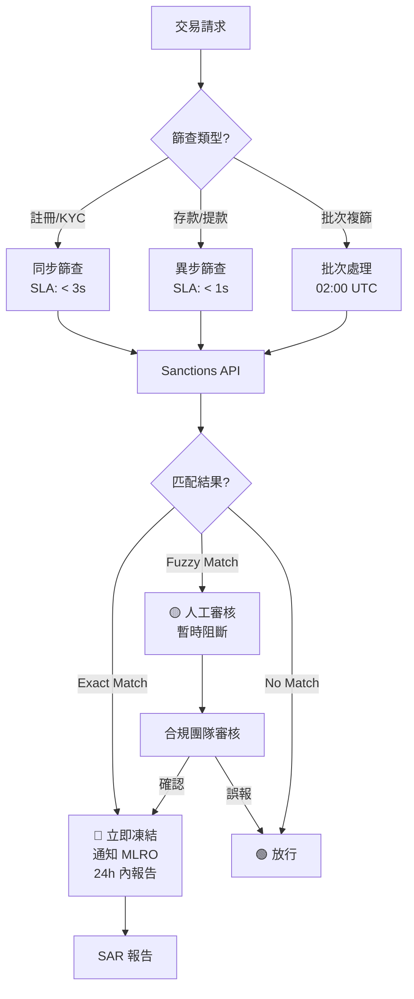

# 05-02-08 Sanctions Screening (制裁名單篩查)

**版本**: 1.0.0
**創建日期**: 2026-02-07
**狀態**: 🔴 待實現 (P0 Critical)

---

## 概述

制裁名單篩查是 AML 合規的核心組件，用於防止受制裁個人或實體使用博彩平台進行金融活動。根據 OFAC、EU、UN 等國際制裁規範，所有金融交易前必須進行實時篩查。

### 監管要求

| 監管機構 | 名單類型 | 更新頻率 | 強制性 |
|---------|---------|---------|--------|
| **OFAC** | SDN List (美國) | 每日 | 所有美元交易 |
| **EU** | EU Consolidated Sanctions | 每週 | EU 運營商 |
| **UN** | UN Security Council Sanctions | 即時 | 所有成員國 |
| **UK** | UK Sanctions List | 每日 | UKGC 牌照 |
| **FATF** | High-Risk Jurisdictions | 每季 | 全球 |

---

## 當前狀態

> 🔴 **關鍵缺口**: 根據 2026-02-07 風控審計，SmartAdmin 目前 **尚未實現** 制裁名單實時篩查功能。這是 P0 級別的合規風險。

### 風險評估

| 風險類型 | 影響 | 可能性 | 風險等級 |
|---------|------|--------|---------|
| 監管處罰 | 🔴 極高 (牌照吊銷) | 中 | 🔴 Critical |
| 法律責任 | 🔴 極高 (刑事責任) | 低 | 🟠 High |
| 聲譽損失 | 🔴 極高 | 中 | 🔴 Critical |
| 金融損失 | 🟠 高 | 中 | 🟠 High |

---

## 實現規範

### 篩查觸發點

制裁名單篩查必須在以下場景執行：

| 場景 | 觸發時機 | 阻斷類型 |
|------|---------|---------|
| **玩家註冊** | 註冊表單提交後 | 阻止帳戶創建 |
| **KYC 驗證** | 證件信息提取後 | 阻止驗證通過 |
| **存款交易** | 支付確認前 | 阻止存款 |
| **提款交易** | 提款請求處理前 | 阻止提款 |
| **定期複篩** | 每日批次 (02:00 UTC) | 凍結帳戶 |

### 篩查維度

```yaml
Sanctions Screening Dimensions:
  Individual:
    - Full Name (first, middle, last)
    - Date of Birth
    - Nationality
    - Passport/ID Number
    - Known Aliases

  Entity:
    - Company Name
    - Registration Number
    - Registered Address
    - Directors/UBOs

  Geographic:
    - Country of Residence
    - IP Geolocation
    - Payment Method Country (BIN)
```

### 匹配算法

| 匹配類型 | 信心度 | 動作 |
|---------|--------|------|
| **Exact Match** | 100% | 🔴 立即凍結 + 報告 |
| **Fuzzy Match (>95%)** | 95-99% | 🔴 凍結 + 人工確認 |
| **Possible Match (80-95%)** | 80-94% | 🟡 人工審核佇列 |
| **Low Match (<80%)** | <80% | 🟢 記錄 + 監控 |

### 第三方服務商

| 服務商 | 覆蓋範圍 | 更新頻率 | 成本 |
|--------|---------|---------|------|
| **Dow Jones Risk & Compliance** | 全球 | 即時 | $$$$ |
| **Refinitiv World-Check** | 全球 | 即時 | $$$$ |
| **ComplyAdvantage** | 全球 | 即時 | $$$ |
| **Sanctions.io** | 全球 | 每日 | $$ |

**推薦方案**: Dow Jones 或 Refinitiv (適用於 UKGC/MGA 牌照)

---

## 技術實現 (待開發)

### 服務架構



### 數據庫設計

```sql
-- 制裁篩查記錄表
CREATE TABLE t_sanctions_screening (
    id                  BIGINT PRIMARY KEY AUTO_INCREMENT,
    player_id           BIGINT NOT NULL,
    screening_type      VARCHAR(30) NOT NULL,  -- REGISTRATION, KYC, DEPOSIT, WITHDRAWAL, BATCH

    -- 篩查結果
    match_status        VARCHAR(30) NOT NULL,  -- CLEAR, POSSIBLE_MATCH, MATCH
    match_score         DECIMAL(5,4),
    matched_list        VARCHAR(100),          -- OFAC_SDN, EU_CONSOLIDATED, UN_SANCTIONS
    matched_entity      VARCHAR(500),
    match_details       JSON,

    -- 處理狀態
    action_taken        VARCHAR(30),           -- CLEARED, BLOCKED, FROZEN, REPORTED
    reviewed_by         BIGINT,
    reviewed_at         DATETIME,
    review_notes        TEXT,

    -- 報告狀態
    reported_to         VARCHAR(100),          -- NCA, FIAU, OFAC
    report_reference    VARCHAR(100),
    reported_at         DATETIME,

    -- 審計
    provider            VARCHAR(50) NOT NULL,  -- DOW_JONES, REFINITIV, etc.
    provider_reference  VARCHAR(100),
    screened_at         DATETIME DEFAULT CURRENT_TIMESTAMP,

    INDEX idx_player (player_id, screened_at DESC),
    INDEX idx_match (match_status, action_taken),
    INDEX idx_screening_type (screening_type, screened_at)
) ENGINE=InnoDB COMMENT='制裁名單篩查記錄';

-- 制裁名單緩存表 (本地快取)
CREATE TABLE t_sanctions_list_cache (
    id                  BIGINT PRIMARY KEY AUTO_INCREMENT,
    list_type           VARCHAR(50) NOT NULL,  -- OFAC_SDN, EU_CONSOLIDATED, UN, UK_SANCTIONS
    entity_type         VARCHAR(20) NOT NULL,  -- INDIVIDUAL, ENTITY

    -- 實體信息
    full_name           VARCHAR(500) NOT NULL,
    aliases             JSON,                  -- ["alias1", "alias2"]
    date_of_birth       DATE,
    nationality         VARCHAR(2),
    id_numbers          JSON,                  -- [{"type":"PASSPORT","number":"XXX"}]

    -- 制裁詳情
    sanction_reason     TEXT,
    sanction_program    VARCHAR(100),
    listed_date         DATE,

    -- 元數據
    source_url          VARCHAR(500),
    last_updated        DATETIME NOT NULL,
    checksum            VARCHAR(64),

    INDEX idx_name (full_name(100)),
    INDEX idx_list (list_type, last_updated)
) ENGINE=InnoDB COMMENT='制裁名單本地緩存';
```

### API 設計

```java
/**
 * 制裁篩查服務
 */
@Service
@RequiredArgsConstructor
@Slf4j
public class SanctionsScreeningService {

    private final SanctionsApiClient sanctionsClient;
    private final SanctionsScreeningDao screeningDao;

    /**
     * 實時篩查 - 註冊/KYC 場景
     */
    public SanctionsScreeningResult screenPlayer(SanctionsScreeningRequest request) {
        // 1. 調用第三方 API
        SanctionsApiResponse apiResponse = sanctionsClient.screen(
            request.getFullName(),
            request.getDateOfBirth(),
            request.getNationality(),
            request.getIdNumbers()
        );

        // 2. 分析匹配結果
        MatchResult matchResult = analyzeMatches(apiResponse.getMatches());

        // 3. 記錄篩查結果
        SanctionsScreening screening = buildScreeningRecord(request, matchResult);
        screeningDao.insert(screening);

        // 4. 根據結果採取行動
        if (matchResult.isExactMatch()) {
            // 立即凍結 + 通知 MLRO
            freezeAndNotify(request.getPlayerId(), screening);
        }

        return SanctionsScreeningResult.builder()
            .cleared(matchResult.isCleared())
            .matchScore(matchResult.getHighestScore())
            .screeningId(screening.getId())
            .build();
    }

    /**
     * 批次複篩 - 每日執行
     */
    @Scheduled(cron = "0 0 2 * * ?", zone = "UTC")
    @Transactional(rollbackFor = Throwable.class)
    public void batchRescreen() {
        List<Player> activePlayers = playerDao.findAllActive();

        int total = activePlayers.size();
        int matched = 0;

        for (Player player : activePlayers) {
            try {
                SanctionsScreeningResult result = screenPlayer(
                    buildRequestFromPlayer(player)
                );

                if (!result.isCleared()) {
                    matched++;
                }
            } catch (Exception e) {
                log.error("Batch screening failed for player: {}", player.getId(), e);
                // 記錄失敗，次日重試
            }
        }

        log.info("Batch sanctions screening completed: total={}, matched={}", total, matched);
    }
}
```

---

## 合規要求

### OFAC 合規

- 所有美元交易必須篩查
- 匹配後 24 小時內報告 OFAC
- 資產凍結直至解除指令

### EU 制裁合規

- 所有 EU 牌照運營商必須執行
- 匹配後報告國家主管機關
- 遵守 EU 制裁條例 (EC) No 2580/2001

### UKGC 要求

- 整合至 AML 框架
- 匹配後凍結帳戶
- 通過 SAR 報告 NCA

---

## 實施計畫

### Phase 1: 評估與選型 (Week 1-2)

- [ ] 評估 Dow Jones vs Refinitiv vs ComplyAdvantage
- [ ] 確定 API 整合方案
- [ ] 估算成本 (按查詢量)

### Phase 2: 技術實現 (Week 3-6)

- [ ] 設計數據庫結構
- [ ] 實現 API 整合
- [ ] 實現同步/異步篩查邏輯
- [ ] 實現批次複篩任務

### Phase 3: 測試與驗證 (Week 7-8)

- [ ] 單元測試
- [ ] 整合測試 (使用測試名單)
- [ ] 性能測試 (SLA 驗證)
- [ ] 合規團隊 UAT

### Phase 4: 上線與監控 (Week 9)

- [ ] 灰度發布
- [ ] 監控指標配置
- [ ] 告警規則配置
- [ ] 合規報告生成

---

## 相關文檔

- [05-03_KYC_AML.md](05-03_KYC_AML.md) - KYC/AML 主文檔 (§3.5 CTF 部分)
- [05-01_Risk_Framework.md](05-01_Risk_Framework.md) - 風控框架
- [06-08_UKGC_Compliance.md](../06_Platform_Governance/06-08_UKGC_Compliance.md) - UK 合規

---

**返回**: [風控模塊](README.md) | [iGaming 首頁](../README.md)
