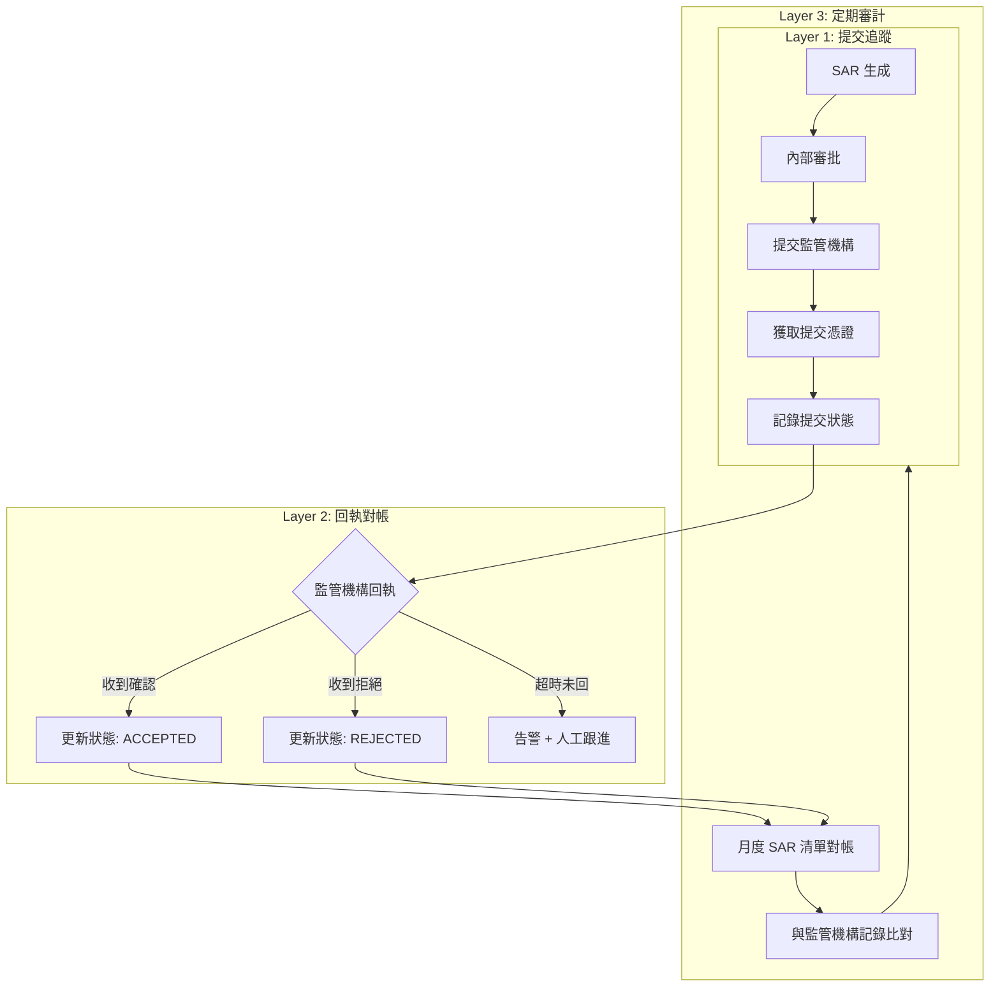
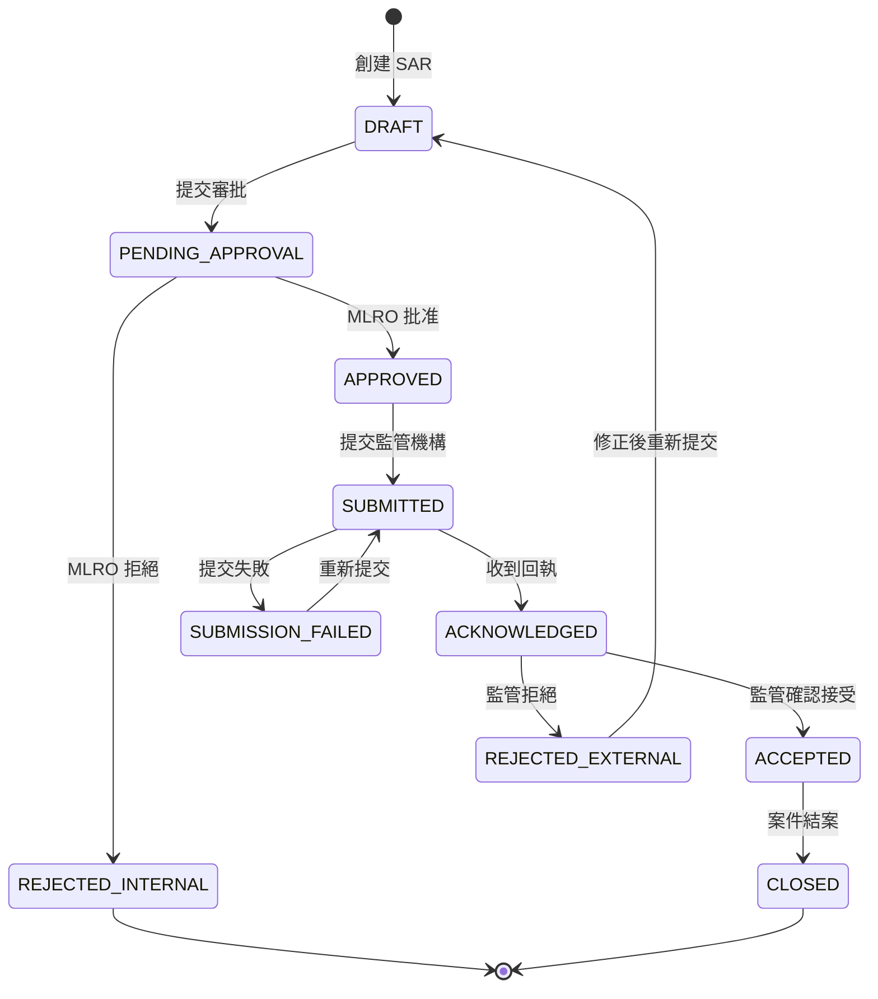

# 05-04 AML 交易報告對帳 (AML Report Reconciliation)

**版本**: 1.0.0
**創建日期**: 2026-02-07
**狀態**: P0 - 監管合規必要

---

## 1. 概述

AML (Anti-Money Laundering) 交易報告對帳確保平台向監管機構提交的可疑活動報告 (SAR/STR) 與內部記錄一致，並驗證報告後續處理的完整性。

### 1.1 對帳目的

- **合規證明**: 證明已履行 SAR/STR 報告義務
- **狀態追蹤**: 確保報告後的帳戶處置正確執行
- **審計完整性**: 提供完整的報告與處置軌跡
- **跨牌照協調**: 防止多牌照下的重複報告

### 1.2 業界標準

| 標準 | 適用範圍 | 關鍵條款 |
|------|---------|---------|
| **FATF Recommendations** | 全球 AML 標準 | R.10-21 CDD/SAR |
| **5AMLD/6AMLD** | 歐盟 AML 指令 | Enhanced CDD, Crypto Regulation |
| **UKGC AML Guidance** | 英國市場 | Key Event Reporting, 2023 更新 |
| **MGA AML Framework** | 馬耳他市場 | FIAU Reporting Requirements |
| **POCA 2002** | 英國洗錢法 | SAR 提交要求 |

---

## 2. SAR/STR 報告類型

### 2.1 報告類型分類

| 報告類型 | 英文名稱 | 觸發條件 | 提交時限 |
|---------|---------|---------|---------|
| **SAR** | Suspicious Activity Report | 可疑交易/行為 | 7 工作日 |
| **STR** | Suspicious Transaction Report | 可疑交易 (金額閾值) | 24-48 小時 |
| **CTR** | Currency Transaction Report | 大額現金交易 | 15 日 |
| **DASR** | Defence Against SAR | 請求繼續交易許可 | 事前 |

### 2.2 各牌照報告機構

| 牌照 | 報告機構 | 報告格式 | 系統接口 |
|------|---------|---------|---------|
| **UKGC** | NCA (National Crime Agency) | SAR Online | Web Portal / API |
| **MGA** | FIAU (Financial Intelligence Analysis Unit) | goAML XML | SFTP / API |
| **Gibraltar** | GFIU | goAML XML | SFTP |
| **Isle of Man** | FIU IoM | Web Portal | Manual |
| **Netherlands** | FIU-NL | goAML XML | SFTP |

---

## 3. SAR 提交對帳

### 3.1 對帳架構



### 3.2 SAR 狀態機



### 3.3 SAR 對帳服務實現

```java
/**
 * SAR 對帳服務
 * SmartAdmin 架構: Service 層
 */
@Service
@RequiredArgsConstructor
@Slf4j
public class SarReconciliationService {

    private final SarReportDao sarReportDao;
    private final SarSubmissionManager submissionManager;
    private final RegulatoryApiClient regulatoryClient;

    /**
     * 每日 SAR 提交狀態對帳
     */
    @Scheduled(cron = "0 0 9 * * ?")  // 每日 09:00
    public void reconcileSarSubmissions() {
        LocalDate yesterday = LocalDate.now().minusDays(1);

        // 1. 獲取昨日提交的 SAR
        List<SarReport> submittedSars = sarReportDao
            .findBySubmissionDate(yesterday, SarStatus.SUBMITTED);

        // 2. 檢查回執狀態
        for (SarReport sar : submittedSars) {
            try {
                RegulatoryResponse response = regulatoryClient
                    .checkSubmissionStatus(sar.getExternalReference());

                updateSarStatus(sar, response);

            } catch (RegulatoryApiException e) {
                log.error("Failed to check SAR status: sarId={}, error={}",
                    sar.getId(), e.getMessage());

                // 標記為需要人工跟進
                markForManualFollowUp(sar, e.getMessage());
            }
        }

        // 3. 檢查超時未回執的 SAR
        List<SarReport> pendingSars = sarReportDao
            .findPendingAcknowledgement(Duration.ofDays(3));

        for (SarReport sar : pendingSars) {
            generateTimeoutAlert(sar);
        }

        // 4. 生成對帳報告
        generateDailyReconciliationReport(yesterday);
    }

    /**
     * 月度 SAR 清單對帳
     */
    public SarReconciliationReport monthlyReconciliation(YearMonth month) {
        LocalDate startDate = month.atDay(1);
        LocalDate endDate = month.atEndOfMonth();

        // 1. 獲取內部 SAR 記錄
        List<SarReport> internalSars = sarReportDao
            .findByDateRange(startDate, endDate);

        // 2. 獲取監管機構記錄 (如果 API 支持)
        List<RegulatoryRecord> externalRecords = regulatoryClient
            .getSubmissionHistory(startDate, endDate);

        // 3. 執行對帳
        SarReconciliationResult result = reconcile(internalSars, externalRecords);

        // 4. 生成報告
        return SarReconciliationReport.builder()
            .month(month)
            .totalSubmitted(internalSars.size())
            .totalAccepted(result.getAcceptedCount())
            .totalRejected(result.getRejectedCount())
            .totalPending(result.getPendingCount())
            .missingInExternal(result.getMissingInExternal())
            .missingInInternal(result.getMissingInInternal())
            .build();
    }
}
```

---

## 4. 帳戶凍結對帳

### 4.1 SAR 關聯帳戶凍結驗證

```yaml
SAR 提交後帳戶處置:

  凍結要求:
    - SAR 提交後，關聯帳戶應立即凍結
    - 禁止所有存/提款
    - 禁止遊戲投注
    - 禁止獎金領取

  解凍條件:
    - 收到 NCA/FIAU 許可
    - 案件結案
    - 法律要求

  對帳目標:
    - 驗證 SAR 關聯帳戶確實被凍結
    - 驗證凍結期間無違規交易
    - 驗證解凍操作有正確授權
```

### 4.2 凍結狀態對帳

```java
/**
 * SAR 帳戶凍結對帳 Manager
 * SmartAdmin 架構: Manager 層 (涉及事務)
 */
@Component
@RequiredArgsConstructor
@Slf4j
public class SarAccountFreezeManager {

    private final SarReportDao sarReportDao;
    private final PlayerAccountDao playerAccountDao;
    private final TransactionDao transactionDao;

    /**
     * 驗證 SAR 關聯帳戶的凍結狀態
     */
    @Transactional(readOnly = true)
    public SarFreezeReconciliationResult reconcileFreezeStatus() {
        List<SarFreezeViolation> violations = new ArrayList<>();

        // 1. 獲取所有 SUBMITTED/ACCEPTED 狀態的 SAR
        List<SarReport> activeSars = sarReportDao
            .findByStatusIn(List.of(SarStatus.SUBMITTED, SarStatus.ACCEPTED));

        for (SarReport sar : activeSars) {
            Long playerId = sar.getPlayerId();

            // 2. 檢查帳戶是否被凍結
            PlayerAccount account = playerAccountDao.selectById(playerId);
            if (account.getStatus() != AccountStatus.FROZEN) {
                violations.add(SarFreezeViolation.builder()
                    .sarId(sar.getId())
                    .playerId(playerId)
                    .violationType(ViolationType.ACCOUNT_NOT_FROZEN)
                    .description("SAR 關聯帳戶未被凍結")
                    .build());
            }

            // 3. 檢查凍結後是否有違規交易
            List<Transaction> postSarTransactions = transactionDao
                .findByPlayerIdAfterDate(playerId, sar.getSubmittedAt());

            for (Transaction tx : postSarTransactions) {
                if (tx.getType() != TransactionType.FREEZE_ADJUSTMENT) {
                    violations.add(SarFreezeViolation.builder()
                        .sarId(sar.getId())
                        .playerId(playerId)
                        .transactionId(tx.getId())
                        .violationType(ViolationType.POST_SAR_TRANSACTION)
                        .description(String.format(
                            "SAR 提交後發生交易: type=%s, amount=%s",
                            tx.getType(), tx.getAmount()))
                        .build());
                }
            }
        }

        return SarFreezeReconciliationResult.builder()
            .totalChecked(activeSars.size())
            .violationCount(violations.size())
            .violations(violations)
            .reconciliationTime(LocalDateTime.now())
            .build();
    }
}
```

### 4.3 凍結對帳表結構

```sql
-- SAR 帳戶凍結對帳表
CREATE TABLE t_sar_freeze_reconciliation (
    id                  BIGINT PRIMARY KEY AUTO_INCREMENT,
    reconciliation_date DATE NOT NULL,

    -- 統計
    total_active_sars       INT NOT NULL,
    accounts_properly_frozen INT NOT NULL,
    accounts_not_frozen     INT DEFAULT 0,
    post_sar_violations     INT DEFAULT 0,

    -- 違規詳情
    violations_json         JSON,

    -- 狀態
    status                  VARCHAR(20) DEFAULT 'PENDING',
    reviewed_by             VARCHAR(100),
    reviewed_at             DATETIME,
    resolution_notes        TEXT,

    created_at              DATETIME DEFAULT CURRENT_TIMESTAMP,

    UNIQUE KEY uk_date (reconciliation_date),
    INDEX idx_status (status)
);

-- SAR 帳戶凍結違規明細
CREATE TABLE t_sar_freeze_violation (
    id                  BIGINT PRIMARY KEY AUTO_INCREMENT,
    reconciliation_id   BIGINT NOT NULL,
    sar_id              BIGINT NOT NULL,
    player_id           BIGINT NOT NULL,
    transaction_id      BIGINT,

    violation_type      VARCHAR(50) NOT NULL,
    description         VARCHAR(500),

    -- 處置
    resolution_action   VARCHAR(100),
    resolved_at         DATETIME,
    resolved_by         VARCHAR(100),

    created_at          DATETIME DEFAULT CURRENT_TIMESTAMP,

    INDEX idx_reconciliation (reconciliation_id),
    INDEX idx_sar (sar_id),
    INDEX idx_player (player_id)
);
```

---

## 5. 跨牌照報告協調

### 5.1 重複報告防護

```yaml
跨牌照場景:
  問題: 同一玩家在多牌照下註冊，可能產生重複 SAR

  協調規則:
    - 首次發現可疑活動的牌照負責報告
    - 其他牌照記錄但不重複報告
    - 共享內部調查結果

  技術實現:
    - 全局玩家 ID 關聯
    - SAR 跨牌照查重
    - 報告協調工作流
```

### 5.2 跨牌照對帳

```java
/**
 * 跨牌照 SAR 對帳服務
 */
@Service
@RequiredArgsConstructor
public class CrossJurisdictionSarService {

    /**
     * 檢查跨牌照重複報告
     */
    public List<DuplicateSarCandidate> findPotentialDuplicates(Long playerId) {
        List<DuplicateSarCandidate> candidates = new ArrayList<>();

        // 1. 獲取玩家在所有牌照下的帳戶
        List<PlayerAccount> accounts = playerAccountDao
            .findAllByGlobalPlayerId(playerId);

        // 2. 獲取所有關聯的 SAR
        List<SarReport> allSars = new ArrayList<>();
        for (PlayerAccount account : accounts) {
            allSars.addAll(sarReportDao.findByPlayerId(account.getId()));
        }

        // 3. 按時間窗口檢查潛在重複
        for (int i = 0; i < allSars.size(); i++) {
            for (int j = i + 1; j < allSars.size(); j++) {
                SarReport sar1 = allSars.get(i);
                SarReport sar2 = allSars.get(j);

                if (isPotentialDuplicate(sar1, sar2)) {
                    candidates.add(DuplicateSarCandidate.builder()
                        .sar1(sar1)
                        .sar2(sar2)
                        .similarity(calculateSimilarity(sar1, sar2))
                        .build());
                }
            }
        }

        return candidates;
    }

    private boolean isPotentialDuplicate(SarReport sar1, SarReport sar2) {
        // 30 天內的相似 SAR 視為潛在重複
        Duration timeDiff = Duration.between(
            sar1.getCreatedAt(), sar2.getCreatedAt()
        ).abs();

        if (timeDiff.toDays() > 30) {
            return false;
        }

        // 相同可疑活動類型
        if (!sar1.getSuspicionType().equals(sar2.getSuspicionType())) {
            return false;
        }

        return true;
    }
}
```

---

## 6. 第三方篩查對帳

### 6.1 篩查服務對帳

```yaml
第三方篩查服務:
  - World-Check (Refinitiv)
  - Dow Jones Risk & Compliance
  - LexisNexis WorldCompliance
  - ComplyAdvantage

對帳內容:
  - 篩查結果命中記錄
  - 內部處置決策
  - 持續監控更新
```

### 6.2 篩查結果對帳

```sql
-- 第三方篩查對帳查詢
SELECT
    ps.player_id,
    ps.screening_provider,
    ps.screening_date,
    ps.match_count,
    ps.match_status,      -- MATCH, POTENTIAL, CLEAR

    -- 內部處置
    pd.decision,          -- PROCEED, BLOCK, ENHANCED_DUE_DILIGENCE
    pd.decided_by,
    pd.decided_at,

    -- SAR 關聯
    sar.id AS sar_id,
    sar.status AS sar_status,

    -- 對帳狀態
    CASE
        WHEN ps.match_status = 'MATCH' AND pd.decision IS NULL
            THEN 'PENDING_DECISION'
        WHEN ps.match_status = 'MATCH' AND pd.decision = 'PROCEED' AND sar.id IS NULL
            THEN 'MISSING_SAR'
        WHEN ps.match_status = 'MATCH' AND sar.status = 'ACCEPTED'
            THEN 'RECONCILED'
        ELSE 'OK'
    END AS reconciliation_status

FROM t_player_screening ps
LEFT JOIN t_player_screening_decision pd ON ps.id = pd.screening_id
LEFT JOIN t_sar_report sar ON ps.player_id = sar.player_id
    AND sar.created_at > ps.screening_date
    AND sar.created_at < DATE_ADD(ps.screening_date, INTERVAL 30 DAY)
WHERE ps.screening_date >= DATE_SUB(CURDATE(), INTERVAL 7 DAY)
  AND ps.match_status IN ('MATCH', 'POTENTIAL')
ORDER BY ps.screening_date DESC;
```

---

## 7. 監控與告警

### 7.1 關鍵指標

| 指標 | Prometheus 名稱 | 告警閾值 |
|------|----------------|---------|
| SAR 提交成功率 | `aml_sar_submission_success_rate` | < 99% |
| SAR 回執等待時間 | `aml_sar_acknowledgement_wait_hours` | > 72 小時 |
| 帳戶凍結違規數 | `aml_freeze_violations_count` | > 0 |
| 篩查未處置數 | `aml_screening_pending_decision_count` | > 10 |

### 7.2 告警規則

```yaml
alerts:
  - name: sar_submission_failed
    condition: aml_sar_submission_success_rate < 0.99
    severity: HIGH
    notify: pagerduty:compliance-oncall

  - name: sar_acknowledgement_timeout
    condition: aml_sar_acknowledgement_wait_hours > 72
    severity: HIGH
    notify: slack:#compliance-ops, email:mlro@company.com

  - name: account_freeze_violation
    condition: aml_freeze_violations_count > 0
    severity: CRITICAL
    notify: pagerduty:compliance-oncall, email:cco@company.com

  - name: screening_backlog
    condition: aml_screening_pending_decision_count > 10
    for: 24h
    severity: WARNING
    notify: slack:#compliance-ops
```

---

## 8. 審計與報告

### 8.1 數據保留

| 數據類型 | 保留期限 | 法規依據 |
|---------|---------|---------|
| SAR 記錄 | 10 年 | POCA 2002, 5AMLD |
| 篩查結果 | 10 年 | AML 法規 |
| 凍結操作日誌 | 10 年 | 審計要求 |
| 對帳報告 | 7 年 | UKGC LCCP |

### 8.2 MLRO 報告

```yaml
週報表:
  - SAR 提交/回執狀態摘要
  - 帳戶凍結對帳結果
  - 篩查命中處置統計

月報表:
  - SAR 月度清單對帳
  - 跨牌照報告協調
  - 第三方篩查覆蓋率
  - 違規事件分析

年報表:
  - 年度 AML 活動摘要
  - 監管機構互動記錄
  - 合規改進建議
```

### 8.3 監管機構報告

```java
/**
 * 生成監管機構合規報告
 */
public RegulatoryComplianceReport generateRegulatoryReport(
        String jurisdiction,
        YearMonth reportMonth) {

    return RegulatoryComplianceReport.builder()
        .jurisdiction(jurisdiction)
        .reportMonth(reportMonth)

        // SAR 統計
        .sarSubmitted(countSarsSubmitted(jurisdiction, reportMonth))
        .sarAccepted(countSarsAccepted(jurisdiction, reportMonth))
        .sarRejected(countSarsRejected(jurisdiction, reportMonth))

        // 凍結統計
        .accountsFrozen(countAccountsFrozen(jurisdiction, reportMonth))
        .accountsUnfrozen(countAccountsUnfrozen(jurisdiction, reportMonth))

        // 篩查統計
        .screeningsPerformed(countScreenings(jurisdiction, reportMonth))
        .matchesFound(countMatches(jurisdiction, reportMonth))

        // 對帳狀態
        .reconciliationStatus(getReconciliationStatus(jurisdiction, reportMonth))
        .violations(getViolations(jurisdiction, reportMonth))

        .generatedAt(LocalDateTime.now())
        .generatedBy("System")
        .build();
}
```

---

## 9. 合規清單

### 9.1 每日檢查

- [ ] SAR 提交狀態確認
- [ ] 帳戶凍結驗證
- [ ] 篩查結果處理
- [ ] 告警處理

### 9.2 每週檢查

- [ ] SAR 回執對帳
- [ ] 跨牌照重複檢查
- [ ] 篩查覆蓋率檢查
- [ ] MLRO 週報審批

### 9.3 每月檢查

- [ ] SAR 月度清單對帳
- [ ] 監管機構記錄比對
- [ ] 凍結合規審計
- [ ] 月度合規報告

---

## 10. 相關文檔

- [05-03 KYC/AML](05-03_KYC_AML.md) - CDD/EDD/SAR 流程
- [05-02-05 多帳戶檢測](05-02-05_Multi_Account_Detection.md) - 關聯帳戶檢測
- [06-08 UKGC 合規](../06_Platform_Governance/06-08_UKGC_Compliance.md) - UK 牌照要求
- [02-03 對帳系統](../02_Finance_Center/02-03_Reconciliation_System.md) - 核心對帳架構

---

**返回**: [風控中心](README.md) | [iGaming 首頁](../README.md)
