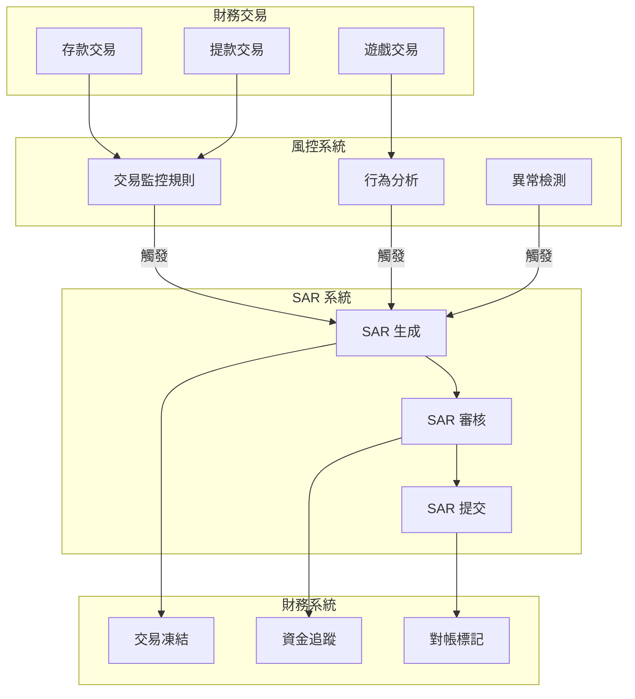

# 05-05 SAR Finance Integration (SAR 財務整合)

**版本**: 1.0.0
**創建日期**: 2026-02-07
**狀態**: ✅ 規範完成
**優先級**: P2 Medium

---

## 概述

SAR (Suspicious Activity Report) 財務整合確保可疑活動報告與財務交易記錄正確關聯，滿足 AML/CFT 審計追蹤要求。

### 監管背景

| 規範 | 司法區 | 關鍵要求 |
|------|--------|---------|
| **UKGC SR 3.2** | UK | SAR 與交易連結 |
| **5AMLD/6AMLD** | EU | 交易追蹤義務 |
| **FATF R.20** | 全球 | STR 記錄保存 |
| **MGA AML** | Malta | 財務審計追蹤 |

---

## 整合架構



---

## 數據模型

### SAR-交易關聯表

```sql
-- SAR 與財務交易關聯
CREATE TABLE t_sar_transaction_link (
    id                  BIGINT PRIMARY KEY AUTO_INCREMENT,
    sar_id              BIGINT NOT NULL,
    sar_reference       VARCHAR(50) NOT NULL,

    -- 關聯交易
    transaction_type    VARCHAR(30) NOT NULL,  -- DEPOSIT, WITHDRAWAL, BET, WIN
    transaction_id      BIGINT NOT NULL,
    transaction_amount  DECIMAL(18,2) NOT NULL,
    transaction_date    DATETIME NOT NULL,

    -- 標記
    flagged_reason      VARCHAR(200),
    risk_score          INT,
    freeze_status       VARCHAR(20),           -- NONE, FROZEN, RELEASED

    -- 審計
    created_at          DATETIME DEFAULT CURRENT_TIMESTAMP,
    created_by          BIGINT,

    INDEX idx_sar (sar_id),
    INDEX idx_transaction (transaction_type, transaction_id),
    INDEX idx_freeze (freeze_status)
) ENGINE=InnoDB COMMENT='SAR 與交易關聯';
```

---

## 對帳流程

### SAR-財務對帳檢查

```sql
-- 確保所有 SAR 關聯交易都已標記
SELECT
    s.id AS sar_id,
    s.sar_reference,
    s.player_id,
    s.total_flagged_amount,
    COUNT(stl.id) AS linked_transactions,
    SUM(stl.transaction_amount) AS linked_amount,
    ABS(s.total_flagged_amount - COALESCE(SUM(stl.transaction_amount), 0)) AS amount_variance,
    CASE
        WHEN ABS(s.total_flagged_amount - COALESCE(SUM(stl.transaction_amount), 0)) < 1 THEN 'MATCHED'
        ELSE 'VARIANCE'
    END AS reconciliation_status
FROM t_sar_report s
LEFT JOIN t_sar_transaction_link stl ON s.id = stl.sar_id
WHERE s.created_at >= DATE_SUB(NOW(), INTERVAL 30 DAY)
GROUP BY s.id, s.sar_reference, s.player_id, s.total_flagged_amount;

-- 檢查財務系統凍結狀態一致性
SELECT
    stl.sar_id,
    stl.transaction_id,
    stl.freeze_status AS sar_freeze_status,
    wt.status AS wallet_tx_status,
    CASE
        WHEN stl.freeze_status = 'FROZEN' AND wt.status = 'FROZEN' THEN 'CONSISTENT'
        WHEN stl.freeze_status = 'NONE' AND wt.status != 'FROZEN' THEN 'CONSISTENT'
        ELSE 'INCONSISTENT'
    END AS consistency_check
FROM t_sar_transaction_link stl
JOIN t_wallet_transaction wt ON stl.transaction_id = wt.id
    AND stl.transaction_type = wt.transaction_type
WHERE stl.freeze_status != 'NONE';
```

---

## 監控指標

```yaml
metrics:
  - name: sar_transaction_link_count
    type: counter
    description: SAR 關聯交易數
    labels: [transaction_type, freeze_status]

  - name: sar_finance_reconciliation_variance
    type: gauge
    description: SAR 金額與關聯交易金額差異
    unit: EUR

  - name: sar_freeze_consistency_rate
    type: gauge
    description: SAR 凍結狀態與財務系統一致性
    target: "100%"
    alert:
      - condition: value < 100
        severity: critical
        message: "SAR 凍結狀態不一致"
```

---

## 相關文檔

- [05-04_AML_Report_Reconciliation.md](05-04_AML_Report_Reconciliation.md) - AML 報告對帳
- [05-03_KYC_AML.md](05-03_KYC_AML.md) - KYC/AML
- [02-03_Reconciliation_System.md](../02_Finance_Center/02-03_Reconciliation_System.md) - 核心對帳

---

## 版本歷史

| 版本 | 日期 | 變更內容 |
|------|------|---------|
| 1.0.0 | 2026-02-07 | 初始版本：SAR-財務整合架構、對帳流程 |

---

**返回**: [風控中心](README.md) | [iGaming 首頁](../README.md)
