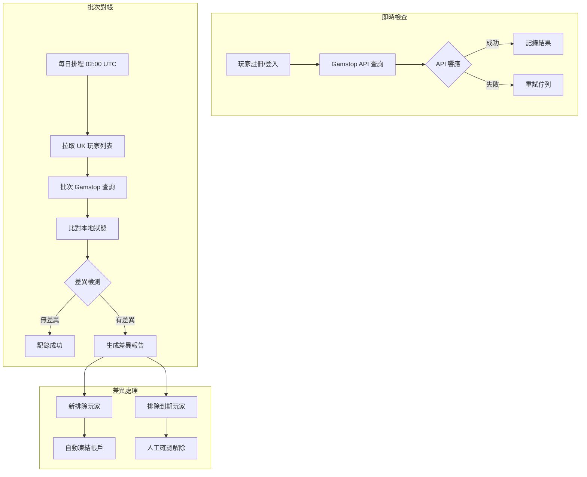

# 06-08 UKGC Compliance (UK Gambling Commission 合規)

**版本**: 2.0.0
**創建日期**: 2026-02-07
**狀態**: ✅ 完整

---

## 概述

UK Gambling Commission (UKGC) 是全球最嚴格的博彩監管機構之一。本文檔詳細說明 UK 牌照的合規要求。

### UKGC 監管框架

| 法規 | 說明 |
|------|------|
| **Gambling Act 2005** | 主要立法 |
| **LCCP** | License Conditions and Codes of Practice |
| **RTS** | Remote Technical Standards |
| **AML Guidance** | 反洗錢指南 |

---

## 2025 新規重點

### 即時 KYC

**生效日期**: 2025年1月

| 舊規 | 新規 |
|------|------|
| 72 小時寬限期 | **立即驗證** |
| 可先存款後驗證 | **驗證後才能存款** |

### 可負擔性評估

UKGC 2025 可負擔性評估包含**兩個獨立的觸發機制**：

#### 年度淨虧損觸發 (Annual Net Loss)

| 觸發條件 | 要求動作 |
|---------|---------|
| 淨虧損 £125-£500/年 | 顯示警告 |
| 淨虧損 £500-£2,000/年 | 玩家自我聲明 |
| 淨虧損 > £2,000/年 | 第三方數據驗證 |

#### 月淨存款觸發 (Monthly Net Deposit) 🆕

> **生效日期**: 2025-02-28
> **LCCP 條款**: LCCP 3.4.3

| 觸發條件 | 計算公式 | 要求動作 |
|---------|---------|---------|
| 月淨存款 ≥ £150 | 30天存款 - 30天提款 | 財務脆弱性檢查 |

**詳細實現**: → [15-08 可負擔性評估](../15_Responsible_Gambling/15-08_Affordability_Assessment.md) (§財務脆弱性月淨存款觸發規則)

### Gambling Levy

**生效日期**: 2025年4月6日

| GGY 範圍 | 稅率 | 年度估算 (£100M GGY) |
|---------|------|---------------------|
| £0 - £10M | 0.1% | £10,000 |
| £10M - £100M | 0.4% | £360,000 |
| £100M - £1B | 0.8% | N/A |
| > £1B | 1.1% | N/A |

#### RET Levy 計算引擎 🆕

**階梯計算邏輯**:

累進稅率意味著不同收入區間適用不同稅率，而非對全部收入適用最高稅率。

```java
/**
 * RET Levy 計算服務
 * 實現 Gambling Levy Act 2025 階梯費率
 */
@Service
@RequiredArgsConstructor
public class RETLevyCalculationService {

    private static final BigDecimal TIER_1_THRESHOLD = new BigDecimal("10000000");  // £10M
    private static final BigDecimal TIER_2_THRESHOLD = new BigDecimal("100000000"); // £100M
    private static final BigDecimal TIER_3_THRESHOLD = new BigDecimal("1000000000"); // £1B

    private static final BigDecimal RATE_TIER_1 = new BigDecimal("0.001"); // 0.1%
    private static final BigDecimal RATE_TIER_2 = new BigDecimal("0.004"); // 0.4%
    private static final BigDecimal RATE_TIER_3 = new BigDecimal("0.008"); // 0.8%
    private static final BigDecimal RATE_TIER_4 = new BigDecimal("0.011"); // 1.1%

    /**
     * 計算月度 RET Levy
     * @param annualGGY 年度 Gross Gaming Yield (£)
     * @return 月度應繳稅額
     */
    public RETLevyResult calculateMonthlyLevy(BigDecimal annualGGY) {
        BigDecimal totalLevy = BigDecimal.ZERO;
        LevyTier tier;

        if (annualGGY.compareTo(TIER_1_THRESHOLD) <= 0) {
            // Tier 1: £0 - £10M → 0.1%
            totalLevy = annualGGY.multiply(RATE_TIER_1);
            tier = LevyTier.TIER_1;
        } else if (annualGGY.compareTo(TIER_2_THRESHOLD) <= 0) {
            // Tier 1 部分 + Tier 2 部分
            totalLevy = TIER_1_THRESHOLD.multiply(RATE_TIER_1)
                .add(annualGGY.subtract(TIER_1_THRESHOLD).multiply(RATE_TIER_2));
            tier = LevyTier.TIER_2;
        } else if (annualGGY.compareTo(TIER_3_THRESHOLD) <= 0) {
            // Tier 1 + Tier 2 + Tier 3
            totalLevy = TIER_1_THRESHOLD.multiply(RATE_TIER_1)
                .add(TIER_2_THRESHOLD.subtract(TIER_1_THRESHOLD).multiply(RATE_TIER_2))
                .add(annualGGY.subtract(TIER_2_THRESHOLD).multiply(RATE_TIER_3));
            tier = LevyTier.TIER_3;
        } else {
            // 全部 4 個階梯
            totalLevy = TIER_1_THRESHOLD.multiply(RATE_TIER_1)
                .add(TIER_2_THRESHOLD.subtract(TIER_1_THRESHOLD).multiply(RATE_TIER_2))
                .add(TIER_3_THRESHOLD.subtract(TIER_2_THRESHOLD).multiply(RATE_TIER_3))
                .add(annualGGY.subtract(TIER_3_THRESHOLD).multiply(RATE_TIER_4));
            tier = LevyTier.TIER_4;
        }

        // 月度金額 = 年度 / 12
        BigDecimal monthlyLevy = totalLevy.divide(BigDecimal.valueOf(12), 2, RoundingMode.HALF_UP);

        return RETLevyResult.builder()
            .annualGGY(annualGGY)
            .annualLevy(totalLevy)
            .monthlyLevy(monthlyLevy)
            .tier(tier)
            .effectiveRate(totalLevy.divide(annualGGY, 6, RoundingMode.HALF_UP))
            .build();
    }
}
```

**數據庫設計**:

```sql
-- RET Levy 計算記錄表
CREATE TABLE t_ukgc_ret_levy (
    id BIGINT PRIMARY KEY AUTO_INCREMENT,

    -- 報告週期
    reporting_month DATE NOT NULL COMMENT '報告月份 (YYYY-MM-01)',
    reporting_year INT NOT NULL COMMENT '財政年度',

    -- GGY 計算
    gross_gaming_yield DECIMAL(18,2) NOT NULL COMMENT '月度 GGY',
    annual_ggy_to_date DECIMAL(18,2) NOT NULL COMMENT '年度累計 GGY',

    -- Levy 計算
    levy_tier ENUM('TIER_1', 'TIER_2', 'TIER_3', 'TIER_4') NOT NULL,
    levy_rate DECIMAL(5,4) NOT NULL COMMENT '有效稅率',
    levy_amount DECIMAL(18,2) NOT NULL COMMENT '本月應繳',
    annual_levy_to_date DECIMAL(18,2) NOT NULL COMMENT '年度累計應繳',

    -- 支付狀態
    payment_due_date DATE NOT NULL COMMENT '支付截止日',
    payment_status ENUM('PENDING', 'PAID', 'OVERDUE') DEFAULT 'PENDING',
    payment_date DATE COMMENT '實際支付日期',
    payment_reference VARCHAR(100) COMMENT 'UKGC 支付參考號',

    -- 審計
    calculated_at DATETIME DEFAULT CURRENT_TIMESTAMP,
    calculated_by VARCHAR(100) DEFAULT 'SYSTEM',
    created_at DATETIME DEFAULT CURRENT_TIMESTAMP,

    -- 約束
    UNIQUE KEY uk_month (reporting_month),
    INDEX idx_year_status (reporting_year, payment_status)
) ENGINE=InnoDB COMMENT='UKGC RET Levy 計算記錄';

-- 月度 GGY 聚合查詢
SELECT
    DATE_FORMAT(settlement_date, '%Y-%m-01') AS reporting_month,
    SUM(ggr) AS gross_gaming_yield
FROM t_game_settlement
WHERE jurisdiction = 'UKGC'
  AND settlement_date >= DATE_FORMAT(CURRENT_DATE, '%Y-%m-01')
  AND settlement_date < DATE_ADD(DATE_FORMAT(CURRENT_DATE, '%Y-%m-01'), INTERVAL 1 MONTH)
GROUP BY DATE_FORMAT(settlement_date, '%Y-%m-01');
```

**月度報告 API**:

```java
@GetMapping("/ret-levy/report")
@SaCheckPermission("ukgc:levy:view")
public ResponseDTO<RETLevyReportVO> getMonthlyReport(
        @RequestParam @DateTimeFormat(pattern = "yyyy-MM") YearMonth month) {
    return ResponseDTO.ok(levyService.generateMonthlyReport(month));
}
```

**監控指標**:

| 指標 | 告警條件 | 通知對象 |
|------|---------|---------|
| 支付截止預警 | 截止日前 7 天未支付 | Finance Team |
| GGY 異常波動 | 環比變動 > 30% | Compliance + Finance |
| 年度累計預測 | 預計突破下一稅階 | CFO |

> ⚠️ **VIP 無豁免原則**: VIP 玩家必須經過與普通玩家**完全相同**的風控規則檢查。
> VIP 狀態僅影響審核隊列優先級，**絕不**影響規則觸發門檻。
> **參考案例**: Entain £17M 罰款（2022）- VIP 客戶盡職調查失敗。

---

## LCCP 社會責任條款

### SR 3.4 - 玩家保護

| 條款 | 要求 | 實現文檔 |
|------|------|---------|
| SR 3.4.1 | 存款限額選項 | [15-02](../15_Responsible_Gambling/15-02_Deposit_Limits.md) |
| SR 3.4.2 | 現實檢查 | [15-05](../15_Responsible_Gambling/15-05_Reality_Checks.md) |
| SR 3.4.3 | 活動聲明 | [15-07](../15_Responsible_Gambling/15-07_Player_Protection_API.md) |

### SR 3.5 - 自我排除

| 條款 | 要求 | 實現文檔 |
|------|------|---------|
| SR 3.5.1 | 自我排除機制 | [15-01](../15_Responsible_Gambling/15-01_Self_Exclusion.md) |
| SR 3.5.2 | Gamstop 整合 | 本文檔 |
| SR 3.5.3 | 排除期間服務 | [15-01](../15_Responsible_Gambling/15-01_Self_Exclusion.md) |

---

## Gamstop 整合

### 概述

Gamstop 是 UK 的全國性自我排除計劃，所有持有 UKGC 牌照的運營商必須參與。

### API 整合

```java
@Component
@RequiredArgsConstructor
@Slf4j
public class GamstopIntegration {

    @Value("${gamstop.api.url}")
    private String apiUrl;

    @Value("${gamstop.api.key}")
    private String apiKey;

    @Value("${gamstop.operator.id}")
    private String operatorId;

    private final RestTemplate restTemplate;
    private final GamstopSyncLogDao syncLogDao;

    /**
     * 註冊時檢查玩家是否在 Gamstop 名單
     *
     * 必須在允許存款前調用
     */
    public GamstopCheckResult checkExclusion(GamstopCheckRequest request) {
        HttpHeaders headers = createHeaders();
        HttpEntity<GamstopCheckRequest> entity = new HttpEntity<>(request, headers);

        try {
            ResponseEntity<GamstopCheckResponse> response = restTemplate.exchange(
                apiUrl + "/exclusion/check",
                HttpMethod.POST,
                entity,
                GamstopCheckResponse.class
            );

            GamstopCheckResponse body = response.getBody();

            // 記錄檢查
            GamstopSyncLog log = GamstopSyncLog.builder()
                .playerId(request.getPlayerId())
                .syncType("CHECK")
                .requestPayload(JsonUtil.toJson(request))
                .responsePayload(JsonUtil.toJson(body))
                .gamstopReference(body.getReference())
                .status(body.isExcluded() ? "EXCLUDED" : "CLEAR")
                .build();
            syncLogDao.insert(log);

            return GamstopCheckResult.builder()
                .excluded(body.isExcluded())
                .exclusionEndDate(body.getExclusionEndDate())
                .reference(body.getReference())
                .build();

        } catch (Exception e) {
            log.error("Gamstop check failed", e);

            // 記錄失敗
            GamstopSyncLog log = GamstopSyncLog.builder()
                .playerId(request.getPlayerId())
                .syncType("CHECK")
                .status("FAILED")
                .errorMessage(e.getMessage())
                .build();
            syncLogDao.insert(log);

            // Gamstop 不可用時的處理策略
            // 選項 1: 拒絕服務（最安全）
            // 選項 2: 允許繼續，記錄待後續驗證
            throw new GamstopUnavailableException("Gamstop 服務暫時不可用", e);
        }
    }

    /**
     * 定期同步 Gamstop 狀態
     */
    @Scheduled(cron = "0 0 2 * * ?") // 每天凌晨 2 點
    public void syncGamstopStatus() {
        List<Player> ukPlayers = playerDao.findByJurisdiction("UKGC");

        for (Player player : ukPlayers) {
            try {
                GamstopCheckRequest request = buildCheckRequest(player);
                GamstopCheckResult result = checkExclusion(request);

                if (result.isExcluded() && !player.isExcluded()) {
                    // 玩家新被加入 Gamstop，需要排除
                    selfExclusionService.excludeFromGamstop(
                        player.getId(),
                        result.getExclusionEndDate()
                    );
                }
            } catch (Exception e) {
                log.error("Failed to sync Gamstop for player: {}",
                    player.getId(), e);
            }
        }
    }

    /**
     * 向 Gamstop 註冊排除
     */
    public GamstopRegistrationResult registerExclusion(
            Long playerId,
            GamstopRegistrationRequest request) {

        HttpHeaders headers = createHeaders();
        HttpEntity<GamstopRegistrationRequest> entity = new HttpEntity<>(request, headers);

        ResponseEntity<GamstopRegistrationResponse> response = restTemplate.exchange(
            apiUrl + "/exclusion/register",
            HttpMethod.POST,
            entity,
            GamstopRegistrationResponse.class
        );

        GamstopRegistrationResponse body = response.getBody();

        // 記錄
        GamstopSyncLog log = GamstopSyncLog.builder()
            .playerId(playerId)
            .syncType("REGISTER")
            .gamstopReference(body.getReference())
            .status("SUCCESS")
            .build();
        syncLogDao.insert(log);

        return GamstopRegistrationResult.builder()
            .success(true)
            .reference(body.getReference())
            .build();
    }

    private HttpHeaders createHeaders() {
        HttpHeaders headers = new HttpHeaders();
        headers.setContentType(MediaType.APPLICATION_JSON);
        headers.set("X-Operator-ID", operatorId);
        headers.set("X-API-Key", apiKey);
        return headers;
    }
}
```

### Gamstop 監控與對帳 (v2.0.0 新增)

#### 對帳架構



#### 重試機制

```yaml
Gamstop API 重試策略:

  即時檢查重試:
    最大重試次數: 3
    重試間隔: [1s, 3s, 10s] (指數退避)
    超時時間: 5s per request
    失敗處理:
      - 註冊: 阻止註冊，顯示「系統維護中」
      - 登入: 允許登入，標記待驗證
      - 存款: 阻止存款，直到驗證完成

  批次同步重試:
    最大重試次數: 5
    重試間隔: [1min, 5min, 15min, 30min, 60min]
    失敗處理:
      - 記錄失敗玩家 ID
      - 告警通知風控團隊
      - 次日優先重試

  熔斷機制:
    條件: 連續 10 次 API 失敗
    熔斷時間: 5 分鐘
    恢復策略: 半開狀態，成功 3 次後完全恢復
```

```java
/**
 * Gamstop 重試服務
 * SmartAdmin 架構: Manager 層
 */
@Component
@RequiredArgsConstructor
@Slf4j
public class GamstopRetryManager {

    private final GamstopApiClient gamstopClient;
    private final GamstopSyncLogDao syncLogDao;
    private final RedissonClient redisson;

    private static final String RETRY_QUEUE_KEY = "gamstop:retry:queue";
    private static final String CIRCUIT_BREAKER_KEY = "gamstop:circuit:breaker";

    /**
     * 帶重試的 Gamstop 檢查
     */
    @Retryable(
        value = GamstopApiException.class,
        maxAttempts = 3,
        backoff = @Backoff(delay = 1000, multiplier = 3)
    )
    public GamstopCheckResult checkWithRetry(GamstopCheckRequest request) {
        // 檢查熔斷狀態
        if (isCircuitBreakerOpen()) {
            throw new GamstopCircuitBreakerException("Gamstop circuit breaker is open");
        }

        try {
            GamstopCheckResult result = gamstopClient.check(request);
            recordSuccess();
            return result;
        } catch (Exception e) {
            recordFailure();
            throw new GamstopApiException("Gamstop API call failed", e);
        }
    }

    /**
     * 添加到重試佇列
     */
    @Transactional(rollbackFor = Throwable.class)
    public void addToRetryQueue(Long playerId, String checkType) {
        RQueue<GamstopRetryTask> queue = redisson.getQueue(RETRY_QUEUE_KEY);

        GamstopRetryTask task = GamstopRetryTask.builder()
            .playerId(playerId)
            .checkType(checkType)
            .retryCount(0)
            .createdAt(LocalDateTime.now())
            .nextRetryAt(LocalDateTime.now().plusMinutes(1))
            .build();

        queue.add(task);

        // 記錄
        syncLogDao.insert(GamstopSyncLog.builder()
            .playerId(playerId)
            .syncType("RETRY_QUEUED")
            .status("PENDING")
            .build());
    }

    /**
     * 處理重試佇列 (每分鐘執行)
     */
    @Scheduled(fixedRate = 60000)
    public void processRetryQueue() {
        if (isCircuitBreakerOpen()) {
            log.warn("Gamstop circuit breaker is open, skipping retry queue");
            return;
        }

        RQueue<GamstopRetryTask> queue = redisson.getQueue(RETRY_QUEUE_KEY);
        LocalDateTime now = LocalDateTime.now();

        List<GamstopRetryTask> tasksToRetry = new ArrayList<>();
        GamstopRetryTask task;

        while ((task = queue.peek()) != null &&
               task.getNextRetryAt().isBefore(now)) {
            tasksToRetry.add(queue.poll());
        }

        for (GamstopRetryTask retryTask : tasksToRetry) {
            try {
                processRetryTask(retryTask);
            } catch (Exception e) {
                handleRetryFailure(retryTask, e);
            }
        }
    }

    private void processRetryTask(GamstopRetryTask task) {
        GamstopCheckRequest request = buildRequestFromPlayerId(task.getPlayerId());
        GamstopCheckResult result = checkWithRetry(request);

        syncLogDao.insert(GamstopSyncLog.builder()
            .playerId(task.getPlayerId())
            .syncType("RETRY_SUCCESS")
            .status(result.isExcluded() ? "EXCLUDED" : "CLEAR")
            .gamstopReference(result.getReference())
            .build());
    }

    private void handleRetryFailure(GamstopRetryTask task, Exception e) {
        int newRetryCount = task.getRetryCount() + 1;

        if (newRetryCount >= 5) {
            // 超過最大重試次數
            log.error("Gamstop retry exhausted for player: {}", task.getPlayerId());
            syncLogDao.insert(GamstopSyncLog.builder()
                .playerId(task.getPlayerId())
                .syncType("RETRY_EXHAUSTED")
                .status("FAILED")
                .errorMessage(e.getMessage())
                .build());

            // 告警
            alertService.sendAlert(AlertType.GAMSTOP_RETRY_EXHAUSTED,
                "Player " + task.getPlayerId() + " failed Gamstop check after 5 retries");
            return;
        }

        // 重新加入佇列
        int[] retryDelays = {1, 5, 15, 30, 60}; // 分鐘
        LocalDateTime nextRetry = LocalDateTime.now()
            .plusMinutes(retryDelays[newRetryCount]);

        GamstopRetryTask newTask = task.toBuilder()
            .retryCount(newRetryCount)
            .nextRetryAt(nextRetry)
            .build();

        RQueue<GamstopRetryTask> queue = redisson.getQueue(RETRY_QUEUE_KEY);
        queue.add(newTask);
    }

    private boolean isCircuitBreakerOpen() {
        RBucket<CircuitBreakerState> bucket = redisson.getBucket(CIRCUIT_BREAKER_KEY);
        CircuitBreakerState state = bucket.get();
        return state != null && state.isOpen() &&
               state.getOpenedAt().plusMinutes(5).isAfter(LocalDateTime.now());
    }
}
```

#### 每日對帳流程

```java
/**
 * Gamstop 每日對帳服務
 */
@Service
@RequiredArgsConstructor
@Slf4j
public class GamstopReconciliationService {

    private final PlayerDao playerDao;
    private final GamstopRetryManager gamstopRetryManager;
    private final SelfExclusionService selfExclusionService;
    private final GamstopReconciliationDao reconciliationDao;

    /**
     * 每日對帳任務 (02:00 UTC)
     */
    @Scheduled(cron = "0 0 2 * * ?", zone = "UTC")
    @Transactional(rollbackFor = Throwable.class)
    public void dailyReconciliation() {
        log.info("Starting Gamstop daily reconciliation");

        LocalDate today = LocalDate.now();
        GamstopReconciliationReport report = new GamstopReconciliationReport(today);

        // 1. 獲取所有 UK 玩家
        List<Long> ukPlayerIds = playerDao.findPlayerIdsByJurisdiction("UKGC");
        report.setTotalPlayers(ukPlayerIds.size());

        // 2. 批次處理 (每批 100 個)
        List<List<Long>> batches = Lists.partition(ukPlayerIds, 100);

        for (List<Long> batch : batches) {
            processBatch(batch, report);
        }

        // 3. 保存報告
        reconciliationDao.saveReport(report);

        // 4. 發送摘要
        sendReconciliationSummary(report);

        log.info("Gamstop daily reconciliation completed: {}",
            report.getSummary());
    }

    private void processBatch(List<Long> playerIds, GamstopReconciliationReport report) {
        for (Long playerId : playerIds) {
            try {
                reconcilePlayer(playerId, report);
            } catch (Exception e) {
                log.error("Failed to reconcile player: {}", playerId, e);
                report.addError(playerId, e.getMessage());
            }
        }
    }

    private void reconcilePlayer(Long playerId, GamstopReconciliationReport report) {
        Player player = playerDao.selectById(playerId);

        // 查詢 Gamstop 狀態
        GamstopCheckRequest request = buildRequest(player);
        GamstopCheckResult gamstopResult = gamstopRetryManager.checkWithRetry(request);

        boolean localExcluded = player.isSelfExcluded();
        boolean gamstopExcluded = gamstopResult.isExcluded();

        if (localExcluded == gamstopExcluded) {
            // 狀態一致
            report.addMatch();
        } else if (!localExcluded && gamstopExcluded) {
            // 玩家新被 Gamstop 排除，本地未排除 → 需要排除
            log.warn("Player {} found in Gamstop but not locally excluded", playerId);

            selfExclusionService.excludeFromGamstop(
                playerId,
                gamstopResult.getExclusionEndDate()
            );

            report.addNewExclusion(playerId, gamstopResult.getExclusionEndDate());

        } else if (localExcluded && !gamstopExcluded) {
            // 本地排除但 Gamstop 無記錄
            // 可能是：1. 排除已到期  2. 數據不一致

            if (player.getSelfExclusionEndDate() != null &&
                player.getSelfExclusionEndDate().isBefore(LocalDate.now())) {
                // 排除已到期，更新本地狀態
                selfExclusionService.endExclusion(playerId, "Gamstop exclusion expired");
                report.addExpiryProcessed(playerId);
            } else {
                // 數據不一致，需要人工審核
                log.warn("Player {} locally excluded but not in Gamstop", playerId);
                report.addDiscrepancy(playerId, "LOCAL_ONLY");
            }
        }
    }

    private void sendReconciliationSummary(GamstopReconciliationReport report) {
        String summary = String.format(
            "Gamstop 每日對帳摘要 (%s):\n" +
            "- 總玩家數: %d\n" +
            "- 狀態一致: %d\n" +
            "- 新排除: %d\n" +
            "- 到期處理: %d\n" +
            "- 差異待審: %d\n" +
            "- 錯誤: %d",
            report.getReportDate(),
            report.getTotalPlayers(),
            report.getMatchCount(),
            report.getNewExclusions().size(),
            report.getExpiryProcessed().size(),
            report.getDiscrepancies().size(),
            report.getErrors().size()
        );

        if (!report.getDiscrepancies().isEmpty() || !report.getErrors().isEmpty()) {
            // 有問題，發送告警
            alertService.sendAlert(AlertType.GAMSTOP_RECONCILIATION_ISSUES, summary);
        }

        // 發送每日摘要郵件給合規團隊
        emailService.sendToComplianceTeam("Gamstop 每日對帳報告", summary);
    }
}
```

#### 監控指標

| 指標名稱 | 計算方式 | 告警閾值 | 說明 |
|---------|---------|---------|------|
| `gamstop_api_success_rate` | 成功數 / 總請求數 | <99% | API 可用性 |
| `gamstop_api_latency_p95` | P95 響應時間 | >3s | API 性能 |
| `gamstop_retry_queue_size` | 重試佇列大小 | >100 | 重試積壓 |
| `gamstop_circuit_breaker_trips` | 熔斷觸發次數 / 日 | >3 | API 穩定性問題 |
| `gamstop_reconciliation_discrepancies` | 每日差異數 | >10 | 數據一致性 |
| `gamstop_new_exclusions_daily` | 每日新排除數 | - | 業務指標 |

#### 告警規則

```yaml
Gamstop 告警規則:

  P0 (Critical):
    - gamstop_api_success_rate < 95%，持續 5 分鐘
    - 熔斷器開啟
    - 重試佇列 > 500

  P1 (High):
    - gamstop_api_success_rate < 99%，持續 15 分鐘
    - gamstop_api_latency_p95 > 5s
    - 重試佇列 > 100

  P2 (Medium):
    - 每日對帳差異 > 10
    - 重試耗盡案例 > 5

  告警通道:
    P0: SMS + Slack + Email (值班人員)
    P1: Slack + Email (風控團隊)
    P2: Email (合規團隊)
```

#### 數據表結構

```sql
-- Gamstop 同步日誌表
CREATE TABLE t_gamstop_sync_log (
    id                  BIGINT PRIMARY KEY,
    player_id           BIGINT NOT NULL,
    sync_type           VARCHAR(32) NOT NULL,  -- CHECK, REGISTER, RETRY_QUEUED, RETRY_SUCCESS, RETRY_EXHAUSTED
    request_payload     JSONB,
    response_payload    JSONB,
    gamstop_reference   VARCHAR(64),
    status              VARCHAR(32) NOT NULL,  -- EXCLUDED, CLEAR, FAILED, PENDING
    error_message       TEXT,
    created_at          TIMESTAMP DEFAULT CURRENT_TIMESTAMP,

    INDEX idx_player_sync (player_id, created_at DESC),
    INDEX idx_sync_type_status (sync_type, status)
);

-- Gamstop 對帳報告表
CREATE TABLE t_gamstop_reconciliation_report (
    id                      BIGINT PRIMARY KEY,
    report_date             DATE NOT NULL UNIQUE,
    total_players           INT NOT NULL,
    match_count             INT NOT NULL,
    new_exclusions          JSONB DEFAULT '[]',
    expiry_processed        JSONB DEFAULT '[]',
    discrepancies           JSONB DEFAULT '[]',
    errors                  JSONB DEFAULT '[]',
    created_at              TIMESTAMP DEFAULT CURRENT_TIMESTAMP,

    INDEX idx_report_date (report_date DESC)
);

-- Gamstop 重試任務表 (Redis Queue 備份)
CREATE TABLE t_gamstop_retry_task (
    id              BIGINT PRIMARY KEY,
    player_id       BIGINT NOT NULL,
    check_type      VARCHAR(32) NOT NULL,
    retry_count     INT DEFAULT 0,
    next_retry_at   TIMESTAMP NOT NULL,
    created_at      TIMESTAMP DEFAULT CURRENT_TIMESTAMP,
    status          VARCHAR(32) DEFAULT 'PENDING',

    INDEX idx_next_retry (next_retry_at) WHERE status = 'PENDING'
);
```

---

## 資金保護披露 (LCCP 4.2.1) 🆕 2025-10-31

> **監管要求**: 從 2025 年 10 月 31 日起，若客戶資金「不受保護」，運營商必須每 6 個月提醒玩家一次，且玩家必須確認後才能繼續博彩。

### 資金保護狀態分類

| 保護狀態 | 說明 | 披露要求 |
|---------|------|---------|
| **PROTECTED** | 客戶資金與運營資金完全隔離（信託帳戶） | 首次告知即可 |
| **MEDIUM_PROTECTED** | 部分隔離（保險覆蓋） | 每 6 個月告知 |
| **NOT_PROTECTED** | 無隔離（運營資金混合） | 每 6 個月告知 + 確認 |

### 披露流程

```
玩家登入
    │
    ├── 保護狀態 = PROTECTED → 無需額外動作
    │
    └── 保護狀態 = NOT_PROTECTED
            │
            ├── 距上次確認 < 6 個月 → 允許博彩
            │
            └── 距上次確認 ≥ 6 個月
                    │
                    └── ⭐ 強制顯示披露彈窗
                            │
                            ├── 玩家確認 → 記錄確認時間 → 允許博彩
                            │
                            └── 玩家拒絕/關閉 → 阻止存款/投注
```

### 資料庫設計

```sql
-- 資金保護確認記錄表
CREATE TABLE t_fund_protection_acknowledgment (
    id                      BIGINT PRIMARY KEY AUTO_INCREMENT,
    player_id               BIGINT NOT NULL,
    jurisdiction            VARCHAR(20) NOT NULL DEFAULT 'UKGC',
    protection_status       VARCHAR(30) NOT NULL,      -- PROTECTED, MEDIUM_PROTECTED, NOT_PROTECTED
    disclosure_text         TEXT NOT NULL,             -- 披露文字（留存）
    acknowledged            BOOLEAN NOT NULL,          -- 是否確認
    acknowledged_at         DATETIME,
    next_due_date           DATETIME NOT NULL,         -- 下次披露日期
    ip_address              VARCHAR(45),
    user_agent              VARCHAR(500),

    created_at              DATETIME DEFAULT CURRENT_TIMESTAMP,

    INDEX idx_player_due (player_id, next_due_date),
    INDEX idx_jurisdiction (jurisdiction)
);

-- 租戶資金保護配置
ALTER TABLE t_tenant_config
ADD COLUMN fund_protection_status VARCHAR(30) DEFAULT 'NOT_PROTECTED'
COMMENT '資金保護狀態: PROTECTED, MEDIUM_PROTECTED, NOT_PROTECTED';
```

### 服務實現

```java
@Service
@RequiredArgsConstructor
@Slf4j
public class FundProtectionDisclosureService {

    private final FundProtectionAcknowledgmentDao acknowledgmentDao;
    private final TenantConfigDao tenantConfigDao;

    private static final int DISCLOSURE_INTERVAL_MONTHS = 6;

    /**
     * 檢查玩家是否需要資金保護披露確認
     *
     * @return true = 需要確認; false = 無需確認
     */
    public boolean requiresDisclosureAcknowledgment(Long playerId, String jurisdiction) {
        // 僅 UKGC 管轄區需要檢查（2025-10-31 生效）
        if (!"UKGC".equals(jurisdiction)) {
            return false;
        }

        // 獲取租戶資金保護狀態
        String protectionStatus = tenantConfigDao.getFundProtectionStatus();

        // 完全保護的資金無需定期確認
        if ("PROTECTED".equals(protectionStatus)) {
            return false;
        }

        // 檢查上次確認時間
        return acknowledgmentDao.findLatestByPlayerId(playerId)
            .map(ack -> ack.getNextDueDate().isBefore(LocalDateTime.now()))
            .getOrElse(true); // 從未確認，需要確認
    }

    /**
     * 獲取披露內容
     */
    public FundProtectionDisclosureVO getDisclosureContent(Long playerId) {
        String protectionStatus = tenantConfigDao.getFundProtectionStatus();

        String disclosureText = switch (protectionStatus) {
            case "NOT_PROTECTED" -> """
                重要通知：資金保護

                您帳戶中的資金目前【不受保護】。這意味著：
                - 您的存款與本公司運營資金混合存放
                - 如果本公司發生財務困難或破產，您可能無法全額取回資金
                - 您將成為一般無擔保債權人

                如果您不接受此條件，請勿繼續存款。您可以隨時提取帳戶餘額。

                根據 UK Gambling Commission 規定，我們每 6 個月需要向您披露此資訊。
                """;
            case "MEDIUM_PROTECTED" -> """
                重要通知：資金保護

                您帳戶中的資金目前受到【部分保護】。這意味著：
                - 我們持有保險以保護部分客戶資金
                - 如果本公司發生財務困難，保險可能無法覆蓋全部損失

                根據 UK Gambling Commission 規定，我們每 6 個月需要向您披露此資訊。
                """;
            default -> "您的資金受到完全保護。";
        };

        return FundProtectionDisclosureVO.builder()
            .protectionStatus(protectionStatus)
            .disclosureText(disclosureText)
            .requiresAcknowledgment(!"PROTECTED".equals(protectionStatus))
            .build();
    }

    /**
     * 記錄玩家確認
     */
    @Transactional(rollbackFor = Throwable.class)
    public ResponseDTO<Void> recordAcknowledgment(
            Long playerId,
            FundProtectionAcknowledgmentForm form,
            HttpServletRequest request) {

        String protectionStatus = tenantConfigDao.getFundProtectionStatus();
        LocalDateTime now = LocalDateTime.now();

        FundProtectionAcknowledgment acknowledgment = FundProtectionAcknowledgment.builder()
            .playerId(playerId)
            .jurisdiction("UKGC")
            .protectionStatus(protectionStatus)
            .disclosureText(form.getDisclosureText())
            .acknowledged(true)
            .acknowledgedAt(now)
            .nextDueDate(now.plusMonths(DISCLOSURE_INTERVAL_MONTHS))
            .ipAddress(getClientIp(request))
            .userAgent(request.getHeader("User-Agent"))
            .build();

        acknowledgmentDao.insert(acknowledgment);

        log.info("Fund protection disclosure acknowledged: playerId={}, nextDue={}",
            playerId, acknowledgment.getNextDueDate());

        return ResponseDTO.ok();
    }

    /**
     * 定時任務：發送即將到期提醒（提前 7 天）
     */
    @Scheduled(cron = "0 0 10 * * ?") // 每天上午 10 點
    public void sendUpcomingDisclosureReminders() {
        LocalDateTime reminderDate = LocalDateTime.now().plusDays(7);

        List<Long> playerIds = acknowledgmentDao.findPlayersWithDueDateBefore(reminderDate);

        for (Long playerId : playerIds) {
            notificationService.sendFundProtectionReminder(playerId);
        }
    }
}
```

### 存款/投注攔截

```java
/**
 * 存款服務 - 增加資金保護披露檢查
 */
@Service
@RequiredArgsConstructor
public class DepositService {

    private final FundProtectionDisclosureService disclosureService;
    // ... 其他依賴

    @Transactional(rollbackFor = Throwable.class)
    public ResponseDTO<DepositResultVO> deposit(Long playerId, DepositForm form) {

        String jurisdiction = playerService.getJurisdiction(playerId);

        // ⭐ 資金保護披露檢查 (UKGC 2025-10-31)
        if (disclosureService.requiresDisclosureAcknowledgment(playerId, jurisdiction)) {
            return ResponseDTO.error(
                UserErrorCode.FUND_PROTECTION_ACKNOWLEDGMENT_REQUIRED,
                "請先確認資金保護披露訊息"
            );
        }

        // ... 其他檢查（首存限額、自我排除等）
    }
}
```

### 前端彈窗組件

```vue
<template>
  <a-modal
    v-model:visible="visible"
    title="重要通知：資金保護"
    :closable="false"
    :maskClosable="false"
    width="600px"
  >
    <a-alert type="warning" show-icon class="mb-4">
      <template #message>請仔細閱讀以下資訊</template>
    </a-alert>

    <div class="disclosure-content" v-html="disclosureContent" />

    <a-checkbox v-model:checked="acknowledged" class="mt-4">
      我已閱讀並理解上述資金保護資訊
    </a-checkbox>

    <template #footer>
      <a-button @click="handleLogout">登出帳戶</a-button>
      <a-button
        type="primary"
        :disabled="!acknowledged"
        :loading="loading"
        @click="handleConfirm"
      >
        我理解並繼續
      </a-button>
    </template>
  </a-modal>
</template>
```

### 合規狀態追蹤

此規則的實現狀態追蹤於 [06-12 合規時間線](06-12_Compliance_Timeline.md)。

---

## RTS 技術標準

### RTS 4 - 安全要求

| 條款 | 要求 | SmartAdmin 實現 |
|------|------|----------------|
| 4.1 | ISO 27001 | [12-04](../12_System_Security/12-04_ISO27001_2022_Mapping.md) |
| 4.2 | 環境分離 | 開發/測試/生產分離 |
| 4.3 | 通訊安全 | TLS 1.3 |
| 4.4 | 訪問控制 | [06-02](06-02_RBAC_Permissions.md) |

### RTS 5 - 遊戲要求

| 條款 | 要求 | 實現文檔 |
|------|------|---------|
| 5.1 | RNG 認證 | [03-05](../03_Game_Center/03-05_GLI_Certification.md) |
| 5.2 | 遊戲規則顯示 | 遊戲內說明 |
| 5.3 | RTP 顯示 | [03-07](../03_Game_Center/03-07_RTP_Monitoring.md) |

---

## 報告要求

### 月度報告

```java
@Service
@RequiredArgsConstructor
public class UKGCReportingService {

    /**
     * 生成 UKGC 月度報告
     */
    public UKGCMonthlyReport generateMonthlyReport(YearMonth month) {
        LocalDateTime startTime = month.atDay(1).atStartOfDay();
        LocalDateTime endTime = month.plusMonths(1).atDay(1).atStartOfDay();

        return UKGCMonthlyReport.builder()
            .reportMonth(month)
            .generatedAt(LocalDateTime.now())

            // 玩家保護統計
            .playerProtection(PlayerProtectionStats.builder()
                .selfExclusionsNew(countNewExclusions(startTime, endTime))
                .selfExclusionsActive(countActiveExclusions(endTime))
                .depositLimitsSet(countPlayersWithDepositLimits())
                .realityChecksTriggered(countRealityChecks(startTime, endTime))
                .affordabilityAssessments(countAffordabilityAssessments(startTime, endTime))
                .build())

            // 財務統計
            .financials(FinancialStats.builder()
                .grossGamingRevenue(calculateGGR(startTime, endTime))
                .gamblingLevy(calculateGamblingLevy(startTime, endTime))
                .build())

            // 遊戲統計
            .gaming(GamingStats.builder()
                .totalRounds(countTotalRounds(startTime, endTime))
                .uniquePlayers(countUniquePlayers(startTime, endTime))
                .averageRTP(calculateAverageRTP(startTime, endTime))
                .build())

            // AML 統計
            .aml(AMLStats.builder()
                .sarsSubmitted(countSARs(startTime, endTime))
                .enhancedDueDiligence(countEDD(startTime, endTime))
                .build())

            .build();
    }

    /**
     * 生成 Gambling Levy 報告
     */
    public GamblingLevyReport generateLevyReport(YearMonth month) {
        BigDecimal ggr = calculateGGR(
            month.atDay(1).atStartOfDay(),
            month.plusMonths(1).atDay(1).atStartOfDay()
        );

        BigDecimal levyRate = determineLevyRate(ggr);
        BigDecimal levyAmount = ggr.multiply(levyRate);

        return GamblingLevyReport.builder()
            .reportMonth(month)
            .grossGamingRevenue(ggr)
            .levyRate(levyRate)
            .levyAmount(levyAmount)
            .paymentDue(month.plusMonths(1).atDay(28).atStartOfDay())
            .build();
    }

    private BigDecimal determineLevyRate(BigDecimal annualGGR) {
        if (annualGGR.compareTo(new BigDecimal("10000000")) < 0) {
            return new BigDecimal("0.001"); // 0.1%
        } else if (annualGGR.compareTo(new BigDecimal("100000000")) < 0) {
            return new BigDecimal("0.004"); // 0.4%
        } else if (annualGGR.compareTo(new BigDecimal("1000000000")) < 0) {
            return new BigDecimal("0.008"); // 0.8%
        } else {
            return new BigDecimal("0.011"); // 1.1%
        }
    }
}
```

---

## 合規檢查清單

### 玩家保護

- [ ] 即時 KYC 驗證
- [ ] Gamstop 整合
- [ ] 自我排除系統
- [ ] 存款限額
- [ ] 現實檢查
- [ ] 可負擔性評估

### 遊戲

- [ ] RNG GLI 認證
- [ ] RTP 顯示
- [ ] 遊戲規則說明
- [ ] 遊戲歷史記錄

### 安全

- [ ] ISO 27001 合規
- [ ] TLS 1.3
- [ ] 環境分離
- [ ] 訪問控制審計

### 財務

- [ ] GGR 計算
- [ ] Gambling Levy 繳納
- [ ] 月度報告

---

## 相關文檔

- [06-07_Multi_Jurisdiction_Framework.md](06-07_Multi_Jurisdiction_Framework.md) - 多牌照框架
- [15-01_Self_Exclusion.md](../15_Responsible_Gambling/15-01_Self_Exclusion.md) - 自我排除
- [15-08_Affordability_Assessment.md](../15_Responsible_Gambling/15-08_Affordability_Assessment.md) - 可負擔性評估

---

**返回**: [平台治理](README.md) | [iGaming 首頁](../README.md)
