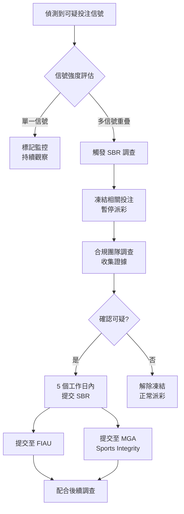

# 06-09 MGA Compliance (Malta Gaming Authority 合規)

**版本**: 1.0.0
**創建日期**: 2026-02-07
**狀態**: ✅ 完整

---

## 概述

Malta Gaming Authority (MGA) 是歐盟最受認可的博彩監管機構之一，提供 B2B 和 B2C 牌照。

### 牌照類型

| 類型 | 說明 | 年費 |
|------|------|------|
| **B2C** | 直接面向玩家 | €25,000 起 |
| **B2B** | 軟體供應商 | €25,000 起 |

---

## 主要合規要求

### 玩家保護

| 要求 | 說明 |
|------|------|
| 自我排除 | 6個月 - 終身 |
| 存款限額 | 日/週/月選項 |
| 冷靜期 | 24小時 - 6週 |
| 現實檢查 | 建議 60 分鐘 |

### KYC/AML

| 階段 | 要求 |
|------|------|
| 註冊 | 基本資料驗證 |
| €2,000 累計存款 | 身份驗證 |
| €10,000 累計存款 | 資金來源驗證 |

### 玩家保護基金

運營商必須為玩家資金提供保護：
- 分離帳戶
- 銀行擔保
- 保險

---

## 技術實現

### MGA 合規服務

```java
@Service
@RequiredArgsConstructor
public class MGAComplianceService {

    /**
     * MGA KYC 階段檢查
     */
    public KYCRequirement checkKYCRequirement(Long playerId) {
        BigDecimal totalDeposits = depositService.getTotalDeposits(playerId);

        if (totalDeposits.compareTo(new BigDecimal("10000")) >= 0) {
            return KYCRequirement.SOURCE_OF_FUNDS;
        } else if (totalDeposits.compareTo(new BigDecimal("2000")) >= 0) {
            return KYCRequirement.IDENTITY_VERIFICATION;
        }
        return KYCRequirement.BASIC;
    }

    /**
     * 生成 MGA 月度報告
     */
    public MGAMonthlyReport generateMonthlyReport(YearMonth month) {
        LocalDateTime startTime = month.atDay(1).atStartOfDay();
        LocalDateTime endTime = month.plusMonths(1).atDay(1).atStartOfDay();

        return MGAMonthlyReport.builder()
            .reportMonth(month)
            .totalPlayers(countTotalPlayers(endTime))
            .newRegistrations(countNewRegistrations(startTime, endTime))
            .selfExclusions(countSelfExclusions(startTime, endTime))
            .grossGamingRevenue(calculateGGR(startTime, endTime))
            .playerLiabilities(calculatePlayerLiabilities(endTime))
            .build();
    }
}
```

---

## 報告要求

| 報告 | 頻率 | 內容 |
|------|------|------|
| 月度報告 | 每月 | 玩家統計、GGR、合規事項 |
| 年度審計 | 每年 | 財務、系統、合規 |
| SAR | 即時 | 可疑活動報告 |
| **SBR** | 即時 | 可疑投注報告（見下節） |

---

## 可疑投注報告 (SBR - Suspicious Betting Report)

### SBR 概述

根據 MGA License Condition 5.3.3，運營商必須向 FIAU 提交可疑投注報告 (Suspicious Betting Report)。這是與傳統 SAR（可疑活動報告）不同的專門針對博彩活動的報告機制。

| 項目 | SAR | SBR |
|------|-----|-----|
| **目的** | 反洗錢/反恐融資 | 比賽操控/詐欺投注 |
| **報告對象** | FIAU | FIAU + MGA Sports Integrity |
| **時限** | 15 個工作日 | **5 個工作日** |
| **觸發場景** | 資金異常 | 投注異常 |

### SBR 觸發條件

#### 體育博彩異常模式

| 信號 | 描述 | 風險等級 |
|------|------|---------|
| **異常投注量** | 單場比賽投注量 > 歷史平均 5 倍 | 🔴 Critical |
| **異常賠率波動** | 賠率變動 > 30% 且無合理新聞事件 | 🔴 Critical |
| **集中投注時間** | 賽前 10 分鐘內集中大量投注 | 🟠 High |
| **關聯帳戶投注** | 多個關聯帳戶同向投注同一結果 | 🟠 High |
| **內幕消息徵兆** | 投注模式與後續比賽結果高度一致 | 🔴 Critical |

#### 電子競技特殊監控

| 信號 | 描述 | 風險等級 |
|------|------|---------|
| **不合常理戰術** | 職業選手出現明顯失誤 | 🟠 High |
| **隊伍表現異常** | 強隊對弱隊異常失利 | 🟠 High |
| **選手關聯投注** | 投注帳戶與選手有設備/IP關聯 | 🔴 Critical |

### SBR 偵測規則

```java
/**
 * 可疑投注偵測服務
 */
@Service
@RequiredArgsConstructor
public class SuspiciousBettingDetector {

    private static final double VOLUME_MULTIPLIER_THRESHOLD = 5.0;
    private static final double ODDS_CHANGE_THRESHOLD = 0.30;

    /**
     * 檢測異常投注量
     */
    public SBRSignal detectAbnormalVolume(Long eventId) {
        BigDecimal currentVolume = bettingService.getEventVolume(eventId);
        BigDecimal historicalAvg = bettingService.getHistoricalAvgVolume(eventId);

        if (historicalAvg.compareTo(BigDecimal.ZERO) > 0) {
            double multiplier = currentVolume.divide(historicalAvg, 2, RoundingMode.HALF_UP)
                .doubleValue();

            if (multiplier >= VOLUME_MULTIPLIER_THRESHOLD) {
                return SBRSignal.builder()
                    .signalType(SBRSignalType.ABNORMAL_VOLUME)
                    .eventId(eventId)
                    .currentValue(currentVolume)
                    .threshold(historicalAvg.multiply(BigDecimal.valueOf(VOLUME_MULTIPLIER_THRESHOLD)))
                    .multiplier(multiplier)
                    .riskLevel(RiskLevel.CRITICAL)
                    .build();
            }
        }
        return null;
    }

    /**
     * 檢測賠率異常波動
     */
    public SBRSignal detectOddsAnomaly(Long eventId, Long marketId) {
        OddsHistory history = oddsService.getOddsHistory(eventId, marketId);

        double maxChange = history.calculateMaxChange();
        if (maxChange >= ODDS_CHANGE_THRESHOLD) {
            // 檢查是否有合理解釋（新聞事件）
            boolean hasNewsEvent = newsService.hasRelevantNews(eventId,
                history.getChangeStartTime(), history.getChangeEndTime());

            if (!hasNewsEvent) {
                return SBRSignal.builder()
                    .signalType(SBRSignalType.ODDS_ANOMALY)
                    .eventId(eventId)
                    .marketId(marketId)
                    .oddsChange(maxChange)
                    .riskLevel(RiskLevel.CRITICAL)
                    .build();
            }
        }
        return null;
    }
}
```

### SBR 報告流程



### SBR 數據庫設計

```sql
CREATE TABLE t_mga_sbr_report (
    id BIGINT PRIMARY KEY AUTO_INCREMENT,
    report_id VARCHAR(50) NOT NULL UNIQUE COMMENT 'SBR 報告 ID',

    -- 事件信息
    event_id BIGINT NOT NULL,
    event_name VARCHAR(200),
    event_type ENUM('SPORTS', 'ESPORTS', 'VIRTUAL') NOT NULL,
    sport_type VARCHAR(50),
    competition_name VARCHAR(200),
    event_date DATETIME,

    -- 可疑信號
    signal_types JSON COMMENT '["ABNORMAL_VOLUME", "ODDS_ANOMALY"]',
    signal_details JSON,
    risk_score INT NOT NULL COMMENT '0-100',

    -- 涉及投注
    affected_bet_count INT DEFAULT 0,
    affected_bet_amount DECIMAL(18,2) DEFAULT 0,
    affected_player_ids JSON,

    -- 報告狀態
    status ENUM(
        'DETECTED',
        'INVESTIGATING',
        'SUBMITTED',
        'CLOSED'
    ) DEFAULT 'DETECTED',

    -- 提交信息
    submitted_to_fiau BOOLEAN DEFAULT FALSE,
    fiau_reference VARCHAR(100),
    submitted_to_mga BOOLEAN DEFAULT FALSE,
    mga_reference VARCHAR(100),
    submitted_at DATETIME,
    submitted_by BIGINT,

    -- 處理動作
    bets_frozen BOOLEAN DEFAULT FALSE,
    bets_voided BOOLEAN DEFAULT FALSE,
    void_reason VARCHAR(500),

    -- 時間追蹤
    detected_at DATETIME NOT NULL DEFAULT CURRENT_TIMESTAMP,
    deadline_at DATETIME COMMENT '5 工作日期限',
    resolved_at DATETIME,

    INDEX idx_event (event_id),
    INDEX idx_status (status, detected_at),
    INDEX idx_deadline (deadline_at, status)
) ENGINE=InnoDB COMMENT='MGA 可疑投注報告';
```

### SBR 監控指標

| 指標 | 計算公式 | 目標值 | 告警閾值 |
|------|---------|--------|---------|
| SBR 及時提交率 | 5日內提交 / 總 SBR | 100% | < 100% |
| 信號偵測準確率 | 確認可疑 / 總偵測 | > 30% | < 15% |
| 平均調查時間 | Avg(提交時間 - 偵測時間) | < 3 天 | > 4 天 |

---

## 玩家資金分離

### MGA 資金保護要求

根據 MGA Gaming Regulations, Part III, Rule 44，運營商必須保護玩家資金：

| 保護方式 | 說明 | 保護程度 |
|---------|------|---------|
| **分離帳戶** | 玩家資金與運營資金分開存放 | ⭐⭐⭐ |
| **銀行擔保** | 銀行提供資金擔保 | ⭐⭐⭐⭐ |
| **保險** | 第三方保險保障 | ⭐⭐⭐⭐⭐ |

### 資金分離實現

```java
/**
 * 玩家資金分離服務
 */
@Service
@RequiredArgsConstructor
public class PlayerFundSegregationService {

    private final SegregatedAccountDao segregatedAccountDao;

    /**
     * 每日資金對賬
     */
    @Scheduled(cron = "0 0 3 * * ?")
    @Transactional(rollbackFor = Throwable.class)
    public void dailyReconciliation() {
        // 1. 計算所有玩家餘額總和
        BigDecimal totalPlayerBalances = playerService.getTotalBalances();

        // 2. 獲取分離帳戶實際餘額
        BigDecimal segregatedBalance = bankingService.getSegregatedAccountBalance();

        // 3. 計算差異
        BigDecimal difference = segregatedBalance.subtract(totalPlayerBalances);

        // 4. 記錄對賬結果
        SegregatedAccountReconciliation reconciliation = SegregatedAccountReconciliation.builder()
            .reconciliationDate(LocalDate.now())
            .playerBalancesTotal(totalPlayerBalances)
            .segregatedAccountBalance(segregatedBalance)
            .difference(difference)
            .status(difference.abs().compareTo(BigDecimal.ONE) < 0 ?
                ReconciliationStatus.MATCHED : ReconciliationStatus.MISMATCH)
            .build();

        segregatedAccountDao.saveReconciliation(reconciliation);

        // 5. 差異告警
        if (reconciliation.getStatus() == ReconciliationStatus.MISMATCH) {
            alertService.sendCriticalAlert(
                "FUND_SEGREGATION_MISMATCH",
                "玩家資金分離帳戶差異: " + difference
            );
        }
    }
}
```

---

## MGA 月度報告自動化

### 報告內容要求

| 項目 | 數據來源 | 計算邏輯 |
|------|---------|---------|
| 活躍玩家數 | t_player | 當月有投注記錄 |
| 新註冊數 | t_player | created_at 在月份內 |
| GGR | t_bet, t_payout | 投注總額 - 派彩總額 |
| 自我排除數 | t_self_exclusion | 當月新增 |
| KYC 完成數 | t_kyc_verification | 當月通過 |

### 自動化報告生成

```java
/**
 * MGA 月度報告生成服務
 */
@Service
@RequiredArgsConstructor
public class MGAMonthlyReportService {

    /**
     * 生成 MGA 月度報告
     */
    @Scheduled(cron = "0 0 6 1 * ?") // 每月 1 日 06:00
    public void generateMonthlyReport() {
        YearMonth lastMonth = YearMonth.now().minusMonths(1);

        MGAMonthlyReport report = MGAMonthlyReport.builder()
            .reportMonth(lastMonth)
            .totalActivePlayers(countActivePlayers(lastMonth))
            .newRegistrations(countNewRegistrations(lastMonth))
            .selfExclusions(countSelfExclusions(lastMonth))
            .kycCompletions(countKycCompletions(lastMonth))
            .grossGamingRevenue(calculateGGR(lastMonth))
            .playerLiabilities(calculatePlayerLiabilities(lastMonth))
            .sbrCount(countSBRReports(lastMonth))
            .sarCount(countSARReports(lastMonth))
            .generatedAt(LocalDateTime.now())
            .build();

        // 保存報告
        reportDao.save(report);

        // 發送給合規團隊審核
        notificationService.notifyComplianceTeam(
            "MGA 月度報告已生成",
            report
        );
    }
}
```

---

## 技術審計要求

MGA 要求定期進行技術審計，確保系統符合監管要求：

| 審計類型 | 頻率 | 內容 |
|---------|------|------|
| RNG 審計 | 初始 + 每年 | 隨機數生成器公平性 |
| 安全審計 | 每年 | 滲透測試、漏洞掃描 |
| 系統審計 | 每年 | 遊戲邏輯、支付系統 |
| 資金審計 | 每年 | 玩家資金分離驗證 |

---

## 與 UKGC 要求對比

| 要求 | MGA | UKGC |
|------|-----|------|
| KYC 觸發 | €2,000 單筆 | £2,000 累計 |
| SAR 時限 | 15 天 | 14 天 |
| SBR 時限 | 5 天 | 5 天 |
| 自我排除 | 6月-終身 | GamStop 強制 |
| 可負擔性 | 建議性 | 強制性 (2025) |
| 信用卡 | 允許 | 禁止 |
| Levy | 無 | 0.1%-1.1% GGR |

---

## 相關文檔

- [06-07_Multi_Jurisdiction_Framework.md](06-07_Multi_Jurisdiction_Framework.md) - 多牌照框架
- [05-03_KYC_AML.md](../05_Risk_Control/05-03_KYC_AML.md) - KYC/AML

---

**返回**: [平台治理](README.md) | [iGaming 首頁](../README.md)
