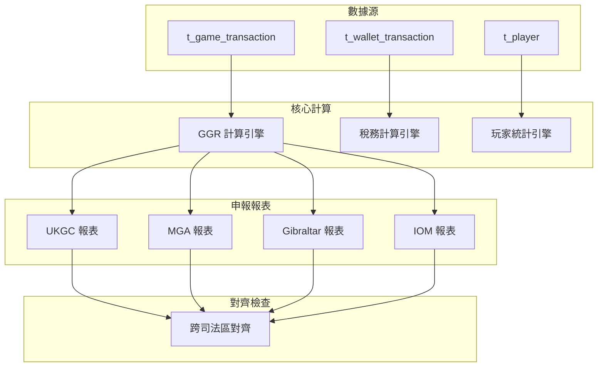

# 06-13 Multi-Jurisdiction Filing Alignment (多司法管轄區申報對齊)

**版本**: 1.0.0
**創建日期**: 2026-02-07
**狀態**: ✅ 規範完成
**優先級**: P2 Medium

---

## 概述

多司法管轄區申報對齊確保向不同監管機構提交的報告數據一致，避免重複或矛盾的申報。

### 適用司法區

| 司法區 | 監管機構 | 主要申報 | 週期 |
|--------|---------|---------|------|
| **UK** | UKGC | RET Levy, GGR, SAR | 月度/季度 |
| **Malta** | MGA | Gaming Tax, SBR | 月度 |
| **Gibraltar** | GFSC | Gambling Duty | 月度 |
| **Isle of Man** | GSC | Duty Return | 月度 |

---

## 對齊架構



---

## 對齊規則

### GGR 計算對齊

| 項目 | UKGC | MGA | Gibraltar | 差異處理 |
|------|------|-----|-----------|---------|
| **計算公式** | Bets - Wins | Bets - Wins | Bets - Wins | 一致 |
| **免費旋轉** | 計入 | 計入 | 計入 | 一致 |
| **獎金成本** | 扣除 | 扣除 | 扣除 | 一致 |
| **貨幣** | GBP | EUR | GBP | 匯率對齊 |
| **申報週期** | 月度 | 月度 | 月度 | 一致 |

### 玩家歸屬

```sql
-- 玩家司法區歸屬 (避免重複計算)
SELECT
    p.id AS player_id,
    p.registration_country,
    CASE
        WHEN p.registration_country = 'GB' THEN 'UKGC'
        WHEN p.registration_country IN ('MT', 'EU_OTHER') THEN 'MGA'
        WHEN p.registration_country = 'GI' THEN 'GIBRALTAR'
        WHEN p.registration_country = 'IM' THEN 'IOM'
        ELSE 'OTHER'
    END AS primary_jurisdiction,
    COUNT(DISTINCT gt.id) AS transaction_count,
    SUM(gt.bet_amount - gt.payout_amount) AS ggr
FROM t_player p
JOIN t_game_transaction gt ON p.id = gt.player_id
WHERE gt.created_at >= DATE_FORMAT(CURDATE() - INTERVAL 1 MONTH, '%Y-%m-01')
  AND gt.created_at < DATE_FORMAT(CURDATE(), '%Y-%m-01')
GROUP BY p.id, p.registration_country;
```

---

## 對齊檢查

```sql
-- 跨司法區 GGR 對齊檢查
WITH jurisdiction_ggr AS (
    SELECT
        CASE
            WHEN p.registration_country = 'GB' THEN 'UKGC'
            WHEN p.registration_country IN ('MT') THEN 'MGA'
            ELSE 'OTHER'
        END AS jurisdiction,
        SUM(gt.bet_amount - gt.payout_amount) AS ggr,
        COUNT(DISTINCT gt.player_id) AS player_count
    FROM t_game_transaction gt
    JOIN t_player p ON gt.player_id = p.id
    WHERE gt.created_at >= DATE_FORMAT(CURDATE() - INTERVAL 1 MONTH, '%Y-%m-01')
      AND gt.created_at < DATE_FORMAT(CURDATE(), '%Y-%m-01')
      AND gt.status = 'SETTLED'
    GROUP BY CASE
        WHEN p.registration_country = 'GB' THEN 'UKGC'
        WHEN p.registration_country IN ('MT') THEN 'MGA'
        ELSE 'OTHER'
    END
)
SELECT
    j.jurisdiction,
    j.ggr AS calculated_ggr,
    j.player_count,
    rf.reported_ggr,
    ABS(j.ggr - rf.reported_ggr) AS variance,
    CASE
        WHEN ABS(j.ggr - rf.reported_ggr) < 1 THEN 'ALIGNED'
        ELSE 'MISALIGNED'
    END AS alignment_status
FROM jurisdiction_ggr j
LEFT JOIN t_regulatory_filing rf ON j.jurisdiction = rf.jurisdiction
    AND rf.filing_period = DATE_FORMAT(CURDATE() - INTERVAL 1 MONTH, '%Y-%m');
```

---

## 監控指標

```yaml
metrics:
  - name: jurisdiction_ggr_alignment_variance
    type: gauge
    description: 跨司法區 GGR 對齊差異
    unit: EUR
    labels: [jurisdiction]
    alert:
      - condition: abs(value) > 100
        severity: warning
        message: "司法區 {jurisdiction} GGR 對齊差異過大"

  - name: jurisdiction_player_overlap
    type: gauge
    description: 跨司法區玩家重複計算數
    target: "0"
    alert:
      - condition: value > 0
        severity: critical
        message: "存在跨司法區重複計算的玩家"

  - name: regulatory_filing_on_time_rate
    type: gauge
    description: 監管申報準時率
    target: "100%"
    labels: [jurisdiction]
```

---

## 相關文檔

- [02-11_GGR_Tax_Reconciliation.md](../02_Finance_Center/02-11_GGR_Tax_Reconciliation.md) - GGR 稅務對帳
- [06-08_UKGC_Compliance.md](06-08_UKGC_Compliance.md) - UKGC 合規
- [06-09_MGA_Compliance.md](06-09_MGA_Compliance.md) - MGA 合規

---

## 版本歷史

| 版本 | 日期 | 變更內容 |
|------|------|---------|
| 1.0.0 | 2026-02-07 | 初始版本：多司法區對齊架構、檢查規則 |

---

**返回**: [平台治理](README.md) | [iGaming 首頁](../README.md)
