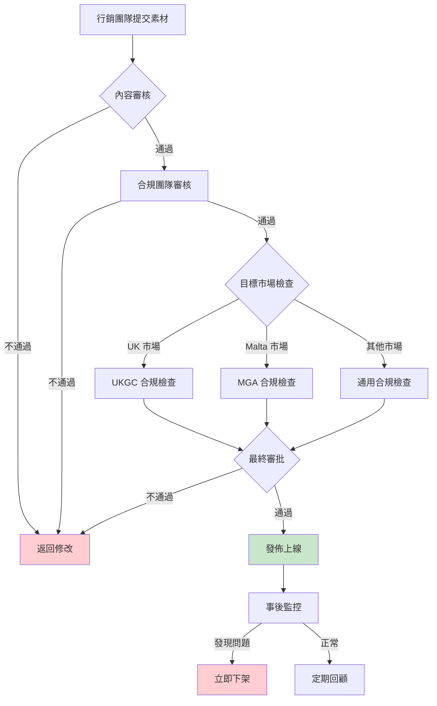
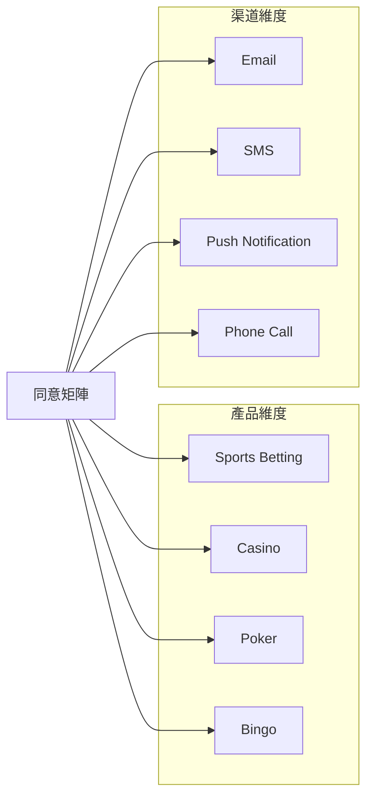
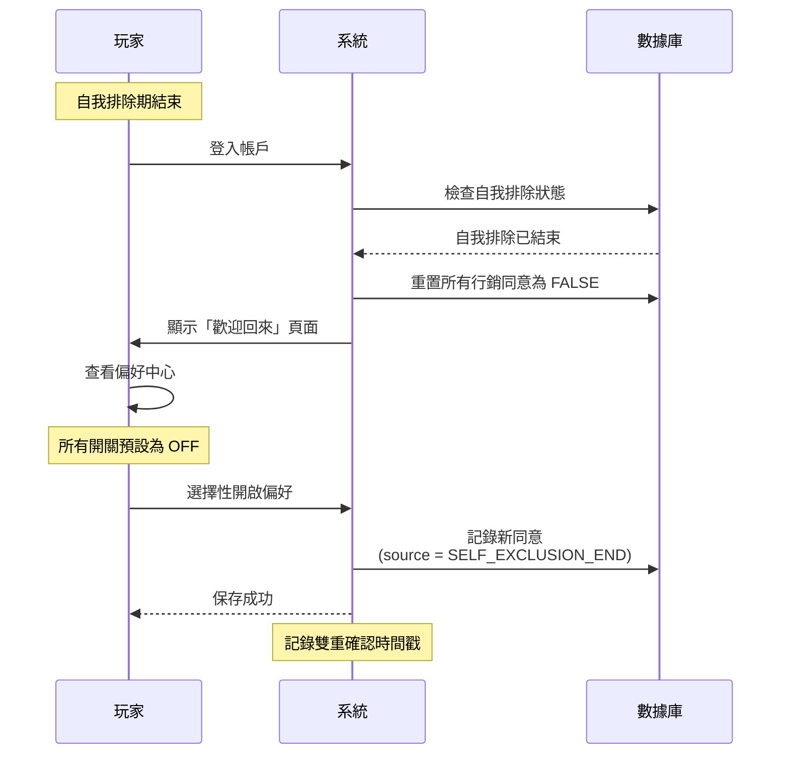

# 11-05 市場行銷合規指南 (Marketing Compliance Guide)

> **版本**: 1.0.0
> **創建日期**: 2026-02-07
> **監管依據**: UKGC LCCP, ASA CAP Code, MGA Player Protection Directive

---

## 1. 概述

本文檔定義 iGaming 平台市場行銷活動的合規要求，確保所有廣告、促銷內容符合 UKGC、MGA 等監管機構的規定。

### 1.1 適用範圍

| 渠道 | 覆蓋內容 |
|------|---------|
| **網站廣告** | Banner、彈窗、落地頁 |
| **郵件行銷** | 促銷郵件、通知郵件 |
| **社交媒體** | Facebook、Twitter、Instagram 廣告 |
| **聯盟行銷** | 第三方推廣連結、內容 |
| **App 推送** | Push 通知、應用內訊息 |

### 1.2 監管要求摘要

| 監管機構 | 核心要求 | 違規後果 |
|---------|---------|---------|
| **UKGC** | LCCP 社會責任條款 + ASA CAP Code | 罰款 + 牌照審查 |
| **MGA** | Player Protection Directive | 罰款 + 牌照暫停 |
| **ASA (UK)** | CAP Code 博彩廣告規則 | 廣告禁令 + 公開譴責 |

---

## 2. 禁止行為清單

### 2.1 絕對禁止 (Zero Tolerance)

| # | 禁止行為 | 監管來源 | 違規等級 |
|---|---------|---------|---------|
| 1 | **針對未成年人廣告** | UKGC LCCP 5.1.1 | 🔴 Critical |
| 2 | **使用未成年人形象** | ASA CAP 16.3.12 | 🔴 Critical |
| 3 | **暗示賭博能解決財務問題** | UKGC LCCP 5.1.6 | 🔴 Critical |
| 4 | **虛假或誤導性贏獎承諾** | ASA CAP 16.3.1 | 🔴 Critical |
| 5 | **淡化賭博風險** | UKGC LCCP 5.1.5 | 🟠 High |
| 6 | **對自我排除玩家行銷** | UKGC LCCP 5.1.10 | 🔴 Critical |
| 7 | **缺少責任賭博標語** | UKGC LCCP 5.1.7 | 🟠 High |

### 2.2 禁止用語清單

```yaml
絕對禁止用語:
  - "保證贏錢"
  - "無風險投注"
  - "輕鬆致富"
  - "穩賺不賠"
  - "改變人生的機會"
  - "解決債務問題"
  - "免費資金" (除非真正無條件)

需謹慎使用:
  - "獎金" → 必須說明流水要求
  - "免費旋轉" → 必須說明條款
  - "限時優惠" → 必須真實有時限
  - "最高可贏" → 必須基於理論 RTP
```

### 2.3 禁止視覺元素

| 元素類型 | 禁止內容 | 替代方案 |
|---------|---------|---------|
| **人物形象** | 未成年人、運動員代言（UK）| 成年人、非名人 |
| **金錢意象** | 大量現金、奢侈品暗示 | 娛樂場景 |
| **成功暗示** | 贏家慶祝、致富故事 | 遊戲體驗展示 |
| **緊迫性** | 倒計時（除非真實）、閃爍元素 | 平靜的 CTA |

---

## 3. 強制要求

### 3.1 責任賭博標語

**UKGC 強制標語位置**:

```yaml
強制顯示位置:
  網站:
    - 首頁 Footer (永久顯示)
    - 所有促銷頁面 (頁面頂部或底部)
    - 存款頁面 (存款按鈕旁)
    - 遊戲啟動前

  郵件:
    - 郵件 Footer (每封)
    - 促銷內容旁

  App:
    - 設定頁面 (可見連結)
    - 促銷推送 (通知內)

標語內容 (UK):
  主標語: "When the fun stops, stop."
  副標語: "BeGambleAware.org | 18+"

  或使用:
  - "Please gamble responsibly"
  - "GambleAware.org"
  - "Gambling can be addictive"
```

### 3.2 年齡驗證聲明

```html
<!-- 強制 18+ 標識 -->
<div class="age-restriction">
  
  <span>This site is for adults only (18+)</span>
</div>

<!-- 位置要求 -->
- 網站 Header 或 Footer (永久可見)
- 所有廣告素材
- App 下載頁面
```

### 3.3 條款透明度

**促銷條款展示規則**:

| 促銷類型 | 必須展示的條款 | 展示位置 |
|---------|--------------|---------|
| **歡迎獎金** | 流水要求、最低存款、有效期 | 促銷頁面 + 註冊流程 |
| **免費旋轉** | 遊戲限制、流水要求、最大贏額 | 領取前確認 |
| **返水** | 計算方式、支付週期、最低門檻 | 活動頁面 |
| **VIP 獎勵** | 資格條件、獎勵價值、有效期 | VIP 頁面 |

---

## 4. 廣告審核流程

### 4.1 審核流程圖



### 4.2 審核清單

```yaml
內容審核清單:
  基礎檢查:
    - [ ] 無未成年人形象
    - [ ] 無虛假贏獎承諾
    - [ ] 無財務問題解決暗示
    - [ ] 無淡化風險用語

  強制元素:
    - [ ] 包含 18+ 標識
    - [ ] 包含責任賭博標語
    - [ ] 包含 T&C 連結
    - [ ] 包含公司名稱與牌照號

  促銷特定:
    - [ ] 流水要求明確標示
    - [ ] 有效期明確標示
    - [ ] 最低/最高限額標示
    - [ ] 排除遊戲說明（如有）

  市場特定 (UK):
    - [ ] 無運動員/名人代言
    - [ ] 無賽事贊助露出（2026 後）
    - [ ] Gamstop 檢查機制
```

### 4.3 審批權限

| 素材類型 | 審核人 | 審批人 | SLA |
|---------|--------|--------|-----|
| Banner/圖片 | 合規專員 | 合規主管 | 24h |
| 郵件模板 | 合規專員 | 合規主管 | 24h |
| 落地頁 | 合規專員 | 合規主管 | 48h |
| 影片廣告 | 合規主管 | MLRO | 72h |
| 聯盟內容 | 合規主管 | MLRO | 48h |

---

## 5. 受眾定向限制

### 5.1 禁止定向人群

```yaml
絕對禁止定向:
  年齡:
    - 未滿 18 歲 (所有市場)
    - 未滿 21 歲 (美國部分州)

  行為:
    - 自我排除玩家 (Gamstop 名單)
    - 冷靜期玩家
    - 設置存款限額玩家 (7 天內)
    - 申請帳戶關閉玩家

  興趣/內容:
    - 兒童內容網站
    - 教育內容網站
    - 財務困難相關內容
    - 成癮康復相關內容
```

### 5.2 行銷偏好管理

```sql
-- 玩家行銷偏好表
CREATE TABLE t_player_marketing_preference (
    id BIGINT PRIMARY KEY AUTO_INCREMENT,
    player_id BIGINT NOT NULL UNIQUE,

    -- 渠道偏好
    email_opt_in BOOLEAN DEFAULT TRUE,
    sms_opt_in BOOLEAN DEFAULT FALSE,
    push_opt_in BOOLEAN DEFAULT TRUE,
    call_opt_in BOOLEAN DEFAULT FALSE,

    -- 內容偏好
    promotional_opt_in BOOLEAN DEFAULT TRUE,
    newsletter_opt_in BOOLEAN DEFAULT TRUE,

    -- 限制標記
    is_self_excluded BOOLEAN DEFAULT FALSE,
    is_cooling_off BOOLEAN DEFAULT FALSE,
    has_deposit_limit BOOLEAN DEFAULT FALSE,

    -- 時間
    last_opt_in_date DATETIME,
    last_opt_out_date DATETIME,
    created_at DATETIME DEFAULT CURRENT_TIMESTAMP,
    updated_at DATETIME DEFAULT CURRENT_TIMESTAMP ON UPDATE CURRENT_TIMESTAMP,

    INDEX idx_player_id (player_id),
    INDEX idx_self_excluded (is_self_excluded)
) COMMENT '玩家行銷偏好';

-- 行銷排除檢查查詢
SELECT p.id, p.email
FROM t_player p
JOIN t_player_marketing_preference pmp ON p.id = pmp.player_id
WHERE pmp.email_opt_in = TRUE
  AND pmp.promotional_opt_in = TRUE
  AND pmp.is_self_excluded = FALSE
  AND pmp.is_cooling_off = FALSE
  AND NOT EXISTS (
    SELECT 1 FROM t_gamstop_check gc
    WHERE gc.player_id = p.id
    AND gc.is_excluded = TRUE
  );
```

---

## 6. 聯盟行銷合規

### 6.1 聯盟合約要求

| 條款 | 要求 | 違規後果 |
|------|------|---------|
| **合規責任** | 聯盟需遵守營運商合規要求 | 終止合約 |
| **內容審核權** | 營運商有權審核所有推廣內容 | 扣押佣金 |
| **禁止行為** | 明確禁止虛假承諾、未成年人定向 | 終止合約 + 法律追究 |
| **標識要求** | 必須標示廣告性質 | 警告 → 終止 |

### 6.2 聯盟內容監控

```yaml
監控頻率:
  新聯盟: 每日檢查（前 30 天）
  活躍聯盟: 每週檢查
  高風險聯盟: 每日檢查

監控內容:
  - 落地頁內容
  - 社交媒體貼文
  - 郵件模板
  - 搜索引擎廣告

自動化檢測:
  - 關鍵詞掃描（禁止用語）
  - 圖片 AI 分析（年齡檢測）
  - 連結追蹤（目標頁面合規）
```

---

## 7. 違規處理

### 7.1 內部違規處理

| 違規等級 | 處理流程 | 時限 |
|---------|---------|------|
| 🔴 Critical | 立即下架 + 調查 + 報告監管 | 1h |
| 🟠 High | 24h 內下架 + 調查 | 24h |
| 🟡 Medium | 7 天內修正 | 7d |
| 🟢 Low | 下次更新時修正 | 30d |

### 7.2 監管報告要求

```yaml
UKGC 報告要求:
  重大違規:
    時限: 5 個工作日內
    內容:
      - 違規描述
      - 受影響玩家數量
      - 已採取的補救措施
      - 防止再發生的措施

  年度報告:
    內容:
      - 廣告投訴統計
      - 合規培訓記錄
      - 政策更新記錄
```

---

## 8. 監控與報告

### 8.1 關鍵指標

| 指標 | 計算方式 | 告警閾值 |
|------|---------|---------|
| **廣告投訴率** | 投訴數 / 廣告曝光數 | > 0.01% |
| **內容修改率** | 被拒素材數 / 提交素材數 | > 20% |
| **聯盟違規率** | 違規聯盟數 / 活躍聯盟數 | > 5% |
| **排除名單命中率** | 被阻止發送數 / 計劃發送數 | 監控趨勢 |

### 8.2 月度報告

```sql
-- 月度行銷合規報告
SELECT
    DATE_FORMAT(created_at, '%Y-%m') AS report_month,
    COUNT(*) AS total_campaigns,
    SUM(CASE WHEN status = 'APPROVED' THEN 1 ELSE 0 END) AS approved,
    SUM(CASE WHEN status = 'REJECTED' THEN 1 ELSE 0 END) AS rejected,
    SUM(CASE WHEN status = 'MODIFIED' THEN 1 ELSE 0 END) AS modified,
    ROUND(SUM(CASE WHEN status = 'REJECTED' THEN 1 ELSE 0 END) * 100.0 / COUNT(*), 2) AS rejection_rate
FROM t_marketing_campaign_review
WHERE created_at >= DATE_SUB(CURDATE(), INTERVAL 12 MONTH)
GROUP BY DATE_FORMAT(created_at, '%Y-%m')
ORDER BY report_month DESC;
```

---

## 9. 培訓要求

### 9.1 強制培訓

| 角色 | 培訓內容 | 頻率 |
|------|---------|------|
| 行銷團隊 | 完整合規培訓 | 入職 + 年度 |
| 合規團隊 | 監管更新培訓 | 季度 |
| 聯盟經理 | 聯盟合規培訓 | 入職 + 年度 |
| 管理層 | 概覽培訓 | 年度 |

### 9.2 培訓記錄

```sql
CREATE TABLE t_compliance_training_record (
    id BIGINT PRIMARY KEY AUTO_INCREMENT,
    employee_id BIGINT NOT NULL,
    training_type VARCHAR(100) NOT NULL,
    training_date DATE NOT NULL,
    passed BOOLEAN DEFAULT FALSE,
    score DECIMAL(5,2),
    certificate_url VARCHAR(500),
    expiry_date DATE,
    created_at DATETIME DEFAULT CURRENT_TIMESTAMP,

    INDEX idx_employee_id (employee_id),
    INDEX idx_expiry_date (expiry_date)
) COMMENT '合規培訓記錄';
```

---

## 📚 相關文檔

- [06-08 UKGC Compliance](../06_Platform_Governance/06-08_UKGC_Compliance.md) - UK 監管合規
- [15-01 Self Exclusion](../15_Responsible_Gambling/15-01_Self_Exclusion.md) - 自我排除機制
- [01-01 Player Lifecycle](../01_Player_Center/01-01_Player_Lifecycle.md) - 玩家生命週期

---

## 10. 行銷同意控制 (LCCP 5.1.12) 🆕

> **監管依據**: UKGC LCCP 5.1.12
> **生效日期**: 2025-01-17
> **要求**: 運營商必須提供產品級 + 渠道級的細粒度行銷同意控制

### 10.1 同意控制架構

UKGC 要求玩家能夠獨立控制以下兩個維度的行銷偏好：



### 10.2 產品級同意

| 產品類型 | 說明 | 同意選項 |
|---------|------|---------|
| **SPORTS** | 體育博彩促銷 | 獨立開關 |
| **CASINO** | 賭場遊戲促銷 | 獨立開關 |
| **POKER** | 撲克牌室促銷 | 獨立開關 |
| **BINGO** | 賓果遊戲促銷 | 獨立開關 |
| **ALL** | 全部產品（快捷選項）| 全開/全關 |

### 10.3 渠道級同意

| 渠道類型 | 說明 | 同意選項 | 合規要求 |
|---------|------|---------|---------|
| **EMAIL** | 電子郵件 | 獨立開關 | 必須有退訂連結 |
| **SMS** | 短信 | 獨立開關 | 必須有 STOP 指令 |
| **PUSH** | App 推送通知 | 獨立開關 | 必須可在設定中關閉 |
| **PHONE** | 電話行銷 | 獨立開關 | 需遵守 TPS 名單 |

### 10.4 同意矩陣數據庫設計

```sql
-- 玩家行銷同意矩陣表（產品×渠道）
CREATE TABLE t_player_marketing_consent (
    id BIGINT PRIMARY KEY AUTO_INCREMENT,
    player_id BIGINT NOT NULL COMMENT '玩家 ID',

    -- 產品維度
    product_type ENUM('SPORTS', 'CASINO', 'POKER', 'BINGO', 'ALL') NOT NULL COMMENT '產品類型',

    -- 渠道維度
    channel_type ENUM('EMAIL', 'SMS', 'PUSH', 'PHONE', 'ALL') NOT NULL COMMENT '渠道類型',

    -- 同意狀態
    consent_status BOOLEAN NOT NULL DEFAULT FALSE COMMENT '同意狀態',
    consent_date DATETIME COMMENT '同意日期',

    -- 同意來源（審計用）
    consent_source ENUM(
        'REGISTRATION',       -- 註冊時選擇
        'PREFERENCE_CENTER',  -- 偏好中心修改
        'API',                -- API 調用
        'SUPPORT',            -- 客服協助
        'SELF_EXCLUSION_END'  -- 自我排除結束後重新選擇
    ) NOT NULL COMMENT '同意來源',

    -- 元數據
    ip_address VARCHAR(45) COMMENT 'IP 地址',
    user_agent VARCHAR(500) COMMENT '用戶代理',
    device_fingerprint VARCHAR(100) COMMENT '設備指紋',

    -- 審計
    created_at DATETIME NOT NULL DEFAULT CURRENT_TIMESTAMP,
    updated_at DATETIME ON UPDATE CURRENT_TIMESTAMP,

    -- 約束
    UNIQUE KEY uk_player_product_channel (player_id, product_type, channel_type),
    INDEX idx_player_id (player_id),
    INDEX idx_consent_date (consent_date),
    INDEX idx_consent_source (consent_source)
) ENGINE=InnoDB COMMENT='玩家行銷同意矩陣（LCCP 5.1.12）';

-- 同意變更審計日誌（7 年保留）
CREATE TABLE t_marketing_consent_audit (
    id BIGINT PRIMARY KEY AUTO_INCREMENT,
    player_id BIGINT NOT NULL,
    product_type VARCHAR(20) NOT NULL,
    channel_type VARCHAR(20) NOT NULL,

    -- 變更詳情
    old_status BOOLEAN,
    new_status BOOLEAN NOT NULL,
    change_reason VARCHAR(200),

    -- 變更來源
    changed_by_type ENUM('PLAYER', 'SYSTEM', 'SUPPORT') NOT NULL,
    changed_by_id BIGINT COMMENT '變更者 ID（SUPPORT 時為客服 ID）',

    -- 元數據
    ip_address VARCHAR(45),
    user_agent VARCHAR(500),

    -- 時間
    changed_at DATETIME NOT NULL DEFAULT CURRENT_TIMESTAMP,

    -- 索引
    INDEX idx_player_changed (player_id, changed_at),
    INDEX idx_changed_at (changed_at)
) ENGINE=InnoDB COMMENT='行銷同意變更審計日誌（7 年保留）';

-- 初始化時批量創建同意記錄
INSERT INTO t_player_marketing_consent (player_id, product_type, channel_type, consent_status, consent_source)
SELECT
    p.id,
    prod.product_type,
    chan.channel_type,
    FALSE,
    'REGISTRATION'
FROM t_player p
CROSS JOIN (
    SELECT 'SPORTS' AS product_type
    UNION SELECT 'CASINO'
    UNION SELECT 'POKER'
    UNION SELECT 'BINGO'
) prod
CROSS JOIN (
    SELECT 'EMAIL' AS channel_type
    UNION SELECT 'SMS'
    UNION SELECT 'PUSH'
    UNION SELECT 'PHONE'
) chan
WHERE p.created_at >= '2025-01-17';  -- LCCP 5.1.12 生效日期
```

### 10.5 偏好中心 API

```java
/**
 * 行銷同意控制 API (LCCP 5.1.12)
 */
@RestController
@RequestMapping("/api/v1/player/marketing-consent")
@RequiredArgsConstructor
public class MarketingConsentController {

    private final MarketingConsentService service;

    /**
     * 獲取玩家完整同意矩陣
     */
    @GetMapping
    @SaCheckLogin
    public ResponseDTO<MarketingConsentMatrixVO> getConsentMatrix() {
        Long playerId = StpUtil.getLoginIdAsLong();
        return ResponseDTO.ok(service.getConsentMatrix(playerId));
    }

    /**
     * 批量更新同意狀態
     */
    @PutMapping
    @SaCheckLogin
    public ResponseDTO<Void> updateConsent(
            @RequestBody @Valid MarketingConsentUpdateForm form,
            HttpServletRequest request) {
        Long playerId = StpUtil.getLoginIdAsLong();
        service.updateConsent(playerId, form, getMetadata(request));
        return ResponseDTO.ok();
    }

    /**
     * 一鍵全關（退出所有行銷）
     */
    @PostMapping("/opt-out-all")
    @SaCheckLogin
    public ResponseDTO<Void> optOutAll(HttpServletRequest request) {
        Long playerId = StpUtil.getLoginIdAsLong();
        service.optOutAll(playerId, getMetadata(request));
        return ResponseDTO.ok();
    }
}

@Data
public class MarketingConsentUpdateForm {
    @NotNull
    private List<ConsentItem> consents;

    @Data
    public static class ConsentItem {
        @NotNull
        private ProductType productType;
        @NotNull
        private ChannelType channelType;
        @NotNull
        private Boolean consent;
    }
}

@Data
@Builder
public class MarketingConsentMatrixVO {
    private Map<ProductType, Map<ChannelType, Boolean>> matrix;
    private LocalDateTime lastUpdated;
    private Boolean hasActiveConsent;
}
```

### 10.6 偏好中心 UI 規格

```vue
<template>
  <div class="marketing-preferences">
    <h2>Marketing Preferences</h2>
    <p class="description">
      Control what marketing communications you receive.
      You can update these preferences at any time.
    </p>

    <!-- 快捷操作 -->
    <div class="quick-actions">
      <a-button @click="selectAll">Enable All</a-button>
      <a-button type="danger" @click="deselectAll">Disable All</a-button>
    </div>

    <!-- 同意矩陣 -->
    <table class="consent-matrix">
      <thead>
        <tr>
          <th></th>
          <th v-for="channel in channels" :key="channel.value">
            {{ channel.label }}
          </th>
        </tr>
      </thead>
      <tbody>
        <tr v-for="product in products" :key="product.value">
          <td>{{ product.label }}</td>
          <td v-for="channel in channels" :key="channel.value">
            <a-switch
              v-model:checked="matrix[product.value][channel.value]"
              @change="onConsentChange(product.value, channel.value)"
            />
          </td>
        </tr>
      </tbody>
    </table>

    <!-- 保存按鈕 -->
    <a-button type="primary" @click="savePreferences" :loading="saving">
      Save Preferences
    </a-button>

    <!-- 法律聲明 -->
    <p class="legal-notice">
      By enabling marketing preferences, you agree to receive promotional
      communications. You can unsubscribe at any time. For more information,
      see our <a href="/privacy">Privacy Policy</a>.
    </p>
  </div>
</template>
```

### 10.7 雙重確認（自我排除後重新啟用）

當玩家從自我排除狀態返回時，必須重新明確選擇行銷偏好：



```java
/**
 * 自我排除結束處理
 */
@Service
@RequiredArgsConstructor
public class SelfExclusionEndHandler {

    private final MarketingConsentService consentService;

    @EventListener
    public void onSelfExclusionEnd(SelfExclusionEndEvent event) {
        Long playerId = event.getPlayerId();

        // 1. 重置所有行銷同意為 FALSE
        consentService.resetAllConsent(playerId, ConsentSource.SELF_EXCLUSION_END);

        // 2. 記錄審計日誌
        consentService.logAudit(playerId, "ALL", "ALL",
            true, false, "Self-exclusion ended - consent reset");

        // 3. 設置強制偏好確認標記
        playerService.setForcePreferenceConfirm(playerId, true);
    }
}
```

### 10.8 審計軌跡要求

```yaml
審計日誌要求:
  保留期限: 7 年（符合 UKGC 和 GDPR 要求）

  記錄內容:
    - 玩家 ID
    - 產品類型
    - 渠道類型
    - 舊狀態 → 新狀態
    - 變更來源（玩家/系統/客服）
    - IP 地址
    - 用戶代理
    - 時間戳

  合規報告:
    - 月度同意變更統計
    - 渠道偏好分布
    - 退訂率趨勢
    - 自我排除後重新啟用率
```

### 10.9 CRM 系統整合

```java
/**
 * CRM 系統整合服務
 * 在發送行銷訊息前檢查同意狀態
 */
@Service
@RequiredArgsConstructor
public class MarketingCampaignService {

    private final MarketingConsentService consentService;

    /**
     * 過濾符合同意條件的玩家
     */
    public List<Long> filterEligiblePlayers(
            List<Long> playerIds,
            ProductType product,
            ChannelType channel) {

        return playerIds.stream()
            .filter(playerId -> {
                // 1. 檢查基礎同意
                if (!consentService.hasConsent(playerId, product, channel)) {
                    return false;
                }
                // 2. 檢查自我排除狀態
                if (selfExclusionService.isExcluded(playerId)) {
                    return false;
                }
                // 3. 檢查冷靜期
                if (coolingOffService.isInCoolingOff(playerId)) {
                    return false;
                }
                return true;
            })
            .collect(Collectors.toList());
    }
}
```

### 10.10 監控指標

| 指標 | 計算公式 | 目標值 | 告警閾值 |
|------|---------|--------|---------|
| **同意率** | 有同意玩家 / 總玩家 | > 30% | < 20% |
| **退訂率** | 月度退訂數 / 月度活躍玩家 | < 5% | > 10% |
| **偏好完成率** | 設置偏好玩家 / 新註冊玩家 | > 80% | < 60% |
| **雙重確認率** | 自排結束後重新同意 / 自排結束總數 | 監控 | - |

---

**文檔版本**: 1.1.0
**最後更新**: 2026-02-07
**維護團隊**: Marketing + Compliance Team

## 變更日誌

| 版本 | 日期 | 變更內容 | 變更者 |
|------|------|---------|--------|
| 1.1.0 | 2026-02-07 | 新增第 10 章：行銷同意控制 (LCCP 5.1.12) | Claude Code |
| 1.0.0 | 2026-02-07 | 初始版本 | Claude Code |
