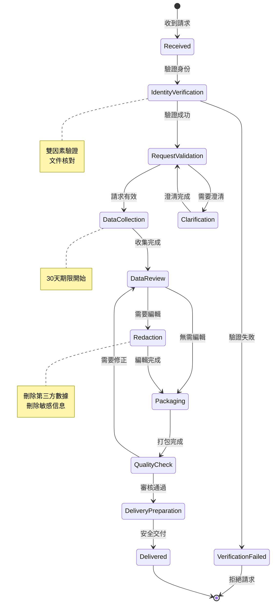

# 12-07 數據可攜權與主體訪問請求 (Data Portability & SAR)

## 文檔信息

| 屬性 | 值 |
|------|-----|
| **文檔版本** | 1.0.0 |
| **最後更新** | 2026-02-07 |
| **維護團隊** | Legal & Backend Team |
| **合規要求** | GDPR Article 15/20, UK GDPR, CCPA |

**前置依賴**:
- [12-01 安全架構](./12-01_Security_Architecture.md) - 安全基礎架構
- [06-08 UKGC 合規](../06_Platform_Governance/06-08_UKGC_Compliance.md) - UK 監管要求
- [01-02 玩家帳戶](../01_Player_Center/01-02_Player_Account_Service.md) - 帳戶數據結構

---

## 執行摘要

數據可攜權 (Data Portability) 和主體訪問請求 (Subject Access Request, SAR) 是 GDPR 賦予數據主體的核心權利。iGaming 平台必須在法定期限內響應這些請求。

### 法規要求

| 法規 | 條款 | 響應期限 | 說明 |
|------|------|---------|------|
| **GDPR Art. 15** | 訪問權 | 30 天 | 可延長至 90 天（複雜請求）|
| **GDPR Art. 20** | 可攜權 | 30 天 | 機器可讀格式 |
| **UK GDPR** | 同上 | 30 天 | 英國適用 |
| **CCPA** | 知情權 | 45 天 | 加州適用 |

### 請求類型

| 類型 | 代碼 | 說明 |
|------|------|------|
| **訪問請求** (SAR) | ACCESS | 獲取個人數據副本 |
| **可攜請求** | PORTABILITY | 機器可讀格式導出 |
| **刪除請求** | ERASURE | 被遺忘權 (Art. 17) |
| **更正請求** | RECTIFICATION | 更正不準確數據 |
| **限制處理** | RESTRICTION | 暫停數據處理 |

---

## 1. SAR 處理流程

### 1.1 流程圖



### 1.2 處理步驟

```yaml
SAR 處理流程:

  1. 接收請求:
     渠道:
       - 網站表單 (推薦)
       - 電子郵件
       - 客服系統
     記錄:
       - 請求時間 (SLA 計時開始)
       - 請求類型
       - 請求範圍

  2. 身份驗證:
     標準驗證:
       - 帳戶郵箱確認
       - 已綁定手機 OTP
     增強驗證 (敏感請求):
       - 政府身份證明
       - 近期交易驗證問題
     驗證時限: 5 個工作日

  3. 請求評估:
     判斷:
       - 請求是否明確
       - 是否需要澄清範圍
       - 是否屬於例外情況
     例外情況:
       - 明顯無根據或過度請求
       - 重複請求 (12個月內)
       - 影響他人權利

  4. 數據收集:
     數據源:
       - 核心數據庫 (PostgreSQL)
       - 日誌系統 (Elasticsearch)
       - 第三方系統 (遊戲供應商)
       - 備份系統
     時限: 15 個工作日

  5. 數據審核:
     編輯內容:
       - 他人個人數據
       - 商業機密
       - 法律特權信息
       - 正在進行的調查信息

  6. 打包交付:
     格式:
       - JSON (機器可讀)
       - PDF (人類可讀)
       - CSV (表格數據)
     加密: AES-256
     交付: 安全下載鏈接 (7天有效)
```

---

## 2. 數據導出範圍

### 2.1 必須導出的數據

```yaml
玩家個人數據:

  帳戶信息:
    - 用戶名、郵箱、手機
    - 姓名、出生日期
    - 地址
    - 帳戶創建時間
    - 最後登入時間

  KYC 數據:
    - 驗證狀態
    - 驗證時間
    - 已提交文件類型 (不含原始文件)

  財務數據:
    - 存款歷史 (金額、時間、方式)
    - 提款歷史 (金額、時間、方式)
    - 餘額快照

  遊戲數據:
    - 投注歷史 (遊戲、金額、結果)
    - 獎金歷史
    - 遊戲時間統計

  負責任博彩:
    - 存款限額設定
    - 自我排除歷史
    - 冷靜期設定
    - 現實檢查設定

  通訊記錄:
    - 客服對話
    - 系統通知
    - 促銷郵件 (選擇退出狀態)

  設備/技術數據:
    - 登入歷史 (IP、設備、位置)
    - Cookie 同意記錄
```

### 2.2 不得導出的數據

```yaml
排除數據:

  他人數據:
    - 其他玩家信息
    - 客服人員姓名 (可用 ID 替代)

  商業機密:
    - 風控規則配置
    - 欺詐檢測分數
    - 內部調查筆記

  法律保護:
    - 正在進行的法律程序
    - AML 調查詳情
    - 監管通報

  技術限制:
    - 聚合/匿名化數據
    - 已刪除數據 (超過保留期)
```

---

## 3. 技術實現

### 3.1 SAR 服務架構

```java
/**
 * SAR 請求服務
 * SmartAdmin 架構: Service 層
 */
@Service
@RequiredArgsConstructor
@Slf4j
public class SarRequestService {

    private final SarRequestDao sarRequestDao;
    private final SarDataCollectorManager sarDataCollectorManager;
    private final PlayerService playerService;

    /**
     * 提交 SAR 請求
     */
    public ResponseDTO<SarRequestVO> submitRequest(SarRequestForm form) {
        // 1. 驗證玩家身份
        return playerService.getById(form.getPlayerId())
            .map(player -> {
                // 2. 檢查重複請求
                if (hasRecentRequest(player.getId(), 30)) {
                    return ResponseDTO.error(UserErrorCode.SAR_REQUEST_TOO_FREQUENT,
                        "您最近 30 天內已提交過請求");
                }

                // 3. 創建請求
                SarRequestEntity request = SarRequestEntity.builder()
                    .playerId(player.getId())
                    .requestType(form.getRequestType())
                    .requestScope(form.getRequestScope())
                    .status(SarStatus.PENDING_VERIFICATION)
                    .submittedAt(LocalDateTime.now())
                    .deadlineAt(LocalDateTime.now().plusDays(30))
                    .build();

                sarRequestDao.insert(request);

                // 4. 觸發身份驗證
                triggerIdentityVerification(player, request);

                return ResponseDTO.ok(toVO(request));
            })
            .getOrElse(() -> ResponseDTO.error(UserErrorCode.PLAYER_NOT_FOUND));
    }

    /**
     * 處理已驗證的請求
     */
    @Async
    public void processVerifiedRequest(Long requestId) {
        SarRequestEntity request = sarRequestDao.selectById(requestId);

        try {
            // 1. 更新狀態
            request.setStatus(SarStatus.DATA_COLLECTION);
            sarRequestDao.updateById(request);

            // 2. 收集數據
            SarDataPackage dataPackage = sarDataCollectorManager
                .collectPlayerData(request.getPlayerId(), request.getRequestScope());

            // 3. 編輯敏感數據
            SarDataPackage redactedPackage = redactSensitiveData(dataPackage);

            // 4. 生成導出文件
            SarExportResult export = generateExportFiles(redactedPackage);

            // 5. 更新請求
            request.setStatus(SarStatus.READY_FOR_DELIVERY);
            request.setExportFileId(export.getFileId());
            request.setCompletedAt(LocalDateTime.now());
            sarRequestDao.updateById(request);

            // 6. 通知玩家
            notifyPlayer(request);

        } catch (Exception e) {
            log.error("SAR processing failed for request: {}", requestId, e);
            request.setStatus(SarStatus.FAILED);
            request.setErrorMessage(e.getMessage());
            sarRequestDao.updateById(request);

            // 告警
            alertService.sendAlert(AlertType.SAR_PROCESSING_FAILED,
                "SAR 請求處理失敗: " + requestId);
        }
    }
}
```

### 3.2 數據收集器

```java
/**
 * SAR 數據收集 Manager
 * SmartAdmin 架構: Manager 層 (涉及多數據源事務)
 */
@Component
@RequiredArgsConstructor
@Slf4j
public class SarDataCollectorManager {

    private final PlayerDao playerDao;
    private final TransactionDao transactionDao;
    private final BetHistoryDao betHistoryDao;
    private final CustomerSupportDao customerSupportDao;
    private final LoginHistoryDao loginHistoryDao;
    private final ResponsibleGamblingDao responsibleGamblingDao;

    /**
     * 收集玩家所有數據
     */
    @Transactional(readOnly = true)
    public SarDataPackage collectPlayerData(Long playerId, SarScope scope) {
        SarDataPackage.Builder builder = SarDataPackage.builder()
            .playerId(playerId)
            .collectedAt(LocalDateTime.now());

        // 1. 帳戶信息 (必須)
        PlayerEntity player = playerDao.selectById(playerId);
        builder.accountInfo(buildAccountInfo(player));

        // 2. 財務數據
        if (scope.includesFinancial()) {
            List<TransactionEntity> transactions = transactionDao
                .selectByPlayerId(playerId);
            builder.financialData(buildFinancialData(transactions));
        }

        // 3. 遊戲數據
        if (scope.includesGaming()) {
            List<BetHistoryEntity> bets = betHistoryDao
                .selectByPlayerId(playerId);
            builder.gamingData(buildGamingData(bets));
        }

        // 4. 客服記錄
        if (scope.includesSupport()) {
            List<SupportTicketEntity> tickets = customerSupportDao
                .selectByPlayerId(playerId);
            builder.supportData(buildSupportData(tickets));
        }

        // 5. 登入歷史
        if (scope.includesTechnical()) {
            List<LoginHistoryEntity> logins = loginHistoryDao
                .selectByPlayerId(playerId);
            builder.technicalData(buildTechnicalData(logins));
        }

        // 6. 負責任博彩設定
        if (scope.includesResponsibleGambling()) {
            ResponsibleGamblingSettings settings = responsibleGamblingDao
                .selectByPlayerId(playerId);
            builder.responsibleGamblingData(buildRGData(settings));
        }

        return builder.build();
    }

    private AccountInfo buildAccountInfo(PlayerEntity player) {
        return AccountInfo.builder()
            .username(player.getUsername())
            .email(player.getEmail())
            .phone(maskPhone(player.getPhone()))  // 部分遮罩
            .fullName(player.getFullName())
            .dateOfBirth(player.getDateOfBirth())
            .address(player.getAddress())
            .registeredAt(player.getCreatedAt())
            .lastLoginAt(player.getLastLoginAt())
            .kycStatus(player.getKycStatus())
            .kycVerifiedAt(player.getKycVerifiedAt())
            .build();
    }
}
```

### 3.3 導出格式

```json
// SAR 導出 JSON 格式示例
{
  "exportInfo": {
    "generatedAt": "2026-02-07T10:30:00Z",
    "requestId": "SAR-2026-00123",
    "playerId": "PLY-12345678",
    "dataRangeStart": "2024-01-01T00:00:00Z",
    "dataRangeEnd": "2026-02-07T00:00:00Z"
  },
  "accountInfo": {
    "username": "player123",
    "email": "player@example.com",
    "phone": "+886-9XX-XXX-123",
    "fullName": "張三",
    "dateOfBirth": "1990-01-15",
    "address": {
      "line1": "台北市信義區xxx路",
      "city": "台北市",
      "postalCode": "110"
    },
    "registeredAt": "2024-03-15T08:30:00Z",
    "lastLoginAt": "2026-02-06T22:15:00Z",
    "kycStatus": "VERIFIED",
    "kycVerifiedAt": "2024-03-16T10:00:00Z"
  },
  "financialData": {
    "totalDeposits": 50000.00,
    "totalWithdrawals": 35000.00,
    "currentBalance": 8500.00,
    "transactions": [
      {
        "id": "TXN-001",
        "type": "DEPOSIT",
        "amount": 1000.00,
        "currency": "TWD",
        "method": "CREDIT_CARD",
        "status": "COMPLETED",
        "timestamp": "2024-03-20T14:30:00Z"
      }
    ]
  },
  "gamingData": {
    "totalBets": 1250,
    "totalWagered": 125000.00,
    "totalWon": 118000.00,
    "netResult": -7000.00,
    "bets": [
      {
        "id": "BET-001",
        "game": "Slot - Fortune Tiger",
        "provider": "PG Soft",
        "betAmount": 10.00,
        "winAmount": 25.00,
        "timestamp": "2024-03-21T15:45:00Z"
      }
    ]
  },
  "responsibleGambling": {
    "depositLimits": {
      "daily": 1000.00,
      "weekly": 5000.00,
      "monthly": 15000.00
    },
    "selfExclusionHistory": [],
    "realityCheckInterval": 60,
    "sessionTimeLimit": null
  },
  "loginHistory": [
    {
      "timestamp": "2026-02-06T22:15:00Z",
      "ipAddress": "203.xxx.xxx.xxx",
      "device": "iPhone 15 Pro",
      "location": "Taiwan, Taipei",
      "status": "SUCCESS"
    }
  ]
}
```

---

## 4. 數據可攜權 (Portability)

### 4.1 格式要求

```yaml
GDPR Art. 20 格式要求:

  機器可讀格式:
    推薦格式:
      - JSON (結構化數據)
      - CSV (表格數據)
      - XML (兼容性)
    不推薦:
      - PDF (非機器可讀)
      - 圖片 (需 OCR)

  可互操作性:
    - 使用通用數據結構
    - 包含數據字典/Schema
    - 提供格式說明文檔

  完整性:
    - 所有「主動提供」的數據
    - 所有「觀察到」的數據
    - 排除「推斷」的數據 (風控評分等)
```

### 4.2 傳輸請求處理

```java
/**
 * 數據可攜傳輸服務
 */
@Service
@RequiredArgsConstructor
public class DataPortabilityService {

    /**
     * 直接傳輸給第三方
     * GDPR Art. 20(2): 有權要求直接傳輸
     */
    public ResponseDTO<Void> transferToThirdParty(
            Long requestId,
            ThirdPartyTransferForm form) {

        // 1. 驗證接收方
        if (!validateRecipient(form.getRecipientUrl())) {
            return ResponseDTO.error(UserErrorCode.INVALID_RECIPIENT);
        }

        // 2. 獲取數據包
        SarDataPackage dataPackage = sarRequestDao
            .getDataPackage(requestId);

        // 3. 轉換為標準格式
        PortableDataFormat portableData = convertToPortableFormat(dataPackage);

        // 4. 安全傳輸
        try {
            HttpHeaders headers = new HttpHeaders();
            headers.setContentType(MediaType.APPLICATION_JSON);
            headers.set("X-Data-Portability-Request", requestId.toString());
            headers.set("X-Source-Platform", "SmartAdmin iGaming");

            RestTemplate restTemplate = new RestTemplate();
            ResponseEntity<Void> response = restTemplate.postForEntity(
                form.getRecipientUrl(),
                new HttpEntity<>(portableData, headers),
                Void.class
            );

            if (response.getStatusCode().is2xxSuccessful()) {
                // 記錄傳輸成功
                logTransferSuccess(requestId, form.getRecipientUrl());
                return ResponseDTO.ok();
            } else {
                return ResponseDTO.error(UserErrorCode.TRANSFER_FAILED);
            }

        } catch (Exception e) {
            log.error("Data portability transfer failed", e);
            return ResponseDTO.error(UserErrorCode.TRANSFER_FAILED);
        }
    }

    /**
     * 技術不可行時的處理
     */
    private boolean validateRecipient(String recipientUrl) {
        // 1. 驗證 URL 格式
        // 2. 驗證 HTTPS
        // 3. 檢查接收方是否支持標準格式
        // 4. 驗證接收方安全證書
        return true; // 簡化示例
    }
}
```

---

## 5. 請求管理後台

### 5.1 API 設計

```java
/**
 * SAR 管理 Controller
 */
@RestController
@RequestMapping("/admin/sar")
@RequiredArgsConstructor
public class SarAdminController {

    private final SarRequestService sarRequestService;

    /**
     * 分頁查詢 SAR 請求
     */
    @PostMapping("/query")
    @SaCheckPermission("sar:request:query")
    public ResponseDTO<PageResult<SarRequestVO>> queryRequests(
            @RequestBody @Valid SarQueryForm form) {
        return sarRequestService.pageQuery(form);
    }

    /**
     * 獲取請求詳情
     */
    @GetMapping("/{requestId}")
    @SaCheckPermission("sar:request:query")
    public ResponseDTO<SarRequestDetailVO> getRequestDetail(
            @PathVariable Long requestId) {
        return sarRequestService.getDetail(requestId);
    }

    /**
     * 批准延期
     */
    @PostMapping("/{requestId}/extend")
    @SaCheckPermission("sar:request:extend")
    public ResponseDTO<Void> extendDeadline(
            @PathVariable Long requestId,
            @RequestBody @Valid ExtendDeadlineForm form) {
        return sarRequestService.extendDeadline(requestId, form);
    }

    /**
     * 標記為已交付
     */
    @PostMapping("/{requestId}/deliver")
    @SaCheckPermission("sar:request:deliver")
    public ResponseDTO<Void> markDelivered(
            @PathVariable Long requestId) {
        return sarRequestService.markDelivered(requestId);
    }

    /**
     * 拒絕請求
     */
    @PostMapping("/{requestId}/reject")
    @SaCheckPermission("sar:request:reject")
    public ResponseDTO<Void> rejectRequest(
            @PathVariable Long requestId,
            @RequestBody @Valid RejectRequestForm form) {
        return sarRequestService.rejectRequest(requestId, form);
    }

    /**
     * SAR 儀表板統計
     */
    @GetMapping("/dashboard")
    @SaCheckPermission("sar:dashboard:view")
    public ResponseDTO<SarDashboardVO> getDashboard() {
        return sarRequestService.getDashboardStats();
    }
}
```

### 5.2 儀表板指標

| 指標 | 說明 | 告警閾值 |
|------|------|---------|
| `sar_pending_count` | 待處理請求數 | >10 |
| `sar_overdue_count` | 超期請求數 | >0 |
| `sar_avg_processing_days` | 平均處理天數 | >20 |
| `sar_completion_rate` | 完成率 | <95% |

---

## 6. 數據表結構

```sql
-- SAR 請求表
CREATE TABLE t_sar_request (
    id                  BIGINT PRIMARY KEY,
    player_id           BIGINT NOT NULL,
    request_type        VARCHAR(32) NOT NULL,  -- ACCESS, PORTABILITY, ERASURE, RECTIFICATION, RESTRICTION
    request_scope       JSONB NOT NULL,
    status              VARCHAR(32) NOT NULL,
    submitted_at        TIMESTAMP NOT NULL,
    verified_at         TIMESTAMP,
    deadline_at         TIMESTAMP NOT NULL,
    extended_deadline   TIMESTAMP,
    extension_reason    TEXT,
    completed_at        TIMESTAMP,
    delivered_at        TIMESTAMP,
    rejected_at         TIMESTAMP,
    rejection_reason    TEXT,
    export_file_id      VARCHAR(64),
    error_message       TEXT,
    created_at          TIMESTAMP DEFAULT CURRENT_TIMESTAMP,
    updated_at          TIMESTAMP DEFAULT CURRENT_TIMESTAMP,

    INDEX idx_player_request (player_id, submitted_at DESC),
    INDEX idx_status_deadline (status, deadline_at)
);

-- SAR 數據導出文件表
CREATE TABLE t_sar_export_file (
    id                  BIGINT PRIMARY KEY,
    request_id          BIGINT NOT NULL REFERENCES t_sar_request(id),
    file_type           VARCHAR(32) NOT NULL,  -- JSON, CSV, PDF
    file_path           VARCHAR(512) NOT NULL,
    file_size           BIGINT NOT NULL,
    checksum            VARCHAR(64) NOT NULL,
    encryption_key_id   VARCHAR(64) NOT NULL,
    download_url        VARCHAR(512),
    url_expires_at      TIMESTAMP,
    downloaded_at       TIMESTAMP,
    created_at          TIMESTAMP DEFAULT CURRENT_TIMESTAMP,

    INDEX idx_request_file (request_id)
);

-- SAR 處理日誌
CREATE TABLE t_sar_processing_log (
    id                  BIGINT PRIMARY KEY,
    request_id          BIGINT NOT NULL REFERENCES t_sar_request(id),
    action              VARCHAR(64) NOT NULL,
    actor_id            BIGINT,
    actor_type          VARCHAR(32),  -- SYSTEM, ADMIN, PLAYER
    details             JSONB,
    created_at          TIMESTAMP DEFAULT CURRENT_TIMESTAMP,

    INDEX idx_request_log (request_id, created_at)
);
```

---

## 7. 監控與合規報告

### 7.1 月度報告

```yaml
SAR 月度報告內容:

  統計摘要:
    - 收到請求總數
    - 完成請求數
    - 拒絕請求數
    - 平均處理天數
    - 超期請求數

  請求類型分布:
    - ACCESS: xx%
    - PORTABILITY: xx%
    - ERASURE: xx%
    - 其他: xx%

  處理時效:
    - 7天內完成: xx%
    - 14天內完成: xx%
    - 30天內完成: xx%
    - 需延期: xx%

  改進建議:
    - 識別瓶頸環節
    - 自動化建議
```

### 7.2 審計追蹤

所有 SAR 處理操作均記錄審計日誌，包括：
- 請求提交
- 身份驗證結果
- 數據收集開始/完成
- 編輯操作
- 文件生成
- 交付通知
- 下載記錄

---

## 變更日誌

### v1.0.0 (2026-02-07)

**初始版本**:
- SAR 處理流程設計
- 數據導出範圍定義
- 數據可攜權實現
- 管理後台 API
- 監控與報告

---

## 相關文檔

- [12-01 安全架構](./12-01_Security_Architecture.md) - 安全基礎
- [06-08 UKGC 合規](../06_Platform_Governance/06-08_UKGC_Compliance.md) - UK 監管
- [05-03 KYC/AML](../05_Risk_Control/05-03_KYC_AML.md) - 身份驗證
- [01-04 休眠帳戶](../01_Player_Center/01-04_Dormant_Account_Management.md) - 帳戶管理

---

**返回**: [系統安全](README.md) | [iGaming 首頁](../README.md)
