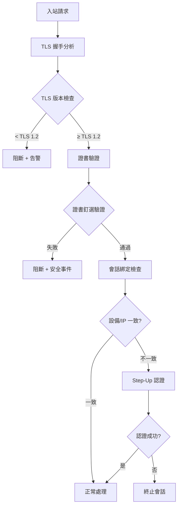

# 12-08 MITM Detection (中間人攻擊偵測)

**版本**: 1.0.0
**創建日期**: 2026-02-07
**狀態**: ✅ 完整
**維護團隊**: Security Team

**前置依賴**:
- [12-03 數據安全標準](./12-03_Data_Security_Standard.md) - 加密策略 (§1)
- [12-05 UK RTS 安全](./12-05_UK_RTS_Security.md) - 強客戶認證 (§2)
- [05-02-06 帳戶接管偵測](../05_Risk_Control/05-02-06_Account_Takeover_Detection.md) - 會話安全 (§4)

---

## 🎯 執行摘要

中間人攻擊 (Man-in-the-Middle, MITM) 是 iGaming 平台面臨的嚴重安全威脅。攻擊者通過攔截用戶與平台之間的通信，竊取敏感信息（如登入憑證、支付數據）或篡改交易。

本文檔定義 SmartAdmin iGaming 平台的 MITM 攻擊偵測與防護機制。

### 核心能力

| 能力 | 說明 | 偵測延遲 |
|------|------|---------|
| **TLS 降級偵測** | 檢測強制 TLS 版本降級攻擊 | 實時 |
| **證書釘選驗證** | 驗證服務器證書合法性 | 實時 |
| **會話劫持偵測** | 識別會話令牌被竊取 | 準實時 (<1s) |
| **DNS 欺騙偵測** | 檢測 DNS 解析異常 | 實時 |
| **代理注入偵測** | 識別惡意代理攔截 | 實時 |

---

## 1. MITM 攻擊類型

### 1.1 常見攻擊向量

| 攻擊類型 | 說明 | 嚴重性 |
|---------|------|--------|
| **TLS 降級攻擊** | 強制使用弱加密協議 | 🔴 Critical |
| **SSL Stripping** | 將 HTTPS 降級為 HTTP | 🔴 Critical |
| **證書偽造** | 使用偽造 CA 證書 | 🔴 Critical |
| **DNS 欺騙** | 篡改 DNS 解析結果 | 🟠 High |
| **ARP 欺騙** | 局域網內攔截流量 | 🟠 High |
| **代理注入** | 注入惡意透明代理 | 🟠 High |

### 1.2 攻擊後果

| 後果 | 對玩家影響 | 對平台影響 |
|------|-----------|-----------|
| **憑證竊取** | 帳戶被盜 | ATO 事件、賠償責任 |
| **支付攔截** | 資金損失 | 支付詐欺、信任危機 |
| **數據洩露** | 個人資料曝光 | GDPR 違規、罰款 |
| **交易篡改** | 投注/提款被篡改 | 財務損失、監管問題 |

---

## 2. 偵測機制

### 2.1 TLS 配置強化

```java
/**
 * TLS 安全配置
 */
@Configuration
public class TLSSecurityConfig {

    /**
     * 強制 TLS 1.3
     */
    @Bean
    public WebServerFactoryCustomizer<TomcatServletWebServerFactory> tlsCustomizer() {
        return factory -> factory.addConnectorCustomizers(connector -> {
            if (connector.getProtocolHandler() instanceof Http11NioProtocol) {
                Http11NioProtocol protocol = (Http11NioProtocol) connector.getProtocolHandler();

                // 僅允許 TLS 1.3 和 TLS 1.2
                protocol.setSSLProtocol("TLSv1.3,TLSv1.2");

                // 禁用弱加密套件
                protocol.setCiphers(
                    "TLS_AES_256_GCM_SHA384," +
                    "TLS_CHACHA20_POLY1305_SHA256," +
                    "TLS_AES_128_GCM_SHA256," +
                    "ECDHE-RSA-AES256-GCM-SHA384," +
                    "ECDHE-RSA-AES128-GCM-SHA256"
                );

                // 禁用 SSL 壓縮 (防 CRIME 攻擊)
                protocol.setCompression("off");
            }
        });
    }
}
```

### 2.2 證書釘選 (Certificate Pinning)

```java
/**
 * 證書釘選驗證服務
 */
@Service
@RequiredArgsConstructor
@Slf4j
public class CertificatePinningService {

    // 預期的公鑰 Hash 列表 (SPKI Hash)
    private static final Set<String> PINNED_HASHES = Set.of(
        "sha256/AAAAAAAAAAAAAAAAAAAAAAAAAAAAAAAAAAAAAAAAAAA=", // 主證書
        "sha256/BBBBBBBBBBBBBBBBBBBBBBBBBBBBBBBBBBBBBBBBBBB="  // 備用證書
    );

    /**
     * 驗證證書是否匹配釘選
     */
    public boolean verifyCertificatePin(X509Certificate certificate) {
        try {
            // 計算公鑰的 SHA-256 Hash
            byte[] publicKeyBytes = certificate.getPublicKey().getEncoded();
            MessageDigest digest = MessageDigest.getInstance("SHA-256");
            byte[] hash = digest.digest(publicKeyBytes);
            String base64Hash = "sha256/" + Base64.getEncoder().encodeToString(hash);

            boolean valid = PINNED_HASHES.contains(base64Hash);

            if (!valid) {
                log.warn("Certificate pinning validation failed. Hash: {}", base64Hash);
                securityEventService.logCertificatePinningFailure(base64Hash);
            }

            return valid;
        } catch (NoSuchAlgorithmException e) {
            log.error("Certificate pinning verification error", e);
            return false;
        }
    }
}
```

### 2.3 會話綁定

```java
/**
 * 會話綁定偵測服務
 * 檢測會話令牌是否在不同設備/IP 上使用
 */
@Service
@RequiredArgsConstructor
public class SessionBindingDetector {

    /**
     * 驗證會話綁定
     */
    public SessionBindingResult validateSessionBinding(
            String sessionId,
            String currentFingerprint,
            String currentIp) {

        SessionBinding binding = sessionBindingDao.findBySessionId(sessionId);

        if (binding == null) {
            // 新會話 - 創建綁定
            createSessionBinding(sessionId, currentFingerprint, currentIp);
            return SessionBindingResult.valid();
        }

        List<String> violations = new ArrayList<>();

        // 1. 設備指紋檢查
        if (!binding.getDeviceFingerprint().equals(currentFingerprint)) {
            violations.add("DEVICE_MISMATCH");
        }

        // 2. IP 子網檢查 (允許同子網變化)
        if (!isSameSubnet(binding.getIpAddress(), currentIp)) {
            // 檢查是否為不可能的旅行
            if (isImpossibleTravel(binding.getLastActiveAt(), binding.getIpAddress(), currentIp)) {
                violations.add("IMPOSSIBLE_TRAVEL");
            } else {
                violations.add("IP_CHANGE");
            }
        }

        if (!violations.isEmpty()) {
            return SessionBindingResult.builder()
                .valid(false)
                .violations(violations)
                .riskLevel(determineRiskLevel(violations))
                .build();
        }

        return SessionBindingResult.valid();
    }

    private RiskLevel determineRiskLevel(List<String> violations) {
        if (violations.contains("DEVICE_MISMATCH") && violations.contains("IMPOSSIBLE_TRAVEL")) {
            return RiskLevel.CRITICAL; // 可能是 MITM 攻擊
        }
        if (violations.contains("DEVICE_MISMATCH")) {
            return RiskLevel.HIGH;
        }
        return RiskLevel.MEDIUM;
    }
}
```

### 2.4 代理偵測

```java
/**
 * 代理/VPN 偵測服務
 */
@Service
@RequiredArgsConstructor
public class ProxyDetectionService {

    /**
     * 檢測是否通過代理
     */
    public ProxyDetectionResult detectProxy(HttpServletRequest request) {
        List<String> signals = new ArrayList<>();

        // 1. 檢查代理相關 Header
        String[] proxyHeaders = {
            "X-Forwarded-For",
            "Via",
            "Proxy-Connection",
            "X-Real-IP",
            "Forwarded"
        };

        for (String header : proxyHeaders) {
            if (StringUtils.hasText(request.getHeader(header))) {
                signals.add("PROXY_HEADER:" + header);
            }
        }

        // 2. 檢查已知代理/VPN IP
        String clientIp = getClientIp(request);
        if (knownProxyService.isKnownProxy(clientIp)) {
            signals.add("KNOWN_PROXY_IP");
        }

        // 3. 檢查數據中心 IP
        if (ipInfoService.isDatacenterIp(clientIp)) {
            signals.add("DATACENTER_IP");
        }

        // 4. 時區與 IP 地理位置不符
        String browserTimezone = request.getHeader("X-Timezone");
        String ipTimezone = geoService.getTimezone(clientIp);
        if (browserTimezone != null && !browserTimezone.equals(ipTimezone)) {
            signals.add("TIMEZONE_MISMATCH");
        }

        return ProxyDetectionResult.builder()
            .proxyDetected(!signals.isEmpty())
            .signals(signals)
            .riskLevel(calculateRiskLevel(signals))
            .build();
    }
}
```

---

## 3. 實時監控

### 3.1 異常流量偵測



### 3.2 告警規則

| 告警類型 | 觸發條件 | 嚴重性 | 響應動作 |
|---------|---------|--------|---------|
| **TLS 降級嘗試** | 檢測到 TLS 1.0/1.1 請求 | 🔴 Critical | 阻斷 + 記錄 |
| **證書釘選失敗** | 證書不匹配釘選列表 | 🔴 Critical | 阻斷 + 調查 |
| **會話劫持** | 設備 + IP 同時變更 | 🔴 Critical | 終止會話 |
| **可疑代理** | 多個代理信號 | 🟠 High | Step-Up 認證 |
| **DNS 異常** | 解析結果不一致 | 🟠 High | 驗證 + 記錄 |

---

## 4. 數據庫設計

### 4.1 MITM 事件表

```sql
CREATE TABLE t_mitm_detection_event (
    id BIGINT PRIMARY KEY AUTO_INCREMENT,
    event_id VARCHAR(50) NOT NULL UNIQUE,

    -- 請求信息
    session_id VARCHAR(100),
    player_id BIGINT,
    client_ip VARCHAR(45) NOT NULL,
    user_agent VARCHAR(500),

    -- 偵測類型
    detection_type ENUM(
        'TLS_DOWNGRADE',
        'CERTIFICATE_PIN_FAILURE',
        'SESSION_HIJACK',
        'PROXY_DETECTED',
        'DNS_SPOOFING'
    ) NOT NULL,

    -- 偵測詳情
    detection_signals JSON,
    risk_score INT NOT NULL,
    risk_level ENUM('LOW', 'MEDIUM', 'HIGH', 'CRITICAL') NOT NULL,

    -- 響應動作
    action_taken ENUM('LOG', 'STEP_UP', 'BLOCK', 'TERMINATE_SESSION') NOT NULL,
    action_result ENUM('SUCCESS', 'FAILURE'),

    -- TLS 信息
    tls_version VARCHAR(20),
    cipher_suite VARCHAR(100),
    certificate_hash VARCHAR(100),

    -- 會話綁定信息
    expected_device VARCHAR(100),
    actual_device VARCHAR(100),
    expected_ip VARCHAR(45),
    actual_ip VARCHAR(45),

    -- 時間
    detected_at DATETIME NOT NULL DEFAULT CURRENT_TIMESTAMP,

    INDEX idx_player (player_id, detected_at),
    INDEX idx_detection_type (detection_type, detected_at),
    INDEX idx_risk_level (risk_level, detected_at)
) ENGINE=InnoDB COMMENT='MITM 偵測事件';
```

### 4.2 會話綁定表

```sql
CREATE TABLE t_session_binding (
    id BIGINT PRIMARY KEY AUTO_INCREMENT,
    session_id VARCHAR(100) NOT NULL UNIQUE,
    player_id BIGINT NOT NULL,

    -- 綁定信息
    device_fingerprint VARCHAR(100) NOT NULL,
    ip_address VARCHAR(45) NOT NULL,
    ip_subnet VARCHAR(45),
    geo_country VARCHAR(2),
    geo_city VARCHAR(100),

    -- 統計
    request_count INT DEFAULT 1,
    last_active_at DATETIME DEFAULT CURRENT_TIMESTAMP,

    -- 生命週期
    created_at DATETIME DEFAULT CURRENT_TIMESTAMP,
    expires_at DATETIME NOT NULL,

    INDEX idx_player (player_id),
    INDEX idx_expires (expires_at)
) ENGINE=InnoDB COMMENT='會話綁定';
```

---

## 5. 監控指標

### 5.1 Prometheus 指標

```yaml
mitm_detection_total:
  type: counter
  labels: [detection_type, action_taken, risk_level]
  description: "MITM 偵測事件總數"

tls_handshake_version:
  type: counter
  labels: [version]
  description: "TLS 握手版本分佈"

session_binding_violation:
  type: counter
  labels: [violation_type]
  description: "會話綁定違規統計"

certificate_pinning_result:
  type: counter
  labels: [result]
  description: "證書釘選驗證結果"
```

### 5.2 關鍵 KPI

| 指標 | 計算公式 | 目標值 | 告警閾值 |
|------|---------|--------|---------|
| TLS 1.3 採用率 | TLS 1.3 請求 / 總請求 | > 90% | < 80% |
| 證書釘選失敗率 | 失敗 / 總驗證 | < 0.01% | > 0.1% |
| 會話劫持偵測數 | 每日 CRITICAL 事件 | < 5 | > 20 |
| 代理偵測率 | 代理請求 / 總請求 | 監控 | 異常增加 |

---

## 6. 變更日誌

| 版本 | 日期 | 變更內容 | 變更者 |
|------|------|---------|--------|
| 1.0.0 | 2026-02-07 | 初始版本，實現 MITM 偵測核心能力 | Claude Code |

---

## 7. 相關文檔

- [12-03 數據安全標準](./12-03_Data_Security_Standard.md) - 加密策略
- [12-05 UK RTS 安全](./12-05_UK_RTS_Security.md) - 強客戶認證
- [05-02-06 帳戶接管偵測](../05_Risk_Control/05-02-06_Account_Takeover_Detection.md) - 會話安全

---

**返回**: [12_System_Security](README.md) | [iGaming 首頁](../README.md)
