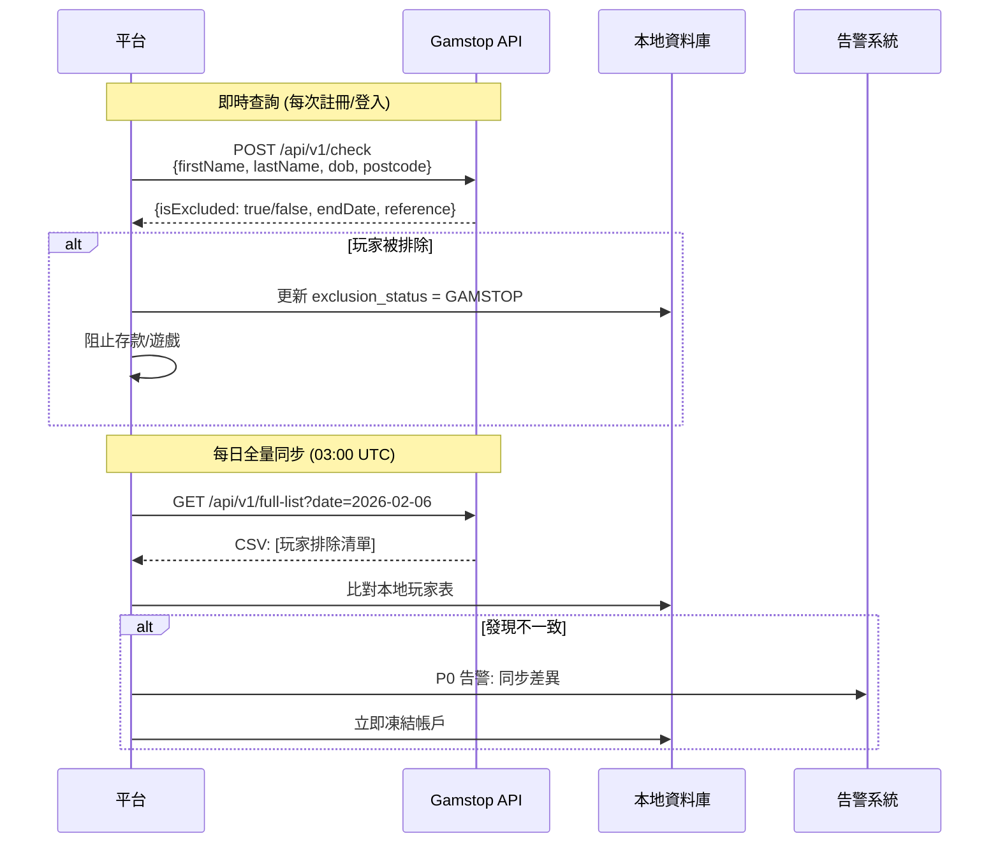
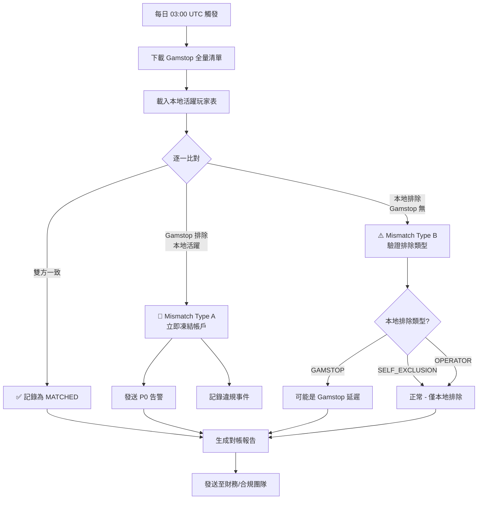
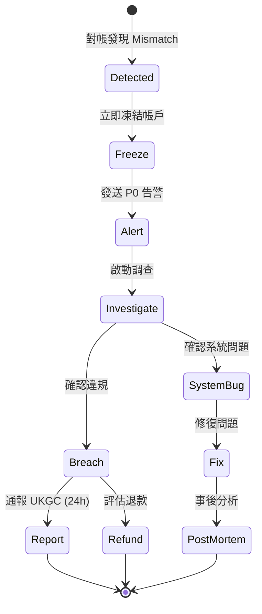

# 15-09 自我排除同步對帳 (Self-Exclusion Sync Reconciliation)

**版本**: 1.0.0
**創建日期**: 2026-02-07
**狀態**: P0 - 監管合規必要

---

## 1. 概述

自我排除同步對帳確保平台與國家/地區排除資料庫（如 Gamstop、MGA Self-Ban）保持同步，防止被排除玩家繞過限制進入平台。

### 1.1 對帳目的

- **合規保障**: 確保符合 UKGC SR 3.5.1 等監管要求
- **玩家保護**: 防止問題博彩玩家繞過排除機制
- **風險管理**: 及時識別同步異常，避免違規處罰

### 1.2 監管要求

| 監管機構 | 條款 | 同步要求 | 違規後果 |
|---------|------|---------|---------|
| **UKGC** | SR 3.5.1 | 必須整合 Gamstop，24 小時內同步 | 牌照暫停/撤銷 |
| **MGA** | PDP Art. 9 | 必須維護排除名單 | 罰款最高 €50,000 |
| **Netherlands** | CRUKS | 必須整合 CRUKS 資料庫 | 牌照暫停 |
| **Sweden** | Spelpaus | 必須整合 Spelpaus | 營運禁令 |

---

## 2. 外部排除系統

### 2.1 系統對照

| 系統 | 地區 | 同步方式 | 同步頻率 | API 類型 |
|------|------|---------|---------|---------|
| **Gamstop** | UK | Real-time + Daily Batch | 實時 + 每日 03:00 UTC | REST API |
| **MGA Self-Ban** | Malta | Daily Batch | 每日 SFTP | SFTP/CSV |
| **CRUKS** | Netherlands | Real-time | 實時查詢 | REST API |
| **Spelpaus** | Sweden | Real-time | 實時查詢 | REST API |
| **ROFUS** | Denmark | Real-time | 實時查詢 | SOAP |

### 2.2 Gamstop 整合規範



---

## 3. 對帳流程

### 3.1 三層對帳架構

| 層級 | 時機 | 機制 | 目的 |
|------|------|------|------|
| **Layer 1** | 玩家操作時 | 即時 API 查詢 | 即時阻斷 |
| **Layer 2** | 每日 03:00 | 全量清單比對 | 補漏檢查 |
| **Layer 3** | 每週一 | 統計報告 + 審計 | 合規證明 |

### 3.2 每日對帳流程



### 3.3 對帳 SQL

```sql
-- 每日 Gamstop 同步對帳
WITH gamstop_list AS (
    SELECT player_reference, exclusion_end_date, last_sync_at
    FROM t_gamstop_exclusion_list
    WHERE sync_date = CURDATE()
),
local_players AS (
    SELECT
        p.id AS player_id,
        p.gamstop_reference,
        ps.self_excluded,
        ps.exclusion_type,
        ps.exclusion_end_time
    FROM t_player p
    LEFT JOIN t_player_protection_settings ps ON p.id = ps.player_id
    WHERE p.jurisdiction = 'UKGC'
      AND p.status = 'ACTIVE'
)

SELECT
    lp.player_id,
    lp.gamstop_reference,
    CASE
        WHEN gl.player_reference IS NOT NULL AND lp.self_excluded = FALSE THEN 'MISMATCH_A_BLOCK_REQUIRED'
        WHEN gl.player_reference IS NULL AND lp.exclusion_type = 'GAMSTOP' THEN 'MISMATCH_B_VERIFY_NEEDED'
        WHEN gl.player_reference IS NOT NULL AND lp.self_excluded = TRUE THEN 'MATCHED'
        WHEN gl.player_reference IS NULL AND lp.exclusion_type != 'GAMSTOP' THEN 'LOCAL_ONLY_OK'
        ELSE 'NO_EXCLUSION'
    END AS reconciliation_status,
    gl.exclusion_end_date AS gamstop_end_date,
    lp.exclusion_end_time AS local_end_date
FROM local_players lp
LEFT JOIN gamstop_list gl ON lp.gamstop_reference = gl.player_reference;
```

---

## 4. 異常處理

### 4.1 異常類型

| 類型 | 說明 | 風險等級 | 處理方式 |
|------|------|---------|---------|
| **Type A** | Gamstop 排除，本地未封鎖 | 🔴 Critical | 立即凍結 + P0 告警 |
| **Type B** | 本地 Gamstop 排除，Gamstop 查無 | 🟡 Warning | 驗證排除來源 |
| **Type C** | 排除結束日期不一致 | 🟢 Info | 以 Gamstop 為準更新 |
| **Type D** | API 連線失敗 | 🟡 Warning | 重試 3 次 + 告警 |

### 4.2 Type A 處理流程

**場景**: Gamstop 顯示玩家已排除，但平台帳戶仍為活躍狀態



### 4.3 違規通報要求

| 監管機構 | 通報時限 | 通報方式 | 必要內容 |
|---------|---------|---------|---------|
| **UKGC** | 24 小時 | Key Event Report | 玩家詳情、違規時間、補救措施 |
| **MGA** | 48 小時 | Incident Report | 影響範圍、根因分析 |

---

## 5. 數據結構

### 5.1 同步記錄表

```sql
CREATE TABLE t_gamstop_sync_log (
    id                  BIGINT PRIMARY KEY AUTO_INCREMENT,
    sync_type           VARCHAR(20) NOT NULL,  -- REALTIME, DAILY_BATCH
    sync_date           DATE NOT NULL,

    -- 同步統計
    total_records       INT NOT NULL,
    matched_count       INT NOT NULL DEFAULT 0,
    mismatch_a_count    INT NOT NULL DEFAULT 0,  -- Gamstop 有，本地無
    mismatch_b_count    INT NOT NULL DEFAULT 0,  -- 本地有，Gamstop 無

    -- 狀態
    status              VARCHAR(20) NOT NULL,  -- SUCCESS, PARTIAL, FAILED
    error_message       TEXT,

    -- 時間
    started_at          DATETIME NOT NULL,
    completed_at        DATETIME,

    created_at          DATETIME DEFAULT CURRENT_TIMESTAMP,

    INDEX idx_sync_date (sync_date),
    INDEX idx_status (status)
);

CREATE TABLE t_gamstop_reconciliation_discrepancy (
    id                  BIGINT PRIMARY KEY AUTO_INCREMENT,
    sync_log_id         BIGINT NOT NULL,
    player_id           BIGINT NOT NULL,

    -- 差異詳情
    discrepancy_type    VARCHAR(20) NOT NULL,  -- MISMATCH_A, MISMATCH_B, DATE_DIFF
    gamstop_status      VARCHAR(20),
    local_status        VARCHAR(20),
    gamstop_end_date    DATE,
    local_end_date      DATE,

    -- 處理狀態
    resolution_status   VARCHAR(20) DEFAULT 'PENDING',  -- PENDING, RESOLVED, ESCALATED
    resolution_action   VARCHAR(100),
    resolved_by         VARCHAR(100),
    resolved_at         DATETIME,

    -- 違規報告
    incident_reported   BOOLEAN DEFAULT FALSE,
    incident_reference  VARCHAR(100),

    created_at          DATETIME DEFAULT CURRENT_TIMESTAMP,
    updated_at          DATETIME DEFAULT CURRENT_TIMESTAMP ON UPDATE CURRENT_TIMESTAMP,

    INDEX idx_player_id (player_id),
    INDEX idx_discrepancy_type (discrepancy_type),
    INDEX idx_resolution_status (resolution_status)
);
```

### 5.2 對帳報告表

```sql
CREATE TABLE t_gamstop_reconciliation_report (
    id                  BIGINT PRIMARY KEY AUTO_INCREMENT,
    report_date         DATE NOT NULL,
    jurisdiction        VARCHAR(20) NOT NULL DEFAULT 'UKGC',

    -- 統計數據
    total_uk_players        INT NOT NULL,
    gamstop_excluded_count  INT NOT NULL,
    local_excluded_count    INT NOT NULL,
    match_rate              DECIMAL(5,2) NOT NULL,

    -- 差異統計
    new_discrepancies       INT NOT NULL DEFAULT 0,
    resolved_discrepancies  INT NOT NULL DEFAULT 0,
    pending_discrepancies   INT NOT NULL DEFAULT 0,

    -- 報告狀態
    generated_at            DATETIME NOT NULL,
    reviewed_by             VARCHAR(100),
    reviewed_at             DATETIME,

    created_at              DATETIME DEFAULT CURRENT_TIMESTAMP,

    UNIQUE KEY uk_report_date_jurisdiction (report_date, jurisdiction)
);
```

---

## 6. 監控與告警

### 6.1 關鍵指標

| 指標 | Prometheus 名稱 | 告警閾值 |
|------|----------------|---------|
| 每日差異數 | `gamstop_reconciliation_discrepancies_total` | > 0 (Type A) |
| 同步失敗率 | `gamstop_sync_failure_rate` | > 1% |
| 同步延遲 | `gamstop_sync_latency_seconds` | > 300s |
| 未處理差異 | `gamstop_pending_discrepancies_gauge` | > 0 (超過 24h) |

### 6.2 告警規則

```yaml
alerts:
  - name: gamstop_mismatch_type_a
    condition: gamstop_reconciliation_discrepancies_total{type="MISMATCH_A"} > 0
    severity: CRITICAL
    notify: pagerduty:compliance-oncall, email:cro@company.com, sms:compliance-team
    message: "CRITICAL: Gamstop 排除玩家在平台仍為活躍狀態，需立即處理"

  - name: gamstop_sync_failure
    condition: gamstop_sync_failure_rate > 0.01
    severity: WARNING
    notify: slack:#compliance-ops

  - name: gamstop_discrepancy_unresolved
    condition: gamstop_pending_discrepancies_gauge > 0 and time() - gamstop_discrepancy_created_at > 86400
    severity: WARNING
    notify: slack:#compliance-ops, email:compliance-team@company.com
```

---

## 7. 合規報告

### 7.1 UKGC 月度報告內容

| 欄位 | 說明 |
|------|------|
| **Total UK Players** | UK 管轄區活躍玩家數 |
| **Gamstop Checks Performed** | 當月 Gamstop 查詢次數 |
| **Exclusions Detected** | 檢測到的排除玩家數 |
| **Sync Success Rate** | 同步成功率 |
| **Discrepancies Found** | 發現的差異數 |
| **Discrepancies Resolved** | 已解決的差異數 |
| **Incident Reports Filed** | 已提交的違規報告數 |

### 7.2 報告生成 API

```java
@Service
@RequiredArgsConstructor
@Slf4j
public class GamstopReconciliationReportService {

    private final GamstopSyncLogDao syncLogDao;
    private final GamstopDiscrepancyDao discrepancyDao;
    private final GamstopReportDao reportDao;

    /**
     * 生成月度 Gamstop 對帳報告
     */
    public GamstopMonthlyReportVO generateMonthlyReport(YearMonth period) {
        LocalDate startDate = period.atDay(1);
        LocalDate endDate = period.atEndOfMonth();

        // 統計同步數據
        List<GamstopSyncLog> syncLogs = syncLogDao.findByDateRange(startDate, endDate);
        int totalSyncs = syncLogs.size();
        int successSyncs = (int) syncLogs.stream()
            .filter(log -> "SUCCESS".equals(log.getStatus()))
            .count();

        // 統計差異數據
        List<GamstopDiscrepancy> discrepancies =
            discrepancyDao.findByDateRange(startDate, endDate);

        int typeACount = (int) discrepancies.stream()
            .filter(d -> "MISMATCH_A".equals(d.getDiscrepancyType()))
            .count();

        int resolvedCount = (int) discrepancies.stream()
            .filter(d -> "RESOLVED".equals(d.getResolutionStatus()))
            .count();

        return GamstopMonthlyReportVO.builder()
            .period(period)
            .totalSyncs(totalSyncs)
            .syncSuccessRate(totalSyncs > 0 ? (double) successSyncs / totalSyncs : 1.0)
            .typeADiscrepancies(typeACount)
            .resolvedDiscrepancies(resolvedCount)
            .pendingDiscrepancies(discrepancies.size() - resolvedCount)
            .build();
    }
}
```

---

## 8. 相關文檔

- [15-01 自我排除](15-01_Self_Exclusion.md) - 自我排除機制
- [15-07 玩家保護 API](15-07_Player_Protection_API.md) - 統一 API
- [06-08 UKGC 合規](../06_Platform_Governance/06-08_UKGC_Compliance.md) - UKGC 合規要求
- [02-03 對帳系統](../02_Finance_Center/02-03_Reconciliation_System.md) - 對帳架構

---

**返回**: [負責任博彩](README.md) | [iGaming 首頁](../README.md)
