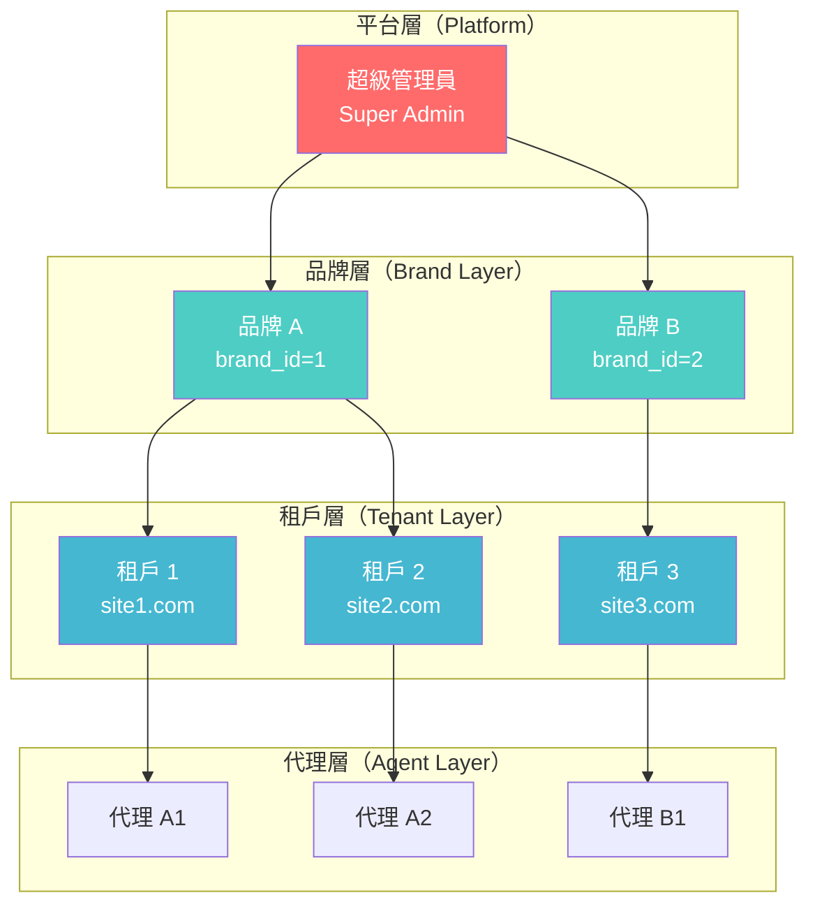
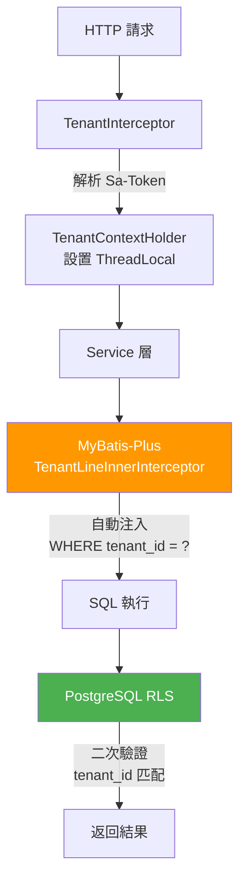
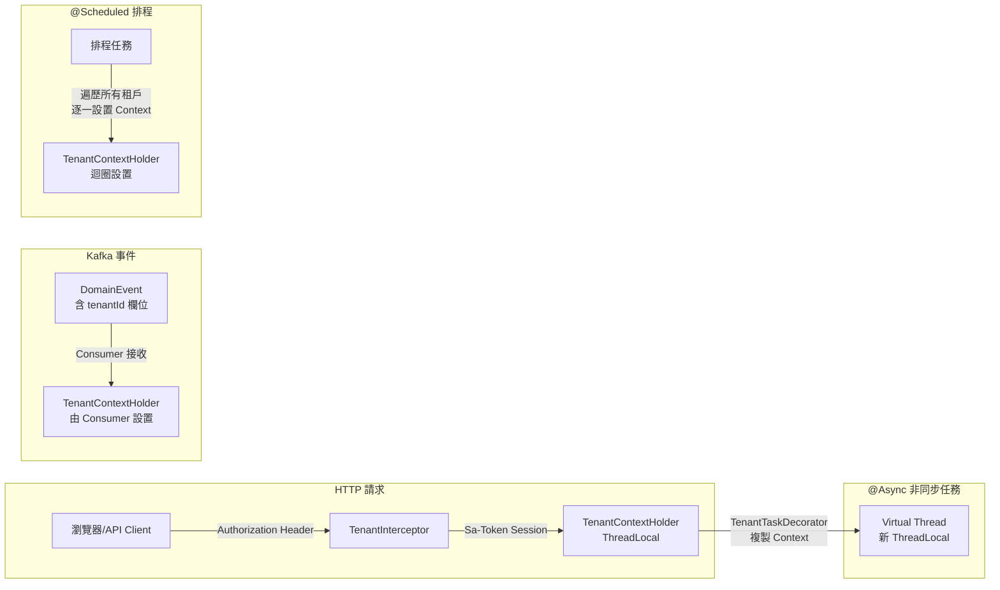

# 多租戶技術設計（Multi-Tenant Technical Design）

> **架構參考**: [Multi_Tenant_Architecture.md](../architecture/06_Platform_Core/01_Multi_Tenant_Architecture.md)
> **ADR 參考**: [ADR-014: @TenantIgnore Safety Policy](../architecture/adr/ADR-014_TenantIgnore_Safety_Policy.md)
> **需求文檔**: [Multi_Tenant_Requirements.md](../requirements/06_Governance_Licensing/01_Multi_Tenant_Requirements.md)
> **View Type**: Technical Implementation Design
> **Target Audience**: Backend Developers, Architects
> **最後更新**: 2026-02-14

---

## 1. 設計目標（Design Goals）

SmartAdmin v4.1.0 目前**尚無多租戶支持**。本文件定義 iGaming 平台的多租戶基礎設施技術實作，涵蓋以下關鍵目標：

1. **資料隔離**：透過 PostgreSQL Row-Level Security (RLS) + MyBatis-Plus TenantLineInnerInterceptor 雙層防護
2. **最小侵入**：現有 SmartAdmin 業務模組無需大規模重構，僅需繼承 `TenantBaseEntity`
3. **安全合規**：滿足 ADR-014 `@TenantIgnore` 安全使用策略，符合 PCI-DSS / GDPR 要求
4. **Virtual Threads 相容**：確保 ThreadLocal 在 Java 21 Virtual Threads 環境下正確運作

---

## 2. 層級結構設計（Hierarchy Design）

iGaming 平台採用 4 層租戶層級結構：



### 2.1 層級說明

| 層級 | 角色 | 資料範圍 | 資料庫標識 |
|------|------|---------|-----------|
| 超級管理員 (Super Admin) | 平台運營商 | 所有品牌、所有租戶 | `super_admin = true` |
| 品牌 (Brand) | 品牌持有者 | 該品牌下所有租戶 | `brand_id` |
| 租戶 (Tenant) | 運營站點 | 僅該租戶資料 | `tenant_id` |
| 代理 (Agent) | 推廣代理商 | 該代理下線玩家 | `agent_id`（透過 `t_player.agent_id`） |

### 2.2 資料可見性矩陣（Data Visibility Matrix）

| 操作者 | 可見 tenant_id | 可見 brand_id | 備註 |
|--------|---------------|---------------|------|
| Super Admin | 全部 | 全部 | 繞過 RLS |
| Brand Admin | 所屬品牌下全部 | 僅自身 brand_id | 品牌級別聚合 |
| Tenant Admin | 僅自身 | 僅自身 | 標準租戶隔離 |
| Agent | 僅自身所屬租戶 | 僅自身所屬品牌 | 透過 `t_player.agent_id` 進一步過濾 |

---

## 3. 資料隔離策略（Data Isolation Strategy）

### 3.1 方案選型：RLS + MyBatis-Plus 雙層防護

| 評估維度 | 每租戶一個 Database | 每租戶一個 Schema | **RLS（推薦）** |
|---------|-------------------|------------------|----------------|
| 隔離級別 | 最高 | 中等 | 充足 |
| 基礎設施成本 | 高（每租戶獨立 DB） | 中等（Schema 管理） | **低（共享 DB）** |
| 跨租戶查詢 | 複雜（跨 DB 連線） | 適中（切換 Schema） | **簡單（@TenantIgnore）** |
| POC 開發速度 | 慢 | 中等 | **快** |
| 連線池管理 | 複雜（多 DataSource） | 適中 | **簡單（單一連線池）** |
| MyBatis-Plus 整合 | 需自訂 DataSource 路由 | 需 Schema 切換邏輯 | **原生 TenantLineInnerInterceptor** |

**決策**：採用 **Row-Level Security (RLS) + MyBatis-Plus TenantLineInnerInterceptor** 雙層防護。

- **第一層（應用層）**：MyBatis-Plus TenantLineInnerInterceptor 自動在所有 SQL 注入 `tenant_id` 條件
- **第二層（資料庫層）**：PostgreSQL RLS 作為最終安全屏障，即使應用層被繞過也能保護資料

### 3.2 雙層防護架構



---

## 4. 核心組件設計（Core Component Design）

### 4.1 TenantContext.java

**位置**: `smartadmin-common/smartadmin-common-core/src/main/java/net/lab1024/sa/common/core/domain/tenant/`

```java
package net.lab1024.sa.common.core.domain.tenant;

import lombok.AllArgsConstructor;
import lombok.Builder;
import lombok.Data;
import lombok.NoArgsConstructor;

/**
 * Tenant context DTO - carries tenant identity through request lifecycle.
 * Immutable after construction for thread safety.
 */
@Data
@Builder
@NoArgsConstructor
@AllArgsConstructor
public class TenantContext {

    /**
     * Tenant identifier - primary isolation key
     */
    private Long tenantId;

    /**
     * Brand identifier - for brand-level aggregation
     */
    private Long brandId;

    /**
     * Whether current user is Super Admin (bypasses tenant filter)
     */
    private boolean superAdmin;

    /**
     * Impersonated tenant ID - for admin impersonation sessions
     */
    private Long impersonatedTenantId;

    /**
     * Get effective tenant ID (considers impersonation)
     */
    public Long getEffectiveTenantId() {
        if (superAdmin && impersonatedTenantId != null) {
            return impersonatedTenantId;
        }
        return tenantId;
    }
}
```

### 4.2 TenantContextHolder.java

**位置**: `smartadmin-common/smartadmin-common-web/src/main/java/net/lab1024/sa/common/web/tenant/`

```java
package net.lab1024.sa.common.web.tenant;

import net.lab1024.sa.common.core.domain.tenant.TenantContext;

/**
 * Thread-safe tenant context holder using ThreadLocal.
 *
 * <p><b>Virtual Threads 注意事項</b>:
 * Java 21 Virtual Threads 使用 carrier thread pool，ThreadLocal 在 Virtual Thread
 * unmount/mount 時會正確跟隨。但必須確保在 request 結束時呼叫 {@link #clear()}，
 * 避免 Virtual Thread 被回收後 ThreadLocal 殘留。
 *
 * <p><b>使用規範</b>:
 * <ul>
 *   <li>設置: TenantInterceptor.preHandle() 中呼叫 set()</li>
 *   <li>清理: TenantInterceptor.afterCompletion() 中呼叫 clear()</li>
 *   <li>禁止: 在非 HTTP 請求線程中直接存取（使用 TaskDecorator 傳遞）</li>
 * </ul>
 */
public final class TenantContextHolder {

    private static final ThreadLocal<TenantContext> CONTEXT = new ThreadLocal<>();

    private TenantContextHolder() {
        // Utility class - prevent instantiation
    }

    public static void set(TenantContext context) {
        CONTEXT.set(context);
    }

    public static TenantContext get() {
        return CONTEXT.get();
    }

    public static Long getTenantId() {
        TenantContext ctx = CONTEXT.get();
        return ctx != null ? ctx.getEffectiveTenantId() : null;
    }

    public static Long getBrandId() {
        TenantContext ctx = CONTEXT.get();
        return ctx != null ? ctx.getBrandId() : null;
    }

    public static boolean isSuperAdmin() {
        TenantContext ctx = CONTEXT.get();
        return ctx != null && ctx.isSuperAdmin();
    }

    /**
     * Clear tenant context - MUST be called in afterCompletion().
     * Particularly critical for Virtual Threads to prevent context leakage.
     */
    public static void clear() {
        CONTEXT.remove();
    }
}
```

### 4.3 TenantBaseEntity.java

**位置**: `smartadmin-common/smartadmin-common-mybatis/src/main/java/net/lab1024/sa/common/mybatis/domain/`

```java
package net.lab1024.sa.common.mybatis.domain;

import com.baomidou.mybatisplus.annotation.*;
import lombok.Data;

import java.time.LocalDateTime;

/**
 * Base entity for multi-tenant tables.
 * All iGaming business entities requiring tenant isolation should extend this class.
 *
 * <p>tenant_id is automatically injected by MyBatis-Plus TenantLineInnerInterceptor
 * on INSERT and filtered on SELECT/UPDATE/DELETE.
 *
 * <p>Usage:
 * <pre>{@code
 * public class PlayerEntity extends TenantBaseEntity {
 *     private String username;
 *     private String email;
 * }
 * }</pre>
 */
@Data
public abstract class TenantBaseEntity {

    @TableId(type = IdType.ASSIGN_ID)
    private Long id;

    /**
     * Tenant identifier - auto-filled by TenantLineInnerInterceptor
     */
    @TableField(fill = FieldFill.INSERT)
    private Long tenantId;

    /**
     * Brand identifier - for brand-level aggregation queries
     */
    @TableField(fill = FieldFill.INSERT)
    private Long brandId;

    @TableField(fill = FieldFill.INSERT)
    private LocalDateTime createTime;

    @TableField(fill = FieldFill.INSERT_UPDATE)
    private LocalDateTime updateTime;

    /**
     * Logical delete flag (SmartAdmin convention: 'deleted' NOT 'isDeleted')
     */
    @TableLogic
    private Boolean deleted;
}
```

### 4.4 TenantInterceptor.java

**位置**: `smartadmin-common/smartadmin-common-web/src/main/java/net/lab1024/sa/common/web/tenant/`

```java
package net.lab1024.sa.common.web.tenant;

import cn.dev33.satoken.stp.StpUtil;
import jakarta.servlet.http.HttpServletRequest;
import jakarta.servlet.http.HttpServletResponse;
import lombok.extern.slf4j.Slf4j;
import net.lab1024.sa.common.core.domain.tenant.TenantContext;
import org.springframework.stereotype.Component;
import org.springframework.web.servlet.HandlerInterceptor;

/**
 * HTTP interceptor that extracts tenant context from Sa-Token session
 * and populates TenantContextHolder (ThreadLocal).
 *
 * <p>Registered in WebMvcConfigurer with order = 10 (after Sa-Token auth interceptor).
 *
 * <p><b>Lifecycle</b>:
 * <ol>
 *   <li>preHandle: Extract tenant info from Sa-Token → set TenantContextHolder</li>
 *   <li>afterCompletion: Clear TenantContextHolder (ALWAYS, even on exception)</li>
 * </ol>
 */
@Slf4j
@Component
public class TenantInterceptor implements HandlerInterceptor {

    private static final String SA_TOKEN_TENANT_ID = "tenantId";
    private static final String SA_TOKEN_BRAND_ID = "brandId";
    private static final String SA_TOKEN_SUPER_ADMIN = "superAdmin";
    private static final String HEADER_IMPERSONATE_TENANT = "X-Impersonate-Tenant";

    @Override
    public boolean preHandle(HttpServletRequest request,
                             HttpServletResponse response,
                             Object handler) {
        // Skip if not logged in (public APIs with @NoNeedLogin)
        if (!StpUtil.isLogin()) {
            return true;
        }

        // Extract tenant info from Sa-Token session
        Long tenantId = (Long) StpUtil.getSession().get(SA_TOKEN_TENANT_ID);
        Long brandId = (Long) StpUtil.getSession().get(SA_TOKEN_BRAND_ID);
        Boolean superAdmin = (Boolean) StpUtil.getSession().get(SA_TOKEN_SUPER_ADMIN);

        TenantContext context = TenantContext.builder()
            .tenantId(tenantId)
            .brandId(brandId)
            .superAdmin(Boolean.TRUE.equals(superAdmin))
            .build();

        // Handle admin impersonation
        String impersonateHeader = request.getHeader(HEADER_IMPERSONATE_TENANT);
        if (impersonateHeader != null && context.isSuperAdmin()) {
            try {
                context.setImpersonatedTenantId(Long.parseLong(impersonateHeader));
                log.info("Super admin impersonating tenant: {}", impersonateHeader);
            } catch (NumberFormatException e) {
                log.warn("Invalid impersonation tenant ID: {}", impersonateHeader);
            }
        }

        TenantContextHolder.set(context);
        return true;
    }

    @Override
    public void afterCompletion(HttpServletRequest request,
                                HttpServletResponse response,
                                Object handler,
                                Exception ex) {
        // CRITICAL: Always clear ThreadLocal, especially for Virtual Threads
        TenantContextHolder.clear();
    }
}
```

### 4.5 MybatisPlusTenantConfig.java

**位置**: `smartadmin-modules/smartadmin-igaming-common/src/main/java/net/lab1024/sa/igaming/common/config/`

> **注意**: 此配置類別在 iGaming 模組中定義，透過 `@ConditionalOnProperty` 控制啟用，
> 不影響既有 SmartAdmin 非 iGaming 模組的 `MybatisPlusConfig`。

```java
package net.lab1024.sa.igaming.common.config;

import com.baomidou.mybatisplus.annotation.DbType;
import com.baomidou.mybatisplus.extension.plugins.MybatisPlusInterceptor;
import com.baomidou.mybatisplus.extension.plugins.handler.TenantLineHandler;
import com.baomidou.mybatisplus.extension.plugins.inner.PaginationInnerInterceptor;
import com.baomidou.mybatisplus.extension.plugins.inner.TenantLineInnerInterceptor;
import net.sf.jsqlparser.expression.Expression;
import net.sf.jsqlparser.expression.LongValue;
import net.sf.jsqlparser.expression.NullValue;
import net.lab1024.sa.common.web.tenant.TenantContextHolder;
import org.springframework.boot.autoconfigure.condition.ConditionalOnProperty;
import org.springframework.context.annotation.Bean;
import org.springframework.context.annotation.Configuration;
import org.springframework.context.annotation.Primary;
import org.springframework.transaction.annotation.EnableTransactionManagement;

import java.util.Set;

/**
 * MyBatis-Plus multi-tenant configuration for iGaming module.
 *
 * <p>This configuration replaces the default MybatisPlusConfig when
 * {@code igaming.tenant.enabled=true} is set in application properties.
 *
 * <p>Global tables (shared across all tenants) are excluded from tenant filtering
 * via the GLOBAL_TABLES whitelist.
 */
@Configuration
@EnableTransactionManagement
@ConditionalOnProperty(name = "igaming.tenant.enabled", havingValue = "true")
public class MybatisPlusTenantConfig {

    /**
     * Global tables that should NOT have tenant_id filtering.
     * These are shared reference data tables accessible by all tenants.
     */
    private static final Set<String> GLOBAL_TABLES = Set.of(
        "t_brand",              // Brand configuration (parent of tenants)
        "t_currency",           // Currency reference data
        "t_country",            // Country reference data
        "t_game_provider",      // Global game provider catalog
        "t_system_config",      // Global system configuration
        "t_risk_rule_global",   // Global risk control rules
        "t_tenant"              // Tenant management table (managed by Super Admin)
    );

    @Bean
    @Primary
    public MybatisPlusInterceptor mybatisPlusInterceptor() {
        MybatisPlusInterceptor interceptor = new MybatisPlusInterceptor();

        // 1. Tenant interceptor - MUST be added FIRST (before pagination)
        interceptor.addInnerInterceptor(new TenantLineInnerInterceptor(
            new TenantLineHandler() {

                @Override
                public Expression getTenantId() {
                    Long tenantId = TenantContextHolder.getTenantId();
                    if (tenantId == null) {
                        // Super Admin without impersonation - return null
                        // RLS will handle access control at DB level
                        if (TenantContextHolder.isSuperAdmin()) {
                            return new NullValue();
                        }
                        throw new IllegalStateException(
                            "Tenant context not set. Ensure TenantInterceptor is registered.");
                    }
                    return new LongValue(tenantId);
                }

                @Override
                public String getTenantIdColumn() {
                    return "tenant_id";
                }

                @Override
                public boolean ignoreTable(String tableName) {
                    return GLOBAL_TABLES.contains(tableName);
                }
            }
        ));

        // 2. Pagination interceptor
        interceptor.addInnerInterceptor(new PaginationInnerInterceptor(DbType.POSTGRE_SQL));

        return interceptor;
    }
}
```

### 4.6 @TenantIgnore 註解

**位置**: `smartadmin-common/smartadmin-common-mybatis/src/main/java/net/lab1024/sa/common/mybatis/annotation/`

> **合規依據**: [ADR-014: @TenantIgnore Safety Policy](../architecture/adr/ADR-014_TenantIgnore_Safety_Policy.md)

```java
package net.lab1024.sa.common.mybatis.annotation;

import java.lang.annotation.*;

/**
 * Marks a method or Mapper statement to bypass MyBatis-Plus tenant filtering.
 *
 * <p><b>ADR-014 Compliance</b>: This annotation is RESTRICTED to:
 * <ul>
 *   <li>Classes ending with {@code ReportService} - brand-level aggregation</li>
 *   <li>Classes ending with {@code MigrationManager} - cross-brand tenant migration</li>
 * </ul>
 *
 * <p><b>ArchUnit Enforcement</b>:
 * <pre>{@code
 * @ArchTest
 * static final ArchRule tenantIgnoreOnlyInAllowedClasses =
 *     methods().that().areAnnotatedWith(TenantIgnore.class)
 *         .should().beDeclaredInClassesThat()
 *         .haveSimpleNameEndingWith("ReportService")
 *         .orShould().beDeclaredInClassesThat()
 *         .haveSimpleNameEndingWith("MigrationManager");
 * }</pre>
 *
 * <p><b>Prohibited usage</b>:
 * <ul>
 *   <li>Player PII queries (GDPR Art 25 violation)</li>
 *   <li>Wallet balance access (PCI-DSS 7.2.1 violation)</li>
 *   <li>KYC document access (GDPR Art 9 violation)</li>
 *   <li>Payment credential access (PCI-DSS 3.4 violation)</li>
 * </ul>
 *
 * @see net.lab1024.sa.igaming.common.config.MybatisPlusTenantConfig
 */
@Target({ElementType.METHOD, ElementType.TYPE})
@Retention(RetentionPolicy.RUNTIME)
@Documented
public @interface TenantIgnore {

    /**
     * Reason for bypassing tenant filter (mandatory for audit trail).
     */
    String reason();
}
```

---

## 5. 租戶上下文傳播（Tenant Context Propagation）

### 5.1 傳播路徑總覽



### 5.2 HTTP 請求傳播

標準 Web 請求的租戶上下文傳播是自動的：

1. 瀏覽器攜帶 Sa-Token cookie 或 `Authorization` header
2. `TenantInterceptor.preHandle()` 從 Sa-Token Session 解析 `tenantId`/`brandId`
3. 設置 `TenantContextHolder` (ThreadLocal)
4. Service/Dao 層自動使用 `TenantContextHolder.getTenantId()`
5. `TenantInterceptor.afterCompletion()` 清理 ThreadLocal

### 5.3 @Async 非同步傳播

Virtual Threads 環境下，`@Async` 任務在新的 Virtual Thread 執行，需要透過 `TaskDecorator` 傳遞 TenantContext：

```java
package net.lab1024.sa.common.web.tenant;

import net.lab1024.sa.common.core.domain.tenant.TenantContext;
import org.springframework.core.task.TaskDecorator;
import org.springframework.lang.NonNull;

/**
 * Copies TenantContext from parent thread to @Async child thread.
 * Essential for Virtual Threads where ThreadLocal does not auto-propagate.
 */
public class TenantTaskDecorator implements TaskDecorator {

    @Override
    @NonNull
    public Runnable decorate(@NonNull Runnable runnable) {
        // Capture context from calling thread
        TenantContext parentContext = TenantContextHolder.get();

        return () -> {
            try {
                if (parentContext != null) {
                    TenantContextHolder.set(parentContext);
                }
                runnable.run();
            } finally {
                // CRITICAL: Always clear in child thread
                TenantContextHolder.clear();
            }
        };
    }
}
```

**註冊 TaskDecorator**:

```java
@Configuration
public class AsyncTenantConfig {

    @Bean
    public TaskExecutor taskExecutor() {
        ThreadPoolTaskExecutor executor = new ThreadPoolTaskExecutor();
        executor.setTaskDecorator(new TenantTaskDecorator());
        executor.setCorePoolSize(0);
        executor.setMaxPoolSize(Integer.MAX_VALUE);
        // Virtual Threads: Spring Boot 3.x auto-configures when
        // spring.threads.virtual.enabled=true
        return executor;
    }
}
```

### 5.4 Kafka 事件傳播

Kafka Consumer 執行在獨立的線程中，無法透過 ThreadLocal 自動傳播。
租戶資訊必須嵌入 DomainEvent：

```java
/**
 * Base domain event with tenant context for Kafka propagation
 */
@Data
public abstract class TenantDomainEvent {

    private Long tenantId;
    private Long brandId;
    private LocalDateTime eventTime;
    private String eventType;
}

// Consumer 端設置 TenantContext
@KafkaListener(topics = "player-events")
public void handlePlayerEvent(TenantDomainEvent event) {
    try {
        TenantContext ctx = TenantContext.builder()
            .tenantId(event.getTenantId())
            .brandId(event.getBrandId())
            .superAdmin(false)
            .build();
        TenantContextHolder.set(ctx);

        // Process event with tenant context
        processEvent(event);
    } finally {
        TenantContextHolder.clear();
    }
}
```

### 5.5 Virtual Threads 注意事項

| 場景 | 風險 | 緩解措施 |
|------|------|---------|
| HTTP 請求結束未清理 | ThreadLocal 殘留在 carrier thread | `afterCompletion()` **必定**呼叫 `clear()` |
| @Async 任務 | 子 Virtual Thread 無 parent context | `TenantTaskDecorator` 複製 context |
| CompletableFuture | 可能在不同 Virtual Thread 執行 | 手動傳遞 `TenantContext` 參數 |
| Kafka Consumer | 獨立線程池，無 HTTP context | DomainEvent 攜帶 tenantId |

---

## 6. PostgreSQL RLS 設置（PostgreSQL RLS Setup）

### 6.1 啟用 RLS

```sql
-- ============================================================
-- PostgreSQL Row-Level Security (RLS) for iGaming Multi-Tenant
-- ============================================================

-- 啟用 RLS（所有含 tenant_id 的業務表）
ALTER TABLE t_player ENABLE ROW LEVEL SECURITY;
ALTER TABLE t_wallet ENABLE ROW LEVEL SECURITY;
ALTER TABLE t_wallet_transaction ENABLE ROW LEVEL SECURITY;
ALTER TABLE t_transaction ENABLE ROW LEVEL SECURITY;
ALTER TABLE t_bet_record ENABLE ROW LEVEL SECURITY;
ALTER TABLE t_bonus ENABLE ROW LEVEL SECURITY;
ALTER TABLE t_kyc_document ENABLE ROW LEVEL SECURITY;
ALTER TABLE t_payment_credential ENABLE ROW LEVEL SECURITY;
ALTER TABLE t_agent ENABLE ROW LEVEL SECURITY;

-- 強制 RLS 對 table owner 也生效（防止繞過）
ALTER TABLE t_player FORCE ROW LEVEL SECURITY;
ALTER TABLE t_wallet FORCE ROW LEVEL SECURITY;
ALTER TABLE t_wallet_transaction FORCE ROW LEVEL SECURITY;
ALTER TABLE t_transaction FORCE ROW LEVEL SECURITY;
ALTER TABLE t_bet_record FORCE ROW LEVEL SECURITY;
ALTER TABLE t_bonus FORCE ROW LEVEL SECURITY;
ALTER TABLE t_kyc_document FORCE ROW LEVEL SECURITY;
ALTER TABLE t_payment_credential FORCE ROW LEVEL SECURITY;
ALTER TABLE t_agent FORCE ROW LEVEL SECURITY;
```

### 6.2 租戶隔離策略（Tenant Isolation Policy）

```sql
-- 租戶級別隔離策略（適用於所有 CRUD 操作）
CREATE POLICY tenant_isolation ON t_player
    USING (
        tenant_id = current_setting('app.current_tenant_id', true)::BIGINT
    )
    WITH CHECK (
        tenant_id = current_setting('app.current_tenant_id', true)::BIGINT
    );

-- 對所有業務表套用相同策略模式
-- (以 t_wallet 為例，其餘表同理)
CREATE POLICY tenant_isolation ON t_wallet
    USING (
        tenant_id = current_setting('app.current_tenant_id', true)::BIGINT
    )
    WITH CHECK (
        tenant_id = current_setting('app.current_tenant_id', true)::BIGINT
    );
```

### 6.3 超級管理員繞過策略（Super Admin Bypass）

```sql
-- Super Admin 繞過策略（可查看所有租戶資料）
CREATE POLICY super_admin_bypass ON t_player
    USING (
        current_setting('app.is_super_admin', true)::BOOLEAN = TRUE
    );

-- Brand Admin 品牌級別策略（可查看品牌下所有租戶）
CREATE POLICY brand_access ON t_player
    FOR SELECT
    USING (
        brand_id = current_setting('app.current_brand_id', true)::BIGINT
        AND current_setting('app.is_brand_admin', true)::BOOLEAN = TRUE
    );
```

### 6.4 Session 變量注入（MyBatis Interceptor）

每次從連線池取得 Connection 時，注入租戶 Session 變量：

```java
package net.lab1024.sa.igaming.common.interceptor;

import lombok.extern.slf4j.Slf4j;
import net.lab1024.sa.common.web.tenant.TenantContextHolder;
import org.apache.ibatis.executor.Executor;
import org.apache.ibatis.mapping.MappedStatement;
import org.apache.ibatis.plugin.*;
import org.apache.ibatis.session.ResultHandler;
import org.apache.ibatis.session.RowBounds;

import java.sql.Connection;
import java.sql.Statement;

/**
 * MyBatis interceptor that sets PostgreSQL session variables
 * for RLS policy evaluation before each query.
 */
@Slf4j
@Intercepts({
    @Signature(type = Executor.class, method = "query",
        args = {MappedStatement.class, Object.class, RowBounds.class, ResultHandler.class}),
    @Signature(type = Executor.class, method = "update",
        args = {MappedStatement.class, Object.class})
})
public class RlsSessionInterceptor implements Interceptor {

    @Override
    public Object intercept(Invocation invocation) throws Throwable {
        Executor executor = (Executor) invocation.getTarget();
        Connection conn = executor.getTransaction().getConnection();

        Long tenantId = TenantContextHolder.getTenantId();
        Long brandId = TenantContextHolder.getBrandId();
        boolean superAdmin = TenantContextHolder.isSuperAdmin();

        try (Statement stmt = conn.createStatement()) {
            if (tenantId != null) {
                stmt.execute("SET LOCAL app.current_tenant_id = '" + tenantId + "'");
            }
            if (brandId != null) {
                stmt.execute("SET LOCAL app.current_brand_id = '" + brandId + "'");
            }
            stmt.execute("SET LOCAL app.is_super_admin = '" + superAdmin + "'");
        }

        return invocation.proceed();
    }
}
```

> **注意**: 使用 `SET LOCAL` 而非 `SET`。`SET LOCAL` 僅在當前 transaction 內有效，
> 連線歸還連線池時自動失效，避免跨請求的上下文污染。

### 6.5 驗證 RLS 隔離

```sql
-- 測試步驟 1: 以租戶 1 身份查詢
SET LOCAL app.current_tenant_id = '1';
SET LOCAL app.is_super_admin = 'false';
SELECT count(*) FROM t_player;
-- 預期: 僅返回 tenant_id=1 的資料

-- 測試步驟 2: 以租戶 2 身份查詢
SET LOCAL app.current_tenant_id = '2';
SET LOCAL app.is_super_admin = 'false';
SELECT count(*) FROM t_player;
-- 預期: 僅返回 tenant_id=2 的資料

-- 測試步驟 3: 以 Super Admin 身份查詢
SET LOCAL app.is_super_admin = 'true';
SELECT count(*) FROM t_player;
-- 預期: 返回所有租戶資料

-- 測試步驟 4: 嘗試跨租戶寫入（應被拒絕）
SET LOCAL app.current_tenant_id = '1';
SET LOCAL app.is_super_admin = 'false';
INSERT INTO t_player (id, tenant_id, username) VALUES (999, 2, 'hacker');
-- 預期: ERROR - new row violates row-level security policy
```

---

## 7. MyBatis-Plus 租戶插件配置（MyBatis-Plus Tenant Plugin Configuration）

### 7.1 與現有 SmartAdmin 配置的整合

現有 `MybatisPlusConfig`（`smartadmin-common-mybatis`）僅包含分頁插件：

```java
// 現有配置 (不修改)
@Configuration
public class MybatisPlusConfig {
    @Bean
    public MybatisPlusInterceptor paginationInterceptor() {
        MybatisPlusInterceptor interceptor = new MybatisPlusInterceptor();
        interceptor.addInnerInterceptor(new PaginationInnerInterceptor(DbType.POSTGRE_SQL));
        return interceptor;
    }
}
```

iGaming 模組的 `MybatisPlusTenantConfig` 使用 `@Primary` + `@ConditionalOnProperty` 覆蓋：

```yaml
# application-igaming.yml
igaming:
  tenant:
    enabled: true
```

當 `igaming.tenant.enabled=true` 時，`MybatisPlusTenantConfig` 的 Bean 優先於 `MybatisPlusConfig`，
自動啟用租戶過濾。非 iGaming 環境（profile 不包含 igaming）不受影響。

### 7.2 全局表白名單（Global Table Whitelist）

以下表不需要 `tenant_id` 過濾，在 `ignoreTable()` 中排除：

| 表名 | 用途 | 理由 |
|------|------|------|
| `t_brand` | 品牌管理 | 品牌是租戶的上層，不屬於任何租戶 |
| `t_tenant` | 租戶管理 | 由 Super Admin 管理，不按租戶過濾 |
| `t_currency` | 幣種參考 | 全局共享參考資料 |
| `t_country` | 國家參考 | 全局共享參考資料 |
| `t_game_provider` | 遊戲供應商 | 全局共享遊戲目錄 |
| `t_system_config` | 系統配置 | 全局系統參數 |
| `t_risk_rule_global` | 全局風控規則 | 全平台通用風控規則 |

### 7.3 @TenantIgnore 處理機制

`@TenantIgnore` 註解的運作方式如下：

```mermaid
flowchart TD
    A[SQL 執行] --> B{方法/類別有<br/>@TenantIgnore?}
    B -->|是| C[跳過 tenant_id 注入<br/>使用原始 SQL]
    B -->|否| D{表在<br/>GLOBAL_TABLES?}
    D -->|是| C
    D -->|否| E[注入 WHERE tenant_id = ?<br/>INSERT 自動填入 tenant_id]
    C --> F[執行 SQL]
    E --> F
```

在 `TenantLineHandler` 中整合 `@TenantIgnore` 檢測：

```java
@Override
public boolean ignoreTable(String tableName) {
    // 1. Check global table whitelist
    if (GLOBAL_TABLES.contains(tableName)) {
        return true;
    }

    // 2. Check @TenantIgnore annotation on current method
    // (Via custom InterceptorIgnoreHelper or AOP aspect)
    if (InterceptorIgnoreHelper.willIgnoreTenantLine(tableName)) {
        return true;
    }

    // 3. Super Admin without impersonation - skip tenant filter
    if (TenantContextHolder.isSuperAdmin()
        && TenantContextHolder.getTenantId() == null) {
        return true;
    }

    return false;
}
```

---

## 8. 安全考量（Security Considerations）

### 8.1 RLS 繞過防護

| 風險 | 攻擊向量 | 防護措施 |
|------|---------|---------|
| SQL Injection 繞過 RLS | 惡意 SQL 修改 Session 變量 | `SET LOCAL`（transaction-scoped）+ PreparedStatement |
| 直接 DB 連線繞過 | DBA 使用 superuser 帳號 | `FORCE ROW LEVEL SECURITY` + 審計日誌 |
| Application Bug 繞過 | 忘記設置 TenantContext | MyBatis-Plus interceptor 強制檢查（拋出 IllegalStateException） |
| Session 變量污染 | 連線池回收未清理 | `SET LOCAL`（自動隨 transaction 結束失效） |

### 8.2 ThreadLocal 清理保障

```java
/**
 * Defense-in-depth: Filter-level cleanup as backup for interceptor
 */
@Component
@Order(Ordered.HIGHEST_PRECEDENCE)
public class TenantCleanupFilter implements Filter {

    @Override
    public void doFilter(ServletRequest request, ServletResponse response,
                         FilterChain chain) throws IOException, ServletException {
        try {
            chain.doFilter(request, response);
        } finally {
            // Backup cleanup - even if interceptor fails
            TenantContextHolder.clear();
        }
    }
}
```

### 8.3 租戶 ID 驗證規則

```java
/**
 * Validates tenant ID is present and valid before any database operation.
 */
public final class TenantValidator {

    private TenantValidator() {}

    /**
     * Validate tenant context is properly set.
     * Called by TenantLineHandler.getTenantId().
     *
     * @throws IllegalStateException if tenant context is missing or invalid
     */
    public static void validateTenantContext() {
        TenantContext ctx = TenantContextHolder.get();

        if (ctx == null) {
            throw new IllegalStateException(
                "TenantContext is null. Ensure request passes through TenantInterceptor.");
        }

        // Super Admin may have null tenantId (when not impersonating)
        if (ctx.isSuperAdmin()) {
            return;
        }

        Long tenantId = ctx.getTenantId();
        if (tenantId == null || tenantId <= 0) {
            throw new IllegalStateException(
                "Invalid tenant ID: " + tenantId + ". Tenant ID must be a positive number.");
        }
    }
}
```

### 8.4 跨租戶訪問審計

所有 `@TenantIgnore` 操作必須記錄審計日誌（Audit Log），包含：

1. **操作者身份**: userId, role, 來源 IP
2. **訪問範圍**: brandId, tenantId 範圍, 時間區間
3. **返回資料量**: 記錄數（不記錄明細資料）
4. **訪問原因**: 報表查詢 / 遷移操作 / 全局管理

```java
// AOP aspect for automatic audit logging on @TenantIgnore methods
@Aspect
@Component
@RequiredArgsConstructor
@Slf4j
public class TenantIgnoreAuditAspect {

    private final AuditLogManager auditLogManager;

    @Around("@annotation(tenantIgnore)")
    public Object auditTenantIgnore(ProceedingJoinPoint joinPoint,
                                     TenantIgnore tenantIgnore) throws Throwable {
        TenantContext ctx = TenantContextHolder.get();
        long startTime = System.currentTimeMillis();

        try {
            Object result = joinPoint.proceed();

            auditLogManager.log(AuditLog.builder()
                .action("TENANT_IGNORE_ACCESS")
                .userId(ctx != null ? ctx.getTenantId() : null)
                .reason(tenantIgnore.reason())
                .method(joinPoint.getSignature().toShortString())
                .durationMs(System.currentTimeMillis() - startTime)
                .build());

            return result;
        } catch (Exception e) {
            log.error("@TenantIgnore method failed: {}", joinPoint.getSignature(), e);
            throw e;
        }
    }
}
```

---

## 9. 測試策略（Testing Strategy）

### 9.1 Integration Test：Testcontainers + PostgreSQL

```java
package net.lab1024.sa.app.tenant;

import org.junit.jupiter.api.BeforeEach;
import org.junit.jupiter.api.DisplayName;
import org.junit.jupiter.api.Test;
import org.springframework.beans.factory.annotation.Autowired;
import org.springframework.boot.test.context.SpringBootTest;
import org.springframework.test.context.DynamicPropertyRegistry;
import org.springframework.test.context.DynamicPropertySource;
import org.testcontainers.containers.PostgreSQLContainer;
import org.testcontainers.junit.jupiter.Container;
import org.testcontainers.junit.jupiter.Testcontainers;

import static org.assertj.core.api.Assertions.assertThat;

/**
 * Integration test for multi-tenant data isolation.
 * Uses Testcontainers to spin up a real PostgreSQL with RLS enabled.
 */
@SpringBootTest
@Testcontainers
class MultiTenantIsolationTest {

    @Container
    static PostgreSQLContainer<?> postgres = new PostgreSQLContainer<>("postgres:16-alpine")
        .withDatabaseName("smartadmin_test")
        .withUsername("test")
        .withPassword("test")
        .withInitScript("sql/init-rls.sql");

    @DynamicPropertySource
    static void configureProperties(DynamicPropertyRegistry registry) {
        registry.add("spring.datasource.url", postgres::getJdbcUrl);
        registry.add("spring.datasource.username", postgres::getUsername);
        registry.add("spring.datasource.password", postgres::getPassword);
        registry.add("igaming.tenant.enabled", () -> "true");
    }

    @Autowired
    private PlayerDao playerDao;

    @BeforeEach
    void setUp() {
        // Insert test data for 2 tenants
        TenantContextHolder.set(TenantContext.builder()
            .tenantId(1L).brandId(10L).superAdmin(false).build());
        playerDao.insert(createPlayer("player_a", 1L));
        playerDao.insert(createPlayer("player_b", 1L));

        TenantContextHolder.set(TenantContext.builder()
            .tenantId(2L).brandId(10L).superAdmin(false).build());
        playerDao.insert(createPlayer("player_c", 2L));

        TenantContextHolder.clear();
    }

    @Test
    @DisplayName("Tenant 1 should only see its own players")
    void testTenantIsolation_Tenant1() {
        TenantContextHolder.set(TenantContext.builder()
            .tenantId(1L).brandId(10L).superAdmin(false).build());

        var players = playerDao.selectList(null);

        assertThat(players).hasSize(2);
        assertThat(players).allMatch(p -> p.getTenantId().equals(1L));

        TenantContextHolder.clear();
    }

    @Test
    @DisplayName("Tenant 2 should only see its own players")
    void testTenantIsolation_Tenant2() {
        TenantContextHolder.set(TenantContext.builder()
            .tenantId(2L).brandId(10L).superAdmin(false).build());

        var players = playerDao.selectList(null);

        assertThat(players).hasSize(1);
        assertThat(players).allMatch(p -> p.getTenantId().equals(2L));

        TenantContextHolder.clear();
    }

    @Test
    @DisplayName("Super Admin should see all players across tenants")
    void testSuperAdminAccess() {
        TenantContextHolder.set(TenantContext.builder()
            .tenantId(null).brandId(null).superAdmin(true).build());

        var players = playerDao.selectList(null);

        assertThat(players).hasSize(3);

        TenantContextHolder.clear();
    }

    @Test
    @DisplayName("Tenant 1 cannot insert data with tenant_id=2")
    void testCrossTenantWritePrevention() {
        TenantContextHolder.set(TenantContext.builder()
            .tenantId(1L).brandId(10L).superAdmin(false).build());

        // MyBatis-Plus interceptor will override tenant_id to 1
        PlayerEntity player = createPlayer("hacker", 2L);
        playerDao.insert(player);

        // Verify the inserted player has tenant_id=1 (overridden by interceptor)
        assertThat(player.getTenantId()).isEqualTo(1L);

        TenantContextHolder.clear();
    }

    private PlayerEntity createPlayer(String username, Long tenantId) {
        PlayerEntity player = new PlayerEntity();
        player.setUsername(username);
        player.setTenantId(tenantId);
        player.setBrandId(10L);
        return player;
    }
}
```

### 9.2 @TenantIgnore 白名單測試

```java
@Test
@DisplayName("@TenantIgnore should only be used in allowed classes")
void testTenantIgnoreWhitelist() {
    // ArchUnit test (in ArchitectureTest.java)
    ArchRule rule = methods()
        .that().areAnnotatedWith(TenantIgnore.class)
        .should().beDeclaredInClassesThat()
        .haveSimpleNameEndingWith("ReportService")
        .orShould().beDeclaredInClassesThat()
        .haveSimpleNameEndingWith("MigrationManager")
        .because("ADR-014: @TenantIgnore is restricted to report and migration classes");

    rule.check(importedClasses);
}
```

### 9.3 RLS Policy 驗證測試

```java
@Test
@DisplayName("RLS should block cross-tenant access at database level")
void testRlsPolicyEnforcement() throws SQLException {
    try (Connection conn = dataSource.getConnection();
         Statement stmt = conn.createStatement()) {

        // Set tenant context to tenant 1
        stmt.execute("SET LOCAL app.current_tenant_id = '1'");
        stmt.execute("SET LOCAL app.is_super_admin = 'false'");

        ResultSet rs = stmt.executeQuery("SELECT count(*) FROM t_player");
        rs.next();
        long tenant1Count = rs.getLong(1);

        // Set tenant context to tenant 2
        stmt.execute("SET LOCAL app.current_tenant_id = '2'");
        rs = stmt.executeQuery("SELECT count(*) FROM t_player");
        rs.next();
        long tenant2Count = rs.getLong(1);

        // Verify isolation
        assertThat(tenant1Count).isGreaterThan(0);
        assertThat(tenant2Count).isGreaterThan(0);
        // Tenant 1 and Tenant 2 see different data sets
    }
}
```

---

## 10. 風險與緩解（Risks & Mitigations）

### 10.1 風險矩陣

| 風險 | 嚴重度 | 可能性 | 影響 | 緩解措施 |
|------|--------|--------|------|---------|
| RLS 策略配置錯誤導致資料洩漏 | **HIGH** | 低 | 跨租戶資料暴露 | 雙層防護（MyBatis-Plus + RLS）、自動化 RLS 測試、`FORCE ROW LEVEL SECURITY` |
| Virtual Threads + ThreadLocal 殘留 | **MEDIUM** | 中等 | 錯誤的租戶上下文 | `afterCompletion()` 清理 + `TenantCleanupFilter` 備援 + `SET LOCAL` |
| 租戶過濾器效能衝擊 | **LOW** | 低 | 查詢延遲增加 | `tenant_id` 列建立索引、TenantLineInnerInterceptor 使用 SQL 重寫（非子查詢） |
| @TenantIgnore 濫用 | **HIGH** | 低 | 跨租戶非法存取 | ArchUnit 強制白名單、審計日誌 AOP、ADR-014 合規檢查 |
| 新表忘記啟用 RLS | **HIGH** | 中等 | 新表無資料隔離 | CI/CD pipeline 檢查腳本、Migration 範本自動含 RLS |
| Session 變量未設置 | **MEDIUM** | 低 | RLS 策略返回空結果 | `current_setting(name, true)` 第二參數 `true` 表示缺失時返回 NULL 而非報錯 |

### 10.2 關鍵緩解措施詳述

**RLS 配置錯誤防護**:

```sql
-- CI/CD 腳本：驗證所有含 tenant_id 的表都啟用了 RLS
SELECT schemaname, tablename, rowsecurity
FROM pg_tables
WHERE schemaname = 'public'
  AND tablename IN (
      SELECT table_name FROM information_schema.columns
      WHERE column_name = 'tenant_id'
  )
  AND NOT rowsecurity;
-- 預期結果: 0 rows（所有含 tenant_id 的表都已啟用 RLS）
```

**新表自動含 RLS 的 Flyway Migration 範本**:

```sql
-- V{version}__create_{table_name}.sql
CREATE TABLE t_new_table (
    id BIGINT PRIMARY KEY,
    tenant_id BIGINT NOT NULL,
    brand_id BIGINT NOT NULL,
    -- business columns
    create_time TIMESTAMP DEFAULT CURRENT_TIMESTAMP,
    update_time TIMESTAMP DEFAULT CURRENT_TIMESTAMP,
    deleted BOOLEAN DEFAULT FALSE
);

-- Enable RLS (MANDATORY for all tenant-scoped tables)
ALTER TABLE t_new_table ENABLE ROW LEVEL SECURITY;
ALTER TABLE t_new_table FORCE ROW LEVEL SECURITY;

CREATE POLICY tenant_isolation ON t_new_table
    USING (tenant_id = current_setting('app.current_tenant_id', true)::BIGINT)
    WITH CHECK (tenant_id = current_setting('app.current_tenant_id', true)::BIGINT);

CREATE POLICY super_admin_bypass ON t_new_table
    USING (current_setting('app.is_super_admin', true)::BOOLEAN = TRUE);

-- Index for tenant filtering performance
CREATE INDEX idx_{table_name}_tenant_id ON t_new_table(tenant_id);
```

---

## 相關文件（Related Documents）

### 架構文件
- [Multi_Tenant_Architecture.md](../architecture/06_Platform_Core/01_Multi_Tenant_Architecture.md) -- 多租戶架構總覽
- [ADR-014: @TenantIgnore Safety Policy](../architecture/adr/ADR-014_TenantIgnore_Safety_Policy.md) -- @TenantIgnore 安全使用白名單

### SmartAdmin 核心
- [MybatisPlusConfig.java](../../../smart-admin-api-java21-springboot3/smartadmin-common/smartadmin-common-mybatis/src/main/java/net/lab1024/sa/common/mybatis/config/MybatisPlusConfig.java) -- 現有 MyBatis-Plus 配置
- [SmartAdmin Patterns](.claude/shared/knowledge/smartadmin-patterns.md) -- SmartAdmin 開發模式

### 需求文件
- [Multi_Tenant_Requirements.md](../requirements/06_Governance_Licensing/01_Multi_Tenant_Requirements.md) -- 多租戶業務需求

---

**Document Version**: 1.0.0
**Last Updated**: 2026-02-14
**Maintainer**: iGaming Backend Team
