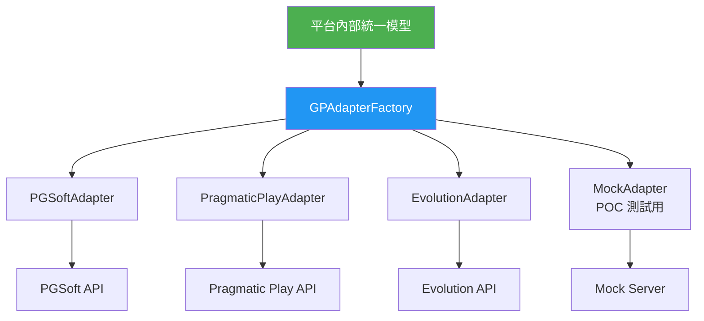
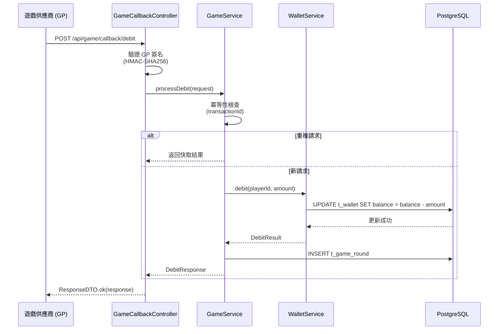
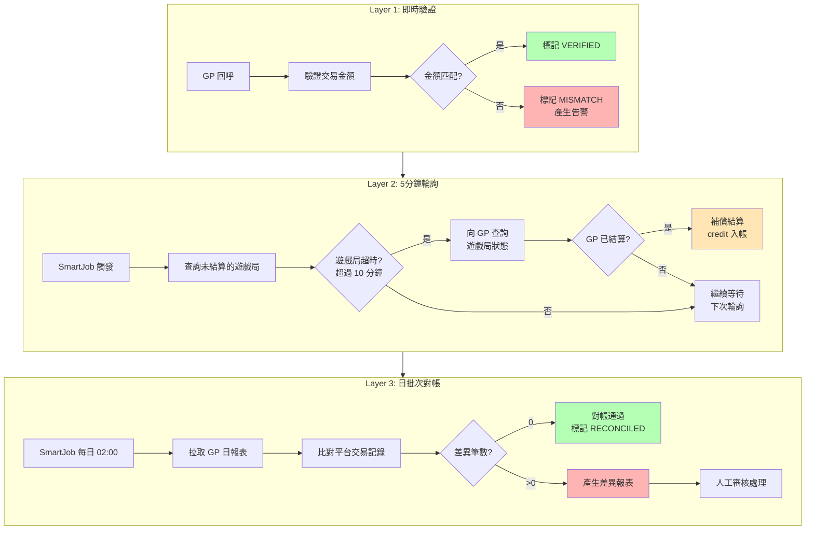

# 遊戲整合設計（Game Provider Integration Design）

> **模組名稱**: `smartadmin-igaming-game`
> **目標讀者（Audience）**: 架構師、後端開發人員
> **業務需求（Business Requirements）**: [Game_Integration_Requirements.md](../requirements/03_Gaming_Operations/02_Game_Integration_Requirements.md)
> **架構參考**: [02_Game_Integration_Implementation.md](../architecture/03_Game_Integration/02_Game_Integration_Implementation.md)
> **Phase**: Phase 2 - Implementation Design
> **最後更新（Last Updated）**: 2026-02-14

---

## 1. 模組概述（Module Overview）

`smartadmin-igaming-game` 模組負責遊戲供應商 (Game Provider, GP) 整合，涵蓋遊戲大廳管理、無縫錢包 (Seamless Wallet) 回呼處理、三層對帳 (Reconciliation) 系統。

| 功能領域 | 說明 | 關鍵元件 |
|---------|------|---------|
| **GP 適配器** | 統一不同 GP 的 API 格式 | `GameProviderAdapter` 介面 |
| **無縫錢包整合** | GP 回呼 → 錢包扣款/入款 | `GameCallbackController` |
| **遊戲大廳** | 遊戲分類、搜尋、緩存 | `GameCacheManager` |
| **對帳系統** | 三層即時 + 定期 + 批次對帳 | `ReconciliationManager` |
| **GP 管理** | GP 配置、健康檢查、啟停 | `GameProviderService` |
| **遊戲權重表** | 有效投注額 (Valid Turnover) 計算比例 | LiteFlow 規則 |

**模組位置**：

```
smartadmin-modules/
└── smartadmin-igaming-game/
    └── src/main/java/net/lab1024/sa/business/game/
        ├── controller/       # GameCallbackController, GameLobbyController
        ├── service/          # GameService, GameProviderService
        ├── manager/          # GameCacheManager, ReconciliationManager
        ├── dao/              # GameDao, GameProviderDao, GameRoundDao
        ├── adapter/          # GameProviderAdapter, adapters per GP
        ├── domain/
        │   ├── entity/       # GameEntity, GameProviderEntity, GameRoundEntity
        │   ├── form/         # DebitForm, CreditForm, GameQueryForm
        │   └── vo/           # GameVO, GameProviderVO, GameRoundVO
        └── enums/            # GameCategoryEnum, RoundStatusEnum
```

---

## 2. GP 適配器模式（Adapter Pattern）

### 2.1 設計理念

每個遊戲供應商 (GP) 提供不同的 API 格式、簽名方式、錯誤碼。適配器模式將各 GP 的差異封裝於 `GameProviderAdapter` 實作類中，平台內部統一使用標準化資料模型。



### 2.2 GameProviderAdapter 介面

```java
package net.lab1024.sa.business.game.adapter;

import io.vavr.control.Try;
import java.math.BigDecimal;

/**
 * Game Provider Adapter Interface
 *
 * Each GP implements this interface to normalize API interactions.
 * Platform code always interacts with this interface, never GP-specific APIs.
 */
public interface GameProviderAdapter {

    /**
     * Authenticate player session with GP
     *
     * @param playerId player identifier
     * @param tenantId tenant identifier
     * @return GP-issued session token
     */
    Try<String> authenticate(Long playerId, Long tenantId);

    /**
     * Place a bet (debit from wallet)
     *
     * @param request standardized bet request
     * @return bet result with transaction reference
     */
    Try<BetResult> bet(BetRequest request);

    /**
     * Settle a round (credit to wallet)
     *
     * @param request standardized settle request
     * @return settle result with payout amount
     */
    Try<SettleResult> settle(SettleRequest request);

    /**
     * Rollback a transaction
     *
     * @param request standardized rollback request
     * @return rollback confirmation
     */
    Try<RollbackResult> rollback(RollbackRequest request);

    /**
     * Get player balance (for GP display)
     *
     * @param playerId player identifier
     * @param tenantId tenant identifier
     * @return current playable balance
     */
    Try<BigDecimal> getBalance(Long playerId, Long tenantId);

    /**
     * Query game round details
     *
     * @param roundId GP-side round identifier
     * @return round details
     */
    Try<GameRoundDetail> queryRound(String roundId);

    /**
     * GP provider code (e.g., "pgsoft", "pragmatic", "evolution")
     */
    String getProviderCode();
}
```

### 2.3 GPAdapterFactory

```java
package net.lab1024.sa.business.game.adapter;

import lombok.RequiredArgsConstructor;
import org.springframework.stereotype.Component;

import java.util.List;
import java.util.Map;
import java.util.function.Function;
import java.util.stream.Collectors;

/**
 * Runtime GP adapter selection factory
 *
 * Spring injects all GameProviderAdapter beans;
 * factory indexes them by provider code for O(1) lookup.
 */
@Component
@RequiredArgsConstructor
public class GPAdapterFactory {

    private final Map<String, GameProviderAdapter> adapterMap;

    public GPAdapterFactory(List<GameProviderAdapter> adapters) {
        this.adapterMap = adapters.stream()
            .collect(Collectors.toMap(
                GameProviderAdapter::getProviderCode,
                Function.identity()
            ));
    }

    /**
     * Get adapter by provider code
     *
     * @param providerCode e.g., "pgsoft", "pragmatic", "mock"
     * @return adapter instance
     * @throws BusinessException if provider not found
     */
    public GameProviderAdapter getAdapter(String providerCode) {
        GameProviderAdapter adapter = adapterMap.get(providerCode);
        if (adapter == null) {
            throw new BusinessException(
                GameErrorCode.PROVIDER_NOT_SUPPORTED,
                "Unsupported game provider: " + providerCode);
        }
        return adapter;
    }
}
```

### 2.4 MockGameProviderAdapter（POC 測試用）

```java
package net.lab1024.sa.business.game.adapter.mock;

import io.vavr.control.Try;
import lombok.RequiredArgsConstructor;
import lombok.extern.slf4j.Slf4j;
import net.lab1024.sa.business.game.adapter.*;
import org.springframework.stereotype.Component;

import java.math.BigDecimal;

/**
 * Mock GP adapter for POC testing
 *
 * Simulates GP API responses without external dependencies.
 */
@Slf4j
@Component
@RequiredArgsConstructor
public class MockGameProviderAdapter implements GameProviderAdapter {

    private final WalletService walletService;

    @Override
    public String getProviderCode() {
        return "mock";
    }

    @Override
    public Try<String> authenticate(Long playerId, Long tenantId) {
        return Try.of(() -> "mock-token-" + playerId + "-" + System.currentTimeMillis());
    }

    @Override
    public Try<BetResult> bet(BetRequest request) {
        return Try.of(() -> {
            log.info("Mock GP: bet {} for player {} round {}",
                request.getAmount(), request.getPlayerId(), request.getRoundId());
            return new BetResult(
                "mock-tx-" + System.nanoTime(),
                request.getRoundId(),
                request.getAmount(),
                BetResultStatus.SUCCESS
            );
        });
    }

    @Override
    public Try<SettleResult> settle(SettleRequest request) {
        return Try.of(() -> {
            log.info("Mock GP: settle {} for round {}",
                request.getPayoutAmount(), request.getRoundId());
            return new SettleResult(
                "mock-tx-" + System.nanoTime(),
                request.getRoundId(),
                request.getPayoutAmount(),
                SettleResultStatus.SUCCESS
            );
        });
    }

    @Override
    public Try<RollbackResult> rollback(RollbackRequest request) {
        return Try.of(() -> new RollbackResult(
            request.getOriginalTransactionId(), RollbackStatus.SUCCESS));
    }

    @Override
    public Try<BigDecimal> getBalance(Long playerId, Long tenantId) {
        return walletService.getPlayableBalance(playerId);
    }

    @Override
    public Try<GameRoundDetail> queryRound(String roundId) {
        return Try.of(() -> GameRoundDetail.builder()
            .roundId(roundId)
            .status(RoundStatusEnum.COMPLETED)
            .build());
    }
}
```

---

## 3. 無縫錢包整合流程（Seamless Wallet Integration Flow）

### 3.1 回呼處理流程

GP 透過 Callback API 向平台發送投注 (Debit)、結算 (Credit)、取消 (Rollback) 請求。平台需驗證簽名、處理冪等性 (Idempotency)、呼叫錢包服務。



### 3.2 GameCallbackController

```java
package net.lab1024.sa.business.game.controller;

import lombok.RequiredArgsConstructor;
import net.lab1024.sa.business.game.domain.form.CallbackDebitForm;
import net.lab1024.sa.business.game.domain.form.CallbackCreditForm;
import net.lab1024.sa.business.game.domain.form.CallbackRollbackForm;
import net.lab1024.sa.business.game.domain.vo.CallbackResponseVO;
import net.lab1024.sa.business.game.service.GameCallbackService;
import net.lab1024.sa.common.core.domain.response.ResponseDTO;
import org.springframework.web.bind.annotation.*;

import javax.validation.Valid;

/**
 * Game Provider Callback Controller
 *
 * Receives callbacks from GP for seamless wallet operations.
 * No @SaCheckPermission - uses GP signature verification instead.
 */
@RestController
@RequestMapping("/api/game/callback")
@RequiredArgsConstructor
public class GameCallbackController {

    private final GameCallbackService gameCallbackService;

    @PostMapping("/debit")
    public ResponseDTO<CallbackResponseVO> debit(
            @RequestBody @Valid CallbackDebitForm form) {
        return gameCallbackService.processDebit(form)
            .map(ResponseDTO::ok)
            .getOrElse(() -> ResponseDTO.error(GameErrorCode.DEBIT_FAILED));
    }

    @PostMapping("/credit")
    public ResponseDTO<CallbackResponseVO> credit(
            @RequestBody @Valid CallbackCreditForm form) {
        return gameCallbackService.processCredit(form)
            .map(ResponseDTO::ok)
            .getOrElse(() -> ResponseDTO.error(GameErrorCode.CREDIT_FAILED));
    }

    @PostMapping("/rollback")
    public ResponseDTO<CallbackResponseVO> rollback(
            @RequestBody @Valid CallbackRollbackForm form) {
        return gameCallbackService.processRollback(form)
            .map(ResponseDTO::ok)
            .getOrElse(() -> ResponseDTO.error(GameErrorCode.ROLLBACK_FAILED));
    }
}
```

### 3.3 GameCallbackService

```java
package net.lab1024.sa.business.game.service;

import io.vavr.control.Option;
import lombok.RequiredArgsConstructor;
import lombok.extern.slf4j.Slf4j;
import net.lab1024.sa.business.game.dao.GameRoundDao;
import net.lab1024.sa.business.game.domain.form.CallbackDebitForm;
import net.lab1024.sa.business.game.domain.form.CallbackCreditForm;
import net.lab1024.sa.business.game.domain.vo.CallbackResponseVO;
import net.lab1024.sa.business.game.manager.GameTransactionManager;
import org.springframework.stereotype.Service;

/**
 * Game callback business logic
 *
 * - Validates GP signature
 * - Checks idempotency via transactionId
 * - Delegates transactional operations to Manager
 */
@Slf4j
@Service
@RequiredArgsConstructor
public class GameCallbackService {

    private final GameRoundDao gameRoundDao;
    private final GameTransactionManager gameTransactionManager;
    private final GpSignatureVerifier gpSignatureVerifier;

    /**
     * Process debit callback (bet placement)
     */
    public Option<CallbackResponseVO> processDebit(CallbackDebitForm form) {
        // 1. Verify GP signature
        if (!gpSignatureVerifier.verify(form.getProviderCode(),
                form.getSignature(), form.getRawPayload())) {
            log.warn("Invalid GP signature for debit: provider={}, txId={}",
                form.getProviderCode(), form.getTransactionId());
            return Option.none();
        }

        // 2. Idempotency check (single-table read - direct Dao)
        if (gameRoundDao.existsByTransactionId(form.getTransactionId())) {
            log.info("Duplicate debit request: txId={}", form.getTransactionId());
            return Option.of(gameRoundDao.getCachedResponse(form.getTransactionId()));
        }

        // 3. Execute debit (multi-table transaction - delegate to Manager)
        return gameTransactionManager.executeDebit(form);
    }

    /**
     * Process credit callback (win settlement)
     */
    public Option<CallbackResponseVO> processCredit(CallbackCreditForm form) {
        if (!gpSignatureVerifier.verify(form.getProviderCode(),
                form.getSignature(), form.getRawPayload())) {
            return Option.none();
        }

        if (gameRoundDao.existsByTransactionId(form.getTransactionId())) {
            return Option.of(gameRoundDao.getCachedResponse(form.getTransactionId()));
        }

        return gameTransactionManager.executeCredit(form);
    }

    /**
     * Process rollback callback
     */
    public Option<CallbackResponseVO> processRollback(CallbackRollbackForm form) {
        if (!gpSignatureVerifier.verify(form.getProviderCode(),
                form.getSignature(), form.getRawPayload())) {
            return Option.none();
        }

        return gameTransactionManager.executeRollback(form);
    }
}
```

### 3.4 錯誤處理場景（Error Handling Scenarios）

| 錯誤場景 | 錯誤碼 | 處理策略 |
|---------|--------|---------|
| 餘額不足 (Insufficient Balance) | `BALANCE_INSUFFICIENT` | 返回當前餘額，GP 顯示餘額不足 |
| 遊戲局不存在 (Round Not Found) | `ROUND_NOT_FOUND` | 返回錯誤，GP 重試或人工介入 |
| 重複請求 (Duplicate Request) | N/A（冪等） | 返回首次處理結果 |
| 簽名無效 (Invalid Signature) | `INVALID_SIGNATURE` | 拒絕請求，記錄安全日誌 |
| GP 回呼超時 (Callback Timeout) | `CALLBACK_TIMEOUT` | 5 分鐘輪詢補償（Layer 2 對帳） |

---

## 4. 遊戲大廳（Game Lobby）

### 4.1 遊戲分類（Game Categorization）

| 分類代碼 | 名稱 | 說明 | 範例 |
|---------|------|------|------|
| `SLOTS` | 老虎機 (Slots) | 電子遊戲機 | Book of Dead, Sweet Bonanza |
| `LIVE_CASINO` | 真人娛樂城 (Live Casino) | 真人荷官遊戲 | Live Blackjack, Live Roulette |
| `SPORTS` | 體育投注 (Sports Betting) | 體育賽事投注 | 足球、籃球、網球 |
| `POKER` | 撲克 (Poker) | 撲克牌遊戲 | Texas Hold'em, Omaha |
| `TABLE_GAMES` | 桌上遊戲 (Table Games) | 虛擬桌遊 | Virtual Blackjack, Baccarat |
| `LOTTERY` | 彩票 (Lottery) | 即開型和定期開獎 | Keno, Scratch Cards |

### 4.2 GameCacheManager（遊戲列表緩存）

```java
package net.lab1024.sa.business.game.manager;

import lombok.RequiredArgsConstructor;
import lombok.extern.slf4j.Slf4j;
import net.lab1024.sa.business.game.dao.GameDao;
import net.lab1024.sa.business.game.domain.vo.GameVO;
import org.springframework.cache.annotation.CacheEvict;
import org.springframework.cache.annotation.Cacheable;
import org.springframework.stereotype.Component;

import java.util.List;

/**
 * Game cache manager
 *
 * @Cacheable in Manager layer only (SmartAdmin convention).
 * Game list is cached per tenant to support multi-tenant isolation.
 */
@Slf4j
@Component
@RequiredArgsConstructor
public class GameCacheManager {

    private final GameDao gameDao;

    /**
     * Get all enabled games for a tenant (cached)
     *
     * Cache key: tenant:{tenantId}
     * TTL: 10 minutes (configured in Redis)
     */
    @Cacheable(value = "game:list", key = "'tenant:' + #tenantId")
    public List<GameVO> getGameListByTenant(Long tenantId) {
        log.info("Cache miss - loading game list for tenant: {}", tenantId);
        return gameDao.selectEnabledGamesByTenant(tenantId);
    }

    /**
     * Get games by category for a tenant (cached)
     */
    @Cacheable(value = "game:category",
               key = "'tenant:' + #tenantId + ':cat:' + #category")
    public List<GameVO> getGamesByCategory(Long tenantId, String category) {
        return gameDao.selectGamesByTenantAndCategory(tenantId, category);
    }

    /**
     * Evict all game caches for a tenant
     * (called when GP enabled/disabled or game list updated)
     */
    @CacheEvict(value = {"game:list", "game:category"},
                allEntries = true)
    public void evictGameCache(Long tenantId) {
        log.info("Game cache evicted for tenant: {}", tenantId);
    }
}
```

### 4.3 遊戲搜尋與篩選

```java
/**
 * Game lobby service - game search and filtering
 *
 * Single-table reads: direct Dao access
 */
@Service
@RequiredArgsConstructor
public class GameLobbyService {

    private final GameDao gameDao;
    private final GameCacheManager gameCacheManager;

    /**
     * Search games by keyword (direct Dao - single-table)
     */
    public PageResult<GameVO> searchGames(GameQueryForm form) {
        return SmartPageUtil.convert2PageQuery(form, pageParam ->
            gameDao.searchGames(pageParam, form), GameVO.class);
    }

    /**
     * Get popular games (cached via Manager)
     */
    public List<GameVO> getPopularGames(Long tenantId) {
        return gameCacheManager.getGameListByTenant(tenantId).stream()
            .sorted(Comparator.comparingLong(GameVO::getPlayCount).reversed())
            .limit(20)
            .toList();
    }
}
```

---

## 5. 三層對帳系統（Three-Layer Reconciliation）

### 5.1 對帳層次概述

| 層次 | 名稱 | 頻率 | 觸發方式 | 目的 |
|------|------|------|---------|------|
| **Layer 1** | 即時驗證 (Real-time) | 每筆交易 | GP 回呼觸發 | 確保單筆交易金額正確 |
| **Layer 2** | 定期輪詢 (Polling) | 每 5 分鐘 | SmartJob 排程 | 偵測遺漏的結算回呼 |
| **Layer 3** | 日批次對帳 (Daily Batch) | 每日凌晨 2:00 | SmartJob 排程 | 全面比對 GP 與平台資料 |

### 5.2 對帳流程圖



### 5.3 ReconciliationManager

```java
package net.lab1024.sa.business.game.manager;

import io.vavr.control.Try;
import lombok.RequiredArgsConstructor;
import lombok.extern.slf4j.Slf4j;
import net.lab1024.sa.business.game.adapter.GPAdapterFactory;
import net.lab1024.sa.business.game.adapter.GameProviderAdapter;
import net.lab1024.sa.business.game.dao.GameRoundDao;
import net.lab1024.sa.business.game.dao.ReconciliationDao;
import net.lab1024.sa.business.game.domain.entity.GameRoundEntity;
import net.lab1024.sa.business.game.domain.entity.ReconciliationEntity;
import net.lab1024.sa.business.wallet.service.WalletService;
import org.springframework.stereotype.Component;
import org.springframework.transaction.annotation.Transactional;

import java.math.BigDecimal;
import java.time.LocalDate;
import java.util.List;

/**
 * Reconciliation Manager - handles transactional reconciliation operations
 *
 * Three layers:
 * - Layer 1: Real-time per-transaction verification (called inline)
 * - Layer 2: 5-minute polling for missing settlements (SmartJob)
 * - Layer 3: Daily batch reconciliation (SmartJob)
 */
@Slf4j
@Component
@RequiredArgsConstructor
public class ReconciliationManager {

    private final GameRoundDao gameRoundDao;
    private final ReconciliationDao reconciliationDao;
    private final GPAdapterFactory gpAdapterFactory;
    private final WalletService walletService;

    /**
     * Layer 1: Real-time verification (called during callback processing)
     */
    @Transactional(rollbackFor = Throwable.class)
    public Try<Boolean> verifyTransaction(String transactionId,
                                           BigDecimal expectedAmount,
                                           BigDecimal actualAmount) {
        return Try.of(() -> {
            boolean matched = expectedAmount.compareTo(actualAmount) == 0;

            GameRoundEntity round = gameRoundDao.selectByTransactionId(transactionId);
            if (round != null) {
                round.setReconciliationStatus(
                    matched ? ReconciliationStatusEnum.VERIFIED
                            : ReconciliationStatusEnum.MISMATCH);
                gameRoundDao.updateById(round);
            }

            if (!matched) {
                log.warn("Amount mismatch: txId={}, expected={}, actual={}",
                    transactionId, expectedAmount, actualAmount);
                // Generate alert for operations team
                createMismatchAlert(transactionId, expectedAmount, actualAmount);
            }

            return matched;
        });
    }

    /**
     * Layer 2: Poll for missing settlements (called by SmartJob every 5 min)
     */
    @Transactional(rollbackFor = Throwable.class)
    public Try<Integer> pollMissingSettlements() {
        return Try.of(() -> {
            // Find unsettled rounds older than 10 minutes
            List<GameRoundEntity> unsettled =
                gameRoundDao.selectUnsettledRoundsOlderThan(10);

            int compensated = 0;
            for (GameRoundEntity round : unsettled) {
                GameProviderAdapter adapter =
                    gpAdapterFactory.getAdapter(round.getProviderCode());

                // Query GP for round status
                adapter.queryRound(round.getGpRoundId())
                    .onSuccess(detail -> {
                        if (detail.getStatus() == RoundStatusEnum.COMPLETED
                                && detail.getPayoutAmount() != null) {
                            // Compensate: credit wallet
                            walletService.credit(
                                round.getPlayerId(),
                                detail.getPayoutAmount(),
                                "Compensation: " + round.getGpRoundId());
                            round.setReconciliationStatus(
                                ReconciliationStatusEnum.COMPENSATED);
                            gameRoundDao.updateById(round);
                        }
                    })
                    .onFailure(ex -> log.error(
                        "Failed to query GP round: {}", round.getGpRoundId(), ex));
                compensated++;
            }

            log.info("Layer 2 reconciliation: {} rounds checked, {} compensated",
                unsettled.size(), compensated);
            return compensated;
        });
    }

    /**
     * Layer 3: Daily batch reconciliation (called by SmartJob at 02:00)
     */
    @Transactional(rollbackFor = Throwable.class)
    public Try<ReconciliationReport> dailyBatchReconciliation(LocalDate date) {
        return Try.of(() -> {
            ReconciliationReport report = new ReconciliationReport(date);

            // Get all active providers
            List<String> providers = gameRoundDao.selectDistinctProviders(date);

            for (String providerCode : providers) {
                GameProviderAdapter adapter =
                    gpAdapterFactory.getAdapter(providerCode);

                // Fetch GP daily report
                List<GpTransaction> gpTransactions =
                    adapter.queryDailyReport(date);

                // Fetch platform records
                List<GameRoundEntity> platformRounds =
                    gameRoundDao.selectByProviderAndDate(providerCode, date);

                // Compare and find discrepancies
                ReconciliationResult result = compareTransactions(
                    gpTransactions, platformRounds);

                report.addProviderResult(providerCode, result);

                // Persist reconciliation record
                ReconciliationEntity entity = ReconciliationEntity.builder()
                    .reconciliationDate(date)
                    .providerCode(providerCode)
                    .totalGpTransactions(gpTransactions.size())
                    .totalPlatformTransactions(platformRounds.size())
                    .matchedCount(result.getMatchedCount())
                    .mismatchCount(result.getMismatchCount())
                    .missingCount(result.getMissingCount())
                    .extraCount(result.getExtraCount())
                    .status(result.hasDiscrepancies()
                        ? ReconciliationStatusEnum.NEEDS_REVIEW
                        : ReconciliationStatusEnum.RECONCILED)
                    .build();
                reconciliationDao.insert(entity);
            }

            log.info("Daily reconciliation for {}: {} providers processed",
                date, providers.size());
            return report;
        });
    }

    private void createMismatchAlert(String transactionId,
                                      BigDecimal expected,
                                      BigDecimal actual) {
        // Alert operations team via notification service
        log.error("RECONCILIATION ALERT: txId={}, expected={}, actual={}",
            transactionId, expected, actual);
    }
}
```

### 5.4 對帳異常類型（Reconciliation Exception Types）

| 異常類型 | 說明 | 處理方式 |
|---------|------|---------|
| 金額不符 (Amount Mismatch) | 平台記錄金額與 GP 報表不一致 | 人工審核，以 GP 為準 |
| 遺漏交易 (Missing Transaction) | GP 有記錄但平台無對應交易 | Layer 2 自動補償 |
| 多餘交易 (Extra Transaction) | 平台有記錄但 GP 無對應交易 | 人工審核，可能需回滾 |
| 狀態不符 (Status Mismatch) | 遊戲局狀態不一致（如 GP 已結算但平台未入帳） | 自動修正 + 通知 |

---

## 6. GP 管理（Game Provider Management）

### 6.1 GP 配置結構

```java
/**
 * Game Provider Entity
 *
 * API key is encrypted at rest using AES-256-GCM.
 */
@Data
@TableName("t_game_provider")
public class GameProviderEntity {
    @TableId(type = IdType.AUTO)
    private Long providerId;
    private Long tenantId;
    private String providerCode;        // e.g., "pgsoft"
    private String providerName;        // e.g., "PGSoft"
    private String apiUrl;              // GP API base URL
    private String encryptedApiKey;     // AES-256-GCM encrypted
    private String callbackUrl;         // Our callback URL for this GP
    private String supportedGames;      // JSON array of game codes
    private Boolean enabled;
    private String healthStatus;        // HEALTHY / DEGRADED / DOWN
    private LocalDateTime lastHealthCheck;
    private Boolean deleted;
    private LocalDateTime createTime;
    private LocalDateTime updateTime;
}
```

### 6.2 GP 健康檢查

```java
/**
 * GP health check service
 *
 * Periodic connectivity test per provider (SmartJob every 2 minutes)
 */
@Slf4j
@Service
@RequiredArgsConstructor
public class GpHealthCheckService {

    private final GameProviderDao gameProviderDao;
    private final GPAdapterFactory gpAdapterFactory;

    /**
     * Check health of all enabled providers (read + update - direct Dao)
     */
    public void checkAllProviders() {
        List<GameProviderEntity> providers =
            gameProviderDao.selectEnabledProviders();

        for (GameProviderEntity provider : providers) {
            try {
                GameProviderAdapter adapter =
                    gpAdapterFactory.getAdapter(provider.getProviderCode());

                // Simple balance query as health check
                adapter.getBalance(0L, provider.getTenantId())
                    .onSuccess(balance -> {
                        provider.setHealthStatus("HEALTHY");
                        provider.setLastHealthCheck(LocalDateTime.now());
                        gameProviderDao.updateById(provider);
                    })
                    .onFailure(ex -> {
                        provider.setHealthStatus("DOWN");
                        provider.setLastHealthCheck(LocalDateTime.now());
                        gameProviderDao.updateById(provider);
                        log.error("GP health check failed: {}",
                            provider.getProviderCode(), ex);
                    });
            } catch (Exception e) {
                provider.setHealthStatus("DOWN");
                provider.setLastHealthCheck(LocalDateTime.now());
                gameProviderDao.updateById(provider);
                log.error("GP health check exception: {}",
                    provider.getProviderCode(), e);
            }
        }
    }
}
```

### 6.3 GP 啟停控制（Per-Tenant Enable/Disable）

```java
/**
 * Enable/disable GP per tenant
 *
 * Evicts game cache when GP status changes.
 */
@Service
@RequiredArgsConstructor
public class GameProviderService {

    private final GameProviderDao gameProviderDao;
    private final GameCacheManager gameCacheManager;

    public ResponseDTO<Void> enableProvider(Long tenantId, Long providerId) {
        gameProviderDao.updateEnabled(tenantId, providerId, true);
        gameCacheManager.evictGameCache(tenantId);
        return ResponseDTO.ok();
    }

    public ResponseDTO<Void> disableProvider(Long tenantId, Long providerId) {
        gameProviderDao.updateEnabled(tenantId, providerId, false);
        gameCacheManager.evictGameCache(tenantId);
        return ResponseDTO.ok();
    }
}
```

---

## 7. 遊戲權重表（Game Weight for Turnover Calculation）

### 7.1 權重定義

不同遊戲類別對有效投注額 (Valid Turnover) 貢獻的權重不同。此設計用於計算紅利流水要求 (Wagering Requirement) 的達成進度。

| 遊戲類別 | 預設權重 | 說明 |
|---------|---------|------|
| 老虎機 (Slots) | 100% | 完全計入有效投注額 |
| 百家樂 (Baccarat) | 20% | 低莊家優勢，降低權重 |
| 二十一點 (Blackjack) | 10% | 極低莊家優勢 |
| 輪盤 (Roulette) | 30% | 中等莊家優勢 |
| 撲克 (Poker) | 0% | 不計入有效投注額 |
| 體育投注 (Sports) | 50% | 賠率 >= 1.5 才計入 |
| 真人娛樂城 (Live Casino) | 15% | 與桌遊類似 |

### 7.2 租戶可配置（Configurable Per Tenant）

每個租戶可透過 LiteFlow 規則自訂權重配置，覆蓋預設值。

```xml
<!-- game-weight-chain.el.xml -->
<flow>
    <chain name="gameWeightChain">
        THEN(
            loadTenantWeightConfig,
            calculateWeightedTurnover,
            updateWageringProgress
        );
    </chain>
</flow>
```

### 7.3 GameWeightService

```java
/**
 * Game weight calculation for valid turnover
 *
 * Weight is configurable per tenant via LiteFlow rules.
 * Default weights are used when no tenant override exists.
 */
@Slf4j
@Service
@RequiredArgsConstructor
public class GameWeightService {

    private final GameWeightConfigDao gameWeightConfigDao;

    /**
     * Default weight map (used when tenant has no custom config)
     */
    private static final Map<String, BigDecimal> DEFAULT_WEIGHTS = Map.of(
        "SLOTS",       new BigDecimal("1.00"),
        "BACCARAT",    new BigDecimal("0.20"),
        "BLACKJACK",   new BigDecimal("0.10"),
        "ROULETTE",    new BigDecimal("0.30"),
        "POKER",       BigDecimal.ZERO,
        "SPORTS",      new BigDecimal("0.50"),
        "LIVE_CASINO", new BigDecimal("0.15")
    );

    /**
     * Calculate weighted turnover for a bet
     *
     * @param tenantId    tenant identifier
     * @param gameCategory game category code
     * @param betAmount    raw bet amount
     * @return weighted valid turnover amount
     */
    public BigDecimal calculateWeightedTurnover(Long tenantId,
                                                 String gameCategory,
                                                 BigDecimal betAmount) {
        // Try tenant-specific config first (single-table read - direct Dao)
        BigDecimal weight = Option.of(
                gameWeightConfigDao.selectWeight(tenantId, gameCategory))
            .getOrElse(() -> DEFAULT_WEIGHTS.getOrDefault(
                gameCategory, BigDecimal.ZERO));

        BigDecimal weightedAmount = betAmount.multiply(weight)
            .setScale(2, RoundingMode.HALF_UP);

        log.debug("Weighted turnover: tenant={}, category={}, bet={}, " +
            "weight={}, weighted={}",
            tenantId, gameCategory, betAmount, weight, weightedAmount);

        return weightedAmount;
    }
}
```

---

## 8. 資料庫架構（Database Schema）

```sql
-- Game Provider table
CREATE TABLE t_game_provider (
    provider_id       BIGSERIAL PRIMARY KEY,
    tenant_id         INT NOT NULL,
    provider_code     VARCHAR(32) NOT NULL,
    provider_name     VARCHAR(128) NOT NULL,
    api_url           VARCHAR(512) NOT NULL,
    encrypted_api_key VARCHAR(1024),
    callback_url      VARCHAR(512),
    supported_games   JSONB,
    enabled           BOOLEAN NOT NULL DEFAULT TRUE,
    health_status     VARCHAR(16) DEFAULT 'HEALTHY',
    last_health_check TIMESTAMP,
    deleted           BOOLEAN NOT NULL DEFAULT FALSE,
    create_time       TIMESTAMP NOT NULL DEFAULT CURRENT_TIMESTAMP,
    update_time       TIMESTAMP NOT NULL DEFAULT CURRENT_TIMESTAMP
);

COMMENT ON TABLE t_game_provider IS '遊戲供應商配置表';
COMMENT ON COLUMN t_game_provider.provider_code IS '供應商代碼（如 pgsoft、pragmatic）';
COMMENT ON COLUMN t_game_provider.encrypted_api_key IS 'AES-256-GCM 加密的 API Key';
COMMENT ON COLUMN t_game_provider.health_status IS '健康狀態：HEALTHY/DEGRADED/DOWN';

-- Game table
CREATE TABLE t_game (
    game_id         BIGSERIAL PRIMARY KEY,
    provider_id     BIGINT NOT NULL REFERENCES t_game_provider(provider_id),
    tenant_id       INT NOT NULL,
    game_code       VARCHAR(64) NOT NULL,
    game_name       VARCHAR(128) NOT NULL,
    category        VARCHAR(32) NOT NULL,
    thumbnail_url   VARCHAR(512),
    play_count      BIGINT DEFAULT 0,
    enabled         BOOLEAN NOT NULL DEFAULT TRUE,
    deleted         BOOLEAN NOT NULL DEFAULT FALSE,
    create_time     TIMESTAMP NOT NULL DEFAULT CURRENT_TIMESTAMP,
    update_time     TIMESTAMP NOT NULL DEFAULT CURRENT_TIMESTAMP
);

COMMENT ON TABLE t_game IS '遊戲主表';
COMMENT ON COLUMN t_game.category IS '遊戲分類：SLOTS/LIVE_CASINO/SPORTS/POKER/TABLE_GAMES/LOTTERY';

-- Game Round table
CREATE TABLE t_game_round (
    round_id                BIGSERIAL PRIMARY KEY,
    tenant_id               INT NOT NULL,
    player_id               BIGINT NOT NULL,
    provider_code           VARCHAR(32) NOT NULL,
    gp_round_id             VARCHAR(128) NOT NULL,
    game_code               VARCHAR(64) NOT NULL,
    transaction_id          VARCHAR(128) UNIQUE NOT NULL,
    bet_amount              DECIMAL(18,2),
    payout_amount           DECIMAL(18,2),
    weighted_turnover       DECIMAL(18,2),
    status                  VARCHAR(32) NOT NULL DEFAULT 'OPEN',
    reconciliation_status   VARCHAR(32) DEFAULT 'PENDING',
    deleted                 BOOLEAN NOT NULL DEFAULT FALSE,
    create_time             TIMESTAMP NOT NULL DEFAULT CURRENT_TIMESTAMP,
    update_time             TIMESTAMP NOT NULL DEFAULT CURRENT_TIMESTAMP
);

COMMENT ON TABLE t_game_round IS '遊戲局記錄表';
COMMENT ON COLUMN t_game_round.gp_round_id IS 'GP 側遊戲局 ID';
COMMENT ON COLUMN t_game_round.transaction_id IS '冪等性交易 ID（唯一）';
COMMENT ON COLUMN t_game_round.weighted_turnover IS '加權有效投注額';
COMMENT ON COLUMN t_game_round.reconciliation_status IS '對帳狀態：PENDING/VERIFIED/MISMATCH/COMPENSATED/RECONCILED';

-- Reconciliation table
CREATE TABLE t_reconciliation (
    reconciliation_id         BIGSERIAL PRIMARY KEY,
    reconciliation_date       DATE NOT NULL,
    provider_code             VARCHAR(32) NOT NULL,
    total_gp_transactions     INT NOT NULL DEFAULT 0,
    total_platform_transactions INT NOT NULL DEFAULT 0,
    matched_count             INT NOT NULL DEFAULT 0,
    mismatch_count            INT NOT NULL DEFAULT 0,
    missing_count             INT NOT NULL DEFAULT 0,
    extra_count               INT NOT NULL DEFAULT 0,
    status                    VARCHAR(32) NOT NULL DEFAULT 'PENDING',
    deleted                   BOOLEAN NOT NULL DEFAULT FALSE,
    create_time               TIMESTAMP NOT NULL DEFAULT CURRENT_TIMESTAMP,
    update_time               TIMESTAMP NOT NULL DEFAULT CURRENT_TIMESTAMP
);

COMMENT ON TABLE t_reconciliation IS '日對帳彙總表';
COMMENT ON COLUMN t_reconciliation.mismatch_count IS '金額不符筆數';
COMMENT ON COLUMN t_reconciliation.missing_count IS '遺漏交易筆數（GP 有，平台無）';
COMMENT ON COLUMN t_reconciliation.extra_count IS '多餘交易筆數（平台有，GP 無）';

-- Game Weight Config table
CREATE TABLE t_game_weight_config (
    config_id     BIGSERIAL PRIMARY KEY,
    tenant_id     INT NOT NULL,
    game_category VARCHAR(32) NOT NULL,
    weight        DECIMAL(4,2) NOT NULL,
    deleted       BOOLEAN NOT NULL DEFAULT FALSE,
    create_time   TIMESTAMP NOT NULL DEFAULT CURRENT_TIMESTAMP,
    update_time   TIMESTAMP NOT NULL DEFAULT CURRENT_TIMESTAMP,
    UNIQUE(tenant_id, game_category)
);

COMMENT ON TABLE t_game_weight_config IS '遊戲權重配置表（按租戶自訂）';
COMMENT ON COLUMN t_game_weight_config.weight IS '有效投注額權重（0.00~1.00）';

-- Indexes
CREATE INDEX idx_game_provider_tenant ON t_game_provider(tenant_id);
CREATE INDEX idx_game_tenant_category ON t_game(tenant_id, category);
CREATE INDEX idx_game_round_player ON t_game_round(player_id);
CREATE INDEX idx_game_round_provider_date ON t_game_round(provider_code, create_time);
CREATE INDEX idx_game_round_status ON t_game_round(status, reconciliation_status);
CREATE INDEX idx_reconciliation_date ON t_reconciliation(reconciliation_date, provider_code);

-- Row-Level Security
ALTER TABLE t_game_provider ENABLE ROW LEVEL SECURITY;
CREATE POLICY tenant_isolation ON t_game_provider
    USING (tenant_id = current_setting('app.current_tenant_id')::INT);

ALTER TABLE t_game ENABLE ROW LEVEL SECURITY;
CREATE POLICY tenant_isolation ON t_game
    USING (tenant_id = current_setting('app.current_tenant_id')::INT);

ALTER TABLE t_game_round ENABLE ROW LEVEL SECURITY;
CREATE POLICY tenant_isolation ON t_game_round
    USING (tenant_id = current_setting('app.current_tenant_id')::INT);
```

---

## 參考文件（References）

| 文件 | 說明 |
|------|------|
| [02_Game_Integration_Implementation.md](../architecture/03_Game_Integration/02_Game_Integration_Implementation.md) | 遊戲整合技術實作 |
| [03_Game_Integration_Security.md](../architecture/03_Game_Integration/03_Game_Integration_Security.md) | 遊戲整合安全 |
| [05_Game_Lobby_System.md](../architecture/03_Game_Integration/05_Game_Lobby_System.md) | 遊戲大廳系統 |
| [07_Reconciliation_Technical.md](../architecture/02_Finance_Service/07_Reconciliation_Technical.md) | 對帳技術文件 |
| [08_Turnover_Architecture.md](../architecture/02_Finance_Service/08_Turnover_Architecture.md) | 有效投注額計算架構 |
| [TRANSLATION_GLOSSARY.md](../TRANSLATION_GLOSSARY.md) | 翻譯詞彙表 |

---

**文件版本**: 1.0.0
**創建日期**: 2026-02-14
**Phase**: Phase 2 - Implementation Design
