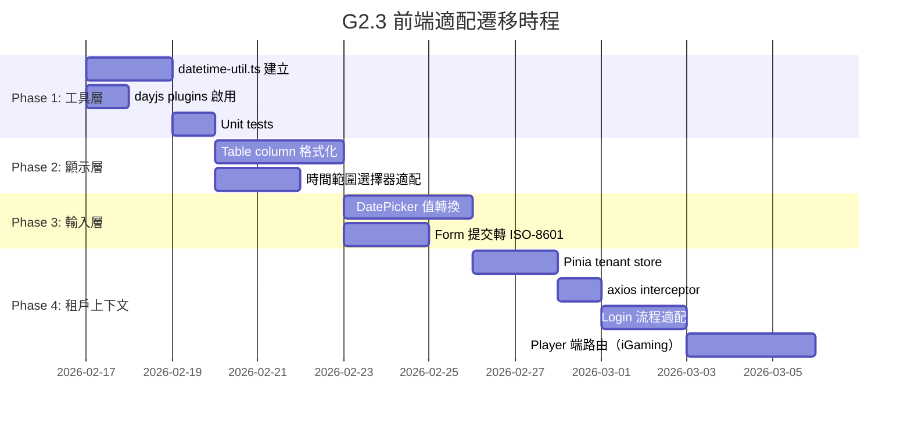

# G2.3 前端 ISO-8601 + 多租戶 UI 適配規格

> **版本**: 1.0.0
> **XREF**: [前端架構](../architecture/11_Frontend/README.md)
> **狀態**: 📋 規格文件（供前端團隊執行）
> **前置依賴**: G2（OffsetDateTime 遷移）✅、G1（TenantFilter）✅、G13（雙帳戶體系）✅
> **最後更新**: 2026-02-14

---

## 1. 概述

### 1.1 背景

後端已完成 18/20 個 iGaming 基礎設施缺口。G2.3 是最後一個 Phase 0 前置項目，需要前端團隊配合適配以下兩大變更：

1. **時間格式遷移**：API 時間欄位從 `"2026-02-14 10:30:00"` 遷移至 ISO-8601 `"2026-02-14T18:30:00+08:00"`
2. **多租戶上下文**：前端需處理 `tenantId` + `timezone` 上下文傳遞

### 1.2 後端變更摘要

| 項目 | 舊行為 | 新行為 |
|------|--------|--------|
| API Response 時間格式 | `"2026-02-14 10:30:00"` | `"2026-02-14T18:30:00+08:00"` (ISO-8601) |
| 儲存格式 | `DATETIME` (MySQL implicit) | `TIMESTAMPTZ` (PostgreSQL, UTC 儲存) |
| 序列化器 | `SmartDateFormatterEnum` | `TenantTimezoneSerializer` (ISO-8601 with offset) |
| 反序列化 | `"yyyy-MM-dd HH:mm:ss"` only | ISO-8601 優先 + 舊格式 fallback（自動假設 UTC） |
| 租戶識別 | 無 | HTTP Host header subdomain (e.g., `tenant1.example.com`) |
| Token 體系 | 單一 `StpUtil` | `StpAdminUtil`（後台）/ `StpPlayerUtil`（玩家端） |
| Session 數據 | 無 tenant | `tenantId` + `timezone` 自動綁定至 Sa-Token Session |

### 1.3 關鍵特性

**後端已保證**：API response 的時間已自動轉為租戶時區（非 UTC），前端直接顯示即可，無需再做時區轉換。

**後端轉換邏輯**（`TenantTimezoneSerializer`）：
```java
// 自動將 UTC 時間轉為租戶時區
OffsetDateTime tenantTime = value.atZoneSameInstant(tenantZone).toOffsetDateTime();
gen.writeString(tenantTime.format(DateTimeFormatter.ISO_OFFSET_DATE_TIME));
// 輸出範例：「2026-02-14T18:30:00+08:00」（Asia/Taipei 時區）
```

### 1.4 影響範圍

| 影響類別 | 影響說明 |
|----------|----------|
| 時間欄位顯示 | 所有 list 頁面的時間 column 格式化 |
| 表單 DatePicker | 提交時需轉為 ISO-8601 格式 |
| 時間範圍選擇器 | `default-time-ranges.ts` 需支援租戶時區 |
| API 請求 | axios interceptor 需注入租戶 headers |
| 登入流程 | Login response 擴展 tenant context |
| 狀態管理 | Pinia store 需新增 tenantId + timezone |
| 路由 | Player 端需獨立路由（iGaming） |

---

## 2. 時間處理適配

### 2.1 ISO-8601 解析工具

#### 2.1.1 安裝 dayjs 插件

```bash
# dayjs 已在專案中，只需啟用 plugins
npm install dayjs  # 如尚未安裝
```

#### 2.1.2 建立 `src/lib/datetime-util.ts`

```typescript
/**
 * ISO-8601 時間處理工具
 *
 * 後端 API 回傳 ISO-8601 with offset（如 "2026-02-14T18:30:00+08:00"），
 * 已自動轉為租戶時區，前端只需解析並格式化顯示。
 */
import dayjs from 'dayjs';
import utc from 'dayjs/plugin/utc';
import timezone from 'dayjs/plugin/timezone';
import customParseFormat from 'dayjs/plugin/customParseFormat';

// 啟用 plugins
dayjs.extend(utc);
dayjs.extend(timezone);
dayjs.extend(customParseFormat);

/** 顯示格式常量 */
export const DISPLAY_FORMAT = {
  /** 完整日期時間：2026-02-14 18:30:00 */
  DATETIME: 'YYYY-MM-DD HH:mm:ss',
  /** 僅日期：2026-02-14 */
  DATE: 'YYYY-MM-DD',
  /** 僅時間：18:30:00 */
  TIME: 'HH:mm:ss',
  /** 日期時間（不含秒）：2026-02-14 18:30 */
  DATETIME_SHORT: 'YYYY-MM-DD HH:mm',
} as const;

/**
 * 解析 API 回傳的 ISO-8601 時間字串
 *
 * 支援格式：
 * - ISO-8601 with offset: "2026-02-14T18:30:00+08:00"（新格式）
 * - 舊格式 fallback: "2026-02-14 10:30:00"（遷移期間兼容）
 *
 * @param value API 回傳的時間字串
 * @returns dayjs 實例，如果 value 為 null/undefined 則返回 null
 */
export function parseApiDateTime(value: string | null | undefined): dayjs.Dayjs | null {
  if (!value) return null;
  // dayjs 能自動識別 ISO-8601 格式
  const parsed = dayjs(value);
  if (parsed.isValid()) return parsed;
  // 嘗試舊格式 fallback
  const legacy = dayjs(value, 'YYYY-MM-DD HH:mm:ss');
  return legacy.isValid() ? legacy : null;
}

/**
 * 格式化 API 時間為顯示字串
 *
 * 後端已將時間轉為租戶時區，前端直接 format 即可，無需再做時區轉換。
 *
 * @param value API 回傳的 ISO-8601 時間字串
 * @param format 顯示格式（默認完整日期時間）
 * @returns 格式化字串，如 "2026-02-14 18:30:00"
 */
export function formatDateTime(
  value: string | null | undefined,
  format: string = DISPLAY_FORMAT.DATETIME
): string {
  const parsed = parseApiDateTime(value);
  return parsed ? parsed.format(format) : '';
}

/**
 * 格式化 API 時間為僅日期
 *
 * @param value API 回傳的 ISO-8601 時間字串
 * @returns "2026-02-14"
 */
export function formatDate(value: string | null | undefined): string {
  return formatDateTime(value, DISPLAY_FORMAT.DATE);
}

/**
 * 將 DatePicker 選取的本地時間轉為 ISO-8601 字串（提交 API 用）
 *
 * @param value dayjs 實例（來自 a-date-picker v-model）
 * @returns ISO-8601 字串，如 "2026-02-14T18:30:00+08:00"
 */
export function toApiDateTime(value: dayjs.Dayjs | null | undefined): string | null {
  if (!value) return null;
  return value.format(); // dayjs.format() 預設輸出 ISO-8601
}

/**
 * 比較兩個 API 時間（跨時區安全）
 *
 * @param a ISO-8601 時間字串 A
 * @param b ISO-8601 時間字串 B
 * @returns 負數（A<B）、0（相等）、正數（A>B）
 */
export function compareApiDateTime(
  a: string | null | undefined,
  b: string | null | undefined
): number {
  const parsedA = parseApiDateTime(a);
  const parsedB = parseApiDateTime(b);
  if (!parsedA && !parsedB) return 0;
  if (!parsedA) return -1;
  if (!parsedB) return 1;
  return parsedA.valueOf() - parsedB.valueOf();
}
```

### 2.2 表格時間欄位格式化

#### 2.2.1 Ant Design Vue Table Column Formatter

**現狀**：各 `*-list.vue` 使用 `customRender` 或直接顯示後端回傳的時間字串。

**變更**：統一使用 `formatDateTime()` 處理所有時間欄位。

```vue
<template>
  <a-table :columns="columns" :data-source="dataSource">
    <!-- 時間欄位使用 slot 格式化 -->
    <template #bodyCell="{ column, record }">
      <template v-if="column.dataIndex === 'createTime'">
        {{ formatDateTime(record.createTime) }}
      </template>
    </template>
  </a-table>
</template>

<script setup lang="ts">
import { formatDateTime } from '/@/lib/datetime-util';

const columns = [
  // ... 其他欄位
  {
    title: '創建時間',
    dataIndex: 'createTime',
    // 如果使用 sorter，需用 compareApiDateTime
    sorter: (a, b) => compareApiDateTime(a.createTime, b.createTime),
  },
];
</script>
```

#### 2.2.2 影響的 List 頁面

以下頁面含時間欄位需要更新（依模組列出）：

| 模組 | 頁面 | 時間欄位 |
|------|------|----------|
| system | employee-list | `createTime`, `lastLoginTime` |
| system | role-list | `createTime`, `updateTime` |
| system | menu-list | `createTime`, `updateTime` |
| support | operate-log-list | `createTime` |
| support | login-log-list | `createTime` |
| support | change-log-list | `createTime`, `publicDate` |
| support | feedback-list | `createTime` |
| support | heart-beat-list | `heartBeatTime` |
| support | login-fail-list | `createTime`, `lockBeginTime` |
| business | notice-list | `publishTime`, `createTime` |
| business | enterprise-list | `createTime` |
| oa | invoice-list | `createTime` |

> **提示**：可全域搜尋 `createTime`、`updateTime`、`Time` 關鍵字找出所有需修改的 column。

### 2.3 表單 DatePicker 適配

#### 2.3.1 a-date-picker 值轉換

**現狀**：DatePicker 的 `v-model` 直接綁定 dayjs 實例，提交時 format 為 `"yyyy-MM-dd HH:mm:ss"`。

**變更**：提交時改用 `toApiDateTime()` 轉換。

```vue
<template>
  <a-date-picker
    v-model:value="form.startTime"
    show-time
    format="YYYY-MM-DD HH:mm:ss"
    value-format="YYYY-MM-DDTHH:mm:ssZ"
  />
</template>

<script setup lang="ts">
import { toApiDateTime } from '/@/lib/datetime-util';

// 提交表單時
async function handleSubmit() {
  const submitData = {
    ...form,
    startTime: toApiDateTime(form.startTime),
    endTime: toApiDateTime(form.endTime),
  };
  await api.submit(submitData);
}
</script>
```

#### 2.3.2 時區指示器 UI（建議）

在 DatePicker 旁顯示當前租戶時區，避免混淆：

```vue
<template>
  <a-space>
    <a-date-picker v-model:value="form.startTime" show-time />
    <a-tag color="blue">{{ tenantTimezone }}</a-tag>
  </a-space>
</template>

<script setup lang="ts">
import { useTenantStore } from '/@/store/modules/system/tenant';

const tenantStore = useTenantStore();
const tenantTimezone = computed(() => tenantStore.timezone || 'UTC');
</script>
```

### 2.4 時間範圍選擇器

#### 2.4.1 現狀分析

目前 `src/lib/default-time-ranges.ts` 使用 `dayjs()` 直接取瀏覽器本地時間：

```typescript
// 現有寫法 - 使用瀏覽器時區
export const defaultTimeRanges = ref([
  { label: '今日', value: [dayjs(), dayjs()] },
  { label: '昨日', value: [dayjs().subtract(1, 'days'), dayjs().subtract(1, 'days')] },
  // ...
]);
```

#### 2.4.2 適配方案

改用租戶時區建立 dayjs 實例：

```typescript
import dayjs from 'dayjs';
import utc from 'dayjs/plugin/utc';
import timezone from 'dayjs/plugin/timezone';
import { ref, computed } from 'vue';

dayjs.extend(utc);
dayjs.extend(timezone);

/**
 * 基於租戶時區的「現在」時間
 *
 * @param tz IANA 時區字串（如 "Asia/Taipei"）
 */
function nowInTz(tz: string) {
  return dayjs().tz(tz);
}

/**
 * 建立租戶時區感知的時間範圍選項
 *
 * @param timezone 租戶時區（IANA 格式）
 */
export function createTimeRanges(timezone: string) {
  const now = () => nowInTz(timezone);
  return ref([
    { label: '今日', value: [now().startOf('day'), now().endOf('day')] },
    {
      label: '昨日',
      value: [
        now().subtract(1, 'day').startOf('day'),
        now().subtract(1, 'day').endOf('day'),
      ],
    },
    {
      label: '本月',
      value: [now().startOf('month'), now().endOf('month')],
    },
    {
      label: '上個月',
      value: [
        now().subtract(1, 'month').startOf('month'),
        now().subtract(1, 'month').endOf('month'),
      ],
    },
    {
      label: '本年度',
      value: [now().startOf('year'), now().endOf('year')],
    },
  ]);
}
```

### 2.5 時間比較與計算

#### 2.5.1 跨時區安全寫法

**原則**：永遠使用 `dayjs(isoString).valueOf()`（Unix timestamp）做比較，不依賴瀏覽器時區。

```typescript
// ✅ 安全：基於 Unix timestamp 比較（時區無關）
const isExpired = dayjs(record.expireTime).valueOf() < Date.now();

// ✅ 安全：dayjs 自動處理 offset
const diff = dayjs(endTime).diff(dayjs(startTime), 'hours');

// ❌ 危險：字串比較可能因時區不同而錯誤
const isExpired = record.expireTime < new Date().toISOString(); // 不要這樣做
```

#### 2.5.2 避免 Browser Timezone 假設

```typescript
// ❌ 錯誤：假設瀏覽器時區 = 租戶時區
const today = dayjs().format('YYYY-MM-DD');

// ✅ 正確：使用租戶時區
const today = dayjs().tz(tenantTimezone).format('YYYY-MM-DD');
```

### 2.6 向後兼容

#### 2.6.1 遷移期間雙格式支援

後端已在 `JsonConfig.java` 中配置 fallback 反序列化：

```java
// 後端 StringToOffsetDateTime 轉換器
// 優先解析 ISO-8601："2026-02-14T18:30:00+08:00"
// Fallback 解析舊格式："2026-02-14 10:30:00"（自動假設 UTC）
```

前端的 `parseApiDateTime()` 同樣支援雙格式解析，確保遷移期間舊 API 回應也能正常顯示。

#### 2.6.2 判斷 API 回傳格式

```typescript
/**
 * 判斷時間字串是否為 ISO-8601 格式
 */
export function isIso8601(value: string): boolean {
  return value.includes('T') && (value.includes('+') || value.includes('Z'));
}
```

---

## 3. 多租戶 UI 適配

### 3.1 租戶上下文管理

#### 3.1.1 新增 Pinia Store: `src/store/modules/system/tenant.ts`

```typescript
import { defineStore } from 'pinia';
import { localRead, localSave, localRemove } from '/@/utils/local-util';

const KEY_PREFIX = 'smart_admin_';

export const useTenantStore = defineStore({
  id: 'tenantStore',
  state: () => ({
    /** 租戶 ID（從 Login response 或 subdomain 提取） */
    tenantId: null as number | null,
    /** 租戶時區（IANA 格式，如 "Asia/Taipei"） */
    timezone: '' as string,
    /** 租戶編碼（subdomain，如 "tenant1"） */
    tenantCode: '' as string,
  }),
  getters: {
    getTenantId(state): number | null {
      if (state.tenantId) return state.tenantId;
      const stored = localRead(`${KEY_PREFIX}tenant_id`);
      return stored ? Number(stored) : null;
    },
    getTimezone(state): string {
      if (state.timezone) return state.timezone;
      return localRead(`${KEY_PREFIX}tenant_timezone`) || 'UTC';
    },
    getTenantCode(state): string {
      if (state.tenantCode) return state.tenantCode;
      return localRead(`${KEY_PREFIX}tenant_code`) || 'default';
    },
  },
  actions: {
    /**
     * 設定租戶上下文（Login 成功後調用）
     */
    setTenantContext(data: { tenantId: number; timezone: string; tenantCode: string }) {
      this.tenantId = data.tenantId;
      this.timezone = data.timezone;
      this.tenantCode = data.tenantCode;
      localSave(`${KEY_PREFIX}tenant_id`, String(data.tenantId));
      localSave(`${KEY_PREFIX}tenant_timezone`, data.timezone);
      localSave(`${KEY_PREFIX}tenant_code`, data.tenantCode);
    },
    /**
     * 從 Host header subdomain 自動提取租戶編碼
     */
    extractTenantFromHost(): string {
      const hostname = window.location.hostname;
      // 範例：tenant1.example.com → "tenant1"
      // localhost → "default"
      if (hostname === 'localhost' || hostname === '127.0.0.1') {
        return 'default';
      }
      const parts = hostname.split('.');
      return parts.length >= 3 ? parts[0] : 'default';
    },
    /**
     * 清除租戶上下文（Logout 時調用）
     */
    clearTenantContext() {
      this.tenantId = null;
      this.timezone = '';
      this.tenantCode = '';
      localRemove(`${KEY_PREFIX}tenant_id`);
      localRemove(`${KEY_PREFIX}tenant_timezone`);
      localRemove(`${KEY_PREFIX}tenant_code`);
    },
  },
});
```

#### 3.1.2 localStorage Key 擴展

在 `local-storage-key-const.ts` 新增：

```typescript
export default {
  // ... 現有 keys
  // 多租戶
  TENANT_ID: `${KEY_PREFIX}tenant_id`,
  TENANT_TIMEZONE: `${KEY_PREFIX}tenant_timezone`,
  TENANT_CODE: `${KEY_PREFIX}tenant_code`,
};
```

### 3.2 Login 頁面適配

#### 3.2.1 Subdomain Routing 說明

**後端邏輯**（`TenantFilter`）：
```
HTTP Request: Host: tenant1.example.com
                     ↓
TenantFilter: 提取 subdomain "tenant1"
                     ↓
TenantContext.setTenantId(tenantId)
TenantContext.setTimezone(tenantTimezone)
```

**前端不需要改變 Login API 參數**。後端從 HTTP Host header 自動提取租戶，Login 仍是 `{ loginName, password }`。

#### 3.2.2 Login Response 擴展

Login 成功後，前端需從 response 取得 tenant context 並存入 Pinia store：

```typescript
// login.vue
import { useTenantStore } from '/@/store/modules/system/tenant';

async function handleLogin() {
  const result = await loginApi.login({ loginName, password, captchaCode });
  if (result.code === 1) {
    // 現有：設定用戶資訊
    userStore.setUserLoginInfo(result.data);

    // 新增：設定租戶上下文
    const tenantStore = useTenantStore();
    if (result.data.tenantId) {
      tenantStore.setTenantContext({
        tenantId: result.data.tenantId,
        timezone: result.data.timezone || 'UTC',
        tenantCode: tenantStore.extractTenantFromHost(),
      });
    }
  }
}
```

#### 3.2.3 租戶名稱顯示（建議）

Login 頁面可根據 subdomain 顯示租戶名稱，增強使用者辨識：

```vue
<template>
  <div class="login-container">
    <div v-if="tenantName" class="tenant-badge">
      {{ tenantName }}
    </div>
    <!-- 現有 login form -->
  </div>
</template>
```

### 3.3 API 請求 Header

#### 3.3.1 axios Interceptor 注入租戶 Headers

修改 `src/lib/axios.ts` 的 request interceptor：

```typescript
// ================================= 請求攔截器 =================================
smartAxios.interceptors.request.use(
  (config) => {
    // 現有：Token header
    const token = localRead(LocalStorageKeyConst.USER_TOKEN);
    if (token) {
      config.headers[TOKEN_HEADER] = 'Bearer ' + token;
    } else {
      delete config.headers[TOKEN_HEADER];
    }

    // 新增：租戶 Headers
    // 注意：subdomain 模式下 Host header 會自動攜帶，
    // 但為了開發環境（localhost）的兼容性，顯式注入 X-Tenant-Id
    const tenantId = localRead(LocalStorageKeyConst.TENANT_ID);
    if (tenantId) {
      config.headers['X-Tenant-Id'] = tenantId;
    }

    // 注入時區（IANA 格式）
    const timezone = localRead(LocalStorageKeyConst.TENANT_TIMEZONE);
    if (timezone) {
      config.headers['X-Timezone'] = timezone;
    }

    return config;
  },
  (error) => {
    return Promise.reject(error);
  }
);
```

#### 3.3.2 Host Header 自動攜帶（Production）

在 Production 環境中，subdomain routing 會讓瀏覽器自動在 HTTP 請求中包含正確的 Host header：

```
https://tenant1.example.com/api/login
→ Host: tenant1.example.com
→ TenantFilter 提取 "tenant1"
```

開發環境（localhost）則靠 `X-Tenant-Id` header 傳遞。

### 3.4 Player 端認證（iGaming 專用）

#### 3.4.1 StpPlayerUtil Token Namespace

後端雙帳戶體系：

| 帳戶類型 | Token 工具 | Sa-Token Type | Redis Key Prefix | 使用場景 |
|----------|-----------|---------------|-------------------|----------|
| Admin | `StpAdminUtil` | `"login"` | `sa:login:` | 後台管理系統 |
| Player | `StpPlayerUtil` | `"player"` | `sa:player:` | 玩家端（iGaming） |

前端需使用不同的 localStorage key 儲存 Token：

```typescript
// local-storage-key-const.ts
export default {
  // Admin token（現有）
  USER_TOKEN: `${KEY_PREFIX}user_token`,
  // Player token（新增 - iGaming）
  PLAYER_TOKEN: `${KEY_PREFIX}player_token`,
};
```

#### 3.4.2 Player Login API Endpoint

```typescript
// src/api/igaming/player-login-api.ts（新增）
export const playerLoginApi = {
  login: (param) => postRequest('/player/login', param),
  logout: () => getRequest('/player/login/logout'),
  getLoginInfo: () => getRequest('/player/login/getLoginInfo'),
};
```

#### 3.4.3 Player/Admin 路由分離

```typescript
// router/index.ts
const adminRoutes = [
  // 現有後台路由
];

const playerRoutes = [
  {
    path: '/player',
    children: [
      { path: 'login', component: () => import('/@/views/igaming/player-login.vue') },
      { path: 'lobby', component: () => import('/@/views/igaming/player-lobby.vue') },
      // ... iGaming 玩家端頁面
    ],
  },
];
```

#### 3.4.4 axios 實例分離

建議為 Player 端建立獨立的 axios 實例：

```typescript
// src/lib/player-axios.ts
const PLAYER_TOKEN_HEADER = 'Authorization';

const playerAxios = axios.create({
  baseURL: import.meta.env.VITE_APP_API_URL,
});

playerAxios.interceptors.request.use((config) => {
  const token = localRead(LocalStorageKeyConst.PLAYER_TOKEN);
  if (token) {
    config.headers[PLAYER_TOKEN_HEADER] = 'Bearer ' + token;
  }
  // 同樣注入租戶 headers
  const tenantId = localRead(LocalStorageKeyConst.TENANT_ID);
  if (tenantId) {
    config.headers['X-Tenant-Id'] = tenantId;
  }
  return config;
});
```

---

## 4. 影響檔案清單

### 4.1 P0（必須修改 - 基礎設施）

| 檔案 | 變更說明 |
|------|----------|
| `src/lib/datetime-util.ts` | **新增**：ISO-8601 解析/格式化工具 |
| `src/lib/axios.ts` | **修改**：request interceptor 注入 `X-Tenant-Id` + `X-Timezone` |
| `src/lib/default-time-ranges.ts` | **修改**：改用租戶時區建立時間範圍 |
| `src/store/modules/system/tenant.ts` | **新增**：租戶 Pinia store |
| `src/constants/local-storage-key-const.ts` | **修改**：新增 `TENANT_ID`, `TENANT_TIMEZONE`, `TENANT_CODE` |
| `src/api/system/login-api.ts` | **修改**：Login response 處理 tenant context |

### 4.2 P1（重要 - 顯示層）

| 檔案 | 變更說明 |
|------|----------|
| 所有 `*-list.vue` 含時間欄位 | **修改**：使用 `formatDateTime()` 格式化 |
| `src/views/system/login/login.vue` | **修改**：Login 成功後設定 tenant context |
| `src/store/modules/system/user.ts` | **修改**：`logout()` 中加入 `tenantStore.clearTenantContext()` |

### 4.3 P2（次要 - 輸入層）

| 檔案 | 變更說明 |
|------|----------|
| 所有含 `a-date-picker` 的表單 | **修改**：提交時用 `toApiDateTime()` 轉換 |
| `a-range-picker` 組件使用處 | **修改**：確保 value-format 為 ISO-8601 |

### 4.4 P3（iGaming 專用 - Player 端）

| 檔案 | 變更說明 |
|------|----------|
| `src/api/igaming/player-login-api.ts` | **新增**：Player login API |
| `src/lib/player-axios.ts` | **新增**：Player axios 實例 |
| `src/views/igaming/player-login.vue` | **新增**：Player login 頁面 |
| `src/router/igaming/player.ts` | **新增**：Player 路由 |

---

## 5. 測試驗證

### 5.1 多時區測試案例

| 測試場景 | 預期結果 |
|----------|----------|
| 租戶時區 Asia/Taipei，API 回傳 `"2026-02-14T18:30:00+08:00"` | 表格顯示 `2026-02-14 18:30:00` |
| 租戶時區 America/New_York，API 回傳 `"2026-02-14T05:30:00-05:00"` | 表格顯示 `2026-02-14 05:30:00` |
| 舊格式 fallback `"2026-02-14 10:30:00"` | 正常解析並顯示（遷移期間兼容） |
| DatePicker 選取 `2026-02-14 18:30:00` 提交 | API 收到 ISO-8601 格式字串 |
| 「今日」快捷選擇 | 基於租戶時區（非瀏覽器時區）計算 |

### 5.2 時間格式驗證腳本

```typescript
// tests/datetime-util.test.ts
import { formatDateTime, parseApiDateTime, toApiDateTime, compareApiDateTime } from '@/lib/datetime-util';

describe('datetime-util', () => {
  test('解析 ISO-8601 with offset', () => {
    const result = formatDateTime('2026-02-14T18:30:00+08:00');
    expect(result).toBe('2026-02-14 18:30:00');
  });

  test('解析舊格式 fallback', () => {
    const result = formatDateTime('2026-02-14 10:30:00');
    expect(result).toBe('2026-02-14 10:30:00');
  });

  test('null 值返回空字串', () => {
    expect(formatDateTime(null)).toBe('');
    expect(formatDateTime(undefined)).toBe('');
  });

  test('跨時區比較', () => {
    // 同一時刻，不同時區表示
    const tokyo = '2026-02-15T03:30:00+09:00';
    const utc = '2026-02-14T18:30:00Z';
    expect(compareApiDateTime(tokyo, utc)).toBe(0);
  });

  test('DatePicker 值轉 API 格式', () => {
    const dayjs = require('dayjs');
    const value = dayjs('2026-02-14T18:30:00');
    const result = toApiDateTime(value);
    expect(result).toContain('2026-02-14');
    expect(result).toContain('T');
  });
});
```

### 5.3 租戶切換測試場景

| 測試場景 | 驗證重點 |
|----------|----------|
| tenant1.example.com 登入 | `X-Tenant-Id` header 正確注入 |
| localhost 開發環境登入 | `X-Tenant-Id` 從 localStorage 讀取 |
| 登出後清除 tenant context | localStorage 中 `tenant_*` keys 已移除 |
| 切換 tenant 重新登入 | tenant context 正確更新 |
| 瀏覽器時區 ≠ 租戶時區 | 時間顯示基於租戶時區 |

---

## 6. 遷移策略

### 6.1 四階段遷移



### 6.2 各階段說明

#### Phase 1: 工具層（2 天）

- 建立 `datetime-util.ts`
- 啟用 dayjs utc + timezone + customParseFormat plugins
- 撰寫 unit tests 確保 ISO-8601 解析正確

**驗證標準**：所有 `datetime-util.test.ts` 測試通過。

#### Phase 2: 顯示層（3 天）

- 所有 list 頁面時間欄位改用 `formatDateTime()`
- `default-time-ranges.ts` 改用 `createTimeRanges(timezone)`
- 時間排序改用 `compareApiDateTime()`

**驗證標準**：所有 list 頁面時間欄位正確顯示 ISO-8601 格式。

#### Phase 3: 輸入層（3 天）

- `a-date-picker` / `a-range-picker` 提交值改用 `toApiDateTime()`
- 確認 `value-format` 為 ISO-8601 兼容格式
- 可選：新增時區指示器 UI

**驗證標準**：DatePicker 提交的時間字串為 ISO-8601 格式。

#### Phase 4: 租戶上下文（4 天）

- 建立 `tenant.ts` Pinia store
- 修改 `axios.ts` interceptor 注入 `X-Tenant-Id` + `X-Timezone`
- 修改 Login 流程取得並儲存 tenant context
- iGaming 專用：Player 端路由 + axios 實例

**驗證標準**：跨租戶登入時 API 請求攜帶正確 headers。

---

## 附錄 A: 後端關鍵檔案參考

| 檔案 | 說明 | 路徑 |
|------|------|------|
| `TenantTimezoneSerializer` | UTC → 租戶時區序列化 | `smartadmin-common-web/.../json/serializer/` |
| `JsonConfig` | OffsetDateTime serializer 註冊 + 舊格式 fallback | `smartadmin-common-web/.../json/` |
| `TenantFilter` | Host header → tenant 提取 | `smartadmin-common-tenant/.../filter/` |
| `TenantContext` | tenantId + timezone ThreadLocal | `smartadmin-common-core/.../tenant/` |
| `StpAdminUtil` | Admin token 工具 | `smartadmin-common/.../token/admin/` |
| `StpPlayerUtil` | Player token 工具 | `smartadmin-common/.../token/player/` |
| `SaTokenSessionConst` | Session key 常量 | `smartadmin-common/.../token/constant/` |
| `LoginService` | Login + bindTenantToSession() | `smartadmin-system/.../login/service/` |

## 附錄 B: API Response 範例

### Login Response（擴展後）

```json
{
  "code": 1,
  "data": {
    "token": "eyJ0eXAiOiJKV1QiLCJ...",
    "employeeId": 1,
    "loginName": "admin",
    "actualName": "管理員",
    "tenantId": 1,
    "timezone": "Asia/Taipei",
    "menuList": [...]
  },
  "msg": "success",
  "success": true
}
```

### 時間欄位 Response 範例

```json
{
  "code": 1,
  "data": {
    "employeeId": 1,
    "actualName": "張三",
    "createTime": "2026-02-14T18:30:00+08:00",
    "updateTime": "2026-02-14T20:15:30+08:00",
    "lastLoginTime": "2026-02-14T22:00:00+08:00"
  }
}
```
