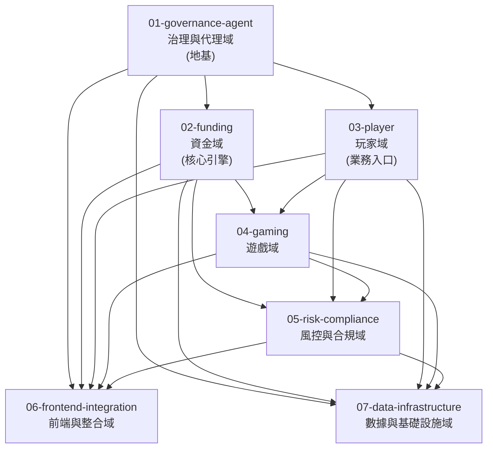

<!-- SPLIT_MANIFEST
01-governance-agent
02-funding
03-player
04-gaming
05-risk-compliance
06-frontend-integration
07-data-infrastructure
END_MANIFEST -->

# Project Manifest — iGaming Platform Requirements Decomposition

**Created**: 2026-03-26
**Source**: 200_專案/IGaming/README.md
**Method**: First-principles review → Business domain grouping

---

## Overview

將 iGaming 平台的 16 章需求文檔（v5.x）重新按業務域分群為 **7 個 split**，每個 split 可獨立進入 /deep-plan 進行深度規劃。

Ch0 總覽 (`requirements/00_Overview_總覽.md`) 作為**跨域 SSOT 參考**，不獨立成 split，而是被所有 split 引用。

---

## Split Structure

### 01-governance-agent — 治理與代理域

| 屬性 | 值 |
|------|---|
| **涵蓋章節** | Ch7 治理與牌照 + Ch8 代理營運 |
| **核心職責** | 多租戶四層架構、RBAC 權限、MFA、白標客製、計費、代理信用網路、佣金結算 |
| **為何放第一** | 多租戶架構是全平台的地基，所有業務模組依賴 `tenant_id` 隔離和 RBAC 權限體系 |
| **複雜度** | 高 — 四層租戶層級 × 10 層代理 × 多佣金模型 |

**關鍵需求**:
- 四層租戶層級 (Platform → Brand → Tenant → Agent)
- 數據 100% 隔離，效能開銷 < 5%
- 代理最多 10 層，信用額度由上而下分配
- 4 種佣金模型 (收益分成/流水返佣/CPA/混合)
- 大額結算分級審批 (已量化門檻)
- 代理帳戶 MFA + IP 白名單 (v2.2 新增)

---

### 02-funding — 資金域

| 屬性 | 值 |
|------|---|
| **涵蓋章節** | Ch2 錢包系統 + Ch3 支付系統 |
| **核心職責** | 三類錢包管理、可下注餘額計算、Seamless Wallet 協議、九大交易情境、PSP 智慧路由、存提款、對帳 |
| **為何第二** | 錢包是核心業務引擎，遊戲和促銷都依賴錢包；支付是玩家入金的唯一通道 |
| **複雜度** | 極高 — Seamless Wallet 5 端點 × 9 大交易情境 × 多幣種 × 併發控制 |

**關鍵需求**:
- CASH / BONUS / CREDIT 三類錢包
- 可下注餘額 99.99% 準確率
- 扣款順序: **BONUS → CASH → CREDIT** (SSOT, Ch2 §2.7 情境 H 描述需修正)
- Seamless Wallet 5 端點冪等性
- 亂序請求暫存策略 (策略 3 推薦)
- 多幣種「存款即兌換」+ FX 風險分攤矩陣 (v2.2 SSOT)
- 出金流水驗證時序 (v2.2 新增)
- PSP 智慧路由 (成功率 50% + 手續費 30% + 速度 15% + VIP 5%)
- Chargeback 生命週期管理 + 3D Secure

**已知衝突待修正**:
- ⚠️ Ch2 §2.7 情境 H 扣款順序描述 (CASH 先扣) 與 §2.4 預設 (BONUS 先扣) 矛盾 → 以 §2.4 為準

---

### 03-player — 玩家域

| 屬性 | 值 |
|------|---|
| **涵蓋章節** | Ch1 玩家管理 + Ch15 負責任博彩 + Ch12 客戶服務 |
| **核心職責** | 玩家生命週期、KYC 四級驗證、VIP 分級、RFM 分群、自我排除、限額管理、可負擔性評估、360° 客服 |
| **為何第三** | 玩家是所有業務流程的入口，下游模組依賴玩家資料作為決策基礎 |
| **複雜度** | 高 — KYC 多管轄區差異 × 自我排除多資料庫 × VIP 5 級 × 客服多管道 |

**關鍵需求**:
- 玩家生命週期 7 狀態機
- KYC 四級驗證 (L0–L3) + 多管轄區差異 (UKGC/MGA/PAGCOR/Curaçao)
- VIP 5 級 + 升降級規則 + 降級保護期
- RFM 分群矩陣 (每日更新)
- 自我排除 (GAMSTOP/CRUKS/Spelpaus/ROFUS) — **此為自我排除 SSOT**
- 可負擔性三級評估 (UKGC 2025)
- AI Chatbot + 360° 玩家視圖 + VIP 差異化 SLA

**SSOT 持有**:
- KYC 四級驗證規則 → Ch1 (此 split)
- 自我排除機制 → Ch15 (此 split)
- 問題博彩預警 → Ch15 (此 split)

**SSOT 引用 (不重複定義)**:
- AML/SAR 流程 → 引用風控域 (Ch6)
- GDPR 刪除/保留 → 引用風控合規域 (Ch13)
- VIP 返水率 → 引用遊戲域 (Ch5)

---

### 04-gaming — 遊戲域

| 屬性 | 值 |
|------|---|
| **涵蓋章節** | Ch4 遊戲整合 + Ch5 促銷與VIP |
| **核心職責** | GP 接入標準、Token 驗證、遊戲大廳、RTP 監控、紅利類型管理、流水要求計算、衝突策略、濫用偵測 |
| **為何第四** | 遊戲整合需要錢包 (Seamless Wallet) 和玩家 (Token) 作為基礎 |
| **複雜度** | 高 — GP Adapter 標準化 × 7 種紅利 × 流水三層驗證 × 濫用偵測 |

**關鍵需求**:
- GP 接入 < 5 工作天 (技術對接)
- Token HMAC-SHA256, 5 分鐘有效, 一次性
- RTP 監控 + 異常自動暫停 (Circuit Breaker)
- 7 種紅利類型 + 多段歡迎套餐
- 流水三層驗證架構 (投注驗證/累計/提款驗證)
- 紅利衝突 6 種策略 (MAX_REWARD/PRIORITY/PLAYER_CHOICE/STACK_ALL/TYPE_EXCLUSIVE/SEQUENTIAL)
- 區域化促銷 (東南亞/拉美/歐洲)

**SSOT 持有**:
- 遊戲權重表/流水貢獻率 → Ch5 §5.3
- VIP 返水率 → Ch5 §5.6
- 紅利衝突策略 → Ch5 §5.4

**已知衝突待確認**:
- ⏳ Ch0 §0.8 Sports 遊戲權重 100% vs Ch5 §5.3 Sports 流水貢獻率 50% — 可能為不同概念，待確認

**缺漏待補充**:
- ⏳ 體育博彩引擎 (Sports Betting Engine) — 盤口/賠率/即時結算/Partial Cashout 完整業務規則

---

### 05-risk-compliance — 風控與合規域

| 屬性 | 值 |
|------|---|
| **涵蓋章節** | Ch6 風控與合規 + Ch13 安全合規 |
| **核心職責** | 五層偵測管線、風險評分、詐欺偵測、人工審核工作流、GDPR、PCI-DSS、加密標準 |
| **為何第五** | 需要所有業務數據（玩家、交易、投注、設備）作為風控輸入 |
| **複雜度** | 極高 — 五層管線 × 七維評估 × 多管轄區 AML × GDPR vs AML 衝突解決 |

**關鍵需求**:
- 五層偵測管線 (同步阻斷 → 交易處理 → 異步風控 → 人工審核 → 提款延遲)
- 風險分數邊界: [0,30) AUTO_APPROVE / [30,70) MANUAL_REVIEW / [70,100] AUTO_REJECT
- 複合風險升級 (v2.2: ≥3 MEDIUM → HIGH, ≥2 HIGH → URGENT)
- ML 加權輔助層 (Phase 3, 60% 規則 + 40% ML)
- 多帳戶偵測 + 串謀偵測 + Bot 偵測
- GDPR 資料主體權利 + 加密銷毀 (Crypto-shredding)
- PCI-DSS Level 1
- PII 加密分級 + 角色脫敏矩陣
- 加密金鑰輪替策略 (KEK 365天 / DEK 90天)

**SSOT 持有**:
- AML/SAR 流程 → Ch6 §6.14
- 風險分數邊界 → Ch6 §6.6
- GDPR 刪除/保留 → Ch13 §13.2
- 設備指紋偵測 → Ch6 §6.9
- 加密標準 → Ch13 §13.4

---

### 06-frontend-integration — 前端與整合域

| 屬性 | 值 |
|------|---|
| **涵蓋章節** | Ch11 前端體驗 + Ch14 第三方整合 |
| **核心職責** | 多語言、行動 App、SEO、CMS、統一適配層、Webhook 重試、API 金鑰管理、服務降級 |
| **為何第六** | 前端整合所有後端功能；第三方整合是平台對外的標準化介面層 |
| **複雜度** | 中高 — 6+ 語言 × 多終端 × 第三方容錯 × App Store 合規 |

**關鍵需求**:
- 6+ 語言支援 (zh-CN, en-US, vi-VN, th-TH, pt-BR, ja-JP)
- Core Web Vitals (LCP < 2.5s, CLS < 0.1)
- App Store 博彩合規 (Apple 5.3.4 / Google 博彩政策)
- 統一 Adapter 層 — 所有第三方透過統一介面接入
- Webhook 指數退避重試 (6 次) + 冪等性 + DLQ
- API 金鑰輪替 (PSP 90天 / 內部 30天)
- PSP SLA vs 平台 RTO 兼容性 — Circuit Breaker + 備援切換 < 30 秒
- 第三方資料駐留合規 (GDPR/Schrems II, v2.2 待法務確認)

**缺漏待補充**:
- ⏳ 通知中心 (Notification Hub) — 統一 push/SMS/email/in-app 策略
- ⏳ 後台管理 UX (Admin UX) — CMS/活動建立/客服工具/報表操作的統一後台體驗
- ⏳ Feature Flag / Dark Launch 策略 — 漸進式上線機制

---

### 07-data-infrastructure — 數據與基礎設施域

| 屬性 | 值 |
|------|---|
| **涵蓋章節** | Ch9 分析與報表 + Ch10 基礎設施 |
| **核心職責** | 三路數據路徑、角色化儀表板、合規報表、SLA/DR 三級體系、效能目標、容量規劃 |
| **為何第七** | 報表依賴所有業務數據；基礎設施為底層約束，可與業務開發平行但報表最晚成熟 |
| **複雜度** | 中 — 但跨域依賴最廣，需所有業務模組的數據餵入 |

**關鍵需求**:
- 三路數據路徑: Hot (≤5s) / Warm (5-60s) / Cold (T+1)
- 角色化儀表板 (CEO/CFO/Marketing/CS/Risk/Agent/BI)
- PII 脫敏 — 進入分析層前完成
- 合規報表自動化等級 (全自動/半自動/手動)
- 報表數據修正流程 + 監管報告影響評估 (v2.2)
- SLA 三級: 99.9% / 99.95% / 99.99%
- DR 三級: RPO <5min / <1h / <24h
- 峰值 TPS 120 (設計容量 300)
- CAP 定理取捨: 資金域 CP / 內容域 AP
- 多租戶時區規範 (存儲 UTC, 展示本地)

---

## Dependency Map



### Dependency Details

| Split | Depends On | Dependency Type |
|-------|-----------|----------------|
| 02-funding | 01-governance-agent | models (tenant_id), patterns (RBAC) |
| 03-player | 01-governance-agent | models (tenant_id), schemas (player → tenant) |
| 04-gaming | 02-funding, 03-player | APIs (Seamless Wallet), models (Player Token) |
| 05-risk-compliance | 02-funding, 03-player, 04-gaming | APIs (交易數據, 玩家數據, 投注數據) |
| 06-frontend-integration | 01~05 所有域 | APIs (所有後端功能的前端呈現) |
| 07-data-infrastructure | 01~05 所有域 | schemas (所有業務數據的報表匯聚) |

### Parallel Execution Hints

| 組別 | Splits | 條件 |
|------|--------|------|
| **Group A (序列)** | 01 → 02 → 04 | 嚴格依賴鏈 |
| **Group B (可與 A 平行)** | 03 (03 僅依賴 01) | 01 完成後可與 02 平行 |
| **Group C (後期平行)** | 05, 06, 07 | 需等待 01–04 的介面定義完成後可平行 |

---

## Cross-Cutting Concerns

以下為跨域共享概念，不屬於單一 split 但所有 split 須引用：

| 概念 | SSOT 所在 | 引用方 |
|------|----------|--------|
| 平台配置三層覆蓋 (Jurisdiction → Brand → Global) | Ch0 §0.10 | 所有域 |
| 風險分數邊界 [0,30) / [30,70) / [70,100] | Ch6 §6.6 | 02-funding, 03-player, 04-gaming |
| 有效投注額計算 (Standard Principal Method) | Ch0 §0.8 | 02-funding, 04-gaming, 05-risk |
| 遊戲權重表 | Ch5 §5.3 | 02-funding, 04-gaming |
| FX 風險分攤矩陣 | Ch2 §2.13 | 02-funding, 05-governance (代理結算) |
| 多管轄區合規矩陣 | Ch7 §7.9 | 03-player, 05-risk, 06-frontend |

---

## Next Steps — /deep-plan Commands

```bash
# 按優先級順序執行
/deep-plan @01-governance-agent/spec.md
/deep-plan @02-funding/spec.md
/deep-plan @03-player/spec.md          # 可與 02 平行
/deep-plan @04-gaming/spec.md
/deep-plan @05-risk-compliance/spec.md  # 可與 06, 07 平行
/deep-plan @06-frontend-integration/spec.md
/deep-plan @07-data-infrastructure/spec.md
```
