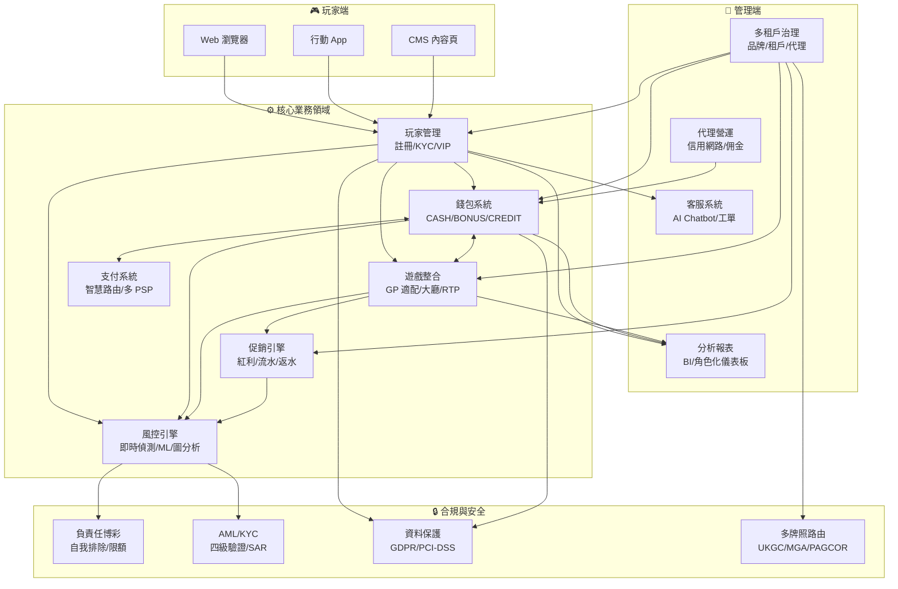
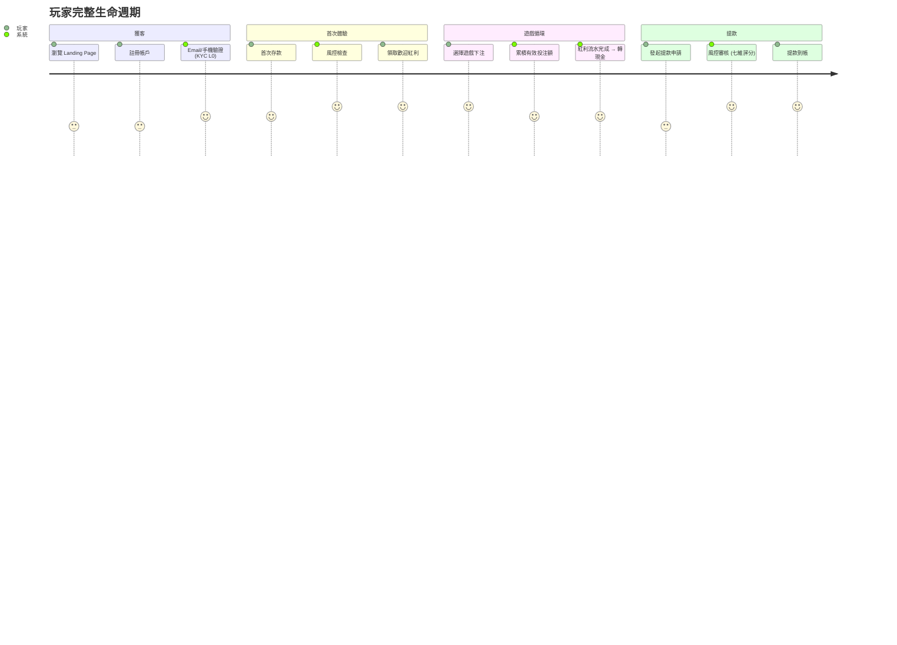
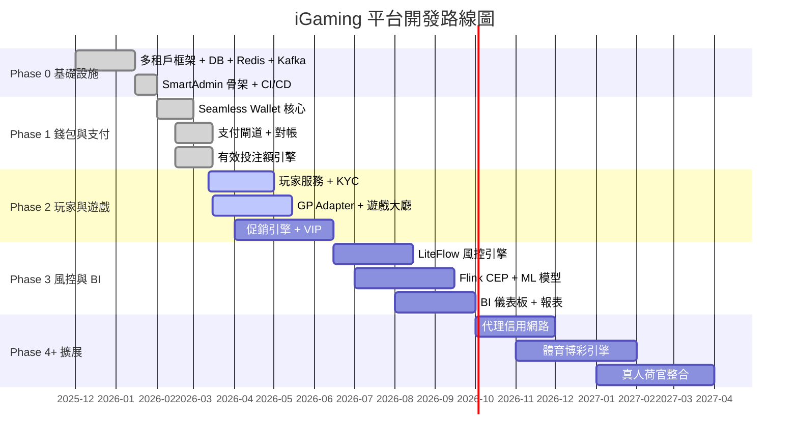

# 第 0 章：平台總覽與核心概念

---

## 0.1 業務概述

### 平台定位

iGaming 平台是一套面向**多品牌、多司法管轄區**的綜合性線上博弈解決方案，支援三種商業模式：

| 模式 | 價格帶 | 適用場景 | 上線時間 | 損益平衡 |
|------|--------|---------|---------|---------|
| 白標 (White Label) | $3K–$8K/月 + 授權 | 快速上線、品牌定制 | 3-6 個月 | 12-18 個月 |
| 交鑰匙 (Turnkey) | $50K–$150K | 全套營運支持 | 6-12 個月 | 18-24 個月 |
| 客製化建置 (Custom Build) | $500K–$1.5M+ | 完全客製化功能 | 12-18 個月 | 24-36 個月 |

**關鍵商業閾值**: 當月度 NGR 超過 $200K 時，白標收益分成成本將超過自建平台攤銷成本。以 $3M NGR、20% 分成計算，每月需支付供應商 $600K。

### 市場規模

全球線上博彩市場 2024 年規模達 $78.7B–$111.4B，預計 2030–2034 年成長至 $153.6B–$277.6B（CAGR 7.1%–12.6%）。

| 細分市場 | 市佔率 | CAGR | 備註 |
|---------|--------|------|------|
| 體育博彩 (Sports Betting) | 50–51.5% | ~12.5% | 成長最快 |
| 線上賭場 (Online Casino) | 48.5–50% | ~7% | 穩定成長 |
| 撲克 (Poker) | <1% | — | 小眾 |

### 區域市場特性

| 區域 | 市佔率 | 特色 | 關鍵數據 |
|------|--------|------|---------|
| 歐洲 | 41–49% | 高度監管、成熟市場、嚴格廣告限制 | UKGC 為最嚴格牌照 |
| 北美 | — | 美國佔區域 47% ($18B+)，CAGR ~18% | 加拿大安大略 CAD 3.34B |
| 拉丁美洲 | — | 巴西為第 5 大市場 (2 億人口)，51% 非法/離岸 | Lei 14.790/2023 |
| 亞太 | — | 預計 2030 年達 $50B (CAGR 12.8%) | 菲律賓為最大合規市場 |

---

## 0.2 業務全景圖

---

> 📎 **SSOT (D-05)**: 本段為引用。權威定義請見 [Ch10 §10.3](./10_Infrastructure_基礎設施需求.md)。變更請至 SSOT 來源。

> 📎 **SSOT (D-06)**: 本段為引用。權威定義請見 [Ch10 §10.4](./10_Infrastructure_基礎設施需求.md)。變更請至 SSOT 來源。

> 📎 **SSOT (D-02)**: 本段為引用。權威定義請見 [Ch6 §6.6](./06_Risk_Compliance_風控與合規.md)。變更請至 SSOT 來源。

## 0.3 五大核心業務領域

以下五個領域佔系統設計考量的 80%：

| # | 領域 | 核心問題 | 計算錯誤的後果 |
|---|------|---------|-------------|
| 1 | **錢包與可下注餘額** | `可下注餘額 = 現金餘額 - 鎖定金額 - 進行中投注` | 多扣 → 玩家投訴；少扣 → 平台虧損 |
| 2 | **有效投注額計算** | `ValidBet = BetAmount × RiskFactor(0/1) × GameWeight(5-100%)` | GGR 報表錯誤、紅利解鎖失敗 |
| 3 | **Token 驗證與 API 安全** | HMAC-SHA256 簽名、5 分鐘有效期、一次性使用、防重放 | 安全漏洞、資金被盜 |
| 4 | **多租戶架構** | 四層層級：平台 → 品牌 → 租戶 → 代理，資料 100% 隔離 | 跨租戶資料洩漏、合規違規 |
| 5 | **風控規則引擎** | 三層即時風控 + 兩層延伸處理（共五層偵測管線） | 漏檢 → 資金損失；誤判 → 玩家流失 |

---

## 0.4 端到端玩家旅程

**生命週期轉化漏斗**:

| 階段 | 轉化率目標 | 說明 |
|------|----------|------|
| 註冊用戶 → 首存用戶 | 30–40% | 首存轉化率 (FDC) |
| 首存用戶 → 活躍用戶 | 40–50% | D30 留存 |
| 活躍用戶 → VIP 玩家 | 10–15% | VIP 轉化 |
| 全週期留存 (12 個月) | 20–30% | 行業基準 |

**關鍵成本指標**:
- 玩家獲客成本 (PAC): $10–$50
- 玩家生命週期價值 (LTV): $500–$5,000
- 行銷投資報酬率 (ROMAS): 3:1 至 5:1

---

## 0.5 核心收入模型

**GGR (Gross Gaming Revenue)** = 總投注額 - 總派彩

- 行業平均 GGR 利潤率: 8–15%
- 白標收益分成: 通常 15–30%
- SaaS 階梯定價: <$500K GGR: 15% / $500K–$1M: 12% / >$1M: 10%

---

## 0.6 開發階段總覽

---

## 0.7 15 模組索引

| # | 模組 | 需求文檔 | 核心職責 |
|---|------|---------|---------|
| 1 | 玩家管理 | [Ch1](./01_Player_Management_玩家管理.md) | 註冊、KYC 四級驗證、VIP、生命週期、RFM 分群 |
| 2 | 錢包系統 | [Ch2](./02_Wallet_System_錢包系統.md) | CASH/BONUS/CREDIT 錢包、可下注餘額、回合管理 |
| 3 | 支付系統 | [Ch3](./03_Payment_System_支付系統.md) | 存提款流程、PSP 路由、對帳機制 |
| 4 | 遊戲整合 | [Ch4](./04_Game_Integration_遊戲整合.md) | GP 接入標準、Token 驗證、遊戲大廳、RTP 監控 |
| 5 | 促銷與 VIP | [Ch5](./05_Promotions_VIP_促銷與VIP.md) | 紅利類型、流水要求、衝突策略 |
| 6 | 風控與合規 | [Ch6](./06_Risk_Compliance_風控與合規.md) | 風控規則、風險評分、KYC/AML、詐欺偵測 |
| 7 | 治理與牌照 | [Ch7](./07_Governance_Licensing_治理與牌照.md) | 多租戶管理、MFA、多司法管轄區 |
| 8 | 代理營運 | [Ch8](./08_Agent_Operations_代理營運.md) | 信用網路、佣金模型、結算 |
| 9 | 分析與報表 | [Ch9](./09_Analytics_Reporting_分析與報表.md) | 角色化儀表板、數據時效、報表分類 |
| 10 | 基礎設施需求 | [Ch10](./10_Infrastructure_基礎設施需求.md) | SLA、DR、效能目標、容量規劃 |
| 11 | 前端體驗 | [Ch11](./11_Frontend_Experience_前端體驗.md) | 多語言、行動 App、SEO |
| 12 | 客戶服務 | [Ch12](./12_Customer_Service_客戶服務.md) | 360° 視圖、AI Chatbot、VIP SLA |
| 13 | 安全合規 | [Ch13](./13_Security_Compliance_安全合規.md) | GDPR、PCI-DSS、資料保護 |
| 14 | 第三方整合 | [Ch14](./14_Third_Party_Integration_第三方整合.md) | 整合標準、供應商 SLA |
| 15 | 負責任博彩 | [Ch15](./15_Responsible_Gambling_負責任博彩.md) | 自我排除、限額、可負擔性評估 |

---

> 📎 **SSOT**: 本段為引用。權威定義請見 [Ch6 §6.6](./06_Risk_Compliance_風控與合規.md)。變更請至 SSOT 來源。

## 0.8 核心術語表

### 投注與流水

| 中文 | 英文 | 定義 | 備註 |
|------|------|------|------|
| 投注額 | Bet Amount | 單次下注的原始金額，一旦確認不可變 | API 欄位: `betAmount` |
| 有效投注額 | Valid Bet | 經風控過濾後的單次投注額 | API 欄位: `validBet` |
| 流水 | Turnover | 一段時間內投注額的累計總和 | 用於 GGR 計算 |
| 流水要求 | Wagering Requirement | 玩家需達到的有效投注總額門檻 | 公式: 存款 × 倍數 |

**有效投注額標準計算法 (Standard Principal Method)**:

| 結算結果 | Valid Bet | 說明 |
|---------|-----------|------|
| WIN (贏) | = Bet Amount | 不受結果影響 |
| LOSS (輸) | = Bet Amount | 不受結果影響 |
| HALF_WIN (半贏) | = Bet Amount | **不是 50%** |
| HALF_LOSS (半輸) | = Bet Amount | **不是 50%** |
| DRAW (和局) | = 0 | 無風險承擔 |
| VOID (作廢) | = 0 | 無風險承擔 |

> 行業參考: Pinnacle、Betfair、Pragmatic Play、Evolution 均採用此方法。

**遊戲權重表 (Game Weight)**:

| 遊戲類型 | 權重 | 特殊規則 |
|---------|------|---------|
| Slots (老虎機) | 100% | — |
| Sports (體育) | 100% | 僅計算實際風險金額 |
| Baccarat (百家樂) | 可配置（預設 10%） | 和局 (Tie) 不計入。SSOT 由 Ch5 促銷模組持有，各活動可獨立配置 |
| Roulette (輪盤) | 20% | 對沖投注不計入 |
| Blackjack (21 點) | 10% | — |
| Poker (撲克) | 5% | — |
| Lottery (彩票) | 15% | — |

### 財務指標

| 中文 | 英文 | 公式 |
|------|------|------|
| 毛博彩收入 | GGR (Gross Gaming Revenue) | 總投注額 - 總派彩 |
| 淨博彩收入 | NGR (Net Gaming Revenue) | GGR - 紅利成本 - 稅金 |
| 玩家返還率 | RTP (Return to Player) | 總派彩 / 總投注額 × 100% |
| 莊家優勢 | House Edge | 1 - RTP |

### 禁用術語

| ❌ 禁用 | ✅ 正確用法 |
|---------|----------|
| 有效流水 (Effective Turnover) | 有效投注額 (Valid Bet) |
| 剩餘流水要求 (Remaining Turnover) | 剩餘流水要求 (Remaining Wagering Requirement) |
| `effectiveTurnover` | `validBet` |
| `turnoverRequirement` | `totalRequirement` |

---

## 0.9 成功指標

| 指標 | 目標 | 說明 |
|------|------|------|
| 錢包計算準確度 | 99.99% | 可下注餘額計算零誤差 |
| 有效投注額計算準確度 | 100% | 公式與行業標準一致 |
| 多租戶資料隔離 | 100% | 零跨租戶資料洩漏 |
| 風控偵測率 | ≥ 90% | 詐欺行為識別率 |
| 平台額外負擔 (多租戶) | < 5% | 效能開銷 |
| 玩家旅程完成率 | ≥ 70% | 註冊 → 首存 → 首注 |

---

## 0.10 平台配置層級架構 (SSOT)

> v2.2 新增 — 全平台可配置參數三層覆蓋架構
> 📎 完整參數註冊表請見 [PRD 可配置參數註冊表](./PRD_Configurable_Parameters_Registry_可配置參數註冊表.md)

所有業務規則中的數值參數（百分比、金額、時間、次數、閾值）皆須透過 DB 配置，不得硬編碼。平台採用三層覆蓋架構：

| 層級 | 說明 | 優先級 | 範例 |
|------|------|--------|------|
| **Jurisdiction** | 管轄區覆蓋 — 監管強制 | 最高 | UKGC slots_max_bet = £2 |
| **Brand** | 品牌覆蓋 — 品牌差異化 | 中 | BrandA welcome_bonus_cap = $300 |
| **Global** | 全域預設 — 平台基礎值 | 最低 | welcome_bonus_cap = $500 |

### 覆蓋解析規則

- **一般參數**: Jurisdiction → Brand → Global（優先級由高到低）
- **合規參數** (`compliance_driven = true`): 最嚴規則適用 (Strictest Rule Applies)
  - `LOWER_IS_STRICTER` 類（投注上限、存款限額）→ 取最小值
  - `HIGHER_IS_STRICTER` 類（KYC 等級、保留年限）→ 取最大值

### 變更管控

- 所有配置變更須記錄完整審計軌跡（who / when / old_value / new_value / reason）
- 合規參數變更須 Maker-Checker 雙人審批
- 配置變更 ≤ 5 秒內生效（Hot-reload）

---

## 0.11 對應技術文檔

> 🔧 **技術實作**: 詳見 [Part 2 Ch0: 架構總覽](../technical/00_Architecture_Overview_架構總覽.md)
