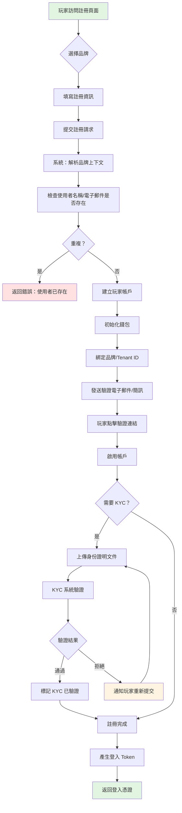
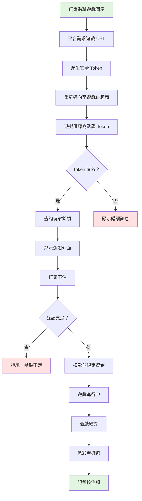
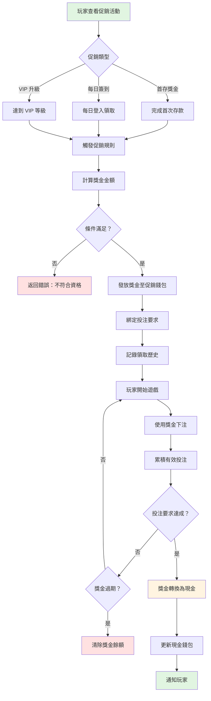
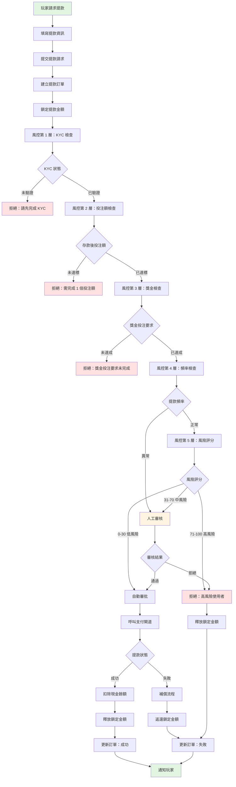
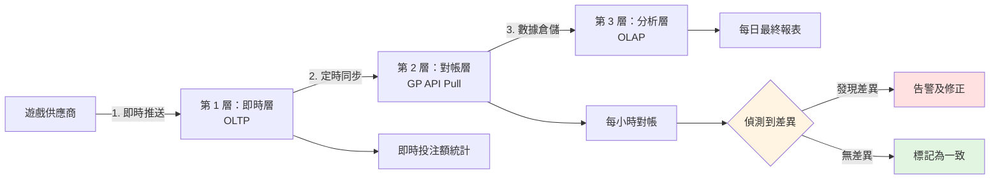
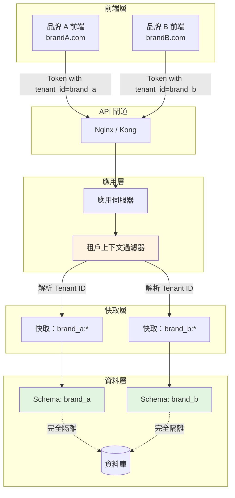

# iGaming 業務流程

> **權威來源**: [source-archive/00_Foundation/00-02_Business_Flows.md](../../source-archive/00_Foundation/00-02_Business_Flows.md)
> **目標讀者**: 高階主管、產品經理、合規人員、QA 團隊
> **相關架構**: [Business_Logic_Flows.md](../../architecture/00_Overview/05_Business_Logic_Flows.md)
> **最後同步**: 2026-02-08

---

## 業務價值

本文件提供以下價值：
- **跨部門對齊**：為高階主管、產品經理、合規人員及 QA 團隊提供統一的業務流程參考，確保對平台運營的一致理解
- **法規合規**：記錄博彩管轄區所要求的合規檢查點（身份驗證 (KYC) 等級、風控 (Risk Control) 檢查）
- **風險緩解**：定義異常處理及自動補償政策，防止玩家 (Player) 資金損失及營運爭議

## 驗收標準

- [ ] 所有 6 個業務流程均包含完整的流程圖、業務規則及異常處理章節
- [ ] 流程圖包含明確的決策節點及通過/拒絕條件（例如 KYC 驗證、投注額 (Turnover) 檢查、風險評分閾值）
- [ ] 技術實作文件的交叉引用已驗證且可正常存取
- [ ] 業務規則符合合規要求（KYC 等級、提款限額、風險評分）
- [ ] 異常處理政策包含錯誤碼及解決程序
- [ ] 文件與架構文件中的技術實作變更保持同步

---

## 文件目的

本文件提供 **6 個端對端業務流程**，從業務角度描述完整的 iGaming 平台運營。每個流程涵蓋使用者旅程、業務規則、合規要求及異常處理——不涉及技術實作細節。

**使用方式**：
1. 選擇與您角色相關的業務流程
2. 查看流程圖以了解整體流程
3. 使用相關文件連結探索技術實作細節

**五大核心業務概念**：
- **錢包 (Wallet)**：可下注餘額 (Playable Balance) 計算、資金鎖定機制
- **投注額 (Turnover)**：有效投注額 (Valid Turnover) 計算、投注累積規則
- **Token**：API 安全驗證、冪等性保證
- **多租戶 (Multi-Tenancy)**：品牌間資料隔離、租戶分配
- **風控 (Risk Control)**：規則引擎決策、風險評分

---

## 流程導覽

| 流程 | 涉及領域 | 關鍵挑戰 | 閱讀時間 |
|------|---------|---------|---------|
| [1. 玩家註冊與 KYC](#1-玩家註冊與-kyc) | 玩家、風控 | 多租戶分配、KYC 驗證 | 5 分鐘 |
| [2. 遊戲啟動與 Token 驗證](#2-遊戲啟動與-token-驗證) | 財務、遊戲 | Token 安全性、冪等性 | 10 分鐘 |
| [3. 獎金發放與投注要求](#3-獎金發放與投注要求) | 促銷、財務 | 獎金計算、投注追蹤 | 8 分鐘 |
| [4. 提款審核與風控](#4-提款審核與風控) | 玩家、風控、財務 | 多層審核、補償流程 | 12 分鐘 |
| [5. 投注額計算與對帳](#5-投注額計算與對帳) | 財務、遊戲 | 三層驗證、資料一致性 | 10 分鐘 |
| [6. 多租戶資料隔離](#6-多租戶資料隔離) | 平台、安全 | Schema 隔離、上下文注入 | 8 分鐘 |

---

## 1. 玩家註冊與 KYC

### 1.1 流程概述

**業務目標**：玩家完成註冊並通過身份驗證，成為合法的平台使用者。

**涉及的核心業務概念**：
- **多租戶**：每次註冊綁定特定品牌（Tenant ID）
- **Token**：註冊成功後產生 JWT Token
- **風控**：KYC 驗證及反欺詐檢查

### 1.2 註冊流程

### 1.3 關鍵業務規則

#### 品牌上下文解析
- 每次玩家註冊必須關聯特定品牌
- 品牌身份在註冊時從域名或 URL 路徑確定
- 確保玩家資料按品牌正確分隔

#### 錢包初始化
建立新玩家帳戶時，系統以下列狀態初始化錢包：

| 屬性 | 初始值 |
|------|-------|
| 現金餘額 | 0 |
| 促銷餘額 | 0 |
| 鎖定金額 | 0 |
| 可下注餘額 | 0 |

#### KYC 驗證等級

| 等級 | 要求 | 提款限額 |
|------|-----|---------|
| L0 | 無 KYC | 禁止提款 |
| L1 | 基本 KYC（姓名 + 身份證號碼） | 每日最高 $1,000 |
| L2 | 增強 KYC（+ 地址證明） | 每日最高 $10,000 |
| L3 | 完整 KYC（+ 銀行驗證） | 無限制 |

**驗證方式**：
- 自動：OCR 身份證件辨識
- 人工審核：針對高風險使用者
- 第三方服務：Jumio、Onfido

### 1.4 異常處理

| 異常情況 | 解決方案 | 錯誤碼 |
|---------|---------|--------|
| 使用者名稱重複 | 提示玩家選擇不同的使用者名稱 | `PLAYER_EXISTS` |
| 電子郵件/手機號碼重複 | 建議找回密碼 | `EMAIL_EXISTS` |
| KYC 驗證失敗 | 允許重新提交（最多 3 次） | `KYC_FAILED` |
| 租戶未找到 | 返回 404 | `TENANT_NOT_FOUND` |

---

## 2. 遊戲啟動與 Token 驗證

### 2.1 流程概述

**業務目標**：玩家從平台安全啟動遊戲，驗證身份並同步資金。

**涉及的核心業務概念**：
- **Token**：HMAC 簽名、過期驗證、防重放
- **錢包**：餘額查詢、資金鎖定
- **投注額**：下注金額記錄

### 2.2 遊戲啟動流程

### 2.3 關鍵業務規則

#### Token 安全要求
- **有效期限**：5 分鐘（防止過期 Token 重用）
- **一次性使用**：Token 首次使用後即失效
- **IP 綁定**：可選，防止 Token 被盜用
- **HMAC 簽名**：確保 Token 完整性及真實性

#### 冪等性保護
系統必須優雅處理網路重試及重複請求：
- 相同的下注請求絕不可導致重複扣款
- 三層保護：快取檢查、資料庫檢查、分散式鎖
- 重複請求返回原始結果，不重新處理

#### 可下注餘額公式

系統中最重要的公式：

> **可下注餘額 = 現金餘額 - 鎖定金額 - 進行中的投注**

| 項目 | 金額 |
|------|------|
| 現金餘額 | $1,000 |
| 鎖定金額（提款處理中） | $200 |
| 進行中的投注（體育投注） | $100 |
| **可下注餘額** | **$700** |

### 2.4 API 互動模式

遊戲供應商整合遵循三步 API 模式：

1. **GetBalance**：遊戲供應商透過安全 Token 查詢玩家餘額
2. **Debit**：玩家下注時，遊戲供應商請求扣款（附帶冪等性請求 ID）
3. **Credit**：遊戲結算時，遊戲供應商請求加款（附帶冪等性請求 ID）

每個 API 呼叫均包含用於冪等性的請求 ID 及用於安全性的 HMAC 簽名。

---

## 3. 獎金發放與投注要求

### 3.1 流程概述

**業務目標**：玩家領取促銷獎金 (Bonus)，並在滿足投注要求 (Wagering Requirements) 後將其轉換為現金。

**涉及的核心業務概念**：
- **獎金**：促銷錢包、投注要求
- **投注額**：有效投注累積、完成度檢查
- **錢包**：獎金轉現金轉換

### 3.2 獎金生命週期流程

### 3.3 關鍵業務規則

#### 獎金計算範例：首存獎金

| 參數 | 值 |
|------|---|
| 資格條件 | 首次存款 >= $100 |
| 獎金比例 | 存款金額的 50% |
| 最高獎金 | $500 |
| 投注倍數 | 20 倍（存款 + 獎金） |

**計算範例**：
- 存款：$200
- 獎金：$200 x 50% = $100
- 投注要求：($200 + $100) x 20 = $6,000

#### 投注累積規則

有效投注的計算公式：

> **有效投注 = 下注金額 x 遊戲權重**

不同遊戲類型的貢獻比例不同：

| 遊戲類型 | 下注金額 | 遊戲權重 | 有效投注 | 累計投注額 |
|---------|---------|---------|---------|----------|
| 老虎機 | $100 | 100% | $100 | $100 |
| 百家樂 | $500 | 10% | $50 | $150 |
| 體育投注 | $200 | 50% | $100 | $250 |

> 有關詳細的遊戲權重表及三層驗證架構，請參閱 [投注額業務規則](../../requirements/03_Gaming_Operations/01_Turnover_Business_Rules.md)。

#### 獎金轉現金規則
- 滿足投注要求時自動轉換
- 最高轉換金額 = 獎金金額（獎金產生的獲利不包含在轉換中）
- 過期獎金歸零且無法轉換

### 3.4 異常處理

| 異常情況 | 解決方案 |
|---------|---------|
| 獎金過期 | 自動清除促銷餘額，通知玩家 |
| 投注要求未達成即提款 | 拒絕提款，顯示剩餘投注要求 |
| 排除遊戲（0% 權重） | 不計入投注要求，記錄於風控系統 |
| 重複領取 | 檢查領取歷史，拒絕重複請求 |

---

## 4. 提款審核與風控

### 4.1 流程概述

**業務目標**：玩家請求提款，經多層風控檢查後進行處理。

**涉及的核心業務概念**：
- **風控**：規則引擎、風險評分
- **錢包**：資金鎖定、自動補償政策
- **多租戶**：不同品牌有不同的提款規則

### 4.2 提款審核流程

### 4.3 關鍵業務規則

#### 資金鎖定政策
- 提款請求建立時立即鎖定資金
- 防止玩家在審核期間使用資金
- 自動審核鎖定時間：5-10 分鐘
- 人工審核鎖定時間：1-24 小時
- 審核拒絕：鎖定資金立即釋放

#### 五層風控檢查

| 層級 | 檢查項目 | 通過條件 | 拒絕結果 |
|------|---------|---------|---------|
| 第 1 層 | KYC 驗證 | KYC 狀態為已驗證 | 「請先完成 KYC」 |
| 第 2 層 | 存款後投注額 | 投注額 >= 1 倍總存款 | 「需完成 1 倍投注額」 |
| 第 3 層 | 獎金投注要求 | 所有活躍獎金投注要求已達成 | 「獎金投注要求未完成」 |
| 第 4 層 | 提款頻率 | 正常頻率模式 | 升級至人工審核 |
| 第 5 層 | 風險評分 | 評分 0-30 自動審批 | 評分 71-100 自動拒絕 |

#### 風險評分因素

| 風險因素 | 分數 | 觸發條件 |
|---------|------|---------|
| 高頻率提款 | +30 | 每日超過 3 次提款 |
| 大額提款 | +40 | 金額 > 總存款的 3 倍 |
| 獎金濫用 | +50 | 僅使用獎金遊戲，無自有資金投注 |
| 新使用者 | +20 | 註冊不足 7 天 |
| IP 異常 | +30 | 頻繁更換 IP |

**決策閾值**：
- 評分 0-30：自動審批
- 評分 31-70：需要人工審核
- 評分 71-100：自動拒絕

#### 自動資金釋放政策

當提款付款在任何階段失敗時，系統確保資金始終恢復至玩家帳戶，即使在分散式故障場景中也是如此。這可防止玩家資金因系統故障而遺失。

**補償政策**：
- 若提款被拒絕或失敗，鎖定資金自動釋放回玩家的可下注餘額
- 所有補償操作均記錄以供審計
- 玩家收到結果通知

→ **[技術實作：SAGA 補償流程](../../architecture/02_Finance_Service/04_Financial_Implementation.md#saga-compensation)**

### 4.4 人工審核流程

**審核介面功能**：
- 玩家檔案（註冊日期、KYC 狀態）
- 存款/提款歷史
- 遊戲記錄（投注明細）
- 風險評分明細
- 一鍵審批/拒絕/要求補充資料

**審核 SLA**：
- 工作日：4 小時內完成
- 非工作日：24 小時內完成

---

## 5. 投注額計算與對帳

### 5.1 流程概述

**業務目標**：準確計算玩家有效投注並確保與遊戲供應商的資料一致性。

**涉及的核心業務概念**：
- **投注額**：三層驗證架構
- **錢包**：資金異動記錄
- **對帳 (Reconciliation)**：即時與批次資料比對

### 5.2 三層驗證架構

### 5.3 關鍵業務規則

#### 第 1 層：即時層（OLTP）
- **資料來源**：遊戲供應商即時推送 Debit/Credit 請求
- **記錄欄位**：bet_id, player_id, game_id, round_id, bet_amount, valid_bet, win_amount, bet_time, settle_time
- **用途**：即時投注額追蹤，用於投注要求進度

#### 第 2 層：對帳層（每小時）

對帳比對平台記錄與遊戲供應商資料：

| 差異類型 | 解決方案 |
|---------|---------|
| 本地記錄缺失 | 從遊戲供應商資料補充 |
| 金額不符 | 修正為遊戲供應商數據（遊戲供應商為權威來源） |
| 多餘本地記錄 | 標記為異常，人工調查 |

#### 第 3 層：分析層（OLAP）
- 數據倉儲處理最終每日報表
- 匯總每位玩家的每日總計：total_bet, total_valid_bet, total_win
- 報表於每日凌晨 2:00 產生

#### 對帳異常政策

**自動修正**：
- 金額差異 < $1：自動修正為遊戲供應商數據
- 時間差異 < 5 分鐘：視為網路延遲，自動匹配

**需要人工介入**：
- 金額差異 > $100：告警通知，人工調查
- 每小時缺失記錄 > 10 筆：告警通知，檢查遊戲供應商 API
- 連續 3 小時對帳失敗：緊急告警，暫停受影響的遊戲

> 有關詳細的投注額計算流程圖及技術實作，請參閱 [投注額流程圖](../../architecture/02_Finance_Service/09_Turnover_Implementation.md)。

---

## 6. 多租戶資料隔離

### 6.1 流程概述

**業務目標**：在單一系統中服務多個品牌，同時確保租戶間完全的資料隔離。

**涉及的核心業務概念**：
- **多租戶**：Schema 隔離、上下文注入
- **安全**：基於 Token 的身份驗證、角色存取控制 (RBAC)
- **報表**：每個租戶獨立的統計資料

### 6.2 多租戶架構概覽

### 6.3 關鍵業務規則

#### 租戶上下文解析
- 每個 API 請求必須關聯一個租戶
- 租戶身份從 JWT Token（已認證請求）或域名/URL 路徑（註冊時）提取
- 租戶上下文在整個請求生命週期中維持

#### 資料隔離保證
- **資料庫層級**：每個租戶擁有獨立的資料庫 Schema；查詢自動範圍限定至正確的 Schema
- **快取層級**：所有快取鍵值以租戶識別碼為前綴（例如 `brand_a:player:wallet:12345`）
- **API 層級**：跨租戶存取被明確阻擋；嘗試存取其他租戶的資料將返回存取拒絕錯誤

#### 多租戶 Token 結構
每個 JWT Token 包含租戶識別碼：
- `sub`：玩家 ID
- `tenant_id`：租戶/品牌 ID（關鍵欄位）
- `roles`：玩家角色（例如 PLAYER）
- `iat`：發行時間戳
- `exp`：過期時間戳（24 小時）

#### 跨租戶存取防護
- 每個資料存取操作都驗證請求的資源屬於當前租戶
- 租戶 ID 不匹配將立即拒絕存取
- 此驗證在應用層及資料庫層均強制執行

### 6.4 安全驗證

**跨租戶存取測試場景**：
1. 品牌 A 建立玩家「Alice」
2. 品牌 B 嘗試存取 Alice 的資料
3. 系統必須以「不允許跨租戶存取」錯誤拒絕存取

此測試驗證租戶隔離在應用層強制執行，而非僅在資料庫層。

---

## 相關文件

→ **[業務邏輯流程 - 技術實作](../../architecture/00_Overview/05_Business_Logic_Flows.md)** - 所有 6 個業務流程的完整技術實作細節、API 規格、資料庫 Schema 及架構模式

---

## 延伸閱讀

### 依難度分級

| 難度 | 流程 | 建議讀者 |
|------|------|---------|
| 入門 | 1. 玩家註冊與 KYC | 產品經理、QA 工程師 |
| 中級 | 3. 獎金發放與投注要求 | 後端開發人員、產品經理 |
| 中級 | 6. 多租戶資料隔離 | 後端開發人員、架構師 |
| 進階 | 2. 遊戲啟動與 Token 驗證 | 後端開發人員、架構師 |
| 進階 | 4. 提款審核與風控 | 後端開發人員、風控專家 |
| 專家 | 5. 投注額計算與對帳 | 後端開發人員、資料工程師 |

### 相關文件

- [業務邏輯流程（架構視圖）](../../architecture/00_Overview/05_Business_Logic_Flows.md) -- 所有 6 個流程的技術實作細節
- [投注額業務規則](../../requirements/03_Gaming_Operations/01_Turnover_Business_Rules.md) -- 詳細的投注及投注額政策
- [投注額流程圖](../../architecture/02_Finance_Service/09_Turnover_Implementation.md) -- 技術性投注額計算圖表

---

**文件版本**：4.0.0
**建立日期**：2026-02-03
**維護團隊**：架構團隊
