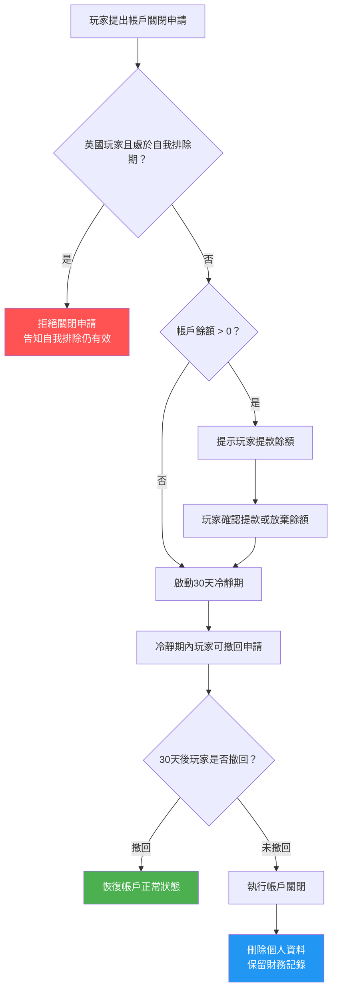

# 帳戶關閉與刪除 (Account Closure and Deletion)

> **規範來源**: GDPR Art. 17、UKGC Player Self-Exclusion 3.5.1、MGA Player Protection Art. 12
> **目標讀者**: PM、合規專員
> **相關架構**: [Account Lifecycle Management](../../architecture/01_Player_Service/03_Account_Lifecycle_Management.md)
> **最後更新**: 2026-04-02

---

## 1. 概述

玩家有權依據 GDPR 第 17 條「被遺忘權 (Right to Erasure)」要求平台刪除其個人資料，也可基於個人意願申請關閉帳戶。帳戶關閉與刪除流程須在保障玩家合法權益的同時，滿足監管機構對財務記錄保存的強制要求，以及防止自我排除 (Self-Exclusion) 玩家透過關閉帳戶規避排除效力的合規要求。

本規範定義了帳戶關閉的申請流程、30 天冷靜期 (Cooling-off Period)、個人資料刪除範圍，以及財務記錄依法保留 7 年的處理方式。對於英國玩家，在自我排除期間不得透過帳戶關閉規避排除效力，系統須強制執行此規則。

---

## 2. 功能需求

### 2.1 帳戶關閉申請流程

### 2.2 帳戶關閉申請管道

| 申請管道 | 處理時限 | 備註 |
|---------|---------|------|
| 線上自助（帳戶設定頁面） | 即時受理，進入冷靜期 | 需通過 MFA 驗證身份 |
| 客服聊天 | 即時受理，進入冷靜期 | 客服記錄申請原因 |
| 電子郵件 | 24 小時內確認受理 | 發送確認郵件至玩家信箱 |
| 書面信件 | 收到後 5 個工作天內受理 | 適用特殊情況 |

### 2.3 冷靜期規則

| 規則 | 說明 |
|------|------|
| 冷靜期長度 | 自申請受理起 **30 天** |
| 冷靜期間帳戶狀態 | 帳戶凍結：不可存款、不可下注；可提款餘額 |
| 撤回申請 | 玩家可在冷靜期內任意時間撤回申請 |
| 撤回方式 | 線上自助或聯繫客服，需通過 MFA 驗證 |
| 撤回後狀態 | 帳戶立即恢復正常，冷靜期記錄保留 |

### 2.4 個人資料刪除範圍

| 資料類型 | 處置方式 | 法律依據 |
|---------|---------|---------|
| 真實姓名、地址 | **刪除**（GDPR 被遺忘權） | GDPR Art. 17 |
| 電子郵件、電話 | **刪除**（GDPR 被遺忘權） | GDPR Art. 17 |
| 身份證件影像 | **刪除**（GDPR 被遺忘權） | GDPR Art. 17 |
| 存提款交易記錄 | **保留 7 年**（財務合規要求）| 反洗錢法規 |
| 博彩交易記錄 | **保留 7 年**（財務合規要求）| 監管要求 |
| KYC 驗證記錄 | **保留 7 年**（反洗錢要求）| AML 法規 |
| 行銷偏好記錄 | **刪除**（無保留必要） | GDPR Art. 17 |

---

## 3. 業務規則

1. **30 天強制冷靜期**: 所有帳戶關閉申請均須經過 30 天冷靜期，不得提供即時關閉選項（緊急情況除外，如疑似帳戶被盜）。
2. **英國玩家自我排除保護**: 英國玩家在自我排除 (Self-Exclusion) 期間申請關閉帳戶，系統必須拒絕，並告知玩家自我排除保護措施仍然有效，直至排除期結束。
3. **餘額處理優先**: 若帳戶有餘額，系統必須在冷靜期開始前提示玩家提款，不得因帳戶關閉流程而扣留合法餘額。
4. **財務記錄永久保留索引**: 帳戶刪除後，系統保留一個匿名化的帳戶 ID 索引，以便在監管查詢時能定位保留的財務記錄，但不包含任何可識別個人身份的資訊。
5. **重新註冊管控**: 已關閉帳戶的玩家可重新註冊，但系統須提示其歷史使用記錄（如有自我排除歷史，須明確告知）。
6. **緊急帳戶凍結**: 若玩家聲稱帳戶被盜，可申請即時凍結（不需冷靜期），帳戶凍結後再啟動關閉流程。

---

## 4. 監管合規

| 法規 | 條款 | 要求 |
|------|------|------|
| GDPR | Art. 17（被遺忘權） | 玩家有權要求刪除個人資料；平台須在 30 天內回應；財務記錄有正當保留理由可例外 |
| UKGC | Player Self-Exclusion 3.5.1 | 英國玩家在自我排除期間不得透過帳戶關閉規避排除效力；平台負有確保執行的責任 |
| MGA | Player Protection Art. 12 | 帳戶關閉流程須包含冷靜期；玩家須收到完整的流程說明；提款請求須在合理時限內處理 |
| 反洗錢法規 | FATF R.11 | 交易記錄保存最少 5 年（平台標準提高至 7 年以涵蓋各司法管轄區要求）|

---

## 5. 驗收標準

- [ ] 玩家透過帳戶設定頁面提交關閉申請後，系統立即啟動 30 天冷靜期並發送確認郵件
- [ ] 冷靜期間帳戶的存款和下注功能被禁用，但提款功能保持正常
- [ ] 英國玩家在自我排除期間提交關閉申請時，系統拒絕申請並顯示說明訊息，不進入冷靜期
- [ ] 玩家可在冷靜期任意時間自助撤回關閉申請，撤回後帳戶立即恢復正常
- [ ] 30 天冷靜期結束後，系統自動執行帳戶關閉（無需人工操作），並發送關閉確認郵件
- [ ] 帳戶關閉後，真實姓名、電話、電子郵件等個人資料在 30 天內完成刪除
- [ ] 財務記錄（存提款、博彩記錄、KYC 文件）在帳戶關閉後保留 7 年
- [ ] 帳戶關閉及資料刪除的完整操作記錄保存於審計日誌，且本身不包含已刪除的個人資料
- [ ] 已關閉帳戶玩家重新註冊時，系統自動提示其歷史自我排除記錄（如有）
