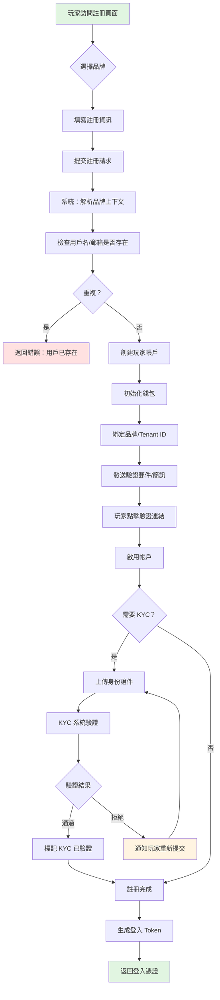
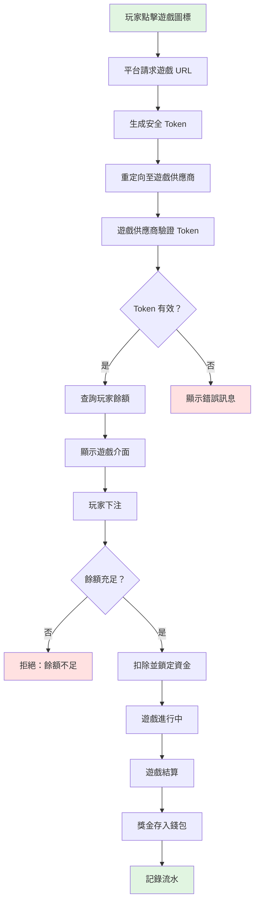
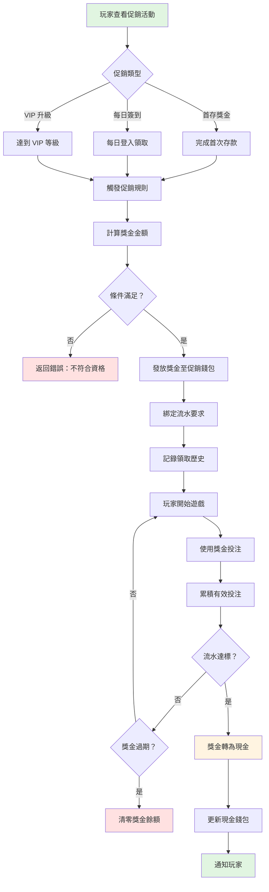
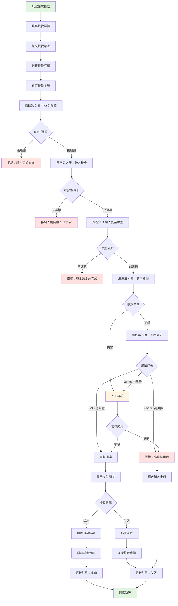
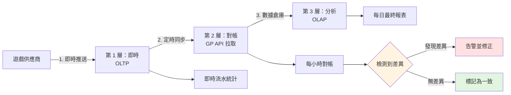
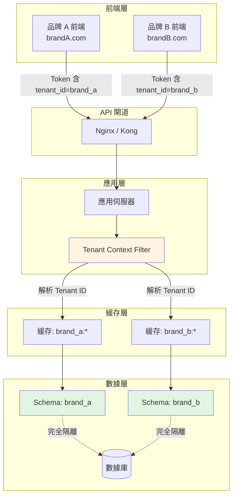

# iGaming 業務流程

> **權威來源**: [source-archive/00_Foundation/00-02_Business_Flows.md](../../source-archive/00_Foundation/00-02_Business_Flows.md)
> **目標讀者**: 高階主管、產品經理、合規專員、QA 團隊
> **相關架構**: [Business_Logic_Flows.md](../../architecture/00_Overview/Business_Logic_Flows.md)
> **最後同步**: 2026-02-08

---

## 業務價值（Business Value）

本文檔提供以下戰略價值：
- **營運清晰度**: 提供 6 個端到端業務流程，涵蓋從註冊到提款的完整玩家生命週期
- **跨職能協作**: 讓高階主管、產品經理、合規專員和 QA 團隊對平台營運有共同理解
- **合規基礎**: 記錄 KYC 驗證等級、風控檢查點和 Multi-Tenant 數據隔離要求，為監管審計做好準備
- **風險緩解**: 定義五層提款審核流程和風險評分因子，防止欺詐和獎金濫用

---

## 驗收標準（Acceptance Criteria）

- [ ] 玩家註冊流程 (Player Registration) 正確從網域/URL 路徑分配租戶上下文 (Tenant Context)
- [ ] 錢包初始化 (Wallet Initialization) 創建全部四個餘額欄位（現金、促銷、鎖定、可下注）並設為零值
- [ ] KYC 驗證 (KYC Verification) 支援三個等級（L1: $1,000/天, L2: $10,000/天, L3: 無限制）
- [ ] 遊戲啟動 Token 在 5 分鐘後過期並強制一次性使用
- [ ] 可下注餘額 (Playable Balance) 計算遵循公式：現金餘額 - 鎖定金額 - 進行中投注
- [ ] 獎金流水 (Bonus Wagering) 使用遊戲特定權重（老虎機 100%、百家樂 10%、體育 50%）
- [ ] 提款審核 (Withdrawal Review) 實施五層風控（KYC → 流水 → 獎金 → 頻率 → 風險評分）
- [ ] 風險評分閾值觸發正確動作（0-30 自動通過、31-70 人工審核、71-100 自動拒絕）
- [ ] 三層流水驗證（即時 OLTP → 小時對帳 → 每日 OLAP）檢測並告警差異
- [ ] Multi-Tenant 數據隔離在應用層和數據庫層防止跨租戶訪問

---

## 文檔用途

本文檔提供 **6 個端到端業務流程**，從業務角度描述完整的 iGaming 平台營運。每個流程涵蓋用戶旅程、業務規則、合規要求和異常處理——不涉及技術實現細節。

**使用方式**：
1. 選擇與您角色相關的業務流程
2. 檢視流程圖以理解整體流程
3. 使用相關文檔連結探索技術實現細節

**五大核心業務概念**：
- **錢包 (Wallet)**: 可下注餘額計算、資金鎖定機制
- **流水 (Turnover)**: 有效投注額 (Valid Turnover) 計算、流水累積規則
- **Token**: API 安全驗證、冪等性保證
- **Multi-Tenancy**: 品牌間數據隔離、租戶分配
- **風控 (Risk Control)**: 規則引擎決策、風險評分

---

## 流程導覽

| 流程 | 涉及領域 | 關鍵挑戰 | 閱讀時間 |
|------|---------|---------|---------|
| [1. 玩家註冊與 KYC](#1-玩家註冊與-kyc) | 玩家、風控 | Multi-Tenant 分配、KYC 驗證 | 5 分鐘 |
| [2. 遊戲啟動與 Token 驗證](#2-遊戲啟動與-token-驗證) | 財務、遊戲 | Token 安全、冪等性 | 10 分鐘 |
| [3. 獎金發放與流水要求](#3-獎金發放與流水要求) | 促銷、財務 | 獎金計算、流水追蹤 | 8 分鐘 |
| [4. 提款審核與風控](#4-提款審核與風控) | 玩家、風控、財務 | 多層審核、補償流程 | 12 分鐘 |
| [5. 流水計算與對帳](#5-流水計算與對帳) | 財務、遊戲 | 三層驗證、數據一致性 | 10 分鐘 |
| [6. Multi-Tenant 數據隔離](#6-multi-tenant-數據隔離) | 平台、安全 | Schema 隔離、上下文注入 | 8 分鐘 |

---

## 1. 玩家註冊與 KYC

### 1.1 流程概述

**業務目標**: 玩家 (Player) 完成註冊並通過身份驗證 (KYC, Know Your Customer)，成為平台合法用戶。

**涉及的關鍵業務概念**：
- **Multi-Tenancy**: 每次註冊都綁定到特定品牌 (Tenant ID)
- **Token**: 註冊成功後生成 JWT Token
- **風控 (Risk Control)**: KYC 驗證和反欺詐檢查

### 1.2 註冊流程

### 1.3 關鍵業務規則

#### 品牌上下文解析
- 每次玩家註冊必須關聯到特定品牌
- 品牌身份在註冊時從網域名稱或 URL 路徑確定
- 這確保玩家數據按品牌正確分隔

#### 錢包初始化
當創建新玩家帳戶時，系統初始化錢包為以下狀態：

| 屬性 | 初始值 |
|-----|-------|
| 現金餘額 (Cash Balance) | 0 |
| 促銷餘額 (Promotional Balance) | 0 |
| 鎖定金額 (Locked Amount) | 0 |
| 可下注餘額 (Playable Balance) | 0 |

#### KYC 驗證等級

| 等級 | 要求 | 提款限額 |
|-----|-----|---------|
| L0 | 無 KYC | 禁止提款 |
| L1 | 基礎 KYC（姓名 + 身份證號） | 最高 $1,000/天 |
| L2 | 增強 KYC（+ 地址證明） | 最高 $10,000/天 |
| L3 | 完整 KYC（+ 銀行驗證） | 無限制 |

**驗證方式**：
- 自動：OCR 身份證件識別
- 人工審核：針對高風險用戶
- 第三方服務：Jumio、Onfido

### 1.4 異常處理

| 異常 | 解決方案 | 錯誤碼 |
|-----|---------|-------|
| 用戶名重複 | 提示玩家選擇不同用戶名 | `PLAYER_EXISTS` |
| 郵箱/電話重複 | 建議密碼找回 | `EMAIL_EXISTS` |
| KYC 驗證失敗 | 允許重新提交（最多 3 次） | `KYC_FAILED` |
| 租戶未找到 | 返回 404 | `TENANT_NOT_FOUND` |

---

## 2. 遊戲啟動與 Token 驗證

### 2.1 流程概述

**業務目標**: 玩家從平台安全啟動遊戲，身份已驗證且資金已同步。

**涉及的關鍵業務概念**：
- **Token**: HMAC 簽名、過期驗證、防重放
- **錢包 (Wallet)**: 餘額查詢、資金鎖定
- **流水 (Turnover)**: 投注金額記錄

### 2.2 遊戲啟動流程

### 2.3 關鍵業務規則

#### Token 安全要求
- **有效期**: 5 分鐘（防止過期 Token 重用）
- **一次性使用**: Token 在首次使用後即失效
- **IP 綁定**: 可選，防止 Token 被盜用
- **HMAC 簽名**: 確保 Token 完整性和真實性

#### 冪等性保護
系統必須優雅處理網路重試和重複請求：
- 相同投注請求絕不能導致重複扣款
- 三層保護：緩存檢查、數據庫檢查、分佈式鎖
- 重複請求返回原始結果，不重新處理

#### 可下注餘額公式

系統中最重要的公式：

> **可下注餘額 (Playable Balance) = 現金餘額 - 鎖定金額 - 進行中投注**

| 項目 | 金額 |
|-----|------|
| 現金餘額 (Cash Balance) | $1,000 |
| 鎖定金額（提款中） | $200 |
| 進行中投注（體育投注） | $100 |
| **可下注餘額** | **$700** |

### 2.4 API 互動模式

遊戲供應商整合遵循三步 API 模式：

1. **GetBalance**: 遊戲供應商通過安全 Token 查詢玩家餘額
2. **Debit**: 遊戲供應商在玩家下注時請求扣款（帶冪等請求 ID）
3. **Credit**: 遊戲供應商在遊戲結算時請求加款（帶冪等請求 ID）

每個 API 調用都包含請求 ID 用於冪等性，以及 HMAC 簽名用於安全性。

---

## 3. 獎金發放與流水要求

### 3.1 流程概述

**業務目標**: 玩家領取促銷獎金 (Bonus)，並在滿足流水要求 (Wagering Requirement) 後將其轉換為現金。

**涉及的關鍵業務概念**：
- **獎金 (Bonus)**: 促銷錢包、流水要求
- **流水 (Turnover)**: 有效投注累積、完成度檢查
- **錢包 (Wallet)**: 獎金轉現金

### 3.2 獎金生命週期流程

### 3.3 關鍵業務規則

#### 獎金計算範例：首存獎金 (First Deposit Bonus)

| 參數 | 值 |
|-----|---|
| 資格條件 | 首次存款 >= $100 |
| 獎金比例 | 存款金額的 50% |
| 最高獎金 | $500 |
| 流水倍數 (Wagering Multiplier) | 20 倍（存款 + 獎金） |

**計算範例**：
- 存款: $200
- 獎金: $200 x 50% = $100
- 流水要求: ($200 + $100) x 20 = $6,000

#### 流水累積規則

有效投注 (Valid Bet) 按以下方式計入流水：

> **有效投注 = 投注金額 × 遊戲權重 (Game Weight)**

不同遊戲類型的貢獻率不同：

| 遊戲類型 | 投注金額 | 遊戲權重 | 有效投注 | 累計流水 |
|---------|---------|---------|---------|---------|
| 老虎機 (Slots) | $100 | 100% | $100 | $100 |
| 百家樂 (Baccarat) | $500 | 10% | $50 | $150 |
| 體育投注 (Sports Betting) | $200 | 50% | $100 | $250 |

> 詳細遊戲權重表和三層驗證架構，請參閱 [流水業務規則](../../requirements/03_Gaming_Operations/Turnover_Business_Rules.md)。

#### 獎金轉現金規則
- 當流水要求達標時自動轉換
- 最大轉換金額 = 獎金金額（獎金贏利不計入轉換）
- 過期獎金清零，無法轉換

### 3.4 異常處理

| 異常 | 解決方案 |
|-----|---------|
| 獎金過期 | 自動清零促銷餘額，通知玩家 |
| 流水未達標時提款 | 拒絕提款，顯示剩餘流水要求 |
| 排除遊戲（0% 權重） | 不計入流水，記錄至風控系統 |
| 重複領取 | 檢查領取歷史，拒絕重複 |

---

## 4. 提款審核與風控

### 4.1 流程概述

**業務目標**: 玩家請求提款 (Withdrawal)，經過多層風控檢查後處理。

**涉及的關鍵業務概念**：
- **風控 (Risk Control)**: 規則引擎、風險評分 (Risk Score)
- **錢包 (Wallet)**: 資金鎖定、自動補償策略
- **Multi-Tenancy**: 不同品牌有不同的提款規則

### 4.2 提款審核流程

### 4.3 關鍵業務規則

#### 資金鎖定策略
- 提款請求創建時立即鎖定資金
- 防止玩家在審核期間使用資金
- 自動審核鎖定期：5-10 分鐘
- 人工審核鎖定期：1-24 小時
- 審核拒絕：鎖定資金立即釋放

#### 五層風控檢查

| 層級 | 檢查項目 | 通過條件 | 拒絕原因 |
|-----|---------|---------|---------|
| 第 1 層 | KYC 驗證 | KYC 狀態為已驗證 | 「請先完成 KYC」 |
| 第 2 層 | 存款後流水 | 流水 >= 總存款的 1 倍 | 「需完成 1 倍流水」 |
| 第 3 層 | 獎金流水 | 所有有效獎金流水要求已達標 | 「獎金流水未完成」 |
| 第 4 層 | 提款頻率 | 正常頻率模式 | 轉人工審核 |
| 第 5 層 | 風險評分 | 評分 0-30 自動通過 | 評分 71-100 自動拒絕 |

#### 風險評分因子

| 風險因子 | 分數 | 觸發條件 |
|---------|-----|---------|
| 高頻提款 | +30 | 每天超過 3 次提款 |
| 大額提款 | +40 | 金額 > 總存款的 3 倍 |
| 獎金濫用 | +50 | 僅使用獎金遊戲，無自有資金投注 |
| 新用戶 | +20 | 註冊不到 7 天 |
| IP 異常 | +30 | 頻繁更換 IP |

**決策閾值**：
- 評分 0-30：自動通過
- 評分 31-70：需人工審核
- 評分 71-100：自動拒絕

#### 自動資金釋放策略

當提款支付在任何階段失敗時，系統確保資金始終恢復到玩家帳戶，即使在分佈式故障場景下也是如此。這防止玩家資金因系統故障而丟失。

**補償策略**：
- 如果提款被拒絕或失敗，鎖定資金自動釋放回玩家可下注餘額 (Playable Balance)
- 所有補償動作記錄用於審計目的
- 玩家收到結果通知

→ **[技術實現：SAGA 補償流程](../../architecture/02_Finance_Service/Financial_Implementation.md#saga-compensation)**

### 4.4 人工審核流程

**審核介面功能**：
- 玩家檔案（註冊日期、KYC 狀態）
- 存款/提款歷史
- 遊戲記錄（投注詳情）
- 風險評分明細
- 一鍵通過/拒絕/請求補充資料

**審核 SLA**：
- 工作日：4 小時內完成
- 非工作日：24 小時內完成

---

## 5. 流水計算與對帳

### 5.1 流程概述

**業務目標**: 準確計算玩家有效投注 (Valid Bet)，確保與遊戲供應商數據一致。

**涉及的關鍵業務概念**：
- **流水 (Turnover)**: 三層驗證架構
- **錢包 (Wallet)**: 資金變動記錄
- **對帳 (Reconciliation)**: 即時 vs 批次數據比對

### 5.2 三層驗證架構

### 5.3 關鍵業務規則

#### 第 1 層：即時層（OLTP）
- **數據來源**: 遊戲供應商即時推送 Debit/Credit 請求
- **記錄內容**: bet_id, player_id, game_id, round_id, bet_amount, valid_bet, win_amount, bet_time, settle_time
- **用途**: 即時流水追蹤用於流水進度

#### 第 2 層：對帳層（每小時）

對帳比較平台記錄與遊戲供應商數據：

| 差異類型 | 解決方案 |
|---------|---------|
| 本地記錄缺失 | 從 GP 數據補充 |
| 金額不符 | 修正為 GP 值（GP 為權威來源） |
| 本地多餘記錄 | 標記為異常，人工調查 |

#### 第 3 層：分析層（OLAP）
- 數據倉庫處理最終每日報表
- 彙總每玩家每日總計：total_bet、total_valid_bet、total_win
- 報表於每日凌晨 2:00 生成

#### 對帳異常策略

**自動修正**：
- 金額差異 < $1：自動修正為 GP 值
- 時間差異 < 5 分鐘：視為網路延遲，自動匹配

**需人工介入**：
- 金額差異 > $100：告警通知，人工調查
- 缺失記錄 > 10 筆/小時：告警通知，檢查 GP API
- 連續 3 小時對帳失敗：緊急告警，暫停受影響遊戲

> 詳細流水計算流程圖和技術實現，請參閱 [流水流程圖](../../architecture/02_Finance_Service/Turnover_Flowcharts.md)。

---

## 6. Multi-Tenant 數據隔離

### 6.1 流程概述

**業務目標**: 在單一系統中服務多個品牌，同時確保租戶間數據完全隔離。

**涉及的關鍵業務概念**：
- **Multi-Tenancy**: Schema 隔離、上下文注入
- **安全 (Security)**: Token 認證、角色存取控制 (RBAC)
- **報表 (Reporting)**: 每租戶獨立統計

### 6.2 Multi-Tenant 架構概覽

### 6.3 關鍵業務規則

#### Tenant 上下文解析
- 每個 API 請求必須關聯一個租戶
- 租戶身份從 JWT Token（已認證請求）或網域/URL 路徑（註冊時）提取
- Tenant 上下文在整個請求生命週期中維持

#### 數據隔離保證
- **數據庫層**: 每個租戶有自己的數據庫 Schema；查詢自動限定到正確的 Schema
- **緩存層**: 所有緩存鍵以租戶標識為前綴（如 `brand_a:player:wallet:12345`）
- **API 層**: 明確阻止跨租戶訪問；嘗試訪問另一租戶的數據返回拒絕訪問錯誤

#### Multi-Tenancy 的 Token 結構
每個 JWT Token 包含租戶標識：
- `sub`: 玩家 ID
- `tenant_id`: 租戶/品牌 ID（關鍵欄位）
- `roles`: 玩家角色（如 PLAYER）
- `iat`: 簽發時間戳
- `exp`: 過期時間戳（24 小時）

#### 跨租戶訪問防護
- 每次數據訪問操作驗證請求資源屬於當前租戶
- Tenant ID 不匹配導致立即拒絕訪問
- 此驗證在應用層和數據庫層同時執行

### 6.4 安全驗證

**跨租戶訪問測試場景**：
1. 品牌 A 創建玩家 "Alice"
2. 品牌 B 嘗試訪問 Alice 的數據
3. 系統必須拒絕訪問並返回「跨租戶訪問不允許」錯誤

此測試驗證租戶隔離在應用層執行，而不僅僅是數據庫層。

---

## 相關文檔

→ **[業務邏輯流程 - 技術實現](../../architecture/00_Overview/Business_Logic_Flows.md)** - 全部 6 個業務流程的完整技術實現細節、API 規格、數據庫 Schema 和架構模式

---

## 延伸閱讀

### 按難度等級

| 難度 | 流程 | 建議對象 |
|-----|------|---------|
| 入門 | 1. 玩家註冊與 KYC | 產品經理、QA 工程師 |
| 中級 | 3. 獎金發放與流水要求 | 後端開發、產品經理 |
| 中級 | 6. Multi-Tenant 數據隔離 | 後端開發、架構師 |
| 進階 | 2. 遊戲啟動與 Token 驗證 | 後端開發、架構師 |
| 進階 | 4. 提款審核與風控 | 後端開發、風控專員 |
| 專家 | 5. 流水計算與對帳 | 後端開發、數據工程師 |

### 相關文檔

- [業務邏輯流程（架構視圖）](../../architecture/00_Overview/Business_Logic_Flows.md) -- 全部 6 個流程的技術實現細節
- [流水業務規則](../../requirements/03_Gaming_Operations/Turnover_Business_Rules.md) -- 詳細流水和投注策略
- [流水流程圖](../../architecture/02_Finance_Service/Turnover_Flowcharts.md) -- 技術流水計算圖表

---

**文檔版本**: 4.0.0
**創建日期**: 2026-02-03
**維護者**: 架構團隊
